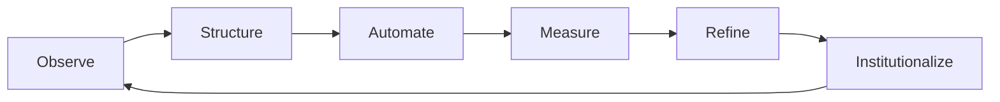

# Clarity Loop: A Practical Guide to Thinking, Building, and Improving
## A Technical Novel Manuscript (Expanded Edition)
### by Paul A.K. Iyogun

> Target print length: ~350 pages (6x9 trade trim) when rendered with `generate_novel_pdf.py`.

## Table of Contents

1. Chapter 1 - The Map Room Without a Map (Chaos Seen Clearly)
2. Chapter 2 - The Scan Backlog (Chaos Seen Clearly)
3. Chapter 3 - Incident at 2:13 A.M. (Chaos Seen Clearly)
4. Chapter 4 - The Executive Dashboard That Lied (Chaos Seen Clearly)
5. Chapter 5 - A Schema Is a Promise (Structure Before Speed)
6. Chapter 6 - Address Wars (Structure Before Speed)
7. Chapter 7 - The Metadata Hearing (Structure Before Speed)
8. Chapter 8 - Boundaries of the Platform (Structure Before Speed)
9. Chapter 9 - Pipelines and Fault Lines (Automation Under Control)
10. Chapter 10 - Script Debt (Automation Under Control)
11. Chapter 11 - The QA Gate (Automation Under Control)
12. Chapter 12 - Rollback Night (Automation Under Control)
13. Chapter 13 - Before the Model (Intelligence with Accountability)
14. Chapter 14 - Confidence Routing (Intelligence with Accountability)
15. Chapter 15 - Anomalies on District 7 (Intelligence with Accountability)
16. Chapter 16 - The Cost of a False Alert (Intelligence with Accountability)
17. Chapter 17 - Policy in Production (Institutionalizing the Loop)
18. Chapter 18 - The Continuity Test (Institutionalizing the Loop)
19. Chapter 19 - One Winter Later (Institutionalizing the Loop)
20. Chapter 20 - The Standing Council (Institutionalizing the Loop)

---

## Main Cast

- **Adrian Vale** - core member of the North River County transformation program.
- **Marisol Chen** - core member of the North River County transformation program.
- **DeShawn Pike** - core member of the North River County transformation program.
- **Nina Alvarado** - core member of the North River County transformation program.
- **Rahul Menon** - core member of the North River County transformation program.
- **Lena Okafor** - core member of the North River County transformation program.
- **Tyce Hammond** - core member of the North River County transformation program.
- **Eli Navarro** - core member of the North River County transformation program.
- **Marta Quinn** - core member of the North River County transformation program.
- **Robert Keane** - core member of the North River County transformation program.
- **Dr. Simone Kade** - core member of the North River County transformation program.

## Part I - Chaos Seen Clearly

## Chapter 1 - The Map Room Without a Map

### Architecture Diagram

### Scene 1.1 - Operational Thread
At 17:07, DeShawn Pike and Lena Okafor reviewed the county modernization queue and discovered audit evidence gaps inside a workflow that had been marked healthy for three consecutive reporting cycles. Instead of escalating by instinct, they ran a contract test sweep, traced every dependency handoff, and asked each team to name what evidence would prove stability for the next shift. They aligned GIS operators, data engineering, and policy owners on one shared incident timeline so corrective work could be audited without reinterpretation.

The team then rebuilt the decision path in writing: intake source, schema checks, automation branch, human verification checkpoint, publication gate, and post-release telemetry review. Every step included explicit ownership, rollback criteria, and a communication channel so incident response could continue even when key staff were offline. By documenting tradeoffs in plain language, they prevented technical shorthand from excluding non-engineering leaders whose approvals affected delivery speed and legal exposure.

Before closing the thread, they compared live metrics against contractual service levels, reconciled disagreements in open session, and assigned one steward to publish daily status notes. They tagged assumptions as testable hypotheses, linked every risk statement to a measurable signal, and scheduled follow-up audits at intervals short enough to detect drift before residents felt service degradation.

The room settled around a hard-earned principle: local knowledge deserves a durable system of record. That principle became tomorrow's checklist item, then next month's governance control, and eventually the default operating behavior for new hires entering the program. In that repeated discipline, the team discovered that institutional memory can be designed just as carefully as software architecture.

#### Reflection Prompts
- Which dependency in this thread lacks enforceable ownership?
- What telemetry would have surfaced this issue one day earlier?
- Which control should graduate from temporary fix to formal policy?

### Scene 1.2 - Operational Thread
At 18:14, Nina Alvarado and Tyce Hammond reviewed the county modernization queue and discovered token expiration failures inside a workflow that had been marked healthy for three consecutive reporting cycles. Instead of escalating by instinct, they opened a blameless review, traced every dependency handoff, and asked each team to name what evidence would prove stability for the next shift. They aligned GIS operators, data engineering, and policy owners on one shared incident timeline so corrective work could be audited without reinterpretation.

The team then rebuilt the decision path in writing: intake source, schema checks, automation branch, human verification checkpoint, publication gate, and post-release telemetry review. Every step included explicit ownership, rollback criteria, and a communication channel so incident response could continue even when key staff were offline. By documenting tradeoffs in plain language, they prevented technical shorthand from excluding non-engineering leaders whose approvals affected delivery speed and legal exposure.

Before closing the thread, they compared live metrics against contractual service levels, reconciled disagreements in open session, and assigned one steward to publish daily status notes. They tagged assumptions as testable hypotheses, linked every risk statement to a measurable signal, and scheduled follow-up audits at intervals short enough to detect drift before residents felt service degradation.

The room settled around a hard-earned principle: speed without structure only moves failure downstream. That principle became tomorrow's checklist item, then next month's governance control, and eventually the default operating behavior for new hires entering the program. In that repeated discipline, the team discovered that institutional memory can be designed just as carefully as software architecture.

#### Reflection Prompts
- Which dependency in this thread lacks enforceable ownership?
- What telemetry would have surfaced this issue one day earlier?
- Which control should graduate from temporary fix to formal policy?

### Scene 1.3 - Operational Thread
At 19:21, Rahul Menon and Eli Navarro reviewed the county modernization queue and discovered geometry drift across CRS boundaries inside a workflow that had been marked healthy for three consecutive reporting cycles. Instead of escalating by instinct, they staged a blue/green cutover, traced every dependency handoff, and asked each team to name what evidence would prove stability for the next shift. They aligned GIS operators, data engineering, and policy owners on one shared incident timeline so corrective work could be audited without reinterpretation.

The team then rebuilt the decision path in writing: intake source, schema checks, automation branch, human verification checkpoint, publication gate, and post-release telemetry review. Every step included explicit ownership, rollback criteria, and a communication channel so incident response could continue even when key staff were offline. By documenting tradeoffs in plain language, they prevented technical shorthand from excluding non-engineering leaders whose approvals affected delivery speed and legal exposure.

Before closing the thread, they compared live metrics against contractual service levels, reconciled disagreements in open session, and assigned one steward to publish daily status notes. They tagged assumptions as testable hypotheses, linked every risk statement to a measurable signal, and scheduled follow-up audits at intervals short enough to detect drift before residents felt service degradation.

The room settled around a hard-earned principle: evidence beats confidence when budgets are contested. That principle became tomorrow's checklist item, then next month's governance control, and eventually the default operating behavior for new hires entering the program. In that repeated discipline, the team discovered that institutional memory can be designed just as carefully as software architecture.

#### Reflection Prompts
- Which dependency in this thread lacks enforceable ownership?
- What telemetry would have surfaced this issue one day earlier?
- Which control should graduate from temporary fix to formal policy?

### Scene 1.4 - Operational Thread
At 20:28, Lena Okafor and Marta Quinn reviewed the county modernization queue and discovered stale metadata ownership inside a workflow that had been marked healthy for three consecutive reporting cycles. Instead of escalating by instinct, they assembled a joint command desk, traced every dependency handoff, and asked each team to name what evidence would prove stability for the next shift. They aligned GIS operators, data engineering, and policy owners on one shared incident timeline so corrective work could be audited without reinterpretation.

The team then rebuilt the decision path in writing: intake source, schema checks, automation branch, human verification checkpoint, publication gate, and post-release telemetry review. Every step included explicit ownership, rollback criteria, and a communication channel so incident response could continue even when key staff were offline. By documenting tradeoffs in plain language, they prevented technical shorthand from excluding non-engineering leaders whose approvals affected delivery speed and legal exposure.

Before closing the thread, they compared live metrics against contractual service levels, reconciled disagreements in open session, and assigned one steward to publish daily status notes. They tagged assumptions as testable hypotheses, linked every risk statement to a measurable signal, and scheduled follow-up audits at intervals short enough to detect drift before residents felt service degradation.

The room settled around a hard-earned principle: small defects become governance crises when left unnamed. That principle became tomorrow's checklist item, then next month's governance control, and eventually the default operating behavior for new hires entering the program. In that repeated discipline, the team discovered that institutional memory can be designed just as carefully as software architecture.

#### Reflection Prompts
- Which dependency in this thread lacks enforceable ownership?
- What telemetry would have surfaced this issue one day earlier?
- Which control should graduate from temporary fix to formal policy?

### Scene 1.5 - Operational Thread
At 21:35, Tyce Hammond and Robert Keane reviewed the county modernization queue and discovered silent ETL retries inside a workflow that had been marked healthy for three consecutive reporting cycles. Instead of escalating by instinct, they updated runbooks with decision gates, traced every dependency handoff, and asked each team to name what evidence would prove stability for the next shift. They aligned GIS operators, data engineering, and policy owners on one shared incident timeline so corrective work could be audited without reinterpretation.

The team then rebuilt the decision path in writing: intake source, schema checks, automation branch, human verification checkpoint, publication gate, and post-release telemetry review. Every step included explicit ownership, rollback criteria, and a communication channel so incident response could continue even when key staff were offline. By documenting tradeoffs in plain language, they prevented technical shorthand from excluding non-engineering leaders whose approvals affected delivery speed and legal exposure.

Before closing the thread, they compared live metrics against contractual service levels, reconciled disagreements in open session, and assigned one steward to publish daily status notes. They tagged assumptions as testable hypotheses, linked every risk statement to a measurable signal, and scheduled follow-up audits at intervals short enough to detect drift before residents felt service degradation.

The room settled around a hard-earned principle: automation should surface uncertainty, not hide it. That principle became tomorrow's checklist item, then next month's governance control, and eventually the default operating behavior for new hires entering the program. In that repeated discipline, the team discovered that institutional memory can be designed just as carefully as software architecture.

#### Reflection Prompts
- Which dependency in this thread lacks enforceable ownership?
- What telemetry would have surfaced this issue one day earlier?
- Which control should graduate from temporary fix to formal policy?

### Scene 1.6 - Operational Thread
At 16:42, Eli Navarro and Dr. Simone Kade reviewed the county modernization queue and discovered dashboard latency masking outages inside a workflow that had been marked healthy for three consecutive reporting cycles. Instead of escalating by instinct, they reconciled timestamp offsets, traced every dependency handoff, and asked each team to name what evidence would prove stability for the next shift. They aligned GIS operators, data engineering, and policy owners on one shared incident timeline so corrective work could be audited without reinterpretation.

The team then rebuilt the decision path in writing: intake source, schema checks, automation branch, human verification checkpoint, publication gate, and post-release telemetry review. Every step included explicit ownership, rollback criteria, and a communication channel so incident response could continue even when key staff were offline. By documenting tradeoffs in plain language, they prevented technical shorthand from excluding non-engineering leaders whose approvals affected delivery speed and legal exposure.

Before closing the thread, they compared live metrics against contractual service levels, reconciled disagreements in open session, and assigned one steward to publish daily status notes. They tagged assumptions as testable hypotheses, linked every risk statement to a measurable signal, and scheduled follow-up audits at intervals short enough to detect drift before residents felt service degradation.

The room settled around a hard-earned principle: controls must be practiced before they are audited. That principle became tomorrow's checklist item, then next month's governance control, and eventually the default operating behavior for new hires entering the program. In that repeated discipline, the team discovered that institutional memory can be designed just as carefully as software architecture.

#### Reflection Prompts
- Which dependency in this thread lacks enforceable ownership?
- What telemetry would have surfaced this issue one day earlier?
- Which control should graduate from temporary fix to formal policy?

### Scene 1.7 - Operational Thread
At 17:49, Marta Quinn and Adrian Vale reviewed the county modernization queue and discovered misaligned QA rules inside a workflow that had been marked healthy for three consecutive reporting cycles. Instead of escalating by instinct, they ran a contract test sweep, traced every dependency handoff, and asked each team to name what evidence would prove stability for the next shift. They aligned GIS operators, data engineering, and policy owners on one shared incident timeline so corrective work could be audited without reinterpretation.

The team then rebuilt the decision path in writing: intake source, schema checks, automation branch, human verification checkpoint, publication gate, and post-release telemetry review. Every step included explicit ownership, rollback criteria, and a communication channel so incident response could continue even when key staff were offline. By documenting tradeoffs in plain language, they prevented technical shorthand from excluding non-engineering leaders whose approvals affected delivery speed and legal exposure.

Before closing the thread, they compared live metrics against contractual service levels, reconciled disagreements in open session, and assigned one steward to publish daily status notes. They tagged assumptions as testable hypotheses, linked every risk statement to a measurable signal, and scheduled follow-up audits at intervals short enough to detect drift before residents felt service degradation.

The room settled around a hard-earned principle: local knowledge deserves a durable system of record. That principle became tomorrow's checklist item, then next month's governance control, and eventually the default operating behavior for new hires entering the program. In that repeated discipline, the team discovered that institutional memory can be designed just as carefully as software architecture.

#### Reflection Prompts
- Which dependency in this thread lacks enforceable ownership?
- What telemetry would have surfaced this issue one day earlier?
- Which control should graduate from temporary fix to formal policy?

### Scene 1.8 - Operational Thread
At 18:56, Robert Keane and Marisol Chen reviewed the county modernization queue and discovered training-label ambiguity inside a workflow that had been marked healthy for three consecutive reporting cycles. Instead of escalating by instinct, they opened a blameless review, traced every dependency handoff, and asked each team to name what evidence would prove stability for the next shift. They aligned GIS operators, data engineering, and policy owners on one shared incident timeline so corrective work could be audited without reinterpretation.

The team then rebuilt the decision path in writing: intake source, schema checks, automation branch, human verification checkpoint, publication gate, and post-release telemetry review. Every step included explicit ownership, rollback criteria, and a communication channel so incident response could continue even when key staff were offline. By documenting tradeoffs in plain language, they prevented technical shorthand from excluding non-engineering leaders whose approvals affected delivery speed and legal exposure.

Before closing the thread, they compared live metrics against contractual service levels, reconciled disagreements in open session, and assigned one steward to publish daily status notes. They tagged assumptions as testable hypotheses, linked every risk statement to a measurable signal, and scheduled follow-up audits at intervals short enough to detect drift before residents felt service degradation.

The room settled around a hard-earned principle: speed without structure only moves failure downstream. That principle became tomorrow's checklist item, then next month's governance control, and eventually the default operating behavior for new hires entering the program. In that repeated discipline, the team discovered that institutional memory can be designed just as carefully as software architecture.

#### Reflection Prompts
- Which dependency in this thread lacks enforceable ownership?
- What telemetry would have surfaced this issue one day earlier?
- Which control should graduate from temporary fix to formal policy?

### Scene 1.9 - Operational Thread
At 19:03, Dr. Simone Kade and DeShawn Pike reviewed the county modernization queue and discovered false-positive anomaly bursts inside a workflow that had been marked healthy for three consecutive reporting cycles. Instead of escalating by instinct, they staged a blue/green cutover, traced every dependency handoff, and asked each team to name what evidence would prove stability for the next shift. They aligned GIS operators, data engineering, and policy owners on one shared incident timeline so corrective work could be audited without reinterpretation.

The team then rebuilt the decision path in writing: intake source, schema checks, automation branch, human verification checkpoint, publication gate, and post-release telemetry review. Every step included explicit ownership, rollback criteria, and a communication channel so incident response could continue even when key staff were offline. By documenting tradeoffs in plain language, they prevented technical shorthand from excluding non-engineering leaders whose approvals affected delivery speed and legal exposure.

Before closing the thread, they compared live metrics against contractual service levels, reconciled disagreements in open session, and assigned one steward to publish daily status notes. They tagged assumptions as testable hypotheses, linked every risk statement to a measurable signal, and scheduled follow-up audits at intervals short enough to detect drift before residents felt service degradation.

The room settled around a hard-earned principle: evidence beats confidence when budgets are contested. That principle became tomorrow's checklist item, then next month's governance control, and eventually the default operating behavior for new hires entering the program. In that repeated discipline, the team discovered that institutional memory can be designed just as carefully as software architecture.

#### Reflection Prompts
- Which dependency in this thread lacks enforceable ownership?
- What telemetry would have surfaced this issue one day earlier?
- Which control should graduate from temporary fix to formal policy?

### Scene 1.10 - Operational Thread
At 20:10, Adrian Vale and Nina Alvarado reviewed the county modernization queue and discovered rollback package drift inside a workflow that had been marked healthy for three consecutive reporting cycles. Instead of escalating by instinct, they assembled a joint command desk, traced every dependency handoff, and asked each team to name what evidence would prove stability for the next shift. They aligned GIS operators, data engineering, and policy owners on one shared incident timeline so corrective work could be audited without reinterpretation.

The team then rebuilt the decision path in writing: intake source, schema checks, automation branch, human verification checkpoint, publication gate, and post-release telemetry review. Every step included explicit ownership, rollback criteria, and a communication channel so incident response could continue even when key staff were offline. By documenting tradeoffs in plain language, they prevented technical shorthand from excluding non-engineering leaders whose approvals affected delivery speed and legal exposure.

Before closing the thread, they compared live metrics against contractual service levels, reconciled disagreements in open session, and assigned one steward to publish daily status notes. They tagged assumptions as testable hypotheses, linked every risk statement to a measurable signal, and scheduled follow-up audits at intervals short enough to detect drift before residents felt service degradation.

The room settled around a hard-earned principle: small defects become governance crises when left unnamed. That principle became tomorrow's checklist item, then next month's governance control, and eventually the default operating behavior for new hires entering the program. In that repeated discipline, the team discovered that institutional memory can be designed just as carefully as software architecture.

#### Reflection Prompts
- Which dependency in this thread lacks enforceable ownership?
- What telemetry would have surfaced this issue one day earlier?
- Which control should graduate from temporary fix to formal policy?

### Scene 1.11 - Operational Thread
At 21:17, Marisol Chen and Rahul Menon reviewed the county modernization queue and discovered policy exceptions without traceability inside a workflow that had been marked healthy for three consecutive reporting cycles. Instead of escalating by instinct, they updated runbooks with decision gates, traced every dependency handoff, and asked each team to name what evidence would prove stability for the next shift. They aligned GIS operators, data engineering, and policy owners on one shared incident timeline so corrective work could be audited without reinterpretation.

The team then rebuilt the decision path in writing: intake source, schema checks, automation branch, human verification checkpoint, publication gate, and post-release telemetry review. Every step included explicit ownership, rollback criteria, and a communication channel so incident response could continue even when key staff were offline. By documenting tradeoffs in plain language, they prevented technical shorthand from excluding non-engineering leaders whose approvals affected delivery speed and legal exposure.

Before closing the thread, they compared live metrics against contractual service levels, reconciled disagreements in open session, and assigned one steward to publish daily status notes. They tagged assumptions as testable hypotheses, linked every risk statement to a measurable signal, and scheduled follow-up audits at intervals short enough to detect drift before residents felt service degradation.

The room settled around a hard-earned principle: automation should surface uncertainty, not hide it. That principle became tomorrow's checklist item, then next month's governance control, and eventually the default operating behavior for new hires entering the program. In that repeated discipline, the team discovered that institutional memory can be designed just as carefully as software architecture.

#### Reflection Prompts
- Which dependency in this thread lacks enforceable ownership?
- What telemetry would have surfaced this issue one day earlier?
- Which control should graduate from temporary fix to formal policy?

### Scene 1.12 - Operational Thread
At 16:24, DeShawn Pike and Lena Okafor reviewed the county modernization queue and discovered manual override leakage inside a workflow that had been marked healthy for three consecutive reporting cycles. Instead of escalating by instinct, they reconciled timestamp offsets, traced every dependency handoff, and asked each team to name what evidence would prove stability for the next shift. They aligned GIS operators, data engineering, and policy owners on one shared incident timeline so corrective work could be audited without reinterpretation.

The team then rebuilt the decision path in writing: intake source, schema checks, automation branch, human verification checkpoint, publication gate, and post-release telemetry review. Every step included explicit ownership, rollback criteria, and a communication channel so incident response could continue even when key staff were offline. By documenting tradeoffs in plain language, they prevented technical shorthand from excluding non-engineering leaders whose approvals affected delivery speed and legal exposure.

Before closing the thread, they compared live metrics against contractual service levels, reconciled disagreements in open session, and assigned one steward to publish daily status notes. They tagged assumptions as testable hypotheses, linked every risk statement to a measurable signal, and scheduled follow-up audits at intervals short enough to detect drift before residents felt service degradation.

The room settled around a hard-earned principle: controls must be practiced before they are audited. That principle became tomorrow's checklist item, then next month's governance control, and eventually the default operating behavior for new hires entering the program. In that repeated discipline, the team discovered that institutional memory can be designed just as carefully as software architecture.

#### Reflection Prompts
- Which dependency in this thread lacks enforceable ownership?
- What telemetry would have surfaced this issue one day earlier?
- Which control should graduate from temporary fix to formal policy?

### Scene 1.13 - Operational Thread
At 17:31, Nina Alvarado and Tyce Hammond reviewed the county modernization queue and discovered audit evidence gaps inside a workflow that had been marked healthy for three consecutive reporting cycles. Instead of escalating by instinct, they ran a contract test sweep, traced every dependency handoff, and asked each team to name what evidence would prove stability for the next shift. They aligned GIS operators, data engineering, and policy owners on one shared incident timeline so corrective work could be audited without reinterpretation.

The team then rebuilt the decision path in writing: intake source, schema checks, automation branch, human verification checkpoint, publication gate, and post-release telemetry review. Every step included explicit ownership, rollback criteria, and a communication channel so incident response could continue even when key staff were offline. By documenting tradeoffs in plain language, they prevented technical shorthand from excluding non-engineering leaders whose approvals affected delivery speed and legal exposure.

Before closing the thread, they compared live metrics against contractual service levels, reconciled disagreements in open session, and assigned one steward to publish daily status notes. They tagged assumptions as testable hypotheses, linked every risk statement to a measurable signal, and scheduled follow-up audits at intervals short enough to detect drift before residents felt service degradation.

The room settled around a hard-earned principle: local knowledge deserves a durable system of record. That principle became tomorrow's checklist item, then next month's governance control, and eventually the default operating behavior for new hires entering the program. In that repeated discipline, the team discovered that institutional memory can be designed just as carefully as software architecture.

#### Reflection Prompts
- Which dependency in this thread lacks enforceable ownership?
- What telemetry would have surfaced this issue one day earlier?
- Which control should graduate from temporary fix to formal policy?

### Scene 1.14 - Operational Thread
At 18:38, Rahul Menon and Eli Navarro reviewed the county modernization queue and discovered token expiration failures inside a workflow that had been marked healthy for three consecutive reporting cycles. Instead of escalating by instinct, they opened a blameless review, traced every dependency handoff, and asked each team to name what evidence would prove stability for the next shift. They aligned GIS operators, data engineering, and policy owners on one shared incident timeline so corrective work could be audited without reinterpretation.

The team then rebuilt the decision path in writing: intake source, schema checks, automation branch, human verification checkpoint, publication gate, and post-release telemetry review. Every step included explicit ownership, rollback criteria, and a communication channel so incident response could continue even when key staff were offline. By documenting tradeoffs in plain language, they prevented technical shorthand from excluding non-engineering leaders whose approvals affected delivery speed and legal exposure.

Before closing the thread, they compared live metrics against contractual service levels, reconciled disagreements in open session, and assigned one steward to publish daily status notes. They tagged assumptions as testable hypotheses, linked every risk statement to a measurable signal, and scheduled follow-up audits at intervals short enough to detect drift before residents felt service degradation.

The room settled around a hard-earned principle: speed without structure only moves failure downstream. That principle became tomorrow's checklist item, then next month's governance control, and eventually the default operating behavior for new hires entering the program. In that repeated discipline, the team discovered that institutional memory can be designed just as carefully as software architecture.

#### Reflection Prompts
- Which dependency in this thread lacks enforceable ownership?
- What telemetry would have surfaced this issue one day earlier?
- Which control should graduate from temporary fix to formal policy?

### Scene 1.15 - Operational Thread
At 19:45, Lena Okafor and Marta Quinn reviewed the county modernization queue and discovered geometry drift across CRS boundaries inside a workflow that had been marked healthy for three consecutive reporting cycles. Instead of escalating by instinct, they staged a blue/green cutover, traced every dependency handoff, and asked each team to name what evidence would prove stability for the next shift. They aligned GIS operators, data engineering, and policy owners on one shared incident timeline so corrective work could be audited without reinterpretation.

The team then rebuilt the decision path in writing: intake source, schema checks, automation branch, human verification checkpoint, publication gate, and post-release telemetry review. Every step included explicit ownership, rollback criteria, and a communication channel so incident response could continue even when key staff were offline. By documenting tradeoffs in plain language, they prevented technical shorthand from excluding non-engineering leaders whose approvals affected delivery speed and legal exposure.

Before closing the thread, they compared live metrics against contractual service levels, reconciled disagreements in open session, and assigned one steward to publish daily status notes. They tagged assumptions as testable hypotheses, linked every risk statement to a measurable signal, and scheduled follow-up audits at intervals short enough to detect drift before residents felt service degradation.

The room settled around a hard-earned principle: evidence beats confidence when budgets are contested. That principle became tomorrow's checklist item, then next month's governance control, and eventually the default operating behavior for new hires entering the program. In that repeated discipline, the team discovered that institutional memory can be designed just as carefully as software architecture.

#### Reflection Prompts
- Which dependency in this thread lacks enforceable ownership?
- What telemetry would have surfaced this issue one day earlier?
- Which control should graduate from temporary fix to formal policy?

### Scene 1.16 - Operational Thread
At 20:52, Tyce Hammond and Robert Keane reviewed the county modernization queue and discovered stale metadata ownership inside a workflow that had been marked healthy for three consecutive reporting cycles. Instead of escalating by instinct, they assembled a joint command desk, traced every dependency handoff, and asked each team to name what evidence would prove stability for the next shift. They aligned GIS operators, data engineering, and policy owners on one shared incident timeline so corrective work could be audited without reinterpretation.

The team then rebuilt the decision path in writing: intake source, schema checks, automation branch, human verification checkpoint, publication gate, and post-release telemetry review. Every step included explicit ownership, rollback criteria, and a communication channel so incident response could continue even when key staff were offline. By documenting tradeoffs in plain language, they prevented technical shorthand from excluding non-engineering leaders whose approvals affected delivery speed and legal exposure.

Before closing the thread, they compared live metrics against contractual service levels, reconciled disagreements in open session, and assigned one steward to publish daily status notes. They tagged assumptions as testable hypotheses, linked every risk statement to a measurable signal, and scheduled follow-up audits at intervals short enough to detect drift before residents felt service degradation.

The room settled around a hard-earned principle: small defects become governance crises when left unnamed. That principle became tomorrow's checklist item, then next month's governance control, and eventually the default operating behavior for new hires entering the program. In that repeated discipline, the team discovered that institutional memory can be designed just as carefully as software architecture.

#### Reflection Prompts
- Which dependency in this thread lacks enforceable ownership?
- What telemetry would have surfaced this issue one day earlier?
- Which control should graduate from temporary fix to formal policy?

### Scene 1.17 - Operational Thread
At 21:59, Eli Navarro and Dr. Simone Kade reviewed the county modernization queue and discovered silent ETL retries inside a workflow that had been marked healthy for three consecutive reporting cycles. Instead of escalating by instinct, they updated runbooks with decision gates, traced every dependency handoff, and asked each team to name what evidence would prove stability for the next shift. They aligned GIS operators, data engineering, and policy owners on one shared incident timeline so corrective work could be audited without reinterpretation.

The team then rebuilt the decision path in writing: intake source, schema checks, automation branch, human verification checkpoint, publication gate, and post-release telemetry review. Every step included explicit ownership, rollback criteria, and a communication channel so incident response could continue even when key staff were offline. By documenting tradeoffs in plain language, they prevented technical shorthand from excluding non-engineering leaders whose approvals affected delivery speed and legal exposure.

Before closing the thread, they compared live metrics against contractual service levels, reconciled disagreements in open session, and assigned one steward to publish daily status notes. They tagged assumptions as testable hypotheses, linked every risk statement to a measurable signal, and scheduled follow-up audits at intervals short enough to detect drift before residents felt service degradation.

The room settled around a hard-earned principle: automation should surface uncertainty, not hide it. That principle became tomorrow's checklist item, then next month's governance control, and eventually the default operating behavior for new hires entering the program. In that repeated discipline, the team discovered that institutional memory can be designed just as carefully as software architecture.

#### Reflection Prompts
- Which dependency in this thread lacks enforceable ownership?
- What telemetry would have surfaced this issue one day earlier?
- Which control should graduate from temporary fix to formal policy?

### Scene 1.18 - Operational Thread
At 16:06, Marta Quinn and Adrian Vale reviewed the county modernization queue and discovered dashboard latency masking outages inside a workflow that had been marked healthy for three consecutive reporting cycles. Instead of escalating by instinct, they reconciled timestamp offsets, traced every dependency handoff, and asked each team to name what evidence would prove stability for the next shift. They aligned GIS operators, data engineering, and policy owners on one shared incident timeline so corrective work could be audited without reinterpretation.

The team then rebuilt the decision path in writing: intake source, schema checks, automation branch, human verification checkpoint, publication gate, and post-release telemetry review. Every step included explicit ownership, rollback criteria, and a communication channel so incident response could continue even when key staff were offline. By documenting tradeoffs in plain language, they prevented technical shorthand from excluding non-engineering leaders whose approvals affected delivery speed and legal exposure.

Before closing the thread, they compared live metrics against contractual service levels, reconciled disagreements in open session, and assigned one steward to publish daily status notes. They tagged assumptions as testable hypotheses, linked every risk statement to a measurable signal, and scheduled follow-up audits at intervals short enough to detect drift before residents felt service degradation.

The room settled around a hard-earned principle: controls must be practiced before they are audited. That principle became tomorrow's checklist item, then next month's governance control, and eventually the default operating behavior for new hires entering the program. In that repeated discipline, the team discovered that institutional memory can be designed just as carefully as software architecture.

#### Reflection Prompts
- Which dependency in this thread lacks enforceable ownership?
- What telemetry would have surfaced this issue one day earlier?
- Which control should graduate from temporary fix to formal policy?

### Scene 1.19 - Operational Thread
At 17:13, Robert Keane and Marisol Chen reviewed the county modernization queue and discovered misaligned QA rules inside a workflow that had been marked healthy for three consecutive reporting cycles. Instead of escalating by instinct, they ran a contract test sweep, traced every dependency handoff, and asked each team to name what evidence would prove stability for the next shift. They aligned GIS operators, data engineering, and policy owners on one shared incident timeline so corrective work could be audited without reinterpretation.

The team then rebuilt the decision path in writing: intake source, schema checks, automation branch, human verification checkpoint, publication gate, and post-release telemetry review. Every step included explicit ownership, rollback criteria, and a communication channel so incident response could continue even when key staff were offline. By documenting tradeoffs in plain language, they prevented technical shorthand from excluding non-engineering leaders whose approvals affected delivery speed and legal exposure.

Before closing the thread, they compared live metrics against contractual service levels, reconciled disagreements in open session, and assigned one steward to publish daily status notes. They tagged assumptions as testable hypotheses, linked every risk statement to a measurable signal, and scheduled follow-up audits at intervals short enough to detect drift before residents felt service degradation.

The room settled around a hard-earned principle: local knowledge deserves a durable system of record. That principle became tomorrow's checklist item, then next month's governance control, and eventually the default operating behavior for new hires entering the program. In that repeated discipline, the team discovered that institutional memory can be designed just as carefully as software architecture.

#### Reflection Prompts
- Which dependency in this thread lacks enforceable ownership?
- What telemetry would have surfaced this issue one day earlier?
- Which control should graduate from temporary fix to formal policy?

### Scene 1.20 - Operational Thread
At 18:20, Dr. Simone Kade and DeShawn Pike reviewed the county modernization queue and discovered training-label ambiguity inside a workflow that had been marked healthy for three consecutive reporting cycles. Instead of escalating by instinct, they opened a blameless review, traced every dependency handoff, and asked each team to name what evidence would prove stability for the next shift. They aligned GIS operators, data engineering, and policy owners on one shared incident timeline so corrective work could be audited without reinterpretation.

The team then rebuilt the decision path in writing: intake source, schema checks, automation branch, human verification checkpoint, publication gate, and post-release telemetry review. Every step included explicit ownership, rollback criteria, and a communication channel so incident response could continue even when key staff were offline. By documenting tradeoffs in plain language, they prevented technical shorthand from excluding non-engineering leaders whose approvals affected delivery speed and legal exposure.

Before closing the thread, they compared live metrics against contractual service levels, reconciled disagreements in open session, and assigned one steward to publish daily status notes. They tagged assumptions as testable hypotheses, linked every risk statement to a measurable signal, and scheduled follow-up audits at intervals short enough to detect drift before residents felt service degradation.

The room settled around a hard-earned principle: speed without structure only moves failure downstream. That principle became tomorrow's checklist item, then next month's governance control, and eventually the default operating behavior for new hires entering the program. In that repeated discipline, the team discovered that institutional memory can be designed just as carefully as software architecture.

#### Reflection Prompts
- Which dependency in this thread lacks enforceable ownership?
- What telemetry would have surfaced this issue one day earlier?
- Which control should graduate from temporary fix to formal policy?

### Scene 1.21 - Operational Thread
At 19:27, Adrian Vale and Nina Alvarado reviewed the county modernization queue and discovered false-positive anomaly bursts inside a workflow that had been marked healthy for three consecutive reporting cycles. Instead of escalating by instinct, they staged a blue/green cutover, traced every dependency handoff, and asked each team to name what evidence would prove stability for the next shift. They aligned GIS operators, data engineering, and policy owners on one shared incident timeline so corrective work could be audited without reinterpretation.

The team then rebuilt the decision path in writing: intake source, schema checks, automation branch, human verification checkpoint, publication gate, and post-release telemetry review. Every step included explicit ownership, rollback criteria, and a communication channel so incident response could continue even when key staff were offline. By documenting tradeoffs in plain language, they prevented technical shorthand from excluding non-engineering leaders whose approvals affected delivery speed and legal exposure.

Before closing the thread, they compared live metrics against contractual service levels, reconciled disagreements in open session, and assigned one steward to publish daily status notes. They tagged assumptions as testable hypotheses, linked every risk statement to a measurable signal, and scheduled follow-up audits at intervals short enough to detect drift before residents felt service degradation.

The room settled around a hard-earned principle: evidence beats confidence when budgets are contested. That principle became tomorrow's checklist item, then next month's governance control, and eventually the default operating behavior for new hires entering the program. In that repeated discipline, the team discovered that institutional memory can be designed just as carefully as software architecture.

#### Reflection Prompts
- Which dependency in this thread lacks enforceable ownership?
- What telemetry would have surfaced this issue one day earlier?
- Which control should graduate from temporary fix to formal policy?

### Scene 1.22 - Operational Thread
At 20:34, Marisol Chen and Rahul Menon reviewed the county modernization queue and discovered rollback package drift inside a workflow that had been marked healthy for three consecutive reporting cycles. Instead of escalating by instinct, they assembled a joint command desk, traced every dependency handoff, and asked each team to name what evidence would prove stability for the next shift. They aligned GIS operators, data engineering, and policy owners on one shared incident timeline so corrective work could be audited without reinterpretation.

The team then rebuilt the decision path in writing: intake source, schema checks, automation branch, human verification checkpoint, publication gate, and post-release telemetry review. Every step included explicit ownership, rollback criteria, and a communication channel so incident response could continue even when key staff were offline. By documenting tradeoffs in plain language, they prevented technical shorthand from excluding non-engineering leaders whose approvals affected delivery speed and legal exposure.

Before closing the thread, they compared live metrics against contractual service levels, reconciled disagreements in open session, and assigned one steward to publish daily status notes. They tagged assumptions as testable hypotheses, linked every risk statement to a measurable signal, and scheduled follow-up audits at intervals short enough to detect drift before residents felt service degradation.

The room settled around a hard-earned principle: small defects become governance crises when left unnamed. That principle became tomorrow's checklist item, then next month's governance control, and eventually the default operating behavior for new hires entering the program. In that repeated discipline, the team discovered that institutional memory can be designed just as carefully as software architecture.

#### Reflection Prompts
- Which dependency in this thread lacks enforceable ownership?
- What telemetry would have surfaced this issue one day earlier?
- Which control should graduate from temporary fix to formal policy?

### Scene 1.23 - Operational Thread
At 21:41, DeShawn Pike and Lena Okafor reviewed the county modernization queue and discovered policy exceptions without traceability inside a workflow that had been marked healthy for three consecutive reporting cycles. Instead of escalating by instinct, they updated runbooks with decision gates, traced every dependency handoff, and asked each team to name what evidence would prove stability for the next shift. They aligned GIS operators, data engineering, and policy owners on one shared incident timeline so corrective work could be audited without reinterpretation.

The team then rebuilt the decision path in writing: intake source, schema checks, automation branch, human verification checkpoint, publication gate, and post-release telemetry review. Every step included explicit ownership, rollback criteria, and a communication channel so incident response could continue even when key staff were offline. By documenting tradeoffs in plain language, they prevented technical shorthand from excluding non-engineering leaders whose approvals affected delivery speed and legal exposure.

Before closing the thread, they compared live metrics against contractual service levels, reconciled disagreements in open session, and assigned one steward to publish daily status notes. They tagged assumptions as testable hypotheses, linked every risk statement to a measurable signal, and scheduled follow-up audits at intervals short enough to detect drift before residents felt service degradation.

The room settled around a hard-earned principle: automation should surface uncertainty, not hide it. That principle became tomorrow's checklist item, then next month's governance control, and eventually the default operating behavior for new hires entering the program. In that repeated discipline, the team discovered that institutional memory can be designed just as carefully as software architecture.

#### Reflection Prompts
- Which dependency in this thread lacks enforceable ownership?
- What telemetry would have surfaced this issue one day earlier?
- Which control should graduate from temporary fix to formal policy?

### Scene 1.24 - Operational Thread
At 16:48, Nina Alvarado and Tyce Hammond reviewed the county modernization queue and discovered manual override leakage inside a workflow that had been marked healthy for three consecutive reporting cycles. Instead of escalating by instinct, they reconciled timestamp offsets, traced every dependency handoff, and asked each team to name what evidence would prove stability for the next shift. They aligned GIS operators, data engineering, and policy owners on one shared incident timeline so corrective work could be audited without reinterpretation.

The team then rebuilt the decision path in writing: intake source, schema checks, automation branch, human verification checkpoint, publication gate, and post-release telemetry review. Every step included explicit ownership, rollback criteria, and a communication channel so incident response could continue even when key staff were offline. By documenting tradeoffs in plain language, they prevented technical shorthand from excluding non-engineering leaders whose approvals affected delivery speed and legal exposure.

Before closing the thread, they compared live metrics against contractual service levels, reconciled disagreements in open session, and assigned one steward to publish daily status notes. They tagged assumptions as testable hypotheses, linked every risk statement to a measurable signal, and scheduled follow-up audits at intervals short enough to detect drift before residents felt service degradation.

The room settled around a hard-earned principle: controls must be practiced before they are audited. That principle became tomorrow's checklist item, then next month's governance control, and eventually the default operating behavior for new hires entering the program. In that repeated discipline, the team discovered that institutional memory can be designed just as carefully as software architecture.

#### Reflection Prompts
- Which dependency in this thread lacks enforceable ownership?
- What telemetry would have surfaced this issue one day earlier?
- Which control should graduate from temporary fix to formal policy?

### Scene 1.25 - Operational Thread
At 17:55, Rahul Menon and Eli Navarro reviewed the county modernization queue and discovered audit evidence gaps inside a workflow that had been marked healthy for three consecutive reporting cycles. Instead of escalating by instinct, they ran a contract test sweep, traced every dependency handoff, and asked each team to name what evidence would prove stability for the next shift. They aligned GIS operators, data engineering, and policy owners on one shared incident timeline so corrective work could be audited without reinterpretation.

The team then rebuilt the decision path in writing: intake source, schema checks, automation branch, human verification checkpoint, publication gate, and post-release telemetry review. Every step included explicit ownership, rollback criteria, and a communication channel so incident response could continue even when key staff were offline. By documenting tradeoffs in plain language, they prevented technical shorthand from excluding non-engineering leaders whose approvals affected delivery speed and legal exposure.

Before closing the thread, they compared live metrics against contractual service levels, reconciled disagreements in open session, and assigned one steward to publish daily status notes. They tagged assumptions as testable hypotheses, linked every risk statement to a measurable signal, and scheduled follow-up audits at intervals short enough to detect drift before residents felt service degradation.

The room settled around a hard-earned principle: local knowledge deserves a durable system of record. That principle became tomorrow's checklist item, then next month's governance control, and eventually the default operating behavior for new hires entering the program. In that repeated discipline, the team discovered that institutional memory can be designed just as carefully as software architecture.

#### Reflection Prompts
- Which dependency in this thread lacks enforceable ownership?
- What telemetry would have surfaced this issue one day earlier?
- Which control should graduate from temporary fix to formal policy?

### Scene 1.26 - Operational Thread
At 18:02, Lena Okafor and Marta Quinn reviewed the county modernization queue and discovered token expiration failures inside a workflow that had been marked healthy for three consecutive reporting cycles. Instead of escalating by instinct, they opened a blameless review, traced every dependency handoff, and asked each team to name what evidence would prove stability for the next shift. They aligned GIS operators, data engineering, and policy owners on one shared incident timeline so corrective work could be audited without reinterpretation.

The team then rebuilt the decision path in writing: intake source, schema checks, automation branch, human verification checkpoint, publication gate, and post-release telemetry review. Every step included explicit ownership, rollback criteria, and a communication channel so incident response could continue even when key staff were offline. By documenting tradeoffs in plain language, they prevented technical shorthand from excluding non-engineering leaders whose approvals affected delivery speed and legal exposure.

Before closing the thread, they compared live metrics against contractual service levels, reconciled disagreements in open session, and assigned one steward to publish daily status notes. They tagged assumptions as testable hypotheses, linked every risk statement to a measurable signal, and scheduled follow-up audits at intervals short enough to detect drift before residents felt service degradation.

The room settled around a hard-earned principle: speed without structure only moves failure downstream. That principle became tomorrow's checklist item, then next month's governance control, and eventually the default operating behavior for new hires entering the program. In that repeated discipline, the team discovered that institutional memory can be designed just as carefully as software architecture.

#### Reflection Prompts
- Which dependency in this thread lacks enforceable ownership?
- What telemetry would have surfaced this issue one day earlier?
- Which control should graduate from temporary fix to formal policy?

### Scene 1.27 - Operational Thread
At 19:09, Tyce Hammond and Robert Keane reviewed the county modernization queue and discovered geometry drift across CRS boundaries inside a workflow that had been marked healthy for three consecutive reporting cycles. Instead of escalating by instinct, they staged a blue/green cutover, traced every dependency handoff, and asked each team to name what evidence would prove stability for the next shift. They aligned GIS operators, data engineering, and policy owners on one shared incident timeline so corrective work could be audited without reinterpretation.

The team then rebuilt the decision path in writing: intake source, schema checks, automation branch, human verification checkpoint, publication gate, and post-release telemetry review. Every step included explicit ownership, rollback criteria, and a communication channel so incident response could continue even when key staff were offline. By documenting tradeoffs in plain language, they prevented technical shorthand from excluding non-engineering leaders whose approvals affected delivery speed and legal exposure.

Before closing the thread, they compared live metrics against contractual service levels, reconciled disagreements in open session, and assigned one steward to publish daily status notes. They tagged assumptions as testable hypotheses, linked every risk statement to a measurable signal, and scheduled follow-up audits at intervals short enough to detect drift before residents felt service degradation.

The room settled around a hard-earned principle: evidence beats confidence when budgets are contested. That principle became tomorrow's checklist item, then next month's governance control, and eventually the default operating behavior for new hires entering the program. In that repeated discipline, the team discovered that institutional memory can be designed just as carefully as software architecture.

#### Reflection Prompts
- Which dependency in this thread lacks enforceable ownership?
- What telemetry would have surfaced this issue one day earlier?
- Which control should graduate from temporary fix to formal policy?

### Scene 1.28 - Operational Thread
At 20:16, Eli Navarro and Dr. Simone Kade reviewed the county modernization queue and discovered stale metadata ownership inside a workflow that had been marked healthy for three consecutive reporting cycles. Instead of escalating by instinct, they assembled a joint command desk, traced every dependency handoff, and asked each team to name what evidence would prove stability for the next shift. They aligned GIS operators, data engineering, and policy owners on one shared incident timeline so corrective work could be audited without reinterpretation.

The team then rebuilt the decision path in writing: intake source, schema checks, automation branch, human verification checkpoint, publication gate, and post-release telemetry review. Every step included explicit ownership, rollback criteria, and a communication channel so incident response could continue even when key staff were offline. By documenting tradeoffs in plain language, they prevented technical shorthand from excluding non-engineering leaders whose approvals affected delivery speed and legal exposure.

Before closing the thread, they compared live metrics against contractual service levels, reconciled disagreements in open session, and assigned one steward to publish daily status notes. They tagged assumptions as testable hypotheses, linked every risk statement to a measurable signal, and scheduled follow-up audits at intervals short enough to detect drift before residents felt service degradation.

The room settled around a hard-earned principle: small defects become governance crises when left unnamed. That principle became tomorrow's checklist item, then next month's governance control, and eventually the default operating behavior for new hires entering the program. In that repeated discipline, the team discovered that institutional memory can be designed just as carefully as software architecture.

#### Reflection Prompts
- Which dependency in this thread lacks enforceable ownership?
- What telemetry would have surfaced this issue one day earlier?
- Which control should graduate from temporary fix to formal policy?

## Chapter 2 - The Scan Backlog

### Architecture Diagram

### Scene 2.1 - Operational Thread
At 17:07, Nina Alvarado and Tyce Hammond reviewed the county modernization queue and discovered token expiration failures inside a workflow that had been marked healthy for three consecutive reporting cycles. Instead of escalating by instinct, they froze deployment windows, traced every dependency handoff, and asked each team to name what evidence would prove stability for the next shift. They aligned GIS operators, data engineering, and policy owners on one shared incident timeline so corrective work could be audited without reinterpretation.

The team then rebuilt the decision path in writing: intake source, schema checks, automation branch, human verification checkpoint, publication gate, and post-release telemetry review. Every step included explicit ownership, rollback criteria, and a communication channel so incident response could continue even when key staff were offline. By documenting tradeoffs in plain language, they prevented technical shorthand from excluding non-engineering leaders whose approvals affected delivery speed and legal exposure.

Before closing the thread, they compared live metrics against contractual service levels, reconciled disagreements in open session, and assigned one steward to publish daily status notes. They tagged assumptions as testable hypotheses, linked every risk statement to a measurable signal, and scheduled follow-up audits at intervals short enough to detect drift before residents felt service degradation.

The room settled around a hard-earned principle: speed without structure only moves failure downstream. That principle became tomorrow's checklist item, then next month's governance control, and eventually the default operating behavior for new hires entering the program. In that repeated discipline, the team discovered that institutional memory can be designed just as carefully as software architecture.

#### Reflection Prompts
- Which dependency in this thread lacks enforceable ownership?
- What telemetry would have surfaced this issue one day earlier?
- Which control should graduate from temporary fix to formal policy?

### Scene 2.2 - Operational Thread
At 18:14, Rahul Menon and Eli Navarro reviewed the county modernization queue and discovered stale metadata ownership inside a workflow that had been marked healthy for three consecutive reporting cycles. Instead of escalating by instinct, they promoted a schema patch, traced every dependency handoff, and asked each team to name what evidence would prove stability for the next shift. They aligned GIS operators, data engineering, and policy owners on one shared incident timeline so corrective work could be audited without reinterpretation.

The team then rebuilt the decision path in writing: intake source, schema checks, automation branch, human verification checkpoint, publication gate, and post-release telemetry review. Every step included explicit ownership, rollback criteria, and a communication channel so incident response could continue even when key staff were offline. By documenting tradeoffs in plain language, they prevented technical shorthand from excluding non-engineering leaders whose approvals affected delivery speed and legal exposure.

Before closing the thread, they compared live metrics against contractual service levels, reconciled disagreements in open session, and assigned one steward to publish daily status notes. They tagged assumptions as testable hypotheses, linked every risk statement to a measurable signal, and scheduled follow-up audits at intervals short enough to detect drift before residents felt service degradation.

The room settled around a hard-earned principle: evidence beats confidence when budgets are contested. That principle became tomorrow's checklist item, then next month's governance control, and eventually the default operating behavior for new hires entering the program. In that repeated discipline, the team discovered that institutional memory can be designed just as carefully as software architecture.

#### Reflection Prompts
- Which dependency in this thread lacks enforceable ownership?
- What telemetry would have surfaced this issue one day earlier?
- Which control should graduate from temporary fix to formal policy?

### Scene 2.3 - Operational Thread
At 19:21, Lena Okafor and Marta Quinn reviewed the county modernization queue and discovered dashboard latency masking outages inside a workflow that had been marked healthy for three consecutive reporting cycles. Instead of escalating by instinct, they triaged low-confidence cases, traced every dependency handoff, and asked each team to name what evidence would prove stability for the next shift. They aligned GIS operators, data engineering, and policy owners on one shared incident timeline so corrective work could be audited without reinterpretation.

The team then rebuilt the decision path in writing: intake source, schema checks, automation branch, human verification checkpoint, publication gate, and post-release telemetry review. Every step included explicit ownership, rollback criteria, and a communication channel so incident response could continue even when key staff were offline. By documenting tradeoffs in plain language, they prevented technical shorthand from excluding non-engineering leaders whose approvals affected delivery speed and legal exposure.

Before closing the thread, they compared live metrics against contractual service levels, reconciled disagreements in open session, and assigned one steward to publish daily status notes. They tagged assumptions as testable hypotheses, linked every risk statement to a measurable signal, and scheduled follow-up audits at intervals short enough to detect drift before residents felt service degradation.

The room settled around a hard-earned principle: small defects become governance crises when left unnamed. That principle became tomorrow's checklist item, then next month's governance control, and eventually the default operating behavior for new hires entering the program. In that repeated discipline, the team discovered that institutional memory can be designed just as carefully as software architecture.

#### Reflection Prompts
- Which dependency in this thread lacks enforceable ownership?
- What telemetry would have surfaced this issue one day earlier?
- Which control should graduate from temporary fix to formal policy?

### Scene 2.4 - Operational Thread
At 20:28, Tyce Hammond and Robert Keane reviewed the county modernization queue and discovered training-label ambiguity inside a workflow that had been marked healthy for three consecutive reporting cycles. Instead of escalating by instinct, they captured operator feedback, traced every dependency handoff, and asked each team to name what evidence would prove stability for the next shift. They aligned GIS operators, data engineering, and policy owners on one shared incident timeline so corrective work could be audited without reinterpretation.

The team then rebuilt the decision path in writing: intake source, schema checks, automation branch, human verification checkpoint, publication gate, and post-release telemetry review. Every step included explicit ownership, rollback criteria, and a communication channel so incident response could continue even when key staff were offline. By documenting tradeoffs in plain language, they prevented technical shorthand from excluding non-engineering leaders whose approvals affected delivery speed and legal exposure.

Before closing the thread, they compared live metrics against contractual service levels, reconciled disagreements in open session, and assigned one steward to publish daily status notes. They tagged assumptions as testable hypotheses, linked every risk statement to a measurable signal, and scheduled follow-up audits at intervals short enough to detect drift before residents felt service degradation.

The room settled around a hard-earned principle: automation should surface uncertainty, not hide it. That principle became tomorrow's checklist item, then next month's governance control, and eventually the default operating behavior for new hires entering the program. In that repeated discipline, the team discovered that institutional memory can be designed just as carefully as software architecture.

#### Reflection Prompts
- Which dependency in this thread lacks enforceable ownership?
- What telemetry would have surfaced this issue one day earlier?
- Which control should graduate from temporary fix to formal policy?

### Scene 2.5 - Operational Thread
At 21:35, Eli Navarro and Dr. Simone Kade reviewed the county modernization queue and discovered rollback package drift inside a workflow that had been marked healthy for three consecutive reporting cycles. Instead of escalating by instinct, they mapped ownership boundaries, traced every dependency handoff, and asked each team to name what evidence would prove stability for the next shift. They aligned GIS operators, data engineering, and policy owners on one shared incident timeline so corrective work could be audited without reinterpretation.

The team then rebuilt the decision path in writing: intake source, schema checks, automation branch, human verification checkpoint, publication gate, and post-release telemetry review. Every step included explicit ownership, rollback criteria, and a communication channel so incident response could continue even when key staff were offline. By documenting tradeoffs in plain language, they prevented technical shorthand from excluding non-engineering leaders whose approvals affected delivery speed and legal exposure.

Before closing the thread, they compared live metrics against contractual service levels, reconciled disagreements in open session, and assigned one steward to publish daily status notes. They tagged assumptions as testable hypotheses, linked every risk statement to a measurable signal, and scheduled follow-up audits at intervals short enough to detect drift before residents felt service degradation.

The room settled around a hard-earned principle: controls must be practiced before they are audited. That principle became tomorrow's checklist item, then next month's governance control, and eventually the default operating behavior for new hires entering the program. In that repeated discipline, the team discovered that institutional memory can be designed just as carefully as software architecture.

#### Reflection Prompts
- Which dependency in this thread lacks enforceable ownership?
- What telemetry would have surfaced this issue one day earlier?
- Which control should graduate from temporary fix to formal policy?

### Scene 2.6 - Operational Thread
At 16:42, Marta Quinn and Adrian Vale reviewed the county modernization queue and discovered manual override leakage inside a workflow that had been marked healthy for three consecutive reporting cycles. Instead of escalating by instinct, they published a constrained hotfix, traced every dependency handoff, and asked each team to name what evidence would prove stability for the next shift. They aligned GIS operators, data engineering, and policy owners on one shared incident timeline so corrective work could be audited without reinterpretation.

The team then rebuilt the decision path in writing: intake source, schema checks, automation branch, human verification checkpoint, publication gate, and post-release telemetry review. Every step included explicit ownership, rollback criteria, and a communication channel so incident response could continue even when key staff were offline. By documenting tradeoffs in plain language, they prevented technical shorthand from excluding non-engineering leaders whose approvals affected delivery speed and legal exposure.

Before closing the thread, they compared live metrics against contractual service levels, reconciled disagreements in open session, and assigned one steward to publish daily status notes. They tagged assumptions as testable hypotheses, linked every risk statement to a measurable signal, and scheduled follow-up audits at intervals short enough to detect drift before residents felt service degradation.

The room settled around a hard-earned principle: local knowledge deserves a durable system of record. That principle became tomorrow's checklist item, then next month's governance control, and eventually the default operating behavior for new hires entering the program. In that repeated discipline, the team discovered that institutional memory can be designed just as carefully as software architecture.

#### Reflection Prompts
- Which dependency in this thread lacks enforceable ownership?
- What telemetry would have surfaced this issue one day earlier?
- Which control should graduate from temporary fix to formal policy?

### Scene 2.7 - Operational Thread
At 17:49, Robert Keane and Marisol Chen reviewed the county modernization queue and discovered token expiration failures inside a workflow that had been marked healthy for three consecutive reporting cycles. Instead of escalating by instinct, they froze deployment windows, traced every dependency handoff, and asked each team to name what evidence would prove stability for the next shift. They aligned GIS operators, data engineering, and policy owners on one shared incident timeline so corrective work could be audited without reinterpretation.

The team then rebuilt the decision path in writing: intake source, schema checks, automation branch, human verification checkpoint, publication gate, and post-release telemetry review. Every step included explicit ownership, rollback criteria, and a communication channel so incident response could continue even when key staff were offline. By documenting tradeoffs in plain language, they prevented technical shorthand from excluding non-engineering leaders whose approvals affected delivery speed and legal exposure.

Before closing the thread, they compared live metrics against contractual service levels, reconciled disagreements in open session, and assigned one steward to publish daily status notes. They tagged assumptions as testable hypotheses, linked every risk statement to a measurable signal, and scheduled follow-up audits at intervals short enough to detect drift before residents felt service degradation.

The room settled around a hard-earned principle: speed without structure only moves failure downstream. That principle became tomorrow's checklist item, then next month's governance control, and eventually the default operating behavior for new hires entering the program. In that repeated discipline, the team discovered that institutional memory can be designed just as carefully as software architecture.

#### Reflection Prompts
- Which dependency in this thread lacks enforceable ownership?
- What telemetry would have surfaced this issue one day earlier?
- Which control should graduate from temporary fix to formal policy?

### Scene 2.8 - Operational Thread
At 18:56, Dr. Simone Kade and DeShawn Pike reviewed the county modernization queue and discovered stale metadata ownership inside a workflow that had been marked healthy for three consecutive reporting cycles. Instead of escalating by instinct, they promoted a schema patch, traced every dependency handoff, and asked each team to name what evidence would prove stability for the next shift. They aligned GIS operators, data engineering, and policy owners on one shared incident timeline so corrective work could be audited without reinterpretation.

The team then rebuilt the decision path in writing: intake source, schema checks, automation branch, human verification checkpoint, publication gate, and post-release telemetry review. Every step included explicit ownership, rollback criteria, and a communication channel so incident response could continue even when key staff were offline. By documenting tradeoffs in plain language, they prevented technical shorthand from excluding non-engineering leaders whose approvals affected delivery speed and legal exposure.

Before closing the thread, they compared live metrics against contractual service levels, reconciled disagreements in open session, and assigned one steward to publish daily status notes. They tagged assumptions as testable hypotheses, linked every risk statement to a measurable signal, and scheduled follow-up audits at intervals short enough to detect drift before residents felt service degradation.

The room settled around a hard-earned principle: evidence beats confidence when budgets are contested. That principle became tomorrow's checklist item, then next month's governance control, and eventually the default operating behavior for new hires entering the program. In that repeated discipline, the team discovered that institutional memory can be designed just as carefully as software architecture.

#### Reflection Prompts
- Which dependency in this thread lacks enforceable ownership?
- What telemetry would have surfaced this issue one day earlier?
- Which control should graduate from temporary fix to formal policy?

### Scene 2.9 - Operational Thread
At 19:03, Adrian Vale and Nina Alvarado reviewed the county modernization queue and discovered dashboard latency masking outages inside a workflow that had been marked healthy for three consecutive reporting cycles. Instead of escalating by instinct, they triaged low-confidence cases, traced every dependency handoff, and asked each team to name what evidence would prove stability for the next shift. They aligned GIS operators, data engineering, and policy owners on one shared incident timeline so corrective work could be audited without reinterpretation.

The team then rebuilt the decision path in writing: intake source, schema checks, automation branch, human verification checkpoint, publication gate, and post-release telemetry review. Every step included explicit ownership, rollback criteria, and a communication channel so incident response could continue even when key staff were offline. By documenting tradeoffs in plain language, they prevented technical shorthand from excluding non-engineering leaders whose approvals affected delivery speed and legal exposure.

Before closing the thread, they compared live metrics against contractual service levels, reconciled disagreements in open session, and assigned one steward to publish daily status notes. They tagged assumptions as testable hypotheses, linked every risk statement to a measurable signal, and scheduled follow-up audits at intervals short enough to detect drift before residents felt service degradation.

The room settled around a hard-earned principle: small defects become governance crises when left unnamed. That principle became tomorrow's checklist item, then next month's governance control, and eventually the default operating behavior for new hires entering the program. In that repeated discipline, the team discovered that institutional memory can be designed just as carefully as software architecture.

#### Reflection Prompts
- Which dependency in this thread lacks enforceable ownership?
- What telemetry would have surfaced this issue one day earlier?
- Which control should graduate from temporary fix to formal policy?

### Scene 2.10 - Operational Thread
At 20:10, Marisol Chen and Rahul Menon reviewed the county modernization queue and discovered training-label ambiguity inside a workflow that had been marked healthy for three consecutive reporting cycles. Instead of escalating by instinct, they captured operator feedback, traced every dependency handoff, and asked each team to name what evidence would prove stability for the next shift. They aligned GIS operators, data engineering, and policy owners on one shared incident timeline so corrective work could be audited without reinterpretation.

The team then rebuilt the decision path in writing: intake source, schema checks, automation branch, human verification checkpoint, publication gate, and post-release telemetry review. Every step included explicit ownership, rollback criteria, and a communication channel so incident response could continue even when key staff were offline. By documenting tradeoffs in plain language, they prevented technical shorthand from excluding non-engineering leaders whose approvals affected delivery speed and legal exposure.

Before closing the thread, they compared live metrics against contractual service levels, reconciled disagreements in open session, and assigned one steward to publish daily status notes. They tagged assumptions as testable hypotheses, linked every risk statement to a measurable signal, and scheduled follow-up audits at intervals short enough to detect drift before residents felt service degradation.

The room settled around a hard-earned principle: automation should surface uncertainty, not hide it. That principle became tomorrow's checklist item, then next month's governance control, and eventually the default operating behavior for new hires entering the program. In that repeated discipline, the team discovered that institutional memory can be designed just as carefully as software architecture.

#### Reflection Prompts
- Which dependency in this thread lacks enforceable ownership?
- What telemetry would have surfaced this issue one day earlier?
- Which control should graduate from temporary fix to formal policy?

### Scene 2.11 - Operational Thread
At 21:17, DeShawn Pike and Lena Okafor reviewed the county modernization queue and discovered rollback package drift inside a workflow that had been marked healthy for three consecutive reporting cycles. Instead of escalating by instinct, they mapped ownership boundaries, traced every dependency handoff, and asked each team to name what evidence would prove stability for the next shift. They aligned GIS operators, data engineering, and policy owners on one shared incident timeline so corrective work could be audited without reinterpretation.

The team then rebuilt the decision path in writing: intake source, schema checks, automation branch, human verification checkpoint, publication gate, and post-release telemetry review. Every step included explicit ownership, rollback criteria, and a communication channel so incident response could continue even when key staff were offline. By documenting tradeoffs in plain language, they prevented technical shorthand from excluding non-engineering leaders whose approvals affected delivery speed and legal exposure.

Before closing the thread, they compared live metrics against contractual service levels, reconciled disagreements in open session, and assigned one steward to publish daily status notes. They tagged assumptions as testable hypotheses, linked every risk statement to a measurable signal, and scheduled follow-up audits at intervals short enough to detect drift before residents felt service degradation.

The room settled around a hard-earned principle: controls must be practiced before they are audited. That principle became tomorrow's checklist item, then next month's governance control, and eventually the default operating behavior for new hires entering the program. In that repeated discipline, the team discovered that institutional memory can be designed just as carefully as software architecture.

#### Reflection Prompts
- Which dependency in this thread lacks enforceable ownership?
- What telemetry would have surfaced this issue one day earlier?
- Which control should graduate from temporary fix to formal policy?

### Scene 2.12 - Operational Thread
At 16:24, Nina Alvarado and Tyce Hammond reviewed the county modernization queue and discovered manual override leakage inside a workflow that had been marked healthy for three consecutive reporting cycles. Instead of escalating by instinct, they published a constrained hotfix, traced every dependency handoff, and asked each team to name what evidence would prove stability for the next shift. They aligned GIS operators, data engineering, and policy owners on one shared incident timeline so corrective work could be audited without reinterpretation.

The team then rebuilt the decision path in writing: intake source, schema checks, automation branch, human verification checkpoint, publication gate, and post-release telemetry review. Every step included explicit ownership, rollback criteria, and a communication channel so incident response could continue even when key staff were offline. By documenting tradeoffs in plain language, they prevented technical shorthand from excluding non-engineering leaders whose approvals affected delivery speed and legal exposure.

Before closing the thread, they compared live metrics against contractual service levels, reconciled disagreements in open session, and assigned one steward to publish daily status notes. They tagged assumptions as testable hypotheses, linked every risk statement to a measurable signal, and scheduled follow-up audits at intervals short enough to detect drift before residents felt service degradation.

The room settled around a hard-earned principle: local knowledge deserves a durable system of record. That principle became tomorrow's checklist item, then next month's governance control, and eventually the default operating behavior for new hires entering the program. In that repeated discipline, the team discovered that institutional memory can be designed just as carefully as software architecture.

#### Reflection Prompts
- Which dependency in this thread lacks enforceable ownership?
- What telemetry would have surfaced this issue one day earlier?
- Which control should graduate from temporary fix to formal policy?

### Scene 2.13 - Operational Thread
At 17:31, Rahul Menon and Eli Navarro reviewed the county modernization queue and discovered token expiration failures inside a workflow that had been marked healthy for three consecutive reporting cycles. Instead of escalating by instinct, they froze deployment windows, traced every dependency handoff, and asked each team to name what evidence would prove stability for the next shift. They aligned GIS operators, data engineering, and policy owners on one shared incident timeline so corrective work could be audited without reinterpretation.

The team then rebuilt the decision path in writing: intake source, schema checks, automation branch, human verification checkpoint, publication gate, and post-release telemetry review. Every step included explicit ownership, rollback criteria, and a communication channel so incident response could continue even when key staff were offline. By documenting tradeoffs in plain language, they prevented technical shorthand from excluding non-engineering leaders whose approvals affected delivery speed and legal exposure.

Before closing the thread, they compared live metrics against contractual service levels, reconciled disagreements in open session, and assigned one steward to publish daily status notes. They tagged assumptions as testable hypotheses, linked every risk statement to a measurable signal, and scheduled follow-up audits at intervals short enough to detect drift before residents felt service degradation.

The room settled around a hard-earned principle: speed without structure only moves failure downstream. That principle became tomorrow's checklist item, then next month's governance control, and eventually the default operating behavior for new hires entering the program. In that repeated discipline, the team discovered that institutional memory can be designed just as carefully as software architecture.

#### Reflection Prompts
- Which dependency in this thread lacks enforceable ownership?
- What telemetry would have surfaced this issue one day earlier?
- Which control should graduate from temporary fix to formal policy?

### Scene 2.14 - Operational Thread
At 18:38, Lena Okafor and Marta Quinn reviewed the county modernization queue and discovered stale metadata ownership inside a workflow that had been marked healthy for three consecutive reporting cycles. Instead of escalating by instinct, they promoted a schema patch, traced every dependency handoff, and asked each team to name what evidence would prove stability for the next shift. They aligned GIS operators, data engineering, and policy owners on one shared incident timeline so corrective work could be audited without reinterpretation.

The team then rebuilt the decision path in writing: intake source, schema checks, automation branch, human verification checkpoint, publication gate, and post-release telemetry review. Every step included explicit ownership, rollback criteria, and a communication channel so incident response could continue even when key staff were offline. By documenting tradeoffs in plain language, they prevented technical shorthand from excluding non-engineering leaders whose approvals affected delivery speed and legal exposure.

Before closing the thread, they compared live metrics against contractual service levels, reconciled disagreements in open session, and assigned one steward to publish daily status notes. They tagged assumptions as testable hypotheses, linked every risk statement to a measurable signal, and scheduled follow-up audits at intervals short enough to detect drift before residents felt service degradation.

The room settled around a hard-earned principle: evidence beats confidence when budgets are contested. That principle became tomorrow's checklist item, then next month's governance control, and eventually the default operating behavior for new hires entering the program. In that repeated discipline, the team discovered that institutional memory can be designed just as carefully as software architecture.

#### Reflection Prompts
- Which dependency in this thread lacks enforceable ownership?
- What telemetry would have surfaced this issue one day earlier?
- Which control should graduate from temporary fix to formal policy?

### Scene 2.15 - Operational Thread
At 19:45, Tyce Hammond and Robert Keane reviewed the county modernization queue and discovered dashboard latency masking outages inside a workflow that had been marked healthy for three consecutive reporting cycles. Instead of escalating by instinct, they triaged low-confidence cases, traced every dependency handoff, and asked each team to name what evidence would prove stability for the next shift. They aligned GIS operators, data engineering, and policy owners on one shared incident timeline so corrective work could be audited without reinterpretation.

The team then rebuilt the decision path in writing: intake source, schema checks, automation branch, human verification checkpoint, publication gate, and post-release telemetry review. Every step included explicit ownership, rollback criteria, and a communication channel so incident response could continue even when key staff were offline. By documenting tradeoffs in plain language, they prevented technical shorthand from excluding non-engineering leaders whose approvals affected delivery speed and legal exposure.

Before closing the thread, they compared live metrics against contractual service levels, reconciled disagreements in open session, and assigned one steward to publish daily status notes. They tagged assumptions as testable hypotheses, linked every risk statement to a measurable signal, and scheduled follow-up audits at intervals short enough to detect drift before residents felt service degradation.

The room settled around a hard-earned principle: small defects become governance crises when left unnamed. That principle became tomorrow's checklist item, then next month's governance control, and eventually the default operating behavior for new hires entering the program. In that repeated discipline, the team discovered that institutional memory can be designed just as carefully as software architecture.

#### Reflection Prompts
- Which dependency in this thread lacks enforceable ownership?
- What telemetry would have surfaced this issue one day earlier?
- Which control should graduate from temporary fix to formal policy?

### Scene 2.16 - Operational Thread
At 20:52, Eli Navarro and Dr. Simone Kade reviewed the county modernization queue and discovered training-label ambiguity inside a workflow that had been marked healthy for three consecutive reporting cycles. Instead of escalating by instinct, they captured operator feedback, traced every dependency handoff, and asked each team to name what evidence would prove stability for the next shift. They aligned GIS operators, data engineering, and policy owners on one shared incident timeline so corrective work could be audited without reinterpretation.

The team then rebuilt the decision path in writing: intake source, schema checks, automation branch, human verification checkpoint, publication gate, and post-release telemetry review. Every step included explicit ownership, rollback criteria, and a communication channel so incident response could continue even when key staff were offline. By documenting tradeoffs in plain language, they prevented technical shorthand from excluding non-engineering leaders whose approvals affected delivery speed and legal exposure.

Before closing the thread, they compared live metrics against contractual service levels, reconciled disagreements in open session, and assigned one steward to publish daily status notes. They tagged assumptions as testable hypotheses, linked every risk statement to a measurable signal, and scheduled follow-up audits at intervals short enough to detect drift before residents felt service degradation.

The room settled around a hard-earned principle: automation should surface uncertainty, not hide it. That principle became tomorrow's checklist item, then next month's governance control, and eventually the default operating behavior for new hires entering the program. In that repeated discipline, the team discovered that institutional memory can be designed just as carefully as software architecture.

#### Reflection Prompts
- Which dependency in this thread lacks enforceable ownership?
- What telemetry would have surfaced this issue one day earlier?
- Which control should graduate from temporary fix to formal policy?

### Scene 2.17 - Operational Thread
At 21:59, Marta Quinn and Adrian Vale reviewed the county modernization queue and discovered rollback package drift inside a workflow that had been marked healthy for three consecutive reporting cycles. Instead of escalating by instinct, they mapped ownership boundaries, traced every dependency handoff, and asked each team to name what evidence would prove stability for the next shift. They aligned GIS operators, data engineering, and policy owners on one shared incident timeline so corrective work could be audited without reinterpretation.

The team then rebuilt the decision path in writing: intake source, schema checks, automation branch, human verification checkpoint, publication gate, and post-release telemetry review. Every step included explicit ownership, rollback criteria, and a communication channel so incident response could continue even when key staff were offline. By documenting tradeoffs in plain language, they prevented technical shorthand from excluding non-engineering leaders whose approvals affected delivery speed and legal exposure.

Before closing the thread, they compared live metrics against contractual service levels, reconciled disagreements in open session, and assigned one steward to publish daily status notes. They tagged assumptions as testable hypotheses, linked every risk statement to a measurable signal, and scheduled follow-up audits at intervals short enough to detect drift before residents felt service degradation.

The room settled around a hard-earned principle: controls must be practiced before they are audited. That principle became tomorrow's checklist item, then next month's governance control, and eventually the default operating behavior for new hires entering the program. In that repeated discipline, the team discovered that institutional memory can be designed just as carefully as software architecture.

#### Reflection Prompts
- Which dependency in this thread lacks enforceable ownership?
- What telemetry would have surfaced this issue one day earlier?
- Which control should graduate from temporary fix to formal policy?

### Scene 2.18 - Operational Thread
At 16:06, Robert Keane and Marisol Chen reviewed the county modernization queue and discovered manual override leakage inside a workflow that had been marked healthy for three consecutive reporting cycles. Instead of escalating by instinct, they published a constrained hotfix, traced every dependency handoff, and asked each team to name what evidence would prove stability for the next shift. They aligned GIS operators, data engineering, and policy owners on one shared incident timeline so corrective work could be audited without reinterpretation.

The team then rebuilt the decision path in writing: intake source, schema checks, automation branch, human verification checkpoint, publication gate, and post-release telemetry review. Every step included explicit ownership, rollback criteria, and a communication channel so incident response could continue even when key staff were offline. By documenting tradeoffs in plain language, they prevented technical shorthand from excluding non-engineering leaders whose approvals affected delivery speed and legal exposure.

Before closing the thread, they compared live metrics against contractual service levels, reconciled disagreements in open session, and assigned one steward to publish daily status notes. They tagged assumptions as testable hypotheses, linked every risk statement to a measurable signal, and scheduled follow-up audits at intervals short enough to detect drift before residents felt service degradation.

The room settled around a hard-earned principle: local knowledge deserves a durable system of record. That principle became tomorrow's checklist item, then next month's governance control, and eventually the default operating behavior for new hires entering the program. In that repeated discipline, the team discovered that institutional memory can be designed just as carefully as software architecture.

#### Reflection Prompts
- Which dependency in this thread lacks enforceable ownership?
- What telemetry would have surfaced this issue one day earlier?
- Which control should graduate from temporary fix to formal policy?

### Scene 2.19 - Operational Thread
At 17:13, Dr. Simone Kade and DeShawn Pike reviewed the county modernization queue and discovered token expiration failures inside a workflow that had been marked healthy for three consecutive reporting cycles. Instead of escalating by instinct, they froze deployment windows, traced every dependency handoff, and asked each team to name what evidence would prove stability for the next shift. They aligned GIS operators, data engineering, and policy owners on one shared incident timeline so corrective work could be audited without reinterpretation.

The team then rebuilt the decision path in writing: intake source, schema checks, automation branch, human verification checkpoint, publication gate, and post-release telemetry review. Every step included explicit ownership, rollback criteria, and a communication channel so incident response could continue even when key staff were offline. By documenting tradeoffs in plain language, they prevented technical shorthand from excluding non-engineering leaders whose approvals affected delivery speed and legal exposure.

Before closing the thread, they compared live metrics against contractual service levels, reconciled disagreements in open session, and assigned one steward to publish daily status notes. They tagged assumptions as testable hypotheses, linked every risk statement to a measurable signal, and scheduled follow-up audits at intervals short enough to detect drift before residents felt service degradation.

The room settled around a hard-earned principle: speed without structure only moves failure downstream. That principle became tomorrow's checklist item, then next month's governance control, and eventually the default operating behavior for new hires entering the program. In that repeated discipline, the team discovered that institutional memory can be designed just as carefully as software architecture.

#### Reflection Prompts
- Which dependency in this thread lacks enforceable ownership?
- What telemetry would have surfaced this issue one day earlier?
- Which control should graduate from temporary fix to formal policy?

### Scene 2.20 - Operational Thread
At 18:20, Adrian Vale and Nina Alvarado reviewed the county modernization queue and discovered stale metadata ownership inside a workflow that had been marked healthy for three consecutive reporting cycles. Instead of escalating by instinct, they promoted a schema patch, traced every dependency handoff, and asked each team to name what evidence would prove stability for the next shift. They aligned GIS operators, data engineering, and policy owners on one shared incident timeline so corrective work could be audited without reinterpretation.

The team then rebuilt the decision path in writing: intake source, schema checks, automation branch, human verification checkpoint, publication gate, and post-release telemetry review. Every step included explicit ownership, rollback criteria, and a communication channel so incident response could continue even when key staff were offline. By documenting tradeoffs in plain language, they prevented technical shorthand from excluding non-engineering leaders whose approvals affected delivery speed and legal exposure.

Before closing the thread, they compared live metrics against contractual service levels, reconciled disagreements in open session, and assigned one steward to publish daily status notes. They tagged assumptions as testable hypotheses, linked every risk statement to a measurable signal, and scheduled follow-up audits at intervals short enough to detect drift before residents felt service degradation.

The room settled around a hard-earned principle: evidence beats confidence when budgets are contested. That principle became tomorrow's checklist item, then next month's governance control, and eventually the default operating behavior for new hires entering the program. In that repeated discipline, the team discovered that institutional memory can be designed just as carefully as software architecture.

#### Reflection Prompts
- Which dependency in this thread lacks enforceable ownership?
- What telemetry would have surfaced this issue one day earlier?
- Which control should graduate from temporary fix to formal policy?

### Scene 2.21 - Operational Thread
At 19:27, Marisol Chen and Rahul Menon reviewed the county modernization queue and discovered dashboard latency masking outages inside a workflow that had been marked healthy for three consecutive reporting cycles. Instead of escalating by instinct, they triaged low-confidence cases, traced every dependency handoff, and asked each team to name what evidence would prove stability for the next shift. They aligned GIS operators, data engineering, and policy owners on one shared incident timeline so corrective work could be audited without reinterpretation.

The team then rebuilt the decision path in writing: intake source, schema checks, automation branch, human verification checkpoint, publication gate, and post-release telemetry review. Every step included explicit ownership, rollback criteria, and a communication channel so incident response could continue even when key staff were offline. By documenting tradeoffs in plain language, they prevented technical shorthand from excluding non-engineering leaders whose approvals affected delivery speed and legal exposure.

Before closing the thread, they compared live metrics against contractual service levels, reconciled disagreements in open session, and assigned one steward to publish daily status notes. They tagged assumptions as testable hypotheses, linked every risk statement to a measurable signal, and scheduled follow-up audits at intervals short enough to detect drift before residents felt service degradation.

The room settled around a hard-earned principle: small defects become governance crises when left unnamed. That principle became tomorrow's checklist item, then next month's governance control, and eventually the default operating behavior for new hires entering the program. In that repeated discipline, the team discovered that institutional memory can be designed just as carefully as software architecture.

#### Reflection Prompts
- Which dependency in this thread lacks enforceable ownership?
- What telemetry would have surfaced this issue one day earlier?
- Which control should graduate from temporary fix to formal policy?

### Scene 2.22 - Operational Thread
At 20:34, DeShawn Pike and Lena Okafor reviewed the county modernization queue and discovered training-label ambiguity inside a workflow that had been marked healthy for three consecutive reporting cycles. Instead of escalating by instinct, they captured operator feedback, traced every dependency handoff, and asked each team to name what evidence would prove stability for the next shift. They aligned GIS operators, data engineering, and policy owners on one shared incident timeline so corrective work could be audited without reinterpretation.

The team then rebuilt the decision path in writing: intake source, schema checks, automation branch, human verification checkpoint, publication gate, and post-release telemetry review. Every step included explicit ownership, rollback criteria, and a communication channel so incident response could continue even when key staff were offline. By documenting tradeoffs in plain language, they prevented technical shorthand from excluding non-engineering leaders whose approvals affected delivery speed and legal exposure.

Before closing the thread, they compared live metrics against contractual service levels, reconciled disagreements in open session, and assigned one steward to publish daily status notes. They tagged assumptions as testable hypotheses, linked every risk statement to a measurable signal, and scheduled follow-up audits at intervals short enough to detect drift before residents felt service degradation.

The room settled around a hard-earned principle: automation should surface uncertainty, not hide it. That principle became tomorrow's checklist item, then next month's governance control, and eventually the default operating behavior for new hires entering the program. In that repeated discipline, the team discovered that institutional memory can be designed just as carefully as software architecture.

#### Reflection Prompts
- Which dependency in this thread lacks enforceable ownership?
- What telemetry would have surfaced this issue one day earlier?
- Which control should graduate from temporary fix to formal policy?

### Scene 2.23 - Operational Thread
At 21:41, Nina Alvarado and Tyce Hammond reviewed the county modernization queue and discovered rollback package drift inside a workflow that had been marked healthy for three consecutive reporting cycles. Instead of escalating by instinct, they mapped ownership boundaries, traced every dependency handoff, and asked each team to name what evidence would prove stability for the next shift. They aligned GIS operators, data engineering, and policy owners on one shared incident timeline so corrective work could be audited without reinterpretation.

The team then rebuilt the decision path in writing: intake source, schema checks, automation branch, human verification checkpoint, publication gate, and post-release telemetry review. Every step included explicit ownership, rollback criteria, and a communication channel so incident response could continue even when key staff were offline. By documenting tradeoffs in plain language, they prevented technical shorthand from excluding non-engineering leaders whose approvals affected delivery speed and legal exposure.

Before closing the thread, they compared live metrics against contractual service levels, reconciled disagreements in open session, and assigned one steward to publish daily status notes. They tagged assumptions as testable hypotheses, linked every risk statement to a measurable signal, and scheduled follow-up audits at intervals short enough to detect drift before residents felt service degradation.

The room settled around a hard-earned principle: controls must be practiced before they are audited. That principle became tomorrow's checklist item, then next month's governance control, and eventually the default operating behavior for new hires entering the program. In that repeated discipline, the team discovered that institutional memory can be designed just as carefully as software architecture.

#### Reflection Prompts
- Which dependency in this thread lacks enforceable ownership?
- What telemetry would have surfaced this issue one day earlier?
- Which control should graduate from temporary fix to formal policy?

### Scene 2.24 - Operational Thread
At 16:48, Rahul Menon and Eli Navarro reviewed the county modernization queue and discovered manual override leakage inside a workflow that had been marked healthy for three consecutive reporting cycles. Instead of escalating by instinct, they published a constrained hotfix, traced every dependency handoff, and asked each team to name what evidence would prove stability for the next shift. They aligned GIS operators, data engineering, and policy owners on one shared incident timeline so corrective work could be audited without reinterpretation.

The team then rebuilt the decision path in writing: intake source, schema checks, automation branch, human verification checkpoint, publication gate, and post-release telemetry review. Every step included explicit ownership, rollback criteria, and a communication channel so incident response could continue even when key staff were offline. By documenting tradeoffs in plain language, they prevented technical shorthand from excluding non-engineering leaders whose approvals affected delivery speed and legal exposure.

Before closing the thread, they compared live metrics against contractual service levels, reconciled disagreements in open session, and assigned one steward to publish daily status notes. They tagged assumptions as testable hypotheses, linked every risk statement to a measurable signal, and scheduled follow-up audits at intervals short enough to detect drift before residents felt service degradation.

The room settled around a hard-earned principle: local knowledge deserves a durable system of record. That principle became tomorrow's checklist item, then next month's governance control, and eventually the default operating behavior for new hires entering the program. In that repeated discipline, the team discovered that institutional memory can be designed just as carefully as software architecture.

#### Reflection Prompts
- Which dependency in this thread lacks enforceable ownership?
- What telemetry would have surfaced this issue one day earlier?
- Which control should graduate from temporary fix to formal policy?

### Scene 2.25 - Operational Thread
At 17:55, Lena Okafor and Marta Quinn reviewed the county modernization queue and discovered token expiration failures inside a workflow that had been marked healthy for three consecutive reporting cycles. Instead of escalating by instinct, they froze deployment windows, traced every dependency handoff, and asked each team to name what evidence would prove stability for the next shift. They aligned GIS operators, data engineering, and policy owners on one shared incident timeline so corrective work could be audited without reinterpretation.

The team then rebuilt the decision path in writing: intake source, schema checks, automation branch, human verification checkpoint, publication gate, and post-release telemetry review. Every step included explicit ownership, rollback criteria, and a communication channel so incident response could continue even when key staff were offline. By documenting tradeoffs in plain language, they prevented technical shorthand from excluding non-engineering leaders whose approvals affected delivery speed and legal exposure.

Before closing the thread, they compared live metrics against contractual service levels, reconciled disagreements in open session, and assigned one steward to publish daily status notes. They tagged assumptions as testable hypotheses, linked every risk statement to a measurable signal, and scheduled follow-up audits at intervals short enough to detect drift before residents felt service degradation.

The room settled around a hard-earned principle: speed without structure only moves failure downstream. That principle became tomorrow's checklist item, then next month's governance control, and eventually the default operating behavior for new hires entering the program. In that repeated discipline, the team discovered that institutional memory can be designed just as carefully as software architecture.

#### Reflection Prompts
- Which dependency in this thread lacks enforceable ownership?
- What telemetry would have surfaced this issue one day earlier?
- Which control should graduate from temporary fix to formal policy?

### Scene 2.26 - Operational Thread
At 18:02, Tyce Hammond and Robert Keane reviewed the county modernization queue and discovered stale metadata ownership inside a workflow that had been marked healthy for three consecutive reporting cycles. Instead of escalating by instinct, they promoted a schema patch, traced every dependency handoff, and asked each team to name what evidence would prove stability for the next shift. They aligned GIS operators, data engineering, and policy owners on one shared incident timeline so corrective work could be audited without reinterpretation.

The team then rebuilt the decision path in writing: intake source, schema checks, automation branch, human verification checkpoint, publication gate, and post-release telemetry review. Every step included explicit ownership, rollback criteria, and a communication channel so incident response could continue even when key staff were offline. By documenting tradeoffs in plain language, they prevented technical shorthand from excluding non-engineering leaders whose approvals affected delivery speed and legal exposure.

Before closing the thread, they compared live metrics against contractual service levels, reconciled disagreements in open session, and assigned one steward to publish daily status notes. They tagged assumptions as testable hypotheses, linked every risk statement to a measurable signal, and scheduled follow-up audits at intervals short enough to detect drift before residents felt service degradation.

The room settled around a hard-earned principle: evidence beats confidence when budgets are contested. That principle became tomorrow's checklist item, then next month's governance control, and eventually the default operating behavior for new hires entering the program. In that repeated discipline, the team discovered that institutional memory can be designed just as carefully as software architecture.

#### Reflection Prompts
- Which dependency in this thread lacks enforceable ownership?
- What telemetry would have surfaced this issue one day earlier?
- Which control should graduate from temporary fix to formal policy?

### Scene 2.27 - Operational Thread
At 19:09, Eli Navarro and Dr. Simone Kade reviewed the county modernization queue and discovered dashboard latency masking outages inside a workflow that had been marked healthy for three consecutive reporting cycles. Instead of escalating by instinct, they triaged low-confidence cases, traced every dependency handoff, and asked each team to name what evidence would prove stability for the next shift. They aligned GIS operators, data engineering, and policy owners on one shared incident timeline so corrective work could be audited without reinterpretation.

The team then rebuilt the decision path in writing: intake source, schema checks, automation branch, human verification checkpoint, publication gate, and post-release telemetry review. Every step included explicit ownership, rollback criteria, and a communication channel so incident response could continue even when key staff were offline. By documenting tradeoffs in plain language, they prevented technical shorthand from excluding non-engineering leaders whose approvals affected delivery speed and legal exposure.

Before closing the thread, they compared live metrics against contractual service levels, reconciled disagreements in open session, and assigned one steward to publish daily status notes. They tagged assumptions as testable hypotheses, linked every risk statement to a measurable signal, and scheduled follow-up audits at intervals short enough to detect drift before residents felt service degradation.

The room settled around a hard-earned principle: small defects become governance crises when left unnamed. That principle became tomorrow's checklist item, then next month's governance control, and eventually the default operating behavior for new hires entering the program. In that repeated discipline, the team discovered that institutional memory can be designed just as carefully as software architecture.

#### Reflection Prompts
- Which dependency in this thread lacks enforceable ownership?
- What telemetry would have surfaced this issue one day earlier?
- Which control should graduate from temporary fix to formal policy?

### Scene 2.28 - Operational Thread
At 20:16, Marta Quinn and Adrian Vale reviewed the county modernization queue and discovered training-label ambiguity inside a workflow that had been marked healthy for three consecutive reporting cycles. Instead of escalating by instinct, they captured operator feedback, traced every dependency handoff, and asked each team to name what evidence would prove stability for the next shift. They aligned GIS operators, data engineering, and policy owners on one shared incident timeline so corrective work could be audited without reinterpretation.

The team then rebuilt the decision path in writing: intake source, schema checks, automation branch, human verification checkpoint, publication gate, and post-release telemetry review. Every step included explicit ownership, rollback criteria, and a communication channel so incident response could continue even when key staff were offline. By documenting tradeoffs in plain language, they prevented technical shorthand from excluding non-engineering leaders whose approvals affected delivery speed and legal exposure.

Before closing the thread, they compared live metrics against contractual service levels, reconciled disagreements in open session, and assigned one steward to publish daily status notes. They tagged assumptions as testable hypotheses, linked every risk statement to a measurable signal, and scheduled follow-up audits at intervals short enough to detect drift before residents felt service degradation.

The room settled around a hard-earned principle: automation should surface uncertainty, not hide it. That principle became tomorrow's checklist item, then next month's governance control, and eventually the default operating behavior for new hires entering the program. In that repeated discipline, the team discovered that institutional memory can be designed just as carefully as software architecture.

#### Reflection Prompts
- Which dependency in this thread lacks enforceable ownership?
- What telemetry would have surfaced this issue one day earlier?
- Which control should graduate from temporary fix to formal policy?

## Chapter 3 - Incident at 2:13 A.M.

### Architecture Diagram

### Scene 3.1 - Operational Thread
At 17:07, Rahul Menon and Eli Navarro reviewed the county modernization queue and discovered geometry drift across CRS boundaries inside a workflow that had been marked healthy for three consecutive reporting cycles. Instead of escalating by instinct, they opened a blameless review, traced every dependency handoff, and asked each team to name what evidence would prove stability for the next shift. They aligned GIS operators, data engineering, and policy owners on one shared incident timeline so corrective work could be audited without reinterpretation.

The team then rebuilt the decision path in writing: intake source, schema checks, automation branch, human verification checkpoint, publication gate, and post-release telemetry review. Every step included explicit ownership, rollback criteria, and a communication channel so incident response could continue even when key staff were offline. By documenting tradeoffs in plain language, they prevented technical shorthand from excluding non-engineering leaders whose approvals affected delivery speed and legal exposure.

Before closing the thread, they compared live metrics against contractual service levels, reconciled disagreements in open session, and assigned one steward to publish daily status notes. They tagged assumptions as testable hypotheses, linked every risk statement to a measurable signal, and scheduled follow-up audits at intervals short enough to detect drift before residents felt service degradation.

The room settled around a hard-earned principle: evidence beats confidence when budgets are contested. That principle became tomorrow's checklist item, then next month's governance control, and eventually the default operating behavior for new hires entering the program. In that repeated discipline, the team discovered that institutional memory can be designed just as carefully as software architecture.

#### Reflection Prompts
- Which dependency in this thread lacks enforceable ownership?
- What telemetry would have surfaced this issue one day earlier?
- Which control should graduate from temporary fix to formal policy?

### Scene 3.2 - Operational Thread
At 18:14, Lena Okafor and Marta Quinn reviewed the county modernization queue and discovered dashboard latency masking outages inside a workflow that had been marked healthy for three consecutive reporting cycles. Instead of escalating by instinct, they staged a blue/green cutover, traced every dependency handoff, and asked each team to name what evidence would prove stability for the next shift. They aligned GIS operators, data engineering, and policy owners on one shared incident timeline so corrective work could be audited without reinterpretation.

The team then rebuilt the decision path in writing: intake source, schema checks, automation branch, human verification checkpoint, publication gate, and post-release telemetry review. Every step included explicit ownership, rollback criteria, and a communication channel so incident response could continue even when key staff were offline. By documenting tradeoffs in plain language, they prevented technical shorthand from excluding non-engineering leaders whose approvals affected delivery speed and legal exposure.

Before closing the thread, they compared live metrics against contractual service levels, reconciled disagreements in open session, and assigned one steward to publish daily status notes. They tagged assumptions as testable hypotheses, linked every risk statement to a measurable signal, and scheduled follow-up audits at intervals short enough to detect drift before residents felt service degradation.

The room settled around a hard-earned principle: small defects become governance crises when left unnamed. That principle became tomorrow's checklist item, then next month's governance control, and eventually the default operating behavior for new hires entering the program. In that repeated discipline, the team discovered that institutional memory can be designed just as carefully as software architecture.

#### Reflection Prompts
- Which dependency in this thread lacks enforceable ownership?
- What telemetry would have surfaced this issue one day earlier?
- Which control should graduate from temporary fix to formal policy?

### Scene 3.3 - Operational Thread
At 19:21, Tyce Hammond and Robert Keane reviewed the county modernization queue and discovered false-positive anomaly bursts inside a workflow that had been marked healthy for three consecutive reporting cycles. Instead of escalating by instinct, they assembled a joint command desk, traced every dependency handoff, and asked each team to name what evidence would prove stability for the next shift. They aligned GIS operators, data engineering, and policy owners on one shared incident timeline so corrective work could be audited without reinterpretation.

The team then rebuilt the decision path in writing: intake source, schema checks, automation branch, human verification checkpoint, publication gate, and post-release telemetry review. Every step included explicit ownership, rollback criteria, and a communication channel so incident response could continue even when key staff were offline. By documenting tradeoffs in plain language, they prevented technical shorthand from excluding non-engineering leaders whose approvals affected delivery speed and legal exposure.

Before closing the thread, they compared live metrics against contractual service levels, reconciled disagreements in open session, and assigned one steward to publish daily status notes. They tagged assumptions as testable hypotheses, linked every risk statement to a measurable signal, and scheduled follow-up audits at intervals short enough to detect drift before residents felt service degradation.

The room settled around a hard-earned principle: automation should surface uncertainty, not hide it. That principle became tomorrow's checklist item, then next month's governance control, and eventually the default operating behavior for new hires entering the program. In that repeated discipline, the team discovered that institutional memory can be designed just as carefully as software architecture.

#### Reflection Prompts
- Which dependency in this thread lacks enforceable ownership?
- What telemetry would have surfaced this issue one day earlier?
- Which control should graduate from temporary fix to formal policy?

### Scene 3.4 - Operational Thread
At 20:28, Eli Navarro and Dr. Simone Kade reviewed the county modernization queue and discovered manual override leakage inside a workflow that had been marked healthy for three consecutive reporting cycles. Instead of escalating by instinct, they updated runbooks with decision gates, traced every dependency handoff, and asked each team to name what evidence would prove stability for the next shift. They aligned GIS operators, data engineering, and policy owners on one shared incident timeline so corrective work could be audited without reinterpretation.

The team then rebuilt the decision path in writing: intake source, schema checks, automation branch, human verification checkpoint, publication gate, and post-release telemetry review. Every step included explicit ownership, rollback criteria, and a communication channel so incident response could continue even when key staff were offline. By documenting tradeoffs in plain language, they prevented technical shorthand from excluding non-engineering leaders whose approvals affected delivery speed and legal exposure.

Before closing the thread, they compared live metrics against contractual service levels, reconciled disagreements in open session, and assigned one steward to publish daily status notes. They tagged assumptions as testable hypotheses, linked every risk statement to a measurable signal, and scheduled follow-up audits at intervals short enough to detect drift before residents felt service degradation.

The room settled around a hard-earned principle: controls must be practiced before they are audited. That principle became tomorrow's checklist item, then next month's governance control, and eventually the default operating behavior for new hires entering the program. In that repeated discipline, the team discovered that institutional memory can be designed just as carefully as software architecture.

#### Reflection Prompts
- Which dependency in this thread lacks enforceable ownership?
- What telemetry would have surfaced this issue one day earlier?
- Which control should graduate from temporary fix to formal policy?

### Scene 3.5 - Operational Thread
At 21:35, Marta Quinn and Adrian Vale reviewed the county modernization queue and discovered geometry drift across CRS boundaries inside a workflow that had been marked healthy for three consecutive reporting cycles. Instead of escalating by instinct, they reconciled timestamp offsets, traced every dependency handoff, and asked each team to name what evidence would prove stability for the next shift. They aligned GIS operators, data engineering, and policy owners on one shared incident timeline so corrective work could be audited without reinterpretation.

The team then rebuilt the decision path in writing: intake source, schema checks, automation branch, human verification checkpoint, publication gate, and post-release telemetry review. Every step included explicit ownership, rollback criteria, and a communication channel so incident response could continue even when key staff were offline. By documenting tradeoffs in plain language, they prevented technical shorthand from excluding non-engineering leaders whose approvals affected delivery speed and legal exposure.

Before closing the thread, they compared live metrics against contractual service levels, reconciled disagreements in open session, and assigned one steward to publish daily status notes. They tagged assumptions as testable hypotheses, linked every risk statement to a measurable signal, and scheduled follow-up audits at intervals short enough to detect drift before residents felt service degradation.

The room settled around a hard-earned principle: local knowledge deserves a durable system of record. That principle became tomorrow's checklist item, then next month's governance control, and eventually the default operating behavior for new hires entering the program. In that repeated discipline, the team discovered that institutional memory can be designed just as carefully as software architecture.

#### Reflection Prompts
- Which dependency in this thread lacks enforceable ownership?
- What telemetry would have surfaced this issue one day earlier?
- Which control should graduate from temporary fix to formal policy?

### Scene 3.6 - Operational Thread
At 16:42, Robert Keane and Marisol Chen reviewed the county modernization queue and discovered dashboard latency masking outages inside a workflow that had been marked healthy for three consecutive reporting cycles. Instead of escalating by instinct, they ran a contract test sweep, traced every dependency handoff, and asked each team to name what evidence would prove stability for the next shift. They aligned GIS operators, data engineering, and policy owners on one shared incident timeline so corrective work could be audited without reinterpretation.

The team then rebuilt the decision path in writing: intake source, schema checks, automation branch, human verification checkpoint, publication gate, and post-release telemetry review. Every step included explicit ownership, rollback criteria, and a communication channel so incident response could continue even when key staff were offline. By documenting tradeoffs in plain language, they prevented technical shorthand from excluding non-engineering leaders whose approvals affected delivery speed and legal exposure.

Before closing the thread, they compared live metrics against contractual service levels, reconciled disagreements in open session, and assigned one steward to publish daily status notes. They tagged assumptions as testable hypotheses, linked every risk statement to a measurable signal, and scheduled follow-up audits at intervals short enough to detect drift before residents felt service degradation.

The room settled around a hard-earned principle: speed without structure only moves failure downstream. That principle became tomorrow's checklist item, then next month's governance control, and eventually the default operating behavior for new hires entering the program. In that repeated discipline, the team discovered that institutional memory can be designed just as carefully as software architecture.

#### Reflection Prompts
- Which dependency in this thread lacks enforceable ownership?
- What telemetry would have surfaced this issue one day earlier?
- Which control should graduate from temporary fix to formal policy?

### Scene 3.7 - Operational Thread
At 17:49, Dr. Simone Kade and DeShawn Pike reviewed the county modernization queue and discovered false-positive anomaly bursts inside a workflow that had been marked healthy for three consecutive reporting cycles. Instead of escalating by instinct, they opened a blameless review, traced every dependency handoff, and asked each team to name what evidence would prove stability for the next shift. They aligned GIS operators, data engineering, and policy owners on one shared incident timeline so corrective work could be audited without reinterpretation.

The team then rebuilt the decision path in writing: intake source, schema checks, automation branch, human verification checkpoint, publication gate, and post-release telemetry review. Every step included explicit ownership, rollback criteria, and a communication channel so incident response could continue even when key staff were offline. By documenting tradeoffs in plain language, they prevented technical shorthand from excluding non-engineering leaders whose approvals affected delivery speed and legal exposure.

Before closing the thread, they compared live metrics against contractual service levels, reconciled disagreements in open session, and assigned one steward to publish daily status notes. They tagged assumptions as testable hypotheses, linked every risk statement to a measurable signal, and scheduled follow-up audits at intervals short enough to detect drift before residents felt service degradation.

The room settled around a hard-earned principle: evidence beats confidence when budgets are contested. That principle became tomorrow's checklist item, then next month's governance control, and eventually the default operating behavior for new hires entering the program. In that repeated discipline, the team discovered that institutional memory can be designed just as carefully as software architecture.

#### Reflection Prompts
- Which dependency in this thread lacks enforceable ownership?
- What telemetry would have surfaced this issue one day earlier?
- Which control should graduate from temporary fix to formal policy?

### Scene 3.8 - Operational Thread
At 18:56, Adrian Vale and Nina Alvarado reviewed the county modernization queue and discovered manual override leakage inside a workflow that had been marked healthy for three consecutive reporting cycles. Instead of escalating by instinct, they staged a blue/green cutover, traced every dependency handoff, and asked each team to name what evidence would prove stability for the next shift. They aligned GIS operators, data engineering, and policy owners on one shared incident timeline so corrective work could be audited without reinterpretation.

The team then rebuilt the decision path in writing: intake source, schema checks, automation branch, human verification checkpoint, publication gate, and post-release telemetry review. Every step included explicit ownership, rollback criteria, and a communication channel so incident response could continue even when key staff were offline. By documenting tradeoffs in plain language, they prevented technical shorthand from excluding non-engineering leaders whose approvals affected delivery speed and legal exposure.

Before closing the thread, they compared live metrics against contractual service levels, reconciled disagreements in open session, and assigned one steward to publish daily status notes. They tagged assumptions as testable hypotheses, linked every risk statement to a measurable signal, and scheduled follow-up audits at intervals short enough to detect drift before residents felt service degradation.

The room settled around a hard-earned principle: small defects become governance crises when left unnamed. That principle became tomorrow's checklist item, then next month's governance control, and eventually the default operating behavior for new hires entering the program. In that repeated discipline, the team discovered that institutional memory can be designed just as carefully as software architecture.

#### Reflection Prompts
- Which dependency in this thread lacks enforceable ownership?
- What telemetry would have surfaced this issue one day earlier?
- Which control should graduate from temporary fix to formal policy?

### Scene 3.9 - Operational Thread
At 19:03, Marisol Chen and Rahul Menon reviewed the county modernization queue and discovered geometry drift across CRS boundaries inside a workflow that had been marked healthy for three consecutive reporting cycles. Instead of escalating by instinct, they assembled a joint command desk, traced every dependency handoff, and asked each team to name what evidence would prove stability for the next shift. They aligned GIS operators, data engineering, and policy owners on one shared incident timeline so corrective work could be audited without reinterpretation.

The team then rebuilt the decision path in writing: intake source, schema checks, automation branch, human verification checkpoint, publication gate, and post-release telemetry review. Every step included explicit ownership, rollback criteria, and a communication channel so incident response could continue even when key staff were offline. By documenting tradeoffs in plain language, they prevented technical shorthand from excluding non-engineering leaders whose approvals affected delivery speed and legal exposure.

Before closing the thread, they compared live metrics against contractual service levels, reconciled disagreements in open session, and assigned one steward to publish daily status notes. They tagged assumptions as testable hypotheses, linked every risk statement to a measurable signal, and scheduled follow-up audits at intervals short enough to detect drift before residents felt service degradation.

The room settled around a hard-earned principle: automation should surface uncertainty, not hide it. That principle became tomorrow's checklist item, then next month's governance control, and eventually the default operating behavior for new hires entering the program. In that repeated discipline, the team discovered that institutional memory can be designed just as carefully as software architecture.

#### Reflection Prompts
- Which dependency in this thread lacks enforceable ownership?
- What telemetry would have surfaced this issue one day earlier?
- Which control should graduate from temporary fix to formal policy?

### Scene 3.10 - Operational Thread
At 20:10, DeShawn Pike and Lena Okafor reviewed the county modernization queue and discovered dashboard latency masking outages inside a workflow that had been marked healthy for three consecutive reporting cycles. Instead of escalating by instinct, they updated runbooks with decision gates, traced every dependency handoff, and asked each team to name what evidence would prove stability for the next shift. They aligned GIS operators, data engineering, and policy owners on one shared incident timeline so corrective work could be audited without reinterpretation.

The team then rebuilt the decision path in writing: intake source, schema checks, automation branch, human verification checkpoint, publication gate, and post-release telemetry review. Every step included explicit ownership, rollback criteria, and a communication channel so incident response could continue even when key staff were offline. By documenting tradeoffs in plain language, they prevented technical shorthand from excluding non-engineering leaders whose approvals affected delivery speed and legal exposure.

Before closing the thread, they compared live metrics against contractual service levels, reconciled disagreements in open session, and assigned one steward to publish daily status notes. They tagged assumptions as testable hypotheses, linked every risk statement to a measurable signal, and scheduled follow-up audits at intervals short enough to detect drift before residents felt service degradation.

The room settled around a hard-earned principle: controls must be practiced before they are audited. That principle became tomorrow's checklist item, then next month's governance control, and eventually the default operating behavior for new hires entering the program. In that repeated discipline, the team discovered that institutional memory can be designed just as carefully as software architecture.

#### Reflection Prompts
- Which dependency in this thread lacks enforceable ownership?
- What telemetry would have surfaced this issue one day earlier?
- Which control should graduate from temporary fix to formal policy?

### Scene 3.11 - Operational Thread
At 21:17, Nina Alvarado and Tyce Hammond reviewed the county modernization queue and discovered false-positive anomaly bursts inside a workflow that had been marked healthy for three consecutive reporting cycles. Instead of escalating by instinct, they reconciled timestamp offsets, traced every dependency handoff, and asked each team to name what evidence would prove stability for the next shift. They aligned GIS operators, data engineering, and policy owners on one shared incident timeline so corrective work could be audited without reinterpretation.

The team then rebuilt the decision path in writing: intake source, schema checks, automation branch, human verification checkpoint, publication gate, and post-release telemetry review. Every step included explicit ownership, rollback criteria, and a communication channel so incident response could continue even when key staff were offline. By documenting tradeoffs in plain language, they prevented technical shorthand from excluding non-engineering leaders whose approvals affected delivery speed and legal exposure.

Before closing the thread, they compared live metrics against contractual service levels, reconciled disagreements in open session, and assigned one steward to publish daily status notes. They tagged assumptions as testable hypotheses, linked every risk statement to a measurable signal, and scheduled follow-up audits at intervals short enough to detect drift before residents felt service degradation.

The room settled around a hard-earned principle: local knowledge deserves a durable system of record. That principle became tomorrow's checklist item, then next month's governance control, and eventually the default operating behavior for new hires entering the program. In that repeated discipline, the team discovered that institutional memory can be designed just as carefully as software architecture.

#### Reflection Prompts
- Which dependency in this thread lacks enforceable ownership?
- What telemetry would have surfaced this issue one day earlier?
- Which control should graduate from temporary fix to formal policy?

### Scene 3.12 - Operational Thread
At 16:24, Rahul Menon and Eli Navarro reviewed the county modernization queue and discovered manual override leakage inside a workflow that had been marked healthy for three consecutive reporting cycles. Instead of escalating by instinct, they ran a contract test sweep, traced every dependency handoff, and asked each team to name what evidence would prove stability for the next shift. They aligned GIS operators, data engineering, and policy owners on one shared incident timeline so corrective work could be audited without reinterpretation.

The team then rebuilt the decision path in writing: intake source, schema checks, automation branch, human verification checkpoint, publication gate, and post-release telemetry review. Every step included explicit ownership, rollback criteria, and a communication channel so incident response could continue even when key staff were offline. By documenting tradeoffs in plain language, they prevented technical shorthand from excluding non-engineering leaders whose approvals affected delivery speed and legal exposure.

Before closing the thread, they compared live metrics against contractual service levels, reconciled disagreements in open session, and assigned one steward to publish daily status notes. They tagged assumptions as testable hypotheses, linked every risk statement to a measurable signal, and scheduled follow-up audits at intervals short enough to detect drift before residents felt service degradation.

The room settled around a hard-earned principle: speed without structure only moves failure downstream. That principle became tomorrow's checklist item, then next month's governance control, and eventually the default operating behavior for new hires entering the program. In that repeated discipline, the team discovered that institutional memory can be designed just as carefully as software architecture.

#### Reflection Prompts
- Which dependency in this thread lacks enforceable ownership?
- What telemetry would have surfaced this issue one day earlier?
- Which control should graduate from temporary fix to formal policy?

### Scene 3.13 - Operational Thread
At 17:31, Lena Okafor and Marta Quinn reviewed the county modernization queue and discovered geometry drift across CRS boundaries inside a workflow that had been marked healthy for three consecutive reporting cycles. Instead of escalating by instinct, they opened a blameless review, traced every dependency handoff, and asked each team to name what evidence would prove stability for the next shift. They aligned GIS operators, data engineering, and policy owners on one shared incident timeline so corrective work could be audited without reinterpretation.

The team then rebuilt the decision path in writing: intake source, schema checks, automation branch, human verification checkpoint, publication gate, and post-release telemetry review. Every step included explicit ownership, rollback criteria, and a communication channel so incident response could continue even when key staff were offline. By documenting tradeoffs in plain language, they prevented technical shorthand from excluding non-engineering leaders whose approvals affected delivery speed and legal exposure.

Before closing the thread, they compared live metrics against contractual service levels, reconciled disagreements in open session, and assigned one steward to publish daily status notes. They tagged assumptions as testable hypotheses, linked every risk statement to a measurable signal, and scheduled follow-up audits at intervals short enough to detect drift before residents felt service degradation.

The room settled around a hard-earned principle: evidence beats confidence when budgets are contested. That principle became tomorrow's checklist item, then next month's governance control, and eventually the default operating behavior for new hires entering the program. In that repeated discipline, the team discovered that institutional memory can be designed just as carefully as software architecture.

#### Reflection Prompts
- Which dependency in this thread lacks enforceable ownership?
- What telemetry would have surfaced this issue one day earlier?
- Which control should graduate from temporary fix to formal policy?

### Scene 3.14 - Operational Thread
At 18:38, Tyce Hammond and Robert Keane reviewed the county modernization queue and discovered dashboard latency masking outages inside a workflow that had been marked healthy for three consecutive reporting cycles. Instead of escalating by instinct, they staged a blue/green cutover, traced every dependency handoff, and asked each team to name what evidence would prove stability for the next shift. They aligned GIS operators, data engineering, and policy owners on one shared incident timeline so corrective work could be audited without reinterpretation.

The team then rebuilt the decision path in writing: intake source, schema checks, automation branch, human verification checkpoint, publication gate, and post-release telemetry review. Every step included explicit ownership, rollback criteria, and a communication channel so incident response could continue even when key staff were offline. By documenting tradeoffs in plain language, they prevented technical shorthand from excluding non-engineering leaders whose approvals affected delivery speed and legal exposure.

Before closing the thread, they compared live metrics against contractual service levels, reconciled disagreements in open session, and assigned one steward to publish daily status notes. They tagged assumptions as testable hypotheses, linked every risk statement to a measurable signal, and scheduled follow-up audits at intervals short enough to detect drift before residents felt service degradation.

The room settled around a hard-earned principle: small defects become governance crises when left unnamed. That principle became tomorrow's checklist item, then next month's governance control, and eventually the default operating behavior for new hires entering the program. In that repeated discipline, the team discovered that institutional memory can be designed just as carefully as software architecture.

#### Reflection Prompts
- Which dependency in this thread lacks enforceable ownership?
- What telemetry would have surfaced this issue one day earlier?
- Which control should graduate from temporary fix to formal policy?

### Scene 3.15 - Operational Thread
At 19:45, Eli Navarro and Dr. Simone Kade reviewed the county modernization queue and discovered false-positive anomaly bursts inside a workflow that had been marked healthy for three consecutive reporting cycles. Instead of escalating by instinct, they assembled a joint command desk, traced every dependency handoff, and asked each team to name what evidence would prove stability for the next shift. They aligned GIS operators, data engineering, and policy owners on one shared incident timeline so corrective work could be audited without reinterpretation.

The team then rebuilt the decision path in writing: intake source, schema checks, automation branch, human verification checkpoint, publication gate, and post-release telemetry review. Every step included explicit ownership, rollback criteria, and a communication channel so incident response could continue even when key staff were offline. By documenting tradeoffs in plain language, they prevented technical shorthand from excluding non-engineering leaders whose approvals affected delivery speed and legal exposure.

Before closing the thread, they compared live metrics against contractual service levels, reconciled disagreements in open session, and assigned one steward to publish daily status notes. They tagged assumptions as testable hypotheses, linked every risk statement to a measurable signal, and scheduled follow-up audits at intervals short enough to detect drift before residents felt service degradation.

The room settled around a hard-earned principle: automation should surface uncertainty, not hide it. That principle became tomorrow's checklist item, then next month's governance control, and eventually the default operating behavior for new hires entering the program. In that repeated discipline, the team discovered that institutional memory can be designed just as carefully as software architecture.

#### Reflection Prompts
- Which dependency in this thread lacks enforceable ownership?
- What telemetry would have surfaced this issue one day earlier?
- Which control should graduate from temporary fix to formal policy?

### Scene 3.16 - Operational Thread
At 20:52, Marta Quinn and Adrian Vale reviewed the county modernization queue and discovered manual override leakage inside a workflow that had been marked healthy for three consecutive reporting cycles. Instead of escalating by instinct, they updated runbooks with decision gates, traced every dependency handoff, and asked each team to name what evidence would prove stability for the next shift. They aligned GIS operators, data engineering, and policy owners on one shared incident timeline so corrective work could be audited without reinterpretation.

The team then rebuilt the decision path in writing: intake source, schema checks, automation branch, human verification checkpoint, publication gate, and post-release telemetry review. Every step included explicit ownership, rollback criteria, and a communication channel so incident response could continue even when key staff were offline. By documenting tradeoffs in plain language, they prevented technical shorthand from excluding non-engineering leaders whose approvals affected delivery speed and legal exposure.

Before closing the thread, they compared live metrics against contractual service levels, reconciled disagreements in open session, and assigned one steward to publish daily status notes. They tagged assumptions as testable hypotheses, linked every risk statement to a measurable signal, and scheduled follow-up audits at intervals short enough to detect drift before residents felt service degradation.

The room settled around a hard-earned principle: controls must be practiced before they are audited. That principle became tomorrow's checklist item, then next month's governance control, and eventually the default operating behavior for new hires entering the program. In that repeated discipline, the team discovered that institutional memory can be designed just as carefully as software architecture.

#### Reflection Prompts
- Which dependency in this thread lacks enforceable ownership?
- What telemetry would have surfaced this issue one day earlier?
- Which control should graduate from temporary fix to formal policy?

### Scene 3.17 - Operational Thread
At 21:59, Robert Keane and Marisol Chen reviewed the county modernization queue and discovered geometry drift across CRS boundaries inside a workflow that had been marked healthy for three consecutive reporting cycles. Instead of escalating by instinct, they reconciled timestamp offsets, traced every dependency handoff, and asked each team to name what evidence would prove stability for the next shift. They aligned GIS operators, data engineering, and policy owners on one shared incident timeline so corrective work could be audited without reinterpretation.

The team then rebuilt the decision path in writing: intake source, schema checks, automation branch, human verification checkpoint, publication gate, and post-release telemetry review. Every step included explicit ownership, rollback criteria, and a communication channel so incident response could continue even when key staff were offline. By documenting tradeoffs in plain language, they prevented technical shorthand from excluding non-engineering leaders whose approvals affected delivery speed and legal exposure.

Before closing the thread, they compared live metrics against contractual service levels, reconciled disagreements in open session, and assigned one steward to publish daily status notes. They tagged assumptions as testable hypotheses, linked every risk statement to a measurable signal, and scheduled follow-up audits at intervals short enough to detect drift before residents felt service degradation.

The room settled around a hard-earned principle: local knowledge deserves a durable system of record. That principle became tomorrow's checklist item, then next month's governance control, and eventually the default operating behavior for new hires entering the program. In that repeated discipline, the team discovered that institutional memory can be designed just as carefully as software architecture.

#### Reflection Prompts
- Which dependency in this thread lacks enforceable ownership?
- What telemetry would have surfaced this issue one day earlier?
- Which control should graduate from temporary fix to formal policy?

### Scene 3.18 - Operational Thread
At 16:06, Dr. Simone Kade and DeShawn Pike reviewed the county modernization queue and discovered dashboard latency masking outages inside a workflow that had been marked healthy for three consecutive reporting cycles. Instead of escalating by instinct, they ran a contract test sweep, traced every dependency handoff, and asked each team to name what evidence would prove stability for the next shift. They aligned GIS operators, data engineering, and policy owners on one shared incident timeline so corrective work could be audited without reinterpretation.

The team then rebuilt the decision path in writing: intake source, schema checks, automation branch, human verification checkpoint, publication gate, and post-release telemetry review. Every step included explicit ownership, rollback criteria, and a communication channel so incident response could continue even when key staff were offline. By documenting tradeoffs in plain language, they prevented technical shorthand from excluding non-engineering leaders whose approvals affected delivery speed and legal exposure.

Before closing the thread, they compared live metrics against contractual service levels, reconciled disagreements in open session, and assigned one steward to publish daily status notes. They tagged assumptions as testable hypotheses, linked every risk statement to a measurable signal, and scheduled follow-up audits at intervals short enough to detect drift before residents felt service degradation.

The room settled around a hard-earned principle: speed without structure only moves failure downstream. That principle became tomorrow's checklist item, then next month's governance control, and eventually the default operating behavior for new hires entering the program. In that repeated discipline, the team discovered that institutional memory can be designed just as carefully as software architecture.

#### Reflection Prompts
- Which dependency in this thread lacks enforceable ownership?
- What telemetry would have surfaced this issue one day earlier?
- Which control should graduate from temporary fix to formal policy?

### Scene 3.19 - Operational Thread
At 17:13, Adrian Vale and Nina Alvarado reviewed the county modernization queue and discovered false-positive anomaly bursts inside a workflow that had been marked healthy for three consecutive reporting cycles. Instead of escalating by instinct, they opened a blameless review, traced every dependency handoff, and asked each team to name what evidence would prove stability for the next shift. They aligned GIS operators, data engineering, and policy owners on one shared incident timeline so corrective work could be audited without reinterpretation.

The team then rebuilt the decision path in writing: intake source, schema checks, automation branch, human verification checkpoint, publication gate, and post-release telemetry review. Every step included explicit ownership, rollback criteria, and a communication channel so incident response could continue even when key staff were offline. By documenting tradeoffs in plain language, they prevented technical shorthand from excluding non-engineering leaders whose approvals affected delivery speed and legal exposure.

Before closing the thread, they compared live metrics against contractual service levels, reconciled disagreements in open session, and assigned one steward to publish daily status notes. They tagged assumptions as testable hypotheses, linked every risk statement to a measurable signal, and scheduled follow-up audits at intervals short enough to detect drift before residents felt service degradation.

The room settled around a hard-earned principle: evidence beats confidence when budgets are contested. That principle became tomorrow's checklist item, then next month's governance control, and eventually the default operating behavior for new hires entering the program. In that repeated discipline, the team discovered that institutional memory can be designed just as carefully as software architecture.

#### Reflection Prompts
- Which dependency in this thread lacks enforceable ownership?
- What telemetry would have surfaced this issue one day earlier?
- Which control should graduate from temporary fix to formal policy?

### Scene 3.20 - Operational Thread
At 18:20, Marisol Chen and Rahul Menon reviewed the county modernization queue and discovered manual override leakage inside a workflow that had been marked healthy for three consecutive reporting cycles. Instead of escalating by instinct, they staged a blue/green cutover, traced every dependency handoff, and asked each team to name what evidence would prove stability for the next shift. They aligned GIS operators, data engineering, and policy owners on one shared incident timeline so corrective work could be audited without reinterpretation.

The team then rebuilt the decision path in writing: intake source, schema checks, automation branch, human verification checkpoint, publication gate, and post-release telemetry review. Every step included explicit ownership, rollback criteria, and a communication channel so incident response could continue even when key staff were offline. By documenting tradeoffs in plain language, they prevented technical shorthand from excluding non-engineering leaders whose approvals affected delivery speed and legal exposure.

Before closing the thread, they compared live metrics against contractual service levels, reconciled disagreements in open session, and assigned one steward to publish daily status notes. They tagged assumptions as testable hypotheses, linked every risk statement to a measurable signal, and scheduled follow-up audits at intervals short enough to detect drift before residents felt service degradation.

The room settled around a hard-earned principle: small defects become governance crises when left unnamed. That principle became tomorrow's checklist item, then next month's governance control, and eventually the default operating behavior for new hires entering the program. In that repeated discipline, the team discovered that institutional memory can be designed just as carefully as software architecture.

#### Reflection Prompts
- Which dependency in this thread lacks enforceable ownership?
- What telemetry would have surfaced this issue one day earlier?
- Which control should graduate from temporary fix to formal policy?

### Scene 3.21 - Operational Thread
At 19:27, DeShawn Pike and Lena Okafor reviewed the county modernization queue and discovered geometry drift across CRS boundaries inside a workflow that had been marked healthy for three consecutive reporting cycles. Instead of escalating by instinct, they assembled a joint command desk, traced every dependency handoff, and asked each team to name what evidence would prove stability for the next shift. They aligned GIS operators, data engineering, and policy owners on one shared incident timeline so corrective work could be audited without reinterpretation.

The team then rebuilt the decision path in writing: intake source, schema checks, automation branch, human verification checkpoint, publication gate, and post-release telemetry review. Every step included explicit ownership, rollback criteria, and a communication channel so incident response could continue even when key staff were offline. By documenting tradeoffs in plain language, they prevented technical shorthand from excluding non-engineering leaders whose approvals affected delivery speed and legal exposure.

Before closing the thread, they compared live metrics against contractual service levels, reconciled disagreements in open session, and assigned one steward to publish daily status notes. They tagged assumptions as testable hypotheses, linked every risk statement to a measurable signal, and scheduled follow-up audits at intervals short enough to detect drift before residents felt service degradation.

The room settled around a hard-earned principle: automation should surface uncertainty, not hide it. That principle became tomorrow's checklist item, then next month's governance control, and eventually the default operating behavior for new hires entering the program. In that repeated discipline, the team discovered that institutional memory can be designed just as carefully as software architecture.

#### Reflection Prompts
- Which dependency in this thread lacks enforceable ownership?
- What telemetry would have surfaced this issue one day earlier?
- Which control should graduate from temporary fix to formal policy?

### Scene 3.22 - Operational Thread
At 20:34, Nina Alvarado and Tyce Hammond reviewed the county modernization queue and discovered dashboard latency masking outages inside a workflow that had been marked healthy for three consecutive reporting cycles. Instead of escalating by instinct, they updated runbooks with decision gates, traced every dependency handoff, and asked each team to name what evidence would prove stability for the next shift. They aligned GIS operators, data engineering, and policy owners on one shared incident timeline so corrective work could be audited without reinterpretation.

The team then rebuilt the decision path in writing: intake source, schema checks, automation branch, human verification checkpoint, publication gate, and post-release telemetry review. Every step included explicit ownership, rollback criteria, and a communication channel so incident response could continue even when key staff were offline. By documenting tradeoffs in plain language, they prevented technical shorthand from excluding non-engineering leaders whose approvals affected delivery speed and legal exposure.

Before closing the thread, they compared live metrics against contractual service levels, reconciled disagreements in open session, and assigned one steward to publish daily status notes. They tagged assumptions as testable hypotheses, linked every risk statement to a measurable signal, and scheduled follow-up audits at intervals short enough to detect drift before residents felt service degradation.

The room settled around a hard-earned principle: controls must be practiced before they are audited. That principle became tomorrow's checklist item, then next month's governance control, and eventually the default operating behavior for new hires entering the program. In that repeated discipline, the team discovered that institutional memory can be designed just as carefully as software architecture.

#### Reflection Prompts
- Which dependency in this thread lacks enforceable ownership?
- What telemetry would have surfaced this issue one day earlier?
- Which control should graduate from temporary fix to formal policy?

### Scene 3.23 - Operational Thread
At 21:41, Rahul Menon and Eli Navarro reviewed the county modernization queue and discovered false-positive anomaly bursts inside a workflow that had been marked healthy for three consecutive reporting cycles. Instead of escalating by instinct, they reconciled timestamp offsets, traced every dependency handoff, and asked each team to name what evidence would prove stability for the next shift. They aligned GIS operators, data engineering, and policy owners on one shared incident timeline so corrective work could be audited without reinterpretation.

The team then rebuilt the decision path in writing: intake source, schema checks, automation branch, human verification checkpoint, publication gate, and post-release telemetry review. Every step included explicit ownership, rollback criteria, and a communication channel so incident response could continue even when key staff were offline. By documenting tradeoffs in plain language, they prevented technical shorthand from excluding non-engineering leaders whose approvals affected delivery speed and legal exposure.

Before closing the thread, they compared live metrics against contractual service levels, reconciled disagreements in open session, and assigned one steward to publish daily status notes. They tagged assumptions as testable hypotheses, linked every risk statement to a measurable signal, and scheduled follow-up audits at intervals short enough to detect drift before residents felt service degradation.

The room settled around a hard-earned principle: local knowledge deserves a durable system of record. That principle became tomorrow's checklist item, then next month's governance control, and eventually the default operating behavior for new hires entering the program. In that repeated discipline, the team discovered that institutional memory can be designed just as carefully as software architecture.

#### Reflection Prompts
- Which dependency in this thread lacks enforceable ownership?
- What telemetry would have surfaced this issue one day earlier?
- Which control should graduate from temporary fix to formal policy?

### Scene 3.24 - Operational Thread
At 16:48, Lena Okafor and Marta Quinn reviewed the county modernization queue and discovered manual override leakage inside a workflow that had been marked healthy for three consecutive reporting cycles. Instead of escalating by instinct, they ran a contract test sweep, traced every dependency handoff, and asked each team to name what evidence would prove stability for the next shift. They aligned GIS operators, data engineering, and policy owners on one shared incident timeline so corrective work could be audited without reinterpretation.

The team then rebuilt the decision path in writing: intake source, schema checks, automation branch, human verification checkpoint, publication gate, and post-release telemetry review. Every step included explicit ownership, rollback criteria, and a communication channel so incident response could continue even when key staff were offline. By documenting tradeoffs in plain language, they prevented technical shorthand from excluding non-engineering leaders whose approvals affected delivery speed and legal exposure.

Before closing the thread, they compared live metrics against contractual service levels, reconciled disagreements in open session, and assigned one steward to publish daily status notes. They tagged assumptions as testable hypotheses, linked every risk statement to a measurable signal, and scheduled follow-up audits at intervals short enough to detect drift before residents felt service degradation.

The room settled around a hard-earned principle: speed without structure only moves failure downstream. That principle became tomorrow's checklist item, then next month's governance control, and eventually the default operating behavior for new hires entering the program. In that repeated discipline, the team discovered that institutional memory can be designed just as carefully as software architecture.

#### Reflection Prompts
- Which dependency in this thread lacks enforceable ownership?
- What telemetry would have surfaced this issue one day earlier?
- Which control should graduate from temporary fix to formal policy?

### Scene 3.25 - Operational Thread
At 17:55, Tyce Hammond and Robert Keane reviewed the county modernization queue and discovered geometry drift across CRS boundaries inside a workflow that had been marked healthy for three consecutive reporting cycles. Instead of escalating by instinct, they opened a blameless review, traced every dependency handoff, and asked each team to name what evidence would prove stability for the next shift. They aligned GIS operators, data engineering, and policy owners on one shared incident timeline so corrective work could be audited without reinterpretation.

The team then rebuilt the decision path in writing: intake source, schema checks, automation branch, human verification checkpoint, publication gate, and post-release telemetry review. Every step included explicit ownership, rollback criteria, and a communication channel so incident response could continue even when key staff were offline. By documenting tradeoffs in plain language, they prevented technical shorthand from excluding non-engineering leaders whose approvals affected delivery speed and legal exposure.

Before closing the thread, they compared live metrics against contractual service levels, reconciled disagreements in open session, and assigned one steward to publish daily status notes. They tagged assumptions as testable hypotheses, linked every risk statement to a measurable signal, and scheduled follow-up audits at intervals short enough to detect drift before residents felt service degradation.

The room settled around a hard-earned principle: evidence beats confidence when budgets are contested. That principle became tomorrow's checklist item, then next month's governance control, and eventually the default operating behavior for new hires entering the program. In that repeated discipline, the team discovered that institutional memory can be designed just as carefully as software architecture.

#### Reflection Prompts
- Which dependency in this thread lacks enforceable ownership?
- What telemetry would have surfaced this issue one day earlier?
- Which control should graduate from temporary fix to formal policy?

### Scene 3.26 - Operational Thread
At 18:02, Eli Navarro and Dr. Simone Kade reviewed the county modernization queue and discovered dashboard latency masking outages inside a workflow that had been marked healthy for three consecutive reporting cycles. Instead of escalating by instinct, they staged a blue/green cutover, traced every dependency handoff, and asked each team to name what evidence would prove stability for the next shift. They aligned GIS operators, data engineering, and policy owners on one shared incident timeline so corrective work could be audited without reinterpretation.

The team then rebuilt the decision path in writing: intake source, schema checks, automation branch, human verification checkpoint, publication gate, and post-release telemetry review. Every step included explicit ownership, rollback criteria, and a communication channel so incident response could continue even when key staff were offline. By documenting tradeoffs in plain language, they prevented technical shorthand from excluding non-engineering leaders whose approvals affected delivery speed and legal exposure.

Before closing the thread, they compared live metrics against contractual service levels, reconciled disagreements in open session, and assigned one steward to publish daily status notes. They tagged assumptions as testable hypotheses, linked every risk statement to a measurable signal, and scheduled follow-up audits at intervals short enough to detect drift before residents felt service degradation.

The room settled around a hard-earned principle: small defects become governance crises when left unnamed. That principle became tomorrow's checklist item, then next month's governance control, and eventually the default operating behavior for new hires entering the program. In that repeated discipline, the team discovered that institutional memory can be designed just as carefully as software architecture.

#### Reflection Prompts
- Which dependency in this thread lacks enforceable ownership?
- What telemetry would have surfaced this issue one day earlier?
- Which control should graduate from temporary fix to formal policy?

### Scene 3.27 - Operational Thread
At 19:09, Marta Quinn and Adrian Vale reviewed the county modernization queue and discovered false-positive anomaly bursts inside a workflow that had been marked healthy for three consecutive reporting cycles. Instead of escalating by instinct, they assembled a joint command desk, traced every dependency handoff, and asked each team to name what evidence would prove stability for the next shift. They aligned GIS operators, data engineering, and policy owners on one shared incident timeline so corrective work could be audited without reinterpretation.

The team then rebuilt the decision path in writing: intake source, schema checks, automation branch, human verification checkpoint, publication gate, and post-release telemetry review. Every step included explicit ownership, rollback criteria, and a communication channel so incident response could continue even when key staff were offline. By documenting tradeoffs in plain language, they prevented technical shorthand from excluding non-engineering leaders whose approvals affected delivery speed and legal exposure.

Before closing the thread, they compared live metrics against contractual service levels, reconciled disagreements in open session, and assigned one steward to publish daily status notes. They tagged assumptions as testable hypotheses, linked every risk statement to a measurable signal, and scheduled follow-up audits at intervals short enough to detect drift before residents felt service degradation.

The room settled around a hard-earned principle: automation should surface uncertainty, not hide it. That principle became tomorrow's checklist item, then next month's governance control, and eventually the default operating behavior for new hires entering the program. In that repeated discipline, the team discovered that institutional memory can be designed just as carefully as software architecture.

#### Reflection Prompts
- Which dependency in this thread lacks enforceable ownership?
- What telemetry would have surfaced this issue one day earlier?
- Which control should graduate from temporary fix to formal policy?

### Scene 3.28 - Operational Thread
At 20:16, Robert Keane and Marisol Chen reviewed the county modernization queue and discovered manual override leakage inside a workflow that had been marked healthy for three consecutive reporting cycles. Instead of escalating by instinct, they updated runbooks with decision gates, traced every dependency handoff, and asked each team to name what evidence would prove stability for the next shift. They aligned GIS operators, data engineering, and policy owners on one shared incident timeline so corrective work could be audited without reinterpretation.

The team then rebuilt the decision path in writing: intake source, schema checks, automation branch, human verification checkpoint, publication gate, and post-release telemetry review. Every step included explicit ownership, rollback criteria, and a communication channel so incident response could continue even when key staff were offline. By documenting tradeoffs in plain language, they prevented technical shorthand from excluding non-engineering leaders whose approvals affected delivery speed and legal exposure.

Before closing the thread, they compared live metrics against contractual service levels, reconciled disagreements in open session, and assigned one steward to publish daily status notes. They tagged assumptions as testable hypotheses, linked every risk statement to a measurable signal, and scheduled follow-up audits at intervals short enough to detect drift before residents felt service degradation.

The room settled around a hard-earned principle: controls must be practiced before they are audited. That principle became tomorrow's checklist item, then next month's governance control, and eventually the default operating behavior for new hires entering the program. In that repeated discipline, the team discovered that institutional memory can be designed just as carefully as software architecture.

#### Reflection Prompts
- Which dependency in this thread lacks enforceable ownership?
- What telemetry would have surfaced this issue one day earlier?
- Which control should graduate from temporary fix to formal policy?

## Chapter 4 - The Executive Dashboard That Lied

### Architecture Diagram

### Scene 4.1 - Operational Thread
At 17:07, Lena Okafor and Marta Quinn reviewed the county modernization queue and discovered stale metadata ownership inside a workflow that had been marked healthy for three consecutive reporting cycles. Instead of escalating by instinct, they promoted a schema patch, traced every dependency handoff, and asked each team to name what evidence would prove stability for the next shift. They aligned GIS operators, data engineering, and policy owners on one shared incident timeline so corrective work could be audited without reinterpretation.

The team then rebuilt the decision path in writing: intake source, schema checks, automation branch, human verification checkpoint, publication gate, and post-release telemetry review. Every step included explicit ownership, rollback criteria, and a communication channel so incident response could continue even when key staff were offline. By documenting tradeoffs in plain language, they prevented technical shorthand from excluding non-engineering leaders whose approvals affected delivery speed and legal exposure.

Before closing the thread, they compared live metrics against contractual service levels, reconciled disagreements in open session, and assigned one steward to publish daily status notes. They tagged assumptions as testable hypotheses, linked every risk statement to a measurable signal, and scheduled follow-up audits at intervals short enough to detect drift before residents felt service degradation.

The room settled around a hard-earned principle: small defects become governance crises when left unnamed. That principle became tomorrow's checklist item, then next month's governance control, and eventually the default operating behavior for new hires entering the program. In that repeated discipline, the team discovered that institutional memory can be designed just as carefully as software architecture.

#### Reflection Prompts
- Which dependency in this thread lacks enforceable ownership?
- What telemetry would have surfaced this issue one day earlier?
- Which control should graduate from temporary fix to formal policy?

### Scene 4.2 - Operational Thread
At 18:14, Tyce Hammond and Robert Keane reviewed the county modernization queue and discovered training-label ambiguity inside a workflow that had been marked healthy for three consecutive reporting cycles. Instead of escalating by instinct, they triaged low-confidence cases, traced every dependency handoff, and asked each team to name what evidence would prove stability for the next shift. They aligned GIS operators, data engineering, and policy owners on one shared incident timeline so corrective work could be audited without reinterpretation.

The team then rebuilt the decision path in writing: intake source, schema checks, automation branch, human verification checkpoint, publication gate, and post-release telemetry review. Every step included explicit ownership, rollback criteria, and a communication channel so incident response could continue even when key staff were offline. By documenting tradeoffs in plain language, they prevented technical shorthand from excluding non-engineering leaders whose approvals affected delivery speed and legal exposure.

Before closing the thread, they compared live metrics against contractual service levels, reconciled disagreements in open session, and assigned one steward to publish daily status notes. They tagged assumptions as testable hypotheses, linked every risk statement to a measurable signal, and scheduled follow-up audits at intervals short enough to detect drift before residents felt service degradation.

The room settled around a hard-earned principle: automation should surface uncertainty, not hide it. That principle became tomorrow's checklist item, then next month's governance control, and eventually the default operating behavior for new hires entering the program. In that repeated discipline, the team discovered that institutional memory can be designed just as carefully as software architecture.

#### Reflection Prompts
- Which dependency in this thread lacks enforceable ownership?
- What telemetry would have surfaced this issue one day earlier?
- Which control should graduate from temporary fix to formal policy?

### Scene 4.3 - Operational Thread
At 19:21, Eli Navarro and Dr. Simone Kade reviewed the county modernization queue and discovered manual override leakage inside a workflow that had been marked healthy for three consecutive reporting cycles. Instead of escalating by instinct, they captured operator feedback, traced every dependency handoff, and asked each team to name what evidence would prove stability for the next shift. They aligned GIS operators, data engineering, and policy owners on one shared incident timeline so corrective work could be audited without reinterpretation.

The team then rebuilt the decision path in writing: intake source, schema checks, automation branch, human verification checkpoint, publication gate, and post-release telemetry review. Every step included explicit ownership, rollback criteria, and a communication channel so incident response could continue even when key staff were offline. By documenting tradeoffs in plain language, they prevented technical shorthand from excluding non-engineering leaders whose approvals affected delivery speed and legal exposure.

Before closing the thread, they compared live metrics against contractual service levels, reconciled disagreements in open session, and assigned one steward to publish daily status notes. They tagged assumptions as testable hypotheses, linked every risk statement to a measurable signal, and scheduled follow-up audits at intervals short enough to detect drift before residents felt service degradation.

The room settled around a hard-earned principle: controls must be practiced before they are audited. That principle became tomorrow's checklist item, then next month's governance control, and eventually the default operating behavior for new hires entering the program. In that repeated discipline, the team discovered that institutional memory can be designed just as carefully as software architecture.

#### Reflection Prompts
- Which dependency in this thread lacks enforceable ownership?
- What telemetry would have surfaced this issue one day earlier?
- Which control should graduate from temporary fix to formal policy?

### Scene 4.4 - Operational Thread
At 20:28, Marta Quinn and Adrian Vale reviewed the county modernization queue and discovered stale metadata ownership inside a workflow that had been marked healthy for three consecutive reporting cycles. Instead of escalating by instinct, they mapped ownership boundaries, traced every dependency handoff, and asked each team to name what evidence would prove stability for the next shift. They aligned GIS operators, data engineering, and policy owners on one shared incident timeline so corrective work could be audited without reinterpretation.

The team then rebuilt the decision path in writing: intake source, schema checks, automation branch, human verification checkpoint, publication gate, and post-release telemetry review. Every step included explicit ownership, rollback criteria, and a communication channel so incident response could continue even when key staff were offline. By documenting tradeoffs in plain language, they prevented technical shorthand from excluding non-engineering leaders whose approvals affected delivery speed and legal exposure.

Before closing the thread, they compared live metrics against contractual service levels, reconciled disagreements in open session, and assigned one steward to publish daily status notes. They tagged assumptions as testable hypotheses, linked every risk statement to a measurable signal, and scheduled follow-up audits at intervals short enough to detect drift before residents felt service degradation.

The room settled around a hard-earned principle: local knowledge deserves a durable system of record. That principle became tomorrow's checklist item, then next month's governance control, and eventually the default operating behavior for new hires entering the program. In that repeated discipline, the team discovered that institutional memory can be designed just as carefully as software architecture.

#### Reflection Prompts
- Which dependency in this thread lacks enforceable ownership?
- What telemetry would have surfaced this issue one day earlier?
- Which control should graduate from temporary fix to formal policy?

### Scene 4.5 - Operational Thread
At 21:35, Robert Keane and Marisol Chen reviewed the county modernization queue and discovered training-label ambiguity inside a workflow that had been marked healthy for three consecutive reporting cycles. Instead of escalating by instinct, they published a constrained hotfix, traced every dependency handoff, and asked each team to name what evidence would prove stability for the next shift. They aligned GIS operators, data engineering, and policy owners on one shared incident timeline so corrective work could be audited without reinterpretation.

The team then rebuilt the decision path in writing: intake source, schema checks, automation branch, human verification checkpoint, publication gate, and post-release telemetry review. Every step included explicit ownership, rollback criteria, and a communication channel so incident response could continue even when key staff were offline. By documenting tradeoffs in plain language, they prevented technical shorthand from excluding non-engineering leaders whose approvals affected delivery speed and legal exposure.

Before closing the thread, they compared live metrics against contractual service levels, reconciled disagreements in open session, and assigned one steward to publish daily status notes. They tagged assumptions as testable hypotheses, linked every risk statement to a measurable signal, and scheduled follow-up audits at intervals short enough to detect drift before residents felt service degradation.

The room settled around a hard-earned principle: speed without structure only moves failure downstream. That principle became tomorrow's checklist item, then next month's governance control, and eventually the default operating behavior for new hires entering the program. In that repeated discipline, the team discovered that institutional memory can be designed just as carefully as software architecture.

#### Reflection Prompts
- Which dependency in this thread lacks enforceable ownership?
- What telemetry would have surfaced this issue one day earlier?
- Which control should graduate from temporary fix to formal policy?

### Scene 4.6 - Operational Thread
At 16:42, Dr. Simone Kade and DeShawn Pike reviewed the county modernization queue and discovered manual override leakage inside a workflow that had been marked healthy for three consecutive reporting cycles. Instead of escalating by instinct, they froze deployment windows, traced every dependency handoff, and asked each team to name what evidence would prove stability for the next shift. They aligned GIS operators, data engineering, and policy owners on one shared incident timeline so corrective work could be audited without reinterpretation.

The team then rebuilt the decision path in writing: intake source, schema checks, automation branch, human verification checkpoint, publication gate, and post-release telemetry review. Every step included explicit ownership, rollback criteria, and a communication channel so incident response could continue even when key staff were offline. By documenting tradeoffs in plain language, they prevented technical shorthand from excluding non-engineering leaders whose approvals affected delivery speed and legal exposure.

Before closing the thread, they compared live metrics against contractual service levels, reconciled disagreements in open session, and assigned one steward to publish daily status notes. They tagged assumptions as testable hypotheses, linked every risk statement to a measurable signal, and scheduled follow-up audits at intervals short enough to detect drift before residents felt service degradation.

The room settled around a hard-earned principle: evidence beats confidence when budgets are contested. That principle became tomorrow's checklist item, then next month's governance control, and eventually the default operating behavior for new hires entering the program. In that repeated discipline, the team discovered that institutional memory can be designed just as carefully as software architecture.

#### Reflection Prompts
- Which dependency in this thread lacks enforceable ownership?
- What telemetry would have surfaced this issue one day earlier?
- Which control should graduate from temporary fix to formal policy?

### Scene 4.7 - Operational Thread
At 17:49, Adrian Vale and Nina Alvarado reviewed the county modernization queue and discovered stale metadata ownership inside a workflow that had been marked healthy for three consecutive reporting cycles. Instead of escalating by instinct, they promoted a schema patch, traced every dependency handoff, and asked each team to name what evidence would prove stability for the next shift. They aligned GIS operators, data engineering, and policy owners on one shared incident timeline so corrective work could be audited without reinterpretation.

The team then rebuilt the decision path in writing: intake source, schema checks, automation branch, human verification checkpoint, publication gate, and post-release telemetry review. Every step included explicit ownership, rollback criteria, and a communication channel so incident response could continue even when key staff were offline. By documenting tradeoffs in plain language, they prevented technical shorthand from excluding non-engineering leaders whose approvals affected delivery speed and legal exposure.

Before closing the thread, they compared live metrics against contractual service levels, reconciled disagreements in open session, and assigned one steward to publish daily status notes. They tagged assumptions as testable hypotheses, linked every risk statement to a measurable signal, and scheduled follow-up audits at intervals short enough to detect drift before residents felt service degradation.

The room settled around a hard-earned principle: small defects become governance crises when left unnamed. That principle became tomorrow's checklist item, then next month's governance control, and eventually the default operating behavior for new hires entering the program. In that repeated discipline, the team discovered that institutional memory can be designed just as carefully as software architecture.

#### Reflection Prompts
- Which dependency in this thread lacks enforceable ownership?
- What telemetry would have surfaced this issue one day earlier?
- Which control should graduate from temporary fix to formal policy?

### Scene 4.8 - Operational Thread
At 18:56, Marisol Chen and Rahul Menon reviewed the county modernization queue and discovered training-label ambiguity inside a workflow that had been marked healthy for three consecutive reporting cycles. Instead of escalating by instinct, they triaged low-confidence cases, traced every dependency handoff, and asked each team to name what evidence would prove stability for the next shift. They aligned GIS operators, data engineering, and policy owners on one shared incident timeline so corrective work could be audited without reinterpretation.

The team then rebuilt the decision path in writing: intake source, schema checks, automation branch, human verification checkpoint, publication gate, and post-release telemetry review. Every step included explicit ownership, rollback criteria, and a communication channel so incident response could continue even when key staff were offline. By documenting tradeoffs in plain language, they prevented technical shorthand from excluding non-engineering leaders whose approvals affected delivery speed and legal exposure.

Before closing the thread, they compared live metrics against contractual service levels, reconciled disagreements in open session, and assigned one steward to publish daily status notes. They tagged assumptions as testable hypotheses, linked every risk statement to a measurable signal, and scheduled follow-up audits at intervals short enough to detect drift before residents felt service degradation.

The room settled around a hard-earned principle: automation should surface uncertainty, not hide it. That principle became tomorrow's checklist item, then next month's governance control, and eventually the default operating behavior for new hires entering the program. In that repeated discipline, the team discovered that institutional memory can be designed just as carefully as software architecture.

#### Reflection Prompts
- Which dependency in this thread lacks enforceable ownership?
- What telemetry would have surfaced this issue one day earlier?
- Which control should graduate from temporary fix to formal policy?

### Scene 4.9 - Operational Thread
At 19:03, DeShawn Pike and Lena Okafor reviewed the county modernization queue and discovered manual override leakage inside a workflow that had been marked healthy for three consecutive reporting cycles. Instead of escalating by instinct, they captured operator feedback, traced every dependency handoff, and asked each team to name what evidence would prove stability for the next shift. They aligned GIS operators, data engineering, and policy owners on one shared incident timeline so corrective work could be audited without reinterpretation.

The team then rebuilt the decision path in writing: intake source, schema checks, automation branch, human verification checkpoint, publication gate, and post-release telemetry review. Every step included explicit ownership, rollback criteria, and a communication channel so incident response could continue even when key staff were offline. By documenting tradeoffs in plain language, they prevented technical shorthand from excluding non-engineering leaders whose approvals affected delivery speed and legal exposure.

Before closing the thread, they compared live metrics against contractual service levels, reconciled disagreements in open session, and assigned one steward to publish daily status notes. They tagged assumptions as testable hypotheses, linked every risk statement to a measurable signal, and scheduled follow-up audits at intervals short enough to detect drift before residents felt service degradation.

The room settled around a hard-earned principle: controls must be practiced before they are audited. That principle became tomorrow's checklist item, then next month's governance control, and eventually the default operating behavior for new hires entering the program. In that repeated discipline, the team discovered that institutional memory can be designed just as carefully as software architecture.

#### Reflection Prompts
- Which dependency in this thread lacks enforceable ownership?
- What telemetry would have surfaced this issue one day earlier?
- Which control should graduate from temporary fix to formal policy?

### Scene 4.10 - Operational Thread
At 20:10, Nina Alvarado and Tyce Hammond reviewed the county modernization queue and discovered stale metadata ownership inside a workflow that had been marked healthy for three consecutive reporting cycles. Instead of escalating by instinct, they mapped ownership boundaries, traced every dependency handoff, and asked each team to name what evidence would prove stability for the next shift. They aligned GIS operators, data engineering, and policy owners on one shared incident timeline so corrective work could be audited without reinterpretation.

The team then rebuilt the decision path in writing: intake source, schema checks, automation branch, human verification checkpoint, publication gate, and post-release telemetry review. Every step included explicit ownership, rollback criteria, and a communication channel so incident response could continue even when key staff were offline. By documenting tradeoffs in plain language, they prevented technical shorthand from excluding non-engineering leaders whose approvals affected delivery speed and legal exposure.

Before closing the thread, they compared live metrics against contractual service levels, reconciled disagreements in open session, and assigned one steward to publish daily status notes. They tagged assumptions as testable hypotheses, linked every risk statement to a measurable signal, and scheduled follow-up audits at intervals short enough to detect drift before residents felt service degradation.

The room settled around a hard-earned principle: local knowledge deserves a durable system of record. That principle became tomorrow's checklist item, then next month's governance control, and eventually the default operating behavior for new hires entering the program. In that repeated discipline, the team discovered that institutional memory can be designed just as carefully as software architecture.

#### Reflection Prompts
- Which dependency in this thread lacks enforceable ownership?
- What telemetry would have surfaced this issue one day earlier?
- Which control should graduate from temporary fix to formal policy?

### Scene 4.11 - Operational Thread
At 21:17, Rahul Menon and Eli Navarro reviewed the county modernization queue and discovered training-label ambiguity inside a workflow that had been marked healthy for three consecutive reporting cycles. Instead of escalating by instinct, they published a constrained hotfix, traced every dependency handoff, and asked each team to name what evidence would prove stability for the next shift. They aligned GIS operators, data engineering, and policy owners on one shared incident timeline so corrective work could be audited without reinterpretation.

The team then rebuilt the decision path in writing: intake source, schema checks, automation branch, human verification checkpoint, publication gate, and post-release telemetry review. Every step included explicit ownership, rollback criteria, and a communication channel so incident response could continue even when key staff were offline. By documenting tradeoffs in plain language, they prevented technical shorthand from excluding non-engineering leaders whose approvals affected delivery speed and legal exposure.

Before closing the thread, they compared live metrics against contractual service levels, reconciled disagreements in open session, and assigned one steward to publish daily status notes. They tagged assumptions as testable hypotheses, linked every risk statement to a measurable signal, and scheduled follow-up audits at intervals short enough to detect drift before residents felt service degradation.

The room settled around a hard-earned principle: speed without structure only moves failure downstream. That principle became tomorrow's checklist item, then next month's governance control, and eventually the default operating behavior for new hires entering the program. In that repeated discipline, the team discovered that institutional memory can be designed just as carefully as software architecture.

#### Reflection Prompts
- Which dependency in this thread lacks enforceable ownership?
- What telemetry would have surfaced this issue one day earlier?
- Which control should graduate from temporary fix to formal policy?

### Scene 4.12 - Operational Thread
At 16:24, Lena Okafor and Marta Quinn reviewed the county modernization queue and discovered manual override leakage inside a workflow that had been marked healthy for three consecutive reporting cycles. Instead of escalating by instinct, they froze deployment windows, traced every dependency handoff, and asked each team to name what evidence would prove stability for the next shift. They aligned GIS operators, data engineering, and policy owners on one shared incident timeline so corrective work could be audited without reinterpretation.

The team then rebuilt the decision path in writing: intake source, schema checks, automation branch, human verification checkpoint, publication gate, and post-release telemetry review. Every step included explicit ownership, rollback criteria, and a communication channel so incident response could continue even when key staff were offline. By documenting tradeoffs in plain language, they prevented technical shorthand from excluding non-engineering leaders whose approvals affected delivery speed and legal exposure.

Before closing the thread, they compared live metrics against contractual service levels, reconciled disagreements in open session, and assigned one steward to publish daily status notes. They tagged assumptions as testable hypotheses, linked every risk statement to a measurable signal, and scheduled follow-up audits at intervals short enough to detect drift before residents felt service degradation.

The room settled around a hard-earned principle: evidence beats confidence when budgets are contested. That principle became tomorrow's checklist item, then next month's governance control, and eventually the default operating behavior for new hires entering the program. In that repeated discipline, the team discovered that institutional memory can be designed just as carefully as software architecture.

#### Reflection Prompts
- Which dependency in this thread lacks enforceable ownership?
- What telemetry would have surfaced this issue one day earlier?
- Which control should graduate from temporary fix to formal policy?

### Scene 4.13 - Operational Thread
At 17:31, Tyce Hammond and Robert Keane reviewed the county modernization queue and discovered stale metadata ownership inside a workflow that had been marked healthy for three consecutive reporting cycles. Instead of escalating by instinct, they promoted a schema patch, traced every dependency handoff, and asked each team to name what evidence would prove stability for the next shift. They aligned GIS operators, data engineering, and policy owners on one shared incident timeline so corrective work could be audited without reinterpretation.

The team then rebuilt the decision path in writing: intake source, schema checks, automation branch, human verification checkpoint, publication gate, and post-release telemetry review. Every step included explicit ownership, rollback criteria, and a communication channel so incident response could continue even when key staff were offline. By documenting tradeoffs in plain language, they prevented technical shorthand from excluding non-engineering leaders whose approvals affected delivery speed and legal exposure.

Before closing the thread, they compared live metrics against contractual service levels, reconciled disagreements in open session, and assigned one steward to publish daily status notes. They tagged assumptions as testable hypotheses, linked every risk statement to a measurable signal, and scheduled follow-up audits at intervals short enough to detect drift before residents felt service degradation.

The room settled around a hard-earned principle: small defects become governance crises when left unnamed. That principle became tomorrow's checklist item, then next month's governance control, and eventually the default operating behavior for new hires entering the program. In that repeated discipline, the team discovered that institutional memory can be designed just as carefully as software architecture.

#### Reflection Prompts
- Which dependency in this thread lacks enforceable ownership?
- What telemetry would have surfaced this issue one day earlier?
- Which control should graduate from temporary fix to formal policy?

### Scene 4.14 - Operational Thread
At 18:38, Eli Navarro and Dr. Simone Kade reviewed the county modernization queue and discovered training-label ambiguity inside a workflow that had been marked healthy for three consecutive reporting cycles. Instead of escalating by instinct, they triaged low-confidence cases, traced every dependency handoff, and asked each team to name what evidence would prove stability for the next shift. They aligned GIS operators, data engineering, and policy owners on one shared incident timeline so corrective work could be audited without reinterpretation.

The team then rebuilt the decision path in writing: intake source, schema checks, automation branch, human verification checkpoint, publication gate, and post-release telemetry review. Every step included explicit ownership, rollback criteria, and a communication channel so incident response could continue even when key staff were offline. By documenting tradeoffs in plain language, they prevented technical shorthand from excluding non-engineering leaders whose approvals affected delivery speed and legal exposure.

Before closing the thread, they compared live metrics against contractual service levels, reconciled disagreements in open session, and assigned one steward to publish daily status notes. They tagged assumptions as testable hypotheses, linked every risk statement to a measurable signal, and scheduled follow-up audits at intervals short enough to detect drift before residents felt service degradation.

The room settled around a hard-earned principle: automation should surface uncertainty, not hide it. That principle became tomorrow's checklist item, then next month's governance control, and eventually the default operating behavior for new hires entering the program. In that repeated discipline, the team discovered that institutional memory can be designed just as carefully as software architecture.

#### Reflection Prompts
- Which dependency in this thread lacks enforceable ownership?
- What telemetry would have surfaced this issue one day earlier?
- Which control should graduate from temporary fix to formal policy?

### Scene 4.15 - Operational Thread
At 19:45, Marta Quinn and Adrian Vale reviewed the county modernization queue and discovered manual override leakage inside a workflow that had been marked healthy for three consecutive reporting cycles. Instead of escalating by instinct, they captured operator feedback, traced every dependency handoff, and asked each team to name what evidence would prove stability for the next shift. They aligned GIS operators, data engineering, and policy owners on one shared incident timeline so corrective work could be audited without reinterpretation.

The team then rebuilt the decision path in writing: intake source, schema checks, automation branch, human verification checkpoint, publication gate, and post-release telemetry review. Every step included explicit ownership, rollback criteria, and a communication channel so incident response could continue even when key staff were offline. By documenting tradeoffs in plain language, they prevented technical shorthand from excluding non-engineering leaders whose approvals affected delivery speed and legal exposure.

Before closing the thread, they compared live metrics against contractual service levels, reconciled disagreements in open session, and assigned one steward to publish daily status notes. They tagged assumptions as testable hypotheses, linked every risk statement to a measurable signal, and scheduled follow-up audits at intervals short enough to detect drift before residents felt service degradation.

The room settled around a hard-earned principle: controls must be practiced before they are audited. That principle became tomorrow's checklist item, then next month's governance control, and eventually the default operating behavior for new hires entering the program. In that repeated discipline, the team discovered that institutional memory can be designed just as carefully as software architecture.

#### Reflection Prompts
- Which dependency in this thread lacks enforceable ownership?
- What telemetry would have surfaced this issue one day earlier?
- Which control should graduate from temporary fix to formal policy?

### Scene 4.16 - Operational Thread
At 20:52, Robert Keane and Marisol Chen reviewed the county modernization queue and discovered stale metadata ownership inside a workflow that had been marked healthy for three consecutive reporting cycles. Instead of escalating by instinct, they mapped ownership boundaries, traced every dependency handoff, and asked each team to name what evidence would prove stability for the next shift. They aligned GIS operators, data engineering, and policy owners on one shared incident timeline so corrective work could be audited without reinterpretation.

The team then rebuilt the decision path in writing: intake source, schema checks, automation branch, human verification checkpoint, publication gate, and post-release telemetry review. Every step included explicit ownership, rollback criteria, and a communication channel so incident response could continue even when key staff were offline. By documenting tradeoffs in plain language, they prevented technical shorthand from excluding non-engineering leaders whose approvals affected delivery speed and legal exposure.

Before closing the thread, they compared live metrics against contractual service levels, reconciled disagreements in open session, and assigned one steward to publish daily status notes. They tagged assumptions as testable hypotheses, linked every risk statement to a measurable signal, and scheduled follow-up audits at intervals short enough to detect drift before residents felt service degradation.

The room settled around a hard-earned principle: local knowledge deserves a durable system of record. That principle became tomorrow's checklist item, then next month's governance control, and eventually the default operating behavior for new hires entering the program. In that repeated discipline, the team discovered that institutional memory can be designed just as carefully as software architecture.

#### Reflection Prompts
- Which dependency in this thread lacks enforceable ownership?
- What telemetry would have surfaced this issue one day earlier?
- Which control should graduate from temporary fix to formal policy?

### Scene 4.17 - Operational Thread
At 21:59, Dr. Simone Kade and DeShawn Pike reviewed the county modernization queue and discovered training-label ambiguity inside a workflow that had been marked healthy for three consecutive reporting cycles. Instead of escalating by instinct, they published a constrained hotfix, traced every dependency handoff, and asked each team to name what evidence would prove stability for the next shift. They aligned GIS operators, data engineering, and policy owners on one shared incident timeline so corrective work could be audited without reinterpretation.

The team then rebuilt the decision path in writing: intake source, schema checks, automation branch, human verification checkpoint, publication gate, and post-release telemetry review. Every step included explicit ownership, rollback criteria, and a communication channel so incident response could continue even when key staff were offline. By documenting tradeoffs in plain language, they prevented technical shorthand from excluding non-engineering leaders whose approvals affected delivery speed and legal exposure.

Before closing the thread, they compared live metrics against contractual service levels, reconciled disagreements in open session, and assigned one steward to publish daily status notes. They tagged assumptions as testable hypotheses, linked every risk statement to a measurable signal, and scheduled follow-up audits at intervals short enough to detect drift before residents felt service degradation.

The room settled around a hard-earned principle: speed without structure only moves failure downstream. That principle became tomorrow's checklist item, then next month's governance control, and eventually the default operating behavior for new hires entering the program. In that repeated discipline, the team discovered that institutional memory can be designed just as carefully as software architecture.

#### Reflection Prompts
- Which dependency in this thread lacks enforceable ownership?
- What telemetry would have surfaced this issue one day earlier?
- Which control should graduate from temporary fix to formal policy?

### Scene 4.18 - Operational Thread
At 16:06, Adrian Vale and Nina Alvarado reviewed the county modernization queue and discovered manual override leakage inside a workflow that had been marked healthy for three consecutive reporting cycles. Instead of escalating by instinct, they froze deployment windows, traced every dependency handoff, and asked each team to name what evidence would prove stability for the next shift. They aligned GIS operators, data engineering, and policy owners on one shared incident timeline so corrective work could be audited without reinterpretation.

The team then rebuilt the decision path in writing: intake source, schema checks, automation branch, human verification checkpoint, publication gate, and post-release telemetry review. Every step included explicit ownership, rollback criteria, and a communication channel so incident response could continue even when key staff were offline. By documenting tradeoffs in plain language, they prevented technical shorthand from excluding non-engineering leaders whose approvals affected delivery speed and legal exposure.

Before closing the thread, they compared live metrics against contractual service levels, reconciled disagreements in open session, and assigned one steward to publish daily status notes. They tagged assumptions as testable hypotheses, linked every risk statement to a measurable signal, and scheduled follow-up audits at intervals short enough to detect drift before residents felt service degradation.

The room settled around a hard-earned principle: evidence beats confidence when budgets are contested. That principle became tomorrow's checklist item, then next month's governance control, and eventually the default operating behavior for new hires entering the program. In that repeated discipline, the team discovered that institutional memory can be designed just as carefully as software architecture.

#### Reflection Prompts
- Which dependency in this thread lacks enforceable ownership?
- What telemetry would have surfaced this issue one day earlier?
- Which control should graduate from temporary fix to formal policy?

### Scene 4.19 - Operational Thread
At 17:13, Marisol Chen and Rahul Menon reviewed the county modernization queue and discovered stale metadata ownership inside a workflow that had been marked healthy for three consecutive reporting cycles. Instead of escalating by instinct, they promoted a schema patch, traced every dependency handoff, and asked each team to name what evidence would prove stability for the next shift. They aligned GIS operators, data engineering, and policy owners on one shared incident timeline so corrective work could be audited without reinterpretation.

The team then rebuilt the decision path in writing: intake source, schema checks, automation branch, human verification checkpoint, publication gate, and post-release telemetry review. Every step included explicit ownership, rollback criteria, and a communication channel so incident response could continue even when key staff were offline. By documenting tradeoffs in plain language, they prevented technical shorthand from excluding non-engineering leaders whose approvals affected delivery speed and legal exposure.

Before closing the thread, they compared live metrics against contractual service levels, reconciled disagreements in open session, and assigned one steward to publish daily status notes. They tagged assumptions as testable hypotheses, linked every risk statement to a measurable signal, and scheduled follow-up audits at intervals short enough to detect drift before residents felt service degradation.

The room settled around a hard-earned principle: small defects become governance crises when left unnamed. That principle became tomorrow's checklist item, then next month's governance control, and eventually the default operating behavior for new hires entering the program. In that repeated discipline, the team discovered that institutional memory can be designed just as carefully as software architecture.

#### Reflection Prompts
- Which dependency in this thread lacks enforceable ownership?
- What telemetry would have surfaced this issue one day earlier?
- Which control should graduate from temporary fix to formal policy?

### Scene 4.20 - Operational Thread
At 18:20, DeShawn Pike and Lena Okafor reviewed the county modernization queue and discovered training-label ambiguity inside a workflow that had been marked healthy for three consecutive reporting cycles. Instead of escalating by instinct, they triaged low-confidence cases, traced every dependency handoff, and asked each team to name what evidence would prove stability for the next shift. They aligned GIS operators, data engineering, and policy owners on one shared incident timeline so corrective work could be audited without reinterpretation.

The team then rebuilt the decision path in writing: intake source, schema checks, automation branch, human verification checkpoint, publication gate, and post-release telemetry review. Every step included explicit ownership, rollback criteria, and a communication channel so incident response could continue even when key staff were offline. By documenting tradeoffs in plain language, they prevented technical shorthand from excluding non-engineering leaders whose approvals affected delivery speed and legal exposure.

Before closing the thread, they compared live metrics against contractual service levels, reconciled disagreements in open session, and assigned one steward to publish daily status notes. They tagged assumptions as testable hypotheses, linked every risk statement to a measurable signal, and scheduled follow-up audits at intervals short enough to detect drift before residents felt service degradation.

The room settled around a hard-earned principle: automation should surface uncertainty, not hide it. That principle became tomorrow's checklist item, then next month's governance control, and eventually the default operating behavior for new hires entering the program. In that repeated discipline, the team discovered that institutional memory can be designed just as carefully as software architecture.

#### Reflection Prompts
- Which dependency in this thread lacks enforceable ownership?
- What telemetry would have surfaced this issue one day earlier?
- Which control should graduate from temporary fix to formal policy?

### Scene 4.21 - Operational Thread
At 19:27, Nina Alvarado and Tyce Hammond reviewed the county modernization queue and discovered manual override leakage inside a workflow that had been marked healthy for three consecutive reporting cycles. Instead of escalating by instinct, they captured operator feedback, traced every dependency handoff, and asked each team to name what evidence would prove stability for the next shift. They aligned GIS operators, data engineering, and policy owners on one shared incident timeline so corrective work could be audited without reinterpretation.

The team then rebuilt the decision path in writing: intake source, schema checks, automation branch, human verification checkpoint, publication gate, and post-release telemetry review. Every step included explicit ownership, rollback criteria, and a communication channel so incident response could continue even when key staff were offline. By documenting tradeoffs in plain language, they prevented technical shorthand from excluding non-engineering leaders whose approvals affected delivery speed and legal exposure.

Before closing the thread, they compared live metrics against contractual service levels, reconciled disagreements in open session, and assigned one steward to publish daily status notes. They tagged assumptions as testable hypotheses, linked every risk statement to a measurable signal, and scheduled follow-up audits at intervals short enough to detect drift before residents felt service degradation.

The room settled around a hard-earned principle: controls must be practiced before they are audited. That principle became tomorrow's checklist item, then next month's governance control, and eventually the default operating behavior for new hires entering the program. In that repeated discipline, the team discovered that institutional memory can be designed just as carefully as software architecture.

#### Reflection Prompts
- Which dependency in this thread lacks enforceable ownership?
- What telemetry would have surfaced this issue one day earlier?
- Which control should graduate from temporary fix to formal policy?

### Scene 4.22 - Operational Thread
At 20:34, Rahul Menon and Eli Navarro reviewed the county modernization queue and discovered stale metadata ownership inside a workflow that had been marked healthy for three consecutive reporting cycles. Instead of escalating by instinct, they mapped ownership boundaries, traced every dependency handoff, and asked each team to name what evidence would prove stability for the next shift. They aligned GIS operators, data engineering, and policy owners on one shared incident timeline so corrective work could be audited without reinterpretation.

The team then rebuilt the decision path in writing: intake source, schema checks, automation branch, human verification checkpoint, publication gate, and post-release telemetry review. Every step included explicit ownership, rollback criteria, and a communication channel so incident response could continue even when key staff were offline. By documenting tradeoffs in plain language, they prevented technical shorthand from excluding non-engineering leaders whose approvals affected delivery speed and legal exposure.

Before closing the thread, they compared live metrics against contractual service levels, reconciled disagreements in open session, and assigned one steward to publish daily status notes. They tagged assumptions as testable hypotheses, linked every risk statement to a measurable signal, and scheduled follow-up audits at intervals short enough to detect drift before residents felt service degradation.

The room settled around a hard-earned principle: local knowledge deserves a durable system of record. That principle became tomorrow's checklist item, then next month's governance control, and eventually the default operating behavior for new hires entering the program. In that repeated discipline, the team discovered that institutional memory can be designed just as carefully as software architecture.

#### Reflection Prompts
- Which dependency in this thread lacks enforceable ownership?
- What telemetry would have surfaced this issue one day earlier?
- Which control should graduate from temporary fix to formal policy?

### Scene 4.23 - Operational Thread
At 21:41, Lena Okafor and Marta Quinn reviewed the county modernization queue and discovered training-label ambiguity inside a workflow that had been marked healthy for three consecutive reporting cycles. Instead of escalating by instinct, they published a constrained hotfix, traced every dependency handoff, and asked each team to name what evidence would prove stability for the next shift. They aligned GIS operators, data engineering, and policy owners on one shared incident timeline so corrective work could be audited without reinterpretation.

The team then rebuilt the decision path in writing: intake source, schema checks, automation branch, human verification checkpoint, publication gate, and post-release telemetry review. Every step included explicit ownership, rollback criteria, and a communication channel so incident response could continue even when key staff were offline. By documenting tradeoffs in plain language, they prevented technical shorthand from excluding non-engineering leaders whose approvals affected delivery speed and legal exposure.

Before closing the thread, they compared live metrics against contractual service levels, reconciled disagreements in open session, and assigned one steward to publish daily status notes. They tagged assumptions as testable hypotheses, linked every risk statement to a measurable signal, and scheduled follow-up audits at intervals short enough to detect drift before residents felt service degradation.

The room settled around a hard-earned principle: speed without structure only moves failure downstream. That principle became tomorrow's checklist item, then next month's governance control, and eventually the default operating behavior for new hires entering the program. In that repeated discipline, the team discovered that institutional memory can be designed just as carefully as software architecture.

#### Reflection Prompts
- Which dependency in this thread lacks enforceable ownership?
- What telemetry would have surfaced this issue one day earlier?
- Which control should graduate from temporary fix to formal policy?

### Scene 4.24 - Operational Thread
At 16:48, Tyce Hammond and Robert Keane reviewed the county modernization queue and discovered manual override leakage inside a workflow that had been marked healthy for three consecutive reporting cycles. Instead of escalating by instinct, they froze deployment windows, traced every dependency handoff, and asked each team to name what evidence would prove stability for the next shift. They aligned GIS operators, data engineering, and policy owners on one shared incident timeline so corrective work could be audited without reinterpretation.

The team then rebuilt the decision path in writing: intake source, schema checks, automation branch, human verification checkpoint, publication gate, and post-release telemetry review. Every step included explicit ownership, rollback criteria, and a communication channel so incident response could continue even when key staff were offline. By documenting tradeoffs in plain language, they prevented technical shorthand from excluding non-engineering leaders whose approvals affected delivery speed and legal exposure.

Before closing the thread, they compared live metrics against contractual service levels, reconciled disagreements in open session, and assigned one steward to publish daily status notes. They tagged assumptions as testable hypotheses, linked every risk statement to a measurable signal, and scheduled follow-up audits at intervals short enough to detect drift before residents felt service degradation.

The room settled around a hard-earned principle: evidence beats confidence when budgets are contested. That principle became tomorrow's checklist item, then next month's governance control, and eventually the default operating behavior for new hires entering the program. In that repeated discipline, the team discovered that institutional memory can be designed just as carefully as software architecture.

#### Reflection Prompts
- Which dependency in this thread lacks enforceable ownership?
- What telemetry would have surfaced this issue one day earlier?
- Which control should graduate from temporary fix to formal policy?

### Scene 4.25 - Operational Thread
At 17:55, Eli Navarro and Dr. Simone Kade reviewed the county modernization queue and discovered stale metadata ownership inside a workflow that had been marked healthy for three consecutive reporting cycles. Instead of escalating by instinct, they promoted a schema patch, traced every dependency handoff, and asked each team to name what evidence would prove stability for the next shift. They aligned GIS operators, data engineering, and policy owners on one shared incident timeline so corrective work could be audited without reinterpretation.

The team then rebuilt the decision path in writing: intake source, schema checks, automation branch, human verification checkpoint, publication gate, and post-release telemetry review. Every step included explicit ownership, rollback criteria, and a communication channel so incident response could continue even when key staff were offline. By documenting tradeoffs in plain language, they prevented technical shorthand from excluding non-engineering leaders whose approvals affected delivery speed and legal exposure.

Before closing the thread, they compared live metrics against contractual service levels, reconciled disagreements in open session, and assigned one steward to publish daily status notes. They tagged assumptions as testable hypotheses, linked every risk statement to a measurable signal, and scheduled follow-up audits at intervals short enough to detect drift before residents felt service degradation.

The room settled around a hard-earned principle: small defects become governance crises when left unnamed. That principle became tomorrow's checklist item, then next month's governance control, and eventually the default operating behavior for new hires entering the program. In that repeated discipline, the team discovered that institutional memory can be designed just as carefully as software architecture.

#### Reflection Prompts
- Which dependency in this thread lacks enforceable ownership?
- What telemetry would have surfaced this issue one day earlier?
- Which control should graduate from temporary fix to formal policy?

### Scene 4.26 - Operational Thread
At 18:02, Marta Quinn and Adrian Vale reviewed the county modernization queue and discovered training-label ambiguity inside a workflow that had been marked healthy for three consecutive reporting cycles. Instead of escalating by instinct, they triaged low-confidence cases, traced every dependency handoff, and asked each team to name what evidence would prove stability for the next shift. They aligned GIS operators, data engineering, and policy owners on one shared incident timeline so corrective work could be audited without reinterpretation.

The team then rebuilt the decision path in writing: intake source, schema checks, automation branch, human verification checkpoint, publication gate, and post-release telemetry review. Every step included explicit ownership, rollback criteria, and a communication channel so incident response could continue even when key staff were offline. By documenting tradeoffs in plain language, they prevented technical shorthand from excluding non-engineering leaders whose approvals affected delivery speed and legal exposure.

Before closing the thread, they compared live metrics against contractual service levels, reconciled disagreements in open session, and assigned one steward to publish daily status notes. They tagged assumptions as testable hypotheses, linked every risk statement to a measurable signal, and scheduled follow-up audits at intervals short enough to detect drift before residents felt service degradation.

The room settled around a hard-earned principle: automation should surface uncertainty, not hide it. That principle became tomorrow's checklist item, then next month's governance control, and eventually the default operating behavior for new hires entering the program. In that repeated discipline, the team discovered that institutional memory can be designed just as carefully as software architecture.

#### Reflection Prompts
- Which dependency in this thread lacks enforceable ownership?
- What telemetry would have surfaced this issue one day earlier?
- Which control should graduate from temporary fix to formal policy?

### Scene 4.27 - Operational Thread
At 19:09, Robert Keane and Marisol Chen reviewed the county modernization queue and discovered manual override leakage inside a workflow that had been marked healthy for three consecutive reporting cycles. Instead of escalating by instinct, they captured operator feedback, traced every dependency handoff, and asked each team to name what evidence would prove stability for the next shift. They aligned GIS operators, data engineering, and policy owners on one shared incident timeline so corrective work could be audited without reinterpretation.

The team then rebuilt the decision path in writing: intake source, schema checks, automation branch, human verification checkpoint, publication gate, and post-release telemetry review. Every step included explicit ownership, rollback criteria, and a communication channel so incident response could continue even when key staff were offline. By documenting tradeoffs in plain language, they prevented technical shorthand from excluding non-engineering leaders whose approvals affected delivery speed and legal exposure.

Before closing the thread, they compared live metrics against contractual service levels, reconciled disagreements in open session, and assigned one steward to publish daily status notes. They tagged assumptions as testable hypotheses, linked every risk statement to a measurable signal, and scheduled follow-up audits at intervals short enough to detect drift before residents felt service degradation.

The room settled around a hard-earned principle: controls must be practiced before they are audited. That principle became tomorrow's checklist item, then next month's governance control, and eventually the default operating behavior for new hires entering the program. In that repeated discipline, the team discovered that institutional memory can be designed just as carefully as software architecture.

#### Reflection Prompts
- Which dependency in this thread lacks enforceable ownership?
- What telemetry would have surfaced this issue one day earlier?
- Which control should graduate from temporary fix to formal policy?

### Scene 4.28 - Operational Thread
At 20:16, Dr. Simone Kade and DeShawn Pike reviewed the county modernization queue and discovered stale metadata ownership inside a workflow that had been marked healthy for three consecutive reporting cycles. Instead of escalating by instinct, they mapped ownership boundaries, traced every dependency handoff, and asked each team to name what evidence would prove stability for the next shift. They aligned GIS operators, data engineering, and policy owners on one shared incident timeline so corrective work could be audited without reinterpretation.

The team then rebuilt the decision path in writing: intake source, schema checks, automation branch, human verification checkpoint, publication gate, and post-release telemetry review. Every step included explicit ownership, rollback criteria, and a communication channel so incident response could continue even when key staff were offline. By documenting tradeoffs in plain language, they prevented technical shorthand from excluding non-engineering leaders whose approvals affected delivery speed and legal exposure.

Before closing the thread, they compared live metrics against contractual service levels, reconciled disagreements in open session, and assigned one steward to publish daily status notes. They tagged assumptions as testable hypotheses, linked every risk statement to a measurable signal, and scheduled follow-up audits at intervals short enough to detect drift before residents felt service degradation.

The room settled around a hard-earned principle: local knowledge deserves a durable system of record. That principle became tomorrow's checklist item, then next month's governance control, and eventually the default operating behavior for new hires entering the program. In that repeated discipline, the team discovered that institutional memory can be designed just as carefully as software architecture.

#### Reflection Prompts
- Which dependency in this thread lacks enforceable ownership?
- What telemetry would have surfaced this issue one day earlier?
- Which control should graduate from temporary fix to formal policy?

## Part II - Structure Before Speed

## Chapter 5 - A Schema Is a Promise

### Architecture Diagram

### Scene 5.1 - Operational Thread
At 17:07, Tyce Hammond and Robert Keane reviewed the county modernization queue and discovered silent ETL retries inside a workflow that had been marked healthy for three consecutive reporting cycles. Instead of escalating by instinct, they staged a blue/green cutover, traced every dependency handoff, and asked each team to name what evidence would prove stability for the next shift. They aligned GIS operators, data engineering, and policy owners on one shared incident timeline so corrective work could be audited without reinterpretation.

The team then rebuilt the decision path in writing: intake source, schema checks, automation branch, human verification checkpoint, publication gate, and post-release telemetry review. Every step included explicit ownership, rollback criteria, and a communication channel so incident response could continue even when key staff were offline. By documenting tradeoffs in plain language, they prevented technical shorthand from excluding non-engineering leaders whose approvals affected delivery speed and legal exposure.

Before closing the thread, they compared live metrics against contractual service levels, reconciled disagreements in open session, and assigned one steward to publish daily status notes. They tagged assumptions as testable hypotheses, linked every risk statement to a measurable signal, and scheduled follow-up audits at intervals short enough to detect drift before residents felt service degradation.

The room settled around a hard-earned principle: automation should surface uncertainty, not hide it. That principle became tomorrow's checklist item, then next month's governance control, and eventually the default operating behavior for new hires entering the program. In that repeated discipline, the team discovered that institutional memory can be designed just as carefully as software architecture.

#### Reflection Prompts
- Which dependency in this thread lacks enforceable ownership?
- What telemetry would have surfaced this issue one day earlier?
- Which control should graduate from temporary fix to formal policy?

### Scene 5.2 - Operational Thread
At 18:14, Eli Navarro and Dr. Simone Kade reviewed the county modernization queue and discovered rollback package drift inside a workflow that had been marked healthy for three consecutive reporting cycles. Instead of escalating by instinct, they assembled a joint command desk, traced every dependency handoff, and asked each team to name what evidence would prove stability for the next shift. They aligned GIS operators, data engineering, and policy owners on one shared incident timeline so corrective work could be audited without reinterpretation.

The team then rebuilt the decision path in writing: intake source, schema checks, automation branch, human verification checkpoint, publication gate, and post-release telemetry review. Every step included explicit ownership, rollback criteria, and a communication channel so incident response could continue even when key staff were offline. By documenting tradeoffs in plain language, they prevented technical shorthand from excluding non-engineering leaders whose approvals affected delivery speed and legal exposure.

Before closing the thread, they compared live metrics against contractual service levels, reconciled disagreements in open session, and assigned one steward to publish daily status notes. They tagged assumptions as testable hypotheses, linked every risk statement to a measurable signal, and scheduled follow-up audits at intervals short enough to detect drift before residents felt service degradation.

The room settled around a hard-earned principle: controls must be practiced before they are audited. That principle became tomorrow's checklist item, then next month's governance control, and eventually the default operating behavior for new hires entering the program. In that repeated discipline, the team discovered that institutional memory can be designed just as carefully as software architecture.

#### Reflection Prompts
- Which dependency in this thread lacks enforceable ownership?
- What telemetry would have surfaced this issue one day earlier?
- Which control should graduate from temporary fix to formal policy?

### Scene 5.3 - Operational Thread
At 19:21, Marta Quinn and Adrian Vale reviewed the county modernization queue and discovered geometry drift across CRS boundaries inside a workflow that had been marked healthy for three consecutive reporting cycles. Instead of escalating by instinct, they updated runbooks with decision gates, traced every dependency handoff, and asked each team to name what evidence would prove stability for the next shift. They aligned GIS operators, data engineering, and policy owners on one shared incident timeline so corrective work could be audited without reinterpretation.

The team then rebuilt the decision path in writing: intake source, schema checks, automation branch, human verification checkpoint, publication gate, and post-release telemetry review. Every step included explicit ownership, rollback criteria, and a communication channel so incident response could continue even when key staff were offline. By documenting tradeoffs in plain language, they prevented technical shorthand from excluding non-engineering leaders whose approvals affected delivery speed and legal exposure.

Before closing the thread, they compared live metrics against contractual service levels, reconciled disagreements in open session, and assigned one steward to publish daily status notes. They tagged assumptions as testable hypotheses, linked every risk statement to a measurable signal, and scheduled follow-up audits at intervals short enough to detect drift before residents felt service degradation.

The room settled around a hard-earned principle: local knowledge deserves a durable system of record. That principle became tomorrow's checklist item, then next month's governance control, and eventually the default operating behavior for new hires entering the program. In that repeated discipline, the team discovered that institutional memory can be designed just as carefully as software architecture.

#### Reflection Prompts
- Which dependency in this thread lacks enforceable ownership?
- What telemetry would have surfaced this issue one day earlier?
- Which control should graduate from temporary fix to formal policy?

### Scene 5.4 - Operational Thread
At 20:28, Robert Keane and Marisol Chen reviewed the county modernization queue and discovered training-label ambiguity inside a workflow that had been marked healthy for three consecutive reporting cycles. Instead of escalating by instinct, they reconciled timestamp offsets, traced every dependency handoff, and asked each team to name what evidence would prove stability for the next shift. They aligned GIS operators, data engineering, and policy owners on one shared incident timeline so corrective work could be audited without reinterpretation.

The team then rebuilt the decision path in writing: intake source, schema checks, automation branch, human verification checkpoint, publication gate, and post-release telemetry review. Every step included explicit ownership, rollback criteria, and a communication channel so incident response could continue even when key staff were offline. By documenting tradeoffs in plain language, they prevented technical shorthand from excluding non-engineering leaders whose approvals affected delivery speed and legal exposure.

Before closing the thread, they compared live metrics against contractual service levels, reconciled disagreements in open session, and assigned one steward to publish daily status notes. They tagged assumptions as testable hypotheses, linked every risk statement to a measurable signal, and scheduled follow-up audits at intervals short enough to detect drift before residents felt service degradation.

The room settled around a hard-earned principle: speed without structure only moves failure downstream. That principle became tomorrow's checklist item, then next month's governance control, and eventually the default operating behavior for new hires entering the program. In that repeated discipline, the team discovered that institutional memory can be designed just as carefully as software architecture.

#### Reflection Prompts
- Which dependency in this thread lacks enforceable ownership?
- What telemetry would have surfaced this issue one day earlier?
- Which control should graduate from temporary fix to formal policy?

### Scene 5.5 - Operational Thread
At 21:35, Dr. Simone Kade and DeShawn Pike reviewed the county modernization queue and discovered audit evidence gaps inside a workflow that had been marked healthy for three consecutive reporting cycles. Instead of escalating by instinct, they ran a contract test sweep, traced every dependency handoff, and asked each team to name what evidence would prove stability for the next shift. They aligned GIS operators, data engineering, and policy owners on one shared incident timeline so corrective work could be audited without reinterpretation.

The team then rebuilt the decision path in writing: intake source, schema checks, automation branch, human verification checkpoint, publication gate, and post-release telemetry review. Every step included explicit ownership, rollback criteria, and a communication channel so incident response could continue even when key staff were offline. By documenting tradeoffs in plain language, they prevented technical shorthand from excluding non-engineering leaders whose approvals affected delivery speed and legal exposure.

Before closing the thread, they compared live metrics against contractual service levels, reconciled disagreements in open session, and assigned one steward to publish daily status notes. They tagged assumptions as testable hypotheses, linked every risk statement to a measurable signal, and scheduled follow-up audits at intervals short enough to detect drift before residents felt service degradation.

The room settled around a hard-earned principle: evidence beats confidence when budgets are contested. That principle became tomorrow's checklist item, then next month's governance control, and eventually the default operating behavior for new hires entering the program. In that repeated discipline, the team discovered that institutional memory can be designed just as carefully as software architecture.

#### Reflection Prompts
- Which dependency in this thread lacks enforceable ownership?
- What telemetry would have surfaced this issue one day earlier?
- Which control should graduate from temporary fix to formal policy?

### Scene 5.6 - Operational Thread
At 16:42, Adrian Vale and Nina Alvarado reviewed the county modernization queue and discovered dashboard latency masking outages inside a workflow that had been marked healthy for three consecutive reporting cycles. Instead of escalating by instinct, they opened a blameless review, traced every dependency handoff, and asked each team to name what evidence would prove stability for the next shift. They aligned GIS operators, data engineering, and policy owners on one shared incident timeline so corrective work could be audited without reinterpretation.

The team then rebuilt the decision path in writing: intake source, schema checks, automation branch, human verification checkpoint, publication gate, and post-release telemetry review. Every step included explicit ownership, rollback criteria, and a communication channel so incident response could continue even when key staff were offline. By documenting tradeoffs in plain language, they prevented technical shorthand from excluding non-engineering leaders whose approvals affected delivery speed and legal exposure.

Before closing the thread, they compared live metrics against contractual service levels, reconciled disagreements in open session, and assigned one steward to publish daily status notes. They tagged assumptions as testable hypotheses, linked every risk statement to a measurable signal, and scheduled follow-up audits at intervals short enough to detect drift before residents felt service degradation.

The room settled around a hard-earned principle: small defects become governance crises when left unnamed. That principle became tomorrow's checklist item, then next month's governance control, and eventually the default operating behavior for new hires entering the program. In that repeated discipline, the team discovered that institutional memory can be designed just as carefully as software architecture.

#### Reflection Prompts
- Which dependency in this thread lacks enforceable ownership?
- What telemetry would have surfaced this issue one day earlier?
- Which control should graduate from temporary fix to formal policy?

### Scene 5.7 - Operational Thread
At 17:49, Marisol Chen and Rahul Menon reviewed the county modernization queue and discovered policy exceptions without traceability inside a workflow that had been marked healthy for three consecutive reporting cycles. Instead of escalating by instinct, they staged a blue/green cutover, traced every dependency handoff, and asked each team to name what evidence would prove stability for the next shift. They aligned GIS operators, data engineering, and policy owners on one shared incident timeline so corrective work could be audited without reinterpretation.

The team then rebuilt the decision path in writing: intake source, schema checks, automation branch, human verification checkpoint, publication gate, and post-release telemetry review. Every step included explicit ownership, rollback criteria, and a communication channel so incident response could continue even when key staff were offline. By documenting tradeoffs in plain language, they prevented technical shorthand from excluding non-engineering leaders whose approvals affected delivery speed and legal exposure.

Before closing the thread, they compared live metrics against contractual service levels, reconciled disagreements in open session, and assigned one steward to publish daily status notes. They tagged assumptions as testable hypotheses, linked every risk statement to a measurable signal, and scheduled follow-up audits at intervals short enough to detect drift before residents felt service degradation.

The room settled around a hard-earned principle: automation should surface uncertainty, not hide it. That principle became tomorrow's checklist item, then next month's governance control, and eventually the default operating behavior for new hires entering the program. In that repeated discipline, the team discovered that institutional memory can be designed just as carefully as software architecture.

#### Reflection Prompts
- Which dependency in this thread lacks enforceable ownership?
- What telemetry would have surfaced this issue one day earlier?
- Which control should graduate from temporary fix to formal policy?

### Scene 5.8 - Operational Thread
At 18:56, DeShawn Pike and Lena Okafor reviewed the county modernization queue and discovered stale metadata ownership inside a workflow that had been marked healthy for three consecutive reporting cycles. Instead of escalating by instinct, they assembled a joint command desk, traced every dependency handoff, and asked each team to name what evidence would prove stability for the next shift. They aligned GIS operators, data engineering, and policy owners on one shared incident timeline so corrective work could be audited without reinterpretation.

The team then rebuilt the decision path in writing: intake source, schema checks, automation branch, human verification checkpoint, publication gate, and post-release telemetry review. Every step included explicit ownership, rollback criteria, and a communication channel so incident response could continue even when key staff were offline. By documenting tradeoffs in plain language, they prevented technical shorthand from excluding non-engineering leaders whose approvals affected delivery speed and legal exposure.

Before closing the thread, they compared live metrics against contractual service levels, reconciled disagreements in open session, and assigned one steward to publish daily status notes. They tagged assumptions as testable hypotheses, linked every risk statement to a measurable signal, and scheduled follow-up audits at intervals short enough to detect drift before residents felt service degradation.

The room settled around a hard-earned principle: controls must be practiced before they are audited. That principle became tomorrow's checklist item, then next month's governance control, and eventually the default operating behavior for new hires entering the program. In that repeated discipline, the team discovered that institutional memory can be designed just as carefully as software architecture.

#### Reflection Prompts
- Which dependency in this thread lacks enforceable ownership?
- What telemetry would have surfaced this issue one day earlier?
- Which control should graduate from temporary fix to formal policy?

### Scene 5.9 - Operational Thread
At 19:03, Nina Alvarado and Tyce Hammond reviewed the county modernization queue and discovered false-positive anomaly bursts inside a workflow that had been marked healthy for three consecutive reporting cycles. Instead of escalating by instinct, they updated runbooks with decision gates, traced every dependency handoff, and asked each team to name what evidence would prove stability for the next shift. They aligned GIS operators, data engineering, and policy owners on one shared incident timeline so corrective work could be audited without reinterpretation.

The team then rebuilt the decision path in writing: intake source, schema checks, automation branch, human verification checkpoint, publication gate, and post-release telemetry review. Every step included explicit ownership, rollback criteria, and a communication channel so incident response could continue even when key staff were offline. By documenting tradeoffs in plain language, they prevented technical shorthand from excluding non-engineering leaders whose approvals affected delivery speed and legal exposure.

Before closing the thread, they compared live metrics against contractual service levels, reconciled disagreements in open session, and assigned one steward to publish daily status notes. They tagged assumptions as testable hypotheses, linked every risk statement to a measurable signal, and scheduled follow-up audits at intervals short enough to detect drift before residents felt service degradation.

The room settled around a hard-earned principle: local knowledge deserves a durable system of record. That principle became tomorrow's checklist item, then next month's governance control, and eventually the default operating behavior for new hires entering the program. In that repeated discipline, the team discovered that institutional memory can be designed just as carefully as software architecture.

#### Reflection Prompts
- Which dependency in this thread lacks enforceable ownership?
- What telemetry would have surfaced this issue one day earlier?
- Which control should graduate from temporary fix to formal policy?

### Scene 5.10 - Operational Thread
At 20:10, Rahul Menon and Eli Navarro reviewed the county modernization queue and discovered token expiration failures inside a workflow that had been marked healthy for three consecutive reporting cycles. Instead of escalating by instinct, they reconciled timestamp offsets, traced every dependency handoff, and asked each team to name what evidence would prove stability for the next shift. They aligned GIS operators, data engineering, and policy owners on one shared incident timeline so corrective work could be audited without reinterpretation.

The team then rebuilt the decision path in writing: intake source, schema checks, automation branch, human verification checkpoint, publication gate, and post-release telemetry review. Every step included explicit ownership, rollback criteria, and a communication channel so incident response could continue even when key staff were offline. By documenting tradeoffs in plain language, they prevented technical shorthand from excluding non-engineering leaders whose approvals affected delivery speed and legal exposure.

Before closing the thread, they compared live metrics against contractual service levels, reconciled disagreements in open session, and assigned one steward to publish daily status notes. They tagged assumptions as testable hypotheses, linked every risk statement to a measurable signal, and scheduled follow-up audits at intervals short enough to detect drift before residents felt service degradation.

The room settled around a hard-earned principle: speed without structure only moves failure downstream. That principle became tomorrow's checklist item, then next month's governance control, and eventually the default operating behavior for new hires entering the program. In that repeated discipline, the team discovered that institutional memory can be designed just as carefully as software architecture.

#### Reflection Prompts
- Which dependency in this thread lacks enforceable ownership?
- What telemetry would have surfaced this issue one day earlier?
- Which control should graduate from temporary fix to formal policy?

### Scene 5.11 - Operational Thread
At 21:17, Lena Okafor and Marta Quinn reviewed the county modernization queue and discovered misaligned QA rules inside a workflow that had been marked healthy for three consecutive reporting cycles. Instead of escalating by instinct, they ran a contract test sweep, traced every dependency handoff, and asked each team to name what evidence would prove stability for the next shift. They aligned GIS operators, data engineering, and policy owners on one shared incident timeline so corrective work could be audited without reinterpretation.

The team then rebuilt the decision path in writing: intake source, schema checks, automation branch, human verification checkpoint, publication gate, and post-release telemetry review. Every step included explicit ownership, rollback criteria, and a communication channel so incident response could continue even when key staff were offline. By documenting tradeoffs in plain language, they prevented technical shorthand from excluding non-engineering leaders whose approvals affected delivery speed and legal exposure.

Before closing the thread, they compared live metrics against contractual service levels, reconciled disagreements in open session, and assigned one steward to publish daily status notes. They tagged assumptions as testable hypotheses, linked every risk statement to a measurable signal, and scheduled follow-up audits at intervals short enough to detect drift before residents felt service degradation.

The room settled around a hard-earned principle: evidence beats confidence when budgets are contested. That principle became tomorrow's checklist item, then next month's governance control, and eventually the default operating behavior for new hires entering the program. In that repeated discipline, the team discovered that institutional memory can be designed just as carefully as software architecture.

#### Reflection Prompts
- Which dependency in this thread lacks enforceable ownership?
- What telemetry would have surfaced this issue one day earlier?
- Which control should graduate from temporary fix to formal policy?

### Scene 5.12 - Operational Thread
At 16:24, Tyce Hammond and Robert Keane reviewed the county modernization queue and discovered manual override leakage inside a workflow that had been marked healthy for three consecutive reporting cycles. Instead of escalating by instinct, they opened a blameless review, traced every dependency handoff, and asked each team to name what evidence would prove stability for the next shift. They aligned GIS operators, data engineering, and policy owners on one shared incident timeline so corrective work could be audited without reinterpretation.

The team then rebuilt the decision path in writing: intake source, schema checks, automation branch, human verification checkpoint, publication gate, and post-release telemetry review. Every step included explicit ownership, rollback criteria, and a communication channel so incident response could continue even when key staff were offline. By documenting tradeoffs in plain language, they prevented technical shorthand from excluding non-engineering leaders whose approvals affected delivery speed and legal exposure.

Before closing the thread, they compared live metrics against contractual service levels, reconciled disagreements in open session, and assigned one steward to publish daily status notes. They tagged assumptions as testable hypotheses, linked every risk statement to a measurable signal, and scheduled follow-up audits at intervals short enough to detect drift before residents felt service degradation.

The room settled around a hard-earned principle: small defects become governance crises when left unnamed. That principle became tomorrow's checklist item, then next month's governance control, and eventually the default operating behavior for new hires entering the program. In that repeated discipline, the team discovered that institutional memory can be designed just as carefully as software architecture.

#### Reflection Prompts
- Which dependency in this thread lacks enforceable ownership?
- What telemetry would have surfaced this issue one day earlier?
- Which control should graduate from temporary fix to formal policy?

### Scene 5.13 - Operational Thread
At 17:31, Eli Navarro and Dr. Simone Kade reviewed the county modernization queue and discovered silent ETL retries inside a workflow that had been marked healthy for three consecutive reporting cycles. Instead of escalating by instinct, they staged a blue/green cutover, traced every dependency handoff, and asked each team to name what evidence would prove stability for the next shift. They aligned GIS operators, data engineering, and policy owners on one shared incident timeline so corrective work could be audited without reinterpretation.

The team then rebuilt the decision path in writing: intake source, schema checks, automation branch, human verification checkpoint, publication gate, and post-release telemetry review. Every step included explicit ownership, rollback criteria, and a communication channel so incident response could continue even when key staff were offline. By documenting tradeoffs in plain language, they prevented technical shorthand from excluding non-engineering leaders whose approvals affected delivery speed and legal exposure.

Before closing the thread, they compared live metrics against contractual service levels, reconciled disagreements in open session, and assigned one steward to publish daily status notes. They tagged assumptions as testable hypotheses, linked every risk statement to a measurable signal, and scheduled follow-up audits at intervals short enough to detect drift before residents felt service degradation.

The room settled around a hard-earned principle: automation should surface uncertainty, not hide it. That principle became tomorrow's checklist item, then next month's governance control, and eventually the default operating behavior for new hires entering the program. In that repeated discipline, the team discovered that institutional memory can be designed just as carefully as software architecture.

#### Reflection Prompts
- Which dependency in this thread lacks enforceable ownership?
- What telemetry would have surfaced this issue one day earlier?
- Which control should graduate from temporary fix to formal policy?

### Scene 5.14 - Operational Thread
At 18:38, Marta Quinn and Adrian Vale reviewed the county modernization queue and discovered rollback package drift inside a workflow that had been marked healthy for three consecutive reporting cycles. Instead of escalating by instinct, they assembled a joint command desk, traced every dependency handoff, and asked each team to name what evidence would prove stability for the next shift. They aligned GIS operators, data engineering, and policy owners on one shared incident timeline so corrective work could be audited without reinterpretation.

The team then rebuilt the decision path in writing: intake source, schema checks, automation branch, human verification checkpoint, publication gate, and post-release telemetry review. Every step included explicit ownership, rollback criteria, and a communication channel so incident response could continue even when key staff were offline. By documenting tradeoffs in plain language, they prevented technical shorthand from excluding non-engineering leaders whose approvals affected delivery speed and legal exposure.

Before closing the thread, they compared live metrics against contractual service levels, reconciled disagreements in open session, and assigned one steward to publish daily status notes. They tagged assumptions as testable hypotheses, linked every risk statement to a measurable signal, and scheduled follow-up audits at intervals short enough to detect drift before residents felt service degradation.

The room settled around a hard-earned principle: controls must be practiced before they are audited. That principle became tomorrow's checklist item, then next month's governance control, and eventually the default operating behavior for new hires entering the program. In that repeated discipline, the team discovered that institutional memory can be designed just as carefully as software architecture.

#### Reflection Prompts
- Which dependency in this thread lacks enforceable ownership?
- What telemetry would have surfaced this issue one day earlier?
- Which control should graduate from temporary fix to formal policy?

### Scene 5.15 - Operational Thread
At 19:45, Robert Keane and Marisol Chen reviewed the county modernization queue and discovered geometry drift across CRS boundaries inside a workflow that had been marked healthy for three consecutive reporting cycles. Instead of escalating by instinct, they updated runbooks with decision gates, traced every dependency handoff, and asked each team to name what evidence would prove stability for the next shift. They aligned GIS operators, data engineering, and policy owners on one shared incident timeline so corrective work could be audited without reinterpretation.

The team then rebuilt the decision path in writing: intake source, schema checks, automation branch, human verification checkpoint, publication gate, and post-release telemetry review. Every step included explicit ownership, rollback criteria, and a communication channel so incident response could continue even when key staff were offline. By documenting tradeoffs in plain language, they prevented technical shorthand from excluding non-engineering leaders whose approvals affected delivery speed and legal exposure.

Before closing the thread, they compared live metrics against contractual service levels, reconciled disagreements in open session, and assigned one steward to publish daily status notes. They tagged assumptions as testable hypotheses, linked every risk statement to a measurable signal, and scheduled follow-up audits at intervals short enough to detect drift before residents felt service degradation.

The room settled around a hard-earned principle: local knowledge deserves a durable system of record. That principle became tomorrow's checklist item, then next month's governance control, and eventually the default operating behavior for new hires entering the program. In that repeated discipline, the team discovered that institutional memory can be designed just as carefully as software architecture.

#### Reflection Prompts
- Which dependency in this thread lacks enforceable ownership?
- What telemetry would have surfaced this issue one day earlier?
- Which control should graduate from temporary fix to formal policy?

### Scene 5.16 - Operational Thread
At 20:52, Dr. Simone Kade and DeShawn Pike reviewed the county modernization queue and discovered training-label ambiguity inside a workflow that had been marked healthy for three consecutive reporting cycles. Instead of escalating by instinct, they reconciled timestamp offsets, traced every dependency handoff, and asked each team to name what evidence would prove stability for the next shift. They aligned GIS operators, data engineering, and policy owners on one shared incident timeline so corrective work could be audited without reinterpretation.

The team then rebuilt the decision path in writing: intake source, schema checks, automation branch, human verification checkpoint, publication gate, and post-release telemetry review. Every step included explicit ownership, rollback criteria, and a communication channel so incident response could continue even when key staff were offline. By documenting tradeoffs in plain language, they prevented technical shorthand from excluding non-engineering leaders whose approvals affected delivery speed and legal exposure.

Before closing the thread, they compared live metrics against contractual service levels, reconciled disagreements in open session, and assigned one steward to publish daily status notes. They tagged assumptions as testable hypotheses, linked every risk statement to a measurable signal, and scheduled follow-up audits at intervals short enough to detect drift before residents felt service degradation.

The room settled around a hard-earned principle: speed without structure only moves failure downstream. That principle became tomorrow's checklist item, then next month's governance control, and eventually the default operating behavior for new hires entering the program. In that repeated discipline, the team discovered that institutional memory can be designed just as carefully as software architecture.

#### Reflection Prompts
- Which dependency in this thread lacks enforceable ownership?
- What telemetry would have surfaced this issue one day earlier?
- Which control should graduate from temporary fix to formal policy?

### Scene 5.17 - Operational Thread
At 21:59, Adrian Vale and Nina Alvarado reviewed the county modernization queue and discovered audit evidence gaps inside a workflow that had been marked healthy for three consecutive reporting cycles. Instead of escalating by instinct, they ran a contract test sweep, traced every dependency handoff, and asked each team to name what evidence would prove stability for the next shift. They aligned GIS operators, data engineering, and policy owners on one shared incident timeline so corrective work could be audited without reinterpretation.

The team then rebuilt the decision path in writing: intake source, schema checks, automation branch, human verification checkpoint, publication gate, and post-release telemetry review. Every step included explicit ownership, rollback criteria, and a communication channel so incident response could continue even when key staff were offline. By documenting tradeoffs in plain language, they prevented technical shorthand from excluding non-engineering leaders whose approvals affected delivery speed and legal exposure.

Before closing the thread, they compared live metrics against contractual service levels, reconciled disagreements in open session, and assigned one steward to publish daily status notes. They tagged assumptions as testable hypotheses, linked every risk statement to a measurable signal, and scheduled follow-up audits at intervals short enough to detect drift before residents felt service degradation.

The room settled around a hard-earned principle: evidence beats confidence when budgets are contested. That principle became tomorrow's checklist item, then next month's governance control, and eventually the default operating behavior for new hires entering the program. In that repeated discipline, the team discovered that institutional memory can be designed just as carefully as software architecture.

#### Reflection Prompts
- Which dependency in this thread lacks enforceable ownership?
- What telemetry would have surfaced this issue one day earlier?
- Which control should graduate from temporary fix to formal policy?

### Scene 5.18 - Operational Thread
At 16:06, Marisol Chen and Rahul Menon reviewed the county modernization queue and discovered dashboard latency masking outages inside a workflow that had been marked healthy for three consecutive reporting cycles. Instead of escalating by instinct, they opened a blameless review, traced every dependency handoff, and asked each team to name what evidence would prove stability for the next shift. They aligned GIS operators, data engineering, and policy owners on one shared incident timeline so corrective work could be audited without reinterpretation.

The team then rebuilt the decision path in writing: intake source, schema checks, automation branch, human verification checkpoint, publication gate, and post-release telemetry review. Every step included explicit ownership, rollback criteria, and a communication channel so incident response could continue even when key staff were offline. By documenting tradeoffs in plain language, they prevented technical shorthand from excluding non-engineering leaders whose approvals affected delivery speed and legal exposure.

Before closing the thread, they compared live metrics against contractual service levels, reconciled disagreements in open session, and assigned one steward to publish daily status notes. They tagged assumptions as testable hypotheses, linked every risk statement to a measurable signal, and scheduled follow-up audits at intervals short enough to detect drift before residents felt service degradation.

The room settled around a hard-earned principle: small defects become governance crises when left unnamed. That principle became tomorrow's checklist item, then next month's governance control, and eventually the default operating behavior for new hires entering the program. In that repeated discipline, the team discovered that institutional memory can be designed just as carefully as software architecture.

#### Reflection Prompts
- Which dependency in this thread lacks enforceable ownership?
- What telemetry would have surfaced this issue one day earlier?
- Which control should graduate from temporary fix to formal policy?

### Scene 5.19 - Operational Thread
At 17:13, DeShawn Pike and Lena Okafor reviewed the county modernization queue and discovered policy exceptions without traceability inside a workflow that had been marked healthy for three consecutive reporting cycles. Instead of escalating by instinct, they staged a blue/green cutover, traced every dependency handoff, and asked each team to name what evidence would prove stability for the next shift. They aligned GIS operators, data engineering, and policy owners on one shared incident timeline so corrective work could be audited without reinterpretation.

The team then rebuilt the decision path in writing: intake source, schema checks, automation branch, human verification checkpoint, publication gate, and post-release telemetry review. Every step included explicit ownership, rollback criteria, and a communication channel so incident response could continue even when key staff were offline. By documenting tradeoffs in plain language, they prevented technical shorthand from excluding non-engineering leaders whose approvals affected delivery speed and legal exposure.

Before closing the thread, they compared live metrics against contractual service levels, reconciled disagreements in open session, and assigned one steward to publish daily status notes. They tagged assumptions as testable hypotheses, linked every risk statement to a measurable signal, and scheduled follow-up audits at intervals short enough to detect drift before residents felt service degradation.

The room settled around a hard-earned principle: automation should surface uncertainty, not hide it. That principle became tomorrow's checklist item, then next month's governance control, and eventually the default operating behavior for new hires entering the program. In that repeated discipline, the team discovered that institutional memory can be designed just as carefully as software architecture.

#### Reflection Prompts
- Which dependency in this thread lacks enforceable ownership?
- What telemetry would have surfaced this issue one day earlier?
- Which control should graduate from temporary fix to formal policy?

### Scene 5.20 - Operational Thread
At 18:20, Nina Alvarado and Tyce Hammond reviewed the county modernization queue and discovered stale metadata ownership inside a workflow that had been marked healthy for three consecutive reporting cycles. Instead of escalating by instinct, they assembled a joint command desk, traced every dependency handoff, and asked each team to name what evidence would prove stability for the next shift. They aligned GIS operators, data engineering, and policy owners on one shared incident timeline so corrective work could be audited without reinterpretation.

The team then rebuilt the decision path in writing: intake source, schema checks, automation branch, human verification checkpoint, publication gate, and post-release telemetry review. Every step included explicit ownership, rollback criteria, and a communication channel so incident response could continue even when key staff were offline. By documenting tradeoffs in plain language, they prevented technical shorthand from excluding non-engineering leaders whose approvals affected delivery speed and legal exposure.

Before closing the thread, they compared live metrics against contractual service levels, reconciled disagreements in open session, and assigned one steward to publish daily status notes. They tagged assumptions as testable hypotheses, linked every risk statement to a measurable signal, and scheduled follow-up audits at intervals short enough to detect drift before residents felt service degradation.

The room settled around a hard-earned principle: controls must be practiced before they are audited. That principle became tomorrow's checklist item, then next month's governance control, and eventually the default operating behavior for new hires entering the program. In that repeated discipline, the team discovered that institutional memory can be designed just as carefully as software architecture.

#### Reflection Prompts
- Which dependency in this thread lacks enforceable ownership?
- What telemetry would have surfaced this issue one day earlier?
- Which control should graduate from temporary fix to formal policy?

### Scene 5.21 - Operational Thread
At 19:27, Rahul Menon and Eli Navarro reviewed the county modernization queue and discovered false-positive anomaly bursts inside a workflow that had been marked healthy for three consecutive reporting cycles. Instead of escalating by instinct, they updated runbooks with decision gates, traced every dependency handoff, and asked each team to name what evidence would prove stability for the next shift. They aligned GIS operators, data engineering, and policy owners on one shared incident timeline so corrective work could be audited without reinterpretation.

The team then rebuilt the decision path in writing: intake source, schema checks, automation branch, human verification checkpoint, publication gate, and post-release telemetry review. Every step included explicit ownership, rollback criteria, and a communication channel so incident response could continue even when key staff were offline. By documenting tradeoffs in plain language, they prevented technical shorthand from excluding non-engineering leaders whose approvals affected delivery speed and legal exposure.

Before closing the thread, they compared live metrics against contractual service levels, reconciled disagreements in open session, and assigned one steward to publish daily status notes. They tagged assumptions as testable hypotheses, linked every risk statement to a measurable signal, and scheduled follow-up audits at intervals short enough to detect drift before residents felt service degradation.

The room settled around a hard-earned principle: local knowledge deserves a durable system of record. That principle became tomorrow's checklist item, then next month's governance control, and eventually the default operating behavior for new hires entering the program. In that repeated discipline, the team discovered that institutional memory can be designed just as carefully as software architecture.

#### Reflection Prompts
- Which dependency in this thread lacks enforceable ownership?
- What telemetry would have surfaced this issue one day earlier?
- Which control should graduate from temporary fix to formal policy?

### Scene 5.22 - Operational Thread
At 20:34, Lena Okafor and Marta Quinn reviewed the county modernization queue and discovered token expiration failures inside a workflow that had been marked healthy for three consecutive reporting cycles. Instead of escalating by instinct, they reconciled timestamp offsets, traced every dependency handoff, and asked each team to name what evidence would prove stability for the next shift. They aligned GIS operators, data engineering, and policy owners on one shared incident timeline so corrective work could be audited without reinterpretation.

The team then rebuilt the decision path in writing: intake source, schema checks, automation branch, human verification checkpoint, publication gate, and post-release telemetry review. Every step included explicit ownership, rollback criteria, and a communication channel so incident response could continue even when key staff were offline. By documenting tradeoffs in plain language, they prevented technical shorthand from excluding non-engineering leaders whose approvals affected delivery speed and legal exposure.

Before closing the thread, they compared live metrics against contractual service levels, reconciled disagreements in open session, and assigned one steward to publish daily status notes. They tagged assumptions as testable hypotheses, linked every risk statement to a measurable signal, and scheduled follow-up audits at intervals short enough to detect drift before residents felt service degradation.

The room settled around a hard-earned principle: speed without structure only moves failure downstream. That principle became tomorrow's checklist item, then next month's governance control, and eventually the default operating behavior for new hires entering the program. In that repeated discipline, the team discovered that institutional memory can be designed just as carefully as software architecture.

#### Reflection Prompts
- Which dependency in this thread lacks enforceable ownership?
- What telemetry would have surfaced this issue one day earlier?
- Which control should graduate from temporary fix to formal policy?

### Scene 5.23 - Operational Thread
At 21:41, Tyce Hammond and Robert Keane reviewed the county modernization queue and discovered misaligned QA rules inside a workflow that had been marked healthy for three consecutive reporting cycles. Instead of escalating by instinct, they ran a contract test sweep, traced every dependency handoff, and asked each team to name what evidence would prove stability for the next shift. They aligned GIS operators, data engineering, and policy owners on one shared incident timeline so corrective work could be audited without reinterpretation.

The team then rebuilt the decision path in writing: intake source, schema checks, automation branch, human verification checkpoint, publication gate, and post-release telemetry review. Every step included explicit ownership, rollback criteria, and a communication channel so incident response could continue even when key staff were offline. By documenting tradeoffs in plain language, they prevented technical shorthand from excluding non-engineering leaders whose approvals affected delivery speed and legal exposure.

Before closing the thread, they compared live metrics against contractual service levels, reconciled disagreements in open session, and assigned one steward to publish daily status notes. They tagged assumptions as testable hypotheses, linked every risk statement to a measurable signal, and scheduled follow-up audits at intervals short enough to detect drift before residents felt service degradation.

The room settled around a hard-earned principle: evidence beats confidence when budgets are contested. That principle became tomorrow's checklist item, then next month's governance control, and eventually the default operating behavior for new hires entering the program. In that repeated discipline, the team discovered that institutional memory can be designed just as carefully as software architecture.

#### Reflection Prompts
- Which dependency in this thread lacks enforceable ownership?
- What telemetry would have surfaced this issue one day earlier?
- Which control should graduate from temporary fix to formal policy?

### Scene 5.24 - Operational Thread
At 16:48, Eli Navarro and Dr. Simone Kade reviewed the county modernization queue and discovered manual override leakage inside a workflow that had been marked healthy for three consecutive reporting cycles. Instead of escalating by instinct, they opened a blameless review, traced every dependency handoff, and asked each team to name what evidence would prove stability for the next shift. They aligned GIS operators, data engineering, and policy owners on one shared incident timeline so corrective work could be audited without reinterpretation.

The team then rebuilt the decision path in writing: intake source, schema checks, automation branch, human verification checkpoint, publication gate, and post-release telemetry review. Every step included explicit ownership, rollback criteria, and a communication channel so incident response could continue even when key staff were offline. By documenting tradeoffs in plain language, they prevented technical shorthand from excluding non-engineering leaders whose approvals affected delivery speed and legal exposure.

Before closing the thread, they compared live metrics against contractual service levels, reconciled disagreements in open session, and assigned one steward to publish daily status notes. They tagged assumptions as testable hypotheses, linked every risk statement to a measurable signal, and scheduled follow-up audits at intervals short enough to detect drift before residents felt service degradation.

The room settled around a hard-earned principle: small defects become governance crises when left unnamed. That principle became tomorrow's checklist item, then next month's governance control, and eventually the default operating behavior for new hires entering the program. In that repeated discipline, the team discovered that institutional memory can be designed just as carefully as software architecture.

#### Reflection Prompts
- Which dependency in this thread lacks enforceable ownership?
- What telemetry would have surfaced this issue one day earlier?
- Which control should graduate from temporary fix to formal policy?

### Scene 5.25 - Operational Thread
At 17:55, Marta Quinn and Adrian Vale reviewed the county modernization queue and discovered silent ETL retries inside a workflow that had been marked healthy for three consecutive reporting cycles. Instead of escalating by instinct, they staged a blue/green cutover, traced every dependency handoff, and asked each team to name what evidence would prove stability for the next shift. They aligned GIS operators, data engineering, and policy owners on one shared incident timeline so corrective work could be audited without reinterpretation.

The team then rebuilt the decision path in writing: intake source, schema checks, automation branch, human verification checkpoint, publication gate, and post-release telemetry review. Every step included explicit ownership, rollback criteria, and a communication channel so incident response could continue even when key staff were offline. By documenting tradeoffs in plain language, they prevented technical shorthand from excluding non-engineering leaders whose approvals affected delivery speed and legal exposure.

Before closing the thread, they compared live metrics against contractual service levels, reconciled disagreements in open session, and assigned one steward to publish daily status notes. They tagged assumptions as testable hypotheses, linked every risk statement to a measurable signal, and scheduled follow-up audits at intervals short enough to detect drift before residents felt service degradation.

The room settled around a hard-earned principle: automation should surface uncertainty, not hide it. That principle became tomorrow's checklist item, then next month's governance control, and eventually the default operating behavior for new hires entering the program. In that repeated discipline, the team discovered that institutional memory can be designed just as carefully as software architecture.

#### Reflection Prompts
- Which dependency in this thread lacks enforceable ownership?
- What telemetry would have surfaced this issue one day earlier?
- Which control should graduate from temporary fix to formal policy?

### Scene 5.26 - Operational Thread
At 18:02, Robert Keane and Marisol Chen reviewed the county modernization queue and discovered rollback package drift inside a workflow that had been marked healthy for three consecutive reporting cycles. Instead of escalating by instinct, they assembled a joint command desk, traced every dependency handoff, and asked each team to name what evidence would prove stability for the next shift. They aligned GIS operators, data engineering, and policy owners on one shared incident timeline so corrective work could be audited without reinterpretation.

The team then rebuilt the decision path in writing: intake source, schema checks, automation branch, human verification checkpoint, publication gate, and post-release telemetry review. Every step included explicit ownership, rollback criteria, and a communication channel so incident response could continue even when key staff were offline. By documenting tradeoffs in plain language, they prevented technical shorthand from excluding non-engineering leaders whose approvals affected delivery speed and legal exposure.

Before closing the thread, they compared live metrics against contractual service levels, reconciled disagreements in open session, and assigned one steward to publish daily status notes. They tagged assumptions as testable hypotheses, linked every risk statement to a measurable signal, and scheduled follow-up audits at intervals short enough to detect drift before residents felt service degradation.

The room settled around a hard-earned principle: controls must be practiced before they are audited. That principle became tomorrow's checklist item, then next month's governance control, and eventually the default operating behavior for new hires entering the program. In that repeated discipline, the team discovered that institutional memory can be designed just as carefully as software architecture.

#### Reflection Prompts
- Which dependency in this thread lacks enforceable ownership?
- What telemetry would have surfaced this issue one day earlier?
- Which control should graduate from temporary fix to formal policy?

### Scene 5.27 - Operational Thread
At 19:09, Dr. Simone Kade and DeShawn Pike reviewed the county modernization queue and discovered geometry drift across CRS boundaries inside a workflow that had been marked healthy for three consecutive reporting cycles. Instead of escalating by instinct, they updated runbooks with decision gates, traced every dependency handoff, and asked each team to name what evidence would prove stability for the next shift. They aligned GIS operators, data engineering, and policy owners on one shared incident timeline so corrective work could be audited without reinterpretation.

The team then rebuilt the decision path in writing: intake source, schema checks, automation branch, human verification checkpoint, publication gate, and post-release telemetry review. Every step included explicit ownership, rollback criteria, and a communication channel so incident response could continue even when key staff were offline. By documenting tradeoffs in plain language, they prevented technical shorthand from excluding non-engineering leaders whose approvals affected delivery speed and legal exposure.

Before closing the thread, they compared live metrics against contractual service levels, reconciled disagreements in open session, and assigned one steward to publish daily status notes. They tagged assumptions as testable hypotheses, linked every risk statement to a measurable signal, and scheduled follow-up audits at intervals short enough to detect drift before residents felt service degradation.

The room settled around a hard-earned principle: local knowledge deserves a durable system of record. That principle became tomorrow's checklist item, then next month's governance control, and eventually the default operating behavior for new hires entering the program. In that repeated discipline, the team discovered that institutional memory can be designed just as carefully as software architecture.

#### Reflection Prompts
- Which dependency in this thread lacks enforceable ownership?
- What telemetry would have surfaced this issue one day earlier?
- Which control should graduate from temporary fix to formal policy?

### Scene 5.28 - Operational Thread
At 20:16, Adrian Vale and Nina Alvarado reviewed the county modernization queue and discovered training-label ambiguity inside a workflow that had been marked healthy for three consecutive reporting cycles. Instead of escalating by instinct, they reconciled timestamp offsets, traced every dependency handoff, and asked each team to name what evidence would prove stability for the next shift. They aligned GIS operators, data engineering, and policy owners on one shared incident timeline so corrective work could be audited without reinterpretation.

The team then rebuilt the decision path in writing: intake source, schema checks, automation branch, human verification checkpoint, publication gate, and post-release telemetry review. Every step included explicit ownership, rollback criteria, and a communication channel so incident response could continue even when key staff were offline. By documenting tradeoffs in plain language, they prevented technical shorthand from excluding non-engineering leaders whose approvals affected delivery speed and legal exposure.

Before closing the thread, they compared live metrics against contractual service levels, reconciled disagreements in open session, and assigned one steward to publish daily status notes. They tagged assumptions as testable hypotheses, linked every risk statement to a measurable signal, and scheduled follow-up audits at intervals short enough to detect drift before residents felt service degradation.

The room settled around a hard-earned principle: speed without structure only moves failure downstream. That principle became tomorrow's checklist item, then next month's governance control, and eventually the default operating behavior for new hires entering the program. In that repeated discipline, the team discovered that institutional memory can be designed just as carefully as software architecture.

#### Reflection Prompts
- Which dependency in this thread lacks enforceable ownership?
- What telemetry would have surfaced this issue one day earlier?
- Which control should graduate from temporary fix to formal policy?

## Chapter 6 - Address Wars

### Architecture Diagram

### Scene 6.1 - Operational Thread
At 17:07, Eli Navarro and Dr. Simone Kade reviewed the county modernization queue and discovered dashboard latency masking outages inside a workflow that had been marked healthy for three consecutive reporting cycles. Instead of escalating by instinct, they triaged low-confidence cases, traced every dependency handoff, and asked each team to name what evidence would prove stability for the next shift. They aligned GIS operators, data engineering, and policy owners on one shared incident timeline so corrective work could be audited without reinterpretation.

The team then rebuilt the decision path in writing: intake source, schema checks, automation branch, human verification checkpoint, publication gate, and post-release telemetry review. Every step included explicit ownership, rollback criteria, and a communication channel so incident response could continue even when key staff were offline. By documenting tradeoffs in plain language, they prevented technical shorthand from excluding non-engineering leaders whose approvals affected delivery speed and legal exposure.

Before closing the thread, they compared live metrics against contractual service levels, reconciled disagreements in open session, and assigned one steward to publish daily status notes. They tagged assumptions as testable hypotheses, linked every risk statement to a measurable signal, and scheduled follow-up audits at intervals short enough to detect drift before residents felt service degradation.

The room settled around a hard-earned principle: controls must be practiced before they are audited. That principle became tomorrow's checklist item, then next month's governance control, and eventually the default operating behavior for new hires entering the program. In that repeated discipline, the team discovered that institutional memory can be designed just as carefully as software architecture.

#### Reflection Prompts
- Which dependency in this thread lacks enforceable ownership?
- What telemetry would have surfaced this issue one day earlier?
- Which control should graduate from temporary fix to formal policy?

### Scene 6.2 - Operational Thread
At 18:14, Marta Quinn and Adrian Vale reviewed the county modernization queue and discovered manual override leakage inside a workflow that had been marked healthy for three consecutive reporting cycles. Instead of escalating by instinct, they captured operator feedback, traced every dependency handoff, and asked each team to name what evidence would prove stability for the next shift. They aligned GIS operators, data engineering, and policy owners on one shared incident timeline so corrective work could be audited without reinterpretation.

The team then rebuilt the decision path in writing: intake source, schema checks, automation branch, human verification checkpoint, publication gate, and post-release telemetry review. Every step included explicit ownership, rollback criteria, and a communication channel so incident response could continue even when key staff were offline. By documenting tradeoffs in plain language, they prevented technical shorthand from excluding non-engineering leaders whose approvals affected delivery speed and legal exposure.

Before closing the thread, they compared live metrics against contractual service levels, reconciled disagreements in open session, and assigned one steward to publish daily status notes. They tagged assumptions as testable hypotheses, linked every risk statement to a measurable signal, and scheduled follow-up audits at intervals short enough to detect drift before residents felt service degradation.

The room settled around a hard-earned principle: local knowledge deserves a durable system of record. That principle became tomorrow's checklist item, then next month's governance control, and eventually the default operating behavior for new hires entering the program. In that repeated discipline, the team discovered that institutional memory can be designed just as carefully as software architecture.

#### Reflection Prompts
- Which dependency in this thread lacks enforceable ownership?
- What telemetry would have surfaced this issue one day earlier?
- Which control should graduate from temporary fix to formal policy?

### Scene 6.3 - Operational Thread
At 19:21, Robert Keane and Marisol Chen reviewed the county modernization queue and discovered dashboard latency masking outages inside a workflow that had been marked healthy for three consecutive reporting cycles. Instead of escalating by instinct, they mapped ownership boundaries, traced every dependency handoff, and asked each team to name what evidence would prove stability for the next shift. They aligned GIS operators, data engineering, and policy owners on one shared incident timeline so corrective work could be audited without reinterpretation.

The team then rebuilt the decision path in writing: intake source, schema checks, automation branch, human verification checkpoint, publication gate, and post-release telemetry review. Every step included explicit ownership, rollback criteria, and a communication channel so incident response could continue even when key staff were offline. By documenting tradeoffs in plain language, they prevented technical shorthand from excluding non-engineering leaders whose approvals affected delivery speed and legal exposure.

Before closing the thread, they compared live metrics against contractual service levels, reconciled disagreements in open session, and assigned one steward to publish daily status notes. They tagged assumptions as testable hypotheses, linked every risk statement to a measurable signal, and scheduled follow-up audits at intervals short enough to detect drift before residents felt service degradation.

The room settled around a hard-earned principle: speed without structure only moves failure downstream. That principle became tomorrow's checklist item, then next month's governance control, and eventually the default operating behavior for new hires entering the program. In that repeated discipline, the team discovered that institutional memory can be designed just as carefully as software architecture.

#### Reflection Prompts
- Which dependency in this thread lacks enforceable ownership?
- What telemetry would have surfaced this issue one day earlier?
- Which control should graduate from temporary fix to formal policy?

### Scene 6.4 - Operational Thread
At 20:28, Dr. Simone Kade and DeShawn Pike reviewed the county modernization queue and discovered manual override leakage inside a workflow that had been marked healthy for three consecutive reporting cycles. Instead of escalating by instinct, they published a constrained hotfix, traced every dependency handoff, and asked each team to name what evidence would prove stability for the next shift. They aligned GIS operators, data engineering, and policy owners on one shared incident timeline so corrective work could be audited without reinterpretation.

The team then rebuilt the decision path in writing: intake source, schema checks, automation branch, human verification checkpoint, publication gate, and post-release telemetry review. Every step included explicit ownership, rollback criteria, and a communication channel so incident response could continue even when key staff were offline. By documenting tradeoffs in plain language, they prevented technical shorthand from excluding non-engineering leaders whose approvals affected delivery speed and legal exposure.

Before closing the thread, they compared live metrics against contractual service levels, reconciled disagreements in open session, and assigned one steward to publish daily status notes. They tagged assumptions as testable hypotheses, linked every risk statement to a measurable signal, and scheduled follow-up audits at intervals short enough to detect drift before residents felt service degradation.

The room settled around a hard-earned principle: evidence beats confidence when budgets are contested. That principle became tomorrow's checklist item, then next month's governance control, and eventually the default operating behavior for new hires entering the program. In that repeated discipline, the team discovered that institutional memory can be designed just as carefully as software architecture.

#### Reflection Prompts
- Which dependency in this thread lacks enforceable ownership?
- What telemetry would have surfaced this issue one day earlier?
- Which control should graduate from temporary fix to formal policy?

### Scene 6.5 - Operational Thread
At 21:35, Adrian Vale and Nina Alvarado reviewed the county modernization queue and discovered dashboard latency masking outages inside a workflow that had been marked healthy for three consecutive reporting cycles. Instead of escalating by instinct, they froze deployment windows, traced every dependency handoff, and asked each team to name what evidence would prove stability for the next shift. They aligned GIS operators, data engineering, and policy owners on one shared incident timeline so corrective work could be audited without reinterpretation.

The team then rebuilt the decision path in writing: intake source, schema checks, automation branch, human verification checkpoint, publication gate, and post-release telemetry review. Every step included explicit ownership, rollback criteria, and a communication channel so incident response could continue even when key staff were offline. By documenting tradeoffs in plain language, they prevented technical shorthand from excluding non-engineering leaders whose approvals affected delivery speed and legal exposure.

Before closing the thread, they compared live metrics against contractual service levels, reconciled disagreements in open session, and assigned one steward to publish daily status notes. They tagged assumptions as testable hypotheses, linked every risk statement to a measurable signal, and scheduled follow-up audits at intervals short enough to detect drift before residents felt service degradation.

The room settled around a hard-earned principle: small defects become governance crises when left unnamed. That principle became tomorrow's checklist item, then next month's governance control, and eventually the default operating behavior for new hires entering the program. In that repeated discipline, the team discovered that institutional memory can be designed just as carefully as software architecture.

#### Reflection Prompts
- Which dependency in this thread lacks enforceable ownership?
- What telemetry would have surfaced this issue one day earlier?
- Which control should graduate from temporary fix to formal policy?

### Scene 6.6 - Operational Thread
At 16:42, Marisol Chen and Rahul Menon reviewed the county modernization queue and discovered manual override leakage inside a workflow that had been marked healthy for three consecutive reporting cycles. Instead of escalating by instinct, they promoted a schema patch, traced every dependency handoff, and asked each team to name what evidence would prove stability for the next shift. They aligned GIS operators, data engineering, and policy owners on one shared incident timeline so corrective work could be audited without reinterpretation.

The team then rebuilt the decision path in writing: intake source, schema checks, automation branch, human verification checkpoint, publication gate, and post-release telemetry review. Every step included explicit ownership, rollback criteria, and a communication channel so incident response could continue even when key staff were offline. By documenting tradeoffs in plain language, they prevented technical shorthand from excluding non-engineering leaders whose approvals affected delivery speed and legal exposure.

Before closing the thread, they compared live metrics against contractual service levels, reconciled disagreements in open session, and assigned one steward to publish daily status notes. They tagged assumptions as testable hypotheses, linked every risk statement to a measurable signal, and scheduled follow-up audits at intervals short enough to detect drift before residents felt service degradation.

The room settled around a hard-earned principle: automation should surface uncertainty, not hide it. That principle became tomorrow's checklist item, then next month's governance control, and eventually the default operating behavior for new hires entering the program. In that repeated discipline, the team discovered that institutional memory can be designed just as carefully as software architecture.

#### Reflection Prompts
- Which dependency in this thread lacks enforceable ownership?
- What telemetry would have surfaced this issue one day earlier?
- Which control should graduate from temporary fix to formal policy?

### Scene 6.7 - Operational Thread
At 17:49, DeShawn Pike and Lena Okafor reviewed the county modernization queue and discovered dashboard latency masking outages inside a workflow that had been marked healthy for three consecutive reporting cycles. Instead of escalating by instinct, they triaged low-confidence cases, traced every dependency handoff, and asked each team to name what evidence would prove stability for the next shift. They aligned GIS operators, data engineering, and policy owners on one shared incident timeline so corrective work could be audited without reinterpretation.

The team then rebuilt the decision path in writing: intake source, schema checks, automation branch, human verification checkpoint, publication gate, and post-release telemetry review. Every step included explicit ownership, rollback criteria, and a communication channel so incident response could continue even when key staff were offline. By documenting tradeoffs in plain language, they prevented technical shorthand from excluding non-engineering leaders whose approvals affected delivery speed and legal exposure.

Before closing the thread, they compared live metrics against contractual service levels, reconciled disagreements in open session, and assigned one steward to publish daily status notes. They tagged assumptions as testable hypotheses, linked every risk statement to a measurable signal, and scheduled follow-up audits at intervals short enough to detect drift before residents felt service degradation.

The room settled around a hard-earned principle: controls must be practiced before they are audited. That principle became tomorrow's checklist item, then next month's governance control, and eventually the default operating behavior for new hires entering the program. In that repeated discipline, the team discovered that institutional memory can be designed just as carefully as software architecture.

#### Reflection Prompts
- Which dependency in this thread lacks enforceable ownership?
- What telemetry would have surfaced this issue one day earlier?
- Which control should graduate from temporary fix to formal policy?

### Scene 6.8 - Operational Thread
At 18:56, Nina Alvarado and Tyce Hammond reviewed the county modernization queue and discovered manual override leakage inside a workflow that had been marked healthy for three consecutive reporting cycles. Instead of escalating by instinct, they captured operator feedback, traced every dependency handoff, and asked each team to name what evidence would prove stability for the next shift. They aligned GIS operators, data engineering, and policy owners on one shared incident timeline so corrective work could be audited without reinterpretation.

The team then rebuilt the decision path in writing: intake source, schema checks, automation branch, human verification checkpoint, publication gate, and post-release telemetry review. Every step included explicit ownership, rollback criteria, and a communication channel so incident response could continue even when key staff were offline. By documenting tradeoffs in plain language, they prevented technical shorthand from excluding non-engineering leaders whose approvals affected delivery speed and legal exposure.

Before closing the thread, they compared live metrics against contractual service levels, reconciled disagreements in open session, and assigned one steward to publish daily status notes. They tagged assumptions as testable hypotheses, linked every risk statement to a measurable signal, and scheduled follow-up audits at intervals short enough to detect drift before residents felt service degradation.

The room settled around a hard-earned principle: local knowledge deserves a durable system of record. That principle became tomorrow's checklist item, then next month's governance control, and eventually the default operating behavior for new hires entering the program. In that repeated discipline, the team discovered that institutional memory can be designed just as carefully as software architecture.

#### Reflection Prompts
- Which dependency in this thread lacks enforceable ownership?
- What telemetry would have surfaced this issue one day earlier?
- Which control should graduate from temporary fix to formal policy?

### Scene 6.9 - Operational Thread
At 19:03, Rahul Menon and Eli Navarro reviewed the county modernization queue and discovered dashboard latency masking outages inside a workflow that had been marked healthy for three consecutive reporting cycles. Instead of escalating by instinct, they mapped ownership boundaries, traced every dependency handoff, and asked each team to name what evidence would prove stability for the next shift. They aligned GIS operators, data engineering, and policy owners on one shared incident timeline so corrective work could be audited without reinterpretation.

The team then rebuilt the decision path in writing: intake source, schema checks, automation branch, human verification checkpoint, publication gate, and post-release telemetry review. Every step included explicit ownership, rollback criteria, and a communication channel so incident response could continue even when key staff were offline. By documenting tradeoffs in plain language, they prevented technical shorthand from excluding non-engineering leaders whose approvals affected delivery speed and legal exposure.

Before closing the thread, they compared live metrics against contractual service levels, reconciled disagreements in open session, and assigned one steward to publish daily status notes. They tagged assumptions as testable hypotheses, linked every risk statement to a measurable signal, and scheduled follow-up audits at intervals short enough to detect drift before residents felt service degradation.

The room settled around a hard-earned principle: speed without structure only moves failure downstream. That principle became tomorrow's checklist item, then next month's governance control, and eventually the default operating behavior for new hires entering the program. In that repeated discipline, the team discovered that institutional memory can be designed just as carefully as software architecture.

#### Reflection Prompts
- Which dependency in this thread lacks enforceable ownership?
- What telemetry would have surfaced this issue one day earlier?
- Which control should graduate from temporary fix to formal policy?

### Scene 6.10 - Operational Thread
At 20:10, Lena Okafor and Marta Quinn reviewed the county modernization queue and discovered manual override leakage inside a workflow that had been marked healthy for three consecutive reporting cycles. Instead of escalating by instinct, they published a constrained hotfix, traced every dependency handoff, and asked each team to name what evidence would prove stability for the next shift. They aligned GIS operators, data engineering, and policy owners on one shared incident timeline so corrective work could be audited without reinterpretation.

The team then rebuilt the decision path in writing: intake source, schema checks, automation branch, human verification checkpoint, publication gate, and post-release telemetry review. Every step included explicit ownership, rollback criteria, and a communication channel so incident response could continue even when key staff were offline. By documenting tradeoffs in plain language, they prevented technical shorthand from excluding non-engineering leaders whose approvals affected delivery speed and legal exposure.

Before closing the thread, they compared live metrics against contractual service levels, reconciled disagreements in open session, and assigned one steward to publish daily status notes. They tagged assumptions as testable hypotheses, linked every risk statement to a measurable signal, and scheduled follow-up audits at intervals short enough to detect drift before residents felt service degradation.

The room settled around a hard-earned principle: evidence beats confidence when budgets are contested. That principle became tomorrow's checklist item, then next month's governance control, and eventually the default operating behavior for new hires entering the program. In that repeated discipline, the team discovered that institutional memory can be designed just as carefully as software architecture.

#### Reflection Prompts
- Which dependency in this thread lacks enforceable ownership?
- What telemetry would have surfaced this issue one day earlier?
- Which control should graduate from temporary fix to formal policy?

### Scene 6.11 - Operational Thread
At 21:17, Tyce Hammond and Robert Keane reviewed the county modernization queue and discovered dashboard latency masking outages inside a workflow that had been marked healthy for three consecutive reporting cycles. Instead of escalating by instinct, they froze deployment windows, traced every dependency handoff, and asked each team to name what evidence would prove stability for the next shift. They aligned GIS operators, data engineering, and policy owners on one shared incident timeline so corrective work could be audited without reinterpretation.

The team then rebuilt the decision path in writing: intake source, schema checks, automation branch, human verification checkpoint, publication gate, and post-release telemetry review. Every step included explicit ownership, rollback criteria, and a communication channel so incident response could continue even when key staff were offline. By documenting tradeoffs in plain language, they prevented technical shorthand from excluding non-engineering leaders whose approvals affected delivery speed and legal exposure.

Before closing the thread, they compared live metrics against contractual service levels, reconciled disagreements in open session, and assigned one steward to publish daily status notes. They tagged assumptions as testable hypotheses, linked every risk statement to a measurable signal, and scheduled follow-up audits at intervals short enough to detect drift before residents felt service degradation.

The room settled around a hard-earned principle: small defects become governance crises when left unnamed. That principle became tomorrow's checklist item, then next month's governance control, and eventually the default operating behavior for new hires entering the program. In that repeated discipline, the team discovered that institutional memory can be designed just as carefully as software architecture.

#### Reflection Prompts
- Which dependency in this thread lacks enforceable ownership?
- What telemetry would have surfaced this issue one day earlier?
- Which control should graduate from temporary fix to formal policy?

### Scene 6.12 - Operational Thread
At 16:24, Eli Navarro and Dr. Simone Kade reviewed the county modernization queue and discovered manual override leakage inside a workflow that had been marked healthy for three consecutive reporting cycles. Instead of escalating by instinct, they promoted a schema patch, traced every dependency handoff, and asked each team to name what evidence would prove stability for the next shift. They aligned GIS operators, data engineering, and policy owners on one shared incident timeline so corrective work could be audited without reinterpretation.

The team then rebuilt the decision path in writing: intake source, schema checks, automation branch, human verification checkpoint, publication gate, and post-release telemetry review. Every step included explicit ownership, rollback criteria, and a communication channel so incident response could continue even when key staff were offline. By documenting tradeoffs in plain language, they prevented technical shorthand from excluding non-engineering leaders whose approvals affected delivery speed and legal exposure.

Before closing the thread, they compared live metrics against contractual service levels, reconciled disagreements in open session, and assigned one steward to publish daily status notes. They tagged assumptions as testable hypotheses, linked every risk statement to a measurable signal, and scheduled follow-up audits at intervals short enough to detect drift before residents felt service degradation.

The room settled around a hard-earned principle: automation should surface uncertainty, not hide it. That principle became tomorrow's checklist item, then next month's governance control, and eventually the default operating behavior for new hires entering the program. In that repeated discipline, the team discovered that institutional memory can be designed just as carefully as software architecture.

#### Reflection Prompts
- Which dependency in this thread lacks enforceable ownership?
- What telemetry would have surfaced this issue one day earlier?
- Which control should graduate from temporary fix to formal policy?

### Scene 6.13 - Operational Thread
At 17:31, Marta Quinn and Adrian Vale reviewed the county modernization queue and discovered dashboard latency masking outages inside a workflow that had been marked healthy for three consecutive reporting cycles. Instead of escalating by instinct, they triaged low-confidence cases, traced every dependency handoff, and asked each team to name what evidence would prove stability for the next shift. They aligned GIS operators, data engineering, and policy owners on one shared incident timeline so corrective work could be audited without reinterpretation.

The team then rebuilt the decision path in writing: intake source, schema checks, automation branch, human verification checkpoint, publication gate, and post-release telemetry review. Every step included explicit ownership, rollback criteria, and a communication channel so incident response could continue even when key staff were offline. By documenting tradeoffs in plain language, they prevented technical shorthand from excluding non-engineering leaders whose approvals affected delivery speed and legal exposure.

Before closing the thread, they compared live metrics against contractual service levels, reconciled disagreements in open session, and assigned one steward to publish daily status notes. They tagged assumptions as testable hypotheses, linked every risk statement to a measurable signal, and scheduled follow-up audits at intervals short enough to detect drift before residents felt service degradation.

The room settled around a hard-earned principle: controls must be practiced before they are audited. That principle became tomorrow's checklist item, then next month's governance control, and eventually the default operating behavior for new hires entering the program. In that repeated discipline, the team discovered that institutional memory can be designed just as carefully as software architecture.

#### Reflection Prompts
- Which dependency in this thread lacks enforceable ownership?
- What telemetry would have surfaced this issue one day earlier?
- Which control should graduate from temporary fix to formal policy?

### Scene 6.14 - Operational Thread
At 18:38, Robert Keane and Marisol Chen reviewed the county modernization queue and discovered manual override leakage inside a workflow that had been marked healthy for three consecutive reporting cycles. Instead of escalating by instinct, they captured operator feedback, traced every dependency handoff, and asked each team to name what evidence would prove stability for the next shift. They aligned GIS operators, data engineering, and policy owners on one shared incident timeline so corrective work could be audited without reinterpretation.

The team then rebuilt the decision path in writing: intake source, schema checks, automation branch, human verification checkpoint, publication gate, and post-release telemetry review. Every step included explicit ownership, rollback criteria, and a communication channel so incident response could continue even when key staff were offline. By documenting tradeoffs in plain language, they prevented technical shorthand from excluding non-engineering leaders whose approvals affected delivery speed and legal exposure.

Before closing the thread, they compared live metrics against contractual service levels, reconciled disagreements in open session, and assigned one steward to publish daily status notes. They tagged assumptions as testable hypotheses, linked every risk statement to a measurable signal, and scheduled follow-up audits at intervals short enough to detect drift before residents felt service degradation.

The room settled around a hard-earned principle: local knowledge deserves a durable system of record. That principle became tomorrow's checklist item, then next month's governance control, and eventually the default operating behavior for new hires entering the program. In that repeated discipline, the team discovered that institutional memory can be designed just as carefully as software architecture.

#### Reflection Prompts
- Which dependency in this thread lacks enforceable ownership?
- What telemetry would have surfaced this issue one day earlier?
- Which control should graduate from temporary fix to formal policy?

### Scene 6.15 - Operational Thread
At 19:45, Dr. Simone Kade and DeShawn Pike reviewed the county modernization queue and discovered dashboard latency masking outages inside a workflow that had been marked healthy for three consecutive reporting cycles. Instead of escalating by instinct, they mapped ownership boundaries, traced every dependency handoff, and asked each team to name what evidence would prove stability for the next shift. They aligned GIS operators, data engineering, and policy owners on one shared incident timeline so corrective work could be audited without reinterpretation.

The team then rebuilt the decision path in writing: intake source, schema checks, automation branch, human verification checkpoint, publication gate, and post-release telemetry review. Every step included explicit ownership, rollback criteria, and a communication channel so incident response could continue even when key staff were offline. By documenting tradeoffs in plain language, they prevented technical shorthand from excluding non-engineering leaders whose approvals affected delivery speed and legal exposure.

Before closing the thread, they compared live metrics against contractual service levels, reconciled disagreements in open session, and assigned one steward to publish daily status notes. They tagged assumptions as testable hypotheses, linked every risk statement to a measurable signal, and scheduled follow-up audits at intervals short enough to detect drift before residents felt service degradation.

The room settled around a hard-earned principle: speed without structure only moves failure downstream. That principle became tomorrow's checklist item, then next month's governance control, and eventually the default operating behavior for new hires entering the program. In that repeated discipline, the team discovered that institutional memory can be designed just as carefully as software architecture.

#### Reflection Prompts
- Which dependency in this thread lacks enforceable ownership?
- What telemetry would have surfaced this issue one day earlier?
- Which control should graduate from temporary fix to formal policy?

### Scene 6.16 - Operational Thread
At 20:52, Adrian Vale and Nina Alvarado reviewed the county modernization queue and discovered manual override leakage inside a workflow that had been marked healthy for three consecutive reporting cycles. Instead of escalating by instinct, they published a constrained hotfix, traced every dependency handoff, and asked each team to name what evidence would prove stability for the next shift. They aligned GIS operators, data engineering, and policy owners on one shared incident timeline so corrective work could be audited without reinterpretation.

The team then rebuilt the decision path in writing: intake source, schema checks, automation branch, human verification checkpoint, publication gate, and post-release telemetry review. Every step included explicit ownership, rollback criteria, and a communication channel so incident response could continue even when key staff were offline. By documenting tradeoffs in plain language, they prevented technical shorthand from excluding non-engineering leaders whose approvals affected delivery speed and legal exposure.

Before closing the thread, they compared live metrics against contractual service levels, reconciled disagreements in open session, and assigned one steward to publish daily status notes. They tagged assumptions as testable hypotheses, linked every risk statement to a measurable signal, and scheduled follow-up audits at intervals short enough to detect drift before residents felt service degradation.

The room settled around a hard-earned principle: evidence beats confidence when budgets are contested. That principle became tomorrow's checklist item, then next month's governance control, and eventually the default operating behavior for new hires entering the program. In that repeated discipline, the team discovered that institutional memory can be designed just as carefully as software architecture.

#### Reflection Prompts
- Which dependency in this thread lacks enforceable ownership?
- What telemetry would have surfaced this issue one day earlier?
- Which control should graduate from temporary fix to formal policy?

### Scene 6.17 - Operational Thread
At 21:59, Marisol Chen and Rahul Menon reviewed the county modernization queue and discovered dashboard latency masking outages inside a workflow that had been marked healthy for three consecutive reporting cycles. Instead of escalating by instinct, they froze deployment windows, traced every dependency handoff, and asked each team to name what evidence would prove stability for the next shift. They aligned GIS operators, data engineering, and policy owners on one shared incident timeline so corrective work could be audited without reinterpretation.

The team then rebuilt the decision path in writing: intake source, schema checks, automation branch, human verification checkpoint, publication gate, and post-release telemetry review. Every step included explicit ownership, rollback criteria, and a communication channel so incident response could continue even when key staff were offline. By documenting tradeoffs in plain language, they prevented technical shorthand from excluding non-engineering leaders whose approvals affected delivery speed and legal exposure.

Before closing the thread, they compared live metrics against contractual service levels, reconciled disagreements in open session, and assigned one steward to publish daily status notes. They tagged assumptions as testable hypotheses, linked every risk statement to a measurable signal, and scheduled follow-up audits at intervals short enough to detect drift before residents felt service degradation.

The room settled around a hard-earned principle: small defects become governance crises when left unnamed. That principle became tomorrow's checklist item, then next month's governance control, and eventually the default operating behavior for new hires entering the program. In that repeated discipline, the team discovered that institutional memory can be designed just as carefully as software architecture.

#### Reflection Prompts
- Which dependency in this thread lacks enforceable ownership?
- What telemetry would have surfaced this issue one day earlier?
- Which control should graduate from temporary fix to formal policy?

### Scene 6.18 - Operational Thread
At 16:06, DeShawn Pike and Lena Okafor reviewed the county modernization queue and discovered manual override leakage inside a workflow that had been marked healthy for three consecutive reporting cycles. Instead of escalating by instinct, they promoted a schema patch, traced every dependency handoff, and asked each team to name what evidence would prove stability for the next shift. They aligned GIS operators, data engineering, and policy owners on one shared incident timeline so corrective work could be audited without reinterpretation.

The team then rebuilt the decision path in writing: intake source, schema checks, automation branch, human verification checkpoint, publication gate, and post-release telemetry review. Every step included explicit ownership, rollback criteria, and a communication channel so incident response could continue even when key staff were offline. By documenting tradeoffs in plain language, they prevented technical shorthand from excluding non-engineering leaders whose approvals affected delivery speed and legal exposure.

Before closing the thread, they compared live metrics against contractual service levels, reconciled disagreements in open session, and assigned one steward to publish daily status notes. They tagged assumptions as testable hypotheses, linked every risk statement to a measurable signal, and scheduled follow-up audits at intervals short enough to detect drift before residents felt service degradation.

The room settled around a hard-earned principle: automation should surface uncertainty, not hide it. That principle became tomorrow's checklist item, then next month's governance control, and eventually the default operating behavior for new hires entering the program. In that repeated discipline, the team discovered that institutional memory can be designed just as carefully as software architecture.

#### Reflection Prompts
- Which dependency in this thread lacks enforceable ownership?
- What telemetry would have surfaced this issue one day earlier?
- Which control should graduate from temporary fix to formal policy?

### Scene 6.19 - Operational Thread
At 17:13, Nina Alvarado and Tyce Hammond reviewed the county modernization queue and discovered dashboard latency masking outages inside a workflow that had been marked healthy for three consecutive reporting cycles. Instead of escalating by instinct, they triaged low-confidence cases, traced every dependency handoff, and asked each team to name what evidence would prove stability for the next shift. They aligned GIS operators, data engineering, and policy owners on one shared incident timeline so corrective work could be audited without reinterpretation.

The team then rebuilt the decision path in writing: intake source, schema checks, automation branch, human verification checkpoint, publication gate, and post-release telemetry review. Every step included explicit ownership, rollback criteria, and a communication channel so incident response could continue even when key staff were offline. By documenting tradeoffs in plain language, they prevented technical shorthand from excluding non-engineering leaders whose approvals affected delivery speed and legal exposure.

Before closing the thread, they compared live metrics against contractual service levels, reconciled disagreements in open session, and assigned one steward to publish daily status notes. They tagged assumptions as testable hypotheses, linked every risk statement to a measurable signal, and scheduled follow-up audits at intervals short enough to detect drift before residents felt service degradation.

The room settled around a hard-earned principle: controls must be practiced before they are audited. That principle became tomorrow's checklist item, then next month's governance control, and eventually the default operating behavior for new hires entering the program. In that repeated discipline, the team discovered that institutional memory can be designed just as carefully as software architecture.

#### Reflection Prompts
- Which dependency in this thread lacks enforceable ownership?
- What telemetry would have surfaced this issue one day earlier?
- Which control should graduate from temporary fix to formal policy?

### Scene 6.20 - Operational Thread
At 18:20, Rahul Menon and Eli Navarro reviewed the county modernization queue and discovered manual override leakage inside a workflow that had been marked healthy for three consecutive reporting cycles. Instead of escalating by instinct, they captured operator feedback, traced every dependency handoff, and asked each team to name what evidence would prove stability for the next shift. They aligned GIS operators, data engineering, and policy owners on one shared incident timeline so corrective work could be audited without reinterpretation.

The team then rebuilt the decision path in writing: intake source, schema checks, automation branch, human verification checkpoint, publication gate, and post-release telemetry review. Every step included explicit ownership, rollback criteria, and a communication channel so incident response could continue even when key staff were offline. By documenting tradeoffs in plain language, they prevented technical shorthand from excluding non-engineering leaders whose approvals affected delivery speed and legal exposure.

Before closing the thread, they compared live metrics against contractual service levels, reconciled disagreements in open session, and assigned one steward to publish daily status notes. They tagged assumptions as testable hypotheses, linked every risk statement to a measurable signal, and scheduled follow-up audits at intervals short enough to detect drift before residents felt service degradation.

The room settled around a hard-earned principle: local knowledge deserves a durable system of record. That principle became tomorrow's checklist item, then next month's governance control, and eventually the default operating behavior for new hires entering the program. In that repeated discipline, the team discovered that institutional memory can be designed just as carefully as software architecture.

#### Reflection Prompts
- Which dependency in this thread lacks enforceable ownership?
- What telemetry would have surfaced this issue one day earlier?
- Which control should graduate from temporary fix to formal policy?

### Scene 6.21 - Operational Thread
At 19:27, Lena Okafor and Marta Quinn reviewed the county modernization queue and discovered dashboard latency masking outages inside a workflow that had been marked healthy for three consecutive reporting cycles. Instead of escalating by instinct, they mapped ownership boundaries, traced every dependency handoff, and asked each team to name what evidence would prove stability for the next shift. They aligned GIS operators, data engineering, and policy owners on one shared incident timeline so corrective work could be audited without reinterpretation.

The team then rebuilt the decision path in writing: intake source, schema checks, automation branch, human verification checkpoint, publication gate, and post-release telemetry review. Every step included explicit ownership, rollback criteria, and a communication channel so incident response could continue even when key staff were offline. By documenting tradeoffs in plain language, they prevented technical shorthand from excluding non-engineering leaders whose approvals affected delivery speed and legal exposure.

Before closing the thread, they compared live metrics against contractual service levels, reconciled disagreements in open session, and assigned one steward to publish daily status notes. They tagged assumptions as testable hypotheses, linked every risk statement to a measurable signal, and scheduled follow-up audits at intervals short enough to detect drift before residents felt service degradation.

The room settled around a hard-earned principle: speed without structure only moves failure downstream. That principle became tomorrow's checklist item, then next month's governance control, and eventually the default operating behavior for new hires entering the program. In that repeated discipline, the team discovered that institutional memory can be designed just as carefully as software architecture.

#### Reflection Prompts
- Which dependency in this thread lacks enforceable ownership?
- What telemetry would have surfaced this issue one day earlier?
- Which control should graduate from temporary fix to formal policy?

### Scene 6.22 - Operational Thread
At 20:34, Tyce Hammond and Robert Keane reviewed the county modernization queue and discovered manual override leakage inside a workflow that had been marked healthy for three consecutive reporting cycles. Instead of escalating by instinct, they published a constrained hotfix, traced every dependency handoff, and asked each team to name what evidence would prove stability for the next shift. They aligned GIS operators, data engineering, and policy owners on one shared incident timeline so corrective work could be audited without reinterpretation.

The team then rebuilt the decision path in writing: intake source, schema checks, automation branch, human verification checkpoint, publication gate, and post-release telemetry review. Every step included explicit ownership, rollback criteria, and a communication channel so incident response could continue even when key staff were offline. By documenting tradeoffs in plain language, they prevented technical shorthand from excluding non-engineering leaders whose approvals affected delivery speed and legal exposure.

Before closing the thread, they compared live metrics against contractual service levels, reconciled disagreements in open session, and assigned one steward to publish daily status notes. They tagged assumptions as testable hypotheses, linked every risk statement to a measurable signal, and scheduled follow-up audits at intervals short enough to detect drift before residents felt service degradation.

The room settled around a hard-earned principle: evidence beats confidence when budgets are contested. That principle became tomorrow's checklist item, then next month's governance control, and eventually the default operating behavior for new hires entering the program. In that repeated discipline, the team discovered that institutional memory can be designed just as carefully as software architecture.

#### Reflection Prompts
- Which dependency in this thread lacks enforceable ownership?
- What telemetry would have surfaced this issue one day earlier?
- Which control should graduate from temporary fix to formal policy?

### Scene 6.23 - Operational Thread
At 21:41, Eli Navarro and Dr. Simone Kade reviewed the county modernization queue and discovered dashboard latency masking outages inside a workflow that had been marked healthy for three consecutive reporting cycles. Instead of escalating by instinct, they froze deployment windows, traced every dependency handoff, and asked each team to name what evidence would prove stability for the next shift. They aligned GIS operators, data engineering, and policy owners on one shared incident timeline so corrective work could be audited without reinterpretation.

The team then rebuilt the decision path in writing: intake source, schema checks, automation branch, human verification checkpoint, publication gate, and post-release telemetry review. Every step included explicit ownership, rollback criteria, and a communication channel so incident response could continue even when key staff were offline. By documenting tradeoffs in plain language, they prevented technical shorthand from excluding non-engineering leaders whose approvals affected delivery speed and legal exposure.

Before closing the thread, they compared live metrics against contractual service levels, reconciled disagreements in open session, and assigned one steward to publish daily status notes. They tagged assumptions as testable hypotheses, linked every risk statement to a measurable signal, and scheduled follow-up audits at intervals short enough to detect drift before residents felt service degradation.

The room settled around a hard-earned principle: small defects become governance crises when left unnamed. That principle became tomorrow's checklist item, then next month's governance control, and eventually the default operating behavior for new hires entering the program. In that repeated discipline, the team discovered that institutional memory can be designed just as carefully as software architecture.

#### Reflection Prompts
- Which dependency in this thread lacks enforceable ownership?
- What telemetry would have surfaced this issue one day earlier?
- Which control should graduate from temporary fix to formal policy?

### Scene 6.24 - Operational Thread
At 16:48, Marta Quinn and Adrian Vale reviewed the county modernization queue and discovered manual override leakage inside a workflow that had been marked healthy for three consecutive reporting cycles. Instead of escalating by instinct, they promoted a schema patch, traced every dependency handoff, and asked each team to name what evidence would prove stability for the next shift. They aligned GIS operators, data engineering, and policy owners on one shared incident timeline so corrective work could be audited without reinterpretation.

The team then rebuilt the decision path in writing: intake source, schema checks, automation branch, human verification checkpoint, publication gate, and post-release telemetry review. Every step included explicit ownership, rollback criteria, and a communication channel so incident response could continue even when key staff were offline. By documenting tradeoffs in plain language, they prevented technical shorthand from excluding non-engineering leaders whose approvals affected delivery speed and legal exposure.

Before closing the thread, they compared live metrics against contractual service levels, reconciled disagreements in open session, and assigned one steward to publish daily status notes. They tagged assumptions as testable hypotheses, linked every risk statement to a measurable signal, and scheduled follow-up audits at intervals short enough to detect drift before residents felt service degradation.

The room settled around a hard-earned principle: automation should surface uncertainty, not hide it. That principle became tomorrow's checklist item, then next month's governance control, and eventually the default operating behavior for new hires entering the program. In that repeated discipline, the team discovered that institutional memory can be designed just as carefully as software architecture.

#### Reflection Prompts
- Which dependency in this thread lacks enforceable ownership?
- What telemetry would have surfaced this issue one day earlier?
- Which control should graduate from temporary fix to formal policy?

### Scene 6.25 - Operational Thread
At 17:55, Robert Keane and Marisol Chen reviewed the county modernization queue and discovered dashboard latency masking outages inside a workflow that had been marked healthy for three consecutive reporting cycles. Instead of escalating by instinct, they triaged low-confidence cases, traced every dependency handoff, and asked each team to name what evidence would prove stability for the next shift. They aligned GIS operators, data engineering, and policy owners on one shared incident timeline so corrective work could be audited without reinterpretation.

The team then rebuilt the decision path in writing: intake source, schema checks, automation branch, human verification checkpoint, publication gate, and post-release telemetry review. Every step included explicit ownership, rollback criteria, and a communication channel so incident response could continue even when key staff were offline. By documenting tradeoffs in plain language, they prevented technical shorthand from excluding non-engineering leaders whose approvals affected delivery speed and legal exposure.

Before closing the thread, they compared live metrics against contractual service levels, reconciled disagreements in open session, and assigned one steward to publish daily status notes. They tagged assumptions as testable hypotheses, linked every risk statement to a measurable signal, and scheduled follow-up audits at intervals short enough to detect drift before residents felt service degradation.

The room settled around a hard-earned principle: controls must be practiced before they are audited. That principle became tomorrow's checklist item, then next month's governance control, and eventually the default operating behavior for new hires entering the program. In that repeated discipline, the team discovered that institutional memory can be designed just as carefully as software architecture.

#### Reflection Prompts
- Which dependency in this thread lacks enforceable ownership?
- What telemetry would have surfaced this issue one day earlier?
- Which control should graduate from temporary fix to formal policy?

### Scene 6.26 - Operational Thread
At 18:02, Dr. Simone Kade and DeShawn Pike reviewed the county modernization queue and discovered manual override leakage inside a workflow that had been marked healthy for three consecutive reporting cycles. Instead of escalating by instinct, they captured operator feedback, traced every dependency handoff, and asked each team to name what evidence would prove stability for the next shift. They aligned GIS operators, data engineering, and policy owners on one shared incident timeline so corrective work could be audited without reinterpretation.

The team then rebuilt the decision path in writing: intake source, schema checks, automation branch, human verification checkpoint, publication gate, and post-release telemetry review. Every step included explicit ownership, rollback criteria, and a communication channel so incident response could continue even when key staff were offline. By documenting tradeoffs in plain language, they prevented technical shorthand from excluding non-engineering leaders whose approvals affected delivery speed and legal exposure.

Before closing the thread, they compared live metrics against contractual service levels, reconciled disagreements in open session, and assigned one steward to publish daily status notes. They tagged assumptions as testable hypotheses, linked every risk statement to a measurable signal, and scheduled follow-up audits at intervals short enough to detect drift before residents felt service degradation.

The room settled around a hard-earned principle: local knowledge deserves a durable system of record. That principle became tomorrow's checklist item, then next month's governance control, and eventually the default operating behavior for new hires entering the program. In that repeated discipline, the team discovered that institutional memory can be designed just as carefully as software architecture.

#### Reflection Prompts
- Which dependency in this thread lacks enforceable ownership?
- What telemetry would have surfaced this issue one day earlier?
- Which control should graduate from temporary fix to formal policy?

### Scene 6.27 - Operational Thread
At 19:09, Adrian Vale and Nina Alvarado reviewed the county modernization queue and discovered dashboard latency masking outages inside a workflow that had been marked healthy for three consecutive reporting cycles. Instead of escalating by instinct, they mapped ownership boundaries, traced every dependency handoff, and asked each team to name what evidence would prove stability for the next shift. They aligned GIS operators, data engineering, and policy owners on one shared incident timeline so corrective work could be audited without reinterpretation.

The team then rebuilt the decision path in writing: intake source, schema checks, automation branch, human verification checkpoint, publication gate, and post-release telemetry review. Every step included explicit ownership, rollback criteria, and a communication channel so incident response could continue even when key staff were offline. By documenting tradeoffs in plain language, they prevented technical shorthand from excluding non-engineering leaders whose approvals affected delivery speed and legal exposure.

Before closing the thread, they compared live metrics against contractual service levels, reconciled disagreements in open session, and assigned one steward to publish daily status notes. They tagged assumptions as testable hypotheses, linked every risk statement to a measurable signal, and scheduled follow-up audits at intervals short enough to detect drift before residents felt service degradation.

The room settled around a hard-earned principle: speed without structure only moves failure downstream. That principle became tomorrow's checklist item, then next month's governance control, and eventually the default operating behavior for new hires entering the program. In that repeated discipline, the team discovered that institutional memory can be designed just as carefully as software architecture.

#### Reflection Prompts
- Which dependency in this thread lacks enforceable ownership?
- What telemetry would have surfaced this issue one day earlier?
- Which control should graduate from temporary fix to formal policy?

### Scene 6.28 - Operational Thread
At 20:16, Marisol Chen and Rahul Menon reviewed the county modernization queue and discovered manual override leakage inside a workflow that had been marked healthy for three consecutive reporting cycles. Instead of escalating by instinct, they published a constrained hotfix, traced every dependency handoff, and asked each team to name what evidence would prove stability for the next shift. They aligned GIS operators, data engineering, and policy owners on one shared incident timeline so corrective work could be audited without reinterpretation.

The team then rebuilt the decision path in writing: intake source, schema checks, automation branch, human verification checkpoint, publication gate, and post-release telemetry review. Every step included explicit ownership, rollback criteria, and a communication channel so incident response could continue even when key staff were offline. By documenting tradeoffs in plain language, they prevented technical shorthand from excluding non-engineering leaders whose approvals affected delivery speed and legal exposure.

Before closing the thread, they compared live metrics against contractual service levels, reconciled disagreements in open session, and assigned one steward to publish daily status notes. They tagged assumptions as testable hypotheses, linked every risk statement to a measurable signal, and scheduled follow-up audits at intervals short enough to detect drift before residents felt service degradation.

The room settled around a hard-earned principle: evidence beats confidence when budgets are contested. That principle became tomorrow's checklist item, then next month's governance control, and eventually the default operating behavior for new hires entering the program. In that repeated discipline, the team discovered that institutional memory can be designed just as carefully as software architecture.

#### Reflection Prompts
- Which dependency in this thread lacks enforceable ownership?
- What telemetry would have surfaced this issue one day earlier?
- Which control should graduate from temporary fix to formal policy?

## Chapter 7 - The Metadata Hearing

### Architecture Diagram

### Scene 7.1 - Operational Thread
At 17:07, Marta Quinn and Adrian Vale reviewed the county modernization queue and discovered misaligned QA rules inside a workflow that had been marked healthy for three consecutive reporting cycles. Instead of escalating by instinct, they assembled a joint command desk, traced every dependency handoff, and asked each team to name what evidence would prove stability for the next shift. They aligned GIS operators, data engineering, and policy owners on one shared incident timeline so corrective work could be audited without reinterpretation.

The team then rebuilt the decision path in writing: intake source, schema checks, automation branch, human verification checkpoint, publication gate, and post-release telemetry review. Every step included explicit ownership, rollback criteria, and a communication channel so incident response could continue even when key staff were offline. By documenting tradeoffs in plain language, they prevented technical shorthand from excluding non-engineering leaders whose approvals affected delivery speed and legal exposure.

Before closing the thread, they compared live metrics against contractual service levels, reconciled disagreements in open session, and assigned one steward to publish daily status notes. They tagged assumptions as testable hypotheses, linked every risk statement to a measurable signal, and scheduled follow-up audits at intervals short enough to detect drift before residents felt service degradation.

The room settled around a hard-earned principle: local knowledge deserves a durable system of record. That principle became tomorrow's checklist item, then next month's governance control, and eventually the default operating behavior for new hires entering the program. In that repeated discipline, the team discovered that institutional memory can be designed just as carefully as software architecture.

#### Reflection Prompts
- Which dependency in this thread lacks enforceable ownership?
- What telemetry would have surfaced this issue one day earlier?
- Which control should graduate from temporary fix to formal policy?

### Scene 7.2 - Operational Thread
At 18:14, Robert Keane and Marisol Chen reviewed the county modernization queue and discovered token expiration failures inside a workflow that had been marked healthy for three consecutive reporting cycles. Instead of escalating by instinct, they updated runbooks with decision gates, traced every dependency handoff, and asked each team to name what evidence would prove stability for the next shift. They aligned GIS operators, data engineering, and policy owners on one shared incident timeline so corrective work could be audited without reinterpretation.

The team then rebuilt the decision path in writing: intake source, schema checks, automation branch, human verification checkpoint, publication gate, and post-release telemetry review. Every step included explicit ownership, rollback criteria, and a communication channel so incident response could continue even when key staff were offline. By documenting tradeoffs in plain language, they prevented technical shorthand from excluding non-engineering leaders whose approvals affected delivery speed and legal exposure.

Before closing the thread, they compared live metrics against contractual service levels, reconciled disagreements in open session, and assigned one steward to publish daily status notes. They tagged assumptions as testable hypotheses, linked every risk statement to a measurable signal, and scheduled follow-up audits at intervals short enough to detect drift before residents felt service degradation.

The room settled around a hard-earned principle: speed without structure only moves failure downstream. That principle became tomorrow's checklist item, then next month's governance control, and eventually the default operating behavior for new hires entering the program. In that repeated discipline, the team discovered that institutional memory can be designed just as carefully as software architecture.

#### Reflection Prompts
- Which dependency in this thread lacks enforceable ownership?
- What telemetry would have surfaced this issue one day earlier?
- Which control should graduate from temporary fix to formal policy?

### Scene 7.3 - Operational Thread
At 19:21, Dr. Simone Kade and DeShawn Pike reviewed the county modernization queue and discovered false-positive anomaly bursts inside a workflow that had been marked healthy for three consecutive reporting cycles. Instead of escalating by instinct, they reconciled timestamp offsets, traced every dependency handoff, and asked each team to name what evidence would prove stability for the next shift. They aligned GIS operators, data engineering, and policy owners on one shared incident timeline so corrective work could be audited without reinterpretation.

The team then rebuilt the decision path in writing: intake source, schema checks, automation branch, human verification checkpoint, publication gate, and post-release telemetry review. Every step included explicit ownership, rollback criteria, and a communication channel so incident response could continue even when key staff were offline. By documenting tradeoffs in plain language, they prevented technical shorthand from excluding non-engineering leaders whose approvals affected delivery speed and legal exposure.

Before closing the thread, they compared live metrics against contractual service levels, reconciled disagreements in open session, and assigned one steward to publish daily status notes. They tagged assumptions as testable hypotheses, linked every risk statement to a measurable signal, and scheduled follow-up audits at intervals short enough to detect drift before residents felt service degradation.

The room settled around a hard-earned principle: evidence beats confidence when budgets are contested. That principle became tomorrow's checklist item, then next month's governance control, and eventually the default operating behavior for new hires entering the program. In that repeated discipline, the team discovered that institutional memory can be designed just as carefully as software architecture.

#### Reflection Prompts
- Which dependency in this thread lacks enforceable ownership?
- What telemetry would have surfaced this issue one day earlier?
- Which control should graduate from temporary fix to formal policy?

### Scene 7.4 - Operational Thread
At 20:28, Adrian Vale and Nina Alvarado reviewed the county modernization queue and discovered stale metadata ownership inside a workflow that had been marked healthy for three consecutive reporting cycles. Instead of escalating by instinct, they ran a contract test sweep, traced every dependency handoff, and asked each team to name what evidence would prove stability for the next shift. They aligned GIS operators, data engineering, and policy owners on one shared incident timeline so corrective work could be audited without reinterpretation.

The team then rebuilt the decision path in writing: intake source, schema checks, automation branch, human verification checkpoint, publication gate, and post-release telemetry review. Every step included explicit ownership, rollback criteria, and a communication channel so incident response could continue even when key staff were offline. By documenting tradeoffs in plain language, they prevented technical shorthand from excluding non-engineering leaders whose approvals affected delivery speed and legal exposure.

Before closing the thread, they compared live metrics against contractual service levels, reconciled disagreements in open session, and assigned one steward to publish daily status notes. They tagged assumptions as testable hypotheses, linked every risk statement to a measurable signal, and scheduled follow-up audits at intervals short enough to detect drift before residents felt service degradation.

The room settled around a hard-earned principle: small defects become governance crises when left unnamed. That principle became tomorrow's checklist item, then next month's governance control, and eventually the default operating behavior for new hires entering the program. In that repeated discipline, the team discovered that institutional memory can be designed just as carefully as software architecture.

#### Reflection Prompts
- Which dependency in this thread lacks enforceable ownership?
- What telemetry would have surfaced this issue one day earlier?
- Which control should graduate from temporary fix to formal policy?

### Scene 7.5 - Operational Thread
At 21:35, Marisol Chen and Rahul Menon reviewed the county modernization queue and discovered policy exceptions without traceability inside a workflow that had been marked healthy for three consecutive reporting cycles. Instead of escalating by instinct, they opened a blameless review, traced every dependency handoff, and asked each team to name what evidence would prove stability for the next shift. They aligned GIS operators, data engineering, and policy owners on one shared incident timeline so corrective work could be audited without reinterpretation.

The team then rebuilt the decision path in writing: intake source, schema checks, automation branch, human verification checkpoint, publication gate, and post-release telemetry review. Every step included explicit ownership, rollback criteria, and a communication channel so incident response could continue even when key staff were offline. By documenting tradeoffs in plain language, they prevented technical shorthand from excluding non-engineering leaders whose approvals affected delivery speed and legal exposure.

Before closing the thread, they compared live metrics against contractual service levels, reconciled disagreements in open session, and assigned one steward to publish daily status notes. They tagged assumptions as testable hypotheses, linked every risk statement to a measurable signal, and scheduled follow-up audits at intervals short enough to detect drift before residents felt service degradation.

The room settled around a hard-earned principle: automation should surface uncertainty, not hide it. That principle became tomorrow's checklist item, then next month's governance control, and eventually the default operating behavior for new hires entering the program. In that repeated discipline, the team discovered that institutional memory can be designed just as carefully as software architecture.

#### Reflection Prompts
- Which dependency in this thread lacks enforceable ownership?
- What telemetry would have surfaced this issue one day earlier?
- Which control should graduate from temporary fix to formal policy?

### Scene 7.6 - Operational Thread
At 16:42, DeShawn Pike and Lena Okafor reviewed the county modernization queue and discovered dashboard latency masking outages inside a workflow that had been marked healthy for three consecutive reporting cycles. Instead of escalating by instinct, they staged a blue/green cutover, traced every dependency handoff, and asked each team to name what evidence would prove stability for the next shift. They aligned GIS operators, data engineering, and policy owners on one shared incident timeline so corrective work could be audited without reinterpretation.

The team then rebuilt the decision path in writing: intake source, schema checks, automation branch, human verification checkpoint, publication gate, and post-release telemetry review. Every step included explicit ownership, rollback criteria, and a communication channel so incident response could continue even when key staff were offline. By documenting tradeoffs in plain language, they prevented technical shorthand from excluding non-engineering leaders whose approvals affected delivery speed and legal exposure.

Before closing the thread, they compared live metrics against contractual service levels, reconciled disagreements in open session, and assigned one steward to publish daily status notes. They tagged assumptions as testable hypotheses, linked every risk statement to a measurable signal, and scheduled follow-up audits at intervals short enough to detect drift before residents felt service degradation.

The room settled around a hard-earned principle: controls must be practiced before they are audited. That principle became tomorrow's checklist item, then next month's governance control, and eventually the default operating behavior for new hires entering the program. In that repeated discipline, the team discovered that institutional memory can be designed just as carefully as software architecture.

#### Reflection Prompts
- Which dependency in this thread lacks enforceable ownership?
- What telemetry would have surfaced this issue one day earlier?
- Which control should graduate from temporary fix to formal policy?

### Scene 7.7 - Operational Thread
At 17:49, Nina Alvarado and Tyce Hammond reviewed the county modernization queue and discovered audit evidence gaps inside a workflow that had been marked healthy for three consecutive reporting cycles. Instead of escalating by instinct, they assembled a joint command desk, traced every dependency handoff, and asked each team to name what evidence would prove stability for the next shift. They aligned GIS operators, data engineering, and policy owners on one shared incident timeline so corrective work could be audited without reinterpretation.

The team then rebuilt the decision path in writing: intake source, schema checks, automation branch, human verification checkpoint, publication gate, and post-release telemetry review. Every step included explicit ownership, rollback criteria, and a communication channel so incident response could continue even when key staff were offline. By documenting tradeoffs in plain language, they prevented technical shorthand from excluding non-engineering leaders whose approvals affected delivery speed and legal exposure.

Before closing the thread, they compared live metrics against contractual service levels, reconciled disagreements in open session, and assigned one steward to publish daily status notes. They tagged assumptions as testable hypotheses, linked every risk statement to a measurable signal, and scheduled follow-up audits at intervals short enough to detect drift before residents felt service degradation.

The room settled around a hard-earned principle: local knowledge deserves a durable system of record. That principle became tomorrow's checklist item, then next month's governance control, and eventually the default operating behavior for new hires entering the program. In that repeated discipline, the team discovered that institutional memory can be designed just as carefully as software architecture.

#### Reflection Prompts
- Which dependency in this thread lacks enforceable ownership?
- What telemetry would have surfaced this issue one day earlier?
- Which control should graduate from temporary fix to formal policy?

### Scene 7.8 - Operational Thread
At 18:56, Rahul Menon and Eli Navarro reviewed the county modernization queue and discovered training-label ambiguity inside a workflow that had been marked healthy for three consecutive reporting cycles. Instead of escalating by instinct, they updated runbooks with decision gates, traced every dependency handoff, and asked each team to name what evidence would prove stability for the next shift. They aligned GIS operators, data engineering, and policy owners on one shared incident timeline so corrective work could be audited without reinterpretation.

The team then rebuilt the decision path in writing: intake source, schema checks, automation branch, human verification checkpoint, publication gate, and post-release telemetry review. Every step included explicit ownership, rollback criteria, and a communication channel so incident response could continue even when key staff were offline. By documenting tradeoffs in plain language, they prevented technical shorthand from excluding non-engineering leaders whose approvals affected delivery speed and legal exposure.

Before closing the thread, they compared live metrics against contractual service levels, reconciled disagreements in open session, and assigned one steward to publish daily status notes. They tagged assumptions as testable hypotheses, linked every risk statement to a measurable signal, and scheduled follow-up audits at intervals short enough to detect drift before residents felt service degradation.

The room settled around a hard-earned principle: speed without structure only moves failure downstream. That principle became tomorrow's checklist item, then next month's governance control, and eventually the default operating behavior for new hires entering the program. In that repeated discipline, the team discovered that institutional memory can be designed just as carefully as software architecture.

#### Reflection Prompts
- Which dependency in this thread lacks enforceable ownership?
- What telemetry would have surfaced this issue one day earlier?
- Which control should graduate from temporary fix to formal policy?

### Scene 7.9 - Operational Thread
At 19:03, Lena Okafor and Marta Quinn reviewed the county modernization queue and discovered geometry drift across CRS boundaries inside a workflow that had been marked healthy for three consecutive reporting cycles. Instead of escalating by instinct, they reconciled timestamp offsets, traced every dependency handoff, and asked each team to name what evidence would prove stability for the next shift. They aligned GIS operators, data engineering, and policy owners on one shared incident timeline so corrective work could be audited without reinterpretation.

The team then rebuilt the decision path in writing: intake source, schema checks, automation branch, human verification checkpoint, publication gate, and post-release telemetry review. Every step included explicit ownership, rollback criteria, and a communication channel so incident response could continue even when key staff were offline. By documenting tradeoffs in plain language, they prevented technical shorthand from excluding non-engineering leaders whose approvals affected delivery speed and legal exposure.

Before closing the thread, they compared live metrics against contractual service levels, reconciled disagreements in open session, and assigned one steward to publish daily status notes. They tagged assumptions as testable hypotheses, linked every risk statement to a measurable signal, and scheduled follow-up audits at intervals short enough to detect drift before residents felt service degradation.

The room settled around a hard-earned principle: evidence beats confidence when budgets are contested. That principle became tomorrow's checklist item, then next month's governance control, and eventually the default operating behavior for new hires entering the program. In that repeated discipline, the team discovered that institutional memory can be designed just as carefully as software architecture.

#### Reflection Prompts
- Which dependency in this thread lacks enforceable ownership?
- What telemetry would have surfaced this issue one day earlier?
- Which control should graduate from temporary fix to formal policy?

### Scene 7.10 - Operational Thread
At 20:10, Tyce Hammond and Robert Keane reviewed the county modernization queue and discovered rollback package drift inside a workflow that had been marked healthy for three consecutive reporting cycles. Instead of escalating by instinct, they ran a contract test sweep, traced every dependency handoff, and asked each team to name what evidence would prove stability for the next shift. They aligned GIS operators, data engineering, and policy owners on one shared incident timeline so corrective work could be audited without reinterpretation.

The team then rebuilt the decision path in writing: intake source, schema checks, automation branch, human verification checkpoint, publication gate, and post-release telemetry review. Every step included explicit ownership, rollback criteria, and a communication channel so incident response could continue even when key staff were offline. By documenting tradeoffs in plain language, they prevented technical shorthand from excluding non-engineering leaders whose approvals affected delivery speed and legal exposure.

Before closing the thread, they compared live metrics against contractual service levels, reconciled disagreements in open session, and assigned one steward to publish daily status notes. They tagged assumptions as testable hypotheses, linked every risk statement to a measurable signal, and scheduled follow-up audits at intervals short enough to detect drift before residents felt service degradation.

The room settled around a hard-earned principle: small defects become governance crises when left unnamed. That principle became tomorrow's checklist item, then next month's governance control, and eventually the default operating behavior for new hires entering the program. In that repeated discipline, the team discovered that institutional memory can be designed just as carefully as software architecture.

#### Reflection Prompts
- Which dependency in this thread lacks enforceable ownership?
- What telemetry would have surfaced this issue one day earlier?
- Which control should graduate from temporary fix to formal policy?

### Scene 7.11 - Operational Thread
At 21:17, Eli Navarro and Dr. Simone Kade reviewed the county modernization queue and discovered silent ETL retries inside a workflow that had been marked healthy for three consecutive reporting cycles. Instead of escalating by instinct, they opened a blameless review, traced every dependency handoff, and asked each team to name what evidence would prove stability for the next shift. They aligned GIS operators, data engineering, and policy owners on one shared incident timeline so corrective work could be audited without reinterpretation.

The team then rebuilt the decision path in writing: intake source, schema checks, automation branch, human verification checkpoint, publication gate, and post-release telemetry review. Every step included explicit ownership, rollback criteria, and a communication channel so incident response could continue even when key staff were offline. By documenting tradeoffs in plain language, they prevented technical shorthand from excluding non-engineering leaders whose approvals affected delivery speed and legal exposure.

Before closing the thread, they compared live metrics against contractual service levels, reconciled disagreements in open session, and assigned one steward to publish daily status notes. They tagged assumptions as testable hypotheses, linked every risk statement to a measurable signal, and scheduled follow-up audits at intervals short enough to detect drift before residents felt service degradation.

The room settled around a hard-earned principle: automation should surface uncertainty, not hide it. That principle became tomorrow's checklist item, then next month's governance control, and eventually the default operating behavior for new hires entering the program. In that repeated discipline, the team discovered that institutional memory can be designed just as carefully as software architecture.

#### Reflection Prompts
- Which dependency in this thread lacks enforceable ownership?
- What telemetry would have surfaced this issue one day earlier?
- Which control should graduate from temporary fix to formal policy?

### Scene 7.12 - Operational Thread
At 16:24, Marta Quinn and Adrian Vale reviewed the county modernization queue and discovered manual override leakage inside a workflow that had been marked healthy for three consecutive reporting cycles. Instead of escalating by instinct, they staged a blue/green cutover, traced every dependency handoff, and asked each team to name what evidence would prove stability for the next shift. They aligned GIS operators, data engineering, and policy owners on one shared incident timeline so corrective work could be audited without reinterpretation.

The team then rebuilt the decision path in writing: intake source, schema checks, automation branch, human verification checkpoint, publication gate, and post-release telemetry review. Every step included explicit ownership, rollback criteria, and a communication channel so incident response could continue even when key staff were offline. By documenting tradeoffs in plain language, they prevented technical shorthand from excluding non-engineering leaders whose approvals affected delivery speed and legal exposure.

Before closing the thread, they compared live metrics against contractual service levels, reconciled disagreements in open session, and assigned one steward to publish daily status notes. They tagged assumptions as testable hypotheses, linked every risk statement to a measurable signal, and scheduled follow-up audits at intervals short enough to detect drift before residents felt service degradation.

The room settled around a hard-earned principle: controls must be practiced before they are audited. That principle became tomorrow's checklist item, then next month's governance control, and eventually the default operating behavior for new hires entering the program. In that repeated discipline, the team discovered that institutional memory can be designed just as carefully as software architecture.

#### Reflection Prompts
- Which dependency in this thread lacks enforceable ownership?
- What telemetry would have surfaced this issue one day earlier?
- Which control should graduate from temporary fix to formal policy?

### Scene 7.13 - Operational Thread
At 17:31, Robert Keane and Marisol Chen reviewed the county modernization queue and discovered misaligned QA rules inside a workflow that had been marked healthy for three consecutive reporting cycles. Instead of escalating by instinct, they assembled a joint command desk, traced every dependency handoff, and asked each team to name what evidence would prove stability for the next shift. They aligned GIS operators, data engineering, and policy owners on one shared incident timeline so corrective work could be audited without reinterpretation.

The team then rebuilt the decision path in writing: intake source, schema checks, automation branch, human verification checkpoint, publication gate, and post-release telemetry review. Every step included explicit ownership, rollback criteria, and a communication channel so incident response could continue even when key staff were offline. By documenting tradeoffs in plain language, they prevented technical shorthand from excluding non-engineering leaders whose approvals affected delivery speed and legal exposure.

Before closing the thread, they compared live metrics against contractual service levels, reconciled disagreements in open session, and assigned one steward to publish daily status notes. They tagged assumptions as testable hypotheses, linked every risk statement to a measurable signal, and scheduled follow-up audits at intervals short enough to detect drift before residents felt service degradation.

The room settled around a hard-earned principle: local knowledge deserves a durable system of record. That principle became tomorrow's checklist item, then next month's governance control, and eventually the default operating behavior for new hires entering the program. In that repeated discipline, the team discovered that institutional memory can be designed just as carefully as software architecture.

#### Reflection Prompts
- Which dependency in this thread lacks enforceable ownership?
- What telemetry would have surfaced this issue one day earlier?
- Which control should graduate from temporary fix to formal policy?

### Scene 7.14 - Operational Thread
At 18:38, Dr. Simone Kade and DeShawn Pike reviewed the county modernization queue and discovered token expiration failures inside a workflow that had been marked healthy for three consecutive reporting cycles. Instead of escalating by instinct, they updated runbooks with decision gates, traced every dependency handoff, and asked each team to name what evidence would prove stability for the next shift. They aligned GIS operators, data engineering, and policy owners on one shared incident timeline so corrective work could be audited without reinterpretation.

The team then rebuilt the decision path in writing: intake source, schema checks, automation branch, human verification checkpoint, publication gate, and post-release telemetry review. Every step included explicit ownership, rollback criteria, and a communication channel so incident response could continue even when key staff were offline. By documenting tradeoffs in plain language, they prevented technical shorthand from excluding non-engineering leaders whose approvals affected delivery speed and legal exposure.

Before closing the thread, they compared live metrics against contractual service levels, reconciled disagreements in open session, and assigned one steward to publish daily status notes. They tagged assumptions as testable hypotheses, linked every risk statement to a measurable signal, and scheduled follow-up audits at intervals short enough to detect drift before residents felt service degradation.

The room settled around a hard-earned principle: speed without structure only moves failure downstream. That principle became tomorrow's checklist item, then next month's governance control, and eventually the default operating behavior for new hires entering the program. In that repeated discipline, the team discovered that institutional memory can be designed just as carefully as software architecture.

#### Reflection Prompts
- Which dependency in this thread lacks enforceable ownership?
- What telemetry would have surfaced this issue one day earlier?
- Which control should graduate from temporary fix to formal policy?

### Scene 7.15 - Operational Thread
At 19:45, Adrian Vale and Nina Alvarado reviewed the county modernization queue and discovered false-positive anomaly bursts inside a workflow that had been marked healthy for three consecutive reporting cycles. Instead of escalating by instinct, they reconciled timestamp offsets, traced every dependency handoff, and asked each team to name what evidence would prove stability for the next shift. They aligned GIS operators, data engineering, and policy owners on one shared incident timeline so corrective work could be audited without reinterpretation.

The team then rebuilt the decision path in writing: intake source, schema checks, automation branch, human verification checkpoint, publication gate, and post-release telemetry review. Every step included explicit ownership, rollback criteria, and a communication channel so incident response could continue even when key staff were offline. By documenting tradeoffs in plain language, they prevented technical shorthand from excluding non-engineering leaders whose approvals affected delivery speed and legal exposure.

Before closing the thread, they compared live metrics against contractual service levels, reconciled disagreements in open session, and assigned one steward to publish daily status notes. They tagged assumptions as testable hypotheses, linked every risk statement to a measurable signal, and scheduled follow-up audits at intervals short enough to detect drift before residents felt service degradation.

The room settled around a hard-earned principle: evidence beats confidence when budgets are contested. That principle became tomorrow's checklist item, then next month's governance control, and eventually the default operating behavior for new hires entering the program. In that repeated discipline, the team discovered that institutional memory can be designed just as carefully as software architecture.

#### Reflection Prompts
- Which dependency in this thread lacks enforceable ownership?
- What telemetry would have surfaced this issue one day earlier?
- Which control should graduate from temporary fix to formal policy?

### Scene 7.16 - Operational Thread
At 20:52, Marisol Chen and Rahul Menon reviewed the county modernization queue and discovered stale metadata ownership inside a workflow that had been marked healthy for three consecutive reporting cycles. Instead of escalating by instinct, they ran a contract test sweep, traced every dependency handoff, and asked each team to name what evidence would prove stability for the next shift. They aligned GIS operators, data engineering, and policy owners on one shared incident timeline so corrective work could be audited without reinterpretation.

The team then rebuilt the decision path in writing: intake source, schema checks, automation branch, human verification checkpoint, publication gate, and post-release telemetry review. Every step included explicit ownership, rollback criteria, and a communication channel so incident response could continue even when key staff were offline. By documenting tradeoffs in plain language, they prevented technical shorthand from excluding non-engineering leaders whose approvals affected delivery speed and legal exposure.

Before closing the thread, they compared live metrics against contractual service levels, reconciled disagreements in open session, and assigned one steward to publish daily status notes. They tagged assumptions as testable hypotheses, linked every risk statement to a measurable signal, and scheduled follow-up audits at intervals short enough to detect drift before residents felt service degradation.

The room settled around a hard-earned principle: small defects become governance crises when left unnamed. That principle became tomorrow's checklist item, then next month's governance control, and eventually the default operating behavior for new hires entering the program. In that repeated discipline, the team discovered that institutional memory can be designed just as carefully as software architecture.

#### Reflection Prompts
- Which dependency in this thread lacks enforceable ownership?
- What telemetry would have surfaced this issue one day earlier?
- Which control should graduate from temporary fix to formal policy?

### Scene 7.17 - Operational Thread
At 21:59, DeShawn Pike and Lena Okafor reviewed the county modernization queue and discovered policy exceptions without traceability inside a workflow that had been marked healthy for three consecutive reporting cycles. Instead of escalating by instinct, they opened a blameless review, traced every dependency handoff, and asked each team to name what evidence would prove stability for the next shift. They aligned GIS operators, data engineering, and policy owners on one shared incident timeline so corrective work could be audited without reinterpretation.

The team then rebuilt the decision path in writing: intake source, schema checks, automation branch, human verification checkpoint, publication gate, and post-release telemetry review. Every step included explicit ownership, rollback criteria, and a communication channel so incident response could continue even when key staff were offline. By documenting tradeoffs in plain language, they prevented technical shorthand from excluding non-engineering leaders whose approvals affected delivery speed and legal exposure.

Before closing the thread, they compared live metrics against contractual service levels, reconciled disagreements in open session, and assigned one steward to publish daily status notes. They tagged assumptions as testable hypotheses, linked every risk statement to a measurable signal, and scheduled follow-up audits at intervals short enough to detect drift before residents felt service degradation.

The room settled around a hard-earned principle: automation should surface uncertainty, not hide it. That principle became tomorrow's checklist item, then next month's governance control, and eventually the default operating behavior for new hires entering the program. In that repeated discipline, the team discovered that institutional memory can be designed just as carefully as software architecture.

#### Reflection Prompts
- Which dependency in this thread lacks enforceable ownership?
- What telemetry would have surfaced this issue one day earlier?
- Which control should graduate from temporary fix to formal policy?

### Scene 7.18 - Operational Thread
At 16:06, Nina Alvarado and Tyce Hammond reviewed the county modernization queue and discovered dashboard latency masking outages inside a workflow that had been marked healthy for three consecutive reporting cycles. Instead of escalating by instinct, they staged a blue/green cutover, traced every dependency handoff, and asked each team to name what evidence would prove stability for the next shift. They aligned GIS operators, data engineering, and policy owners on one shared incident timeline so corrective work could be audited without reinterpretation.

The team then rebuilt the decision path in writing: intake source, schema checks, automation branch, human verification checkpoint, publication gate, and post-release telemetry review. Every step included explicit ownership, rollback criteria, and a communication channel so incident response could continue even when key staff were offline. By documenting tradeoffs in plain language, they prevented technical shorthand from excluding non-engineering leaders whose approvals affected delivery speed and legal exposure.

Before closing the thread, they compared live metrics against contractual service levels, reconciled disagreements in open session, and assigned one steward to publish daily status notes. They tagged assumptions as testable hypotheses, linked every risk statement to a measurable signal, and scheduled follow-up audits at intervals short enough to detect drift before residents felt service degradation.

The room settled around a hard-earned principle: controls must be practiced before they are audited. That principle became tomorrow's checklist item, then next month's governance control, and eventually the default operating behavior for new hires entering the program. In that repeated discipline, the team discovered that institutional memory can be designed just as carefully as software architecture.

#### Reflection Prompts
- Which dependency in this thread lacks enforceable ownership?
- What telemetry would have surfaced this issue one day earlier?
- Which control should graduate from temporary fix to formal policy?

### Scene 7.19 - Operational Thread
At 17:13, Rahul Menon and Eli Navarro reviewed the county modernization queue and discovered audit evidence gaps inside a workflow that had been marked healthy for three consecutive reporting cycles. Instead of escalating by instinct, they assembled a joint command desk, traced every dependency handoff, and asked each team to name what evidence would prove stability for the next shift. They aligned GIS operators, data engineering, and policy owners on one shared incident timeline so corrective work could be audited without reinterpretation.

The team then rebuilt the decision path in writing: intake source, schema checks, automation branch, human verification checkpoint, publication gate, and post-release telemetry review. Every step included explicit ownership, rollback criteria, and a communication channel so incident response could continue even when key staff were offline. By documenting tradeoffs in plain language, they prevented technical shorthand from excluding non-engineering leaders whose approvals affected delivery speed and legal exposure.

Before closing the thread, they compared live metrics against contractual service levels, reconciled disagreements in open session, and assigned one steward to publish daily status notes. They tagged assumptions as testable hypotheses, linked every risk statement to a measurable signal, and scheduled follow-up audits at intervals short enough to detect drift before residents felt service degradation.

The room settled around a hard-earned principle: local knowledge deserves a durable system of record. That principle became tomorrow's checklist item, then next month's governance control, and eventually the default operating behavior for new hires entering the program. In that repeated discipline, the team discovered that institutional memory can be designed just as carefully as software architecture.

#### Reflection Prompts
- Which dependency in this thread lacks enforceable ownership?
- What telemetry would have surfaced this issue one day earlier?
- Which control should graduate from temporary fix to formal policy?

### Scene 7.20 - Operational Thread
At 18:20, Lena Okafor and Marta Quinn reviewed the county modernization queue and discovered training-label ambiguity inside a workflow that had been marked healthy for three consecutive reporting cycles. Instead of escalating by instinct, they updated runbooks with decision gates, traced every dependency handoff, and asked each team to name what evidence would prove stability for the next shift. They aligned GIS operators, data engineering, and policy owners on one shared incident timeline so corrective work could be audited without reinterpretation.

The team then rebuilt the decision path in writing: intake source, schema checks, automation branch, human verification checkpoint, publication gate, and post-release telemetry review. Every step included explicit ownership, rollback criteria, and a communication channel so incident response could continue even when key staff were offline. By documenting tradeoffs in plain language, they prevented technical shorthand from excluding non-engineering leaders whose approvals affected delivery speed and legal exposure.

Before closing the thread, they compared live metrics against contractual service levels, reconciled disagreements in open session, and assigned one steward to publish daily status notes. They tagged assumptions as testable hypotheses, linked every risk statement to a measurable signal, and scheduled follow-up audits at intervals short enough to detect drift before residents felt service degradation.

The room settled around a hard-earned principle: speed without structure only moves failure downstream. That principle became tomorrow's checklist item, then next month's governance control, and eventually the default operating behavior for new hires entering the program. In that repeated discipline, the team discovered that institutional memory can be designed just as carefully as software architecture.

#### Reflection Prompts
- Which dependency in this thread lacks enforceable ownership?
- What telemetry would have surfaced this issue one day earlier?
- Which control should graduate from temporary fix to formal policy?

### Scene 7.21 - Operational Thread
At 19:27, Tyce Hammond and Robert Keane reviewed the county modernization queue and discovered geometry drift across CRS boundaries inside a workflow that had been marked healthy for three consecutive reporting cycles. Instead of escalating by instinct, they reconciled timestamp offsets, traced every dependency handoff, and asked each team to name what evidence would prove stability for the next shift. They aligned GIS operators, data engineering, and policy owners on one shared incident timeline so corrective work could be audited without reinterpretation.

The team then rebuilt the decision path in writing: intake source, schema checks, automation branch, human verification checkpoint, publication gate, and post-release telemetry review. Every step included explicit ownership, rollback criteria, and a communication channel so incident response could continue even when key staff were offline. By documenting tradeoffs in plain language, they prevented technical shorthand from excluding non-engineering leaders whose approvals affected delivery speed and legal exposure.

Before closing the thread, they compared live metrics against contractual service levels, reconciled disagreements in open session, and assigned one steward to publish daily status notes. They tagged assumptions as testable hypotheses, linked every risk statement to a measurable signal, and scheduled follow-up audits at intervals short enough to detect drift before residents felt service degradation.

The room settled around a hard-earned principle: evidence beats confidence when budgets are contested. That principle became tomorrow's checklist item, then next month's governance control, and eventually the default operating behavior for new hires entering the program. In that repeated discipline, the team discovered that institutional memory can be designed just as carefully as software architecture.

#### Reflection Prompts
- Which dependency in this thread lacks enforceable ownership?
- What telemetry would have surfaced this issue one day earlier?
- Which control should graduate from temporary fix to formal policy?

### Scene 7.22 - Operational Thread
At 20:34, Eli Navarro and Dr. Simone Kade reviewed the county modernization queue and discovered rollback package drift inside a workflow that had been marked healthy for three consecutive reporting cycles. Instead of escalating by instinct, they ran a contract test sweep, traced every dependency handoff, and asked each team to name what evidence would prove stability for the next shift. They aligned GIS operators, data engineering, and policy owners on one shared incident timeline so corrective work could be audited without reinterpretation.

The team then rebuilt the decision path in writing: intake source, schema checks, automation branch, human verification checkpoint, publication gate, and post-release telemetry review. Every step included explicit ownership, rollback criteria, and a communication channel so incident response could continue even when key staff were offline. By documenting tradeoffs in plain language, they prevented technical shorthand from excluding non-engineering leaders whose approvals affected delivery speed and legal exposure.

Before closing the thread, they compared live metrics against contractual service levels, reconciled disagreements in open session, and assigned one steward to publish daily status notes. They tagged assumptions as testable hypotheses, linked every risk statement to a measurable signal, and scheduled follow-up audits at intervals short enough to detect drift before residents felt service degradation.

The room settled around a hard-earned principle: small defects become governance crises when left unnamed. That principle became tomorrow's checklist item, then next month's governance control, and eventually the default operating behavior for new hires entering the program. In that repeated discipline, the team discovered that institutional memory can be designed just as carefully as software architecture.

#### Reflection Prompts
- Which dependency in this thread lacks enforceable ownership?
- What telemetry would have surfaced this issue one day earlier?
- Which control should graduate from temporary fix to formal policy?

### Scene 7.23 - Operational Thread
At 21:41, Marta Quinn and Adrian Vale reviewed the county modernization queue and discovered silent ETL retries inside a workflow that had been marked healthy for three consecutive reporting cycles. Instead of escalating by instinct, they opened a blameless review, traced every dependency handoff, and asked each team to name what evidence would prove stability for the next shift. They aligned GIS operators, data engineering, and policy owners on one shared incident timeline so corrective work could be audited without reinterpretation.

The team then rebuilt the decision path in writing: intake source, schema checks, automation branch, human verification checkpoint, publication gate, and post-release telemetry review. Every step included explicit ownership, rollback criteria, and a communication channel so incident response could continue even when key staff were offline. By documenting tradeoffs in plain language, they prevented technical shorthand from excluding non-engineering leaders whose approvals affected delivery speed and legal exposure.

Before closing the thread, they compared live metrics against contractual service levels, reconciled disagreements in open session, and assigned one steward to publish daily status notes. They tagged assumptions as testable hypotheses, linked every risk statement to a measurable signal, and scheduled follow-up audits at intervals short enough to detect drift before residents felt service degradation.

The room settled around a hard-earned principle: automation should surface uncertainty, not hide it. That principle became tomorrow's checklist item, then next month's governance control, and eventually the default operating behavior for new hires entering the program. In that repeated discipline, the team discovered that institutional memory can be designed just as carefully as software architecture.

#### Reflection Prompts
- Which dependency in this thread lacks enforceable ownership?
- What telemetry would have surfaced this issue one day earlier?
- Which control should graduate from temporary fix to formal policy?

### Scene 7.24 - Operational Thread
At 16:48, Robert Keane and Marisol Chen reviewed the county modernization queue and discovered manual override leakage inside a workflow that had been marked healthy for three consecutive reporting cycles. Instead of escalating by instinct, they staged a blue/green cutover, traced every dependency handoff, and asked each team to name what evidence would prove stability for the next shift. They aligned GIS operators, data engineering, and policy owners on one shared incident timeline so corrective work could be audited without reinterpretation.

The team then rebuilt the decision path in writing: intake source, schema checks, automation branch, human verification checkpoint, publication gate, and post-release telemetry review. Every step included explicit ownership, rollback criteria, and a communication channel so incident response could continue even when key staff were offline. By documenting tradeoffs in plain language, they prevented technical shorthand from excluding non-engineering leaders whose approvals affected delivery speed and legal exposure.

Before closing the thread, they compared live metrics against contractual service levels, reconciled disagreements in open session, and assigned one steward to publish daily status notes. They tagged assumptions as testable hypotheses, linked every risk statement to a measurable signal, and scheduled follow-up audits at intervals short enough to detect drift before residents felt service degradation.

The room settled around a hard-earned principle: controls must be practiced before they are audited. That principle became tomorrow's checklist item, then next month's governance control, and eventually the default operating behavior for new hires entering the program. In that repeated discipline, the team discovered that institutional memory can be designed just as carefully as software architecture.

#### Reflection Prompts
- Which dependency in this thread lacks enforceable ownership?
- What telemetry would have surfaced this issue one day earlier?
- Which control should graduate from temporary fix to formal policy?

### Scene 7.25 - Operational Thread
At 17:55, Dr. Simone Kade and DeShawn Pike reviewed the county modernization queue and discovered misaligned QA rules inside a workflow that had been marked healthy for three consecutive reporting cycles. Instead of escalating by instinct, they assembled a joint command desk, traced every dependency handoff, and asked each team to name what evidence would prove stability for the next shift. They aligned GIS operators, data engineering, and policy owners on one shared incident timeline so corrective work could be audited without reinterpretation.

The team then rebuilt the decision path in writing: intake source, schema checks, automation branch, human verification checkpoint, publication gate, and post-release telemetry review. Every step included explicit ownership, rollback criteria, and a communication channel so incident response could continue even when key staff were offline. By documenting tradeoffs in plain language, they prevented technical shorthand from excluding non-engineering leaders whose approvals affected delivery speed and legal exposure.

Before closing the thread, they compared live metrics against contractual service levels, reconciled disagreements in open session, and assigned one steward to publish daily status notes. They tagged assumptions as testable hypotheses, linked every risk statement to a measurable signal, and scheduled follow-up audits at intervals short enough to detect drift before residents felt service degradation.

The room settled around a hard-earned principle: local knowledge deserves a durable system of record. That principle became tomorrow's checklist item, then next month's governance control, and eventually the default operating behavior for new hires entering the program. In that repeated discipline, the team discovered that institutional memory can be designed just as carefully as software architecture.

#### Reflection Prompts
- Which dependency in this thread lacks enforceable ownership?
- What telemetry would have surfaced this issue one day earlier?
- Which control should graduate from temporary fix to formal policy?

### Scene 7.26 - Operational Thread
At 18:02, Adrian Vale and Nina Alvarado reviewed the county modernization queue and discovered token expiration failures inside a workflow that had been marked healthy for three consecutive reporting cycles. Instead of escalating by instinct, they updated runbooks with decision gates, traced every dependency handoff, and asked each team to name what evidence would prove stability for the next shift. They aligned GIS operators, data engineering, and policy owners on one shared incident timeline so corrective work could be audited without reinterpretation.

The team then rebuilt the decision path in writing: intake source, schema checks, automation branch, human verification checkpoint, publication gate, and post-release telemetry review. Every step included explicit ownership, rollback criteria, and a communication channel so incident response could continue even when key staff were offline. By documenting tradeoffs in plain language, they prevented technical shorthand from excluding non-engineering leaders whose approvals affected delivery speed and legal exposure.

Before closing the thread, they compared live metrics against contractual service levels, reconciled disagreements in open session, and assigned one steward to publish daily status notes. They tagged assumptions as testable hypotheses, linked every risk statement to a measurable signal, and scheduled follow-up audits at intervals short enough to detect drift before residents felt service degradation.

The room settled around a hard-earned principle: speed without structure only moves failure downstream. That principle became tomorrow's checklist item, then next month's governance control, and eventually the default operating behavior for new hires entering the program. In that repeated discipline, the team discovered that institutional memory can be designed just as carefully as software architecture.

#### Reflection Prompts
- Which dependency in this thread lacks enforceable ownership?
- What telemetry would have surfaced this issue one day earlier?
- Which control should graduate from temporary fix to formal policy?

### Scene 7.27 - Operational Thread
At 19:09, Marisol Chen and Rahul Menon reviewed the county modernization queue and discovered false-positive anomaly bursts inside a workflow that had been marked healthy for three consecutive reporting cycles. Instead of escalating by instinct, they reconciled timestamp offsets, traced every dependency handoff, and asked each team to name what evidence would prove stability for the next shift. They aligned GIS operators, data engineering, and policy owners on one shared incident timeline so corrective work could be audited without reinterpretation.

The team then rebuilt the decision path in writing: intake source, schema checks, automation branch, human verification checkpoint, publication gate, and post-release telemetry review. Every step included explicit ownership, rollback criteria, and a communication channel so incident response could continue even when key staff were offline. By documenting tradeoffs in plain language, they prevented technical shorthand from excluding non-engineering leaders whose approvals affected delivery speed and legal exposure.

Before closing the thread, they compared live metrics against contractual service levels, reconciled disagreements in open session, and assigned one steward to publish daily status notes. They tagged assumptions as testable hypotheses, linked every risk statement to a measurable signal, and scheduled follow-up audits at intervals short enough to detect drift before residents felt service degradation.

The room settled around a hard-earned principle: evidence beats confidence when budgets are contested. That principle became tomorrow's checklist item, then next month's governance control, and eventually the default operating behavior for new hires entering the program. In that repeated discipline, the team discovered that institutional memory can be designed just as carefully as software architecture.

#### Reflection Prompts
- Which dependency in this thread lacks enforceable ownership?
- What telemetry would have surfaced this issue one day earlier?
- Which control should graduate from temporary fix to formal policy?

### Scene 7.28 - Operational Thread
At 20:16, DeShawn Pike and Lena Okafor reviewed the county modernization queue and discovered stale metadata ownership inside a workflow that had been marked healthy for three consecutive reporting cycles. Instead of escalating by instinct, they ran a contract test sweep, traced every dependency handoff, and asked each team to name what evidence would prove stability for the next shift. They aligned GIS operators, data engineering, and policy owners on one shared incident timeline so corrective work could be audited without reinterpretation.

The team then rebuilt the decision path in writing: intake source, schema checks, automation branch, human verification checkpoint, publication gate, and post-release telemetry review. Every step included explicit ownership, rollback criteria, and a communication channel so incident response could continue even when key staff were offline. By documenting tradeoffs in plain language, they prevented technical shorthand from excluding non-engineering leaders whose approvals affected delivery speed and legal exposure.

Before closing the thread, they compared live metrics against contractual service levels, reconciled disagreements in open session, and assigned one steward to publish daily status notes. They tagged assumptions as testable hypotheses, linked every risk statement to a measurable signal, and scheduled follow-up audits at intervals short enough to detect drift before residents felt service degradation.

The room settled around a hard-earned principle: small defects become governance crises when left unnamed. That principle became tomorrow's checklist item, then next month's governance control, and eventually the default operating behavior for new hires entering the program. In that repeated discipline, the team discovered that institutional memory can be designed just as carefully as software architecture.

#### Reflection Prompts
- Which dependency in this thread lacks enforceable ownership?
- What telemetry would have surfaced this issue one day earlier?
- Which control should graduate from temporary fix to formal policy?

## Chapter 8 - Boundaries of the Platform

### Architecture Diagram

### Scene 8.1 - Operational Thread
At 17:07, Robert Keane and Marisol Chen reviewed the county modernization queue and discovered training-label ambiguity inside a workflow that had been marked healthy for three consecutive reporting cycles. Instead of escalating by instinct, they captured operator feedback, traced every dependency handoff, and asked each team to name what evidence would prove stability for the next shift. They aligned GIS operators, data engineering, and policy owners on one shared incident timeline so corrective work could be audited without reinterpretation.

The team then rebuilt the decision path in writing: intake source, schema checks, automation branch, human verification checkpoint, publication gate, and post-release telemetry review. Every step included explicit ownership, rollback criteria, and a communication channel so incident response could continue even when key staff were offline. By documenting tradeoffs in plain language, they prevented technical shorthand from excluding non-engineering leaders whose approvals affected delivery speed and legal exposure.

Before closing the thread, they compared live metrics against contractual service levels, reconciled disagreements in open session, and assigned one steward to publish daily status notes. They tagged assumptions as testable hypotheses, linked every risk statement to a measurable signal, and scheduled follow-up audits at intervals short enough to detect drift before residents felt service degradation.

The room settled around a hard-earned principle: speed without structure only moves failure downstream. That principle became tomorrow's checklist item, then next month's governance control, and eventually the default operating behavior for new hires entering the program. In that repeated discipline, the team discovered that institutional memory can be designed just as carefully as software architecture.

#### Reflection Prompts
- Which dependency in this thread lacks enforceable ownership?
- What telemetry would have surfaced this issue one day earlier?
- Which control should graduate from temporary fix to formal policy?

### Scene 8.2 - Operational Thread
At 18:14, Dr. Simone Kade and DeShawn Pike reviewed the county modernization queue and discovered stale metadata ownership inside a workflow that had been marked healthy for three consecutive reporting cycles. Instead of escalating by instinct, they mapped ownership boundaries, traced every dependency handoff, and asked each team to name what evidence would prove stability for the next shift. They aligned GIS operators, data engineering, and policy owners on one shared incident timeline so corrective work could be audited without reinterpretation.

The team then rebuilt the decision path in writing: intake source, schema checks, automation branch, human verification checkpoint, publication gate, and post-release telemetry review. Every step included explicit ownership, rollback criteria, and a communication channel so incident response could continue even when key staff were offline. By documenting tradeoffs in plain language, they prevented technical shorthand from excluding non-engineering leaders whose approvals affected delivery speed and legal exposure.

Before closing the thread, they compared live metrics against contractual service levels, reconciled disagreements in open session, and assigned one steward to publish daily status notes. They tagged assumptions as testable hypotheses, linked every risk statement to a measurable signal, and scheduled follow-up audits at intervals short enough to detect drift before residents felt service degradation.

The room settled around a hard-earned principle: evidence beats confidence when budgets are contested. That principle became tomorrow's checklist item, then next month's governance control, and eventually the default operating behavior for new hires entering the program. In that repeated discipline, the team discovered that institutional memory can be designed just as carefully as software architecture.

#### Reflection Prompts
- Which dependency in this thread lacks enforceable ownership?
- What telemetry would have surfaced this issue one day earlier?
- Which control should graduate from temporary fix to formal policy?

### Scene 8.3 - Operational Thread
At 19:21, Adrian Vale and Nina Alvarado reviewed the county modernization queue and discovered manual override leakage inside a workflow that had been marked healthy for three consecutive reporting cycles. Instead of escalating by instinct, they published a constrained hotfix, traced every dependency handoff, and asked each team to name what evidence would prove stability for the next shift. They aligned GIS operators, data engineering, and policy owners on one shared incident timeline so corrective work could be audited without reinterpretation.

The team then rebuilt the decision path in writing: intake source, schema checks, automation branch, human verification checkpoint, publication gate, and post-release telemetry review. Every step included explicit ownership, rollback criteria, and a communication channel so incident response could continue even when key staff were offline. By documenting tradeoffs in plain language, they prevented technical shorthand from excluding non-engineering leaders whose approvals affected delivery speed and legal exposure.

Before closing the thread, they compared live metrics against contractual service levels, reconciled disagreements in open session, and assigned one steward to publish daily status notes. They tagged assumptions as testable hypotheses, linked every risk statement to a measurable signal, and scheduled follow-up audits at intervals short enough to detect drift before residents felt service degradation.

The room settled around a hard-earned principle: small defects become governance crises when left unnamed. That principle became tomorrow's checklist item, then next month's governance control, and eventually the default operating behavior for new hires entering the program. In that repeated discipline, the team discovered that institutional memory can be designed just as carefully as software architecture.

#### Reflection Prompts
- Which dependency in this thread lacks enforceable ownership?
- What telemetry would have surfaced this issue one day earlier?
- Which control should graduate from temporary fix to formal policy?

### Scene 8.4 - Operational Thread
At 20:28, Marisol Chen and Rahul Menon reviewed the county modernization queue and discovered training-label ambiguity inside a workflow that had been marked healthy for three consecutive reporting cycles. Instead of escalating by instinct, they froze deployment windows, traced every dependency handoff, and asked each team to name what evidence would prove stability for the next shift. They aligned GIS operators, data engineering, and policy owners on one shared incident timeline so corrective work could be audited without reinterpretation.

The team then rebuilt the decision path in writing: intake source, schema checks, automation branch, human verification checkpoint, publication gate, and post-release telemetry review. Every step included explicit ownership, rollback criteria, and a communication channel so incident response could continue even when key staff were offline. By documenting tradeoffs in plain language, they prevented technical shorthand from excluding non-engineering leaders whose approvals affected delivery speed and legal exposure.

Before closing the thread, they compared live metrics against contractual service levels, reconciled disagreements in open session, and assigned one steward to publish daily status notes. They tagged assumptions as testable hypotheses, linked every risk statement to a measurable signal, and scheduled follow-up audits at intervals short enough to detect drift before residents felt service degradation.

The room settled around a hard-earned principle: automation should surface uncertainty, not hide it. That principle became tomorrow's checklist item, then next month's governance control, and eventually the default operating behavior for new hires entering the program. In that repeated discipline, the team discovered that institutional memory can be designed just as carefully as software architecture.

#### Reflection Prompts
- Which dependency in this thread lacks enforceable ownership?
- What telemetry would have surfaced this issue one day earlier?
- Which control should graduate from temporary fix to formal policy?

### Scene 8.5 - Operational Thread
At 21:35, DeShawn Pike and Lena Okafor reviewed the county modernization queue and discovered stale metadata ownership inside a workflow that had been marked healthy for three consecutive reporting cycles. Instead of escalating by instinct, they promoted a schema patch, traced every dependency handoff, and asked each team to name what evidence would prove stability for the next shift. They aligned GIS operators, data engineering, and policy owners on one shared incident timeline so corrective work could be audited without reinterpretation.

The team then rebuilt the decision path in writing: intake source, schema checks, automation branch, human verification checkpoint, publication gate, and post-release telemetry review. Every step included explicit ownership, rollback criteria, and a communication channel so incident response could continue even when key staff were offline. By documenting tradeoffs in plain language, they prevented technical shorthand from excluding non-engineering leaders whose approvals affected delivery speed and legal exposure.

Before closing the thread, they compared live metrics against contractual service levels, reconciled disagreements in open session, and assigned one steward to publish daily status notes. They tagged assumptions as testable hypotheses, linked every risk statement to a measurable signal, and scheduled follow-up audits at intervals short enough to detect drift before residents felt service degradation.

The room settled around a hard-earned principle: controls must be practiced before they are audited. That principle became tomorrow's checklist item, then next month's governance control, and eventually the default operating behavior for new hires entering the program. In that repeated discipline, the team discovered that institutional memory can be designed just as carefully as software architecture.

#### Reflection Prompts
- Which dependency in this thread lacks enforceable ownership?
- What telemetry would have surfaced this issue one day earlier?
- Which control should graduate from temporary fix to formal policy?

### Scene 8.6 - Operational Thread
At 16:42, Nina Alvarado and Tyce Hammond reviewed the county modernization queue and discovered manual override leakage inside a workflow that had been marked healthy for three consecutive reporting cycles. Instead of escalating by instinct, they triaged low-confidence cases, traced every dependency handoff, and asked each team to name what evidence would prove stability for the next shift. They aligned GIS operators, data engineering, and policy owners on one shared incident timeline so corrective work could be audited without reinterpretation.

The team then rebuilt the decision path in writing: intake source, schema checks, automation branch, human verification checkpoint, publication gate, and post-release telemetry review. Every step included explicit ownership, rollback criteria, and a communication channel so incident response could continue even when key staff were offline. By documenting tradeoffs in plain language, they prevented technical shorthand from excluding non-engineering leaders whose approvals affected delivery speed and legal exposure.

Before closing the thread, they compared live metrics against contractual service levels, reconciled disagreements in open session, and assigned one steward to publish daily status notes. They tagged assumptions as testable hypotheses, linked every risk statement to a measurable signal, and scheduled follow-up audits at intervals short enough to detect drift before residents felt service degradation.

The room settled around a hard-earned principle: local knowledge deserves a durable system of record. That principle became tomorrow's checklist item, then next month's governance control, and eventually the default operating behavior for new hires entering the program. In that repeated discipline, the team discovered that institutional memory can be designed just as carefully as software architecture.

#### Reflection Prompts
- Which dependency in this thread lacks enforceable ownership?
- What telemetry would have surfaced this issue one day earlier?
- Which control should graduate from temporary fix to formal policy?

### Scene 8.7 - Operational Thread
At 17:49, Rahul Menon and Eli Navarro reviewed the county modernization queue and discovered training-label ambiguity inside a workflow that had been marked healthy for three consecutive reporting cycles. Instead of escalating by instinct, they captured operator feedback, traced every dependency handoff, and asked each team to name what evidence would prove stability for the next shift. They aligned GIS operators, data engineering, and policy owners on one shared incident timeline so corrective work could be audited without reinterpretation.

The team then rebuilt the decision path in writing: intake source, schema checks, automation branch, human verification checkpoint, publication gate, and post-release telemetry review. Every step included explicit ownership, rollback criteria, and a communication channel so incident response could continue even when key staff were offline. By documenting tradeoffs in plain language, they prevented technical shorthand from excluding non-engineering leaders whose approvals affected delivery speed and legal exposure.

Before closing the thread, they compared live metrics against contractual service levels, reconciled disagreements in open session, and assigned one steward to publish daily status notes. They tagged assumptions as testable hypotheses, linked every risk statement to a measurable signal, and scheduled follow-up audits at intervals short enough to detect drift before residents felt service degradation.

The room settled around a hard-earned principle: speed without structure only moves failure downstream. That principle became tomorrow's checklist item, then next month's governance control, and eventually the default operating behavior for new hires entering the program. In that repeated discipline, the team discovered that institutional memory can be designed just as carefully as software architecture.

#### Reflection Prompts
- Which dependency in this thread lacks enforceable ownership?
- What telemetry would have surfaced this issue one day earlier?
- Which control should graduate from temporary fix to formal policy?

### Scene 8.8 - Operational Thread
At 18:56, Lena Okafor and Marta Quinn reviewed the county modernization queue and discovered stale metadata ownership inside a workflow that had been marked healthy for three consecutive reporting cycles. Instead of escalating by instinct, they mapped ownership boundaries, traced every dependency handoff, and asked each team to name what evidence would prove stability for the next shift. They aligned GIS operators, data engineering, and policy owners on one shared incident timeline so corrective work could be audited without reinterpretation.

The team then rebuilt the decision path in writing: intake source, schema checks, automation branch, human verification checkpoint, publication gate, and post-release telemetry review. Every step included explicit ownership, rollback criteria, and a communication channel so incident response could continue even when key staff were offline. By documenting tradeoffs in plain language, they prevented technical shorthand from excluding non-engineering leaders whose approvals affected delivery speed and legal exposure.

Before closing the thread, they compared live metrics against contractual service levels, reconciled disagreements in open session, and assigned one steward to publish daily status notes. They tagged assumptions as testable hypotheses, linked every risk statement to a measurable signal, and scheduled follow-up audits at intervals short enough to detect drift before residents felt service degradation.

The room settled around a hard-earned principle: evidence beats confidence when budgets are contested. That principle became tomorrow's checklist item, then next month's governance control, and eventually the default operating behavior for new hires entering the program. In that repeated discipline, the team discovered that institutional memory can be designed just as carefully as software architecture.

#### Reflection Prompts
- Which dependency in this thread lacks enforceable ownership?
- What telemetry would have surfaced this issue one day earlier?
- Which control should graduate from temporary fix to formal policy?

### Scene 8.9 - Operational Thread
At 19:03, Tyce Hammond and Robert Keane reviewed the county modernization queue and discovered manual override leakage inside a workflow that had been marked healthy for three consecutive reporting cycles. Instead of escalating by instinct, they published a constrained hotfix, traced every dependency handoff, and asked each team to name what evidence would prove stability for the next shift. They aligned GIS operators, data engineering, and policy owners on one shared incident timeline so corrective work could be audited without reinterpretation.

The team then rebuilt the decision path in writing: intake source, schema checks, automation branch, human verification checkpoint, publication gate, and post-release telemetry review. Every step included explicit ownership, rollback criteria, and a communication channel so incident response could continue even when key staff were offline. By documenting tradeoffs in plain language, they prevented technical shorthand from excluding non-engineering leaders whose approvals affected delivery speed and legal exposure.

Before closing the thread, they compared live metrics against contractual service levels, reconciled disagreements in open session, and assigned one steward to publish daily status notes. They tagged assumptions as testable hypotheses, linked every risk statement to a measurable signal, and scheduled follow-up audits at intervals short enough to detect drift before residents felt service degradation.

The room settled around a hard-earned principle: small defects become governance crises when left unnamed. That principle became tomorrow's checklist item, then next month's governance control, and eventually the default operating behavior for new hires entering the program. In that repeated discipline, the team discovered that institutional memory can be designed just as carefully as software architecture.

#### Reflection Prompts
- Which dependency in this thread lacks enforceable ownership?
- What telemetry would have surfaced this issue one day earlier?
- Which control should graduate from temporary fix to formal policy?

### Scene 8.10 - Operational Thread
At 20:10, Eli Navarro and Dr. Simone Kade reviewed the county modernization queue and discovered training-label ambiguity inside a workflow that had been marked healthy for three consecutive reporting cycles. Instead of escalating by instinct, they froze deployment windows, traced every dependency handoff, and asked each team to name what evidence would prove stability for the next shift. They aligned GIS operators, data engineering, and policy owners on one shared incident timeline so corrective work could be audited without reinterpretation.

The team then rebuilt the decision path in writing: intake source, schema checks, automation branch, human verification checkpoint, publication gate, and post-release telemetry review. Every step included explicit ownership, rollback criteria, and a communication channel so incident response could continue even when key staff were offline. By documenting tradeoffs in plain language, they prevented technical shorthand from excluding non-engineering leaders whose approvals affected delivery speed and legal exposure.

Before closing the thread, they compared live metrics against contractual service levels, reconciled disagreements in open session, and assigned one steward to publish daily status notes. They tagged assumptions as testable hypotheses, linked every risk statement to a measurable signal, and scheduled follow-up audits at intervals short enough to detect drift before residents felt service degradation.

The room settled around a hard-earned principle: automation should surface uncertainty, not hide it. That principle became tomorrow's checklist item, then next month's governance control, and eventually the default operating behavior for new hires entering the program. In that repeated discipline, the team discovered that institutional memory can be designed just as carefully as software architecture.

#### Reflection Prompts
- Which dependency in this thread lacks enforceable ownership?
- What telemetry would have surfaced this issue one day earlier?
- Which control should graduate from temporary fix to formal policy?

### Scene 8.11 - Operational Thread
At 21:17, Marta Quinn and Adrian Vale reviewed the county modernization queue and discovered stale metadata ownership inside a workflow that had been marked healthy for three consecutive reporting cycles. Instead of escalating by instinct, they promoted a schema patch, traced every dependency handoff, and asked each team to name what evidence would prove stability for the next shift. They aligned GIS operators, data engineering, and policy owners on one shared incident timeline so corrective work could be audited without reinterpretation.

The team then rebuilt the decision path in writing: intake source, schema checks, automation branch, human verification checkpoint, publication gate, and post-release telemetry review. Every step included explicit ownership, rollback criteria, and a communication channel so incident response could continue even when key staff were offline. By documenting tradeoffs in plain language, they prevented technical shorthand from excluding non-engineering leaders whose approvals affected delivery speed and legal exposure.

Before closing the thread, they compared live metrics against contractual service levels, reconciled disagreements in open session, and assigned one steward to publish daily status notes. They tagged assumptions as testable hypotheses, linked every risk statement to a measurable signal, and scheduled follow-up audits at intervals short enough to detect drift before residents felt service degradation.

The room settled around a hard-earned principle: controls must be practiced before they are audited. That principle became tomorrow's checklist item, then next month's governance control, and eventually the default operating behavior for new hires entering the program. In that repeated discipline, the team discovered that institutional memory can be designed just as carefully as software architecture.

#### Reflection Prompts
- Which dependency in this thread lacks enforceable ownership?
- What telemetry would have surfaced this issue one day earlier?
- Which control should graduate from temporary fix to formal policy?

### Scene 8.12 - Operational Thread
At 16:24, Robert Keane and Marisol Chen reviewed the county modernization queue and discovered manual override leakage inside a workflow that had been marked healthy for three consecutive reporting cycles. Instead of escalating by instinct, they triaged low-confidence cases, traced every dependency handoff, and asked each team to name what evidence would prove stability for the next shift. They aligned GIS operators, data engineering, and policy owners on one shared incident timeline so corrective work could be audited without reinterpretation.

The team then rebuilt the decision path in writing: intake source, schema checks, automation branch, human verification checkpoint, publication gate, and post-release telemetry review. Every step included explicit ownership, rollback criteria, and a communication channel so incident response could continue even when key staff were offline. By documenting tradeoffs in plain language, they prevented technical shorthand from excluding non-engineering leaders whose approvals affected delivery speed and legal exposure.

Before closing the thread, they compared live metrics against contractual service levels, reconciled disagreements in open session, and assigned one steward to publish daily status notes. They tagged assumptions as testable hypotheses, linked every risk statement to a measurable signal, and scheduled follow-up audits at intervals short enough to detect drift before residents felt service degradation.

The room settled around a hard-earned principle: local knowledge deserves a durable system of record. That principle became tomorrow's checklist item, then next month's governance control, and eventually the default operating behavior for new hires entering the program. In that repeated discipline, the team discovered that institutional memory can be designed just as carefully as software architecture.

#### Reflection Prompts
- Which dependency in this thread lacks enforceable ownership?
- What telemetry would have surfaced this issue one day earlier?
- Which control should graduate from temporary fix to formal policy?

### Scene 8.13 - Operational Thread
At 17:31, Dr. Simone Kade and DeShawn Pike reviewed the county modernization queue and discovered training-label ambiguity inside a workflow that had been marked healthy for three consecutive reporting cycles. Instead of escalating by instinct, they captured operator feedback, traced every dependency handoff, and asked each team to name what evidence would prove stability for the next shift. They aligned GIS operators, data engineering, and policy owners on one shared incident timeline so corrective work could be audited without reinterpretation.

The team then rebuilt the decision path in writing: intake source, schema checks, automation branch, human verification checkpoint, publication gate, and post-release telemetry review. Every step included explicit ownership, rollback criteria, and a communication channel so incident response could continue even when key staff were offline. By documenting tradeoffs in plain language, they prevented technical shorthand from excluding non-engineering leaders whose approvals affected delivery speed and legal exposure.

Before closing the thread, they compared live metrics against contractual service levels, reconciled disagreements in open session, and assigned one steward to publish daily status notes. They tagged assumptions as testable hypotheses, linked every risk statement to a measurable signal, and scheduled follow-up audits at intervals short enough to detect drift before residents felt service degradation.

The room settled around a hard-earned principle: speed without structure only moves failure downstream. That principle became tomorrow's checklist item, then next month's governance control, and eventually the default operating behavior for new hires entering the program. In that repeated discipline, the team discovered that institutional memory can be designed just as carefully as software architecture.

#### Reflection Prompts
- Which dependency in this thread lacks enforceable ownership?
- What telemetry would have surfaced this issue one day earlier?
- Which control should graduate from temporary fix to formal policy?

### Scene 8.14 - Operational Thread
At 18:38, Adrian Vale and Nina Alvarado reviewed the county modernization queue and discovered stale metadata ownership inside a workflow that had been marked healthy for three consecutive reporting cycles. Instead of escalating by instinct, they mapped ownership boundaries, traced every dependency handoff, and asked each team to name what evidence would prove stability for the next shift. They aligned GIS operators, data engineering, and policy owners on one shared incident timeline so corrective work could be audited without reinterpretation.

The team then rebuilt the decision path in writing: intake source, schema checks, automation branch, human verification checkpoint, publication gate, and post-release telemetry review. Every step included explicit ownership, rollback criteria, and a communication channel so incident response could continue even when key staff were offline. By documenting tradeoffs in plain language, they prevented technical shorthand from excluding non-engineering leaders whose approvals affected delivery speed and legal exposure.

Before closing the thread, they compared live metrics against contractual service levels, reconciled disagreements in open session, and assigned one steward to publish daily status notes. They tagged assumptions as testable hypotheses, linked every risk statement to a measurable signal, and scheduled follow-up audits at intervals short enough to detect drift before residents felt service degradation.

The room settled around a hard-earned principle: evidence beats confidence when budgets are contested. That principle became tomorrow's checklist item, then next month's governance control, and eventually the default operating behavior for new hires entering the program. In that repeated discipline, the team discovered that institutional memory can be designed just as carefully as software architecture.

#### Reflection Prompts
- Which dependency in this thread lacks enforceable ownership?
- What telemetry would have surfaced this issue one day earlier?
- Which control should graduate from temporary fix to formal policy?

### Scene 8.15 - Operational Thread
At 19:45, Marisol Chen and Rahul Menon reviewed the county modernization queue and discovered manual override leakage inside a workflow that had been marked healthy for three consecutive reporting cycles. Instead of escalating by instinct, they published a constrained hotfix, traced every dependency handoff, and asked each team to name what evidence would prove stability for the next shift. They aligned GIS operators, data engineering, and policy owners on one shared incident timeline so corrective work could be audited without reinterpretation.

The team then rebuilt the decision path in writing: intake source, schema checks, automation branch, human verification checkpoint, publication gate, and post-release telemetry review. Every step included explicit ownership, rollback criteria, and a communication channel so incident response could continue even when key staff were offline. By documenting tradeoffs in plain language, they prevented technical shorthand from excluding non-engineering leaders whose approvals affected delivery speed and legal exposure.

Before closing the thread, they compared live metrics against contractual service levels, reconciled disagreements in open session, and assigned one steward to publish daily status notes. They tagged assumptions as testable hypotheses, linked every risk statement to a measurable signal, and scheduled follow-up audits at intervals short enough to detect drift before residents felt service degradation.

The room settled around a hard-earned principle: small defects become governance crises when left unnamed. That principle became tomorrow's checklist item, then next month's governance control, and eventually the default operating behavior for new hires entering the program. In that repeated discipline, the team discovered that institutional memory can be designed just as carefully as software architecture.

#### Reflection Prompts
- Which dependency in this thread lacks enforceable ownership?
- What telemetry would have surfaced this issue one day earlier?
- Which control should graduate from temporary fix to formal policy?

### Scene 8.16 - Operational Thread
At 20:52, DeShawn Pike and Lena Okafor reviewed the county modernization queue and discovered training-label ambiguity inside a workflow that had been marked healthy for three consecutive reporting cycles. Instead of escalating by instinct, they froze deployment windows, traced every dependency handoff, and asked each team to name what evidence would prove stability for the next shift. They aligned GIS operators, data engineering, and policy owners on one shared incident timeline so corrective work could be audited without reinterpretation.

The team then rebuilt the decision path in writing: intake source, schema checks, automation branch, human verification checkpoint, publication gate, and post-release telemetry review. Every step included explicit ownership, rollback criteria, and a communication channel so incident response could continue even when key staff were offline. By documenting tradeoffs in plain language, they prevented technical shorthand from excluding non-engineering leaders whose approvals affected delivery speed and legal exposure.

Before closing the thread, they compared live metrics against contractual service levels, reconciled disagreements in open session, and assigned one steward to publish daily status notes. They tagged assumptions as testable hypotheses, linked every risk statement to a measurable signal, and scheduled follow-up audits at intervals short enough to detect drift before residents felt service degradation.

The room settled around a hard-earned principle: automation should surface uncertainty, not hide it. That principle became tomorrow's checklist item, then next month's governance control, and eventually the default operating behavior for new hires entering the program. In that repeated discipline, the team discovered that institutional memory can be designed just as carefully as software architecture.

#### Reflection Prompts
- Which dependency in this thread lacks enforceable ownership?
- What telemetry would have surfaced this issue one day earlier?
- Which control should graduate from temporary fix to formal policy?

### Scene 8.17 - Operational Thread
At 21:59, Nina Alvarado and Tyce Hammond reviewed the county modernization queue and discovered stale metadata ownership inside a workflow that had been marked healthy for three consecutive reporting cycles. Instead of escalating by instinct, they promoted a schema patch, traced every dependency handoff, and asked each team to name what evidence would prove stability for the next shift. They aligned GIS operators, data engineering, and policy owners on one shared incident timeline so corrective work could be audited without reinterpretation.

The team then rebuilt the decision path in writing: intake source, schema checks, automation branch, human verification checkpoint, publication gate, and post-release telemetry review. Every step included explicit ownership, rollback criteria, and a communication channel so incident response could continue even when key staff were offline. By documenting tradeoffs in plain language, they prevented technical shorthand from excluding non-engineering leaders whose approvals affected delivery speed and legal exposure.

Before closing the thread, they compared live metrics against contractual service levels, reconciled disagreements in open session, and assigned one steward to publish daily status notes. They tagged assumptions as testable hypotheses, linked every risk statement to a measurable signal, and scheduled follow-up audits at intervals short enough to detect drift before residents felt service degradation.

The room settled around a hard-earned principle: controls must be practiced before they are audited. That principle became tomorrow's checklist item, then next month's governance control, and eventually the default operating behavior for new hires entering the program. In that repeated discipline, the team discovered that institutional memory can be designed just as carefully as software architecture.

#### Reflection Prompts
- Which dependency in this thread lacks enforceable ownership?
- What telemetry would have surfaced this issue one day earlier?
- Which control should graduate from temporary fix to formal policy?

### Scene 8.18 - Operational Thread
At 16:06, Rahul Menon and Eli Navarro reviewed the county modernization queue and discovered manual override leakage inside a workflow that had been marked healthy for three consecutive reporting cycles. Instead of escalating by instinct, they triaged low-confidence cases, traced every dependency handoff, and asked each team to name what evidence would prove stability for the next shift. They aligned GIS operators, data engineering, and policy owners on one shared incident timeline so corrective work could be audited without reinterpretation.

The team then rebuilt the decision path in writing: intake source, schema checks, automation branch, human verification checkpoint, publication gate, and post-release telemetry review. Every step included explicit ownership, rollback criteria, and a communication channel so incident response could continue even when key staff were offline. By documenting tradeoffs in plain language, they prevented technical shorthand from excluding non-engineering leaders whose approvals affected delivery speed and legal exposure.

Before closing the thread, they compared live metrics against contractual service levels, reconciled disagreements in open session, and assigned one steward to publish daily status notes. They tagged assumptions as testable hypotheses, linked every risk statement to a measurable signal, and scheduled follow-up audits at intervals short enough to detect drift before residents felt service degradation.

The room settled around a hard-earned principle: local knowledge deserves a durable system of record. That principle became tomorrow's checklist item, then next month's governance control, and eventually the default operating behavior for new hires entering the program. In that repeated discipline, the team discovered that institutional memory can be designed just as carefully as software architecture.

#### Reflection Prompts
- Which dependency in this thread lacks enforceable ownership?
- What telemetry would have surfaced this issue one day earlier?
- Which control should graduate from temporary fix to formal policy?

### Scene 8.19 - Operational Thread
At 17:13, Lena Okafor and Marta Quinn reviewed the county modernization queue and discovered training-label ambiguity inside a workflow that had been marked healthy for three consecutive reporting cycles. Instead of escalating by instinct, they captured operator feedback, traced every dependency handoff, and asked each team to name what evidence would prove stability for the next shift. They aligned GIS operators, data engineering, and policy owners on one shared incident timeline so corrective work could be audited without reinterpretation.

The team then rebuilt the decision path in writing: intake source, schema checks, automation branch, human verification checkpoint, publication gate, and post-release telemetry review. Every step included explicit ownership, rollback criteria, and a communication channel so incident response could continue even when key staff were offline. By documenting tradeoffs in plain language, they prevented technical shorthand from excluding non-engineering leaders whose approvals affected delivery speed and legal exposure.

Before closing the thread, they compared live metrics against contractual service levels, reconciled disagreements in open session, and assigned one steward to publish daily status notes. They tagged assumptions as testable hypotheses, linked every risk statement to a measurable signal, and scheduled follow-up audits at intervals short enough to detect drift before residents felt service degradation.

The room settled around a hard-earned principle: speed without structure only moves failure downstream. That principle became tomorrow's checklist item, then next month's governance control, and eventually the default operating behavior for new hires entering the program. In that repeated discipline, the team discovered that institutional memory can be designed just as carefully as software architecture.

#### Reflection Prompts
- Which dependency in this thread lacks enforceable ownership?
- What telemetry would have surfaced this issue one day earlier?
- Which control should graduate from temporary fix to formal policy?

### Scene 8.20 - Operational Thread
At 18:20, Tyce Hammond and Robert Keane reviewed the county modernization queue and discovered stale metadata ownership inside a workflow that had been marked healthy for three consecutive reporting cycles. Instead of escalating by instinct, they mapped ownership boundaries, traced every dependency handoff, and asked each team to name what evidence would prove stability for the next shift. They aligned GIS operators, data engineering, and policy owners on one shared incident timeline so corrective work could be audited without reinterpretation.

The team then rebuilt the decision path in writing: intake source, schema checks, automation branch, human verification checkpoint, publication gate, and post-release telemetry review. Every step included explicit ownership, rollback criteria, and a communication channel so incident response could continue even when key staff were offline. By documenting tradeoffs in plain language, they prevented technical shorthand from excluding non-engineering leaders whose approvals affected delivery speed and legal exposure.

Before closing the thread, they compared live metrics against contractual service levels, reconciled disagreements in open session, and assigned one steward to publish daily status notes. They tagged assumptions as testable hypotheses, linked every risk statement to a measurable signal, and scheduled follow-up audits at intervals short enough to detect drift before residents felt service degradation.

The room settled around a hard-earned principle: evidence beats confidence when budgets are contested. That principle became tomorrow's checklist item, then next month's governance control, and eventually the default operating behavior for new hires entering the program. In that repeated discipline, the team discovered that institutional memory can be designed just as carefully as software architecture.

#### Reflection Prompts
- Which dependency in this thread lacks enforceable ownership?
- What telemetry would have surfaced this issue one day earlier?
- Which control should graduate from temporary fix to formal policy?

### Scene 8.21 - Operational Thread
At 19:27, Eli Navarro and Dr. Simone Kade reviewed the county modernization queue and discovered manual override leakage inside a workflow that had been marked healthy for three consecutive reporting cycles. Instead of escalating by instinct, they published a constrained hotfix, traced every dependency handoff, and asked each team to name what evidence would prove stability for the next shift. They aligned GIS operators, data engineering, and policy owners on one shared incident timeline so corrective work could be audited without reinterpretation.

The team then rebuilt the decision path in writing: intake source, schema checks, automation branch, human verification checkpoint, publication gate, and post-release telemetry review. Every step included explicit ownership, rollback criteria, and a communication channel so incident response could continue even when key staff were offline. By documenting tradeoffs in plain language, they prevented technical shorthand from excluding non-engineering leaders whose approvals affected delivery speed and legal exposure.

Before closing the thread, they compared live metrics against contractual service levels, reconciled disagreements in open session, and assigned one steward to publish daily status notes. They tagged assumptions as testable hypotheses, linked every risk statement to a measurable signal, and scheduled follow-up audits at intervals short enough to detect drift before residents felt service degradation.

The room settled around a hard-earned principle: small defects become governance crises when left unnamed. That principle became tomorrow's checklist item, then next month's governance control, and eventually the default operating behavior for new hires entering the program. In that repeated discipline, the team discovered that institutional memory can be designed just as carefully as software architecture.

#### Reflection Prompts
- Which dependency in this thread lacks enforceable ownership?
- What telemetry would have surfaced this issue one day earlier?
- Which control should graduate from temporary fix to formal policy?

### Scene 8.22 - Operational Thread
At 20:34, Marta Quinn and Adrian Vale reviewed the county modernization queue and discovered training-label ambiguity inside a workflow that had been marked healthy for three consecutive reporting cycles. Instead of escalating by instinct, they froze deployment windows, traced every dependency handoff, and asked each team to name what evidence would prove stability for the next shift. They aligned GIS operators, data engineering, and policy owners on one shared incident timeline so corrective work could be audited without reinterpretation.

The team then rebuilt the decision path in writing: intake source, schema checks, automation branch, human verification checkpoint, publication gate, and post-release telemetry review. Every step included explicit ownership, rollback criteria, and a communication channel so incident response could continue even when key staff were offline. By documenting tradeoffs in plain language, they prevented technical shorthand from excluding non-engineering leaders whose approvals affected delivery speed and legal exposure.

Before closing the thread, they compared live metrics against contractual service levels, reconciled disagreements in open session, and assigned one steward to publish daily status notes. They tagged assumptions as testable hypotheses, linked every risk statement to a measurable signal, and scheduled follow-up audits at intervals short enough to detect drift before residents felt service degradation.

The room settled around a hard-earned principle: automation should surface uncertainty, not hide it. That principle became tomorrow's checklist item, then next month's governance control, and eventually the default operating behavior for new hires entering the program. In that repeated discipline, the team discovered that institutional memory can be designed just as carefully as software architecture.

#### Reflection Prompts
- Which dependency in this thread lacks enforceable ownership?
- What telemetry would have surfaced this issue one day earlier?
- Which control should graduate from temporary fix to formal policy?

### Scene 8.23 - Operational Thread
At 21:41, Robert Keane and Marisol Chen reviewed the county modernization queue and discovered stale metadata ownership inside a workflow that had been marked healthy for three consecutive reporting cycles. Instead of escalating by instinct, they promoted a schema patch, traced every dependency handoff, and asked each team to name what evidence would prove stability for the next shift. They aligned GIS operators, data engineering, and policy owners on one shared incident timeline so corrective work could be audited without reinterpretation.

The team then rebuilt the decision path in writing: intake source, schema checks, automation branch, human verification checkpoint, publication gate, and post-release telemetry review. Every step included explicit ownership, rollback criteria, and a communication channel so incident response could continue even when key staff were offline. By documenting tradeoffs in plain language, they prevented technical shorthand from excluding non-engineering leaders whose approvals affected delivery speed and legal exposure.

Before closing the thread, they compared live metrics against contractual service levels, reconciled disagreements in open session, and assigned one steward to publish daily status notes. They tagged assumptions as testable hypotheses, linked every risk statement to a measurable signal, and scheduled follow-up audits at intervals short enough to detect drift before residents felt service degradation.

The room settled around a hard-earned principle: controls must be practiced before they are audited. That principle became tomorrow's checklist item, then next month's governance control, and eventually the default operating behavior for new hires entering the program. In that repeated discipline, the team discovered that institutional memory can be designed just as carefully as software architecture.

#### Reflection Prompts
- Which dependency in this thread lacks enforceable ownership?
- What telemetry would have surfaced this issue one day earlier?
- Which control should graduate from temporary fix to formal policy?

### Scene 8.24 - Operational Thread
At 16:48, Dr. Simone Kade and DeShawn Pike reviewed the county modernization queue and discovered manual override leakage inside a workflow that had been marked healthy for three consecutive reporting cycles. Instead of escalating by instinct, they triaged low-confidence cases, traced every dependency handoff, and asked each team to name what evidence would prove stability for the next shift. They aligned GIS operators, data engineering, and policy owners on one shared incident timeline so corrective work could be audited without reinterpretation.

The team then rebuilt the decision path in writing: intake source, schema checks, automation branch, human verification checkpoint, publication gate, and post-release telemetry review. Every step included explicit ownership, rollback criteria, and a communication channel so incident response could continue even when key staff were offline. By documenting tradeoffs in plain language, they prevented technical shorthand from excluding non-engineering leaders whose approvals affected delivery speed and legal exposure.

Before closing the thread, they compared live metrics against contractual service levels, reconciled disagreements in open session, and assigned one steward to publish daily status notes. They tagged assumptions as testable hypotheses, linked every risk statement to a measurable signal, and scheduled follow-up audits at intervals short enough to detect drift before residents felt service degradation.

The room settled around a hard-earned principle: local knowledge deserves a durable system of record. That principle became tomorrow's checklist item, then next month's governance control, and eventually the default operating behavior for new hires entering the program. In that repeated discipline, the team discovered that institutional memory can be designed just as carefully as software architecture.

#### Reflection Prompts
- Which dependency in this thread lacks enforceable ownership?
- What telemetry would have surfaced this issue one day earlier?
- Which control should graduate from temporary fix to formal policy?

### Scene 8.25 - Operational Thread
At 17:55, Adrian Vale and Nina Alvarado reviewed the county modernization queue and discovered training-label ambiguity inside a workflow that had been marked healthy for three consecutive reporting cycles. Instead of escalating by instinct, they captured operator feedback, traced every dependency handoff, and asked each team to name what evidence would prove stability for the next shift. They aligned GIS operators, data engineering, and policy owners on one shared incident timeline so corrective work could be audited without reinterpretation.

The team then rebuilt the decision path in writing: intake source, schema checks, automation branch, human verification checkpoint, publication gate, and post-release telemetry review. Every step included explicit ownership, rollback criteria, and a communication channel so incident response could continue even when key staff were offline. By documenting tradeoffs in plain language, they prevented technical shorthand from excluding non-engineering leaders whose approvals affected delivery speed and legal exposure.

Before closing the thread, they compared live metrics against contractual service levels, reconciled disagreements in open session, and assigned one steward to publish daily status notes. They tagged assumptions as testable hypotheses, linked every risk statement to a measurable signal, and scheduled follow-up audits at intervals short enough to detect drift before residents felt service degradation.

The room settled around a hard-earned principle: speed without structure only moves failure downstream. That principle became tomorrow's checklist item, then next month's governance control, and eventually the default operating behavior for new hires entering the program. In that repeated discipline, the team discovered that institutional memory can be designed just as carefully as software architecture.

#### Reflection Prompts
- Which dependency in this thread lacks enforceable ownership?
- What telemetry would have surfaced this issue one day earlier?
- Which control should graduate from temporary fix to formal policy?

### Scene 8.26 - Operational Thread
At 18:02, Marisol Chen and Rahul Menon reviewed the county modernization queue and discovered stale metadata ownership inside a workflow that had been marked healthy for three consecutive reporting cycles. Instead of escalating by instinct, they mapped ownership boundaries, traced every dependency handoff, and asked each team to name what evidence would prove stability for the next shift. They aligned GIS operators, data engineering, and policy owners on one shared incident timeline so corrective work could be audited without reinterpretation.

The team then rebuilt the decision path in writing: intake source, schema checks, automation branch, human verification checkpoint, publication gate, and post-release telemetry review. Every step included explicit ownership, rollback criteria, and a communication channel so incident response could continue even when key staff were offline. By documenting tradeoffs in plain language, they prevented technical shorthand from excluding non-engineering leaders whose approvals affected delivery speed and legal exposure.

Before closing the thread, they compared live metrics against contractual service levels, reconciled disagreements in open session, and assigned one steward to publish daily status notes. They tagged assumptions as testable hypotheses, linked every risk statement to a measurable signal, and scheduled follow-up audits at intervals short enough to detect drift before residents felt service degradation.

The room settled around a hard-earned principle: evidence beats confidence when budgets are contested. That principle became tomorrow's checklist item, then next month's governance control, and eventually the default operating behavior for new hires entering the program. In that repeated discipline, the team discovered that institutional memory can be designed just as carefully as software architecture.

#### Reflection Prompts
- Which dependency in this thread lacks enforceable ownership?
- What telemetry would have surfaced this issue one day earlier?
- Which control should graduate from temporary fix to formal policy?

### Scene 8.27 - Operational Thread
At 19:09, DeShawn Pike and Lena Okafor reviewed the county modernization queue and discovered manual override leakage inside a workflow that had been marked healthy for three consecutive reporting cycles. Instead of escalating by instinct, they published a constrained hotfix, traced every dependency handoff, and asked each team to name what evidence would prove stability for the next shift. They aligned GIS operators, data engineering, and policy owners on one shared incident timeline so corrective work could be audited without reinterpretation.

The team then rebuilt the decision path in writing: intake source, schema checks, automation branch, human verification checkpoint, publication gate, and post-release telemetry review. Every step included explicit ownership, rollback criteria, and a communication channel so incident response could continue even when key staff were offline. By documenting tradeoffs in plain language, they prevented technical shorthand from excluding non-engineering leaders whose approvals affected delivery speed and legal exposure.

Before closing the thread, they compared live metrics against contractual service levels, reconciled disagreements in open session, and assigned one steward to publish daily status notes. They tagged assumptions as testable hypotheses, linked every risk statement to a measurable signal, and scheduled follow-up audits at intervals short enough to detect drift before residents felt service degradation.

The room settled around a hard-earned principle: small defects become governance crises when left unnamed. That principle became tomorrow's checklist item, then next month's governance control, and eventually the default operating behavior for new hires entering the program. In that repeated discipline, the team discovered that institutional memory can be designed just as carefully as software architecture.

#### Reflection Prompts
- Which dependency in this thread lacks enforceable ownership?
- What telemetry would have surfaced this issue one day earlier?
- Which control should graduate from temporary fix to formal policy?

### Scene 8.28 - Operational Thread
At 20:16, Nina Alvarado and Tyce Hammond reviewed the county modernization queue and discovered training-label ambiguity inside a workflow that had been marked healthy for three consecutive reporting cycles. Instead of escalating by instinct, they froze deployment windows, traced every dependency handoff, and asked each team to name what evidence would prove stability for the next shift. They aligned GIS operators, data engineering, and policy owners on one shared incident timeline so corrective work could be audited without reinterpretation.

The team then rebuilt the decision path in writing: intake source, schema checks, automation branch, human verification checkpoint, publication gate, and post-release telemetry review. Every step included explicit ownership, rollback criteria, and a communication channel so incident response could continue even when key staff were offline. By documenting tradeoffs in plain language, they prevented technical shorthand from excluding non-engineering leaders whose approvals affected delivery speed and legal exposure.

Before closing the thread, they compared live metrics against contractual service levels, reconciled disagreements in open session, and assigned one steward to publish daily status notes. They tagged assumptions as testable hypotheses, linked every risk statement to a measurable signal, and scheduled follow-up audits at intervals short enough to detect drift before residents felt service degradation.

The room settled around a hard-earned principle: automation should surface uncertainty, not hide it. That principle became tomorrow's checklist item, then next month's governance control, and eventually the default operating behavior for new hires entering the program. In that repeated discipline, the team discovered that institutional memory can be designed just as carefully as software architecture.

#### Reflection Prompts
- Which dependency in this thread lacks enforceable ownership?
- What telemetry would have surfaced this issue one day earlier?
- Which control should graduate from temporary fix to formal policy?

## Part III - Automation Under Control

## Chapter 9 - Pipelines and Fault Lines

### Architecture Diagram

### Scene 9.1 - Operational Thread
At 17:07, Dr. Simone Kade and DeShawn Pike reviewed the county modernization queue and discovered false-positive anomaly bursts inside a workflow that had been marked healthy for three consecutive reporting cycles. Instead of escalating by instinct, they updated runbooks with decision gates, traced every dependency handoff, and asked each team to name what evidence would prove stability for the next shift. They aligned GIS operators, data engineering, and policy owners on one shared incident timeline so corrective work could be audited without reinterpretation.

The team then rebuilt the decision path in writing: intake source, schema checks, automation branch, human verification checkpoint, publication gate, and post-release telemetry review. Every step included explicit ownership, rollback criteria, and a communication channel so incident response could continue even when key staff were offline. By documenting tradeoffs in plain language, they prevented technical shorthand from excluding non-engineering leaders whose approvals affected delivery speed and legal exposure.

Before closing the thread, they compared live metrics against contractual service levels, reconciled disagreements in open session, and assigned one steward to publish daily status notes. They tagged assumptions as testable hypotheses, linked every risk statement to a measurable signal, and scheduled follow-up audits at intervals short enough to detect drift before residents felt service degradation.

The room settled around a hard-earned principle: evidence beats confidence when budgets are contested. That principle became tomorrow's checklist item, then next month's governance control, and eventually the default operating behavior for new hires entering the program. In that repeated discipline, the team discovered that institutional memory can be designed just as carefully as software architecture.

#### Reflection Prompts
- Which dependency in this thread lacks enforceable ownership?
- What telemetry would have surfaced this issue one day earlier?
- Which control should graduate from temporary fix to formal policy?

### Scene 9.2 - Operational Thread
At 18:14, Adrian Vale and Nina Alvarado reviewed the county modernization queue and discovered dashboard latency masking outages inside a workflow that had been marked healthy for three consecutive reporting cycles. Instead of escalating by instinct, they reconciled timestamp offsets, traced every dependency handoff, and asked each team to name what evidence would prove stability for the next shift. They aligned GIS operators, data engineering, and policy owners on one shared incident timeline so corrective work could be audited without reinterpretation.

The team then rebuilt the decision path in writing: intake source, schema checks, automation branch, human verification checkpoint, publication gate, and post-release telemetry review. Every step included explicit ownership, rollback criteria, and a communication channel so incident response could continue even when key staff were offline. By documenting tradeoffs in plain language, they prevented technical shorthand from excluding non-engineering leaders whose approvals affected delivery speed and legal exposure.

Before closing the thread, they compared live metrics against contractual service levels, reconciled disagreements in open session, and assigned one steward to publish daily status notes. They tagged assumptions as testable hypotheses, linked every risk statement to a measurable signal, and scheduled follow-up audits at intervals short enough to detect drift before residents felt service degradation.

The room settled around a hard-earned principle: small defects become governance crises when left unnamed. That principle became tomorrow's checklist item, then next month's governance control, and eventually the default operating behavior for new hires entering the program. In that repeated discipline, the team discovered that institutional memory can be designed just as carefully as software architecture.

#### Reflection Prompts
- Which dependency in this thread lacks enforceable ownership?
- What telemetry would have surfaced this issue one day earlier?
- Which control should graduate from temporary fix to formal policy?

### Scene 9.3 - Operational Thread
At 19:21, Marisol Chen and Rahul Menon reviewed the county modernization queue and discovered geometry drift across CRS boundaries inside a workflow that had been marked healthy for three consecutive reporting cycles. Instead of escalating by instinct, they ran a contract test sweep, traced every dependency handoff, and asked each team to name what evidence would prove stability for the next shift. They aligned GIS operators, data engineering, and policy owners on one shared incident timeline so corrective work could be audited without reinterpretation.

The team then rebuilt the decision path in writing: intake source, schema checks, automation branch, human verification checkpoint, publication gate, and post-release telemetry review. Every step included explicit ownership, rollback criteria, and a communication channel so incident response could continue even when key staff were offline. By documenting tradeoffs in plain language, they prevented technical shorthand from excluding non-engineering leaders whose approvals affected delivery speed and legal exposure.

Before closing the thread, they compared live metrics against contractual service levels, reconciled disagreements in open session, and assigned one steward to publish daily status notes. They tagged assumptions as testable hypotheses, linked every risk statement to a measurable signal, and scheduled follow-up audits at intervals short enough to detect drift before residents felt service degradation.

The room settled around a hard-earned principle: automation should surface uncertainty, not hide it. That principle became tomorrow's checklist item, then next month's governance control, and eventually the default operating behavior for new hires entering the program. In that repeated discipline, the team discovered that institutional memory can be designed just as carefully as software architecture.

#### Reflection Prompts
- Which dependency in this thread lacks enforceable ownership?
- What telemetry would have surfaced this issue one day earlier?
- Which control should graduate from temporary fix to formal policy?

### Scene 9.4 - Operational Thread
At 20:28, DeShawn Pike and Lena Okafor reviewed the county modernization queue and discovered manual override leakage inside a workflow that had been marked healthy for three consecutive reporting cycles. Instead of escalating by instinct, they opened a blameless review, traced every dependency handoff, and asked each team to name what evidence would prove stability for the next shift. They aligned GIS operators, data engineering, and policy owners on one shared incident timeline so corrective work could be audited without reinterpretation.

The team then rebuilt the decision path in writing: intake source, schema checks, automation branch, human verification checkpoint, publication gate, and post-release telemetry review. Every step included explicit ownership, rollback criteria, and a communication channel so incident response could continue even when key staff were offline. By documenting tradeoffs in plain language, they prevented technical shorthand from excluding non-engineering leaders whose approvals affected delivery speed and legal exposure.

Before closing the thread, they compared live metrics against contractual service levels, reconciled disagreements in open session, and assigned one steward to publish daily status notes. They tagged assumptions as testable hypotheses, linked every risk statement to a measurable signal, and scheduled follow-up audits at intervals short enough to detect drift before residents felt service degradation.

The room settled around a hard-earned principle: controls must be practiced before they are audited. That principle became tomorrow's checklist item, then next month's governance control, and eventually the default operating behavior for new hires entering the program. In that repeated discipline, the team discovered that institutional memory can be designed just as carefully as software architecture.

#### Reflection Prompts
- Which dependency in this thread lacks enforceable ownership?
- What telemetry would have surfaced this issue one day earlier?
- Which control should graduate from temporary fix to formal policy?

### Scene 9.5 - Operational Thread
At 21:35, Nina Alvarado and Tyce Hammond reviewed the county modernization queue and discovered false-positive anomaly bursts inside a workflow that had been marked healthy for three consecutive reporting cycles. Instead of escalating by instinct, they staged a blue/green cutover, traced every dependency handoff, and asked each team to name what evidence would prove stability for the next shift. They aligned GIS operators, data engineering, and policy owners on one shared incident timeline so corrective work could be audited without reinterpretation.

The team then rebuilt the decision path in writing: intake source, schema checks, automation branch, human verification checkpoint, publication gate, and post-release telemetry review. Every step included explicit ownership, rollback criteria, and a communication channel so incident response could continue even when key staff were offline. By documenting tradeoffs in plain language, they prevented technical shorthand from excluding non-engineering leaders whose approvals affected delivery speed and legal exposure.

Before closing the thread, they compared live metrics against contractual service levels, reconciled disagreements in open session, and assigned one steward to publish daily status notes. They tagged assumptions as testable hypotheses, linked every risk statement to a measurable signal, and scheduled follow-up audits at intervals short enough to detect drift before residents felt service degradation.

The room settled around a hard-earned principle: local knowledge deserves a durable system of record. That principle became tomorrow's checklist item, then next month's governance control, and eventually the default operating behavior for new hires entering the program. In that repeated discipline, the team discovered that institutional memory can be designed just as carefully as software architecture.

#### Reflection Prompts
- Which dependency in this thread lacks enforceable ownership?
- What telemetry would have surfaced this issue one day earlier?
- Which control should graduate from temporary fix to formal policy?

### Scene 9.6 - Operational Thread
At 16:42, Rahul Menon and Eli Navarro reviewed the county modernization queue and discovered dashboard latency masking outages inside a workflow that had been marked healthy for three consecutive reporting cycles. Instead of escalating by instinct, they assembled a joint command desk, traced every dependency handoff, and asked each team to name what evidence would prove stability for the next shift. They aligned GIS operators, data engineering, and policy owners on one shared incident timeline so corrective work could be audited without reinterpretation.

The team then rebuilt the decision path in writing: intake source, schema checks, automation branch, human verification checkpoint, publication gate, and post-release telemetry review. Every step included explicit ownership, rollback criteria, and a communication channel so incident response could continue even when key staff were offline. By documenting tradeoffs in plain language, they prevented technical shorthand from excluding non-engineering leaders whose approvals affected delivery speed and legal exposure.

Before closing the thread, they compared live metrics against contractual service levels, reconciled disagreements in open session, and assigned one steward to publish daily status notes. They tagged assumptions as testable hypotheses, linked every risk statement to a measurable signal, and scheduled follow-up audits at intervals short enough to detect drift before residents felt service degradation.

The room settled around a hard-earned principle: speed without structure only moves failure downstream. That principle became tomorrow's checklist item, then next month's governance control, and eventually the default operating behavior for new hires entering the program. In that repeated discipline, the team discovered that institutional memory can be designed just as carefully as software architecture.

#### Reflection Prompts
- Which dependency in this thread lacks enforceable ownership?
- What telemetry would have surfaced this issue one day earlier?
- Which control should graduate from temporary fix to formal policy?

### Scene 9.7 - Operational Thread
At 17:49, Lena Okafor and Marta Quinn reviewed the county modernization queue and discovered geometry drift across CRS boundaries inside a workflow that had been marked healthy for three consecutive reporting cycles. Instead of escalating by instinct, they updated runbooks with decision gates, traced every dependency handoff, and asked each team to name what evidence would prove stability for the next shift. They aligned GIS operators, data engineering, and policy owners on one shared incident timeline so corrective work could be audited without reinterpretation.

The team then rebuilt the decision path in writing: intake source, schema checks, automation branch, human verification checkpoint, publication gate, and post-release telemetry review. Every step included explicit ownership, rollback criteria, and a communication channel so incident response could continue even when key staff were offline. By documenting tradeoffs in plain language, they prevented technical shorthand from excluding non-engineering leaders whose approvals affected delivery speed and legal exposure.

Before closing the thread, they compared live metrics against contractual service levels, reconciled disagreements in open session, and assigned one steward to publish daily status notes. They tagged assumptions as testable hypotheses, linked every risk statement to a measurable signal, and scheduled follow-up audits at intervals short enough to detect drift before residents felt service degradation.

The room settled around a hard-earned principle: evidence beats confidence when budgets are contested. That principle became tomorrow's checklist item, then next month's governance control, and eventually the default operating behavior for new hires entering the program. In that repeated discipline, the team discovered that institutional memory can be designed just as carefully as software architecture.

#### Reflection Prompts
- Which dependency in this thread lacks enforceable ownership?
- What telemetry would have surfaced this issue one day earlier?
- Which control should graduate from temporary fix to formal policy?

### Scene 9.8 - Operational Thread
At 18:56, Tyce Hammond and Robert Keane reviewed the county modernization queue and discovered manual override leakage inside a workflow that had been marked healthy for three consecutive reporting cycles. Instead of escalating by instinct, they reconciled timestamp offsets, traced every dependency handoff, and asked each team to name what evidence would prove stability for the next shift. They aligned GIS operators, data engineering, and policy owners on one shared incident timeline so corrective work could be audited without reinterpretation.

The team then rebuilt the decision path in writing: intake source, schema checks, automation branch, human verification checkpoint, publication gate, and post-release telemetry review. Every step included explicit ownership, rollback criteria, and a communication channel so incident response could continue even when key staff were offline. By documenting tradeoffs in plain language, they prevented technical shorthand from excluding non-engineering leaders whose approvals affected delivery speed and legal exposure.

Before closing the thread, they compared live metrics against contractual service levels, reconciled disagreements in open session, and assigned one steward to publish daily status notes. They tagged assumptions as testable hypotheses, linked every risk statement to a measurable signal, and scheduled follow-up audits at intervals short enough to detect drift before residents felt service degradation.

The room settled around a hard-earned principle: small defects become governance crises when left unnamed. That principle became tomorrow's checklist item, then next month's governance control, and eventually the default operating behavior for new hires entering the program. In that repeated discipline, the team discovered that institutional memory can be designed just as carefully as software architecture.

#### Reflection Prompts
- Which dependency in this thread lacks enforceable ownership?
- What telemetry would have surfaced this issue one day earlier?
- Which control should graduate from temporary fix to formal policy?

### Scene 9.9 - Operational Thread
At 19:03, Eli Navarro and Dr. Simone Kade reviewed the county modernization queue and discovered false-positive anomaly bursts inside a workflow that had been marked healthy for three consecutive reporting cycles. Instead of escalating by instinct, they ran a contract test sweep, traced every dependency handoff, and asked each team to name what evidence would prove stability for the next shift. They aligned GIS operators, data engineering, and policy owners on one shared incident timeline so corrective work could be audited without reinterpretation.

The team then rebuilt the decision path in writing: intake source, schema checks, automation branch, human verification checkpoint, publication gate, and post-release telemetry review. Every step included explicit ownership, rollback criteria, and a communication channel so incident response could continue even when key staff were offline. By documenting tradeoffs in plain language, they prevented technical shorthand from excluding non-engineering leaders whose approvals affected delivery speed and legal exposure.

Before closing the thread, they compared live metrics against contractual service levels, reconciled disagreements in open session, and assigned one steward to publish daily status notes. They tagged assumptions as testable hypotheses, linked every risk statement to a measurable signal, and scheduled follow-up audits at intervals short enough to detect drift before residents felt service degradation.

The room settled around a hard-earned principle: automation should surface uncertainty, not hide it. That principle became tomorrow's checklist item, then next month's governance control, and eventually the default operating behavior for new hires entering the program. In that repeated discipline, the team discovered that institutional memory can be designed just as carefully as software architecture.

#### Reflection Prompts
- Which dependency in this thread lacks enforceable ownership?
- What telemetry would have surfaced this issue one day earlier?
- Which control should graduate from temporary fix to formal policy?

### Scene 9.10 - Operational Thread
At 20:10, Marta Quinn and Adrian Vale reviewed the county modernization queue and discovered dashboard latency masking outages inside a workflow that had been marked healthy for three consecutive reporting cycles. Instead of escalating by instinct, they opened a blameless review, traced every dependency handoff, and asked each team to name what evidence would prove stability for the next shift. They aligned GIS operators, data engineering, and policy owners on one shared incident timeline so corrective work could be audited without reinterpretation.

The team then rebuilt the decision path in writing: intake source, schema checks, automation branch, human verification checkpoint, publication gate, and post-release telemetry review. Every step included explicit ownership, rollback criteria, and a communication channel so incident response could continue even when key staff were offline. By documenting tradeoffs in plain language, they prevented technical shorthand from excluding non-engineering leaders whose approvals affected delivery speed and legal exposure.

Before closing the thread, they compared live metrics against contractual service levels, reconciled disagreements in open session, and assigned one steward to publish daily status notes. They tagged assumptions as testable hypotheses, linked every risk statement to a measurable signal, and scheduled follow-up audits at intervals short enough to detect drift before residents felt service degradation.

The room settled around a hard-earned principle: controls must be practiced before they are audited. That principle became tomorrow's checklist item, then next month's governance control, and eventually the default operating behavior for new hires entering the program. In that repeated discipline, the team discovered that institutional memory can be designed just as carefully as software architecture.

#### Reflection Prompts
- Which dependency in this thread lacks enforceable ownership?
- What telemetry would have surfaced this issue one day earlier?
- Which control should graduate from temporary fix to formal policy?

### Scene 9.11 - Operational Thread
At 21:17, Robert Keane and Marisol Chen reviewed the county modernization queue and discovered geometry drift across CRS boundaries inside a workflow that had been marked healthy for three consecutive reporting cycles. Instead of escalating by instinct, they staged a blue/green cutover, traced every dependency handoff, and asked each team to name what evidence would prove stability for the next shift. They aligned GIS operators, data engineering, and policy owners on one shared incident timeline so corrective work could be audited without reinterpretation.

The team then rebuilt the decision path in writing: intake source, schema checks, automation branch, human verification checkpoint, publication gate, and post-release telemetry review. Every step included explicit ownership, rollback criteria, and a communication channel so incident response could continue even when key staff were offline. By documenting tradeoffs in plain language, they prevented technical shorthand from excluding non-engineering leaders whose approvals affected delivery speed and legal exposure.

Before closing the thread, they compared live metrics against contractual service levels, reconciled disagreements in open session, and assigned one steward to publish daily status notes. They tagged assumptions as testable hypotheses, linked every risk statement to a measurable signal, and scheduled follow-up audits at intervals short enough to detect drift before residents felt service degradation.

The room settled around a hard-earned principle: local knowledge deserves a durable system of record. That principle became tomorrow's checklist item, then next month's governance control, and eventually the default operating behavior for new hires entering the program. In that repeated discipline, the team discovered that institutional memory can be designed just as carefully as software architecture.

#### Reflection Prompts
- Which dependency in this thread lacks enforceable ownership?
- What telemetry would have surfaced this issue one day earlier?
- Which control should graduate from temporary fix to formal policy?

### Scene 9.12 - Operational Thread
At 16:24, Dr. Simone Kade and DeShawn Pike reviewed the county modernization queue and discovered manual override leakage inside a workflow that had been marked healthy for three consecutive reporting cycles. Instead of escalating by instinct, they assembled a joint command desk, traced every dependency handoff, and asked each team to name what evidence would prove stability for the next shift. They aligned GIS operators, data engineering, and policy owners on one shared incident timeline so corrective work could be audited without reinterpretation.

The team then rebuilt the decision path in writing: intake source, schema checks, automation branch, human verification checkpoint, publication gate, and post-release telemetry review. Every step included explicit ownership, rollback criteria, and a communication channel so incident response could continue even when key staff were offline. By documenting tradeoffs in plain language, they prevented technical shorthand from excluding non-engineering leaders whose approvals affected delivery speed and legal exposure.

Before closing the thread, they compared live metrics against contractual service levels, reconciled disagreements in open session, and assigned one steward to publish daily status notes. They tagged assumptions as testable hypotheses, linked every risk statement to a measurable signal, and scheduled follow-up audits at intervals short enough to detect drift before residents felt service degradation.

The room settled around a hard-earned principle: speed without structure only moves failure downstream. That principle became tomorrow's checklist item, then next month's governance control, and eventually the default operating behavior for new hires entering the program. In that repeated discipline, the team discovered that institutional memory can be designed just as carefully as software architecture.

#### Reflection Prompts
- Which dependency in this thread lacks enforceable ownership?
- What telemetry would have surfaced this issue one day earlier?
- Which control should graduate from temporary fix to formal policy?

### Scene 9.13 - Operational Thread
At 17:31, Adrian Vale and Nina Alvarado reviewed the county modernization queue and discovered false-positive anomaly bursts inside a workflow that had been marked healthy for three consecutive reporting cycles. Instead of escalating by instinct, they updated runbooks with decision gates, traced every dependency handoff, and asked each team to name what evidence would prove stability for the next shift. They aligned GIS operators, data engineering, and policy owners on one shared incident timeline so corrective work could be audited without reinterpretation.

The team then rebuilt the decision path in writing: intake source, schema checks, automation branch, human verification checkpoint, publication gate, and post-release telemetry review. Every step included explicit ownership, rollback criteria, and a communication channel so incident response could continue even when key staff were offline. By documenting tradeoffs in plain language, they prevented technical shorthand from excluding non-engineering leaders whose approvals affected delivery speed and legal exposure.

Before closing the thread, they compared live metrics against contractual service levels, reconciled disagreements in open session, and assigned one steward to publish daily status notes. They tagged assumptions as testable hypotheses, linked every risk statement to a measurable signal, and scheduled follow-up audits at intervals short enough to detect drift before residents felt service degradation.

The room settled around a hard-earned principle: evidence beats confidence when budgets are contested. That principle became tomorrow's checklist item, then next month's governance control, and eventually the default operating behavior for new hires entering the program. In that repeated discipline, the team discovered that institutional memory can be designed just as carefully as software architecture.

#### Reflection Prompts
- Which dependency in this thread lacks enforceable ownership?
- What telemetry would have surfaced this issue one day earlier?
- Which control should graduate from temporary fix to formal policy?

### Scene 9.14 - Operational Thread
At 18:38, Marisol Chen and Rahul Menon reviewed the county modernization queue and discovered dashboard latency masking outages inside a workflow that had been marked healthy for three consecutive reporting cycles. Instead of escalating by instinct, they reconciled timestamp offsets, traced every dependency handoff, and asked each team to name what evidence would prove stability for the next shift. They aligned GIS operators, data engineering, and policy owners on one shared incident timeline so corrective work could be audited without reinterpretation.

The team then rebuilt the decision path in writing: intake source, schema checks, automation branch, human verification checkpoint, publication gate, and post-release telemetry review. Every step included explicit ownership, rollback criteria, and a communication channel so incident response could continue even when key staff were offline. By documenting tradeoffs in plain language, they prevented technical shorthand from excluding non-engineering leaders whose approvals affected delivery speed and legal exposure.

Before closing the thread, they compared live metrics against contractual service levels, reconciled disagreements in open session, and assigned one steward to publish daily status notes. They tagged assumptions as testable hypotheses, linked every risk statement to a measurable signal, and scheduled follow-up audits at intervals short enough to detect drift before residents felt service degradation.

The room settled around a hard-earned principle: small defects become governance crises when left unnamed. That principle became tomorrow's checklist item, then next month's governance control, and eventually the default operating behavior for new hires entering the program. In that repeated discipline, the team discovered that institutional memory can be designed just as carefully as software architecture.

#### Reflection Prompts
- Which dependency in this thread lacks enforceable ownership?
- What telemetry would have surfaced this issue one day earlier?
- Which control should graduate from temporary fix to formal policy?

### Scene 9.15 - Operational Thread
At 19:45, DeShawn Pike and Lena Okafor reviewed the county modernization queue and discovered geometry drift across CRS boundaries inside a workflow that had been marked healthy for three consecutive reporting cycles. Instead of escalating by instinct, they ran a contract test sweep, traced every dependency handoff, and asked each team to name what evidence would prove stability for the next shift. They aligned GIS operators, data engineering, and policy owners on one shared incident timeline so corrective work could be audited without reinterpretation.

The team then rebuilt the decision path in writing: intake source, schema checks, automation branch, human verification checkpoint, publication gate, and post-release telemetry review. Every step included explicit ownership, rollback criteria, and a communication channel so incident response could continue even when key staff were offline. By documenting tradeoffs in plain language, they prevented technical shorthand from excluding non-engineering leaders whose approvals affected delivery speed and legal exposure.

Before closing the thread, they compared live metrics against contractual service levels, reconciled disagreements in open session, and assigned one steward to publish daily status notes. They tagged assumptions as testable hypotheses, linked every risk statement to a measurable signal, and scheduled follow-up audits at intervals short enough to detect drift before residents felt service degradation.

The room settled around a hard-earned principle: automation should surface uncertainty, not hide it. That principle became tomorrow's checklist item, then next month's governance control, and eventually the default operating behavior for new hires entering the program. In that repeated discipline, the team discovered that institutional memory can be designed just as carefully as software architecture.

#### Reflection Prompts
- Which dependency in this thread lacks enforceable ownership?
- What telemetry would have surfaced this issue one day earlier?
- Which control should graduate from temporary fix to formal policy?

### Scene 9.16 - Operational Thread
At 20:52, Nina Alvarado and Tyce Hammond reviewed the county modernization queue and discovered manual override leakage inside a workflow that had been marked healthy for three consecutive reporting cycles. Instead of escalating by instinct, they opened a blameless review, traced every dependency handoff, and asked each team to name what evidence would prove stability for the next shift. They aligned GIS operators, data engineering, and policy owners on one shared incident timeline so corrective work could be audited without reinterpretation.

The team then rebuilt the decision path in writing: intake source, schema checks, automation branch, human verification checkpoint, publication gate, and post-release telemetry review. Every step included explicit ownership, rollback criteria, and a communication channel so incident response could continue even when key staff were offline. By documenting tradeoffs in plain language, they prevented technical shorthand from excluding non-engineering leaders whose approvals affected delivery speed and legal exposure.

Before closing the thread, they compared live metrics against contractual service levels, reconciled disagreements in open session, and assigned one steward to publish daily status notes. They tagged assumptions as testable hypotheses, linked every risk statement to a measurable signal, and scheduled follow-up audits at intervals short enough to detect drift before residents felt service degradation.

The room settled around a hard-earned principle: controls must be practiced before they are audited. That principle became tomorrow's checklist item, then next month's governance control, and eventually the default operating behavior for new hires entering the program. In that repeated discipline, the team discovered that institutional memory can be designed just as carefully as software architecture.

#### Reflection Prompts
- Which dependency in this thread lacks enforceable ownership?
- What telemetry would have surfaced this issue one day earlier?
- Which control should graduate from temporary fix to formal policy?

### Scene 9.17 - Operational Thread
At 21:59, Rahul Menon and Eli Navarro reviewed the county modernization queue and discovered false-positive anomaly bursts inside a workflow that had been marked healthy for three consecutive reporting cycles. Instead of escalating by instinct, they staged a blue/green cutover, traced every dependency handoff, and asked each team to name what evidence would prove stability for the next shift. They aligned GIS operators, data engineering, and policy owners on one shared incident timeline so corrective work could be audited without reinterpretation.

The team then rebuilt the decision path in writing: intake source, schema checks, automation branch, human verification checkpoint, publication gate, and post-release telemetry review. Every step included explicit ownership, rollback criteria, and a communication channel so incident response could continue even when key staff were offline. By documenting tradeoffs in plain language, they prevented technical shorthand from excluding non-engineering leaders whose approvals affected delivery speed and legal exposure.

Before closing the thread, they compared live metrics against contractual service levels, reconciled disagreements in open session, and assigned one steward to publish daily status notes. They tagged assumptions as testable hypotheses, linked every risk statement to a measurable signal, and scheduled follow-up audits at intervals short enough to detect drift before residents felt service degradation.

The room settled around a hard-earned principle: local knowledge deserves a durable system of record. That principle became tomorrow's checklist item, then next month's governance control, and eventually the default operating behavior for new hires entering the program. In that repeated discipline, the team discovered that institutional memory can be designed just as carefully as software architecture.

#### Reflection Prompts
- Which dependency in this thread lacks enforceable ownership?
- What telemetry would have surfaced this issue one day earlier?
- Which control should graduate from temporary fix to formal policy?

### Scene 9.18 - Operational Thread
At 16:06, Lena Okafor and Marta Quinn reviewed the county modernization queue and discovered dashboard latency masking outages inside a workflow that had been marked healthy for three consecutive reporting cycles. Instead of escalating by instinct, they assembled a joint command desk, traced every dependency handoff, and asked each team to name what evidence would prove stability for the next shift. They aligned GIS operators, data engineering, and policy owners on one shared incident timeline so corrective work could be audited without reinterpretation.

The team then rebuilt the decision path in writing: intake source, schema checks, automation branch, human verification checkpoint, publication gate, and post-release telemetry review. Every step included explicit ownership, rollback criteria, and a communication channel so incident response could continue even when key staff were offline. By documenting tradeoffs in plain language, they prevented technical shorthand from excluding non-engineering leaders whose approvals affected delivery speed and legal exposure.

Before closing the thread, they compared live metrics against contractual service levels, reconciled disagreements in open session, and assigned one steward to publish daily status notes. They tagged assumptions as testable hypotheses, linked every risk statement to a measurable signal, and scheduled follow-up audits at intervals short enough to detect drift before residents felt service degradation.

The room settled around a hard-earned principle: speed without structure only moves failure downstream. That principle became tomorrow's checklist item, then next month's governance control, and eventually the default operating behavior for new hires entering the program. In that repeated discipline, the team discovered that institutional memory can be designed just as carefully as software architecture.

#### Reflection Prompts
- Which dependency in this thread lacks enforceable ownership?
- What telemetry would have surfaced this issue one day earlier?
- Which control should graduate from temporary fix to formal policy?

### Scene 9.19 - Operational Thread
At 17:13, Tyce Hammond and Robert Keane reviewed the county modernization queue and discovered geometry drift across CRS boundaries inside a workflow that had been marked healthy for three consecutive reporting cycles. Instead of escalating by instinct, they updated runbooks with decision gates, traced every dependency handoff, and asked each team to name what evidence would prove stability for the next shift. They aligned GIS operators, data engineering, and policy owners on one shared incident timeline so corrective work could be audited without reinterpretation.

The team then rebuilt the decision path in writing: intake source, schema checks, automation branch, human verification checkpoint, publication gate, and post-release telemetry review. Every step included explicit ownership, rollback criteria, and a communication channel so incident response could continue even when key staff were offline. By documenting tradeoffs in plain language, they prevented technical shorthand from excluding non-engineering leaders whose approvals affected delivery speed and legal exposure.

Before closing the thread, they compared live metrics against contractual service levels, reconciled disagreements in open session, and assigned one steward to publish daily status notes. They tagged assumptions as testable hypotheses, linked every risk statement to a measurable signal, and scheduled follow-up audits at intervals short enough to detect drift before residents felt service degradation.

The room settled around a hard-earned principle: evidence beats confidence when budgets are contested. That principle became tomorrow's checklist item, then next month's governance control, and eventually the default operating behavior for new hires entering the program. In that repeated discipline, the team discovered that institutional memory can be designed just as carefully as software architecture.

#### Reflection Prompts
- Which dependency in this thread lacks enforceable ownership?
- What telemetry would have surfaced this issue one day earlier?
- Which control should graduate from temporary fix to formal policy?

### Scene 9.20 - Operational Thread
At 18:20, Eli Navarro and Dr. Simone Kade reviewed the county modernization queue and discovered manual override leakage inside a workflow that had been marked healthy for three consecutive reporting cycles. Instead of escalating by instinct, they reconciled timestamp offsets, traced every dependency handoff, and asked each team to name what evidence would prove stability for the next shift. They aligned GIS operators, data engineering, and policy owners on one shared incident timeline so corrective work could be audited without reinterpretation.

The team then rebuilt the decision path in writing: intake source, schema checks, automation branch, human verification checkpoint, publication gate, and post-release telemetry review. Every step included explicit ownership, rollback criteria, and a communication channel so incident response could continue even when key staff were offline. By documenting tradeoffs in plain language, they prevented technical shorthand from excluding non-engineering leaders whose approvals affected delivery speed and legal exposure.

Before closing the thread, they compared live metrics against contractual service levels, reconciled disagreements in open session, and assigned one steward to publish daily status notes. They tagged assumptions as testable hypotheses, linked every risk statement to a measurable signal, and scheduled follow-up audits at intervals short enough to detect drift before residents felt service degradation.

The room settled around a hard-earned principle: small defects become governance crises when left unnamed. That principle became tomorrow's checklist item, then next month's governance control, and eventually the default operating behavior for new hires entering the program. In that repeated discipline, the team discovered that institutional memory can be designed just as carefully as software architecture.

#### Reflection Prompts
- Which dependency in this thread lacks enforceable ownership?
- What telemetry would have surfaced this issue one day earlier?
- Which control should graduate from temporary fix to formal policy?

### Scene 9.21 - Operational Thread
At 19:27, Marta Quinn and Adrian Vale reviewed the county modernization queue and discovered false-positive anomaly bursts inside a workflow that had been marked healthy for three consecutive reporting cycles. Instead of escalating by instinct, they ran a contract test sweep, traced every dependency handoff, and asked each team to name what evidence would prove stability for the next shift. They aligned GIS operators, data engineering, and policy owners on one shared incident timeline so corrective work could be audited without reinterpretation.

The team then rebuilt the decision path in writing: intake source, schema checks, automation branch, human verification checkpoint, publication gate, and post-release telemetry review. Every step included explicit ownership, rollback criteria, and a communication channel so incident response could continue even when key staff were offline. By documenting tradeoffs in plain language, they prevented technical shorthand from excluding non-engineering leaders whose approvals affected delivery speed and legal exposure.

Before closing the thread, they compared live metrics against contractual service levels, reconciled disagreements in open session, and assigned one steward to publish daily status notes. They tagged assumptions as testable hypotheses, linked every risk statement to a measurable signal, and scheduled follow-up audits at intervals short enough to detect drift before residents felt service degradation.

The room settled around a hard-earned principle: automation should surface uncertainty, not hide it. That principle became tomorrow's checklist item, then next month's governance control, and eventually the default operating behavior for new hires entering the program. In that repeated discipline, the team discovered that institutional memory can be designed just as carefully as software architecture.

#### Reflection Prompts
- Which dependency in this thread lacks enforceable ownership?
- What telemetry would have surfaced this issue one day earlier?
- Which control should graduate from temporary fix to formal policy?

### Scene 9.22 - Operational Thread
At 20:34, Robert Keane and Marisol Chen reviewed the county modernization queue and discovered dashboard latency masking outages inside a workflow that had been marked healthy for three consecutive reporting cycles. Instead of escalating by instinct, they opened a blameless review, traced every dependency handoff, and asked each team to name what evidence would prove stability for the next shift. They aligned GIS operators, data engineering, and policy owners on one shared incident timeline so corrective work could be audited without reinterpretation.

The team then rebuilt the decision path in writing: intake source, schema checks, automation branch, human verification checkpoint, publication gate, and post-release telemetry review. Every step included explicit ownership, rollback criteria, and a communication channel so incident response could continue even when key staff were offline. By documenting tradeoffs in plain language, they prevented technical shorthand from excluding non-engineering leaders whose approvals affected delivery speed and legal exposure.

Before closing the thread, they compared live metrics against contractual service levels, reconciled disagreements in open session, and assigned one steward to publish daily status notes. They tagged assumptions as testable hypotheses, linked every risk statement to a measurable signal, and scheduled follow-up audits at intervals short enough to detect drift before residents felt service degradation.

The room settled around a hard-earned principle: controls must be practiced before they are audited. That principle became tomorrow's checklist item, then next month's governance control, and eventually the default operating behavior for new hires entering the program. In that repeated discipline, the team discovered that institutional memory can be designed just as carefully as software architecture.

#### Reflection Prompts
- Which dependency in this thread lacks enforceable ownership?
- What telemetry would have surfaced this issue one day earlier?
- Which control should graduate from temporary fix to formal policy?

### Scene 9.23 - Operational Thread
At 21:41, Dr. Simone Kade and DeShawn Pike reviewed the county modernization queue and discovered geometry drift across CRS boundaries inside a workflow that had been marked healthy for three consecutive reporting cycles. Instead of escalating by instinct, they staged a blue/green cutover, traced every dependency handoff, and asked each team to name what evidence would prove stability for the next shift. They aligned GIS operators, data engineering, and policy owners on one shared incident timeline so corrective work could be audited without reinterpretation.

The team then rebuilt the decision path in writing: intake source, schema checks, automation branch, human verification checkpoint, publication gate, and post-release telemetry review. Every step included explicit ownership, rollback criteria, and a communication channel so incident response could continue even when key staff were offline. By documenting tradeoffs in plain language, they prevented technical shorthand from excluding non-engineering leaders whose approvals affected delivery speed and legal exposure.

Before closing the thread, they compared live metrics against contractual service levels, reconciled disagreements in open session, and assigned one steward to publish daily status notes. They tagged assumptions as testable hypotheses, linked every risk statement to a measurable signal, and scheduled follow-up audits at intervals short enough to detect drift before residents felt service degradation.

The room settled around a hard-earned principle: local knowledge deserves a durable system of record. That principle became tomorrow's checklist item, then next month's governance control, and eventually the default operating behavior for new hires entering the program. In that repeated discipline, the team discovered that institutional memory can be designed just as carefully as software architecture.

#### Reflection Prompts
- Which dependency in this thread lacks enforceable ownership?
- What telemetry would have surfaced this issue one day earlier?
- Which control should graduate from temporary fix to formal policy?

### Scene 9.24 - Operational Thread
At 16:48, Adrian Vale and Nina Alvarado reviewed the county modernization queue and discovered manual override leakage inside a workflow that had been marked healthy for three consecutive reporting cycles. Instead of escalating by instinct, they assembled a joint command desk, traced every dependency handoff, and asked each team to name what evidence would prove stability for the next shift. They aligned GIS operators, data engineering, and policy owners on one shared incident timeline so corrective work could be audited without reinterpretation.

The team then rebuilt the decision path in writing: intake source, schema checks, automation branch, human verification checkpoint, publication gate, and post-release telemetry review. Every step included explicit ownership, rollback criteria, and a communication channel so incident response could continue even when key staff were offline. By documenting tradeoffs in plain language, they prevented technical shorthand from excluding non-engineering leaders whose approvals affected delivery speed and legal exposure.

Before closing the thread, they compared live metrics against contractual service levels, reconciled disagreements in open session, and assigned one steward to publish daily status notes. They tagged assumptions as testable hypotheses, linked every risk statement to a measurable signal, and scheduled follow-up audits at intervals short enough to detect drift before residents felt service degradation.

The room settled around a hard-earned principle: speed without structure only moves failure downstream. That principle became tomorrow's checklist item, then next month's governance control, and eventually the default operating behavior for new hires entering the program. In that repeated discipline, the team discovered that institutional memory can be designed just as carefully as software architecture.

#### Reflection Prompts
- Which dependency in this thread lacks enforceable ownership?
- What telemetry would have surfaced this issue one day earlier?
- Which control should graduate from temporary fix to formal policy?

### Scene 9.25 - Operational Thread
At 17:55, Marisol Chen and Rahul Menon reviewed the county modernization queue and discovered false-positive anomaly bursts inside a workflow that had been marked healthy for three consecutive reporting cycles. Instead of escalating by instinct, they updated runbooks with decision gates, traced every dependency handoff, and asked each team to name what evidence would prove stability for the next shift. They aligned GIS operators, data engineering, and policy owners on one shared incident timeline so corrective work could be audited without reinterpretation.

The team then rebuilt the decision path in writing: intake source, schema checks, automation branch, human verification checkpoint, publication gate, and post-release telemetry review. Every step included explicit ownership, rollback criteria, and a communication channel so incident response could continue even when key staff were offline. By documenting tradeoffs in plain language, they prevented technical shorthand from excluding non-engineering leaders whose approvals affected delivery speed and legal exposure.

Before closing the thread, they compared live metrics against contractual service levels, reconciled disagreements in open session, and assigned one steward to publish daily status notes. They tagged assumptions as testable hypotheses, linked every risk statement to a measurable signal, and scheduled follow-up audits at intervals short enough to detect drift before residents felt service degradation.

The room settled around a hard-earned principle: evidence beats confidence when budgets are contested. That principle became tomorrow's checklist item, then next month's governance control, and eventually the default operating behavior for new hires entering the program. In that repeated discipline, the team discovered that institutional memory can be designed just as carefully as software architecture.

#### Reflection Prompts
- Which dependency in this thread lacks enforceable ownership?
- What telemetry would have surfaced this issue one day earlier?
- Which control should graduate from temporary fix to formal policy?

### Scene 9.26 - Operational Thread
At 18:02, DeShawn Pike and Lena Okafor reviewed the county modernization queue and discovered dashboard latency masking outages inside a workflow that had been marked healthy for three consecutive reporting cycles. Instead of escalating by instinct, they reconciled timestamp offsets, traced every dependency handoff, and asked each team to name what evidence would prove stability for the next shift. They aligned GIS operators, data engineering, and policy owners on one shared incident timeline so corrective work could be audited without reinterpretation.

The team then rebuilt the decision path in writing: intake source, schema checks, automation branch, human verification checkpoint, publication gate, and post-release telemetry review. Every step included explicit ownership, rollback criteria, and a communication channel so incident response could continue even when key staff were offline. By documenting tradeoffs in plain language, they prevented technical shorthand from excluding non-engineering leaders whose approvals affected delivery speed and legal exposure.

Before closing the thread, they compared live metrics against contractual service levels, reconciled disagreements in open session, and assigned one steward to publish daily status notes. They tagged assumptions as testable hypotheses, linked every risk statement to a measurable signal, and scheduled follow-up audits at intervals short enough to detect drift before residents felt service degradation.

The room settled around a hard-earned principle: small defects become governance crises when left unnamed. That principle became tomorrow's checklist item, then next month's governance control, and eventually the default operating behavior for new hires entering the program. In that repeated discipline, the team discovered that institutional memory can be designed just as carefully as software architecture.

#### Reflection Prompts
- Which dependency in this thread lacks enforceable ownership?
- What telemetry would have surfaced this issue one day earlier?
- Which control should graduate from temporary fix to formal policy?

### Scene 9.27 - Operational Thread
At 19:09, Nina Alvarado and Tyce Hammond reviewed the county modernization queue and discovered geometry drift across CRS boundaries inside a workflow that had been marked healthy for three consecutive reporting cycles. Instead of escalating by instinct, they ran a contract test sweep, traced every dependency handoff, and asked each team to name what evidence would prove stability for the next shift. They aligned GIS operators, data engineering, and policy owners on one shared incident timeline so corrective work could be audited without reinterpretation.

The team then rebuilt the decision path in writing: intake source, schema checks, automation branch, human verification checkpoint, publication gate, and post-release telemetry review. Every step included explicit ownership, rollback criteria, and a communication channel so incident response could continue even when key staff were offline. By documenting tradeoffs in plain language, they prevented technical shorthand from excluding non-engineering leaders whose approvals affected delivery speed and legal exposure.

Before closing the thread, they compared live metrics against contractual service levels, reconciled disagreements in open session, and assigned one steward to publish daily status notes. They tagged assumptions as testable hypotheses, linked every risk statement to a measurable signal, and scheduled follow-up audits at intervals short enough to detect drift before residents felt service degradation.

The room settled around a hard-earned principle: automation should surface uncertainty, not hide it. That principle became tomorrow's checklist item, then next month's governance control, and eventually the default operating behavior for new hires entering the program. In that repeated discipline, the team discovered that institutional memory can be designed just as carefully as software architecture.

#### Reflection Prompts
- Which dependency in this thread lacks enforceable ownership?
- What telemetry would have surfaced this issue one day earlier?
- Which control should graduate from temporary fix to formal policy?

### Scene 9.28 - Operational Thread
At 20:16, Rahul Menon and Eli Navarro reviewed the county modernization queue and discovered manual override leakage inside a workflow that had been marked healthy for three consecutive reporting cycles. Instead of escalating by instinct, they opened a blameless review, traced every dependency handoff, and asked each team to name what evidence would prove stability for the next shift. They aligned GIS operators, data engineering, and policy owners on one shared incident timeline so corrective work could be audited without reinterpretation.

The team then rebuilt the decision path in writing: intake source, schema checks, automation branch, human verification checkpoint, publication gate, and post-release telemetry review. Every step included explicit ownership, rollback criteria, and a communication channel so incident response could continue even when key staff were offline. By documenting tradeoffs in plain language, they prevented technical shorthand from excluding non-engineering leaders whose approvals affected delivery speed and legal exposure.

Before closing the thread, they compared live metrics against contractual service levels, reconciled disagreements in open session, and assigned one steward to publish daily status notes. They tagged assumptions as testable hypotheses, linked every risk statement to a measurable signal, and scheduled follow-up audits at intervals short enough to detect drift before residents felt service degradation.

The room settled around a hard-earned principle: controls must be practiced before they are audited. That principle became tomorrow's checklist item, then next month's governance control, and eventually the default operating behavior for new hires entering the program. In that repeated discipline, the team discovered that institutional memory can be designed just as carefully as software architecture.

#### Reflection Prompts
- Which dependency in this thread lacks enforceable ownership?
- What telemetry would have surfaced this issue one day earlier?
- Which control should graduate from temporary fix to formal policy?

## Chapter 10 - Script Debt

### Architecture Diagram

### Scene 10.1 - Operational Thread
At 17:07, Adrian Vale and Nina Alvarado reviewed the county modernization queue and discovered rollback package drift inside a workflow that had been marked healthy for three consecutive reporting cycles. Instead of escalating by instinct, they mapped ownership boundaries, traced every dependency handoff, and asked each team to name what evidence would prove stability for the next shift. They aligned GIS operators, data engineering, and policy owners on one shared incident timeline so corrective work could be audited without reinterpretation.

The team then rebuilt the decision path in writing: intake source, schema checks, automation branch, human verification checkpoint, publication gate, and post-release telemetry review. Every step included explicit ownership, rollback criteria, and a communication channel so incident response could continue even when key staff were offline. By documenting tradeoffs in plain language, they prevented technical shorthand from excluding non-engineering leaders whose approvals affected delivery speed and legal exposure.

Before closing the thread, they compared live metrics against contractual service levels, reconciled disagreements in open session, and assigned one steward to publish daily status notes. They tagged assumptions as testable hypotheses, linked every risk statement to a measurable signal, and scheduled follow-up audits at intervals short enough to detect drift before residents felt service degradation.

The room settled around a hard-earned principle: small defects become governance crises when left unnamed. That principle became tomorrow's checklist item, then next month's governance control, and eventually the default operating behavior for new hires entering the program. In that repeated discipline, the team discovered that institutional memory can be designed just as carefully as software architecture.

#### Reflection Prompts
- Which dependency in this thread lacks enforceable ownership?
- What telemetry would have surfaced this issue one day earlier?
- Which control should graduate from temporary fix to formal policy?

### Scene 10.2 - Operational Thread
At 18:14, Marisol Chen and Rahul Menon reviewed the county modernization queue and discovered training-label ambiguity inside a workflow that had been marked healthy for three consecutive reporting cycles. Instead of escalating by instinct, they published a constrained hotfix, traced every dependency handoff, and asked each team to name what evidence would prove stability for the next shift. They aligned GIS operators, data engineering, and policy owners on one shared incident timeline so corrective work could be audited without reinterpretation.

The team then rebuilt the decision path in writing: intake source, schema checks, automation branch, human verification checkpoint, publication gate, and post-release telemetry review. Every step included explicit ownership, rollback criteria, and a communication channel so incident response could continue even when key staff were offline. By documenting tradeoffs in plain language, they prevented technical shorthand from excluding non-engineering leaders whose approvals affected delivery speed and legal exposure.

Before closing the thread, they compared live metrics against contractual service levels, reconciled disagreements in open session, and assigned one steward to publish daily status notes. They tagged assumptions as testable hypotheses, linked every risk statement to a measurable signal, and scheduled follow-up audits at intervals short enough to detect drift before residents felt service degradation.

The room settled around a hard-earned principle: automation should surface uncertainty, not hide it. That principle became tomorrow's checklist item, then next month's governance control, and eventually the default operating behavior for new hires entering the program. In that repeated discipline, the team discovered that institutional memory can be designed just as carefully as software architecture.

#### Reflection Prompts
- Which dependency in this thread lacks enforceable ownership?
- What telemetry would have surfaced this issue one day earlier?
- Which control should graduate from temporary fix to formal policy?

### Scene 10.3 - Operational Thread
At 19:21, DeShawn Pike and Lena Okafor reviewed the county modernization queue and discovered dashboard latency masking outages inside a workflow that had been marked healthy for three consecutive reporting cycles. Instead of escalating by instinct, they froze deployment windows, traced every dependency handoff, and asked each team to name what evidence would prove stability for the next shift. They aligned GIS operators, data engineering, and policy owners on one shared incident timeline so corrective work could be audited without reinterpretation.

The team then rebuilt the decision path in writing: intake source, schema checks, automation branch, human verification checkpoint, publication gate, and post-release telemetry review. Every step included explicit ownership, rollback criteria, and a communication channel so incident response could continue even when key staff were offline. By documenting tradeoffs in plain language, they prevented technical shorthand from excluding non-engineering leaders whose approvals affected delivery speed and legal exposure.

Before closing the thread, they compared live metrics against contractual service levels, reconciled disagreements in open session, and assigned one steward to publish daily status notes. They tagged assumptions as testable hypotheses, linked every risk statement to a measurable signal, and scheduled follow-up audits at intervals short enough to detect drift before residents felt service degradation.

The room settled around a hard-earned principle: controls must be practiced before they are audited. That principle became tomorrow's checklist item, then next month's governance control, and eventually the default operating behavior for new hires entering the program. In that repeated discipline, the team discovered that institutional memory can be designed just as carefully as software architecture.

#### Reflection Prompts
- Which dependency in this thread lacks enforceable ownership?
- What telemetry would have surfaced this issue one day earlier?
- Which control should graduate from temporary fix to formal policy?

### Scene 10.4 - Operational Thread
At 20:28, Nina Alvarado and Tyce Hammond reviewed the county modernization queue and discovered stale metadata ownership inside a workflow that had been marked healthy for three consecutive reporting cycles. Instead of escalating by instinct, they promoted a schema patch, traced every dependency handoff, and asked each team to name what evidence would prove stability for the next shift. They aligned GIS operators, data engineering, and policy owners on one shared incident timeline so corrective work could be audited without reinterpretation.

The team then rebuilt the decision path in writing: intake source, schema checks, automation branch, human verification checkpoint, publication gate, and post-release telemetry review. Every step included explicit ownership, rollback criteria, and a communication channel so incident response could continue even when key staff were offline. By documenting tradeoffs in plain language, they prevented technical shorthand from excluding non-engineering leaders whose approvals affected delivery speed and legal exposure.

Before closing the thread, they compared live metrics against contractual service levels, reconciled disagreements in open session, and assigned one steward to publish daily status notes. They tagged assumptions as testable hypotheses, linked every risk statement to a measurable signal, and scheduled follow-up audits at intervals short enough to detect drift before residents felt service degradation.

The room settled around a hard-earned principle: local knowledge deserves a durable system of record. That principle became tomorrow's checklist item, then next month's governance control, and eventually the default operating behavior for new hires entering the program. In that repeated discipline, the team discovered that institutional memory can be designed just as carefully as software architecture.

#### Reflection Prompts
- Which dependency in this thread lacks enforceable ownership?
- What telemetry would have surfaced this issue one day earlier?
- Which control should graduate from temporary fix to formal policy?

### Scene 10.5 - Operational Thread
At 21:35, Rahul Menon and Eli Navarro reviewed the county modernization queue and discovered token expiration failures inside a workflow that had been marked healthy for three consecutive reporting cycles. Instead of escalating by instinct, they triaged low-confidence cases, traced every dependency handoff, and asked each team to name what evidence would prove stability for the next shift. They aligned GIS operators, data engineering, and policy owners on one shared incident timeline so corrective work could be audited without reinterpretation.

The team then rebuilt the decision path in writing: intake source, schema checks, automation branch, human verification checkpoint, publication gate, and post-release telemetry review. Every step included explicit ownership, rollback criteria, and a communication channel so incident response could continue even when key staff were offline. By documenting tradeoffs in plain language, they prevented technical shorthand from excluding non-engineering leaders whose approvals affected delivery speed and legal exposure.

Before closing the thread, they compared live metrics against contractual service levels, reconciled disagreements in open session, and assigned one steward to publish daily status notes. They tagged assumptions as testable hypotheses, linked every risk statement to a measurable signal, and scheduled follow-up audits at intervals short enough to detect drift before residents felt service degradation.

The room settled around a hard-earned principle: speed without structure only moves failure downstream. That principle became tomorrow's checklist item, then next month's governance control, and eventually the default operating behavior for new hires entering the program. In that repeated discipline, the team discovered that institutional memory can be designed just as carefully as software architecture.

#### Reflection Prompts
- Which dependency in this thread lacks enforceable ownership?
- What telemetry would have surfaced this issue one day earlier?
- Which control should graduate from temporary fix to formal policy?

### Scene 10.6 - Operational Thread
At 16:42, Lena Okafor and Marta Quinn reviewed the county modernization queue and discovered manual override leakage inside a workflow that had been marked healthy for three consecutive reporting cycles. Instead of escalating by instinct, they captured operator feedback, traced every dependency handoff, and asked each team to name what evidence would prove stability for the next shift. They aligned GIS operators, data engineering, and policy owners on one shared incident timeline so corrective work could be audited without reinterpretation.

The team then rebuilt the decision path in writing: intake source, schema checks, automation branch, human verification checkpoint, publication gate, and post-release telemetry review. Every step included explicit ownership, rollback criteria, and a communication channel so incident response could continue even when key staff were offline. By documenting tradeoffs in plain language, they prevented technical shorthand from excluding non-engineering leaders whose approvals affected delivery speed and legal exposure.

Before closing the thread, they compared live metrics against contractual service levels, reconciled disagreements in open session, and assigned one steward to publish daily status notes. They tagged assumptions as testable hypotheses, linked every risk statement to a measurable signal, and scheduled follow-up audits at intervals short enough to detect drift before residents felt service degradation.

The room settled around a hard-earned principle: evidence beats confidence when budgets are contested. That principle became tomorrow's checklist item, then next month's governance control, and eventually the default operating behavior for new hires entering the program. In that repeated discipline, the team discovered that institutional memory can be designed just as carefully as software architecture.

#### Reflection Prompts
- Which dependency in this thread lacks enforceable ownership?
- What telemetry would have surfaced this issue one day earlier?
- Which control should graduate from temporary fix to formal policy?

### Scene 10.7 - Operational Thread
At 17:49, Tyce Hammond and Robert Keane reviewed the county modernization queue and discovered rollback package drift inside a workflow that had been marked healthy for three consecutive reporting cycles. Instead of escalating by instinct, they mapped ownership boundaries, traced every dependency handoff, and asked each team to name what evidence would prove stability for the next shift. They aligned GIS operators, data engineering, and policy owners on one shared incident timeline so corrective work could be audited without reinterpretation.

The team then rebuilt the decision path in writing: intake source, schema checks, automation branch, human verification checkpoint, publication gate, and post-release telemetry review. Every step included explicit ownership, rollback criteria, and a communication channel so incident response could continue even when key staff were offline. By documenting tradeoffs in plain language, they prevented technical shorthand from excluding non-engineering leaders whose approvals affected delivery speed and legal exposure.

Before closing the thread, they compared live metrics against contractual service levels, reconciled disagreements in open session, and assigned one steward to publish daily status notes. They tagged assumptions as testable hypotheses, linked every risk statement to a measurable signal, and scheduled follow-up audits at intervals short enough to detect drift before residents felt service degradation.

The room settled around a hard-earned principle: small defects become governance crises when left unnamed. That principle became tomorrow's checklist item, then next month's governance control, and eventually the default operating behavior for new hires entering the program. In that repeated discipline, the team discovered that institutional memory can be designed just as carefully as software architecture.

#### Reflection Prompts
- Which dependency in this thread lacks enforceable ownership?
- What telemetry would have surfaced this issue one day earlier?
- Which control should graduate from temporary fix to formal policy?

### Scene 10.8 - Operational Thread
At 18:56, Eli Navarro and Dr. Simone Kade reviewed the county modernization queue and discovered training-label ambiguity inside a workflow that had been marked healthy for three consecutive reporting cycles. Instead of escalating by instinct, they published a constrained hotfix, traced every dependency handoff, and asked each team to name what evidence would prove stability for the next shift. They aligned GIS operators, data engineering, and policy owners on one shared incident timeline so corrective work could be audited without reinterpretation.

The team then rebuilt the decision path in writing: intake source, schema checks, automation branch, human verification checkpoint, publication gate, and post-release telemetry review. Every step included explicit ownership, rollback criteria, and a communication channel so incident response could continue even when key staff were offline. By documenting tradeoffs in plain language, they prevented technical shorthand from excluding non-engineering leaders whose approvals affected delivery speed and legal exposure.

Before closing the thread, they compared live metrics against contractual service levels, reconciled disagreements in open session, and assigned one steward to publish daily status notes. They tagged assumptions as testable hypotheses, linked every risk statement to a measurable signal, and scheduled follow-up audits at intervals short enough to detect drift before residents felt service degradation.

The room settled around a hard-earned principle: automation should surface uncertainty, not hide it. That principle became tomorrow's checklist item, then next month's governance control, and eventually the default operating behavior for new hires entering the program. In that repeated discipline, the team discovered that institutional memory can be designed just as carefully as software architecture.

#### Reflection Prompts
- Which dependency in this thread lacks enforceable ownership?
- What telemetry would have surfaced this issue one day earlier?
- Which control should graduate from temporary fix to formal policy?

### Scene 10.9 - Operational Thread
At 19:03, Marta Quinn and Adrian Vale reviewed the county modernization queue and discovered dashboard latency masking outages inside a workflow that had been marked healthy for three consecutive reporting cycles. Instead of escalating by instinct, they froze deployment windows, traced every dependency handoff, and asked each team to name what evidence would prove stability for the next shift. They aligned GIS operators, data engineering, and policy owners on one shared incident timeline so corrective work could be audited without reinterpretation.

The team then rebuilt the decision path in writing: intake source, schema checks, automation branch, human verification checkpoint, publication gate, and post-release telemetry review. Every step included explicit ownership, rollback criteria, and a communication channel so incident response could continue even when key staff were offline. By documenting tradeoffs in plain language, they prevented technical shorthand from excluding non-engineering leaders whose approvals affected delivery speed and legal exposure.

Before closing the thread, they compared live metrics against contractual service levels, reconciled disagreements in open session, and assigned one steward to publish daily status notes. They tagged assumptions as testable hypotheses, linked every risk statement to a measurable signal, and scheduled follow-up audits at intervals short enough to detect drift before residents felt service degradation.

The room settled around a hard-earned principle: controls must be practiced before they are audited. That principle became tomorrow's checklist item, then next month's governance control, and eventually the default operating behavior for new hires entering the program. In that repeated discipline, the team discovered that institutional memory can be designed just as carefully as software architecture.

#### Reflection Prompts
- Which dependency in this thread lacks enforceable ownership?
- What telemetry would have surfaced this issue one day earlier?
- Which control should graduate from temporary fix to formal policy?

### Scene 10.10 - Operational Thread
At 20:10, Robert Keane and Marisol Chen reviewed the county modernization queue and discovered stale metadata ownership inside a workflow that had been marked healthy for three consecutive reporting cycles. Instead of escalating by instinct, they promoted a schema patch, traced every dependency handoff, and asked each team to name what evidence would prove stability for the next shift. They aligned GIS operators, data engineering, and policy owners on one shared incident timeline so corrective work could be audited without reinterpretation.

The team then rebuilt the decision path in writing: intake source, schema checks, automation branch, human verification checkpoint, publication gate, and post-release telemetry review. Every step included explicit ownership, rollback criteria, and a communication channel so incident response could continue even when key staff were offline. By documenting tradeoffs in plain language, they prevented technical shorthand from excluding non-engineering leaders whose approvals affected delivery speed and legal exposure.

Before closing the thread, they compared live metrics against contractual service levels, reconciled disagreements in open session, and assigned one steward to publish daily status notes. They tagged assumptions as testable hypotheses, linked every risk statement to a measurable signal, and scheduled follow-up audits at intervals short enough to detect drift before residents felt service degradation.

The room settled around a hard-earned principle: local knowledge deserves a durable system of record. That principle became tomorrow's checklist item, then next month's governance control, and eventually the default operating behavior for new hires entering the program. In that repeated discipline, the team discovered that institutional memory can be designed just as carefully as software architecture.

#### Reflection Prompts
- Which dependency in this thread lacks enforceable ownership?
- What telemetry would have surfaced this issue one day earlier?
- Which control should graduate from temporary fix to formal policy?

### Scene 10.11 - Operational Thread
At 21:17, Dr. Simone Kade and DeShawn Pike reviewed the county modernization queue and discovered token expiration failures inside a workflow that had been marked healthy for three consecutive reporting cycles. Instead of escalating by instinct, they triaged low-confidence cases, traced every dependency handoff, and asked each team to name what evidence would prove stability for the next shift. They aligned GIS operators, data engineering, and policy owners on one shared incident timeline so corrective work could be audited without reinterpretation.

The team then rebuilt the decision path in writing: intake source, schema checks, automation branch, human verification checkpoint, publication gate, and post-release telemetry review. Every step included explicit ownership, rollback criteria, and a communication channel so incident response could continue even when key staff were offline. By documenting tradeoffs in plain language, they prevented technical shorthand from excluding non-engineering leaders whose approvals affected delivery speed and legal exposure.

Before closing the thread, they compared live metrics against contractual service levels, reconciled disagreements in open session, and assigned one steward to publish daily status notes. They tagged assumptions as testable hypotheses, linked every risk statement to a measurable signal, and scheduled follow-up audits at intervals short enough to detect drift before residents felt service degradation.

The room settled around a hard-earned principle: speed without structure only moves failure downstream. That principle became tomorrow's checklist item, then next month's governance control, and eventually the default operating behavior for new hires entering the program. In that repeated discipline, the team discovered that institutional memory can be designed just as carefully as software architecture.

#### Reflection Prompts
- Which dependency in this thread lacks enforceable ownership?
- What telemetry would have surfaced this issue one day earlier?
- Which control should graduate from temporary fix to formal policy?

### Scene 10.12 - Operational Thread
At 16:24, Adrian Vale and Nina Alvarado reviewed the county modernization queue and discovered manual override leakage inside a workflow that had been marked healthy for three consecutive reporting cycles. Instead of escalating by instinct, they captured operator feedback, traced every dependency handoff, and asked each team to name what evidence would prove stability for the next shift. They aligned GIS operators, data engineering, and policy owners on one shared incident timeline so corrective work could be audited without reinterpretation.

The team then rebuilt the decision path in writing: intake source, schema checks, automation branch, human verification checkpoint, publication gate, and post-release telemetry review. Every step included explicit ownership, rollback criteria, and a communication channel so incident response could continue even when key staff were offline. By documenting tradeoffs in plain language, they prevented technical shorthand from excluding non-engineering leaders whose approvals affected delivery speed and legal exposure.

Before closing the thread, they compared live metrics against contractual service levels, reconciled disagreements in open session, and assigned one steward to publish daily status notes. They tagged assumptions as testable hypotheses, linked every risk statement to a measurable signal, and scheduled follow-up audits at intervals short enough to detect drift before residents felt service degradation.

The room settled around a hard-earned principle: evidence beats confidence when budgets are contested. That principle became tomorrow's checklist item, then next month's governance control, and eventually the default operating behavior for new hires entering the program. In that repeated discipline, the team discovered that institutional memory can be designed just as carefully as software architecture.

#### Reflection Prompts
- Which dependency in this thread lacks enforceable ownership?
- What telemetry would have surfaced this issue one day earlier?
- Which control should graduate from temporary fix to formal policy?

### Scene 10.13 - Operational Thread
At 17:31, Marisol Chen and Rahul Menon reviewed the county modernization queue and discovered rollback package drift inside a workflow that had been marked healthy for three consecutive reporting cycles. Instead of escalating by instinct, they mapped ownership boundaries, traced every dependency handoff, and asked each team to name what evidence would prove stability for the next shift. They aligned GIS operators, data engineering, and policy owners on one shared incident timeline so corrective work could be audited without reinterpretation.

The team then rebuilt the decision path in writing: intake source, schema checks, automation branch, human verification checkpoint, publication gate, and post-release telemetry review. Every step included explicit ownership, rollback criteria, and a communication channel so incident response could continue even when key staff were offline. By documenting tradeoffs in plain language, they prevented technical shorthand from excluding non-engineering leaders whose approvals affected delivery speed and legal exposure.

Before closing the thread, they compared live metrics against contractual service levels, reconciled disagreements in open session, and assigned one steward to publish daily status notes. They tagged assumptions as testable hypotheses, linked every risk statement to a measurable signal, and scheduled follow-up audits at intervals short enough to detect drift before residents felt service degradation.

The room settled around a hard-earned principle: small defects become governance crises when left unnamed. That principle became tomorrow's checklist item, then next month's governance control, and eventually the default operating behavior for new hires entering the program. In that repeated discipline, the team discovered that institutional memory can be designed just as carefully as software architecture.

#### Reflection Prompts
- Which dependency in this thread lacks enforceable ownership?
- What telemetry would have surfaced this issue one day earlier?
- Which control should graduate from temporary fix to formal policy?

### Scene 10.14 - Operational Thread
At 18:38, DeShawn Pike and Lena Okafor reviewed the county modernization queue and discovered training-label ambiguity inside a workflow that had been marked healthy for three consecutive reporting cycles. Instead of escalating by instinct, they published a constrained hotfix, traced every dependency handoff, and asked each team to name what evidence would prove stability for the next shift. They aligned GIS operators, data engineering, and policy owners on one shared incident timeline so corrective work could be audited without reinterpretation.

The team then rebuilt the decision path in writing: intake source, schema checks, automation branch, human verification checkpoint, publication gate, and post-release telemetry review. Every step included explicit ownership, rollback criteria, and a communication channel so incident response could continue even when key staff were offline. By documenting tradeoffs in plain language, they prevented technical shorthand from excluding non-engineering leaders whose approvals affected delivery speed and legal exposure.

Before closing the thread, they compared live metrics against contractual service levels, reconciled disagreements in open session, and assigned one steward to publish daily status notes. They tagged assumptions as testable hypotheses, linked every risk statement to a measurable signal, and scheduled follow-up audits at intervals short enough to detect drift before residents felt service degradation.

The room settled around a hard-earned principle: automation should surface uncertainty, not hide it. That principle became tomorrow's checklist item, then next month's governance control, and eventually the default operating behavior for new hires entering the program. In that repeated discipline, the team discovered that institutional memory can be designed just as carefully as software architecture.

#### Reflection Prompts
- Which dependency in this thread lacks enforceable ownership?
- What telemetry would have surfaced this issue one day earlier?
- Which control should graduate from temporary fix to formal policy?

### Scene 10.15 - Operational Thread
At 19:45, Nina Alvarado and Tyce Hammond reviewed the county modernization queue and discovered dashboard latency masking outages inside a workflow that had been marked healthy for three consecutive reporting cycles. Instead of escalating by instinct, they froze deployment windows, traced every dependency handoff, and asked each team to name what evidence would prove stability for the next shift. They aligned GIS operators, data engineering, and policy owners on one shared incident timeline so corrective work could be audited without reinterpretation.

The team then rebuilt the decision path in writing: intake source, schema checks, automation branch, human verification checkpoint, publication gate, and post-release telemetry review. Every step included explicit ownership, rollback criteria, and a communication channel so incident response could continue even when key staff were offline. By documenting tradeoffs in plain language, they prevented technical shorthand from excluding non-engineering leaders whose approvals affected delivery speed and legal exposure.

Before closing the thread, they compared live metrics against contractual service levels, reconciled disagreements in open session, and assigned one steward to publish daily status notes. They tagged assumptions as testable hypotheses, linked every risk statement to a measurable signal, and scheduled follow-up audits at intervals short enough to detect drift before residents felt service degradation.

The room settled around a hard-earned principle: controls must be practiced before they are audited. That principle became tomorrow's checklist item, then next month's governance control, and eventually the default operating behavior for new hires entering the program. In that repeated discipline, the team discovered that institutional memory can be designed just as carefully as software architecture.

#### Reflection Prompts
- Which dependency in this thread lacks enforceable ownership?
- What telemetry would have surfaced this issue one day earlier?
- Which control should graduate from temporary fix to formal policy?

### Scene 10.16 - Operational Thread
At 20:52, Rahul Menon and Eli Navarro reviewed the county modernization queue and discovered stale metadata ownership inside a workflow that had been marked healthy for three consecutive reporting cycles. Instead of escalating by instinct, they promoted a schema patch, traced every dependency handoff, and asked each team to name what evidence would prove stability for the next shift. They aligned GIS operators, data engineering, and policy owners on one shared incident timeline so corrective work could be audited without reinterpretation.

The team then rebuilt the decision path in writing: intake source, schema checks, automation branch, human verification checkpoint, publication gate, and post-release telemetry review. Every step included explicit ownership, rollback criteria, and a communication channel so incident response could continue even when key staff were offline. By documenting tradeoffs in plain language, they prevented technical shorthand from excluding non-engineering leaders whose approvals affected delivery speed and legal exposure.

Before closing the thread, they compared live metrics against contractual service levels, reconciled disagreements in open session, and assigned one steward to publish daily status notes. They tagged assumptions as testable hypotheses, linked every risk statement to a measurable signal, and scheduled follow-up audits at intervals short enough to detect drift before residents felt service degradation.

The room settled around a hard-earned principle: local knowledge deserves a durable system of record. That principle became tomorrow's checklist item, then next month's governance control, and eventually the default operating behavior for new hires entering the program. In that repeated discipline, the team discovered that institutional memory can be designed just as carefully as software architecture.

#### Reflection Prompts
- Which dependency in this thread lacks enforceable ownership?
- What telemetry would have surfaced this issue one day earlier?
- Which control should graduate from temporary fix to formal policy?

### Scene 10.17 - Operational Thread
At 21:59, Lena Okafor and Marta Quinn reviewed the county modernization queue and discovered token expiration failures inside a workflow that had been marked healthy for three consecutive reporting cycles. Instead of escalating by instinct, they triaged low-confidence cases, traced every dependency handoff, and asked each team to name what evidence would prove stability for the next shift. They aligned GIS operators, data engineering, and policy owners on one shared incident timeline so corrective work could be audited without reinterpretation.

The team then rebuilt the decision path in writing: intake source, schema checks, automation branch, human verification checkpoint, publication gate, and post-release telemetry review. Every step included explicit ownership, rollback criteria, and a communication channel so incident response could continue even when key staff were offline. By documenting tradeoffs in plain language, they prevented technical shorthand from excluding non-engineering leaders whose approvals affected delivery speed and legal exposure.

Before closing the thread, they compared live metrics against contractual service levels, reconciled disagreements in open session, and assigned one steward to publish daily status notes. They tagged assumptions as testable hypotheses, linked every risk statement to a measurable signal, and scheduled follow-up audits at intervals short enough to detect drift before residents felt service degradation.

The room settled around a hard-earned principle: speed without structure only moves failure downstream. That principle became tomorrow's checklist item, then next month's governance control, and eventually the default operating behavior for new hires entering the program. In that repeated discipline, the team discovered that institutional memory can be designed just as carefully as software architecture.

#### Reflection Prompts
- Which dependency in this thread lacks enforceable ownership?
- What telemetry would have surfaced this issue one day earlier?
- Which control should graduate from temporary fix to formal policy?

### Scene 10.18 - Operational Thread
At 16:06, Tyce Hammond and Robert Keane reviewed the county modernization queue and discovered manual override leakage inside a workflow that had been marked healthy for three consecutive reporting cycles. Instead of escalating by instinct, they captured operator feedback, traced every dependency handoff, and asked each team to name what evidence would prove stability for the next shift. They aligned GIS operators, data engineering, and policy owners on one shared incident timeline so corrective work could be audited without reinterpretation.

The team then rebuilt the decision path in writing: intake source, schema checks, automation branch, human verification checkpoint, publication gate, and post-release telemetry review. Every step included explicit ownership, rollback criteria, and a communication channel so incident response could continue even when key staff were offline. By documenting tradeoffs in plain language, they prevented technical shorthand from excluding non-engineering leaders whose approvals affected delivery speed and legal exposure.

Before closing the thread, they compared live metrics against contractual service levels, reconciled disagreements in open session, and assigned one steward to publish daily status notes. They tagged assumptions as testable hypotheses, linked every risk statement to a measurable signal, and scheduled follow-up audits at intervals short enough to detect drift before residents felt service degradation.

The room settled around a hard-earned principle: evidence beats confidence when budgets are contested. That principle became tomorrow's checklist item, then next month's governance control, and eventually the default operating behavior for new hires entering the program. In that repeated discipline, the team discovered that institutional memory can be designed just as carefully as software architecture.

#### Reflection Prompts
- Which dependency in this thread lacks enforceable ownership?
- What telemetry would have surfaced this issue one day earlier?
- Which control should graduate from temporary fix to formal policy?

### Scene 10.19 - Operational Thread
At 17:13, Eli Navarro and Dr. Simone Kade reviewed the county modernization queue and discovered rollback package drift inside a workflow that had been marked healthy for three consecutive reporting cycles. Instead of escalating by instinct, they mapped ownership boundaries, traced every dependency handoff, and asked each team to name what evidence would prove stability for the next shift. They aligned GIS operators, data engineering, and policy owners on one shared incident timeline so corrective work could be audited without reinterpretation.

The team then rebuilt the decision path in writing: intake source, schema checks, automation branch, human verification checkpoint, publication gate, and post-release telemetry review. Every step included explicit ownership, rollback criteria, and a communication channel so incident response could continue even when key staff were offline. By documenting tradeoffs in plain language, they prevented technical shorthand from excluding non-engineering leaders whose approvals affected delivery speed and legal exposure.

Before closing the thread, they compared live metrics against contractual service levels, reconciled disagreements in open session, and assigned one steward to publish daily status notes. They tagged assumptions as testable hypotheses, linked every risk statement to a measurable signal, and scheduled follow-up audits at intervals short enough to detect drift before residents felt service degradation.

The room settled around a hard-earned principle: small defects become governance crises when left unnamed. That principle became tomorrow's checklist item, then next month's governance control, and eventually the default operating behavior for new hires entering the program. In that repeated discipline, the team discovered that institutional memory can be designed just as carefully as software architecture.

#### Reflection Prompts
- Which dependency in this thread lacks enforceable ownership?
- What telemetry would have surfaced this issue one day earlier?
- Which control should graduate from temporary fix to formal policy?

### Scene 10.20 - Operational Thread
At 18:20, Marta Quinn and Adrian Vale reviewed the county modernization queue and discovered training-label ambiguity inside a workflow that had been marked healthy for three consecutive reporting cycles. Instead of escalating by instinct, they published a constrained hotfix, traced every dependency handoff, and asked each team to name what evidence would prove stability for the next shift. They aligned GIS operators, data engineering, and policy owners on one shared incident timeline so corrective work could be audited without reinterpretation.

The team then rebuilt the decision path in writing: intake source, schema checks, automation branch, human verification checkpoint, publication gate, and post-release telemetry review. Every step included explicit ownership, rollback criteria, and a communication channel so incident response could continue even when key staff were offline. By documenting tradeoffs in plain language, they prevented technical shorthand from excluding non-engineering leaders whose approvals affected delivery speed and legal exposure.

Before closing the thread, they compared live metrics against contractual service levels, reconciled disagreements in open session, and assigned one steward to publish daily status notes. They tagged assumptions as testable hypotheses, linked every risk statement to a measurable signal, and scheduled follow-up audits at intervals short enough to detect drift before residents felt service degradation.

The room settled around a hard-earned principle: automation should surface uncertainty, not hide it. That principle became tomorrow's checklist item, then next month's governance control, and eventually the default operating behavior for new hires entering the program. In that repeated discipline, the team discovered that institutional memory can be designed just as carefully as software architecture.

#### Reflection Prompts
- Which dependency in this thread lacks enforceable ownership?
- What telemetry would have surfaced this issue one day earlier?
- Which control should graduate from temporary fix to formal policy?

### Scene 10.21 - Operational Thread
At 19:27, Robert Keane and Marisol Chen reviewed the county modernization queue and discovered dashboard latency masking outages inside a workflow that had been marked healthy for three consecutive reporting cycles. Instead of escalating by instinct, they froze deployment windows, traced every dependency handoff, and asked each team to name what evidence would prove stability for the next shift. They aligned GIS operators, data engineering, and policy owners on one shared incident timeline so corrective work could be audited without reinterpretation.

The team then rebuilt the decision path in writing: intake source, schema checks, automation branch, human verification checkpoint, publication gate, and post-release telemetry review. Every step included explicit ownership, rollback criteria, and a communication channel so incident response could continue even when key staff were offline. By documenting tradeoffs in plain language, they prevented technical shorthand from excluding non-engineering leaders whose approvals affected delivery speed and legal exposure.

Before closing the thread, they compared live metrics against contractual service levels, reconciled disagreements in open session, and assigned one steward to publish daily status notes. They tagged assumptions as testable hypotheses, linked every risk statement to a measurable signal, and scheduled follow-up audits at intervals short enough to detect drift before residents felt service degradation.

The room settled around a hard-earned principle: controls must be practiced before they are audited. That principle became tomorrow's checklist item, then next month's governance control, and eventually the default operating behavior for new hires entering the program. In that repeated discipline, the team discovered that institutional memory can be designed just as carefully as software architecture.

#### Reflection Prompts
- Which dependency in this thread lacks enforceable ownership?
- What telemetry would have surfaced this issue one day earlier?
- Which control should graduate from temporary fix to formal policy?

### Scene 10.22 - Operational Thread
At 20:34, Dr. Simone Kade and DeShawn Pike reviewed the county modernization queue and discovered stale metadata ownership inside a workflow that had been marked healthy for three consecutive reporting cycles. Instead of escalating by instinct, they promoted a schema patch, traced every dependency handoff, and asked each team to name what evidence would prove stability for the next shift. They aligned GIS operators, data engineering, and policy owners on one shared incident timeline so corrective work could be audited without reinterpretation.

The team then rebuilt the decision path in writing: intake source, schema checks, automation branch, human verification checkpoint, publication gate, and post-release telemetry review. Every step included explicit ownership, rollback criteria, and a communication channel so incident response could continue even when key staff were offline. By documenting tradeoffs in plain language, they prevented technical shorthand from excluding non-engineering leaders whose approvals affected delivery speed and legal exposure.

Before closing the thread, they compared live metrics against contractual service levels, reconciled disagreements in open session, and assigned one steward to publish daily status notes. They tagged assumptions as testable hypotheses, linked every risk statement to a measurable signal, and scheduled follow-up audits at intervals short enough to detect drift before residents felt service degradation.

The room settled around a hard-earned principle: local knowledge deserves a durable system of record. That principle became tomorrow's checklist item, then next month's governance control, and eventually the default operating behavior for new hires entering the program. In that repeated discipline, the team discovered that institutional memory can be designed just as carefully as software architecture.

#### Reflection Prompts
- Which dependency in this thread lacks enforceable ownership?
- What telemetry would have surfaced this issue one day earlier?
- Which control should graduate from temporary fix to formal policy?

### Scene 10.23 - Operational Thread
At 21:41, Adrian Vale and Nina Alvarado reviewed the county modernization queue and discovered token expiration failures inside a workflow that had been marked healthy for three consecutive reporting cycles. Instead of escalating by instinct, they triaged low-confidence cases, traced every dependency handoff, and asked each team to name what evidence would prove stability for the next shift. They aligned GIS operators, data engineering, and policy owners on one shared incident timeline so corrective work could be audited without reinterpretation.

The team then rebuilt the decision path in writing: intake source, schema checks, automation branch, human verification checkpoint, publication gate, and post-release telemetry review. Every step included explicit ownership, rollback criteria, and a communication channel so incident response could continue even when key staff were offline. By documenting tradeoffs in plain language, they prevented technical shorthand from excluding non-engineering leaders whose approvals affected delivery speed and legal exposure.

Before closing the thread, they compared live metrics against contractual service levels, reconciled disagreements in open session, and assigned one steward to publish daily status notes. They tagged assumptions as testable hypotheses, linked every risk statement to a measurable signal, and scheduled follow-up audits at intervals short enough to detect drift before residents felt service degradation.

The room settled around a hard-earned principle: speed without structure only moves failure downstream. That principle became tomorrow's checklist item, then next month's governance control, and eventually the default operating behavior for new hires entering the program. In that repeated discipline, the team discovered that institutional memory can be designed just as carefully as software architecture.

#### Reflection Prompts
- Which dependency in this thread lacks enforceable ownership?
- What telemetry would have surfaced this issue one day earlier?
- Which control should graduate from temporary fix to formal policy?

### Scene 10.24 - Operational Thread
At 16:48, Marisol Chen and Rahul Menon reviewed the county modernization queue and discovered manual override leakage inside a workflow that had been marked healthy for three consecutive reporting cycles. Instead of escalating by instinct, they captured operator feedback, traced every dependency handoff, and asked each team to name what evidence would prove stability for the next shift. They aligned GIS operators, data engineering, and policy owners on one shared incident timeline so corrective work could be audited without reinterpretation.

The team then rebuilt the decision path in writing: intake source, schema checks, automation branch, human verification checkpoint, publication gate, and post-release telemetry review. Every step included explicit ownership, rollback criteria, and a communication channel so incident response could continue even when key staff were offline. By documenting tradeoffs in plain language, they prevented technical shorthand from excluding non-engineering leaders whose approvals affected delivery speed and legal exposure.

Before closing the thread, they compared live metrics against contractual service levels, reconciled disagreements in open session, and assigned one steward to publish daily status notes. They tagged assumptions as testable hypotheses, linked every risk statement to a measurable signal, and scheduled follow-up audits at intervals short enough to detect drift before residents felt service degradation.

The room settled around a hard-earned principle: evidence beats confidence when budgets are contested. That principle became tomorrow's checklist item, then next month's governance control, and eventually the default operating behavior for new hires entering the program. In that repeated discipline, the team discovered that institutional memory can be designed just as carefully as software architecture.

#### Reflection Prompts
- Which dependency in this thread lacks enforceable ownership?
- What telemetry would have surfaced this issue one day earlier?
- Which control should graduate from temporary fix to formal policy?

### Scene 10.25 - Operational Thread
At 17:55, DeShawn Pike and Lena Okafor reviewed the county modernization queue and discovered rollback package drift inside a workflow that had been marked healthy for three consecutive reporting cycles. Instead of escalating by instinct, they mapped ownership boundaries, traced every dependency handoff, and asked each team to name what evidence would prove stability for the next shift. They aligned GIS operators, data engineering, and policy owners on one shared incident timeline so corrective work could be audited without reinterpretation.

The team then rebuilt the decision path in writing: intake source, schema checks, automation branch, human verification checkpoint, publication gate, and post-release telemetry review. Every step included explicit ownership, rollback criteria, and a communication channel so incident response could continue even when key staff were offline. By documenting tradeoffs in plain language, they prevented technical shorthand from excluding non-engineering leaders whose approvals affected delivery speed and legal exposure.

Before closing the thread, they compared live metrics against contractual service levels, reconciled disagreements in open session, and assigned one steward to publish daily status notes. They tagged assumptions as testable hypotheses, linked every risk statement to a measurable signal, and scheduled follow-up audits at intervals short enough to detect drift before residents felt service degradation.

The room settled around a hard-earned principle: small defects become governance crises when left unnamed. That principle became tomorrow's checklist item, then next month's governance control, and eventually the default operating behavior for new hires entering the program. In that repeated discipline, the team discovered that institutional memory can be designed just as carefully as software architecture.

#### Reflection Prompts
- Which dependency in this thread lacks enforceable ownership?
- What telemetry would have surfaced this issue one day earlier?
- Which control should graduate from temporary fix to formal policy?

### Scene 10.26 - Operational Thread
At 18:02, Nina Alvarado and Tyce Hammond reviewed the county modernization queue and discovered training-label ambiguity inside a workflow that had been marked healthy for three consecutive reporting cycles. Instead of escalating by instinct, they published a constrained hotfix, traced every dependency handoff, and asked each team to name what evidence would prove stability for the next shift. They aligned GIS operators, data engineering, and policy owners on one shared incident timeline so corrective work could be audited without reinterpretation.

The team then rebuilt the decision path in writing: intake source, schema checks, automation branch, human verification checkpoint, publication gate, and post-release telemetry review. Every step included explicit ownership, rollback criteria, and a communication channel so incident response could continue even when key staff were offline. By documenting tradeoffs in plain language, they prevented technical shorthand from excluding non-engineering leaders whose approvals affected delivery speed and legal exposure.

Before closing the thread, they compared live metrics against contractual service levels, reconciled disagreements in open session, and assigned one steward to publish daily status notes. They tagged assumptions as testable hypotheses, linked every risk statement to a measurable signal, and scheduled follow-up audits at intervals short enough to detect drift before residents felt service degradation.

The room settled around a hard-earned principle: automation should surface uncertainty, not hide it. That principle became tomorrow's checklist item, then next month's governance control, and eventually the default operating behavior for new hires entering the program. In that repeated discipline, the team discovered that institutional memory can be designed just as carefully as software architecture.

#### Reflection Prompts
- Which dependency in this thread lacks enforceable ownership?
- What telemetry would have surfaced this issue one day earlier?
- Which control should graduate from temporary fix to formal policy?

### Scene 10.27 - Operational Thread
At 19:09, Rahul Menon and Eli Navarro reviewed the county modernization queue and discovered dashboard latency masking outages inside a workflow that had been marked healthy for three consecutive reporting cycles. Instead of escalating by instinct, they froze deployment windows, traced every dependency handoff, and asked each team to name what evidence would prove stability for the next shift. They aligned GIS operators, data engineering, and policy owners on one shared incident timeline so corrective work could be audited without reinterpretation.

The team then rebuilt the decision path in writing: intake source, schema checks, automation branch, human verification checkpoint, publication gate, and post-release telemetry review. Every step included explicit ownership, rollback criteria, and a communication channel so incident response could continue even when key staff were offline. By documenting tradeoffs in plain language, they prevented technical shorthand from excluding non-engineering leaders whose approvals affected delivery speed and legal exposure.

Before closing the thread, they compared live metrics against contractual service levels, reconciled disagreements in open session, and assigned one steward to publish daily status notes. They tagged assumptions as testable hypotheses, linked every risk statement to a measurable signal, and scheduled follow-up audits at intervals short enough to detect drift before residents felt service degradation.

The room settled around a hard-earned principle: controls must be practiced before they are audited. That principle became tomorrow's checklist item, then next month's governance control, and eventually the default operating behavior for new hires entering the program. In that repeated discipline, the team discovered that institutional memory can be designed just as carefully as software architecture.

#### Reflection Prompts
- Which dependency in this thread lacks enforceable ownership?
- What telemetry would have surfaced this issue one day earlier?
- Which control should graduate from temporary fix to formal policy?

### Scene 10.28 - Operational Thread
At 20:16, Lena Okafor and Marta Quinn reviewed the county modernization queue and discovered stale metadata ownership inside a workflow that had been marked healthy for three consecutive reporting cycles. Instead of escalating by instinct, they promoted a schema patch, traced every dependency handoff, and asked each team to name what evidence would prove stability for the next shift. They aligned GIS operators, data engineering, and policy owners on one shared incident timeline so corrective work could be audited without reinterpretation.

The team then rebuilt the decision path in writing: intake source, schema checks, automation branch, human verification checkpoint, publication gate, and post-release telemetry review. Every step included explicit ownership, rollback criteria, and a communication channel so incident response could continue even when key staff were offline. By documenting tradeoffs in plain language, they prevented technical shorthand from excluding non-engineering leaders whose approvals affected delivery speed and legal exposure.

Before closing the thread, they compared live metrics against contractual service levels, reconciled disagreements in open session, and assigned one steward to publish daily status notes. They tagged assumptions as testable hypotheses, linked every risk statement to a measurable signal, and scheduled follow-up audits at intervals short enough to detect drift before residents felt service degradation.

The room settled around a hard-earned principle: local knowledge deserves a durable system of record. That principle became tomorrow's checklist item, then next month's governance control, and eventually the default operating behavior for new hires entering the program. In that repeated discipline, the team discovered that institutional memory can be designed just as carefully as software architecture.

#### Reflection Prompts
- Which dependency in this thread lacks enforceable ownership?
- What telemetry would have surfaced this issue one day earlier?
- Which control should graduate from temporary fix to formal policy?

## Chapter 11 - The QA Gate

### Architecture Diagram

### Scene 11.1 - Operational Thread
At 17:07, Marisol Chen and Rahul Menon reviewed the county modernization queue and discovered policy exceptions without traceability inside a workflow that had been marked healthy for three consecutive reporting cycles. Instead of escalating by instinct, they reconciled timestamp offsets, traced every dependency handoff, and asked each team to name what evidence would prove stability for the next shift. They aligned GIS operators, data engineering, and policy owners on one shared incident timeline so corrective work could be audited without reinterpretation.

The team then rebuilt the decision path in writing: intake source, schema checks, automation branch, human verification checkpoint, publication gate, and post-release telemetry review. Every step included explicit ownership, rollback criteria, and a communication channel so incident response could continue even when key staff were offline. By documenting tradeoffs in plain language, they prevented technical shorthand from excluding non-engineering leaders whose approvals affected delivery speed and legal exposure.

Before closing the thread, they compared live metrics against contractual service levels, reconciled disagreements in open session, and assigned one steward to publish daily status notes. They tagged assumptions as testable hypotheses, linked every risk statement to a measurable signal, and scheduled follow-up audits at intervals short enough to detect drift before residents felt service degradation.

The room settled around a hard-earned principle: automation should surface uncertainty, not hide it. That principle became tomorrow's checklist item, then next month's governance control, and eventually the default operating behavior for new hires entering the program. In that repeated discipline, the team discovered that institutional memory can be designed just as carefully as software architecture.

#### Reflection Prompts
- Which dependency in this thread lacks enforceable ownership?
- What telemetry would have surfaced this issue one day earlier?
- Which control should graduate from temporary fix to formal policy?

### Scene 11.2 - Operational Thread
At 18:14, DeShawn Pike and Lena Okafor reviewed the county modernization queue and discovered rollback package drift inside a workflow that had been marked healthy for three consecutive reporting cycles. Instead of escalating by instinct, they ran a contract test sweep, traced every dependency handoff, and asked each team to name what evidence would prove stability for the next shift. They aligned GIS operators, data engineering, and policy owners on one shared incident timeline so corrective work could be audited without reinterpretation.

The team then rebuilt the decision path in writing: intake source, schema checks, automation branch, human verification checkpoint, publication gate, and post-release telemetry review. Every step included explicit ownership, rollback criteria, and a communication channel so incident response could continue even when key staff were offline. By documenting tradeoffs in plain language, they prevented technical shorthand from excluding non-engineering leaders whose approvals affected delivery speed and legal exposure.

Before closing the thread, they compared live metrics against contractual service levels, reconciled disagreements in open session, and assigned one steward to publish daily status notes. They tagged assumptions as testable hypotheses, linked every risk statement to a measurable signal, and scheduled follow-up audits at intervals short enough to detect drift before residents felt service degradation.

The room settled around a hard-earned principle: controls must be practiced before they are audited. That principle became tomorrow's checklist item, then next month's governance control, and eventually the default operating behavior for new hires entering the program. In that repeated discipline, the team discovered that institutional memory can be designed just as carefully as software architecture.

#### Reflection Prompts
- Which dependency in this thread lacks enforceable ownership?
- What telemetry would have surfaced this issue one day earlier?
- Which control should graduate from temporary fix to formal policy?

### Scene 11.3 - Operational Thread
At 19:21, Nina Alvarado and Tyce Hammond reviewed the county modernization queue and discovered false-positive anomaly bursts inside a workflow that had been marked healthy for three consecutive reporting cycles. Instead of escalating by instinct, they opened a blameless review, traced every dependency handoff, and asked each team to name what evidence would prove stability for the next shift. They aligned GIS operators, data engineering, and policy owners on one shared incident timeline so corrective work could be audited without reinterpretation.

The team then rebuilt the decision path in writing: intake source, schema checks, automation branch, human verification checkpoint, publication gate, and post-release telemetry review. Every step included explicit ownership, rollback criteria, and a communication channel so incident response could continue even when key staff were offline. By documenting tradeoffs in plain language, they prevented technical shorthand from excluding non-engineering leaders whose approvals affected delivery speed and legal exposure.

Before closing the thread, they compared live metrics against contractual service levels, reconciled disagreements in open session, and assigned one steward to publish daily status notes. They tagged assumptions as testable hypotheses, linked every risk statement to a measurable signal, and scheduled follow-up audits at intervals short enough to detect drift before residents felt service degradation.

The room settled around a hard-earned principle: local knowledge deserves a durable system of record. That principle became tomorrow's checklist item, then next month's governance control, and eventually the default operating behavior for new hires entering the program. In that repeated discipline, the team discovered that institutional memory can be designed just as carefully as software architecture.

#### Reflection Prompts
- Which dependency in this thread lacks enforceable ownership?
- What telemetry would have surfaced this issue one day earlier?
- Which control should graduate from temporary fix to formal policy?

### Scene 11.4 - Operational Thread
At 20:28, Rahul Menon and Eli Navarro reviewed the county modernization queue and discovered training-label ambiguity inside a workflow that had been marked healthy for three consecutive reporting cycles. Instead of escalating by instinct, they staged a blue/green cutover, traced every dependency handoff, and asked each team to name what evidence would prove stability for the next shift. They aligned GIS operators, data engineering, and policy owners on one shared incident timeline so corrective work could be audited without reinterpretation.

The team then rebuilt the decision path in writing: intake source, schema checks, automation branch, human verification checkpoint, publication gate, and post-release telemetry review. Every step included explicit ownership, rollback criteria, and a communication channel so incident response could continue even when key staff were offline. By documenting tradeoffs in plain language, they prevented technical shorthand from excluding non-engineering leaders whose approvals affected delivery speed and legal exposure.

Before closing the thread, they compared live metrics against contractual service levels, reconciled disagreements in open session, and assigned one steward to publish daily status notes. They tagged assumptions as testable hypotheses, linked every risk statement to a measurable signal, and scheduled follow-up audits at intervals short enough to detect drift before residents felt service degradation.

The room settled around a hard-earned principle: speed without structure only moves failure downstream. That principle became tomorrow's checklist item, then next month's governance control, and eventually the default operating behavior for new hires entering the program. In that repeated discipline, the team discovered that institutional memory can be designed just as carefully as software architecture.

#### Reflection Prompts
- Which dependency in this thread lacks enforceable ownership?
- What telemetry would have surfaced this issue one day earlier?
- Which control should graduate from temporary fix to formal policy?

### Scene 11.5 - Operational Thread
At 21:35, Lena Okafor and Marta Quinn reviewed the county modernization queue and discovered misaligned QA rules inside a workflow that had been marked healthy for three consecutive reporting cycles. Instead of escalating by instinct, they assembled a joint command desk, traced every dependency handoff, and asked each team to name what evidence would prove stability for the next shift. They aligned GIS operators, data engineering, and policy owners on one shared incident timeline so corrective work could be audited without reinterpretation.

The team then rebuilt the decision path in writing: intake source, schema checks, automation branch, human verification checkpoint, publication gate, and post-release telemetry review. Every step included explicit ownership, rollback criteria, and a communication channel so incident response could continue even when key staff were offline. By documenting tradeoffs in plain language, they prevented technical shorthand from excluding non-engineering leaders whose approvals affected delivery speed and legal exposure.

Before closing the thread, they compared live metrics against contractual service levels, reconciled disagreements in open session, and assigned one steward to publish daily status notes. They tagged assumptions as testable hypotheses, linked every risk statement to a measurable signal, and scheduled follow-up audits at intervals short enough to detect drift before residents felt service degradation.

The room settled around a hard-earned principle: evidence beats confidence when budgets are contested. That principle became tomorrow's checklist item, then next month's governance control, and eventually the default operating behavior for new hires entering the program. In that repeated discipline, the team discovered that institutional memory can be designed just as carefully as software architecture.

#### Reflection Prompts
- Which dependency in this thread lacks enforceable ownership?
- What telemetry would have surfaced this issue one day earlier?
- Which control should graduate from temporary fix to formal policy?

### Scene 11.6 - Operational Thread
At 16:42, Tyce Hammond and Robert Keane reviewed the county modernization queue and discovered dashboard latency masking outages inside a workflow that had been marked healthy for three consecutive reporting cycles. Instead of escalating by instinct, they updated runbooks with decision gates, traced every dependency handoff, and asked each team to name what evidence would prove stability for the next shift. They aligned GIS operators, data engineering, and policy owners on one shared incident timeline so corrective work could be audited without reinterpretation.

The team then rebuilt the decision path in writing: intake source, schema checks, automation branch, human verification checkpoint, publication gate, and post-release telemetry review. Every step included explicit ownership, rollback criteria, and a communication channel so incident response could continue even when key staff were offline. By documenting tradeoffs in plain language, they prevented technical shorthand from excluding non-engineering leaders whose approvals affected delivery speed and legal exposure.

Before closing the thread, they compared live metrics against contractual service levels, reconciled disagreements in open session, and assigned one steward to publish daily status notes. They tagged assumptions as testable hypotheses, linked every risk statement to a measurable signal, and scheduled follow-up audits at intervals short enough to detect drift before residents felt service degradation.

The room settled around a hard-earned principle: small defects become governance crises when left unnamed. That principle became tomorrow's checklist item, then next month's governance control, and eventually the default operating behavior for new hires entering the program. In that repeated discipline, the team discovered that institutional memory can be designed just as carefully as software architecture.

#### Reflection Prompts
- Which dependency in this thread lacks enforceable ownership?
- What telemetry would have surfaced this issue one day earlier?
- Which control should graduate from temporary fix to formal policy?

### Scene 11.7 - Operational Thread
At 17:49, Eli Navarro and Dr. Simone Kade reviewed the county modernization queue and discovered silent ETL retries inside a workflow that had been marked healthy for three consecutive reporting cycles. Instead of escalating by instinct, they reconciled timestamp offsets, traced every dependency handoff, and asked each team to name what evidence would prove stability for the next shift. They aligned GIS operators, data engineering, and policy owners on one shared incident timeline so corrective work could be audited without reinterpretation.

The team then rebuilt the decision path in writing: intake source, schema checks, automation branch, human verification checkpoint, publication gate, and post-release telemetry review. Every step included explicit ownership, rollback criteria, and a communication channel so incident response could continue even when key staff were offline. By documenting tradeoffs in plain language, they prevented technical shorthand from excluding non-engineering leaders whose approvals affected delivery speed and legal exposure.

Before closing the thread, they compared live metrics against contractual service levels, reconciled disagreements in open session, and assigned one steward to publish daily status notes. They tagged assumptions as testable hypotheses, linked every risk statement to a measurable signal, and scheduled follow-up audits at intervals short enough to detect drift before residents felt service degradation.

The room settled around a hard-earned principle: automation should surface uncertainty, not hide it. That principle became tomorrow's checklist item, then next month's governance control, and eventually the default operating behavior for new hires entering the program. In that repeated discipline, the team discovered that institutional memory can be designed just as carefully as software architecture.

#### Reflection Prompts
- Which dependency in this thread lacks enforceable ownership?
- What telemetry would have surfaced this issue one day earlier?
- Which control should graduate from temporary fix to formal policy?

### Scene 11.8 - Operational Thread
At 18:56, Marta Quinn and Adrian Vale reviewed the county modernization queue and discovered stale metadata ownership inside a workflow that had been marked healthy for three consecutive reporting cycles. Instead of escalating by instinct, they ran a contract test sweep, traced every dependency handoff, and asked each team to name what evidence would prove stability for the next shift. They aligned GIS operators, data engineering, and policy owners on one shared incident timeline so corrective work could be audited without reinterpretation.

The team then rebuilt the decision path in writing: intake source, schema checks, automation branch, human verification checkpoint, publication gate, and post-release telemetry review. Every step included explicit ownership, rollback criteria, and a communication channel so incident response could continue even when key staff were offline. By documenting tradeoffs in plain language, they prevented technical shorthand from excluding non-engineering leaders whose approvals affected delivery speed and legal exposure.

Before closing the thread, they compared live metrics against contractual service levels, reconciled disagreements in open session, and assigned one steward to publish daily status notes. They tagged assumptions as testable hypotheses, linked every risk statement to a measurable signal, and scheduled follow-up audits at intervals short enough to detect drift before residents felt service degradation.

The room settled around a hard-earned principle: controls must be practiced before they are audited. That principle became tomorrow's checklist item, then next month's governance control, and eventually the default operating behavior for new hires entering the program. In that repeated discipline, the team discovered that institutional memory can be designed just as carefully as software architecture.

#### Reflection Prompts
- Which dependency in this thread lacks enforceable ownership?
- What telemetry would have surfaced this issue one day earlier?
- Which control should graduate from temporary fix to formal policy?

### Scene 11.9 - Operational Thread
At 19:03, Robert Keane and Marisol Chen reviewed the county modernization queue and discovered geometry drift across CRS boundaries inside a workflow that had been marked healthy for three consecutive reporting cycles. Instead of escalating by instinct, they opened a blameless review, traced every dependency handoff, and asked each team to name what evidence would prove stability for the next shift. They aligned GIS operators, data engineering, and policy owners on one shared incident timeline so corrective work could be audited without reinterpretation.

The team then rebuilt the decision path in writing: intake source, schema checks, automation branch, human verification checkpoint, publication gate, and post-release telemetry review. Every step included explicit ownership, rollback criteria, and a communication channel so incident response could continue even when key staff were offline. By documenting tradeoffs in plain language, they prevented technical shorthand from excluding non-engineering leaders whose approvals affected delivery speed and legal exposure.

Before closing the thread, they compared live metrics against contractual service levels, reconciled disagreements in open session, and assigned one steward to publish daily status notes. They tagged assumptions as testable hypotheses, linked every risk statement to a measurable signal, and scheduled follow-up audits at intervals short enough to detect drift before residents felt service degradation.

The room settled around a hard-earned principle: local knowledge deserves a durable system of record. That principle became tomorrow's checklist item, then next month's governance control, and eventually the default operating behavior for new hires entering the program. In that repeated discipline, the team discovered that institutional memory can be designed just as carefully as software architecture.

#### Reflection Prompts
- Which dependency in this thread lacks enforceable ownership?
- What telemetry would have surfaced this issue one day earlier?
- Which control should graduate from temporary fix to formal policy?

### Scene 11.10 - Operational Thread
At 20:10, Dr. Simone Kade and DeShawn Pike reviewed the county modernization queue and discovered token expiration failures inside a workflow that had been marked healthy for three consecutive reporting cycles. Instead of escalating by instinct, they staged a blue/green cutover, traced every dependency handoff, and asked each team to name what evidence would prove stability for the next shift. They aligned GIS operators, data engineering, and policy owners on one shared incident timeline so corrective work could be audited without reinterpretation.

The team then rebuilt the decision path in writing: intake source, schema checks, automation branch, human verification checkpoint, publication gate, and post-release telemetry review. Every step included explicit ownership, rollback criteria, and a communication channel so incident response could continue even when key staff were offline. By documenting tradeoffs in plain language, they prevented technical shorthand from excluding non-engineering leaders whose approvals affected delivery speed and legal exposure.

Before closing the thread, they compared live metrics against contractual service levels, reconciled disagreements in open session, and assigned one steward to publish daily status notes. They tagged assumptions as testable hypotheses, linked every risk statement to a measurable signal, and scheduled follow-up audits at intervals short enough to detect drift before residents felt service degradation.

The room settled around a hard-earned principle: speed without structure only moves failure downstream. That principle became tomorrow's checklist item, then next month's governance control, and eventually the default operating behavior for new hires entering the program. In that repeated discipline, the team discovered that institutional memory can be designed just as carefully as software architecture.

#### Reflection Prompts
- Which dependency in this thread lacks enforceable ownership?
- What telemetry would have surfaced this issue one day earlier?
- Which control should graduate from temporary fix to formal policy?

### Scene 11.11 - Operational Thread
At 21:17, Adrian Vale and Nina Alvarado reviewed the county modernization queue and discovered audit evidence gaps inside a workflow that had been marked healthy for three consecutive reporting cycles. Instead of escalating by instinct, they assembled a joint command desk, traced every dependency handoff, and asked each team to name what evidence would prove stability for the next shift. They aligned GIS operators, data engineering, and policy owners on one shared incident timeline so corrective work could be audited without reinterpretation.

The team then rebuilt the decision path in writing: intake source, schema checks, automation branch, human verification checkpoint, publication gate, and post-release telemetry review. Every step included explicit ownership, rollback criteria, and a communication channel so incident response could continue even when key staff were offline. By documenting tradeoffs in plain language, they prevented technical shorthand from excluding non-engineering leaders whose approvals affected delivery speed and legal exposure.

Before closing the thread, they compared live metrics against contractual service levels, reconciled disagreements in open session, and assigned one steward to publish daily status notes. They tagged assumptions as testable hypotheses, linked every risk statement to a measurable signal, and scheduled follow-up audits at intervals short enough to detect drift before residents felt service degradation.

The room settled around a hard-earned principle: evidence beats confidence when budgets are contested. That principle became tomorrow's checklist item, then next month's governance control, and eventually the default operating behavior for new hires entering the program. In that repeated discipline, the team discovered that institutional memory can be designed just as carefully as software architecture.

#### Reflection Prompts
- Which dependency in this thread lacks enforceable ownership?
- What telemetry would have surfaced this issue one day earlier?
- Which control should graduate from temporary fix to formal policy?

### Scene 11.12 - Operational Thread
At 16:24, Marisol Chen and Rahul Menon reviewed the county modernization queue and discovered manual override leakage inside a workflow that had been marked healthy for three consecutive reporting cycles. Instead of escalating by instinct, they updated runbooks with decision gates, traced every dependency handoff, and asked each team to name what evidence would prove stability for the next shift. They aligned GIS operators, data engineering, and policy owners on one shared incident timeline so corrective work could be audited without reinterpretation.

The team then rebuilt the decision path in writing: intake source, schema checks, automation branch, human verification checkpoint, publication gate, and post-release telemetry review. Every step included explicit ownership, rollback criteria, and a communication channel so incident response could continue even when key staff were offline. By documenting tradeoffs in plain language, they prevented technical shorthand from excluding non-engineering leaders whose approvals affected delivery speed and legal exposure.

Before closing the thread, they compared live metrics against contractual service levels, reconciled disagreements in open session, and assigned one steward to publish daily status notes. They tagged assumptions as testable hypotheses, linked every risk statement to a measurable signal, and scheduled follow-up audits at intervals short enough to detect drift before residents felt service degradation.

The room settled around a hard-earned principle: small defects become governance crises when left unnamed. That principle became tomorrow's checklist item, then next month's governance control, and eventually the default operating behavior for new hires entering the program. In that repeated discipline, the team discovered that institutional memory can be designed just as carefully as software architecture.

#### Reflection Prompts
- Which dependency in this thread lacks enforceable ownership?
- What telemetry would have surfaced this issue one day earlier?
- Which control should graduate from temporary fix to formal policy?

### Scene 11.13 - Operational Thread
At 17:31, DeShawn Pike and Lena Okafor reviewed the county modernization queue and discovered policy exceptions without traceability inside a workflow that had been marked healthy for three consecutive reporting cycles. Instead of escalating by instinct, they reconciled timestamp offsets, traced every dependency handoff, and asked each team to name what evidence would prove stability for the next shift. They aligned GIS operators, data engineering, and policy owners on one shared incident timeline so corrective work could be audited without reinterpretation.

The team then rebuilt the decision path in writing: intake source, schema checks, automation branch, human verification checkpoint, publication gate, and post-release telemetry review. Every step included explicit ownership, rollback criteria, and a communication channel so incident response could continue even when key staff were offline. By documenting tradeoffs in plain language, they prevented technical shorthand from excluding non-engineering leaders whose approvals affected delivery speed and legal exposure.

Before closing the thread, they compared live metrics against contractual service levels, reconciled disagreements in open session, and assigned one steward to publish daily status notes. They tagged assumptions as testable hypotheses, linked every risk statement to a measurable signal, and scheduled follow-up audits at intervals short enough to detect drift before residents felt service degradation.

The room settled around a hard-earned principle: automation should surface uncertainty, not hide it. That principle became tomorrow's checklist item, then next month's governance control, and eventually the default operating behavior for new hires entering the program. In that repeated discipline, the team discovered that institutional memory can be designed just as carefully as software architecture.

#### Reflection Prompts
- Which dependency in this thread lacks enforceable ownership?
- What telemetry would have surfaced this issue one day earlier?
- Which control should graduate from temporary fix to formal policy?

### Scene 11.14 - Operational Thread
At 18:38, Nina Alvarado and Tyce Hammond reviewed the county modernization queue and discovered rollback package drift inside a workflow that had been marked healthy for three consecutive reporting cycles. Instead of escalating by instinct, they ran a contract test sweep, traced every dependency handoff, and asked each team to name what evidence would prove stability for the next shift. They aligned GIS operators, data engineering, and policy owners on one shared incident timeline so corrective work could be audited without reinterpretation.

The team then rebuilt the decision path in writing: intake source, schema checks, automation branch, human verification checkpoint, publication gate, and post-release telemetry review. Every step included explicit ownership, rollback criteria, and a communication channel so incident response could continue even when key staff were offline. By documenting tradeoffs in plain language, they prevented technical shorthand from excluding non-engineering leaders whose approvals affected delivery speed and legal exposure.

Before closing the thread, they compared live metrics against contractual service levels, reconciled disagreements in open session, and assigned one steward to publish daily status notes. They tagged assumptions as testable hypotheses, linked every risk statement to a measurable signal, and scheduled follow-up audits at intervals short enough to detect drift before residents felt service degradation.

The room settled around a hard-earned principle: controls must be practiced before they are audited. That principle became tomorrow's checklist item, then next month's governance control, and eventually the default operating behavior for new hires entering the program. In that repeated discipline, the team discovered that institutional memory can be designed just as carefully as software architecture.

#### Reflection Prompts
- Which dependency in this thread lacks enforceable ownership?
- What telemetry would have surfaced this issue one day earlier?
- Which control should graduate from temporary fix to formal policy?

### Scene 11.15 - Operational Thread
At 19:45, Rahul Menon and Eli Navarro reviewed the county modernization queue and discovered false-positive anomaly bursts inside a workflow that had been marked healthy for three consecutive reporting cycles. Instead of escalating by instinct, they opened a blameless review, traced every dependency handoff, and asked each team to name what evidence would prove stability for the next shift. They aligned GIS operators, data engineering, and policy owners on one shared incident timeline so corrective work could be audited without reinterpretation.

The team then rebuilt the decision path in writing: intake source, schema checks, automation branch, human verification checkpoint, publication gate, and post-release telemetry review. Every step included explicit ownership, rollback criteria, and a communication channel so incident response could continue even when key staff were offline. By documenting tradeoffs in plain language, they prevented technical shorthand from excluding non-engineering leaders whose approvals affected delivery speed and legal exposure.

Before closing the thread, they compared live metrics against contractual service levels, reconciled disagreements in open session, and assigned one steward to publish daily status notes. They tagged assumptions as testable hypotheses, linked every risk statement to a measurable signal, and scheduled follow-up audits at intervals short enough to detect drift before residents felt service degradation.

The room settled around a hard-earned principle: local knowledge deserves a durable system of record. That principle became tomorrow's checklist item, then next month's governance control, and eventually the default operating behavior for new hires entering the program. In that repeated discipline, the team discovered that institutional memory can be designed just as carefully as software architecture.

#### Reflection Prompts
- Which dependency in this thread lacks enforceable ownership?
- What telemetry would have surfaced this issue one day earlier?
- Which control should graduate from temporary fix to formal policy?

### Scene 11.16 - Operational Thread
At 20:52, Lena Okafor and Marta Quinn reviewed the county modernization queue and discovered training-label ambiguity inside a workflow that had been marked healthy for three consecutive reporting cycles. Instead of escalating by instinct, they staged a blue/green cutover, traced every dependency handoff, and asked each team to name what evidence would prove stability for the next shift. They aligned GIS operators, data engineering, and policy owners on one shared incident timeline so corrective work could be audited without reinterpretation.

The team then rebuilt the decision path in writing: intake source, schema checks, automation branch, human verification checkpoint, publication gate, and post-release telemetry review. Every step included explicit ownership, rollback criteria, and a communication channel so incident response could continue even when key staff were offline. By documenting tradeoffs in plain language, they prevented technical shorthand from excluding non-engineering leaders whose approvals affected delivery speed and legal exposure.

Before closing the thread, they compared live metrics against contractual service levels, reconciled disagreements in open session, and assigned one steward to publish daily status notes. They tagged assumptions as testable hypotheses, linked every risk statement to a measurable signal, and scheduled follow-up audits at intervals short enough to detect drift before residents felt service degradation.

The room settled around a hard-earned principle: speed without structure only moves failure downstream. That principle became tomorrow's checklist item, then next month's governance control, and eventually the default operating behavior for new hires entering the program. In that repeated discipline, the team discovered that institutional memory can be designed just as carefully as software architecture.

#### Reflection Prompts
- Which dependency in this thread lacks enforceable ownership?
- What telemetry would have surfaced this issue one day earlier?
- Which control should graduate from temporary fix to formal policy?

### Scene 11.17 - Operational Thread
At 21:59, Tyce Hammond and Robert Keane reviewed the county modernization queue and discovered misaligned QA rules inside a workflow that had been marked healthy for three consecutive reporting cycles. Instead of escalating by instinct, they assembled a joint command desk, traced every dependency handoff, and asked each team to name what evidence would prove stability for the next shift. They aligned GIS operators, data engineering, and policy owners on one shared incident timeline so corrective work could be audited without reinterpretation.

The team then rebuilt the decision path in writing: intake source, schema checks, automation branch, human verification checkpoint, publication gate, and post-release telemetry review. Every step included explicit ownership, rollback criteria, and a communication channel so incident response could continue even when key staff were offline. By documenting tradeoffs in plain language, they prevented technical shorthand from excluding non-engineering leaders whose approvals affected delivery speed and legal exposure.

Before closing the thread, they compared live metrics against contractual service levels, reconciled disagreements in open session, and assigned one steward to publish daily status notes. They tagged assumptions as testable hypotheses, linked every risk statement to a measurable signal, and scheduled follow-up audits at intervals short enough to detect drift before residents felt service degradation.

The room settled around a hard-earned principle: evidence beats confidence when budgets are contested. That principle became tomorrow's checklist item, then next month's governance control, and eventually the default operating behavior for new hires entering the program. In that repeated discipline, the team discovered that institutional memory can be designed just as carefully as software architecture.

#### Reflection Prompts
- Which dependency in this thread lacks enforceable ownership?
- What telemetry would have surfaced this issue one day earlier?
- Which control should graduate from temporary fix to formal policy?

### Scene 11.18 - Operational Thread
At 16:06, Eli Navarro and Dr. Simone Kade reviewed the county modernization queue and discovered dashboard latency masking outages inside a workflow that had been marked healthy for three consecutive reporting cycles. Instead of escalating by instinct, they updated runbooks with decision gates, traced every dependency handoff, and asked each team to name what evidence would prove stability for the next shift. They aligned GIS operators, data engineering, and policy owners on one shared incident timeline so corrective work could be audited without reinterpretation.

The team then rebuilt the decision path in writing: intake source, schema checks, automation branch, human verification checkpoint, publication gate, and post-release telemetry review. Every step included explicit ownership, rollback criteria, and a communication channel so incident response could continue even when key staff were offline. By documenting tradeoffs in plain language, they prevented technical shorthand from excluding non-engineering leaders whose approvals affected delivery speed and legal exposure.

Before closing the thread, they compared live metrics against contractual service levels, reconciled disagreements in open session, and assigned one steward to publish daily status notes. They tagged assumptions as testable hypotheses, linked every risk statement to a measurable signal, and scheduled follow-up audits at intervals short enough to detect drift before residents felt service degradation.

The room settled around a hard-earned principle: small defects become governance crises when left unnamed. That principle became tomorrow's checklist item, then next month's governance control, and eventually the default operating behavior for new hires entering the program. In that repeated discipline, the team discovered that institutional memory can be designed just as carefully as software architecture.

#### Reflection Prompts
- Which dependency in this thread lacks enforceable ownership?
- What telemetry would have surfaced this issue one day earlier?
- Which control should graduate from temporary fix to formal policy?

### Scene 11.19 - Operational Thread
At 17:13, Marta Quinn and Adrian Vale reviewed the county modernization queue and discovered silent ETL retries inside a workflow that had been marked healthy for three consecutive reporting cycles. Instead of escalating by instinct, they reconciled timestamp offsets, traced every dependency handoff, and asked each team to name what evidence would prove stability for the next shift. They aligned GIS operators, data engineering, and policy owners on one shared incident timeline so corrective work could be audited without reinterpretation.

The team then rebuilt the decision path in writing: intake source, schema checks, automation branch, human verification checkpoint, publication gate, and post-release telemetry review. Every step included explicit ownership, rollback criteria, and a communication channel so incident response could continue even when key staff were offline. By documenting tradeoffs in plain language, they prevented technical shorthand from excluding non-engineering leaders whose approvals affected delivery speed and legal exposure.

Before closing the thread, they compared live metrics against contractual service levels, reconciled disagreements in open session, and assigned one steward to publish daily status notes. They tagged assumptions as testable hypotheses, linked every risk statement to a measurable signal, and scheduled follow-up audits at intervals short enough to detect drift before residents felt service degradation.

The room settled around a hard-earned principle: automation should surface uncertainty, not hide it. That principle became tomorrow's checklist item, then next month's governance control, and eventually the default operating behavior for new hires entering the program. In that repeated discipline, the team discovered that institutional memory can be designed just as carefully as software architecture.

#### Reflection Prompts
- Which dependency in this thread lacks enforceable ownership?
- What telemetry would have surfaced this issue one day earlier?
- Which control should graduate from temporary fix to formal policy?

### Scene 11.20 - Operational Thread
At 18:20, Robert Keane and Marisol Chen reviewed the county modernization queue and discovered stale metadata ownership inside a workflow that had been marked healthy for three consecutive reporting cycles. Instead of escalating by instinct, they ran a contract test sweep, traced every dependency handoff, and asked each team to name what evidence would prove stability for the next shift. They aligned GIS operators, data engineering, and policy owners on one shared incident timeline so corrective work could be audited without reinterpretation.

The team then rebuilt the decision path in writing: intake source, schema checks, automation branch, human verification checkpoint, publication gate, and post-release telemetry review. Every step included explicit ownership, rollback criteria, and a communication channel so incident response could continue even when key staff were offline. By documenting tradeoffs in plain language, they prevented technical shorthand from excluding non-engineering leaders whose approvals affected delivery speed and legal exposure.

Before closing the thread, they compared live metrics against contractual service levels, reconciled disagreements in open session, and assigned one steward to publish daily status notes. They tagged assumptions as testable hypotheses, linked every risk statement to a measurable signal, and scheduled follow-up audits at intervals short enough to detect drift before residents felt service degradation.

The room settled around a hard-earned principle: controls must be practiced before they are audited. That principle became tomorrow's checklist item, then next month's governance control, and eventually the default operating behavior for new hires entering the program. In that repeated discipline, the team discovered that institutional memory can be designed just as carefully as software architecture.

#### Reflection Prompts
- Which dependency in this thread lacks enforceable ownership?
- What telemetry would have surfaced this issue one day earlier?
- Which control should graduate from temporary fix to formal policy?

### Scene 11.21 - Operational Thread
At 19:27, Dr. Simone Kade and DeShawn Pike reviewed the county modernization queue and discovered geometry drift across CRS boundaries inside a workflow that had been marked healthy for three consecutive reporting cycles. Instead of escalating by instinct, they opened a blameless review, traced every dependency handoff, and asked each team to name what evidence would prove stability for the next shift. They aligned GIS operators, data engineering, and policy owners on one shared incident timeline so corrective work could be audited without reinterpretation.

The team then rebuilt the decision path in writing: intake source, schema checks, automation branch, human verification checkpoint, publication gate, and post-release telemetry review. Every step included explicit ownership, rollback criteria, and a communication channel so incident response could continue even when key staff were offline. By documenting tradeoffs in plain language, they prevented technical shorthand from excluding non-engineering leaders whose approvals affected delivery speed and legal exposure.

Before closing the thread, they compared live metrics against contractual service levels, reconciled disagreements in open session, and assigned one steward to publish daily status notes. They tagged assumptions as testable hypotheses, linked every risk statement to a measurable signal, and scheduled follow-up audits at intervals short enough to detect drift before residents felt service degradation.

The room settled around a hard-earned principle: local knowledge deserves a durable system of record. That principle became tomorrow's checklist item, then next month's governance control, and eventually the default operating behavior for new hires entering the program. In that repeated discipline, the team discovered that institutional memory can be designed just as carefully as software architecture.

#### Reflection Prompts
- Which dependency in this thread lacks enforceable ownership?
- What telemetry would have surfaced this issue one day earlier?
- Which control should graduate from temporary fix to formal policy?

### Scene 11.22 - Operational Thread
At 20:34, Adrian Vale and Nina Alvarado reviewed the county modernization queue and discovered token expiration failures inside a workflow that had been marked healthy for three consecutive reporting cycles. Instead of escalating by instinct, they staged a blue/green cutover, traced every dependency handoff, and asked each team to name what evidence would prove stability for the next shift. They aligned GIS operators, data engineering, and policy owners on one shared incident timeline so corrective work could be audited without reinterpretation.

The team then rebuilt the decision path in writing: intake source, schema checks, automation branch, human verification checkpoint, publication gate, and post-release telemetry review. Every step included explicit ownership, rollback criteria, and a communication channel so incident response could continue even when key staff were offline. By documenting tradeoffs in plain language, they prevented technical shorthand from excluding non-engineering leaders whose approvals affected delivery speed and legal exposure.

Before closing the thread, they compared live metrics against contractual service levels, reconciled disagreements in open session, and assigned one steward to publish daily status notes. They tagged assumptions as testable hypotheses, linked every risk statement to a measurable signal, and scheduled follow-up audits at intervals short enough to detect drift before residents felt service degradation.

The room settled around a hard-earned principle: speed without structure only moves failure downstream. That principle became tomorrow's checklist item, then next month's governance control, and eventually the default operating behavior for new hires entering the program. In that repeated discipline, the team discovered that institutional memory can be designed just as carefully as software architecture.

#### Reflection Prompts
- Which dependency in this thread lacks enforceable ownership?
- What telemetry would have surfaced this issue one day earlier?
- Which control should graduate from temporary fix to formal policy?

### Scene 11.23 - Operational Thread
At 21:41, Marisol Chen and Rahul Menon reviewed the county modernization queue and discovered audit evidence gaps inside a workflow that had been marked healthy for three consecutive reporting cycles. Instead of escalating by instinct, they assembled a joint command desk, traced every dependency handoff, and asked each team to name what evidence would prove stability for the next shift. They aligned GIS operators, data engineering, and policy owners on one shared incident timeline so corrective work could be audited without reinterpretation.

The team then rebuilt the decision path in writing: intake source, schema checks, automation branch, human verification checkpoint, publication gate, and post-release telemetry review. Every step included explicit ownership, rollback criteria, and a communication channel so incident response could continue even when key staff were offline. By documenting tradeoffs in plain language, they prevented technical shorthand from excluding non-engineering leaders whose approvals affected delivery speed and legal exposure.

Before closing the thread, they compared live metrics against contractual service levels, reconciled disagreements in open session, and assigned one steward to publish daily status notes. They tagged assumptions as testable hypotheses, linked every risk statement to a measurable signal, and scheduled follow-up audits at intervals short enough to detect drift before residents felt service degradation.

The room settled around a hard-earned principle: evidence beats confidence when budgets are contested. That principle became tomorrow's checklist item, then next month's governance control, and eventually the default operating behavior for new hires entering the program. In that repeated discipline, the team discovered that institutional memory can be designed just as carefully as software architecture.

#### Reflection Prompts
- Which dependency in this thread lacks enforceable ownership?
- What telemetry would have surfaced this issue one day earlier?
- Which control should graduate from temporary fix to formal policy?

### Scene 11.24 - Operational Thread
At 16:48, DeShawn Pike and Lena Okafor reviewed the county modernization queue and discovered manual override leakage inside a workflow that had been marked healthy for three consecutive reporting cycles. Instead of escalating by instinct, they updated runbooks with decision gates, traced every dependency handoff, and asked each team to name what evidence would prove stability for the next shift. They aligned GIS operators, data engineering, and policy owners on one shared incident timeline so corrective work could be audited without reinterpretation.

The team then rebuilt the decision path in writing: intake source, schema checks, automation branch, human verification checkpoint, publication gate, and post-release telemetry review. Every step included explicit ownership, rollback criteria, and a communication channel so incident response could continue even when key staff were offline. By documenting tradeoffs in plain language, they prevented technical shorthand from excluding non-engineering leaders whose approvals affected delivery speed and legal exposure.

Before closing the thread, they compared live metrics against contractual service levels, reconciled disagreements in open session, and assigned one steward to publish daily status notes. They tagged assumptions as testable hypotheses, linked every risk statement to a measurable signal, and scheduled follow-up audits at intervals short enough to detect drift before residents felt service degradation.

The room settled around a hard-earned principle: small defects become governance crises when left unnamed. That principle became tomorrow's checklist item, then next month's governance control, and eventually the default operating behavior for new hires entering the program. In that repeated discipline, the team discovered that institutional memory can be designed just as carefully as software architecture.

#### Reflection Prompts
- Which dependency in this thread lacks enforceable ownership?
- What telemetry would have surfaced this issue one day earlier?
- Which control should graduate from temporary fix to formal policy?

### Scene 11.25 - Operational Thread
At 17:55, Nina Alvarado and Tyce Hammond reviewed the county modernization queue and discovered policy exceptions without traceability inside a workflow that had been marked healthy for three consecutive reporting cycles. Instead of escalating by instinct, they reconciled timestamp offsets, traced every dependency handoff, and asked each team to name what evidence would prove stability for the next shift. They aligned GIS operators, data engineering, and policy owners on one shared incident timeline so corrective work could be audited without reinterpretation.

The team then rebuilt the decision path in writing: intake source, schema checks, automation branch, human verification checkpoint, publication gate, and post-release telemetry review. Every step included explicit ownership, rollback criteria, and a communication channel so incident response could continue even when key staff were offline. By documenting tradeoffs in plain language, they prevented technical shorthand from excluding non-engineering leaders whose approvals affected delivery speed and legal exposure.

Before closing the thread, they compared live metrics against contractual service levels, reconciled disagreements in open session, and assigned one steward to publish daily status notes. They tagged assumptions as testable hypotheses, linked every risk statement to a measurable signal, and scheduled follow-up audits at intervals short enough to detect drift before residents felt service degradation.

The room settled around a hard-earned principle: automation should surface uncertainty, not hide it. That principle became tomorrow's checklist item, then next month's governance control, and eventually the default operating behavior for new hires entering the program. In that repeated discipline, the team discovered that institutional memory can be designed just as carefully as software architecture.

#### Reflection Prompts
- Which dependency in this thread lacks enforceable ownership?
- What telemetry would have surfaced this issue one day earlier?
- Which control should graduate from temporary fix to formal policy?

### Scene 11.26 - Operational Thread
At 18:02, Rahul Menon and Eli Navarro reviewed the county modernization queue and discovered rollback package drift inside a workflow that had been marked healthy for three consecutive reporting cycles. Instead of escalating by instinct, they ran a contract test sweep, traced every dependency handoff, and asked each team to name what evidence would prove stability for the next shift. They aligned GIS operators, data engineering, and policy owners on one shared incident timeline so corrective work could be audited without reinterpretation.

The team then rebuilt the decision path in writing: intake source, schema checks, automation branch, human verification checkpoint, publication gate, and post-release telemetry review. Every step included explicit ownership, rollback criteria, and a communication channel so incident response could continue even when key staff were offline. By documenting tradeoffs in plain language, they prevented technical shorthand from excluding non-engineering leaders whose approvals affected delivery speed and legal exposure.

Before closing the thread, they compared live metrics against contractual service levels, reconciled disagreements in open session, and assigned one steward to publish daily status notes. They tagged assumptions as testable hypotheses, linked every risk statement to a measurable signal, and scheduled follow-up audits at intervals short enough to detect drift before residents felt service degradation.

The room settled around a hard-earned principle: controls must be practiced before they are audited. That principle became tomorrow's checklist item, then next month's governance control, and eventually the default operating behavior for new hires entering the program. In that repeated discipline, the team discovered that institutional memory can be designed just as carefully as software architecture.

#### Reflection Prompts
- Which dependency in this thread lacks enforceable ownership?
- What telemetry would have surfaced this issue one day earlier?
- Which control should graduate from temporary fix to formal policy?

### Scene 11.27 - Operational Thread
At 19:09, Lena Okafor and Marta Quinn reviewed the county modernization queue and discovered false-positive anomaly bursts inside a workflow that had been marked healthy for three consecutive reporting cycles. Instead of escalating by instinct, they opened a blameless review, traced every dependency handoff, and asked each team to name what evidence would prove stability for the next shift. They aligned GIS operators, data engineering, and policy owners on one shared incident timeline so corrective work could be audited without reinterpretation.

The team then rebuilt the decision path in writing: intake source, schema checks, automation branch, human verification checkpoint, publication gate, and post-release telemetry review. Every step included explicit ownership, rollback criteria, and a communication channel so incident response could continue even when key staff were offline. By documenting tradeoffs in plain language, they prevented technical shorthand from excluding non-engineering leaders whose approvals affected delivery speed and legal exposure.

Before closing the thread, they compared live metrics against contractual service levels, reconciled disagreements in open session, and assigned one steward to publish daily status notes. They tagged assumptions as testable hypotheses, linked every risk statement to a measurable signal, and scheduled follow-up audits at intervals short enough to detect drift before residents felt service degradation.

The room settled around a hard-earned principle: local knowledge deserves a durable system of record. That principle became tomorrow's checklist item, then next month's governance control, and eventually the default operating behavior for new hires entering the program. In that repeated discipline, the team discovered that institutional memory can be designed just as carefully as software architecture.

#### Reflection Prompts
- Which dependency in this thread lacks enforceable ownership?
- What telemetry would have surfaced this issue one day earlier?
- Which control should graduate from temporary fix to formal policy?

### Scene 11.28 - Operational Thread
At 20:16, Tyce Hammond and Robert Keane reviewed the county modernization queue and discovered training-label ambiguity inside a workflow that had been marked healthy for three consecutive reporting cycles. Instead of escalating by instinct, they staged a blue/green cutover, traced every dependency handoff, and asked each team to name what evidence would prove stability for the next shift. They aligned GIS operators, data engineering, and policy owners on one shared incident timeline so corrective work could be audited without reinterpretation.

The team then rebuilt the decision path in writing: intake source, schema checks, automation branch, human verification checkpoint, publication gate, and post-release telemetry review. Every step included explicit ownership, rollback criteria, and a communication channel so incident response could continue even when key staff were offline. By documenting tradeoffs in plain language, they prevented technical shorthand from excluding non-engineering leaders whose approvals affected delivery speed and legal exposure.

Before closing the thread, they compared live metrics against contractual service levels, reconciled disagreements in open session, and assigned one steward to publish daily status notes. They tagged assumptions as testable hypotheses, linked every risk statement to a measurable signal, and scheduled follow-up audits at intervals short enough to detect drift before residents felt service degradation.

The room settled around a hard-earned principle: speed without structure only moves failure downstream. That principle became tomorrow's checklist item, then next month's governance control, and eventually the default operating behavior for new hires entering the program. In that repeated discipline, the team discovered that institutional memory can be designed just as carefully as software architecture.

#### Reflection Prompts
- Which dependency in this thread lacks enforceable ownership?
- What telemetry would have surfaced this issue one day earlier?
- Which control should graduate from temporary fix to formal policy?

## Chapter 12 - Rollback Night

### Architecture Diagram

### Scene 12.1 - Operational Thread
At 17:07, DeShawn Pike and Lena Okafor reviewed the county modernization queue and discovered manual override leakage inside a workflow that had been marked healthy for three consecutive reporting cycles. Instead of escalating by instinct, they published a constrained hotfix, traced every dependency handoff, and asked each team to name what evidence would prove stability for the next shift. They aligned GIS operators, data engineering, and policy owners on one shared incident timeline so corrective work could be audited without reinterpretation.

The team then rebuilt the decision path in writing: intake source, schema checks, automation branch, human verification checkpoint, publication gate, and post-release telemetry review. Every step included explicit ownership, rollback criteria, and a communication channel so incident response could continue even when key staff were offline. By documenting tradeoffs in plain language, they prevented technical shorthand from excluding non-engineering leaders whose approvals affected delivery speed and legal exposure.

Before closing the thread, they compared live metrics against contractual service levels, reconciled disagreements in open session, and assigned one steward to publish daily status notes. They tagged assumptions as testable hypotheses, linked every risk statement to a measurable signal, and scheduled follow-up audits at intervals short enough to detect drift before residents felt service degradation.

The room settled around a hard-earned principle: controls must be practiced before they are audited. That principle became tomorrow's checklist item, then next month's governance control, and eventually the default operating behavior for new hires entering the program. In that repeated discipline, the team discovered that institutional memory can be designed just as carefully as software architecture.

#### Reflection Prompts
- Which dependency in this thread lacks enforceable ownership?
- What telemetry would have surfaced this issue one day earlier?
- Which control should graduate from temporary fix to formal policy?

### Scene 12.2 - Operational Thread
At 18:14, Nina Alvarado and Tyce Hammond reviewed the county modernization queue and discovered manual override leakage inside a workflow that had been marked healthy for three consecutive reporting cycles. Instead of escalating by instinct, they froze deployment windows, traced every dependency handoff, and asked each team to name what evidence would prove stability for the next shift. They aligned GIS operators, data engineering, and policy owners on one shared incident timeline so corrective work could be audited without reinterpretation.

The team then rebuilt the decision path in writing: intake source, schema checks, automation branch, human verification checkpoint, publication gate, and post-release telemetry review. Every step included explicit ownership, rollback criteria, and a communication channel so incident response could continue even when key staff were offline. By documenting tradeoffs in plain language, they prevented technical shorthand from excluding non-engineering leaders whose approvals affected delivery speed and legal exposure.

Before closing the thread, they compared live metrics against contractual service levels, reconciled disagreements in open session, and assigned one steward to publish daily status notes. They tagged assumptions as testable hypotheses, linked every risk statement to a measurable signal, and scheduled follow-up audits at intervals short enough to detect drift before residents felt service degradation.

The room settled around a hard-earned principle: local knowledge deserves a durable system of record. That principle became tomorrow's checklist item, then next month's governance control, and eventually the default operating behavior for new hires entering the program. In that repeated discipline, the team discovered that institutional memory can be designed just as carefully as software architecture.

#### Reflection Prompts
- Which dependency in this thread lacks enforceable ownership?
- What telemetry would have surfaced this issue one day earlier?
- Which control should graduate from temporary fix to formal policy?

### Scene 12.3 - Operational Thread
At 19:21, Rahul Menon and Eli Navarro reviewed the county modernization queue and discovered manual override leakage inside a workflow that had been marked healthy for three consecutive reporting cycles. Instead of escalating by instinct, they promoted a schema patch, traced every dependency handoff, and asked each team to name what evidence would prove stability for the next shift. They aligned GIS operators, data engineering, and policy owners on one shared incident timeline so corrective work could be audited without reinterpretation.

The team then rebuilt the decision path in writing: intake source, schema checks, automation branch, human verification checkpoint, publication gate, and post-release telemetry review. Every step included explicit ownership, rollback criteria, and a communication channel so incident response could continue even when key staff were offline. By documenting tradeoffs in plain language, they prevented technical shorthand from excluding non-engineering leaders whose approvals affected delivery speed and legal exposure.

Before closing the thread, they compared live metrics against contractual service levels, reconciled disagreements in open session, and assigned one steward to publish daily status notes. They tagged assumptions as testable hypotheses, linked every risk statement to a measurable signal, and scheduled follow-up audits at intervals short enough to detect drift before residents felt service degradation.

The room settled around a hard-earned principle: speed without structure only moves failure downstream. That principle became tomorrow's checklist item, then next month's governance control, and eventually the default operating behavior for new hires entering the program. In that repeated discipline, the team discovered that institutional memory can be designed just as carefully as software architecture.

#### Reflection Prompts
- Which dependency in this thread lacks enforceable ownership?
- What telemetry would have surfaced this issue one day earlier?
- Which control should graduate from temporary fix to formal policy?

### Scene 12.4 - Operational Thread
At 20:28, Lena Okafor and Marta Quinn reviewed the county modernization queue and discovered manual override leakage inside a workflow that had been marked healthy for three consecutive reporting cycles. Instead of escalating by instinct, they triaged low-confidence cases, traced every dependency handoff, and asked each team to name what evidence would prove stability for the next shift. They aligned GIS operators, data engineering, and policy owners on one shared incident timeline so corrective work could be audited without reinterpretation.

The team then rebuilt the decision path in writing: intake source, schema checks, automation branch, human verification checkpoint, publication gate, and post-release telemetry review. Every step included explicit ownership, rollback criteria, and a communication channel so incident response could continue even when key staff were offline. By documenting tradeoffs in plain language, they prevented technical shorthand from excluding non-engineering leaders whose approvals affected delivery speed and legal exposure.

Before closing the thread, they compared live metrics against contractual service levels, reconciled disagreements in open session, and assigned one steward to publish daily status notes. They tagged assumptions as testable hypotheses, linked every risk statement to a measurable signal, and scheduled follow-up audits at intervals short enough to detect drift before residents felt service degradation.

The room settled around a hard-earned principle: evidence beats confidence when budgets are contested. That principle became tomorrow's checklist item, then next month's governance control, and eventually the default operating behavior for new hires entering the program. In that repeated discipline, the team discovered that institutional memory can be designed just as carefully as software architecture.

#### Reflection Prompts
- Which dependency in this thread lacks enforceable ownership?
- What telemetry would have surfaced this issue one day earlier?
- Which control should graduate from temporary fix to formal policy?

### Scene 12.5 - Operational Thread
At 21:35, Tyce Hammond and Robert Keane reviewed the county modernization queue and discovered manual override leakage inside a workflow that had been marked healthy for three consecutive reporting cycles. Instead of escalating by instinct, they captured operator feedback, traced every dependency handoff, and asked each team to name what evidence would prove stability for the next shift. They aligned GIS operators, data engineering, and policy owners on one shared incident timeline so corrective work could be audited without reinterpretation.

The team then rebuilt the decision path in writing: intake source, schema checks, automation branch, human verification checkpoint, publication gate, and post-release telemetry review. Every step included explicit ownership, rollback criteria, and a communication channel so incident response could continue even when key staff were offline. By documenting tradeoffs in plain language, they prevented technical shorthand from excluding non-engineering leaders whose approvals affected delivery speed and legal exposure.

Before closing the thread, they compared live metrics against contractual service levels, reconciled disagreements in open session, and assigned one steward to publish daily status notes. They tagged assumptions as testable hypotheses, linked every risk statement to a measurable signal, and scheduled follow-up audits at intervals short enough to detect drift before residents felt service degradation.

The room settled around a hard-earned principle: small defects become governance crises when left unnamed. That principle became tomorrow's checklist item, then next month's governance control, and eventually the default operating behavior for new hires entering the program. In that repeated discipline, the team discovered that institutional memory can be designed just as carefully as software architecture.

#### Reflection Prompts
- Which dependency in this thread lacks enforceable ownership?
- What telemetry would have surfaced this issue one day earlier?
- Which control should graduate from temporary fix to formal policy?

### Scene 12.6 - Operational Thread
At 16:42, Eli Navarro and Dr. Simone Kade reviewed the county modernization queue and discovered manual override leakage inside a workflow that had been marked healthy for three consecutive reporting cycles. Instead of escalating by instinct, they mapped ownership boundaries, traced every dependency handoff, and asked each team to name what evidence would prove stability for the next shift. They aligned GIS operators, data engineering, and policy owners on one shared incident timeline so corrective work could be audited without reinterpretation.

The team then rebuilt the decision path in writing: intake source, schema checks, automation branch, human verification checkpoint, publication gate, and post-release telemetry review. Every step included explicit ownership, rollback criteria, and a communication channel so incident response could continue even when key staff were offline. By documenting tradeoffs in plain language, they prevented technical shorthand from excluding non-engineering leaders whose approvals affected delivery speed and legal exposure.

Before closing the thread, they compared live metrics against contractual service levels, reconciled disagreements in open session, and assigned one steward to publish daily status notes. They tagged assumptions as testable hypotheses, linked every risk statement to a measurable signal, and scheduled follow-up audits at intervals short enough to detect drift before residents felt service degradation.

The room settled around a hard-earned principle: automation should surface uncertainty, not hide it. That principle became tomorrow's checklist item, then next month's governance control, and eventually the default operating behavior for new hires entering the program. In that repeated discipline, the team discovered that institutional memory can be designed just as carefully as software architecture.

#### Reflection Prompts
- Which dependency in this thread lacks enforceable ownership?
- What telemetry would have surfaced this issue one day earlier?
- Which control should graduate from temporary fix to formal policy?

### Scene 12.7 - Operational Thread
At 17:49, Marta Quinn and Adrian Vale reviewed the county modernization queue and discovered manual override leakage inside a workflow that had been marked healthy for three consecutive reporting cycles. Instead of escalating by instinct, they published a constrained hotfix, traced every dependency handoff, and asked each team to name what evidence would prove stability for the next shift. They aligned GIS operators, data engineering, and policy owners on one shared incident timeline so corrective work could be audited without reinterpretation.

The team then rebuilt the decision path in writing: intake source, schema checks, automation branch, human verification checkpoint, publication gate, and post-release telemetry review. Every step included explicit ownership, rollback criteria, and a communication channel so incident response could continue even when key staff were offline. By documenting tradeoffs in plain language, they prevented technical shorthand from excluding non-engineering leaders whose approvals affected delivery speed and legal exposure.

Before closing the thread, they compared live metrics against contractual service levels, reconciled disagreements in open session, and assigned one steward to publish daily status notes. They tagged assumptions as testable hypotheses, linked every risk statement to a measurable signal, and scheduled follow-up audits at intervals short enough to detect drift before residents felt service degradation.

The room settled around a hard-earned principle: controls must be practiced before they are audited. That principle became tomorrow's checklist item, then next month's governance control, and eventually the default operating behavior for new hires entering the program. In that repeated discipline, the team discovered that institutional memory can be designed just as carefully as software architecture.

#### Reflection Prompts
- Which dependency in this thread lacks enforceable ownership?
- What telemetry would have surfaced this issue one day earlier?
- Which control should graduate from temporary fix to formal policy?

### Scene 12.8 - Operational Thread
At 18:56, Robert Keane and Marisol Chen reviewed the county modernization queue and discovered manual override leakage inside a workflow that had been marked healthy for three consecutive reporting cycles. Instead of escalating by instinct, they froze deployment windows, traced every dependency handoff, and asked each team to name what evidence would prove stability for the next shift. They aligned GIS operators, data engineering, and policy owners on one shared incident timeline so corrective work could be audited without reinterpretation.

The team then rebuilt the decision path in writing: intake source, schema checks, automation branch, human verification checkpoint, publication gate, and post-release telemetry review. Every step included explicit ownership, rollback criteria, and a communication channel so incident response could continue even when key staff were offline. By documenting tradeoffs in plain language, they prevented technical shorthand from excluding non-engineering leaders whose approvals affected delivery speed and legal exposure.

Before closing the thread, they compared live metrics against contractual service levels, reconciled disagreements in open session, and assigned one steward to publish daily status notes. They tagged assumptions as testable hypotheses, linked every risk statement to a measurable signal, and scheduled follow-up audits at intervals short enough to detect drift before residents felt service degradation.

The room settled around a hard-earned principle: local knowledge deserves a durable system of record. That principle became tomorrow's checklist item, then next month's governance control, and eventually the default operating behavior for new hires entering the program. In that repeated discipline, the team discovered that institutional memory can be designed just as carefully as software architecture.

#### Reflection Prompts
- Which dependency in this thread lacks enforceable ownership?
- What telemetry would have surfaced this issue one day earlier?
- Which control should graduate from temporary fix to formal policy?

### Scene 12.9 - Operational Thread
At 19:03, Dr. Simone Kade and DeShawn Pike reviewed the county modernization queue and discovered manual override leakage inside a workflow that had been marked healthy for three consecutive reporting cycles. Instead of escalating by instinct, they promoted a schema patch, traced every dependency handoff, and asked each team to name what evidence would prove stability for the next shift. They aligned GIS operators, data engineering, and policy owners on one shared incident timeline so corrective work could be audited without reinterpretation.

The team then rebuilt the decision path in writing: intake source, schema checks, automation branch, human verification checkpoint, publication gate, and post-release telemetry review. Every step included explicit ownership, rollback criteria, and a communication channel so incident response could continue even when key staff were offline. By documenting tradeoffs in plain language, they prevented technical shorthand from excluding non-engineering leaders whose approvals affected delivery speed and legal exposure.

Before closing the thread, they compared live metrics against contractual service levels, reconciled disagreements in open session, and assigned one steward to publish daily status notes. They tagged assumptions as testable hypotheses, linked every risk statement to a measurable signal, and scheduled follow-up audits at intervals short enough to detect drift before residents felt service degradation.

The room settled around a hard-earned principle: speed without structure only moves failure downstream. That principle became tomorrow's checklist item, then next month's governance control, and eventually the default operating behavior for new hires entering the program. In that repeated discipline, the team discovered that institutional memory can be designed just as carefully as software architecture.

#### Reflection Prompts
- Which dependency in this thread lacks enforceable ownership?
- What telemetry would have surfaced this issue one day earlier?
- Which control should graduate from temporary fix to formal policy?

### Scene 12.10 - Operational Thread
At 20:10, Adrian Vale and Nina Alvarado reviewed the county modernization queue and discovered manual override leakage inside a workflow that had been marked healthy for three consecutive reporting cycles. Instead of escalating by instinct, they triaged low-confidence cases, traced every dependency handoff, and asked each team to name what evidence would prove stability for the next shift. They aligned GIS operators, data engineering, and policy owners on one shared incident timeline so corrective work could be audited without reinterpretation.

The team then rebuilt the decision path in writing: intake source, schema checks, automation branch, human verification checkpoint, publication gate, and post-release telemetry review. Every step included explicit ownership, rollback criteria, and a communication channel so incident response could continue even when key staff were offline. By documenting tradeoffs in plain language, they prevented technical shorthand from excluding non-engineering leaders whose approvals affected delivery speed and legal exposure.

Before closing the thread, they compared live metrics against contractual service levels, reconciled disagreements in open session, and assigned one steward to publish daily status notes. They tagged assumptions as testable hypotheses, linked every risk statement to a measurable signal, and scheduled follow-up audits at intervals short enough to detect drift before residents felt service degradation.

The room settled around a hard-earned principle: evidence beats confidence when budgets are contested. That principle became tomorrow's checklist item, then next month's governance control, and eventually the default operating behavior for new hires entering the program. In that repeated discipline, the team discovered that institutional memory can be designed just as carefully as software architecture.

#### Reflection Prompts
- Which dependency in this thread lacks enforceable ownership?
- What telemetry would have surfaced this issue one day earlier?
- Which control should graduate from temporary fix to formal policy?

### Scene 12.11 - Operational Thread
At 21:17, Marisol Chen and Rahul Menon reviewed the county modernization queue and discovered manual override leakage inside a workflow that had been marked healthy for three consecutive reporting cycles. Instead of escalating by instinct, they captured operator feedback, traced every dependency handoff, and asked each team to name what evidence would prove stability for the next shift. They aligned GIS operators, data engineering, and policy owners on one shared incident timeline so corrective work could be audited without reinterpretation.

The team then rebuilt the decision path in writing: intake source, schema checks, automation branch, human verification checkpoint, publication gate, and post-release telemetry review. Every step included explicit ownership, rollback criteria, and a communication channel so incident response could continue even when key staff were offline. By documenting tradeoffs in plain language, they prevented technical shorthand from excluding non-engineering leaders whose approvals affected delivery speed and legal exposure.

Before closing the thread, they compared live metrics against contractual service levels, reconciled disagreements in open session, and assigned one steward to publish daily status notes. They tagged assumptions as testable hypotheses, linked every risk statement to a measurable signal, and scheduled follow-up audits at intervals short enough to detect drift before residents felt service degradation.

The room settled around a hard-earned principle: small defects become governance crises when left unnamed. That principle became tomorrow's checklist item, then next month's governance control, and eventually the default operating behavior for new hires entering the program. In that repeated discipline, the team discovered that institutional memory can be designed just as carefully as software architecture.

#### Reflection Prompts
- Which dependency in this thread lacks enforceable ownership?
- What telemetry would have surfaced this issue one day earlier?
- Which control should graduate from temporary fix to formal policy?

### Scene 12.12 - Operational Thread
At 16:24, DeShawn Pike and Lena Okafor reviewed the county modernization queue and discovered manual override leakage inside a workflow that had been marked healthy for three consecutive reporting cycles. Instead of escalating by instinct, they mapped ownership boundaries, traced every dependency handoff, and asked each team to name what evidence would prove stability for the next shift. They aligned GIS operators, data engineering, and policy owners on one shared incident timeline so corrective work could be audited without reinterpretation.

The team then rebuilt the decision path in writing: intake source, schema checks, automation branch, human verification checkpoint, publication gate, and post-release telemetry review. Every step included explicit ownership, rollback criteria, and a communication channel so incident response could continue even when key staff were offline. By documenting tradeoffs in plain language, they prevented technical shorthand from excluding non-engineering leaders whose approvals affected delivery speed and legal exposure.

Before closing the thread, they compared live metrics against contractual service levels, reconciled disagreements in open session, and assigned one steward to publish daily status notes. They tagged assumptions as testable hypotheses, linked every risk statement to a measurable signal, and scheduled follow-up audits at intervals short enough to detect drift before residents felt service degradation.

The room settled around a hard-earned principle: automation should surface uncertainty, not hide it. That principle became tomorrow's checklist item, then next month's governance control, and eventually the default operating behavior for new hires entering the program. In that repeated discipline, the team discovered that institutional memory can be designed just as carefully as software architecture.

#### Reflection Prompts
- Which dependency in this thread lacks enforceable ownership?
- What telemetry would have surfaced this issue one day earlier?
- Which control should graduate from temporary fix to formal policy?

### Scene 12.13 - Operational Thread
At 17:31, Nina Alvarado and Tyce Hammond reviewed the county modernization queue and discovered manual override leakage inside a workflow that had been marked healthy for three consecutive reporting cycles. Instead of escalating by instinct, they published a constrained hotfix, traced every dependency handoff, and asked each team to name what evidence would prove stability for the next shift. They aligned GIS operators, data engineering, and policy owners on one shared incident timeline so corrective work could be audited without reinterpretation.

The team then rebuilt the decision path in writing: intake source, schema checks, automation branch, human verification checkpoint, publication gate, and post-release telemetry review. Every step included explicit ownership, rollback criteria, and a communication channel so incident response could continue even when key staff were offline. By documenting tradeoffs in plain language, they prevented technical shorthand from excluding non-engineering leaders whose approvals affected delivery speed and legal exposure.

Before closing the thread, they compared live metrics against contractual service levels, reconciled disagreements in open session, and assigned one steward to publish daily status notes. They tagged assumptions as testable hypotheses, linked every risk statement to a measurable signal, and scheduled follow-up audits at intervals short enough to detect drift before residents felt service degradation.

The room settled around a hard-earned principle: controls must be practiced before they are audited. That principle became tomorrow's checklist item, then next month's governance control, and eventually the default operating behavior for new hires entering the program. In that repeated discipline, the team discovered that institutional memory can be designed just as carefully as software architecture.

#### Reflection Prompts
- Which dependency in this thread lacks enforceable ownership?
- What telemetry would have surfaced this issue one day earlier?
- Which control should graduate from temporary fix to formal policy?

### Scene 12.14 - Operational Thread
At 18:38, Rahul Menon and Eli Navarro reviewed the county modernization queue and discovered manual override leakage inside a workflow that had been marked healthy for three consecutive reporting cycles. Instead of escalating by instinct, they froze deployment windows, traced every dependency handoff, and asked each team to name what evidence would prove stability for the next shift. They aligned GIS operators, data engineering, and policy owners on one shared incident timeline so corrective work could be audited without reinterpretation.

The team then rebuilt the decision path in writing: intake source, schema checks, automation branch, human verification checkpoint, publication gate, and post-release telemetry review. Every step included explicit ownership, rollback criteria, and a communication channel so incident response could continue even when key staff were offline. By documenting tradeoffs in plain language, they prevented technical shorthand from excluding non-engineering leaders whose approvals affected delivery speed and legal exposure.

Before closing the thread, they compared live metrics against contractual service levels, reconciled disagreements in open session, and assigned one steward to publish daily status notes. They tagged assumptions as testable hypotheses, linked every risk statement to a measurable signal, and scheduled follow-up audits at intervals short enough to detect drift before residents felt service degradation.

The room settled around a hard-earned principle: local knowledge deserves a durable system of record. That principle became tomorrow's checklist item, then next month's governance control, and eventually the default operating behavior for new hires entering the program. In that repeated discipline, the team discovered that institutional memory can be designed just as carefully as software architecture.

#### Reflection Prompts
- Which dependency in this thread lacks enforceable ownership?
- What telemetry would have surfaced this issue one day earlier?
- Which control should graduate from temporary fix to formal policy?

### Scene 12.15 - Operational Thread
At 19:45, Lena Okafor and Marta Quinn reviewed the county modernization queue and discovered manual override leakage inside a workflow that had been marked healthy for three consecutive reporting cycles. Instead of escalating by instinct, they promoted a schema patch, traced every dependency handoff, and asked each team to name what evidence would prove stability for the next shift. They aligned GIS operators, data engineering, and policy owners on one shared incident timeline so corrective work could be audited without reinterpretation.

The team then rebuilt the decision path in writing: intake source, schema checks, automation branch, human verification checkpoint, publication gate, and post-release telemetry review. Every step included explicit ownership, rollback criteria, and a communication channel so incident response could continue even when key staff were offline. By documenting tradeoffs in plain language, they prevented technical shorthand from excluding non-engineering leaders whose approvals affected delivery speed and legal exposure.

Before closing the thread, they compared live metrics against contractual service levels, reconciled disagreements in open session, and assigned one steward to publish daily status notes. They tagged assumptions as testable hypotheses, linked every risk statement to a measurable signal, and scheduled follow-up audits at intervals short enough to detect drift before residents felt service degradation.

The room settled around a hard-earned principle: speed without structure only moves failure downstream. That principle became tomorrow's checklist item, then next month's governance control, and eventually the default operating behavior for new hires entering the program. In that repeated discipline, the team discovered that institutional memory can be designed just as carefully as software architecture.

#### Reflection Prompts
- Which dependency in this thread lacks enforceable ownership?
- What telemetry would have surfaced this issue one day earlier?
- Which control should graduate from temporary fix to formal policy?

### Scene 12.16 - Operational Thread
At 20:52, Tyce Hammond and Robert Keane reviewed the county modernization queue and discovered manual override leakage inside a workflow that had been marked healthy for three consecutive reporting cycles. Instead of escalating by instinct, they triaged low-confidence cases, traced every dependency handoff, and asked each team to name what evidence would prove stability for the next shift. They aligned GIS operators, data engineering, and policy owners on one shared incident timeline so corrective work could be audited without reinterpretation.

The team then rebuilt the decision path in writing: intake source, schema checks, automation branch, human verification checkpoint, publication gate, and post-release telemetry review. Every step included explicit ownership, rollback criteria, and a communication channel so incident response could continue even when key staff were offline. By documenting tradeoffs in plain language, they prevented technical shorthand from excluding non-engineering leaders whose approvals affected delivery speed and legal exposure.

Before closing the thread, they compared live metrics against contractual service levels, reconciled disagreements in open session, and assigned one steward to publish daily status notes. They tagged assumptions as testable hypotheses, linked every risk statement to a measurable signal, and scheduled follow-up audits at intervals short enough to detect drift before residents felt service degradation.

The room settled around a hard-earned principle: evidence beats confidence when budgets are contested. That principle became tomorrow's checklist item, then next month's governance control, and eventually the default operating behavior for new hires entering the program. In that repeated discipline, the team discovered that institutional memory can be designed just as carefully as software architecture.

#### Reflection Prompts
- Which dependency in this thread lacks enforceable ownership?
- What telemetry would have surfaced this issue one day earlier?
- Which control should graduate from temporary fix to formal policy?

### Scene 12.17 - Operational Thread
At 21:59, Eli Navarro and Dr. Simone Kade reviewed the county modernization queue and discovered manual override leakage inside a workflow that had been marked healthy for three consecutive reporting cycles. Instead of escalating by instinct, they captured operator feedback, traced every dependency handoff, and asked each team to name what evidence would prove stability for the next shift. They aligned GIS operators, data engineering, and policy owners on one shared incident timeline so corrective work could be audited without reinterpretation.

The team then rebuilt the decision path in writing: intake source, schema checks, automation branch, human verification checkpoint, publication gate, and post-release telemetry review. Every step included explicit ownership, rollback criteria, and a communication channel so incident response could continue even when key staff were offline. By documenting tradeoffs in plain language, they prevented technical shorthand from excluding non-engineering leaders whose approvals affected delivery speed and legal exposure.

Before closing the thread, they compared live metrics against contractual service levels, reconciled disagreements in open session, and assigned one steward to publish daily status notes. They tagged assumptions as testable hypotheses, linked every risk statement to a measurable signal, and scheduled follow-up audits at intervals short enough to detect drift before residents felt service degradation.

The room settled around a hard-earned principle: small defects become governance crises when left unnamed. That principle became tomorrow's checklist item, then next month's governance control, and eventually the default operating behavior for new hires entering the program. In that repeated discipline, the team discovered that institutional memory can be designed just as carefully as software architecture.

#### Reflection Prompts
- Which dependency in this thread lacks enforceable ownership?
- What telemetry would have surfaced this issue one day earlier?
- Which control should graduate from temporary fix to formal policy?

### Scene 12.18 - Operational Thread
At 16:06, Marta Quinn and Adrian Vale reviewed the county modernization queue and discovered manual override leakage inside a workflow that had been marked healthy for three consecutive reporting cycles. Instead of escalating by instinct, they mapped ownership boundaries, traced every dependency handoff, and asked each team to name what evidence would prove stability for the next shift. They aligned GIS operators, data engineering, and policy owners on one shared incident timeline so corrective work could be audited without reinterpretation.

The team then rebuilt the decision path in writing: intake source, schema checks, automation branch, human verification checkpoint, publication gate, and post-release telemetry review. Every step included explicit ownership, rollback criteria, and a communication channel so incident response could continue even when key staff were offline. By documenting tradeoffs in plain language, they prevented technical shorthand from excluding non-engineering leaders whose approvals affected delivery speed and legal exposure.

Before closing the thread, they compared live metrics against contractual service levels, reconciled disagreements in open session, and assigned one steward to publish daily status notes. They tagged assumptions as testable hypotheses, linked every risk statement to a measurable signal, and scheduled follow-up audits at intervals short enough to detect drift before residents felt service degradation.

The room settled around a hard-earned principle: automation should surface uncertainty, not hide it. That principle became tomorrow's checklist item, then next month's governance control, and eventually the default operating behavior for new hires entering the program. In that repeated discipline, the team discovered that institutional memory can be designed just as carefully as software architecture.

#### Reflection Prompts
- Which dependency in this thread lacks enforceable ownership?
- What telemetry would have surfaced this issue one day earlier?
- Which control should graduate from temporary fix to formal policy?

### Scene 12.19 - Operational Thread
At 17:13, Robert Keane and Marisol Chen reviewed the county modernization queue and discovered manual override leakage inside a workflow that had been marked healthy for three consecutive reporting cycles. Instead of escalating by instinct, they published a constrained hotfix, traced every dependency handoff, and asked each team to name what evidence would prove stability for the next shift. They aligned GIS operators, data engineering, and policy owners on one shared incident timeline so corrective work could be audited without reinterpretation.

The team then rebuilt the decision path in writing: intake source, schema checks, automation branch, human verification checkpoint, publication gate, and post-release telemetry review. Every step included explicit ownership, rollback criteria, and a communication channel so incident response could continue even when key staff were offline. By documenting tradeoffs in plain language, they prevented technical shorthand from excluding non-engineering leaders whose approvals affected delivery speed and legal exposure.

Before closing the thread, they compared live metrics against contractual service levels, reconciled disagreements in open session, and assigned one steward to publish daily status notes. They tagged assumptions as testable hypotheses, linked every risk statement to a measurable signal, and scheduled follow-up audits at intervals short enough to detect drift before residents felt service degradation.

The room settled around a hard-earned principle: controls must be practiced before they are audited. That principle became tomorrow's checklist item, then next month's governance control, and eventually the default operating behavior for new hires entering the program. In that repeated discipline, the team discovered that institutional memory can be designed just as carefully as software architecture.

#### Reflection Prompts
- Which dependency in this thread lacks enforceable ownership?
- What telemetry would have surfaced this issue one day earlier?
- Which control should graduate from temporary fix to formal policy?

### Scene 12.20 - Operational Thread
At 18:20, Dr. Simone Kade and DeShawn Pike reviewed the county modernization queue and discovered manual override leakage inside a workflow that had been marked healthy for three consecutive reporting cycles. Instead of escalating by instinct, they froze deployment windows, traced every dependency handoff, and asked each team to name what evidence would prove stability for the next shift. They aligned GIS operators, data engineering, and policy owners on one shared incident timeline so corrective work could be audited without reinterpretation.

The team then rebuilt the decision path in writing: intake source, schema checks, automation branch, human verification checkpoint, publication gate, and post-release telemetry review. Every step included explicit ownership, rollback criteria, and a communication channel so incident response could continue even when key staff were offline. By documenting tradeoffs in plain language, they prevented technical shorthand from excluding non-engineering leaders whose approvals affected delivery speed and legal exposure.

Before closing the thread, they compared live metrics against contractual service levels, reconciled disagreements in open session, and assigned one steward to publish daily status notes. They tagged assumptions as testable hypotheses, linked every risk statement to a measurable signal, and scheduled follow-up audits at intervals short enough to detect drift before residents felt service degradation.

The room settled around a hard-earned principle: local knowledge deserves a durable system of record. That principle became tomorrow's checklist item, then next month's governance control, and eventually the default operating behavior for new hires entering the program. In that repeated discipline, the team discovered that institutional memory can be designed just as carefully as software architecture.

#### Reflection Prompts
- Which dependency in this thread lacks enforceable ownership?
- What telemetry would have surfaced this issue one day earlier?
- Which control should graduate from temporary fix to formal policy?

### Scene 12.21 - Operational Thread
At 19:27, Adrian Vale and Nina Alvarado reviewed the county modernization queue and discovered manual override leakage inside a workflow that had been marked healthy for three consecutive reporting cycles. Instead of escalating by instinct, they promoted a schema patch, traced every dependency handoff, and asked each team to name what evidence would prove stability for the next shift. They aligned GIS operators, data engineering, and policy owners on one shared incident timeline so corrective work could be audited without reinterpretation.

The team then rebuilt the decision path in writing: intake source, schema checks, automation branch, human verification checkpoint, publication gate, and post-release telemetry review. Every step included explicit ownership, rollback criteria, and a communication channel so incident response could continue even when key staff were offline. By documenting tradeoffs in plain language, they prevented technical shorthand from excluding non-engineering leaders whose approvals affected delivery speed and legal exposure.

Before closing the thread, they compared live metrics against contractual service levels, reconciled disagreements in open session, and assigned one steward to publish daily status notes. They tagged assumptions as testable hypotheses, linked every risk statement to a measurable signal, and scheduled follow-up audits at intervals short enough to detect drift before residents felt service degradation.

The room settled around a hard-earned principle: speed without structure only moves failure downstream. That principle became tomorrow's checklist item, then next month's governance control, and eventually the default operating behavior for new hires entering the program. In that repeated discipline, the team discovered that institutional memory can be designed just as carefully as software architecture.

#### Reflection Prompts
- Which dependency in this thread lacks enforceable ownership?
- What telemetry would have surfaced this issue one day earlier?
- Which control should graduate from temporary fix to formal policy?

### Scene 12.22 - Operational Thread
At 20:34, Marisol Chen and Rahul Menon reviewed the county modernization queue and discovered manual override leakage inside a workflow that had been marked healthy for three consecutive reporting cycles. Instead of escalating by instinct, they triaged low-confidence cases, traced every dependency handoff, and asked each team to name what evidence would prove stability for the next shift. They aligned GIS operators, data engineering, and policy owners on one shared incident timeline so corrective work could be audited without reinterpretation.

The team then rebuilt the decision path in writing: intake source, schema checks, automation branch, human verification checkpoint, publication gate, and post-release telemetry review. Every step included explicit ownership, rollback criteria, and a communication channel so incident response could continue even when key staff were offline. By documenting tradeoffs in plain language, they prevented technical shorthand from excluding non-engineering leaders whose approvals affected delivery speed and legal exposure.

Before closing the thread, they compared live metrics against contractual service levels, reconciled disagreements in open session, and assigned one steward to publish daily status notes. They tagged assumptions as testable hypotheses, linked every risk statement to a measurable signal, and scheduled follow-up audits at intervals short enough to detect drift before residents felt service degradation.

The room settled around a hard-earned principle: evidence beats confidence when budgets are contested. That principle became tomorrow's checklist item, then next month's governance control, and eventually the default operating behavior for new hires entering the program. In that repeated discipline, the team discovered that institutional memory can be designed just as carefully as software architecture.

#### Reflection Prompts
- Which dependency in this thread lacks enforceable ownership?
- What telemetry would have surfaced this issue one day earlier?
- Which control should graduate from temporary fix to formal policy?

### Scene 12.23 - Operational Thread
At 21:41, DeShawn Pike and Lena Okafor reviewed the county modernization queue and discovered manual override leakage inside a workflow that had been marked healthy for three consecutive reporting cycles. Instead of escalating by instinct, they captured operator feedback, traced every dependency handoff, and asked each team to name what evidence would prove stability for the next shift. They aligned GIS operators, data engineering, and policy owners on one shared incident timeline so corrective work could be audited without reinterpretation.

The team then rebuilt the decision path in writing: intake source, schema checks, automation branch, human verification checkpoint, publication gate, and post-release telemetry review. Every step included explicit ownership, rollback criteria, and a communication channel so incident response could continue even when key staff were offline. By documenting tradeoffs in plain language, they prevented technical shorthand from excluding non-engineering leaders whose approvals affected delivery speed and legal exposure.

Before closing the thread, they compared live metrics against contractual service levels, reconciled disagreements in open session, and assigned one steward to publish daily status notes. They tagged assumptions as testable hypotheses, linked every risk statement to a measurable signal, and scheduled follow-up audits at intervals short enough to detect drift before residents felt service degradation.

The room settled around a hard-earned principle: small defects become governance crises when left unnamed. That principle became tomorrow's checklist item, then next month's governance control, and eventually the default operating behavior for new hires entering the program. In that repeated discipline, the team discovered that institutional memory can be designed just as carefully as software architecture.

#### Reflection Prompts
- Which dependency in this thread lacks enforceable ownership?
- What telemetry would have surfaced this issue one day earlier?
- Which control should graduate from temporary fix to formal policy?

### Scene 12.24 - Operational Thread
At 16:48, Nina Alvarado and Tyce Hammond reviewed the county modernization queue and discovered manual override leakage inside a workflow that had been marked healthy for three consecutive reporting cycles. Instead of escalating by instinct, they mapped ownership boundaries, traced every dependency handoff, and asked each team to name what evidence would prove stability for the next shift. They aligned GIS operators, data engineering, and policy owners on one shared incident timeline so corrective work could be audited without reinterpretation.

The team then rebuilt the decision path in writing: intake source, schema checks, automation branch, human verification checkpoint, publication gate, and post-release telemetry review. Every step included explicit ownership, rollback criteria, and a communication channel so incident response could continue even when key staff were offline. By documenting tradeoffs in plain language, they prevented technical shorthand from excluding non-engineering leaders whose approvals affected delivery speed and legal exposure.

Before closing the thread, they compared live metrics against contractual service levels, reconciled disagreements in open session, and assigned one steward to publish daily status notes. They tagged assumptions as testable hypotheses, linked every risk statement to a measurable signal, and scheduled follow-up audits at intervals short enough to detect drift before residents felt service degradation.

The room settled around a hard-earned principle: automation should surface uncertainty, not hide it. That principle became tomorrow's checklist item, then next month's governance control, and eventually the default operating behavior for new hires entering the program. In that repeated discipline, the team discovered that institutional memory can be designed just as carefully as software architecture.

#### Reflection Prompts
- Which dependency in this thread lacks enforceable ownership?
- What telemetry would have surfaced this issue one day earlier?
- Which control should graduate from temporary fix to formal policy?

### Scene 12.25 - Operational Thread
At 17:55, Rahul Menon and Eli Navarro reviewed the county modernization queue and discovered manual override leakage inside a workflow that had been marked healthy for three consecutive reporting cycles. Instead of escalating by instinct, they published a constrained hotfix, traced every dependency handoff, and asked each team to name what evidence would prove stability for the next shift. They aligned GIS operators, data engineering, and policy owners on one shared incident timeline so corrective work could be audited without reinterpretation.

The team then rebuilt the decision path in writing: intake source, schema checks, automation branch, human verification checkpoint, publication gate, and post-release telemetry review. Every step included explicit ownership, rollback criteria, and a communication channel so incident response could continue even when key staff were offline. By documenting tradeoffs in plain language, they prevented technical shorthand from excluding non-engineering leaders whose approvals affected delivery speed and legal exposure.

Before closing the thread, they compared live metrics against contractual service levels, reconciled disagreements in open session, and assigned one steward to publish daily status notes. They tagged assumptions as testable hypotheses, linked every risk statement to a measurable signal, and scheduled follow-up audits at intervals short enough to detect drift before residents felt service degradation.

The room settled around a hard-earned principle: controls must be practiced before they are audited. That principle became tomorrow's checklist item, then next month's governance control, and eventually the default operating behavior for new hires entering the program. In that repeated discipline, the team discovered that institutional memory can be designed just as carefully as software architecture.

#### Reflection Prompts
- Which dependency in this thread lacks enforceable ownership?
- What telemetry would have surfaced this issue one day earlier?
- Which control should graduate from temporary fix to formal policy?

### Scene 12.26 - Operational Thread
At 18:02, Lena Okafor and Marta Quinn reviewed the county modernization queue and discovered manual override leakage inside a workflow that had been marked healthy for three consecutive reporting cycles. Instead of escalating by instinct, they froze deployment windows, traced every dependency handoff, and asked each team to name what evidence would prove stability for the next shift. They aligned GIS operators, data engineering, and policy owners on one shared incident timeline so corrective work could be audited without reinterpretation.

The team then rebuilt the decision path in writing: intake source, schema checks, automation branch, human verification checkpoint, publication gate, and post-release telemetry review. Every step included explicit ownership, rollback criteria, and a communication channel so incident response could continue even when key staff were offline. By documenting tradeoffs in plain language, they prevented technical shorthand from excluding non-engineering leaders whose approvals affected delivery speed and legal exposure.

Before closing the thread, they compared live metrics against contractual service levels, reconciled disagreements in open session, and assigned one steward to publish daily status notes. They tagged assumptions as testable hypotheses, linked every risk statement to a measurable signal, and scheduled follow-up audits at intervals short enough to detect drift before residents felt service degradation.

The room settled around a hard-earned principle: local knowledge deserves a durable system of record. That principle became tomorrow's checklist item, then next month's governance control, and eventually the default operating behavior for new hires entering the program. In that repeated discipline, the team discovered that institutional memory can be designed just as carefully as software architecture.

#### Reflection Prompts
- Which dependency in this thread lacks enforceable ownership?
- What telemetry would have surfaced this issue one day earlier?
- Which control should graduate from temporary fix to formal policy?

### Scene 12.27 - Operational Thread
At 19:09, Tyce Hammond and Robert Keane reviewed the county modernization queue and discovered manual override leakage inside a workflow that had been marked healthy for three consecutive reporting cycles. Instead of escalating by instinct, they promoted a schema patch, traced every dependency handoff, and asked each team to name what evidence would prove stability for the next shift. They aligned GIS operators, data engineering, and policy owners on one shared incident timeline so corrective work could be audited without reinterpretation.

The team then rebuilt the decision path in writing: intake source, schema checks, automation branch, human verification checkpoint, publication gate, and post-release telemetry review. Every step included explicit ownership, rollback criteria, and a communication channel so incident response could continue even when key staff were offline. By documenting tradeoffs in plain language, they prevented technical shorthand from excluding non-engineering leaders whose approvals affected delivery speed and legal exposure.

Before closing the thread, they compared live metrics against contractual service levels, reconciled disagreements in open session, and assigned one steward to publish daily status notes. They tagged assumptions as testable hypotheses, linked every risk statement to a measurable signal, and scheduled follow-up audits at intervals short enough to detect drift before residents felt service degradation.

The room settled around a hard-earned principle: speed without structure only moves failure downstream. That principle became tomorrow's checklist item, then next month's governance control, and eventually the default operating behavior for new hires entering the program. In that repeated discipline, the team discovered that institutional memory can be designed just as carefully as software architecture.

#### Reflection Prompts
- Which dependency in this thread lacks enforceable ownership?
- What telemetry would have surfaced this issue one day earlier?
- Which control should graduate from temporary fix to formal policy?

### Scene 12.28 - Operational Thread
At 20:16, Eli Navarro and Dr. Simone Kade reviewed the county modernization queue and discovered manual override leakage inside a workflow that had been marked healthy for three consecutive reporting cycles. Instead of escalating by instinct, they triaged low-confidence cases, traced every dependency handoff, and asked each team to name what evidence would prove stability for the next shift. They aligned GIS operators, data engineering, and policy owners on one shared incident timeline so corrective work could be audited without reinterpretation.

The team then rebuilt the decision path in writing: intake source, schema checks, automation branch, human verification checkpoint, publication gate, and post-release telemetry review. Every step included explicit ownership, rollback criteria, and a communication channel so incident response could continue even when key staff were offline. By documenting tradeoffs in plain language, they prevented technical shorthand from excluding non-engineering leaders whose approvals affected delivery speed and legal exposure.

Before closing the thread, they compared live metrics against contractual service levels, reconciled disagreements in open session, and assigned one steward to publish daily status notes. They tagged assumptions as testable hypotheses, linked every risk statement to a measurable signal, and scheduled follow-up audits at intervals short enough to detect drift before residents felt service degradation.

The room settled around a hard-earned principle: evidence beats confidence when budgets are contested. That principle became tomorrow's checklist item, then next month's governance control, and eventually the default operating behavior for new hires entering the program. In that repeated discipline, the team discovered that institutional memory can be designed just as carefully as software architecture.

#### Reflection Prompts
- Which dependency in this thread lacks enforceable ownership?
- What telemetry would have surfaced this issue one day earlier?
- Which control should graduate from temporary fix to formal policy?

## Part IV - Intelligence with Accountability

## Chapter 13 - Before the Model

### Architecture Diagram

### Scene 13.1 - Operational Thread
At 17:07, Nina Alvarado and Tyce Hammond reviewed the county modernization queue and discovered audit evidence gaps inside a workflow that had been marked healthy for three consecutive reporting cycles. Instead of escalating by instinct, they ran a contract test sweep, traced every dependency handoff, and asked each team to name what evidence would prove stability for the next shift. They aligned GIS operators, data engineering, and policy owners on one shared incident timeline so corrective work could be audited without reinterpretation.

The team then rebuilt the decision path in writing: intake source, schema checks, automation branch, human verification checkpoint, publication gate, and post-release telemetry review. Every step included explicit ownership, rollback criteria, and a communication channel so incident response could continue even when key staff were offline. By documenting tradeoffs in plain language, they prevented technical shorthand from excluding non-engineering leaders whose approvals affected delivery speed and legal exposure.

Before closing the thread, they compared live metrics against contractual service levels, reconciled disagreements in open session, and assigned one steward to publish daily status notes. They tagged assumptions as testable hypotheses, linked every risk statement to a measurable signal, and scheduled follow-up audits at intervals short enough to detect drift before residents felt service degradation.

The room settled around a hard-earned principle: local knowledge deserves a durable system of record. That principle became tomorrow's checklist item, then next month's governance control, and eventually the default operating behavior for new hires entering the program. In that repeated discipline, the team discovered that institutional memory can be designed just as carefully as software architecture.

#### Reflection Prompts
- Which dependency in this thread lacks enforceable ownership?
- What telemetry would have surfaced this issue one day earlier?
- Which control should graduate from temporary fix to formal policy?

### Scene 13.2 - Operational Thread
At 18:14, Rahul Menon and Eli Navarro reviewed the county modernization queue and discovered token expiration failures inside a workflow that had been marked healthy for three consecutive reporting cycles. Instead of escalating by instinct, they opened a blameless review, traced every dependency handoff, and asked each team to name what evidence would prove stability for the next shift. They aligned GIS operators, data engineering, and policy owners on one shared incident timeline so corrective work could be audited without reinterpretation.

The team then rebuilt the decision path in writing: intake source, schema checks, automation branch, human verification checkpoint, publication gate, and post-release telemetry review. Every step included explicit ownership, rollback criteria, and a communication channel so incident response could continue even when key staff were offline. By documenting tradeoffs in plain language, they prevented technical shorthand from excluding non-engineering leaders whose approvals affected delivery speed and legal exposure.

Before closing the thread, they compared live metrics against contractual service levels, reconciled disagreements in open session, and assigned one steward to publish daily status notes. They tagged assumptions as testable hypotheses, linked every risk statement to a measurable signal, and scheduled follow-up audits at intervals short enough to detect drift before residents felt service degradation.

The room settled around a hard-earned principle: speed without structure only moves failure downstream. That principle became tomorrow's checklist item, then next month's governance control, and eventually the default operating behavior for new hires entering the program. In that repeated discipline, the team discovered that institutional memory can be designed just as carefully as software architecture.

#### Reflection Prompts
- Which dependency in this thread lacks enforceable ownership?
- What telemetry would have surfaced this issue one day earlier?
- Which control should graduate from temporary fix to formal policy?

### Scene 13.3 - Operational Thread
At 19:21, Lena Okafor and Marta Quinn reviewed the county modernization queue and discovered geometry drift across CRS boundaries inside a workflow that had been marked healthy for three consecutive reporting cycles. Instead of escalating by instinct, they staged a blue/green cutover, traced every dependency handoff, and asked each team to name what evidence would prove stability for the next shift. They aligned GIS operators, data engineering, and policy owners on one shared incident timeline so corrective work could be audited without reinterpretation.

The team then rebuilt the decision path in writing: intake source, schema checks, automation branch, human verification checkpoint, publication gate, and post-release telemetry review. Every step included explicit ownership, rollback criteria, and a communication channel so incident response could continue even when key staff were offline. By documenting tradeoffs in plain language, they prevented technical shorthand from excluding non-engineering leaders whose approvals affected delivery speed and legal exposure.

Before closing the thread, they compared live metrics against contractual service levels, reconciled disagreements in open session, and assigned one steward to publish daily status notes. They tagged assumptions as testable hypotheses, linked every risk statement to a measurable signal, and scheduled follow-up audits at intervals short enough to detect drift before residents felt service degradation.

The room settled around a hard-earned principle: evidence beats confidence when budgets are contested. That principle became tomorrow's checklist item, then next month's governance control, and eventually the default operating behavior for new hires entering the program. In that repeated discipline, the team discovered that institutional memory can be designed just as carefully as software architecture.

#### Reflection Prompts
- Which dependency in this thread lacks enforceable ownership?
- What telemetry would have surfaced this issue one day earlier?
- Which control should graduate from temporary fix to formal policy?

### Scene 13.4 - Operational Thread
At 20:28, Tyce Hammond and Robert Keane reviewed the county modernization queue and discovered stale metadata ownership inside a workflow that had been marked healthy for three consecutive reporting cycles. Instead of escalating by instinct, they assembled a joint command desk, traced every dependency handoff, and asked each team to name what evidence would prove stability for the next shift. They aligned GIS operators, data engineering, and policy owners on one shared incident timeline so corrective work could be audited without reinterpretation.

The team then rebuilt the decision path in writing: intake source, schema checks, automation branch, human verification checkpoint, publication gate, and post-release telemetry review. Every step included explicit ownership, rollback criteria, and a communication channel so incident response could continue even when key staff were offline. By documenting tradeoffs in plain language, they prevented technical shorthand from excluding non-engineering leaders whose approvals affected delivery speed and legal exposure.

Before closing the thread, they compared live metrics against contractual service levels, reconciled disagreements in open session, and assigned one steward to publish daily status notes. They tagged assumptions as testable hypotheses, linked every risk statement to a measurable signal, and scheduled follow-up audits at intervals short enough to detect drift before residents felt service degradation.

The room settled around a hard-earned principle: small defects become governance crises when left unnamed. That principle became tomorrow's checklist item, then next month's governance control, and eventually the default operating behavior for new hires entering the program. In that repeated discipline, the team discovered that institutional memory can be designed just as carefully as software architecture.

#### Reflection Prompts
- Which dependency in this thread lacks enforceable ownership?
- What telemetry would have surfaced this issue one day earlier?
- Which control should graduate from temporary fix to formal policy?

### Scene 13.5 - Operational Thread
At 21:35, Eli Navarro and Dr. Simone Kade reviewed the county modernization queue and discovered silent ETL retries inside a workflow that had been marked healthy for three consecutive reporting cycles. Instead of escalating by instinct, they updated runbooks with decision gates, traced every dependency handoff, and asked each team to name what evidence would prove stability for the next shift. They aligned GIS operators, data engineering, and policy owners on one shared incident timeline so corrective work could be audited without reinterpretation.

The team then rebuilt the decision path in writing: intake source, schema checks, automation branch, human verification checkpoint, publication gate, and post-release telemetry review. Every step included explicit ownership, rollback criteria, and a communication channel so incident response could continue even when key staff were offline. By documenting tradeoffs in plain language, they prevented technical shorthand from excluding non-engineering leaders whose approvals affected delivery speed and legal exposure.

Before closing the thread, they compared live metrics against contractual service levels, reconciled disagreements in open session, and assigned one steward to publish daily status notes. They tagged assumptions as testable hypotheses, linked every risk statement to a measurable signal, and scheduled follow-up audits at intervals short enough to detect drift before residents felt service degradation.

The room settled around a hard-earned principle: automation should surface uncertainty, not hide it. That principle became tomorrow's checklist item, then next month's governance control, and eventually the default operating behavior for new hires entering the program. In that repeated discipline, the team discovered that institutional memory can be designed just as carefully as software architecture.

#### Reflection Prompts
- Which dependency in this thread lacks enforceable ownership?
- What telemetry would have surfaced this issue one day earlier?
- Which control should graduate from temporary fix to formal policy?

### Scene 13.6 - Operational Thread
At 16:42, Marta Quinn and Adrian Vale reviewed the county modernization queue and discovered dashboard latency masking outages inside a workflow that had been marked healthy for three consecutive reporting cycles. Instead of escalating by instinct, they reconciled timestamp offsets, traced every dependency handoff, and asked each team to name what evidence would prove stability for the next shift. They aligned GIS operators, data engineering, and policy owners on one shared incident timeline so corrective work could be audited without reinterpretation.

The team then rebuilt the decision path in writing: intake source, schema checks, automation branch, human verification checkpoint, publication gate, and post-release telemetry review. Every step included explicit ownership, rollback criteria, and a communication channel so incident response could continue even when key staff were offline. By documenting tradeoffs in plain language, they prevented technical shorthand from excluding non-engineering leaders whose approvals affected delivery speed and legal exposure.

Before closing the thread, they compared live metrics against contractual service levels, reconciled disagreements in open session, and assigned one steward to publish daily status notes. They tagged assumptions as testable hypotheses, linked every risk statement to a measurable signal, and scheduled follow-up audits at intervals short enough to detect drift before residents felt service degradation.

The room settled around a hard-earned principle: controls must be practiced before they are audited. That principle became tomorrow's checklist item, then next month's governance control, and eventually the default operating behavior for new hires entering the program. In that repeated discipline, the team discovered that institutional memory can be designed just as carefully as software architecture.

#### Reflection Prompts
- Which dependency in this thread lacks enforceable ownership?
- What telemetry would have surfaced this issue one day earlier?
- Which control should graduate from temporary fix to formal policy?

### Scene 13.7 - Operational Thread
At 17:49, Robert Keane and Marisol Chen reviewed the county modernization queue and discovered misaligned QA rules inside a workflow that had been marked healthy for three consecutive reporting cycles. Instead of escalating by instinct, they ran a contract test sweep, traced every dependency handoff, and asked each team to name what evidence would prove stability for the next shift. They aligned GIS operators, data engineering, and policy owners on one shared incident timeline so corrective work could be audited without reinterpretation.

The team then rebuilt the decision path in writing: intake source, schema checks, automation branch, human verification checkpoint, publication gate, and post-release telemetry review. Every step included explicit ownership, rollback criteria, and a communication channel so incident response could continue even when key staff were offline. By documenting tradeoffs in plain language, they prevented technical shorthand from excluding non-engineering leaders whose approvals affected delivery speed and legal exposure.

Before closing the thread, they compared live metrics against contractual service levels, reconciled disagreements in open session, and assigned one steward to publish daily status notes. They tagged assumptions as testable hypotheses, linked every risk statement to a measurable signal, and scheduled follow-up audits at intervals short enough to detect drift before residents felt service degradation.

The room settled around a hard-earned principle: local knowledge deserves a durable system of record. That principle became tomorrow's checklist item, then next month's governance control, and eventually the default operating behavior for new hires entering the program. In that repeated discipline, the team discovered that institutional memory can be designed just as carefully as software architecture.

#### Reflection Prompts
- Which dependency in this thread lacks enforceable ownership?
- What telemetry would have surfaced this issue one day earlier?
- Which control should graduate from temporary fix to formal policy?

### Scene 13.8 - Operational Thread
At 18:56, Dr. Simone Kade and DeShawn Pike reviewed the county modernization queue and discovered training-label ambiguity inside a workflow that had been marked healthy for three consecutive reporting cycles. Instead of escalating by instinct, they opened a blameless review, traced every dependency handoff, and asked each team to name what evidence would prove stability for the next shift. They aligned GIS operators, data engineering, and policy owners on one shared incident timeline so corrective work could be audited without reinterpretation.

The team then rebuilt the decision path in writing: intake source, schema checks, automation branch, human verification checkpoint, publication gate, and post-release telemetry review. Every step included explicit ownership, rollback criteria, and a communication channel so incident response could continue even when key staff were offline. By documenting tradeoffs in plain language, they prevented technical shorthand from excluding non-engineering leaders whose approvals affected delivery speed and legal exposure.

Before closing the thread, they compared live metrics against contractual service levels, reconciled disagreements in open session, and assigned one steward to publish daily status notes. They tagged assumptions as testable hypotheses, linked every risk statement to a measurable signal, and scheduled follow-up audits at intervals short enough to detect drift before residents felt service degradation.

The room settled around a hard-earned principle: speed without structure only moves failure downstream. That principle became tomorrow's checklist item, then next month's governance control, and eventually the default operating behavior for new hires entering the program. In that repeated discipline, the team discovered that institutional memory can be designed just as carefully as software architecture.

#### Reflection Prompts
- Which dependency in this thread lacks enforceable ownership?
- What telemetry would have surfaced this issue one day earlier?
- Which control should graduate from temporary fix to formal policy?

### Scene 13.9 - Operational Thread
At 19:03, Adrian Vale and Nina Alvarado reviewed the county modernization queue and discovered false-positive anomaly bursts inside a workflow that had been marked healthy for three consecutive reporting cycles. Instead of escalating by instinct, they staged a blue/green cutover, traced every dependency handoff, and asked each team to name what evidence would prove stability for the next shift. They aligned GIS operators, data engineering, and policy owners on one shared incident timeline so corrective work could be audited without reinterpretation.

The team then rebuilt the decision path in writing: intake source, schema checks, automation branch, human verification checkpoint, publication gate, and post-release telemetry review. Every step included explicit ownership, rollback criteria, and a communication channel so incident response could continue even when key staff were offline. By documenting tradeoffs in plain language, they prevented technical shorthand from excluding non-engineering leaders whose approvals affected delivery speed and legal exposure.

Before closing the thread, they compared live metrics against contractual service levels, reconciled disagreements in open session, and assigned one steward to publish daily status notes. They tagged assumptions as testable hypotheses, linked every risk statement to a measurable signal, and scheduled follow-up audits at intervals short enough to detect drift before residents felt service degradation.

The room settled around a hard-earned principle: evidence beats confidence when budgets are contested. That principle became tomorrow's checklist item, then next month's governance control, and eventually the default operating behavior for new hires entering the program. In that repeated discipline, the team discovered that institutional memory can be designed just as carefully as software architecture.

#### Reflection Prompts
- Which dependency in this thread lacks enforceable ownership?
- What telemetry would have surfaced this issue one day earlier?
- Which control should graduate from temporary fix to formal policy?

### Scene 13.10 - Operational Thread
At 20:10, Marisol Chen and Rahul Menon reviewed the county modernization queue and discovered rollback package drift inside a workflow that had been marked healthy for three consecutive reporting cycles. Instead of escalating by instinct, they assembled a joint command desk, traced every dependency handoff, and asked each team to name what evidence would prove stability for the next shift. They aligned GIS operators, data engineering, and policy owners on one shared incident timeline so corrective work could be audited without reinterpretation.

The team then rebuilt the decision path in writing: intake source, schema checks, automation branch, human verification checkpoint, publication gate, and post-release telemetry review. Every step included explicit ownership, rollback criteria, and a communication channel so incident response could continue even when key staff were offline. By documenting tradeoffs in plain language, they prevented technical shorthand from excluding non-engineering leaders whose approvals affected delivery speed and legal exposure.

Before closing the thread, they compared live metrics against contractual service levels, reconciled disagreements in open session, and assigned one steward to publish daily status notes. They tagged assumptions as testable hypotheses, linked every risk statement to a measurable signal, and scheduled follow-up audits at intervals short enough to detect drift before residents felt service degradation.

The room settled around a hard-earned principle: small defects become governance crises when left unnamed. That principle became tomorrow's checklist item, then next month's governance control, and eventually the default operating behavior for new hires entering the program. In that repeated discipline, the team discovered that institutional memory can be designed just as carefully as software architecture.

#### Reflection Prompts
- Which dependency in this thread lacks enforceable ownership?
- What telemetry would have surfaced this issue one day earlier?
- Which control should graduate from temporary fix to formal policy?

### Scene 13.11 - Operational Thread
At 21:17, DeShawn Pike and Lena Okafor reviewed the county modernization queue and discovered policy exceptions without traceability inside a workflow that had been marked healthy for three consecutive reporting cycles. Instead of escalating by instinct, they updated runbooks with decision gates, traced every dependency handoff, and asked each team to name what evidence would prove stability for the next shift. They aligned GIS operators, data engineering, and policy owners on one shared incident timeline so corrective work could be audited without reinterpretation.

The team then rebuilt the decision path in writing: intake source, schema checks, automation branch, human verification checkpoint, publication gate, and post-release telemetry review. Every step included explicit ownership, rollback criteria, and a communication channel so incident response could continue even when key staff were offline. By documenting tradeoffs in plain language, they prevented technical shorthand from excluding non-engineering leaders whose approvals affected delivery speed and legal exposure.

Before closing the thread, they compared live metrics against contractual service levels, reconciled disagreements in open session, and assigned one steward to publish daily status notes. They tagged assumptions as testable hypotheses, linked every risk statement to a measurable signal, and scheduled follow-up audits at intervals short enough to detect drift before residents felt service degradation.

The room settled around a hard-earned principle: automation should surface uncertainty, not hide it. That principle became tomorrow's checklist item, then next month's governance control, and eventually the default operating behavior for new hires entering the program. In that repeated discipline, the team discovered that institutional memory can be designed just as carefully as software architecture.

#### Reflection Prompts
- Which dependency in this thread lacks enforceable ownership?
- What telemetry would have surfaced this issue one day earlier?
- Which control should graduate from temporary fix to formal policy?

### Scene 13.12 - Operational Thread
At 16:24, Nina Alvarado and Tyce Hammond reviewed the county modernization queue and discovered manual override leakage inside a workflow that had been marked healthy for three consecutive reporting cycles. Instead of escalating by instinct, they reconciled timestamp offsets, traced every dependency handoff, and asked each team to name what evidence would prove stability for the next shift. They aligned GIS operators, data engineering, and policy owners on one shared incident timeline so corrective work could be audited without reinterpretation.

The team then rebuilt the decision path in writing: intake source, schema checks, automation branch, human verification checkpoint, publication gate, and post-release telemetry review. Every step included explicit ownership, rollback criteria, and a communication channel so incident response could continue even when key staff were offline. By documenting tradeoffs in plain language, they prevented technical shorthand from excluding non-engineering leaders whose approvals affected delivery speed and legal exposure.

Before closing the thread, they compared live metrics against contractual service levels, reconciled disagreements in open session, and assigned one steward to publish daily status notes. They tagged assumptions as testable hypotheses, linked every risk statement to a measurable signal, and scheduled follow-up audits at intervals short enough to detect drift before residents felt service degradation.

The room settled around a hard-earned principle: controls must be practiced before they are audited. That principle became tomorrow's checklist item, then next month's governance control, and eventually the default operating behavior for new hires entering the program. In that repeated discipline, the team discovered that institutional memory can be designed just as carefully as software architecture.

#### Reflection Prompts
- Which dependency in this thread lacks enforceable ownership?
- What telemetry would have surfaced this issue one day earlier?
- Which control should graduate from temporary fix to formal policy?

### Scene 13.13 - Operational Thread
At 17:31, Rahul Menon and Eli Navarro reviewed the county modernization queue and discovered audit evidence gaps inside a workflow that had been marked healthy for three consecutive reporting cycles. Instead of escalating by instinct, they ran a contract test sweep, traced every dependency handoff, and asked each team to name what evidence would prove stability for the next shift. They aligned GIS operators, data engineering, and policy owners on one shared incident timeline so corrective work could be audited without reinterpretation.

The team then rebuilt the decision path in writing: intake source, schema checks, automation branch, human verification checkpoint, publication gate, and post-release telemetry review. Every step included explicit ownership, rollback criteria, and a communication channel so incident response could continue even when key staff were offline. By documenting tradeoffs in plain language, they prevented technical shorthand from excluding non-engineering leaders whose approvals affected delivery speed and legal exposure.

Before closing the thread, they compared live metrics against contractual service levels, reconciled disagreements in open session, and assigned one steward to publish daily status notes. They tagged assumptions as testable hypotheses, linked every risk statement to a measurable signal, and scheduled follow-up audits at intervals short enough to detect drift before residents felt service degradation.

The room settled around a hard-earned principle: local knowledge deserves a durable system of record. That principle became tomorrow's checklist item, then next month's governance control, and eventually the default operating behavior for new hires entering the program. In that repeated discipline, the team discovered that institutional memory can be designed just as carefully as software architecture.

#### Reflection Prompts
- Which dependency in this thread lacks enforceable ownership?
- What telemetry would have surfaced this issue one day earlier?
- Which control should graduate from temporary fix to formal policy?

### Scene 13.14 - Operational Thread
At 18:38, Lena Okafor and Marta Quinn reviewed the county modernization queue and discovered token expiration failures inside a workflow that had been marked healthy for three consecutive reporting cycles. Instead of escalating by instinct, they opened a blameless review, traced every dependency handoff, and asked each team to name what evidence would prove stability for the next shift. They aligned GIS operators, data engineering, and policy owners on one shared incident timeline so corrective work could be audited without reinterpretation.

The team then rebuilt the decision path in writing: intake source, schema checks, automation branch, human verification checkpoint, publication gate, and post-release telemetry review. Every step included explicit ownership, rollback criteria, and a communication channel so incident response could continue even when key staff were offline. By documenting tradeoffs in plain language, they prevented technical shorthand from excluding non-engineering leaders whose approvals affected delivery speed and legal exposure.

Before closing the thread, they compared live metrics against contractual service levels, reconciled disagreements in open session, and assigned one steward to publish daily status notes. They tagged assumptions as testable hypotheses, linked every risk statement to a measurable signal, and scheduled follow-up audits at intervals short enough to detect drift before residents felt service degradation.

The room settled around a hard-earned principle: speed without structure only moves failure downstream. That principle became tomorrow's checklist item, then next month's governance control, and eventually the default operating behavior for new hires entering the program. In that repeated discipline, the team discovered that institutional memory can be designed just as carefully as software architecture.

#### Reflection Prompts
- Which dependency in this thread lacks enforceable ownership?
- What telemetry would have surfaced this issue one day earlier?
- Which control should graduate from temporary fix to formal policy?

### Scene 13.15 - Operational Thread
At 19:45, Tyce Hammond and Robert Keane reviewed the county modernization queue and discovered geometry drift across CRS boundaries inside a workflow that had been marked healthy for three consecutive reporting cycles. Instead of escalating by instinct, they staged a blue/green cutover, traced every dependency handoff, and asked each team to name what evidence would prove stability for the next shift. They aligned GIS operators, data engineering, and policy owners on one shared incident timeline so corrective work could be audited without reinterpretation.

The team then rebuilt the decision path in writing: intake source, schema checks, automation branch, human verification checkpoint, publication gate, and post-release telemetry review. Every step included explicit ownership, rollback criteria, and a communication channel so incident response could continue even when key staff were offline. By documenting tradeoffs in plain language, they prevented technical shorthand from excluding non-engineering leaders whose approvals affected delivery speed and legal exposure.

Before closing the thread, they compared live metrics against contractual service levels, reconciled disagreements in open session, and assigned one steward to publish daily status notes. They tagged assumptions as testable hypotheses, linked every risk statement to a measurable signal, and scheduled follow-up audits at intervals short enough to detect drift before residents felt service degradation.

The room settled around a hard-earned principle: evidence beats confidence when budgets are contested. That principle became tomorrow's checklist item, then next month's governance control, and eventually the default operating behavior for new hires entering the program. In that repeated discipline, the team discovered that institutional memory can be designed just as carefully as software architecture.

#### Reflection Prompts
- Which dependency in this thread lacks enforceable ownership?
- What telemetry would have surfaced this issue one day earlier?
- Which control should graduate from temporary fix to formal policy?

### Scene 13.16 - Operational Thread
At 20:52, Eli Navarro and Dr. Simone Kade reviewed the county modernization queue and discovered stale metadata ownership inside a workflow that had been marked healthy for three consecutive reporting cycles. Instead of escalating by instinct, they assembled a joint command desk, traced every dependency handoff, and asked each team to name what evidence would prove stability for the next shift. They aligned GIS operators, data engineering, and policy owners on one shared incident timeline so corrective work could be audited without reinterpretation.

The team then rebuilt the decision path in writing: intake source, schema checks, automation branch, human verification checkpoint, publication gate, and post-release telemetry review. Every step included explicit ownership, rollback criteria, and a communication channel so incident response could continue even when key staff were offline. By documenting tradeoffs in plain language, they prevented technical shorthand from excluding non-engineering leaders whose approvals affected delivery speed and legal exposure.

Before closing the thread, they compared live metrics against contractual service levels, reconciled disagreements in open session, and assigned one steward to publish daily status notes. They tagged assumptions as testable hypotheses, linked every risk statement to a measurable signal, and scheduled follow-up audits at intervals short enough to detect drift before residents felt service degradation.

The room settled around a hard-earned principle: small defects become governance crises when left unnamed. That principle became tomorrow's checklist item, then next month's governance control, and eventually the default operating behavior for new hires entering the program. In that repeated discipline, the team discovered that institutional memory can be designed just as carefully as software architecture.

#### Reflection Prompts
- Which dependency in this thread lacks enforceable ownership?
- What telemetry would have surfaced this issue one day earlier?
- Which control should graduate from temporary fix to formal policy?

### Scene 13.17 - Operational Thread
At 21:59, Marta Quinn and Adrian Vale reviewed the county modernization queue and discovered silent ETL retries inside a workflow that had been marked healthy for three consecutive reporting cycles. Instead of escalating by instinct, they updated runbooks with decision gates, traced every dependency handoff, and asked each team to name what evidence would prove stability for the next shift. They aligned GIS operators, data engineering, and policy owners on one shared incident timeline so corrective work could be audited without reinterpretation.

The team then rebuilt the decision path in writing: intake source, schema checks, automation branch, human verification checkpoint, publication gate, and post-release telemetry review. Every step included explicit ownership, rollback criteria, and a communication channel so incident response could continue even when key staff were offline. By documenting tradeoffs in plain language, they prevented technical shorthand from excluding non-engineering leaders whose approvals affected delivery speed and legal exposure.

Before closing the thread, they compared live metrics against contractual service levels, reconciled disagreements in open session, and assigned one steward to publish daily status notes. They tagged assumptions as testable hypotheses, linked every risk statement to a measurable signal, and scheduled follow-up audits at intervals short enough to detect drift before residents felt service degradation.

The room settled around a hard-earned principle: automation should surface uncertainty, not hide it. That principle became tomorrow's checklist item, then next month's governance control, and eventually the default operating behavior for new hires entering the program. In that repeated discipline, the team discovered that institutional memory can be designed just as carefully as software architecture.

#### Reflection Prompts
- Which dependency in this thread lacks enforceable ownership?
- What telemetry would have surfaced this issue one day earlier?
- Which control should graduate from temporary fix to formal policy?

### Scene 13.18 - Operational Thread
At 16:06, Robert Keane and Marisol Chen reviewed the county modernization queue and discovered dashboard latency masking outages inside a workflow that had been marked healthy for three consecutive reporting cycles. Instead of escalating by instinct, they reconciled timestamp offsets, traced every dependency handoff, and asked each team to name what evidence would prove stability for the next shift. They aligned GIS operators, data engineering, and policy owners on one shared incident timeline so corrective work could be audited without reinterpretation.

The team then rebuilt the decision path in writing: intake source, schema checks, automation branch, human verification checkpoint, publication gate, and post-release telemetry review. Every step included explicit ownership, rollback criteria, and a communication channel so incident response could continue even when key staff were offline. By documenting tradeoffs in plain language, they prevented technical shorthand from excluding non-engineering leaders whose approvals affected delivery speed and legal exposure.

Before closing the thread, they compared live metrics against contractual service levels, reconciled disagreements in open session, and assigned one steward to publish daily status notes. They tagged assumptions as testable hypotheses, linked every risk statement to a measurable signal, and scheduled follow-up audits at intervals short enough to detect drift before residents felt service degradation.

The room settled around a hard-earned principle: controls must be practiced before they are audited. That principle became tomorrow's checklist item, then next month's governance control, and eventually the default operating behavior for new hires entering the program. In that repeated discipline, the team discovered that institutional memory can be designed just as carefully as software architecture.

#### Reflection Prompts
- Which dependency in this thread lacks enforceable ownership?
- What telemetry would have surfaced this issue one day earlier?
- Which control should graduate from temporary fix to formal policy?

### Scene 13.19 - Operational Thread
At 17:13, Dr. Simone Kade and DeShawn Pike reviewed the county modernization queue and discovered misaligned QA rules inside a workflow that had been marked healthy for three consecutive reporting cycles. Instead of escalating by instinct, they ran a contract test sweep, traced every dependency handoff, and asked each team to name what evidence would prove stability for the next shift. They aligned GIS operators, data engineering, and policy owners on one shared incident timeline so corrective work could be audited without reinterpretation.

The team then rebuilt the decision path in writing: intake source, schema checks, automation branch, human verification checkpoint, publication gate, and post-release telemetry review. Every step included explicit ownership, rollback criteria, and a communication channel so incident response could continue even when key staff were offline. By documenting tradeoffs in plain language, they prevented technical shorthand from excluding non-engineering leaders whose approvals affected delivery speed and legal exposure.

Before closing the thread, they compared live metrics against contractual service levels, reconciled disagreements in open session, and assigned one steward to publish daily status notes. They tagged assumptions as testable hypotheses, linked every risk statement to a measurable signal, and scheduled follow-up audits at intervals short enough to detect drift before residents felt service degradation.

The room settled around a hard-earned principle: local knowledge deserves a durable system of record. That principle became tomorrow's checklist item, then next month's governance control, and eventually the default operating behavior for new hires entering the program. In that repeated discipline, the team discovered that institutional memory can be designed just as carefully as software architecture.

#### Reflection Prompts
- Which dependency in this thread lacks enforceable ownership?
- What telemetry would have surfaced this issue one day earlier?
- Which control should graduate from temporary fix to formal policy?

### Scene 13.20 - Operational Thread
At 18:20, Adrian Vale and Nina Alvarado reviewed the county modernization queue and discovered training-label ambiguity inside a workflow that had been marked healthy for three consecutive reporting cycles. Instead of escalating by instinct, they opened a blameless review, traced every dependency handoff, and asked each team to name what evidence would prove stability for the next shift. They aligned GIS operators, data engineering, and policy owners on one shared incident timeline so corrective work could be audited without reinterpretation.

The team then rebuilt the decision path in writing: intake source, schema checks, automation branch, human verification checkpoint, publication gate, and post-release telemetry review. Every step included explicit ownership, rollback criteria, and a communication channel so incident response could continue even when key staff were offline. By documenting tradeoffs in plain language, they prevented technical shorthand from excluding non-engineering leaders whose approvals affected delivery speed and legal exposure.

Before closing the thread, they compared live metrics against contractual service levels, reconciled disagreements in open session, and assigned one steward to publish daily status notes. They tagged assumptions as testable hypotheses, linked every risk statement to a measurable signal, and scheduled follow-up audits at intervals short enough to detect drift before residents felt service degradation.

The room settled around a hard-earned principle: speed without structure only moves failure downstream. That principle became tomorrow's checklist item, then next month's governance control, and eventually the default operating behavior for new hires entering the program. In that repeated discipline, the team discovered that institutional memory can be designed just as carefully as software architecture.

#### Reflection Prompts
- Which dependency in this thread lacks enforceable ownership?
- What telemetry would have surfaced this issue one day earlier?
- Which control should graduate from temporary fix to formal policy?

### Scene 13.21 - Operational Thread
At 19:27, Marisol Chen and Rahul Menon reviewed the county modernization queue and discovered false-positive anomaly bursts inside a workflow that had been marked healthy for three consecutive reporting cycles. Instead of escalating by instinct, they staged a blue/green cutover, traced every dependency handoff, and asked each team to name what evidence would prove stability for the next shift. They aligned GIS operators, data engineering, and policy owners on one shared incident timeline so corrective work could be audited without reinterpretation.

The team then rebuilt the decision path in writing: intake source, schema checks, automation branch, human verification checkpoint, publication gate, and post-release telemetry review. Every step included explicit ownership, rollback criteria, and a communication channel so incident response could continue even when key staff were offline. By documenting tradeoffs in plain language, they prevented technical shorthand from excluding non-engineering leaders whose approvals affected delivery speed and legal exposure.

Before closing the thread, they compared live metrics against contractual service levels, reconciled disagreements in open session, and assigned one steward to publish daily status notes. They tagged assumptions as testable hypotheses, linked every risk statement to a measurable signal, and scheduled follow-up audits at intervals short enough to detect drift before residents felt service degradation.

The room settled around a hard-earned principle: evidence beats confidence when budgets are contested. That principle became tomorrow's checklist item, then next month's governance control, and eventually the default operating behavior for new hires entering the program. In that repeated discipline, the team discovered that institutional memory can be designed just as carefully as software architecture.

#### Reflection Prompts
- Which dependency in this thread lacks enforceable ownership?
- What telemetry would have surfaced this issue one day earlier?
- Which control should graduate from temporary fix to formal policy?

### Scene 13.22 - Operational Thread
At 20:34, DeShawn Pike and Lena Okafor reviewed the county modernization queue and discovered rollback package drift inside a workflow that had been marked healthy for three consecutive reporting cycles. Instead of escalating by instinct, they assembled a joint command desk, traced every dependency handoff, and asked each team to name what evidence would prove stability for the next shift. They aligned GIS operators, data engineering, and policy owners on one shared incident timeline so corrective work could be audited without reinterpretation.

The team then rebuilt the decision path in writing: intake source, schema checks, automation branch, human verification checkpoint, publication gate, and post-release telemetry review. Every step included explicit ownership, rollback criteria, and a communication channel so incident response could continue even when key staff were offline. By documenting tradeoffs in plain language, they prevented technical shorthand from excluding non-engineering leaders whose approvals affected delivery speed and legal exposure.

Before closing the thread, they compared live metrics against contractual service levels, reconciled disagreements in open session, and assigned one steward to publish daily status notes. They tagged assumptions as testable hypotheses, linked every risk statement to a measurable signal, and scheduled follow-up audits at intervals short enough to detect drift before residents felt service degradation.

The room settled around a hard-earned principle: small defects become governance crises when left unnamed. That principle became tomorrow's checklist item, then next month's governance control, and eventually the default operating behavior for new hires entering the program. In that repeated discipline, the team discovered that institutional memory can be designed just as carefully as software architecture.

#### Reflection Prompts
- Which dependency in this thread lacks enforceable ownership?
- What telemetry would have surfaced this issue one day earlier?
- Which control should graduate from temporary fix to formal policy?

### Scene 13.23 - Operational Thread
At 21:41, Nina Alvarado and Tyce Hammond reviewed the county modernization queue and discovered policy exceptions without traceability inside a workflow that had been marked healthy for three consecutive reporting cycles. Instead of escalating by instinct, they updated runbooks with decision gates, traced every dependency handoff, and asked each team to name what evidence would prove stability for the next shift. They aligned GIS operators, data engineering, and policy owners on one shared incident timeline so corrective work could be audited without reinterpretation.

The team then rebuilt the decision path in writing: intake source, schema checks, automation branch, human verification checkpoint, publication gate, and post-release telemetry review. Every step included explicit ownership, rollback criteria, and a communication channel so incident response could continue even when key staff were offline. By documenting tradeoffs in plain language, they prevented technical shorthand from excluding non-engineering leaders whose approvals affected delivery speed and legal exposure.

Before closing the thread, they compared live metrics against contractual service levels, reconciled disagreements in open session, and assigned one steward to publish daily status notes. They tagged assumptions as testable hypotheses, linked every risk statement to a measurable signal, and scheduled follow-up audits at intervals short enough to detect drift before residents felt service degradation.

The room settled around a hard-earned principle: automation should surface uncertainty, not hide it. That principle became tomorrow's checklist item, then next month's governance control, and eventually the default operating behavior for new hires entering the program. In that repeated discipline, the team discovered that institutional memory can be designed just as carefully as software architecture.

#### Reflection Prompts
- Which dependency in this thread lacks enforceable ownership?
- What telemetry would have surfaced this issue one day earlier?
- Which control should graduate from temporary fix to formal policy?

### Scene 13.24 - Operational Thread
At 16:48, Rahul Menon and Eli Navarro reviewed the county modernization queue and discovered manual override leakage inside a workflow that had been marked healthy for three consecutive reporting cycles. Instead of escalating by instinct, they reconciled timestamp offsets, traced every dependency handoff, and asked each team to name what evidence would prove stability for the next shift. They aligned GIS operators, data engineering, and policy owners on one shared incident timeline so corrective work could be audited without reinterpretation.

The team then rebuilt the decision path in writing: intake source, schema checks, automation branch, human verification checkpoint, publication gate, and post-release telemetry review. Every step included explicit ownership, rollback criteria, and a communication channel so incident response could continue even when key staff were offline. By documenting tradeoffs in plain language, they prevented technical shorthand from excluding non-engineering leaders whose approvals affected delivery speed and legal exposure.

Before closing the thread, they compared live metrics against contractual service levels, reconciled disagreements in open session, and assigned one steward to publish daily status notes. They tagged assumptions as testable hypotheses, linked every risk statement to a measurable signal, and scheduled follow-up audits at intervals short enough to detect drift before residents felt service degradation.

The room settled around a hard-earned principle: controls must be practiced before they are audited. That principle became tomorrow's checklist item, then next month's governance control, and eventually the default operating behavior for new hires entering the program. In that repeated discipline, the team discovered that institutional memory can be designed just as carefully as software architecture.

#### Reflection Prompts
- Which dependency in this thread lacks enforceable ownership?
- What telemetry would have surfaced this issue one day earlier?
- Which control should graduate from temporary fix to formal policy?

### Scene 13.25 - Operational Thread
At 17:55, Lena Okafor and Marta Quinn reviewed the county modernization queue and discovered audit evidence gaps inside a workflow that had been marked healthy for three consecutive reporting cycles. Instead of escalating by instinct, they ran a contract test sweep, traced every dependency handoff, and asked each team to name what evidence would prove stability for the next shift. They aligned GIS operators, data engineering, and policy owners on one shared incident timeline so corrective work could be audited without reinterpretation.

The team then rebuilt the decision path in writing: intake source, schema checks, automation branch, human verification checkpoint, publication gate, and post-release telemetry review. Every step included explicit ownership, rollback criteria, and a communication channel so incident response could continue even when key staff were offline. By documenting tradeoffs in plain language, they prevented technical shorthand from excluding non-engineering leaders whose approvals affected delivery speed and legal exposure.

Before closing the thread, they compared live metrics against contractual service levels, reconciled disagreements in open session, and assigned one steward to publish daily status notes. They tagged assumptions as testable hypotheses, linked every risk statement to a measurable signal, and scheduled follow-up audits at intervals short enough to detect drift before residents felt service degradation.

The room settled around a hard-earned principle: local knowledge deserves a durable system of record. That principle became tomorrow's checklist item, then next month's governance control, and eventually the default operating behavior for new hires entering the program. In that repeated discipline, the team discovered that institutional memory can be designed just as carefully as software architecture.

#### Reflection Prompts
- Which dependency in this thread lacks enforceable ownership?
- What telemetry would have surfaced this issue one day earlier?
- Which control should graduate from temporary fix to formal policy?

### Scene 13.26 - Operational Thread
At 18:02, Tyce Hammond and Robert Keane reviewed the county modernization queue and discovered token expiration failures inside a workflow that had been marked healthy for three consecutive reporting cycles. Instead of escalating by instinct, they opened a blameless review, traced every dependency handoff, and asked each team to name what evidence would prove stability for the next shift. They aligned GIS operators, data engineering, and policy owners on one shared incident timeline so corrective work could be audited without reinterpretation.

The team then rebuilt the decision path in writing: intake source, schema checks, automation branch, human verification checkpoint, publication gate, and post-release telemetry review. Every step included explicit ownership, rollback criteria, and a communication channel so incident response could continue even when key staff were offline. By documenting tradeoffs in plain language, they prevented technical shorthand from excluding non-engineering leaders whose approvals affected delivery speed and legal exposure.

Before closing the thread, they compared live metrics against contractual service levels, reconciled disagreements in open session, and assigned one steward to publish daily status notes. They tagged assumptions as testable hypotheses, linked every risk statement to a measurable signal, and scheduled follow-up audits at intervals short enough to detect drift before residents felt service degradation.

The room settled around a hard-earned principle: speed without structure only moves failure downstream. That principle became tomorrow's checklist item, then next month's governance control, and eventually the default operating behavior for new hires entering the program. In that repeated discipline, the team discovered that institutional memory can be designed just as carefully as software architecture.

#### Reflection Prompts
- Which dependency in this thread lacks enforceable ownership?
- What telemetry would have surfaced this issue one day earlier?
- Which control should graduate from temporary fix to formal policy?

### Scene 13.27 - Operational Thread
At 19:09, Eli Navarro and Dr. Simone Kade reviewed the county modernization queue and discovered geometry drift across CRS boundaries inside a workflow that had been marked healthy for three consecutive reporting cycles. Instead of escalating by instinct, they staged a blue/green cutover, traced every dependency handoff, and asked each team to name what evidence would prove stability for the next shift. They aligned GIS operators, data engineering, and policy owners on one shared incident timeline so corrective work could be audited without reinterpretation.

The team then rebuilt the decision path in writing: intake source, schema checks, automation branch, human verification checkpoint, publication gate, and post-release telemetry review. Every step included explicit ownership, rollback criteria, and a communication channel so incident response could continue even when key staff were offline. By documenting tradeoffs in plain language, they prevented technical shorthand from excluding non-engineering leaders whose approvals affected delivery speed and legal exposure.

Before closing the thread, they compared live metrics against contractual service levels, reconciled disagreements in open session, and assigned one steward to publish daily status notes. They tagged assumptions as testable hypotheses, linked every risk statement to a measurable signal, and scheduled follow-up audits at intervals short enough to detect drift before residents felt service degradation.

The room settled around a hard-earned principle: evidence beats confidence when budgets are contested. That principle became tomorrow's checklist item, then next month's governance control, and eventually the default operating behavior for new hires entering the program. In that repeated discipline, the team discovered that institutional memory can be designed just as carefully as software architecture.

#### Reflection Prompts
- Which dependency in this thread lacks enforceable ownership?
- What telemetry would have surfaced this issue one day earlier?
- Which control should graduate from temporary fix to formal policy?

### Scene 13.28 - Operational Thread
At 20:16, Marta Quinn and Adrian Vale reviewed the county modernization queue and discovered stale metadata ownership inside a workflow that had been marked healthy for three consecutive reporting cycles. Instead of escalating by instinct, they assembled a joint command desk, traced every dependency handoff, and asked each team to name what evidence would prove stability for the next shift. They aligned GIS operators, data engineering, and policy owners on one shared incident timeline so corrective work could be audited without reinterpretation.

The team then rebuilt the decision path in writing: intake source, schema checks, automation branch, human verification checkpoint, publication gate, and post-release telemetry review. Every step included explicit ownership, rollback criteria, and a communication channel so incident response could continue even when key staff were offline. By documenting tradeoffs in plain language, they prevented technical shorthand from excluding non-engineering leaders whose approvals affected delivery speed and legal exposure.

Before closing the thread, they compared live metrics against contractual service levels, reconciled disagreements in open session, and assigned one steward to publish daily status notes. They tagged assumptions as testable hypotheses, linked every risk statement to a measurable signal, and scheduled follow-up audits at intervals short enough to detect drift before residents felt service degradation.

The room settled around a hard-earned principle: small defects become governance crises when left unnamed. That principle became tomorrow's checklist item, then next month's governance control, and eventually the default operating behavior for new hires entering the program. In that repeated discipline, the team discovered that institutional memory can be designed just as carefully as software architecture.

#### Reflection Prompts
- Which dependency in this thread lacks enforceable ownership?
- What telemetry would have surfaced this issue one day earlier?
- Which control should graduate from temporary fix to formal policy?

## Chapter 14 - Confidence Routing

### Architecture Diagram

### Scene 14.1 - Operational Thread
At 17:07, Rahul Menon and Eli Navarro reviewed the county modernization queue and discovered token expiration failures inside a workflow that had been marked healthy for three consecutive reporting cycles. Instead of escalating by instinct, they froze deployment windows, traced every dependency handoff, and asked each team to name what evidence would prove stability for the next shift. They aligned GIS operators, data engineering, and policy owners on one shared incident timeline so corrective work could be audited without reinterpretation.

The team then rebuilt the decision path in writing: intake source, schema checks, automation branch, human verification checkpoint, publication gate, and post-release telemetry review. Every step included explicit ownership, rollback criteria, and a communication channel so incident response could continue even when key staff were offline. By documenting tradeoffs in plain language, they prevented technical shorthand from excluding non-engineering leaders whose approvals affected delivery speed and legal exposure.

Before closing the thread, they compared live metrics against contractual service levels, reconciled disagreements in open session, and assigned one steward to publish daily status notes. They tagged assumptions as testable hypotheses, linked every risk statement to a measurable signal, and scheduled follow-up audits at intervals short enough to detect drift before residents felt service degradation.

The room settled around a hard-earned principle: speed without structure only moves failure downstream. That principle became tomorrow's checklist item, then next month's governance control, and eventually the default operating behavior for new hires entering the program. In that repeated discipline, the team discovered that institutional memory can be designed just as carefully as software architecture.

#### Reflection Prompts
- Which dependency in this thread lacks enforceable ownership?
- What telemetry would have surfaced this issue one day earlier?
- Which control should graduate from temporary fix to formal policy?

### Scene 14.2 - Operational Thread
At 18:14, Lena Okafor and Marta Quinn reviewed the county modernization queue and discovered stale metadata ownership inside a workflow that had been marked healthy for three consecutive reporting cycles. Instead of escalating by instinct, they promoted a schema patch, traced every dependency handoff, and asked each team to name what evidence would prove stability for the next shift. They aligned GIS operators, data engineering, and policy owners on one shared incident timeline so corrective work could be audited without reinterpretation.

The team then rebuilt the decision path in writing: intake source, schema checks, automation branch, human verification checkpoint, publication gate, and post-release telemetry review. Every step included explicit ownership, rollback criteria, and a communication channel so incident response could continue even when key staff were offline. By documenting tradeoffs in plain language, they prevented technical shorthand from excluding non-engineering leaders whose approvals affected delivery speed and legal exposure.

Before closing the thread, they compared live metrics against contractual service levels, reconciled disagreements in open session, and assigned one steward to publish daily status notes. They tagged assumptions as testable hypotheses, linked every risk statement to a measurable signal, and scheduled follow-up audits at intervals short enough to detect drift before residents felt service degradation.

The room settled around a hard-earned principle: evidence beats confidence when budgets are contested. That principle became tomorrow's checklist item, then next month's governance control, and eventually the default operating behavior for new hires entering the program. In that repeated discipline, the team discovered that institutional memory can be designed just as carefully as software architecture.

#### Reflection Prompts
- Which dependency in this thread lacks enforceable ownership?
- What telemetry would have surfaced this issue one day earlier?
- Which control should graduate from temporary fix to formal policy?

### Scene 14.3 - Operational Thread
At 19:21, Tyce Hammond and Robert Keane reviewed the county modernization queue and discovered dashboard latency masking outages inside a workflow that had been marked healthy for three consecutive reporting cycles. Instead of escalating by instinct, they triaged low-confidence cases, traced every dependency handoff, and asked each team to name what evidence would prove stability for the next shift. They aligned GIS operators, data engineering, and policy owners on one shared incident timeline so corrective work could be audited without reinterpretation.

The team then rebuilt the decision path in writing: intake source, schema checks, automation branch, human verification checkpoint, publication gate, and post-release telemetry review. Every step included explicit ownership, rollback criteria, and a communication channel so incident response could continue even when key staff were offline. By documenting tradeoffs in plain language, they prevented technical shorthand from excluding non-engineering leaders whose approvals affected delivery speed and legal exposure.

Before closing the thread, they compared live metrics against contractual service levels, reconciled disagreements in open session, and assigned one steward to publish daily status notes. They tagged assumptions as testable hypotheses, linked every risk statement to a measurable signal, and scheduled follow-up audits at intervals short enough to detect drift before residents felt service degradation.

The room settled around a hard-earned principle: small defects become governance crises when left unnamed. That principle became tomorrow's checklist item, then next month's governance control, and eventually the default operating behavior for new hires entering the program. In that repeated discipline, the team discovered that institutional memory can be designed just as carefully as software architecture.

#### Reflection Prompts
- Which dependency in this thread lacks enforceable ownership?
- What telemetry would have surfaced this issue one day earlier?
- Which control should graduate from temporary fix to formal policy?

### Scene 14.4 - Operational Thread
At 20:28, Eli Navarro and Dr. Simone Kade reviewed the county modernization queue and discovered training-label ambiguity inside a workflow that had been marked healthy for three consecutive reporting cycles. Instead of escalating by instinct, they captured operator feedback, traced every dependency handoff, and asked each team to name what evidence would prove stability for the next shift. They aligned GIS operators, data engineering, and policy owners on one shared incident timeline so corrective work could be audited without reinterpretation.

The team then rebuilt the decision path in writing: intake source, schema checks, automation branch, human verification checkpoint, publication gate, and post-release telemetry review. Every step included explicit ownership, rollback criteria, and a communication channel so incident response could continue even when key staff were offline. By documenting tradeoffs in plain language, they prevented technical shorthand from excluding non-engineering leaders whose approvals affected delivery speed and legal exposure.

Before closing the thread, they compared live metrics against contractual service levels, reconciled disagreements in open session, and assigned one steward to publish daily status notes. They tagged assumptions as testable hypotheses, linked every risk statement to a measurable signal, and scheduled follow-up audits at intervals short enough to detect drift before residents felt service degradation.

The room settled around a hard-earned principle: automation should surface uncertainty, not hide it. That principle became tomorrow's checklist item, then next month's governance control, and eventually the default operating behavior for new hires entering the program. In that repeated discipline, the team discovered that institutional memory can be designed just as carefully as software architecture.

#### Reflection Prompts
- Which dependency in this thread lacks enforceable ownership?
- What telemetry would have surfaced this issue one day earlier?
- Which control should graduate from temporary fix to formal policy?

### Scene 14.5 - Operational Thread
At 21:35, Marta Quinn and Adrian Vale reviewed the county modernization queue and discovered rollback package drift inside a workflow that had been marked healthy for three consecutive reporting cycles. Instead of escalating by instinct, they mapped ownership boundaries, traced every dependency handoff, and asked each team to name what evidence would prove stability for the next shift. They aligned GIS operators, data engineering, and policy owners on one shared incident timeline so corrective work could be audited without reinterpretation.

The team then rebuilt the decision path in writing: intake source, schema checks, automation branch, human verification checkpoint, publication gate, and post-release telemetry review. Every step included explicit ownership, rollback criteria, and a communication channel so incident response could continue even when key staff were offline. By documenting tradeoffs in plain language, they prevented technical shorthand from excluding non-engineering leaders whose approvals affected delivery speed and legal exposure.

Before closing the thread, they compared live metrics against contractual service levels, reconciled disagreements in open session, and assigned one steward to publish daily status notes. They tagged assumptions as testable hypotheses, linked every risk statement to a measurable signal, and scheduled follow-up audits at intervals short enough to detect drift before residents felt service degradation.

The room settled around a hard-earned principle: controls must be practiced before they are audited. That principle became tomorrow's checklist item, then next month's governance control, and eventually the default operating behavior for new hires entering the program. In that repeated discipline, the team discovered that institutional memory can be designed just as carefully as software architecture.

#### Reflection Prompts
- Which dependency in this thread lacks enforceable ownership?
- What telemetry would have surfaced this issue one day earlier?
- Which control should graduate from temporary fix to formal policy?

### Scene 14.6 - Operational Thread
At 16:42, Robert Keane and Marisol Chen reviewed the county modernization queue and discovered manual override leakage inside a workflow that had been marked healthy for three consecutive reporting cycles. Instead of escalating by instinct, they published a constrained hotfix, traced every dependency handoff, and asked each team to name what evidence would prove stability for the next shift. They aligned GIS operators, data engineering, and policy owners on one shared incident timeline so corrective work could be audited without reinterpretation.

The team then rebuilt the decision path in writing: intake source, schema checks, automation branch, human verification checkpoint, publication gate, and post-release telemetry review. Every step included explicit ownership, rollback criteria, and a communication channel so incident response could continue even when key staff were offline. By documenting tradeoffs in plain language, they prevented technical shorthand from excluding non-engineering leaders whose approvals affected delivery speed and legal exposure.

Before closing the thread, they compared live metrics against contractual service levels, reconciled disagreements in open session, and assigned one steward to publish daily status notes. They tagged assumptions as testable hypotheses, linked every risk statement to a measurable signal, and scheduled follow-up audits at intervals short enough to detect drift before residents felt service degradation.

The room settled around a hard-earned principle: local knowledge deserves a durable system of record. That principle became tomorrow's checklist item, then next month's governance control, and eventually the default operating behavior for new hires entering the program. In that repeated discipline, the team discovered that institutional memory can be designed just as carefully as software architecture.

#### Reflection Prompts
- Which dependency in this thread lacks enforceable ownership?
- What telemetry would have surfaced this issue one day earlier?
- Which control should graduate from temporary fix to formal policy?

### Scene 14.7 - Operational Thread
At 17:49, Dr. Simone Kade and DeShawn Pike reviewed the county modernization queue and discovered token expiration failures inside a workflow that had been marked healthy for three consecutive reporting cycles. Instead of escalating by instinct, they froze deployment windows, traced every dependency handoff, and asked each team to name what evidence would prove stability for the next shift. They aligned GIS operators, data engineering, and policy owners on one shared incident timeline so corrective work could be audited without reinterpretation.

The team then rebuilt the decision path in writing: intake source, schema checks, automation branch, human verification checkpoint, publication gate, and post-release telemetry review. Every step included explicit ownership, rollback criteria, and a communication channel so incident response could continue even when key staff were offline. By documenting tradeoffs in plain language, they prevented technical shorthand from excluding non-engineering leaders whose approvals affected delivery speed and legal exposure.

Before closing the thread, they compared live metrics against contractual service levels, reconciled disagreements in open session, and assigned one steward to publish daily status notes. They tagged assumptions as testable hypotheses, linked every risk statement to a measurable signal, and scheduled follow-up audits at intervals short enough to detect drift before residents felt service degradation.

The room settled around a hard-earned principle: speed without structure only moves failure downstream. That principle became tomorrow's checklist item, then next month's governance control, and eventually the default operating behavior for new hires entering the program. In that repeated discipline, the team discovered that institutional memory can be designed just as carefully as software architecture.

#### Reflection Prompts
- Which dependency in this thread lacks enforceable ownership?
- What telemetry would have surfaced this issue one day earlier?
- Which control should graduate from temporary fix to formal policy?

### Scene 14.8 - Operational Thread
At 18:56, Adrian Vale and Nina Alvarado reviewed the county modernization queue and discovered stale metadata ownership inside a workflow that had been marked healthy for three consecutive reporting cycles. Instead of escalating by instinct, they promoted a schema patch, traced every dependency handoff, and asked each team to name what evidence would prove stability for the next shift. They aligned GIS operators, data engineering, and policy owners on one shared incident timeline so corrective work could be audited without reinterpretation.

The team then rebuilt the decision path in writing: intake source, schema checks, automation branch, human verification checkpoint, publication gate, and post-release telemetry review. Every step included explicit ownership, rollback criteria, and a communication channel so incident response could continue even when key staff were offline. By documenting tradeoffs in plain language, they prevented technical shorthand from excluding non-engineering leaders whose approvals affected delivery speed and legal exposure.

Before closing the thread, they compared live metrics against contractual service levels, reconciled disagreements in open session, and assigned one steward to publish daily status notes. They tagged assumptions as testable hypotheses, linked every risk statement to a measurable signal, and scheduled follow-up audits at intervals short enough to detect drift before residents felt service degradation.

The room settled around a hard-earned principle: evidence beats confidence when budgets are contested. That principle became tomorrow's checklist item, then next month's governance control, and eventually the default operating behavior for new hires entering the program. In that repeated discipline, the team discovered that institutional memory can be designed just as carefully as software architecture.

#### Reflection Prompts
- Which dependency in this thread lacks enforceable ownership?
- What telemetry would have surfaced this issue one day earlier?
- Which control should graduate from temporary fix to formal policy?

### Scene 14.9 - Operational Thread
At 19:03, Marisol Chen and Rahul Menon reviewed the county modernization queue and discovered dashboard latency masking outages inside a workflow that had been marked healthy for three consecutive reporting cycles. Instead of escalating by instinct, they triaged low-confidence cases, traced every dependency handoff, and asked each team to name what evidence would prove stability for the next shift. They aligned GIS operators, data engineering, and policy owners on one shared incident timeline so corrective work could be audited without reinterpretation.

The team then rebuilt the decision path in writing: intake source, schema checks, automation branch, human verification checkpoint, publication gate, and post-release telemetry review. Every step included explicit ownership, rollback criteria, and a communication channel so incident response could continue even when key staff were offline. By documenting tradeoffs in plain language, they prevented technical shorthand from excluding non-engineering leaders whose approvals affected delivery speed and legal exposure.

Before closing the thread, they compared live metrics against contractual service levels, reconciled disagreements in open session, and assigned one steward to publish daily status notes. They tagged assumptions as testable hypotheses, linked every risk statement to a measurable signal, and scheduled follow-up audits at intervals short enough to detect drift before residents felt service degradation.

The room settled around a hard-earned principle: small defects become governance crises when left unnamed. That principle became tomorrow's checklist item, then next month's governance control, and eventually the default operating behavior for new hires entering the program. In that repeated discipline, the team discovered that institutional memory can be designed just as carefully as software architecture.

#### Reflection Prompts
- Which dependency in this thread lacks enforceable ownership?
- What telemetry would have surfaced this issue one day earlier?
- Which control should graduate from temporary fix to formal policy?

### Scene 14.10 - Operational Thread
At 20:10, DeShawn Pike and Lena Okafor reviewed the county modernization queue and discovered training-label ambiguity inside a workflow that had been marked healthy for three consecutive reporting cycles. Instead of escalating by instinct, they captured operator feedback, traced every dependency handoff, and asked each team to name what evidence would prove stability for the next shift. They aligned GIS operators, data engineering, and policy owners on one shared incident timeline so corrective work could be audited without reinterpretation.

The team then rebuilt the decision path in writing: intake source, schema checks, automation branch, human verification checkpoint, publication gate, and post-release telemetry review. Every step included explicit ownership, rollback criteria, and a communication channel so incident response could continue even when key staff were offline. By documenting tradeoffs in plain language, they prevented technical shorthand from excluding non-engineering leaders whose approvals affected delivery speed and legal exposure.

Before closing the thread, they compared live metrics against contractual service levels, reconciled disagreements in open session, and assigned one steward to publish daily status notes. They tagged assumptions as testable hypotheses, linked every risk statement to a measurable signal, and scheduled follow-up audits at intervals short enough to detect drift before residents felt service degradation.

The room settled around a hard-earned principle: automation should surface uncertainty, not hide it. That principle became tomorrow's checklist item, then next month's governance control, and eventually the default operating behavior for new hires entering the program. In that repeated discipline, the team discovered that institutional memory can be designed just as carefully as software architecture.

#### Reflection Prompts
- Which dependency in this thread lacks enforceable ownership?
- What telemetry would have surfaced this issue one day earlier?
- Which control should graduate from temporary fix to formal policy?

### Scene 14.11 - Operational Thread
At 21:17, Nina Alvarado and Tyce Hammond reviewed the county modernization queue and discovered rollback package drift inside a workflow that had been marked healthy for three consecutive reporting cycles. Instead of escalating by instinct, they mapped ownership boundaries, traced every dependency handoff, and asked each team to name what evidence would prove stability for the next shift. They aligned GIS operators, data engineering, and policy owners on one shared incident timeline so corrective work could be audited without reinterpretation.

The team then rebuilt the decision path in writing: intake source, schema checks, automation branch, human verification checkpoint, publication gate, and post-release telemetry review. Every step included explicit ownership, rollback criteria, and a communication channel so incident response could continue even when key staff were offline. By documenting tradeoffs in plain language, they prevented technical shorthand from excluding non-engineering leaders whose approvals affected delivery speed and legal exposure.

Before closing the thread, they compared live metrics against contractual service levels, reconciled disagreements in open session, and assigned one steward to publish daily status notes. They tagged assumptions as testable hypotheses, linked every risk statement to a measurable signal, and scheduled follow-up audits at intervals short enough to detect drift before residents felt service degradation.

The room settled around a hard-earned principle: controls must be practiced before they are audited. That principle became tomorrow's checklist item, then next month's governance control, and eventually the default operating behavior for new hires entering the program. In that repeated discipline, the team discovered that institutional memory can be designed just as carefully as software architecture.

#### Reflection Prompts
- Which dependency in this thread lacks enforceable ownership?
- What telemetry would have surfaced this issue one day earlier?
- Which control should graduate from temporary fix to formal policy?

### Scene 14.12 - Operational Thread
At 16:24, Rahul Menon and Eli Navarro reviewed the county modernization queue and discovered manual override leakage inside a workflow that had been marked healthy for three consecutive reporting cycles. Instead of escalating by instinct, they published a constrained hotfix, traced every dependency handoff, and asked each team to name what evidence would prove stability for the next shift. They aligned GIS operators, data engineering, and policy owners on one shared incident timeline so corrective work could be audited without reinterpretation.

The team then rebuilt the decision path in writing: intake source, schema checks, automation branch, human verification checkpoint, publication gate, and post-release telemetry review. Every step included explicit ownership, rollback criteria, and a communication channel so incident response could continue even when key staff were offline. By documenting tradeoffs in plain language, they prevented technical shorthand from excluding non-engineering leaders whose approvals affected delivery speed and legal exposure.

Before closing the thread, they compared live metrics against contractual service levels, reconciled disagreements in open session, and assigned one steward to publish daily status notes. They tagged assumptions as testable hypotheses, linked every risk statement to a measurable signal, and scheduled follow-up audits at intervals short enough to detect drift before residents felt service degradation.

The room settled around a hard-earned principle: local knowledge deserves a durable system of record. That principle became tomorrow's checklist item, then next month's governance control, and eventually the default operating behavior for new hires entering the program. In that repeated discipline, the team discovered that institutional memory can be designed just as carefully as software architecture.

#### Reflection Prompts
- Which dependency in this thread lacks enforceable ownership?
- What telemetry would have surfaced this issue one day earlier?
- Which control should graduate from temporary fix to formal policy?

### Scene 14.13 - Operational Thread
At 17:31, Lena Okafor and Marta Quinn reviewed the county modernization queue and discovered token expiration failures inside a workflow that had been marked healthy for three consecutive reporting cycles. Instead of escalating by instinct, they froze deployment windows, traced every dependency handoff, and asked each team to name what evidence would prove stability for the next shift. They aligned GIS operators, data engineering, and policy owners on one shared incident timeline so corrective work could be audited without reinterpretation.

The team then rebuilt the decision path in writing: intake source, schema checks, automation branch, human verification checkpoint, publication gate, and post-release telemetry review. Every step included explicit ownership, rollback criteria, and a communication channel so incident response could continue even when key staff were offline. By documenting tradeoffs in plain language, they prevented technical shorthand from excluding non-engineering leaders whose approvals affected delivery speed and legal exposure.

Before closing the thread, they compared live metrics against contractual service levels, reconciled disagreements in open session, and assigned one steward to publish daily status notes. They tagged assumptions as testable hypotheses, linked every risk statement to a measurable signal, and scheduled follow-up audits at intervals short enough to detect drift before residents felt service degradation.

The room settled around a hard-earned principle: speed without structure only moves failure downstream. That principle became tomorrow's checklist item, then next month's governance control, and eventually the default operating behavior for new hires entering the program. In that repeated discipline, the team discovered that institutional memory can be designed just as carefully as software architecture.

#### Reflection Prompts
- Which dependency in this thread lacks enforceable ownership?
- What telemetry would have surfaced this issue one day earlier?
- Which control should graduate from temporary fix to formal policy?

### Scene 14.14 - Operational Thread
At 18:38, Tyce Hammond and Robert Keane reviewed the county modernization queue and discovered stale metadata ownership inside a workflow that had been marked healthy for three consecutive reporting cycles. Instead of escalating by instinct, they promoted a schema patch, traced every dependency handoff, and asked each team to name what evidence would prove stability for the next shift. They aligned GIS operators, data engineering, and policy owners on one shared incident timeline so corrective work could be audited without reinterpretation.

The team then rebuilt the decision path in writing: intake source, schema checks, automation branch, human verification checkpoint, publication gate, and post-release telemetry review. Every step included explicit ownership, rollback criteria, and a communication channel so incident response could continue even when key staff were offline. By documenting tradeoffs in plain language, they prevented technical shorthand from excluding non-engineering leaders whose approvals affected delivery speed and legal exposure.

Before closing the thread, they compared live metrics against contractual service levels, reconciled disagreements in open session, and assigned one steward to publish daily status notes. They tagged assumptions as testable hypotheses, linked every risk statement to a measurable signal, and scheduled follow-up audits at intervals short enough to detect drift before residents felt service degradation.

The room settled around a hard-earned principle: evidence beats confidence when budgets are contested. That principle became tomorrow's checklist item, then next month's governance control, and eventually the default operating behavior for new hires entering the program. In that repeated discipline, the team discovered that institutional memory can be designed just as carefully as software architecture.

#### Reflection Prompts
- Which dependency in this thread lacks enforceable ownership?
- What telemetry would have surfaced this issue one day earlier?
- Which control should graduate from temporary fix to formal policy?

### Scene 14.15 - Operational Thread
At 19:45, Eli Navarro and Dr. Simone Kade reviewed the county modernization queue and discovered dashboard latency masking outages inside a workflow that had been marked healthy for three consecutive reporting cycles. Instead of escalating by instinct, they triaged low-confidence cases, traced every dependency handoff, and asked each team to name what evidence would prove stability for the next shift. They aligned GIS operators, data engineering, and policy owners on one shared incident timeline so corrective work could be audited without reinterpretation.

The team then rebuilt the decision path in writing: intake source, schema checks, automation branch, human verification checkpoint, publication gate, and post-release telemetry review. Every step included explicit ownership, rollback criteria, and a communication channel so incident response could continue even when key staff were offline. By documenting tradeoffs in plain language, they prevented technical shorthand from excluding non-engineering leaders whose approvals affected delivery speed and legal exposure.

Before closing the thread, they compared live metrics against contractual service levels, reconciled disagreements in open session, and assigned one steward to publish daily status notes. They tagged assumptions as testable hypotheses, linked every risk statement to a measurable signal, and scheduled follow-up audits at intervals short enough to detect drift before residents felt service degradation.

The room settled around a hard-earned principle: small defects become governance crises when left unnamed. That principle became tomorrow's checklist item, then next month's governance control, and eventually the default operating behavior for new hires entering the program. In that repeated discipline, the team discovered that institutional memory can be designed just as carefully as software architecture.

#### Reflection Prompts
- Which dependency in this thread lacks enforceable ownership?
- What telemetry would have surfaced this issue one day earlier?
- Which control should graduate from temporary fix to formal policy?

### Scene 14.16 - Operational Thread
At 20:52, Marta Quinn and Adrian Vale reviewed the county modernization queue and discovered training-label ambiguity inside a workflow that had been marked healthy for three consecutive reporting cycles. Instead of escalating by instinct, they captured operator feedback, traced every dependency handoff, and asked each team to name what evidence would prove stability for the next shift. They aligned GIS operators, data engineering, and policy owners on one shared incident timeline so corrective work could be audited without reinterpretation.

The team then rebuilt the decision path in writing: intake source, schema checks, automation branch, human verification checkpoint, publication gate, and post-release telemetry review. Every step included explicit ownership, rollback criteria, and a communication channel so incident response could continue even when key staff were offline. By documenting tradeoffs in plain language, they prevented technical shorthand from excluding non-engineering leaders whose approvals affected delivery speed and legal exposure.

Before closing the thread, they compared live metrics against contractual service levels, reconciled disagreements in open session, and assigned one steward to publish daily status notes. They tagged assumptions as testable hypotheses, linked every risk statement to a measurable signal, and scheduled follow-up audits at intervals short enough to detect drift before residents felt service degradation.

The room settled around a hard-earned principle: automation should surface uncertainty, not hide it. That principle became tomorrow's checklist item, then next month's governance control, and eventually the default operating behavior for new hires entering the program. In that repeated discipline, the team discovered that institutional memory can be designed just as carefully as software architecture.

#### Reflection Prompts
- Which dependency in this thread lacks enforceable ownership?
- What telemetry would have surfaced this issue one day earlier?
- Which control should graduate from temporary fix to formal policy?

### Scene 14.17 - Operational Thread
At 21:59, Robert Keane and Marisol Chen reviewed the county modernization queue and discovered rollback package drift inside a workflow that had been marked healthy for three consecutive reporting cycles. Instead of escalating by instinct, they mapped ownership boundaries, traced every dependency handoff, and asked each team to name what evidence would prove stability for the next shift. They aligned GIS operators, data engineering, and policy owners on one shared incident timeline so corrective work could be audited without reinterpretation.

The team then rebuilt the decision path in writing: intake source, schema checks, automation branch, human verification checkpoint, publication gate, and post-release telemetry review. Every step included explicit ownership, rollback criteria, and a communication channel so incident response could continue even when key staff were offline. By documenting tradeoffs in plain language, they prevented technical shorthand from excluding non-engineering leaders whose approvals affected delivery speed and legal exposure.

Before closing the thread, they compared live metrics against contractual service levels, reconciled disagreements in open session, and assigned one steward to publish daily status notes. They tagged assumptions as testable hypotheses, linked every risk statement to a measurable signal, and scheduled follow-up audits at intervals short enough to detect drift before residents felt service degradation.

The room settled around a hard-earned principle: controls must be practiced before they are audited. That principle became tomorrow's checklist item, then next month's governance control, and eventually the default operating behavior for new hires entering the program. In that repeated discipline, the team discovered that institutional memory can be designed just as carefully as software architecture.

#### Reflection Prompts
- Which dependency in this thread lacks enforceable ownership?
- What telemetry would have surfaced this issue one day earlier?
- Which control should graduate from temporary fix to formal policy?

### Scene 14.18 - Operational Thread
At 16:06, Dr. Simone Kade and DeShawn Pike reviewed the county modernization queue and discovered manual override leakage inside a workflow that had been marked healthy for three consecutive reporting cycles. Instead of escalating by instinct, they published a constrained hotfix, traced every dependency handoff, and asked each team to name what evidence would prove stability for the next shift. They aligned GIS operators, data engineering, and policy owners on one shared incident timeline so corrective work could be audited without reinterpretation.

The team then rebuilt the decision path in writing: intake source, schema checks, automation branch, human verification checkpoint, publication gate, and post-release telemetry review. Every step included explicit ownership, rollback criteria, and a communication channel so incident response could continue even when key staff were offline. By documenting tradeoffs in plain language, they prevented technical shorthand from excluding non-engineering leaders whose approvals affected delivery speed and legal exposure.

Before closing the thread, they compared live metrics against contractual service levels, reconciled disagreements in open session, and assigned one steward to publish daily status notes. They tagged assumptions as testable hypotheses, linked every risk statement to a measurable signal, and scheduled follow-up audits at intervals short enough to detect drift before residents felt service degradation.

The room settled around a hard-earned principle: local knowledge deserves a durable system of record. That principle became tomorrow's checklist item, then next month's governance control, and eventually the default operating behavior for new hires entering the program. In that repeated discipline, the team discovered that institutional memory can be designed just as carefully as software architecture.

#### Reflection Prompts
- Which dependency in this thread lacks enforceable ownership?
- What telemetry would have surfaced this issue one day earlier?
- Which control should graduate from temporary fix to formal policy?

### Scene 14.19 - Operational Thread
At 17:13, Adrian Vale and Nina Alvarado reviewed the county modernization queue and discovered token expiration failures inside a workflow that had been marked healthy for three consecutive reporting cycles. Instead of escalating by instinct, they froze deployment windows, traced every dependency handoff, and asked each team to name what evidence would prove stability for the next shift. They aligned GIS operators, data engineering, and policy owners on one shared incident timeline so corrective work could be audited without reinterpretation.

The team then rebuilt the decision path in writing: intake source, schema checks, automation branch, human verification checkpoint, publication gate, and post-release telemetry review. Every step included explicit ownership, rollback criteria, and a communication channel so incident response could continue even when key staff were offline. By documenting tradeoffs in plain language, they prevented technical shorthand from excluding non-engineering leaders whose approvals affected delivery speed and legal exposure.

Before closing the thread, they compared live metrics against contractual service levels, reconciled disagreements in open session, and assigned one steward to publish daily status notes. They tagged assumptions as testable hypotheses, linked every risk statement to a measurable signal, and scheduled follow-up audits at intervals short enough to detect drift before residents felt service degradation.

The room settled around a hard-earned principle: speed without structure only moves failure downstream. That principle became tomorrow's checklist item, then next month's governance control, and eventually the default operating behavior for new hires entering the program. In that repeated discipline, the team discovered that institutional memory can be designed just as carefully as software architecture.

#### Reflection Prompts
- Which dependency in this thread lacks enforceable ownership?
- What telemetry would have surfaced this issue one day earlier?
- Which control should graduate from temporary fix to formal policy?

### Scene 14.20 - Operational Thread
At 18:20, Marisol Chen and Rahul Menon reviewed the county modernization queue and discovered stale metadata ownership inside a workflow that had been marked healthy for three consecutive reporting cycles. Instead of escalating by instinct, they promoted a schema patch, traced every dependency handoff, and asked each team to name what evidence would prove stability for the next shift. They aligned GIS operators, data engineering, and policy owners on one shared incident timeline so corrective work could be audited without reinterpretation.

The team then rebuilt the decision path in writing: intake source, schema checks, automation branch, human verification checkpoint, publication gate, and post-release telemetry review. Every step included explicit ownership, rollback criteria, and a communication channel so incident response could continue even when key staff were offline. By documenting tradeoffs in plain language, they prevented technical shorthand from excluding non-engineering leaders whose approvals affected delivery speed and legal exposure.

Before closing the thread, they compared live metrics against contractual service levels, reconciled disagreements in open session, and assigned one steward to publish daily status notes. They tagged assumptions as testable hypotheses, linked every risk statement to a measurable signal, and scheduled follow-up audits at intervals short enough to detect drift before residents felt service degradation.

The room settled around a hard-earned principle: evidence beats confidence when budgets are contested. That principle became tomorrow's checklist item, then next month's governance control, and eventually the default operating behavior for new hires entering the program. In that repeated discipline, the team discovered that institutional memory can be designed just as carefully as software architecture.

#### Reflection Prompts
- Which dependency in this thread lacks enforceable ownership?
- What telemetry would have surfaced this issue one day earlier?
- Which control should graduate from temporary fix to formal policy?

### Scene 14.21 - Operational Thread
At 19:27, DeShawn Pike and Lena Okafor reviewed the county modernization queue and discovered dashboard latency masking outages inside a workflow that had been marked healthy for three consecutive reporting cycles. Instead of escalating by instinct, they triaged low-confidence cases, traced every dependency handoff, and asked each team to name what evidence would prove stability for the next shift. They aligned GIS operators, data engineering, and policy owners on one shared incident timeline so corrective work could be audited without reinterpretation.

The team then rebuilt the decision path in writing: intake source, schema checks, automation branch, human verification checkpoint, publication gate, and post-release telemetry review. Every step included explicit ownership, rollback criteria, and a communication channel so incident response could continue even when key staff were offline. By documenting tradeoffs in plain language, they prevented technical shorthand from excluding non-engineering leaders whose approvals affected delivery speed and legal exposure.

Before closing the thread, they compared live metrics against contractual service levels, reconciled disagreements in open session, and assigned one steward to publish daily status notes. They tagged assumptions as testable hypotheses, linked every risk statement to a measurable signal, and scheduled follow-up audits at intervals short enough to detect drift before residents felt service degradation.

The room settled around a hard-earned principle: small defects become governance crises when left unnamed. That principle became tomorrow's checklist item, then next month's governance control, and eventually the default operating behavior for new hires entering the program. In that repeated discipline, the team discovered that institutional memory can be designed just as carefully as software architecture.

#### Reflection Prompts
- Which dependency in this thread lacks enforceable ownership?
- What telemetry would have surfaced this issue one day earlier?
- Which control should graduate from temporary fix to formal policy?

### Scene 14.22 - Operational Thread
At 20:34, Nina Alvarado and Tyce Hammond reviewed the county modernization queue and discovered training-label ambiguity inside a workflow that had been marked healthy for three consecutive reporting cycles. Instead of escalating by instinct, they captured operator feedback, traced every dependency handoff, and asked each team to name what evidence would prove stability for the next shift. They aligned GIS operators, data engineering, and policy owners on one shared incident timeline so corrective work could be audited without reinterpretation.

The team then rebuilt the decision path in writing: intake source, schema checks, automation branch, human verification checkpoint, publication gate, and post-release telemetry review. Every step included explicit ownership, rollback criteria, and a communication channel so incident response could continue even when key staff were offline. By documenting tradeoffs in plain language, they prevented technical shorthand from excluding non-engineering leaders whose approvals affected delivery speed and legal exposure.

Before closing the thread, they compared live metrics against contractual service levels, reconciled disagreements in open session, and assigned one steward to publish daily status notes. They tagged assumptions as testable hypotheses, linked every risk statement to a measurable signal, and scheduled follow-up audits at intervals short enough to detect drift before residents felt service degradation.

The room settled around a hard-earned principle: automation should surface uncertainty, not hide it. That principle became tomorrow's checklist item, then next month's governance control, and eventually the default operating behavior for new hires entering the program. In that repeated discipline, the team discovered that institutional memory can be designed just as carefully as software architecture.

#### Reflection Prompts
- Which dependency in this thread lacks enforceable ownership?
- What telemetry would have surfaced this issue one day earlier?
- Which control should graduate from temporary fix to formal policy?

### Scene 14.23 - Operational Thread
At 21:41, Rahul Menon and Eli Navarro reviewed the county modernization queue and discovered rollback package drift inside a workflow that had been marked healthy for three consecutive reporting cycles. Instead of escalating by instinct, they mapped ownership boundaries, traced every dependency handoff, and asked each team to name what evidence would prove stability for the next shift. They aligned GIS operators, data engineering, and policy owners on one shared incident timeline so corrective work could be audited without reinterpretation.

The team then rebuilt the decision path in writing: intake source, schema checks, automation branch, human verification checkpoint, publication gate, and post-release telemetry review. Every step included explicit ownership, rollback criteria, and a communication channel so incident response could continue even when key staff were offline. By documenting tradeoffs in plain language, they prevented technical shorthand from excluding non-engineering leaders whose approvals affected delivery speed and legal exposure.

Before closing the thread, they compared live metrics against contractual service levels, reconciled disagreements in open session, and assigned one steward to publish daily status notes. They tagged assumptions as testable hypotheses, linked every risk statement to a measurable signal, and scheduled follow-up audits at intervals short enough to detect drift before residents felt service degradation.

The room settled around a hard-earned principle: controls must be practiced before they are audited. That principle became tomorrow's checklist item, then next month's governance control, and eventually the default operating behavior for new hires entering the program. In that repeated discipline, the team discovered that institutional memory can be designed just as carefully as software architecture.

#### Reflection Prompts
- Which dependency in this thread lacks enforceable ownership?
- What telemetry would have surfaced this issue one day earlier?
- Which control should graduate from temporary fix to formal policy?

### Scene 14.24 - Operational Thread
At 16:48, Lena Okafor and Marta Quinn reviewed the county modernization queue and discovered manual override leakage inside a workflow that had been marked healthy for three consecutive reporting cycles. Instead of escalating by instinct, they published a constrained hotfix, traced every dependency handoff, and asked each team to name what evidence would prove stability for the next shift. They aligned GIS operators, data engineering, and policy owners on one shared incident timeline so corrective work could be audited without reinterpretation.

The team then rebuilt the decision path in writing: intake source, schema checks, automation branch, human verification checkpoint, publication gate, and post-release telemetry review. Every step included explicit ownership, rollback criteria, and a communication channel so incident response could continue even when key staff were offline. By documenting tradeoffs in plain language, they prevented technical shorthand from excluding non-engineering leaders whose approvals affected delivery speed and legal exposure.

Before closing the thread, they compared live metrics against contractual service levels, reconciled disagreements in open session, and assigned one steward to publish daily status notes. They tagged assumptions as testable hypotheses, linked every risk statement to a measurable signal, and scheduled follow-up audits at intervals short enough to detect drift before residents felt service degradation.

The room settled around a hard-earned principle: local knowledge deserves a durable system of record. That principle became tomorrow's checklist item, then next month's governance control, and eventually the default operating behavior for new hires entering the program. In that repeated discipline, the team discovered that institutional memory can be designed just as carefully as software architecture.

#### Reflection Prompts
- Which dependency in this thread lacks enforceable ownership?
- What telemetry would have surfaced this issue one day earlier?
- Which control should graduate from temporary fix to formal policy?

### Scene 14.25 - Operational Thread
At 17:55, Tyce Hammond and Robert Keane reviewed the county modernization queue and discovered token expiration failures inside a workflow that had been marked healthy for three consecutive reporting cycles. Instead of escalating by instinct, they froze deployment windows, traced every dependency handoff, and asked each team to name what evidence would prove stability for the next shift. They aligned GIS operators, data engineering, and policy owners on one shared incident timeline so corrective work could be audited without reinterpretation.

The team then rebuilt the decision path in writing: intake source, schema checks, automation branch, human verification checkpoint, publication gate, and post-release telemetry review. Every step included explicit ownership, rollback criteria, and a communication channel so incident response could continue even when key staff were offline. By documenting tradeoffs in plain language, they prevented technical shorthand from excluding non-engineering leaders whose approvals affected delivery speed and legal exposure.

Before closing the thread, they compared live metrics against contractual service levels, reconciled disagreements in open session, and assigned one steward to publish daily status notes. They tagged assumptions as testable hypotheses, linked every risk statement to a measurable signal, and scheduled follow-up audits at intervals short enough to detect drift before residents felt service degradation.

The room settled around a hard-earned principle: speed without structure only moves failure downstream. That principle became tomorrow's checklist item, then next month's governance control, and eventually the default operating behavior for new hires entering the program. In that repeated discipline, the team discovered that institutional memory can be designed just as carefully as software architecture.

#### Reflection Prompts
- Which dependency in this thread lacks enforceable ownership?
- What telemetry would have surfaced this issue one day earlier?
- Which control should graduate from temporary fix to formal policy?

### Scene 14.26 - Operational Thread
At 18:02, Eli Navarro and Dr. Simone Kade reviewed the county modernization queue and discovered stale metadata ownership inside a workflow that had been marked healthy for three consecutive reporting cycles. Instead of escalating by instinct, they promoted a schema patch, traced every dependency handoff, and asked each team to name what evidence would prove stability for the next shift. They aligned GIS operators, data engineering, and policy owners on one shared incident timeline so corrective work could be audited without reinterpretation.

The team then rebuilt the decision path in writing: intake source, schema checks, automation branch, human verification checkpoint, publication gate, and post-release telemetry review. Every step included explicit ownership, rollback criteria, and a communication channel so incident response could continue even when key staff were offline. By documenting tradeoffs in plain language, they prevented technical shorthand from excluding non-engineering leaders whose approvals affected delivery speed and legal exposure.

Before closing the thread, they compared live metrics against contractual service levels, reconciled disagreements in open session, and assigned one steward to publish daily status notes. They tagged assumptions as testable hypotheses, linked every risk statement to a measurable signal, and scheduled follow-up audits at intervals short enough to detect drift before residents felt service degradation.

The room settled around a hard-earned principle: evidence beats confidence when budgets are contested. That principle became tomorrow's checklist item, then next month's governance control, and eventually the default operating behavior for new hires entering the program. In that repeated discipline, the team discovered that institutional memory can be designed just as carefully as software architecture.

#### Reflection Prompts
- Which dependency in this thread lacks enforceable ownership?
- What telemetry would have surfaced this issue one day earlier?
- Which control should graduate from temporary fix to formal policy?

### Scene 14.27 - Operational Thread
At 19:09, Marta Quinn and Adrian Vale reviewed the county modernization queue and discovered dashboard latency masking outages inside a workflow that had been marked healthy for three consecutive reporting cycles. Instead of escalating by instinct, they triaged low-confidence cases, traced every dependency handoff, and asked each team to name what evidence would prove stability for the next shift. They aligned GIS operators, data engineering, and policy owners on one shared incident timeline so corrective work could be audited without reinterpretation.

The team then rebuilt the decision path in writing: intake source, schema checks, automation branch, human verification checkpoint, publication gate, and post-release telemetry review. Every step included explicit ownership, rollback criteria, and a communication channel so incident response could continue even when key staff were offline. By documenting tradeoffs in plain language, they prevented technical shorthand from excluding non-engineering leaders whose approvals affected delivery speed and legal exposure.

Before closing the thread, they compared live metrics against contractual service levels, reconciled disagreements in open session, and assigned one steward to publish daily status notes. They tagged assumptions as testable hypotheses, linked every risk statement to a measurable signal, and scheduled follow-up audits at intervals short enough to detect drift before residents felt service degradation.

The room settled around a hard-earned principle: small defects become governance crises when left unnamed. That principle became tomorrow's checklist item, then next month's governance control, and eventually the default operating behavior for new hires entering the program. In that repeated discipline, the team discovered that institutional memory can be designed just as carefully as software architecture.

#### Reflection Prompts
- Which dependency in this thread lacks enforceable ownership?
- What telemetry would have surfaced this issue one day earlier?
- Which control should graduate from temporary fix to formal policy?

### Scene 14.28 - Operational Thread
At 20:16, Robert Keane and Marisol Chen reviewed the county modernization queue and discovered training-label ambiguity inside a workflow that had been marked healthy for three consecutive reporting cycles. Instead of escalating by instinct, they captured operator feedback, traced every dependency handoff, and asked each team to name what evidence would prove stability for the next shift. They aligned GIS operators, data engineering, and policy owners on one shared incident timeline so corrective work could be audited without reinterpretation.

The team then rebuilt the decision path in writing: intake source, schema checks, automation branch, human verification checkpoint, publication gate, and post-release telemetry review. Every step included explicit ownership, rollback criteria, and a communication channel so incident response could continue even when key staff were offline. By documenting tradeoffs in plain language, they prevented technical shorthand from excluding non-engineering leaders whose approvals affected delivery speed and legal exposure.

Before closing the thread, they compared live metrics against contractual service levels, reconciled disagreements in open session, and assigned one steward to publish daily status notes. They tagged assumptions as testable hypotheses, linked every risk statement to a measurable signal, and scheduled follow-up audits at intervals short enough to detect drift before residents felt service degradation.

The room settled around a hard-earned principle: automation should surface uncertainty, not hide it. That principle became tomorrow's checklist item, then next month's governance control, and eventually the default operating behavior for new hires entering the program. In that repeated discipline, the team discovered that institutional memory can be designed just as carefully as software architecture.

#### Reflection Prompts
- Which dependency in this thread lacks enforceable ownership?
- What telemetry would have surfaced this issue one day earlier?
- Which control should graduate from temporary fix to formal policy?

## Chapter 15 - Anomalies on District 7

### Architecture Diagram

### Scene 15.1 - Operational Thread
At 17:07, Lena Okafor and Marta Quinn reviewed the county modernization queue and discovered geometry drift across CRS boundaries inside a workflow that had been marked healthy for three consecutive reporting cycles. Instead of escalating by instinct, they opened a blameless review, traced every dependency handoff, and asked each team to name what evidence would prove stability for the next shift. They aligned GIS operators, data engineering, and policy owners on one shared incident timeline so corrective work could be audited without reinterpretation.

The team then rebuilt the decision path in writing: intake source, schema checks, automation branch, human verification checkpoint, publication gate, and post-release telemetry review. Every step included explicit ownership, rollback criteria, and a communication channel so incident response could continue even when key staff were offline. By documenting tradeoffs in plain language, they prevented technical shorthand from excluding non-engineering leaders whose approvals affected delivery speed and legal exposure.

Before closing the thread, they compared live metrics against contractual service levels, reconciled disagreements in open session, and assigned one steward to publish daily status notes. They tagged assumptions as testable hypotheses, linked every risk statement to a measurable signal, and scheduled follow-up audits at intervals short enough to detect drift before residents felt service degradation.

The room settled around a hard-earned principle: evidence beats confidence when budgets are contested. That principle became tomorrow's checklist item, then next month's governance control, and eventually the default operating behavior for new hires entering the program. In that repeated discipline, the team discovered that institutional memory can be designed just as carefully as software architecture.

#### Reflection Prompts
- Which dependency in this thread lacks enforceable ownership?
- What telemetry would have surfaced this issue one day earlier?
- Which control should graduate from temporary fix to formal policy?

### Scene 15.2 - Operational Thread
At 18:14, Tyce Hammond and Robert Keane reviewed the county modernization queue and discovered dashboard latency masking outages inside a workflow that had been marked healthy for three consecutive reporting cycles. Instead of escalating by instinct, they staged a blue/green cutover, traced every dependency handoff, and asked each team to name what evidence would prove stability for the next shift. They aligned GIS operators, data engineering, and policy owners on one shared incident timeline so corrective work could be audited without reinterpretation.

The team then rebuilt the decision path in writing: intake source, schema checks, automation branch, human verification checkpoint, publication gate, and post-release telemetry review. Every step included explicit ownership, rollback criteria, and a communication channel so incident response could continue even when key staff were offline. By documenting tradeoffs in plain language, they prevented technical shorthand from excluding non-engineering leaders whose approvals affected delivery speed and legal exposure.

Before closing the thread, they compared live metrics against contractual service levels, reconciled disagreements in open session, and assigned one steward to publish daily status notes. They tagged assumptions as testable hypotheses, linked every risk statement to a measurable signal, and scheduled follow-up audits at intervals short enough to detect drift before residents felt service degradation.

The room settled around a hard-earned principle: small defects become governance crises when left unnamed. That principle became tomorrow's checklist item, then next month's governance control, and eventually the default operating behavior for new hires entering the program. In that repeated discipline, the team discovered that institutional memory can be designed just as carefully as software architecture.

#### Reflection Prompts
- Which dependency in this thread lacks enforceable ownership?
- What telemetry would have surfaced this issue one day earlier?
- Which control should graduate from temporary fix to formal policy?

### Scene 15.3 - Operational Thread
At 19:21, Eli Navarro and Dr. Simone Kade reviewed the county modernization queue and discovered false-positive anomaly bursts inside a workflow that had been marked healthy for three consecutive reporting cycles. Instead of escalating by instinct, they assembled a joint command desk, traced every dependency handoff, and asked each team to name what evidence would prove stability for the next shift. They aligned GIS operators, data engineering, and policy owners on one shared incident timeline so corrective work could be audited without reinterpretation.

The team then rebuilt the decision path in writing: intake source, schema checks, automation branch, human verification checkpoint, publication gate, and post-release telemetry review. Every step included explicit ownership, rollback criteria, and a communication channel so incident response could continue even when key staff were offline. By documenting tradeoffs in plain language, they prevented technical shorthand from excluding non-engineering leaders whose approvals affected delivery speed and legal exposure.

Before closing the thread, they compared live metrics against contractual service levels, reconciled disagreements in open session, and assigned one steward to publish daily status notes. They tagged assumptions as testable hypotheses, linked every risk statement to a measurable signal, and scheduled follow-up audits at intervals short enough to detect drift before residents felt service degradation.

The room settled around a hard-earned principle: automation should surface uncertainty, not hide it. That principle became tomorrow's checklist item, then next month's governance control, and eventually the default operating behavior for new hires entering the program. In that repeated discipline, the team discovered that institutional memory can be designed just as carefully as software architecture.

#### Reflection Prompts
- Which dependency in this thread lacks enforceable ownership?
- What telemetry would have surfaced this issue one day earlier?
- Which control should graduate from temporary fix to formal policy?

### Scene 15.4 - Operational Thread
At 20:28, Marta Quinn and Adrian Vale reviewed the county modernization queue and discovered manual override leakage inside a workflow that had been marked healthy for three consecutive reporting cycles. Instead of escalating by instinct, they updated runbooks with decision gates, traced every dependency handoff, and asked each team to name what evidence would prove stability for the next shift. They aligned GIS operators, data engineering, and policy owners on one shared incident timeline so corrective work could be audited without reinterpretation.

The team then rebuilt the decision path in writing: intake source, schema checks, automation branch, human verification checkpoint, publication gate, and post-release telemetry review. Every step included explicit ownership, rollback criteria, and a communication channel so incident response could continue even when key staff were offline. By documenting tradeoffs in plain language, they prevented technical shorthand from excluding non-engineering leaders whose approvals affected delivery speed and legal exposure.

Before closing the thread, they compared live metrics against contractual service levels, reconciled disagreements in open session, and assigned one steward to publish daily status notes. They tagged assumptions as testable hypotheses, linked every risk statement to a measurable signal, and scheduled follow-up audits at intervals short enough to detect drift before residents felt service degradation.

The room settled around a hard-earned principle: controls must be practiced before they are audited. That principle became tomorrow's checklist item, then next month's governance control, and eventually the default operating behavior for new hires entering the program. In that repeated discipline, the team discovered that institutional memory can be designed just as carefully as software architecture.

#### Reflection Prompts
- Which dependency in this thread lacks enforceable ownership?
- What telemetry would have surfaced this issue one day earlier?
- Which control should graduate from temporary fix to formal policy?

### Scene 15.5 - Operational Thread
At 21:35, Robert Keane and Marisol Chen reviewed the county modernization queue and discovered geometry drift across CRS boundaries inside a workflow that had been marked healthy for three consecutive reporting cycles. Instead of escalating by instinct, they reconciled timestamp offsets, traced every dependency handoff, and asked each team to name what evidence would prove stability for the next shift. They aligned GIS operators, data engineering, and policy owners on one shared incident timeline so corrective work could be audited without reinterpretation.

The team then rebuilt the decision path in writing: intake source, schema checks, automation branch, human verification checkpoint, publication gate, and post-release telemetry review. Every step included explicit ownership, rollback criteria, and a communication channel so incident response could continue even when key staff were offline. By documenting tradeoffs in plain language, they prevented technical shorthand from excluding non-engineering leaders whose approvals affected delivery speed and legal exposure.

Before closing the thread, they compared live metrics against contractual service levels, reconciled disagreements in open session, and assigned one steward to publish daily status notes. They tagged assumptions as testable hypotheses, linked every risk statement to a measurable signal, and scheduled follow-up audits at intervals short enough to detect drift before residents felt service degradation.

The room settled around a hard-earned principle: local knowledge deserves a durable system of record. That principle became tomorrow's checklist item, then next month's governance control, and eventually the default operating behavior for new hires entering the program. In that repeated discipline, the team discovered that institutional memory can be designed just as carefully as software architecture.

#### Reflection Prompts
- Which dependency in this thread lacks enforceable ownership?
- What telemetry would have surfaced this issue one day earlier?
- Which control should graduate from temporary fix to formal policy?

### Scene 15.6 - Operational Thread
At 16:42, Dr. Simone Kade and DeShawn Pike reviewed the county modernization queue and discovered dashboard latency masking outages inside a workflow that had been marked healthy for three consecutive reporting cycles. Instead of escalating by instinct, they ran a contract test sweep, traced every dependency handoff, and asked each team to name what evidence would prove stability for the next shift. They aligned GIS operators, data engineering, and policy owners on one shared incident timeline so corrective work could be audited without reinterpretation.

The team then rebuilt the decision path in writing: intake source, schema checks, automation branch, human verification checkpoint, publication gate, and post-release telemetry review. Every step included explicit ownership, rollback criteria, and a communication channel so incident response could continue even when key staff were offline. By documenting tradeoffs in plain language, they prevented technical shorthand from excluding non-engineering leaders whose approvals affected delivery speed and legal exposure.

Before closing the thread, they compared live metrics against contractual service levels, reconciled disagreements in open session, and assigned one steward to publish daily status notes. They tagged assumptions as testable hypotheses, linked every risk statement to a measurable signal, and scheduled follow-up audits at intervals short enough to detect drift before residents felt service degradation.

The room settled around a hard-earned principle: speed without structure only moves failure downstream. That principle became tomorrow's checklist item, then next month's governance control, and eventually the default operating behavior for new hires entering the program. In that repeated discipline, the team discovered that institutional memory can be designed just as carefully as software architecture.

#### Reflection Prompts
- Which dependency in this thread lacks enforceable ownership?
- What telemetry would have surfaced this issue one day earlier?
- Which control should graduate from temporary fix to formal policy?

### Scene 15.7 - Operational Thread
At 17:49, Adrian Vale and Nina Alvarado reviewed the county modernization queue and discovered false-positive anomaly bursts inside a workflow that had been marked healthy for three consecutive reporting cycles. Instead of escalating by instinct, they opened a blameless review, traced every dependency handoff, and asked each team to name what evidence would prove stability for the next shift. They aligned GIS operators, data engineering, and policy owners on one shared incident timeline so corrective work could be audited without reinterpretation.

The team then rebuilt the decision path in writing: intake source, schema checks, automation branch, human verification checkpoint, publication gate, and post-release telemetry review. Every step included explicit ownership, rollback criteria, and a communication channel so incident response could continue even when key staff were offline. By documenting tradeoffs in plain language, they prevented technical shorthand from excluding non-engineering leaders whose approvals affected delivery speed and legal exposure.

Before closing the thread, they compared live metrics against contractual service levels, reconciled disagreements in open session, and assigned one steward to publish daily status notes. They tagged assumptions as testable hypotheses, linked every risk statement to a measurable signal, and scheduled follow-up audits at intervals short enough to detect drift before residents felt service degradation.

The room settled around a hard-earned principle: evidence beats confidence when budgets are contested. That principle became tomorrow's checklist item, then next month's governance control, and eventually the default operating behavior for new hires entering the program. In that repeated discipline, the team discovered that institutional memory can be designed just as carefully as software architecture.

#### Reflection Prompts
- Which dependency in this thread lacks enforceable ownership?
- What telemetry would have surfaced this issue one day earlier?
- Which control should graduate from temporary fix to formal policy?

### Scene 15.8 - Operational Thread
At 18:56, Marisol Chen and Rahul Menon reviewed the county modernization queue and discovered manual override leakage inside a workflow that had been marked healthy for three consecutive reporting cycles. Instead of escalating by instinct, they staged a blue/green cutover, traced every dependency handoff, and asked each team to name what evidence would prove stability for the next shift. They aligned GIS operators, data engineering, and policy owners on one shared incident timeline so corrective work could be audited without reinterpretation.

The team then rebuilt the decision path in writing: intake source, schema checks, automation branch, human verification checkpoint, publication gate, and post-release telemetry review. Every step included explicit ownership, rollback criteria, and a communication channel so incident response could continue even when key staff were offline. By documenting tradeoffs in plain language, they prevented technical shorthand from excluding non-engineering leaders whose approvals affected delivery speed and legal exposure.

Before closing the thread, they compared live metrics against contractual service levels, reconciled disagreements in open session, and assigned one steward to publish daily status notes. They tagged assumptions as testable hypotheses, linked every risk statement to a measurable signal, and scheduled follow-up audits at intervals short enough to detect drift before residents felt service degradation.

The room settled around a hard-earned principle: small defects become governance crises when left unnamed. That principle became tomorrow's checklist item, then next month's governance control, and eventually the default operating behavior for new hires entering the program. In that repeated discipline, the team discovered that institutional memory can be designed just as carefully as software architecture.

#### Reflection Prompts
- Which dependency in this thread lacks enforceable ownership?
- What telemetry would have surfaced this issue one day earlier?
- Which control should graduate from temporary fix to formal policy?

### Scene 15.9 - Operational Thread
At 19:03, DeShawn Pike and Lena Okafor reviewed the county modernization queue and discovered geometry drift across CRS boundaries inside a workflow that had been marked healthy for three consecutive reporting cycles. Instead of escalating by instinct, they assembled a joint command desk, traced every dependency handoff, and asked each team to name what evidence would prove stability for the next shift. They aligned GIS operators, data engineering, and policy owners on one shared incident timeline so corrective work could be audited without reinterpretation.

The team then rebuilt the decision path in writing: intake source, schema checks, automation branch, human verification checkpoint, publication gate, and post-release telemetry review. Every step included explicit ownership, rollback criteria, and a communication channel so incident response could continue even when key staff were offline. By documenting tradeoffs in plain language, they prevented technical shorthand from excluding non-engineering leaders whose approvals affected delivery speed and legal exposure.

Before closing the thread, they compared live metrics against contractual service levels, reconciled disagreements in open session, and assigned one steward to publish daily status notes. They tagged assumptions as testable hypotheses, linked every risk statement to a measurable signal, and scheduled follow-up audits at intervals short enough to detect drift before residents felt service degradation.

The room settled around a hard-earned principle: automation should surface uncertainty, not hide it. That principle became tomorrow's checklist item, then next month's governance control, and eventually the default operating behavior for new hires entering the program. In that repeated discipline, the team discovered that institutional memory can be designed just as carefully as software architecture.

#### Reflection Prompts
- Which dependency in this thread lacks enforceable ownership?
- What telemetry would have surfaced this issue one day earlier?
- Which control should graduate from temporary fix to formal policy?

### Scene 15.10 - Operational Thread
At 20:10, Nina Alvarado and Tyce Hammond reviewed the county modernization queue and discovered dashboard latency masking outages inside a workflow that had been marked healthy for three consecutive reporting cycles. Instead of escalating by instinct, they updated runbooks with decision gates, traced every dependency handoff, and asked each team to name what evidence would prove stability for the next shift. They aligned GIS operators, data engineering, and policy owners on one shared incident timeline so corrective work could be audited without reinterpretation.

The team then rebuilt the decision path in writing: intake source, schema checks, automation branch, human verification checkpoint, publication gate, and post-release telemetry review. Every step included explicit ownership, rollback criteria, and a communication channel so incident response could continue even when key staff were offline. By documenting tradeoffs in plain language, they prevented technical shorthand from excluding non-engineering leaders whose approvals affected delivery speed and legal exposure.

Before closing the thread, they compared live metrics against contractual service levels, reconciled disagreements in open session, and assigned one steward to publish daily status notes. They tagged assumptions as testable hypotheses, linked every risk statement to a measurable signal, and scheduled follow-up audits at intervals short enough to detect drift before residents felt service degradation.

The room settled around a hard-earned principle: controls must be practiced before they are audited. That principle became tomorrow's checklist item, then next month's governance control, and eventually the default operating behavior for new hires entering the program. In that repeated discipline, the team discovered that institutional memory can be designed just as carefully as software architecture.

#### Reflection Prompts
- Which dependency in this thread lacks enforceable ownership?
- What telemetry would have surfaced this issue one day earlier?
- Which control should graduate from temporary fix to formal policy?

### Scene 15.11 - Operational Thread
At 21:17, Rahul Menon and Eli Navarro reviewed the county modernization queue and discovered false-positive anomaly bursts inside a workflow that had been marked healthy for three consecutive reporting cycles. Instead of escalating by instinct, they reconciled timestamp offsets, traced every dependency handoff, and asked each team to name what evidence would prove stability for the next shift. They aligned GIS operators, data engineering, and policy owners on one shared incident timeline so corrective work could be audited without reinterpretation.

The team then rebuilt the decision path in writing: intake source, schema checks, automation branch, human verification checkpoint, publication gate, and post-release telemetry review. Every step included explicit ownership, rollback criteria, and a communication channel so incident response could continue even when key staff were offline. By documenting tradeoffs in plain language, they prevented technical shorthand from excluding non-engineering leaders whose approvals affected delivery speed and legal exposure.

Before closing the thread, they compared live metrics against contractual service levels, reconciled disagreements in open session, and assigned one steward to publish daily status notes. They tagged assumptions as testable hypotheses, linked every risk statement to a measurable signal, and scheduled follow-up audits at intervals short enough to detect drift before residents felt service degradation.

The room settled around a hard-earned principle: local knowledge deserves a durable system of record. That principle became tomorrow's checklist item, then next month's governance control, and eventually the default operating behavior for new hires entering the program. In that repeated discipline, the team discovered that institutional memory can be designed just as carefully as software architecture.

#### Reflection Prompts
- Which dependency in this thread lacks enforceable ownership?
- What telemetry would have surfaced this issue one day earlier?
- Which control should graduate from temporary fix to formal policy?

### Scene 15.12 - Operational Thread
At 16:24, Lena Okafor and Marta Quinn reviewed the county modernization queue and discovered manual override leakage inside a workflow that had been marked healthy for three consecutive reporting cycles. Instead of escalating by instinct, they ran a contract test sweep, traced every dependency handoff, and asked each team to name what evidence would prove stability for the next shift. They aligned GIS operators, data engineering, and policy owners on one shared incident timeline so corrective work could be audited without reinterpretation.

The team then rebuilt the decision path in writing: intake source, schema checks, automation branch, human verification checkpoint, publication gate, and post-release telemetry review. Every step included explicit ownership, rollback criteria, and a communication channel so incident response could continue even when key staff were offline. By documenting tradeoffs in plain language, they prevented technical shorthand from excluding non-engineering leaders whose approvals affected delivery speed and legal exposure.

Before closing the thread, they compared live metrics against contractual service levels, reconciled disagreements in open session, and assigned one steward to publish daily status notes. They tagged assumptions as testable hypotheses, linked every risk statement to a measurable signal, and scheduled follow-up audits at intervals short enough to detect drift before residents felt service degradation.

The room settled around a hard-earned principle: speed without structure only moves failure downstream. That principle became tomorrow's checklist item, then next month's governance control, and eventually the default operating behavior for new hires entering the program. In that repeated discipline, the team discovered that institutional memory can be designed just as carefully as software architecture.

#### Reflection Prompts
- Which dependency in this thread lacks enforceable ownership?
- What telemetry would have surfaced this issue one day earlier?
- Which control should graduate from temporary fix to formal policy?

### Scene 15.13 - Operational Thread
At 17:31, Tyce Hammond and Robert Keane reviewed the county modernization queue and discovered geometry drift across CRS boundaries inside a workflow that had been marked healthy for three consecutive reporting cycles. Instead of escalating by instinct, they opened a blameless review, traced every dependency handoff, and asked each team to name what evidence would prove stability for the next shift. They aligned GIS operators, data engineering, and policy owners on one shared incident timeline so corrective work could be audited without reinterpretation.

The team then rebuilt the decision path in writing: intake source, schema checks, automation branch, human verification checkpoint, publication gate, and post-release telemetry review. Every step included explicit ownership, rollback criteria, and a communication channel so incident response could continue even when key staff were offline. By documenting tradeoffs in plain language, they prevented technical shorthand from excluding non-engineering leaders whose approvals affected delivery speed and legal exposure.

Before closing the thread, they compared live metrics against contractual service levels, reconciled disagreements in open session, and assigned one steward to publish daily status notes. They tagged assumptions as testable hypotheses, linked every risk statement to a measurable signal, and scheduled follow-up audits at intervals short enough to detect drift before residents felt service degradation.

The room settled around a hard-earned principle: evidence beats confidence when budgets are contested. That principle became tomorrow's checklist item, then next month's governance control, and eventually the default operating behavior for new hires entering the program. In that repeated discipline, the team discovered that institutional memory can be designed just as carefully as software architecture.

#### Reflection Prompts
- Which dependency in this thread lacks enforceable ownership?
- What telemetry would have surfaced this issue one day earlier?
- Which control should graduate from temporary fix to formal policy?

### Scene 15.14 - Operational Thread
At 18:38, Eli Navarro and Dr. Simone Kade reviewed the county modernization queue and discovered dashboard latency masking outages inside a workflow that had been marked healthy for three consecutive reporting cycles. Instead of escalating by instinct, they staged a blue/green cutover, traced every dependency handoff, and asked each team to name what evidence would prove stability for the next shift. They aligned GIS operators, data engineering, and policy owners on one shared incident timeline so corrective work could be audited without reinterpretation.

The team then rebuilt the decision path in writing: intake source, schema checks, automation branch, human verification checkpoint, publication gate, and post-release telemetry review. Every step included explicit ownership, rollback criteria, and a communication channel so incident response could continue even when key staff were offline. By documenting tradeoffs in plain language, they prevented technical shorthand from excluding non-engineering leaders whose approvals affected delivery speed and legal exposure.

Before closing the thread, they compared live metrics against contractual service levels, reconciled disagreements in open session, and assigned one steward to publish daily status notes. They tagged assumptions as testable hypotheses, linked every risk statement to a measurable signal, and scheduled follow-up audits at intervals short enough to detect drift before residents felt service degradation.

The room settled around a hard-earned principle: small defects become governance crises when left unnamed. That principle became tomorrow's checklist item, then next month's governance control, and eventually the default operating behavior for new hires entering the program. In that repeated discipline, the team discovered that institutional memory can be designed just as carefully as software architecture.

#### Reflection Prompts
- Which dependency in this thread lacks enforceable ownership?
- What telemetry would have surfaced this issue one day earlier?
- Which control should graduate from temporary fix to formal policy?

### Scene 15.15 - Operational Thread
At 19:45, Marta Quinn and Adrian Vale reviewed the county modernization queue and discovered false-positive anomaly bursts inside a workflow that had been marked healthy for three consecutive reporting cycles. Instead of escalating by instinct, they assembled a joint command desk, traced every dependency handoff, and asked each team to name what evidence would prove stability for the next shift. They aligned GIS operators, data engineering, and policy owners on one shared incident timeline so corrective work could be audited without reinterpretation.

The team then rebuilt the decision path in writing: intake source, schema checks, automation branch, human verification checkpoint, publication gate, and post-release telemetry review. Every step included explicit ownership, rollback criteria, and a communication channel so incident response could continue even when key staff were offline. By documenting tradeoffs in plain language, they prevented technical shorthand from excluding non-engineering leaders whose approvals affected delivery speed and legal exposure.

Before closing the thread, they compared live metrics against contractual service levels, reconciled disagreements in open session, and assigned one steward to publish daily status notes. They tagged assumptions as testable hypotheses, linked every risk statement to a measurable signal, and scheduled follow-up audits at intervals short enough to detect drift before residents felt service degradation.

The room settled around a hard-earned principle: automation should surface uncertainty, not hide it. That principle became tomorrow's checklist item, then next month's governance control, and eventually the default operating behavior for new hires entering the program. In that repeated discipline, the team discovered that institutional memory can be designed just as carefully as software architecture.

#### Reflection Prompts
- Which dependency in this thread lacks enforceable ownership?
- What telemetry would have surfaced this issue one day earlier?
- Which control should graduate from temporary fix to formal policy?

### Scene 15.16 - Operational Thread
At 20:52, Robert Keane and Marisol Chen reviewed the county modernization queue and discovered manual override leakage inside a workflow that had been marked healthy for three consecutive reporting cycles. Instead of escalating by instinct, they updated runbooks with decision gates, traced every dependency handoff, and asked each team to name what evidence would prove stability for the next shift. They aligned GIS operators, data engineering, and policy owners on one shared incident timeline so corrective work could be audited without reinterpretation.

The team then rebuilt the decision path in writing: intake source, schema checks, automation branch, human verification checkpoint, publication gate, and post-release telemetry review. Every step included explicit ownership, rollback criteria, and a communication channel so incident response could continue even when key staff were offline. By documenting tradeoffs in plain language, they prevented technical shorthand from excluding non-engineering leaders whose approvals affected delivery speed and legal exposure.

Before closing the thread, they compared live metrics against contractual service levels, reconciled disagreements in open session, and assigned one steward to publish daily status notes. They tagged assumptions as testable hypotheses, linked every risk statement to a measurable signal, and scheduled follow-up audits at intervals short enough to detect drift before residents felt service degradation.

The room settled around a hard-earned principle: controls must be practiced before they are audited. That principle became tomorrow's checklist item, then next month's governance control, and eventually the default operating behavior for new hires entering the program. In that repeated discipline, the team discovered that institutional memory can be designed just as carefully as software architecture.

#### Reflection Prompts
- Which dependency in this thread lacks enforceable ownership?
- What telemetry would have surfaced this issue one day earlier?
- Which control should graduate from temporary fix to formal policy?

### Scene 15.17 - Operational Thread
At 21:59, Dr. Simone Kade and DeShawn Pike reviewed the county modernization queue and discovered geometry drift across CRS boundaries inside a workflow that had been marked healthy for three consecutive reporting cycles. Instead of escalating by instinct, they reconciled timestamp offsets, traced every dependency handoff, and asked each team to name what evidence would prove stability for the next shift. They aligned GIS operators, data engineering, and policy owners on one shared incident timeline so corrective work could be audited without reinterpretation.

The team then rebuilt the decision path in writing: intake source, schema checks, automation branch, human verification checkpoint, publication gate, and post-release telemetry review. Every step included explicit ownership, rollback criteria, and a communication channel so incident response could continue even when key staff were offline. By documenting tradeoffs in plain language, they prevented technical shorthand from excluding non-engineering leaders whose approvals affected delivery speed and legal exposure.

Before closing the thread, they compared live metrics against contractual service levels, reconciled disagreements in open session, and assigned one steward to publish daily status notes. They tagged assumptions as testable hypotheses, linked every risk statement to a measurable signal, and scheduled follow-up audits at intervals short enough to detect drift before residents felt service degradation.

The room settled around a hard-earned principle: local knowledge deserves a durable system of record. That principle became tomorrow's checklist item, then next month's governance control, and eventually the default operating behavior for new hires entering the program. In that repeated discipline, the team discovered that institutional memory can be designed just as carefully as software architecture.

#### Reflection Prompts
- Which dependency in this thread lacks enforceable ownership?
- What telemetry would have surfaced this issue one day earlier?
- Which control should graduate from temporary fix to formal policy?

### Scene 15.18 - Operational Thread
At 16:06, Adrian Vale and Nina Alvarado reviewed the county modernization queue and discovered dashboard latency masking outages inside a workflow that had been marked healthy for three consecutive reporting cycles. Instead of escalating by instinct, they ran a contract test sweep, traced every dependency handoff, and asked each team to name what evidence would prove stability for the next shift. They aligned GIS operators, data engineering, and policy owners on one shared incident timeline so corrective work could be audited without reinterpretation.

The team then rebuilt the decision path in writing: intake source, schema checks, automation branch, human verification checkpoint, publication gate, and post-release telemetry review. Every step included explicit ownership, rollback criteria, and a communication channel so incident response could continue even when key staff were offline. By documenting tradeoffs in plain language, they prevented technical shorthand from excluding non-engineering leaders whose approvals affected delivery speed and legal exposure.

Before closing the thread, they compared live metrics against contractual service levels, reconciled disagreements in open session, and assigned one steward to publish daily status notes. They tagged assumptions as testable hypotheses, linked every risk statement to a measurable signal, and scheduled follow-up audits at intervals short enough to detect drift before residents felt service degradation.

The room settled around a hard-earned principle: speed without structure only moves failure downstream. That principle became tomorrow's checklist item, then next month's governance control, and eventually the default operating behavior for new hires entering the program. In that repeated discipline, the team discovered that institutional memory can be designed just as carefully as software architecture.

#### Reflection Prompts
- Which dependency in this thread lacks enforceable ownership?
- What telemetry would have surfaced this issue one day earlier?
- Which control should graduate from temporary fix to formal policy?

### Scene 15.19 - Operational Thread
At 17:13, Marisol Chen and Rahul Menon reviewed the county modernization queue and discovered false-positive anomaly bursts inside a workflow that had been marked healthy for three consecutive reporting cycles. Instead of escalating by instinct, they opened a blameless review, traced every dependency handoff, and asked each team to name what evidence would prove stability for the next shift. They aligned GIS operators, data engineering, and policy owners on one shared incident timeline so corrective work could be audited without reinterpretation.

The team then rebuilt the decision path in writing: intake source, schema checks, automation branch, human verification checkpoint, publication gate, and post-release telemetry review. Every step included explicit ownership, rollback criteria, and a communication channel so incident response could continue even when key staff were offline. By documenting tradeoffs in plain language, they prevented technical shorthand from excluding non-engineering leaders whose approvals affected delivery speed and legal exposure.

Before closing the thread, they compared live metrics against contractual service levels, reconciled disagreements in open session, and assigned one steward to publish daily status notes. They tagged assumptions as testable hypotheses, linked every risk statement to a measurable signal, and scheduled follow-up audits at intervals short enough to detect drift before residents felt service degradation.

The room settled around a hard-earned principle: evidence beats confidence when budgets are contested. That principle became tomorrow's checklist item, then next month's governance control, and eventually the default operating behavior for new hires entering the program. In that repeated discipline, the team discovered that institutional memory can be designed just as carefully as software architecture.

#### Reflection Prompts
- Which dependency in this thread lacks enforceable ownership?
- What telemetry would have surfaced this issue one day earlier?
- Which control should graduate from temporary fix to formal policy?

### Scene 15.20 - Operational Thread
At 18:20, DeShawn Pike and Lena Okafor reviewed the county modernization queue and discovered manual override leakage inside a workflow that had been marked healthy for three consecutive reporting cycles. Instead of escalating by instinct, they staged a blue/green cutover, traced every dependency handoff, and asked each team to name what evidence would prove stability for the next shift. They aligned GIS operators, data engineering, and policy owners on one shared incident timeline so corrective work could be audited without reinterpretation.

The team then rebuilt the decision path in writing: intake source, schema checks, automation branch, human verification checkpoint, publication gate, and post-release telemetry review. Every step included explicit ownership, rollback criteria, and a communication channel so incident response could continue even when key staff were offline. By documenting tradeoffs in plain language, they prevented technical shorthand from excluding non-engineering leaders whose approvals affected delivery speed and legal exposure.

Before closing the thread, they compared live metrics against contractual service levels, reconciled disagreements in open session, and assigned one steward to publish daily status notes. They tagged assumptions as testable hypotheses, linked every risk statement to a measurable signal, and scheduled follow-up audits at intervals short enough to detect drift before residents felt service degradation.

The room settled around a hard-earned principle: small defects become governance crises when left unnamed. That principle became tomorrow's checklist item, then next month's governance control, and eventually the default operating behavior for new hires entering the program. In that repeated discipline, the team discovered that institutional memory can be designed just as carefully as software architecture.

#### Reflection Prompts
- Which dependency in this thread lacks enforceable ownership?
- What telemetry would have surfaced this issue one day earlier?
- Which control should graduate from temporary fix to formal policy?

### Scene 15.21 - Operational Thread
At 19:27, Nina Alvarado and Tyce Hammond reviewed the county modernization queue and discovered geometry drift across CRS boundaries inside a workflow that had been marked healthy for three consecutive reporting cycles. Instead of escalating by instinct, they assembled a joint command desk, traced every dependency handoff, and asked each team to name what evidence would prove stability for the next shift. They aligned GIS operators, data engineering, and policy owners on one shared incident timeline so corrective work could be audited without reinterpretation.

The team then rebuilt the decision path in writing: intake source, schema checks, automation branch, human verification checkpoint, publication gate, and post-release telemetry review. Every step included explicit ownership, rollback criteria, and a communication channel so incident response could continue even when key staff were offline. By documenting tradeoffs in plain language, they prevented technical shorthand from excluding non-engineering leaders whose approvals affected delivery speed and legal exposure.

Before closing the thread, they compared live metrics against contractual service levels, reconciled disagreements in open session, and assigned one steward to publish daily status notes. They tagged assumptions as testable hypotheses, linked every risk statement to a measurable signal, and scheduled follow-up audits at intervals short enough to detect drift before residents felt service degradation.

The room settled around a hard-earned principle: automation should surface uncertainty, not hide it. That principle became tomorrow's checklist item, then next month's governance control, and eventually the default operating behavior for new hires entering the program. In that repeated discipline, the team discovered that institutional memory can be designed just as carefully as software architecture.

#### Reflection Prompts
- Which dependency in this thread lacks enforceable ownership?
- What telemetry would have surfaced this issue one day earlier?
- Which control should graduate from temporary fix to formal policy?

### Scene 15.22 - Operational Thread
At 20:34, Rahul Menon and Eli Navarro reviewed the county modernization queue and discovered dashboard latency masking outages inside a workflow that had been marked healthy for three consecutive reporting cycles. Instead of escalating by instinct, they updated runbooks with decision gates, traced every dependency handoff, and asked each team to name what evidence would prove stability for the next shift. They aligned GIS operators, data engineering, and policy owners on one shared incident timeline so corrective work could be audited without reinterpretation.

The team then rebuilt the decision path in writing: intake source, schema checks, automation branch, human verification checkpoint, publication gate, and post-release telemetry review. Every step included explicit ownership, rollback criteria, and a communication channel so incident response could continue even when key staff were offline. By documenting tradeoffs in plain language, they prevented technical shorthand from excluding non-engineering leaders whose approvals affected delivery speed and legal exposure.

Before closing the thread, they compared live metrics against contractual service levels, reconciled disagreements in open session, and assigned one steward to publish daily status notes. They tagged assumptions as testable hypotheses, linked every risk statement to a measurable signal, and scheduled follow-up audits at intervals short enough to detect drift before residents felt service degradation.

The room settled around a hard-earned principle: controls must be practiced before they are audited. That principle became tomorrow's checklist item, then next month's governance control, and eventually the default operating behavior for new hires entering the program. In that repeated discipline, the team discovered that institutional memory can be designed just as carefully as software architecture.

#### Reflection Prompts
- Which dependency in this thread lacks enforceable ownership?
- What telemetry would have surfaced this issue one day earlier?
- Which control should graduate from temporary fix to formal policy?

### Scene 15.23 - Operational Thread
At 21:41, Lena Okafor and Marta Quinn reviewed the county modernization queue and discovered false-positive anomaly bursts inside a workflow that had been marked healthy for three consecutive reporting cycles. Instead of escalating by instinct, they reconciled timestamp offsets, traced every dependency handoff, and asked each team to name what evidence would prove stability for the next shift. They aligned GIS operators, data engineering, and policy owners on one shared incident timeline so corrective work could be audited without reinterpretation.

The team then rebuilt the decision path in writing: intake source, schema checks, automation branch, human verification checkpoint, publication gate, and post-release telemetry review. Every step included explicit ownership, rollback criteria, and a communication channel so incident response could continue even when key staff were offline. By documenting tradeoffs in plain language, they prevented technical shorthand from excluding non-engineering leaders whose approvals affected delivery speed and legal exposure.

Before closing the thread, they compared live metrics against contractual service levels, reconciled disagreements in open session, and assigned one steward to publish daily status notes. They tagged assumptions as testable hypotheses, linked every risk statement to a measurable signal, and scheduled follow-up audits at intervals short enough to detect drift before residents felt service degradation.

The room settled around a hard-earned principle: local knowledge deserves a durable system of record. That principle became tomorrow's checklist item, then next month's governance control, and eventually the default operating behavior for new hires entering the program. In that repeated discipline, the team discovered that institutional memory can be designed just as carefully as software architecture.

#### Reflection Prompts
- Which dependency in this thread lacks enforceable ownership?
- What telemetry would have surfaced this issue one day earlier?
- Which control should graduate from temporary fix to formal policy?

### Scene 15.24 - Operational Thread
At 16:48, Tyce Hammond and Robert Keane reviewed the county modernization queue and discovered manual override leakage inside a workflow that had been marked healthy for three consecutive reporting cycles. Instead of escalating by instinct, they ran a contract test sweep, traced every dependency handoff, and asked each team to name what evidence would prove stability for the next shift. They aligned GIS operators, data engineering, and policy owners on one shared incident timeline so corrective work could be audited without reinterpretation.

The team then rebuilt the decision path in writing: intake source, schema checks, automation branch, human verification checkpoint, publication gate, and post-release telemetry review. Every step included explicit ownership, rollback criteria, and a communication channel so incident response could continue even when key staff were offline. By documenting tradeoffs in plain language, they prevented technical shorthand from excluding non-engineering leaders whose approvals affected delivery speed and legal exposure.

Before closing the thread, they compared live metrics against contractual service levels, reconciled disagreements in open session, and assigned one steward to publish daily status notes. They tagged assumptions as testable hypotheses, linked every risk statement to a measurable signal, and scheduled follow-up audits at intervals short enough to detect drift before residents felt service degradation.

The room settled around a hard-earned principle: speed without structure only moves failure downstream. That principle became tomorrow's checklist item, then next month's governance control, and eventually the default operating behavior for new hires entering the program. In that repeated discipline, the team discovered that institutional memory can be designed just as carefully as software architecture.

#### Reflection Prompts
- Which dependency in this thread lacks enforceable ownership?
- What telemetry would have surfaced this issue one day earlier?
- Which control should graduate from temporary fix to formal policy?

### Scene 15.25 - Operational Thread
At 17:55, Eli Navarro and Dr. Simone Kade reviewed the county modernization queue and discovered geometry drift across CRS boundaries inside a workflow that had been marked healthy for three consecutive reporting cycles. Instead of escalating by instinct, they opened a blameless review, traced every dependency handoff, and asked each team to name what evidence would prove stability for the next shift. They aligned GIS operators, data engineering, and policy owners on one shared incident timeline so corrective work could be audited without reinterpretation.

The team then rebuilt the decision path in writing: intake source, schema checks, automation branch, human verification checkpoint, publication gate, and post-release telemetry review. Every step included explicit ownership, rollback criteria, and a communication channel so incident response could continue even when key staff were offline. By documenting tradeoffs in plain language, they prevented technical shorthand from excluding non-engineering leaders whose approvals affected delivery speed and legal exposure.

Before closing the thread, they compared live metrics against contractual service levels, reconciled disagreements in open session, and assigned one steward to publish daily status notes. They tagged assumptions as testable hypotheses, linked every risk statement to a measurable signal, and scheduled follow-up audits at intervals short enough to detect drift before residents felt service degradation.

The room settled around a hard-earned principle: evidence beats confidence when budgets are contested. That principle became tomorrow's checklist item, then next month's governance control, and eventually the default operating behavior for new hires entering the program. In that repeated discipline, the team discovered that institutional memory can be designed just as carefully as software architecture.

#### Reflection Prompts
- Which dependency in this thread lacks enforceable ownership?
- What telemetry would have surfaced this issue one day earlier?
- Which control should graduate from temporary fix to formal policy?

### Scene 15.26 - Operational Thread
At 18:02, Marta Quinn and Adrian Vale reviewed the county modernization queue and discovered dashboard latency masking outages inside a workflow that had been marked healthy for three consecutive reporting cycles. Instead of escalating by instinct, they staged a blue/green cutover, traced every dependency handoff, and asked each team to name what evidence would prove stability for the next shift. They aligned GIS operators, data engineering, and policy owners on one shared incident timeline so corrective work could be audited without reinterpretation.

The team then rebuilt the decision path in writing: intake source, schema checks, automation branch, human verification checkpoint, publication gate, and post-release telemetry review. Every step included explicit ownership, rollback criteria, and a communication channel so incident response could continue even when key staff were offline. By documenting tradeoffs in plain language, they prevented technical shorthand from excluding non-engineering leaders whose approvals affected delivery speed and legal exposure.

Before closing the thread, they compared live metrics against contractual service levels, reconciled disagreements in open session, and assigned one steward to publish daily status notes. They tagged assumptions as testable hypotheses, linked every risk statement to a measurable signal, and scheduled follow-up audits at intervals short enough to detect drift before residents felt service degradation.

The room settled around a hard-earned principle: small defects become governance crises when left unnamed. That principle became tomorrow's checklist item, then next month's governance control, and eventually the default operating behavior for new hires entering the program. In that repeated discipline, the team discovered that institutional memory can be designed just as carefully as software architecture.

#### Reflection Prompts
- Which dependency in this thread lacks enforceable ownership?
- What telemetry would have surfaced this issue one day earlier?
- Which control should graduate from temporary fix to formal policy?

### Scene 15.27 - Operational Thread
At 19:09, Robert Keane and Marisol Chen reviewed the county modernization queue and discovered false-positive anomaly bursts inside a workflow that had been marked healthy for three consecutive reporting cycles. Instead of escalating by instinct, they assembled a joint command desk, traced every dependency handoff, and asked each team to name what evidence would prove stability for the next shift. They aligned GIS operators, data engineering, and policy owners on one shared incident timeline so corrective work could be audited without reinterpretation.

The team then rebuilt the decision path in writing: intake source, schema checks, automation branch, human verification checkpoint, publication gate, and post-release telemetry review. Every step included explicit ownership, rollback criteria, and a communication channel so incident response could continue even when key staff were offline. By documenting tradeoffs in plain language, they prevented technical shorthand from excluding non-engineering leaders whose approvals affected delivery speed and legal exposure.

Before closing the thread, they compared live metrics against contractual service levels, reconciled disagreements in open session, and assigned one steward to publish daily status notes. They tagged assumptions as testable hypotheses, linked every risk statement to a measurable signal, and scheduled follow-up audits at intervals short enough to detect drift before residents felt service degradation.

The room settled around a hard-earned principle: automation should surface uncertainty, not hide it. That principle became tomorrow's checklist item, then next month's governance control, and eventually the default operating behavior for new hires entering the program. In that repeated discipline, the team discovered that institutional memory can be designed just as carefully as software architecture.

#### Reflection Prompts
- Which dependency in this thread lacks enforceable ownership?
- What telemetry would have surfaced this issue one day earlier?
- Which control should graduate from temporary fix to formal policy?

### Scene 15.28 - Operational Thread
At 20:16, Dr. Simone Kade and DeShawn Pike reviewed the county modernization queue and discovered manual override leakage inside a workflow that had been marked healthy for three consecutive reporting cycles. Instead of escalating by instinct, they updated runbooks with decision gates, traced every dependency handoff, and asked each team to name what evidence would prove stability for the next shift. They aligned GIS operators, data engineering, and policy owners on one shared incident timeline so corrective work could be audited without reinterpretation.

The team then rebuilt the decision path in writing: intake source, schema checks, automation branch, human verification checkpoint, publication gate, and post-release telemetry review. Every step included explicit ownership, rollback criteria, and a communication channel so incident response could continue even when key staff were offline. By documenting tradeoffs in plain language, they prevented technical shorthand from excluding non-engineering leaders whose approvals affected delivery speed and legal exposure.

Before closing the thread, they compared live metrics against contractual service levels, reconciled disagreements in open session, and assigned one steward to publish daily status notes. They tagged assumptions as testable hypotheses, linked every risk statement to a measurable signal, and scheduled follow-up audits at intervals short enough to detect drift before residents felt service degradation.

The room settled around a hard-earned principle: controls must be practiced before they are audited. That principle became tomorrow's checklist item, then next month's governance control, and eventually the default operating behavior for new hires entering the program. In that repeated discipline, the team discovered that institutional memory can be designed just as carefully as software architecture.

#### Reflection Prompts
- Which dependency in this thread lacks enforceable ownership?
- What telemetry would have surfaced this issue one day earlier?
- Which control should graduate from temporary fix to formal policy?

## Chapter 16 - The Cost of a False Alert

### Architecture Diagram

### Scene 16.1 - Operational Thread
At 17:07, Tyce Hammond and Robert Keane reviewed the county modernization queue and discovered stale metadata ownership inside a workflow that had been marked healthy for three consecutive reporting cycles. Instead of escalating by instinct, they promoted a schema patch, traced every dependency handoff, and asked each team to name what evidence would prove stability for the next shift. They aligned GIS operators, data engineering, and policy owners on one shared incident timeline so corrective work could be audited without reinterpretation.

The team then rebuilt the decision path in writing: intake source, schema checks, automation branch, human verification checkpoint, publication gate, and post-release telemetry review. Every step included explicit ownership, rollback criteria, and a communication channel so incident response could continue even when key staff were offline. By documenting tradeoffs in plain language, they prevented technical shorthand from excluding non-engineering leaders whose approvals affected delivery speed and legal exposure.

Before closing the thread, they compared live metrics against contractual service levels, reconciled disagreements in open session, and assigned one steward to publish daily status notes. They tagged assumptions as testable hypotheses, linked every risk statement to a measurable signal, and scheduled follow-up audits at intervals short enough to detect drift before residents felt service degradation.

The room settled around a hard-earned principle: small defects become governance crises when left unnamed. That principle became tomorrow's checklist item, then next month's governance control, and eventually the default operating behavior for new hires entering the program. In that repeated discipline, the team discovered that institutional memory can be designed just as carefully as software architecture.

#### Reflection Prompts
- Which dependency in this thread lacks enforceable ownership?
- What telemetry would have surfaced this issue one day earlier?
- Which control should graduate from temporary fix to formal policy?

### Scene 16.2 - Operational Thread
At 18:14, Eli Navarro and Dr. Simone Kade reviewed the county modernization queue and discovered training-label ambiguity inside a workflow that had been marked healthy for three consecutive reporting cycles. Instead of escalating by instinct, they triaged low-confidence cases, traced every dependency handoff, and asked each team to name what evidence would prove stability for the next shift. They aligned GIS operators, data engineering, and policy owners on one shared incident timeline so corrective work could be audited without reinterpretation.

The team then rebuilt the decision path in writing: intake source, schema checks, automation branch, human verification checkpoint, publication gate, and post-release telemetry review. Every step included explicit ownership, rollback criteria, and a communication channel so incident response could continue even when key staff were offline. By documenting tradeoffs in plain language, they prevented technical shorthand from excluding non-engineering leaders whose approvals affected delivery speed and legal exposure.

Before closing the thread, they compared live metrics against contractual service levels, reconciled disagreements in open session, and assigned one steward to publish daily status notes. They tagged assumptions as testable hypotheses, linked every risk statement to a measurable signal, and scheduled follow-up audits at intervals short enough to detect drift before residents felt service degradation.

The room settled around a hard-earned principle: automation should surface uncertainty, not hide it. That principle became tomorrow's checklist item, then next month's governance control, and eventually the default operating behavior for new hires entering the program. In that repeated discipline, the team discovered that institutional memory can be designed just as carefully as software architecture.

#### Reflection Prompts
- Which dependency in this thread lacks enforceable ownership?
- What telemetry would have surfaced this issue one day earlier?
- Which control should graduate from temporary fix to formal policy?

### Scene 16.3 - Operational Thread
At 19:21, Marta Quinn and Adrian Vale reviewed the county modernization queue and discovered manual override leakage inside a workflow that had been marked healthy for three consecutive reporting cycles. Instead of escalating by instinct, they captured operator feedback, traced every dependency handoff, and asked each team to name what evidence would prove stability for the next shift. They aligned GIS operators, data engineering, and policy owners on one shared incident timeline so corrective work could be audited without reinterpretation.

The team then rebuilt the decision path in writing: intake source, schema checks, automation branch, human verification checkpoint, publication gate, and post-release telemetry review. Every step included explicit ownership, rollback criteria, and a communication channel so incident response could continue even when key staff were offline. By documenting tradeoffs in plain language, they prevented technical shorthand from excluding non-engineering leaders whose approvals affected delivery speed and legal exposure.

Before closing the thread, they compared live metrics against contractual service levels, reconciled disagreements in open session, and assigned one steward to publish daily status notes. They tagged assumptions as testable hypotheses, linked every risk statement to a measurable signal, and scheduled follow-up audits at intervals short enough to detect drift before residents felt service degradation.

The room settled around a hard-earned principle: controls must be practiced before they are audited. That principle became tomorrow's checklist item, then next month's governance control, and eventually the default operating behavior for new hires entering the program. In that repeated discipline, the team discovered that institutional memory can be designed just as carefully as software architecture.

#### Reflection Prompts
- Which dependency in this thread lacks enforceable ownership?
- What telemetry would have surfaced this issue one day earlier?
- Which control should graduate from temporary fix to formal policy?

### Scene 16.4 - Operational Thread
At 20:28, Robert Keane and Marisol Chen reviewed the county modernization queue and discovered stale metadata ownership inside a workflow that had been marked healthy for three consecutive reporting cycles. Instead of escalating by instinct, they mapped ownership boundaries, traced every dependency handoff, and asked each team to name what evidence would prove stability for the next shift. They aligned GIS operators, data engineering, and policy owners on one shared incident timeline so corrective work could be audited without reinterpretation.

The team then rebuilt the decision path in writing: intake source, schema checks, automation branch, human verification checkpoint, publication gate, and post-release telemetry review. Every step included explicit ownership, rollback criteria, and a communication channel so incident response could continue even when key staff were offline. By documenting tradeoffs in plain language, they prevented technical shorthand from excluding non-engineering leaders whose approvals affected delivery speed and legal exposure.

Before closing the thread, they compared live metrics against contractual service levels, reconciled disagreements in open session, and assigned one steward to publish daily status notes. They tagged assumptions as testable hypotheses, linked every risk statement to a measurable signal, and scheduled follow-up audits at intervals short enough to detect drift before residents felt service degradation.

The room settled around a hard-earned principle: local knowledge deserves a durable system of record. That principle became tomorrow's checklist item, then next month's governance control, and eventually the default operating behavior for new hires entering the program. In that repeated discipline, the team discovered that institutional memory can be designed just as carefully as software architecture.

#### Reflection Prompts
- Which dependency in this thread lacks enforceable ownership?
- What telemetry would have surfaced this issue one day earlier?
- Which control should graduate from temporary fix to formal policy?

### Scene 16.5 - Operational Thread
At 21:35, Dr. Simone Kade and DeShawn Pike reviewed the county modernization queue and discovered training-label ambiguity inside a workflow that had been marked healthy for three consecutive reporting cycles. Instead of escalating by instinct, they published a constrained hotfix, traced every dependency handoff, and asked each team to name what evidence would prove stability for the next shift. They aligned GIS operators, data engineering, and policy owners on one shared incident timeline so corrective work could be audited without reinterpretation.

The team then rebuilt the decision path in writing: intake source, schema checks, automation branch, human verification checkpoint, publication gate, and post-release telemetry review. Every step included explicit ownership, rollback criteria, and a communication channel so incident response could continue even when key staff were offline. By documenting tradeoffs in plain language, they prevented technical shorthand from excluding non-engineering leaders whose approvals affected delivery speed and legal exposure.

Before closing the thread, they compared live metrics against contractual service levels, reconciled disagreements in open session, and assigned one steward to publish daily status notes. They tagged assumptions as testable hypotheses, linked every risk statement to a measurable signal, and scheduled follow-up audits at intervals short enough to detect drift before residents felt service degradation.

The room settled around a hard-earned principle: speed without structure only moves failure downstream. That principle became tomorrow's checklist item, then next month's governance control, and eventually the default operating behavior for new hires entering the program. In that repeated discipline, the team discovered that institutional memory can be designed just as carefully as software architecture.

#### Reflection Prompts
- Which dependency in this thread lacks enforceable ownership?
- What telemetry would have surfaced this issue one day earlier?
- Which control should graduate from temporary fix to formal policy?

### Scene 16.6 - Operational Thread
At 16:42, Adrian Vale and Nina Alvarado reviewed the county modernization queue and discovered manual override leakage inside a workflow that had been marked healthy for three consecutive reporting cycles. Instead of escalating by instinct, they froze deployment windows, traced every dependency handoff, and asked each team to name what evidence would prove stability for the next shift. They aligned GIS operators, data engineering, and policy owners on one shared incident timeline so corrective work could be audited without reinterpretation.

The team then rebuilt the decision path in writing: intake source, schema checks, automation branch, human verification checkpoint, publication gate, and post-release telemetry review. Every step included explicit ownership, rollback criteria, and a communication channel so incident response could continue even when key staff were offline. By documenting tradeoffs in plain language, they prevented technical shorthand from excluding non-engineering leaders whose approvals affected delivery speed and legal exposure.

Before closing the thread, they compared live metrics against contractual service levels, reconciled disagreements in open session, and assigned one steward to publish daily status notes. They tagged assumptions as testable hypotheses, linked every risk statement to a measurable signal, and scheduled follow-up audits at intervals short enough to detect drift before residents felt service degradation.

The room settled around a hard-earned principle: evidence beats confidence when budgets are contested. That principle became tomorrow's checklist item, then next month's governance control, and eventually the default operating behavior for new hires entering the program. In that repeated discipline, the team discovered that institutional memory can be designed just as carefully as software architecture.

#### Reflection Prompts
- Which dependency in this thread lacks enforceable ownership?
- What telemetry would have surfaced this issue one day earlier?
- Which control should graduate from temporary fix to formal policy?

### Scene 16.7 - Operational Thread
At 17:49, Marisol Chen and Rahul Menon reviewed the county modernization queue and discovered stale metadata ownership inside a workflow that had been marked healthy for three consecutive reporting cycles. Instead of escalating by instinct, they promoted a schema patch, traced every dependency handoff, and asked each team to name what evidence would prove stability for the next shift. They aligned GIS operators, data engineering, and policy owners on one shared incident timeline so corrective work could be audited without reinterpretation.

The team then rebuilt the decision path in writing: intake source, schema checks, automation branch, human verification checkpoint, publication gate, and post-release telemetry review. Every step included explicit ownership, rollback criteria, and a communication channel so incident response could continue even when key staff were offline. By documenting tradeoffs in plain language, they prevented technical shorthand from excluding non-engineering leaders whose approvals affected delivery speed and legal exposure.

Before closing the thread, they compared live metrics against contractual service levels, reconciled disagreements in open session, and assigned one steward to publish daily status notes. They tagged assumptions as testable hypotheses, linked every risk statement to a measurable signal, and scheduled follow-up audits at intervals short enough to detect drift before residents felt service degradation.

The room settled around a hard-earned principle: small defects become governance crises when left unnamed. That principle became tomorrow's checklist item, then next month's governance control, and eventually the default operating behavior for new hires entering the program. In that repeated discipline, the team discovered that institutional memory can be designed just as carefully as software architecture.

#### Reflection Prompts
- Which dependency in this thread lacks enforceable ownership?
- What telemetry would have surfaced this issue one day earlier?
- Which control should graduate from temporary fix to formal policy?

### Scene 16.8 - Operational Thread
At 18:56, DeShawn Pike and Lena Okafor reviewed the county modernization queue and discovered training-label ambiguity inside a workflow that had been marked healthy for three consecutive reporting cycles. Instead of escalating by instinct, they triaged low-confidence cases, traced every dependency handoff, and asked each team to name what evidence would prove stability for the next shift. They aligned GIS operators, data engineering, and policy owners on one shared incident timeline so corrective work could be audited without reinterpretation.

The team then rebuilt the decision path in writing: intake source, schema checks, automation branch, human verification checkpoint, publication gate, and post-release telemetry review. Every step included explicit ownership, rollback criteria, and a communication channel so incident response could continue even when key staff were offline. By documenting tradeoffs in plain language, they prevented technical shorthand from excluding non-engineering leaders whose approvals affected delivery speed and legal exposure.

Before closing the thread, they compared live metrics against contractual service levels, reconciled disagreements in open session, and assigned one steward to publish daily status notes. They tagged assumptions as testable hypotheses, linked every risk statement to a measurable signal, and scheduled follow-up audits at intervals short enough to detect drift before residents felt service degradation.

The room settled around a hard-earned principle: automation should surface uncertainty, not hide it. That principle became tomorrow's checklist item, then next month's governance control, and eventually the default operating behavior for new hires entering the program. In that repeated discipline, the team discovered that institutional memory can be designed just as carefully as software architecture.

#### Reflection Prompts
- Which dependency in this thread lacks enforceable ownership?
- What telemetry would have surfaced this issue one day earlier?
- Which control should graduate from temporary fix to formal policy?

### Scene 16.9 - Operational Thread
At 19:03, Nina Alvarado and Tyce Hammond reviewed the county modernization queue and discovered manual override leakage inside a workflow that had been marked healthy for three consecutive reporting cycles. Instead of escalating by instinct, they captured operator feedback, traced every dependency handoff, and asked each team to name what evidence would prove stability for the next shift. They aligned GIS operators, data engineering, and policy owners on one shared incident timeline so corrective work could be audited without reinterpretation.

The team then rebuilt the decision path in writing: intake source, schema checks, automation branch, human verification checkpoint, publication gate, and post-release telemetry review. Every step included explicit ownership, rollback criteria, and a communication channel so incident response could continue even when key staff were offline. By documenting tradeoffs in plain language, they prevented technical shorthand from excluding non-engineering leaders whose approvals affected delivery speed and legal exposure.

Before closing the thread, they compared live metrics against contractual service levels, reconciled disagreements in open session, and assigned one steward to publish daily status notes. They tagged assumptions as testable hypotheses, linked every risk statement to a measurable signal, and scheduled follow-up audits at intervals short enough to detect drift before residents felt service degradation.

The room settled around a hard-earned principle: controls must be practiced before they are audited. That principle became tomorrow's checklist item, then next month's governance control, and eventually the default operating behavior for new hires entering the program. In that repeated discipline, the team discovered that institutional memory can be designed just as carefully as software architecture.

#### Reflection Prompts
- Which dependency in this thread lacks enforceable ownership?
- What telemetry would have surfaced this issue one day earlier?
- Which control should graduate from temporary fix to formal policy?

### Scene 16.10 - Operational Thread
At 20:10, Rahul Menon and Eli Navarro reviewed the county modernization queue and discovered stale metadata ownership inside a workflow that had been marked healthy for three consecutive reporting cycles. Instead of escalating by instinct, they mapped ownership boundaries, traced every dependency handoff, and asked each team to name what evidence would prove stability for the next shift. They aligned GIS operators, data engineering, and policy owners on one shared incident timeline so corrective work could be audited without reinterpretation.

The team then rebuilt the decision path in writing: intake source, schema checks, automation branch, human verification checkpoint, publication gate, and post-release telemetry review. Every step included explicit ownership, rollback criteria, and a communication channel so incident response could continue even when key staff were offline. By documenting tradeoffs in plain language, they prevented technical shorthand from excluding non-engineering leaders whose approvals affected delivery speed and legal exposure.

Before closing the thread, they compared live metrics against contractual service levels, reconciled disagreements in open session, and assigned one steward to publish daily status notes. They tagged assumptions as testable hypotheses, linked every risk statement to a measurable signal, and scheduled follow-up audits at intervals short enough to detect drift before residents felt service degradation.

The room settled around a hard-earned principle: local knowledge deserves a durable system of record. That principle became tomorrow's checklist item, then next month's governance control, and eventually the default operating behavior for new hires entering the program. In that repeated discipline, the team discovered that institutional memory can be designed just as carefully as software architecture.

#### Reflection Prompts
- Which dependency in this thread lacks enforceable ownership?
- What telemetry would have surfaced this issue one day earlier?
- Which control should graduate from temporary fix to formal policy?

### Scene 16.11 - Operational Thread
At 21:17, Lena Okafor and Marta Quinn reviewed the county modernization queue and discovered training-label ambiguity inside a workflow that had been marked healthy for three consecutive reporting cycles. Instead of escalating by instinct, they published a constrained hotfix, traced every dependency handoff, and asked each team to name what evidence would prove stability for the next shift. They aligned GIS operators, data engineering, and policy owners on one shared incident timeline so corrective work could be audited without reinterpretation.

The team then rebuilt the decision path in writing: intake source, schema checks, automation branch, human verification checkpoint, publication gate, and post-release telemetry review. Every step included explicit ownership, rollback criteria, and a communication channel so incident response could continue even when key staff were offline. By documenting tradeoffs in plain language, they prevented technical shorthand from excluding non-engineering leaders whose approvals affected delivery speed and legal exposure.

Before closing the thread, they compared live metrics against contractual service levels, reconciled disagreements in open session, and assigned one steward to publish daily status notes. They tagged assumptions as testable hypotheses, linked every risk statement to a measurable signal, and scheduled follow-up audits at intervals short enough to detect drift before residents felt service degradation.

The room settled around a hard-earned principle: speed without structure only moves failure downstream. That principle became tomorrow's checklist item, then next month's governance control, and eventually the default operating behavior for new hires entering the program. In that repeated discipline, the team discovered that institutional memory can be designed just as carefully as software architecture.

#### Reflection Prompts
- Which dependency in this thread lacks enforceable ownership?
- What telemetry would have surfaced this issue one day earlier?
- Which control should graduate from temporary fix to formal policy?

### Scene 16.12 - Operational Thread
At 16:24, Tyce Hammond and Robert Keane reviewed the county modernization queue and discovered manual override leakage inside a workflow that had been marked healthy for three consecutive reporting cycles. Instead of escalating by instinct, they froze deployment windows, traced every dependency handoff, and asked each team to name what evidence would prove stability for the next shift. They aligned GIS operators, data engineering, and policy owners on one shared incident timeline so corrective work could be audited without reinterpretation.

The team then rebuilt the decision path in writing: intake source, schema checks, automation branch, human verification checkpoint, publication gate, and post-release telemetry review. Every step included explicit ownership, rollback criteria, and a communication channel so incident response could continue even when key staff were offline. By documenting tradeoffs in plain language, they prevented technical shorthand from excluding non-engineering leaders whose approvals affected delivery speed and legal exposure.

Before closing the thread, they compared live metrics against contractual service levels, reconciled disagreements in open session, and assigned one steward to publish daily status notes. They tagged assumptions as testable hypotheses, linked every risk statement to a measurable signal, and scheduled follow-up audits at intervals short enough to detect drift before residents felt service degradation.

The room settled around a hard-earned principle: evidence beats confidence when budgets are contested. That principle became tomorrow's checklist item, then next month's governance control, and eventually the default operating behavior for new hires entering the program. In that repeated discipline, the team discovered that institutional memory can be designed just as carefully as software architecture.

#### Reflection Prompts
- Which dependency in this thread lacks enforceable ownership?
- What telemetry would have surfaced this issue one day earlier?
- Which control should graduate from temporary fix to formal policy?

### Scene 16.13 - Operational Thread
At 17:31, Eli Navarro and Dr. Simone Kade reviewed the county modernization queue and discovered stale metadata ownership inside a workflow that had been marked healthy for three consecutive reporting cycles. Instead of escalating by instinct, they promoted a schema patch, traced every dependency handoff, and asked each team to name what evidence would prove stability for the next shift. They aligned GIS operators, data engineering, and policy owners on one shared incident timeline so corrective work could be audited without reinterpretation.

The team then rebuilt the decision path in writing: intake source, schema checks, automation branch, human verification checkpoint, publication gate, and post-release telemetry review. Every step included explicit ownership, rollback criteria, and a communication channel so incident response could continue even when key staff were offline. By documenting tradeoffs in plain language, they prevented technical shorthand from excluding non-engineering leaders whose approvals affected delivery speed and legal exposure.

Before closing the thread, they compared live metrics against contractual service levels, reconciled disagreements in open session, and assigned one steward to publish daily status notes. They tagged assumptions as testable hypotheses, linked every risk statement to a measurable signal, and scheduled follow-up audits at intervals short enough to detect drift before residents felt service degradation.

The room settled around a hard-earned principle: small defects become governance crises when left unnamed. That principle became tomorrow's checklist item, then next month's governance control, and eventually the default operating behavior for new hires entering the program. In that repeated discipline, the team discovered that institutional memory can be designed just as carefully as software architecture.

#### Reflection Prompts
- Which dependency in this thread lacks enforceable ownership?
- What telemetry would have surfaced this issue one day earlier?
- Which control should graduate from temporary fix to formal policy?

### Scene 16.14 - Operational Thread
At 18:38, Marta Quinn and Adrian Vale reviewed the county modernization queue and discovered training-label ambiguity inside a workflow that had been marked healthy for three consecutive reporting cycles. Instead of escalating by instinct, they triaged low-confidence cases, traced every dependency handoff, and asked each team to name what evidence would prove stability for the next shift. They aligned GIS operators, data engineering, and policy owners on one shared incident timeline so corrective work could be audited without reinterpretation.

The team then rebuilt the decision path in writing: intake source, schema checks, automation branch, human verification checkpoint, publication gate, and post-release telemetry review. Every step included explicit ownership, rollback criteria, and a communication channel so incident response could continue even when key staff were offline. By documenting tradeoffs in plain language, they prevented technical shorthand from excluding non-engineering leaders whose approvals affected delivery speed and legal exposure.

Before closing the thread, they compared live metrics against contractual service levels, reconciled disagreements in open session, and assigned one steward to publish daily status notes. They tagged assumptions as testable hypotheses, linked every risk statement to a measurable signal, and scheduled follow-up audits at intervals short enough to detect drift before residents felt service degradation.

The room settled around a hard-earned principle: automation should surface uncertainty, not hide it. That principle became tomorrow's checklist item, then next month's governance control, and eventually the default operating behavior for new hires entering the program. In that repeated discipline, the team discovered that institutional memory can be designed just as carefully as software architecture.

#### Reflection Prompts
- Which dependency in this thread lacks enforceable ownership?
- What telemetry would have surfaced this issue one day earlier?
- Which control should graduate from temporary fix to formal policy?

### Scene 16.15 - Operational Thread
At 19:45, Robert Keane and Marisol Chen reviewed the county modernization queue and discovered manual override leakage inside a workflow that had been marked healthy for three consecutive reporting cycles. Instead of escalating by instinct, they captured operator feedback, traced every dependency handoff, and asked each team to name what evidence would prove stability for the next shift. They aligned GIS operators, data engineering, and policy owners on one shared incident timeline so corrective work could be audited without reinterpretation.

The team then rebuilt the decision path in writing: intake source, schema checks, automation branch, human verification checkpoint, publication gate, and post-release telemetry review. Every step included explicit ownership, rollback criteria, and a communication channel so incident response could continue even when key staff were offline. By documenting tradeoffs in plain language, they prevented technical shorthand from excluding non-engineering leaders whose approvals affected delivery speed and legal exposure.

Before closing the thread, they compared live metrics against contractual service levels, reconciled disagreements in open session, and assigned one steward to publish daily status notes. They tagged assumptions as testable hypotheses, linked every risk statement to a measurable signal, and scheduled follow-up audits at intervals short enough to detect drift before residents felt service degradation.

The room settled around a hard-earned principle: controls must be practiced before they are audited. That principle became tomorrow's checklist item, then next month's governance control, and eventually the default operating behavior for new hires entering the program. In that repeated discipline, the team discovered that institutional memory can be designed just as carefully as software architecture.

#### Reflection Prompts
- Which dependency in this thread lacks enforceable ownership?
- What telemetry would have surfaced this issue one day earlier?
- Which control should graduate from temporary fix to formal policy?

### Scene 16.16 - Operational Thread
At 20:52, Dr. Simone Kade and DeShawn Pike reviewed the county modernization queue and discovered stale metadata ownership inside a workflow that had been marked healthy for three consecutive reporting cycles. Instead of escalating by instinct, they mapped ownership boundaries, traced every dependency handoff, and asked each team to name what evidence would prove stability for the next shift. They aligned GIS operators, data engineering, and policy owners on one shared incident timeline so corrective work could be audited without reinterpretation.

The team then rebuilt the decision path in writing: intake source, schema checks, automation branch, human verification checkpoint, publication gate, and post-release telemetry review. Every step included explicit ownership, rollback criteria, and a communication channel so incident response could continue even when key staff were offline. By documenting tradeoffs in plain language, they prevented technical shorthand from excluding non-engineering leaders whose approvals affected delivery speed and legal exposure.

Before closing the thread, they compared live metrics against contractual service levels, reconciled disagreements in open session, and assigned one steward to publish daily status notes. They tagged assumptions as testable hypotheses, linked every risk statement to a measurable signal, and scheduled follow-up audits at intervals short enough to detect drift before residents felt service degradation.

The room settled around a hard-earned principle: local knowledge deserves a durable system of record. That principle became tomorrow's checklist item, then next month's governance control, and eventually the default operating behavior for new hires entering the program. In that repeated discipline, the team discovered that institutional memory can be designed just as carefully as software architecture.

#### Reflection Prompts
- Which dependency in this thread lacks enforceable ownership?
- What telemetry would have surfaced this issue one day earlier?
- Which control should graduate from temporary fix to formal policy?

### Scene 16.17 - Operational Thread
At 21:59, Adrian Vale and Nina Alvarado reviewed the county modernization queue and discovered training-label ambiguity inside a workflow that had been marked healthy for three consecutive reporting cycles. Instead of escalating by instinct, they published a constrained hotfix, traced every dependency handoff, and asked each team to name what evidence would prove stability for the next shift. They aligned GIS operators, data engineering, and policy owners on one shared incident timeline so corrective work could be audited without reinterpretation.

The team then rebuilt the decision path in writing: intake source, schema checks, automation branch, human verification checkpoint, publication gate, and post-release telemetry review. Every step included explicit ownership, rollback criteria, and a communication channel so incident response could continue even when key staff were offline. By documenting tradeoffs in plain language, they prevented technical shorthand from excluding non-engineering leaders whose approvals affected delivery speed and legal exposure.

Before closing the thread, they compared live metrics against contractual service levels, reconciled disagreements in open session, and assigned one steward to publish daily status notes. They tagged assumptions as testable hypotheses, linked every risk statement to a measurable signal, and scheduled follow-up audits at intervals short enough to detect drift before residents felt service degradation.

The room settled around a hard-earned principle: speed without structure only moves failure downstream. That principle became tomorrow's checklist item, then next month's governance control, and eventually the default operating behavior for new hires entering the program. In that repeated discipline, the team discovered that institutional memory can be designed just as carefully as software architecture.

#### Reflection Prompts
- Which dependency in this thread lacks enforceable ownership?
- What telemetry would have surfaced this issue one day earlier?
- Which control should graduate from temporary fix to formal policy?

### Scene 16.18 - Operational Thread
At 16:06, Marisol Chen and Rahul Menon reviewed the county modernization queue and discovered manual override leakage inside a workflow that had been marked healthy for three consecutive reporting cycles. Instead of escalating by instinct, they froze deployment windows, traced every dependency handoff, and asked each team to name what evidence would prove stability for the next shift. They aligned GIS operators, data engineering, and policy owners on one shared incident timeline so corrective work could be audited without reinterpretation.

The team then rebuilt the decision path in writing: intake source, schema checks, automation branch, human verification checkpoint, publication gate, and post-release telemetry review. Every step included explicit ownership, rollback criteria, and a communication channel so incident response could continue even when key staff were offline. By documenting tradeoffs in plain language, they prevented technical shorthand from excluding non-engineering leaders whose approvals affected delivery speed and legal exposure.

Before closing the thread, they compared live metrics against contractual service levels, reconciled disagreements in open session, and assigned one steward to publish daily status notes. They tagged assumptions as testable hypotheses, linked every risk statement to a measurable signal, and scheduled follow-up audits at intervals short enough to detect drift before residents felt service degradation.

The room settled around a hard-earned principle: evidence beats confidence when budgets are contested. That principle became tomorrow's checklist item, then next month's governance control, and eventually the default operating behavior for new hires entering the program. In that repeated discipline, the team discovered that institutional memory can be designed just as carefully as software architecture.

#### Reflection Prompts
- Which dependency in this thread lacks enforceable ownership?
- What telemetry would have surfaced this issue one day earlier?
- Which control should graduate from temporary fix to formal policy?

### Scene 16.19 - Operational Thread
At 17:13, DeShawn Pike and Lena Okafor reviewed the county modernization queue and discovered stale metadata ownership inside a workflow that had been marked healthy for three consecutive reporting cycles. Instead of escalating by instinct, they promoted a schema patch, traced every dependency handoff, and asked each team to name what evidence would prove stability for the next shift. They aligned GIS operators, data engineering, and policy owners on one shared incident timeline so corrective work could be audited without reinterpretation.

The team then rebuilt the decision path in writing: intake source, schema checks, automation branch, human verification checkpoint, publication gate, and post-release telemetry review. Every step included explicit ownership, rollback criteria, and a communication channel so incident response could continue even when key staff were offline. By documenting tradeoffs in plain language, they prevented technical shorthand from excluding non-engineering leaders whose approvals affected delivery speed and legal exposure.

Before closing the thread, they compared live metrics against contractual service levels, reconciled disagreements in open session, and assigned one steward to publish daily status notes. They tagged assumptions as testable hypotheses, linked every risk statement to a measurable signal, and scheduled follow-up audits at intervals short enough to detect drift before residents felt service degradation.

The room settled around a hard-earned principle: small defects become governance crises when left unnamed. That principle became tomorrow's checklist item, then next month's governance control, and eventually the default operating behavior for new hires entering the program. In that repeated discipline, the team discovered that institutional memory can be designed just as carefully as software architecture.

#### Reflection Prompts
- Which dependency in this thread lacks enforceable ownership?
- What telemetry would have surfaced this issue one day earlier?
- Which control should graduate from temporary fix to formal policy?

### Scene 16.20 - Operational Thread
At 18:20, Nina Alvarado and Tyce Hammond reviewed the county modernization queue and discovered training-label ambiguity inside a workflow that had been marked healthy for three consecutive reporting cycles. Instead of escalating by instinct, they triaged low-confidence cases, traced every dependency handoff, and asked each team to name what evidence would prove stability for the next shift. They aligned GIS operators, data engineering, and policy owners on one shared incident timeline so corrective work could be audited without reinterpretation.

The team then rebuilt the decision path in writing: intake source, schema checks, automation branch, human verification checkpoint, publication gate, and post-release telemetry review. Every step included explicit ownership, rollback criteria, and a communication channel so incident response could continue even when key staff were offline. By documenting tradeoffs in plain language, they prevented technical shorthand from excluding non-engineering leaders whose approvals affected delivery speed and legal exposure.

Before closing the thread, they compared live metrics against contractual service levels, reconciled disagreements in open session, and assigned one steward to publish daily status notes. They tagged assumptions as testable hypotheses, linked every risk statement to a measurable signal, and scheduled follow-up audits at intervals short enough to detect drift before residents felt service degradation.

The room settled around a hard-earned principle: automation should surface uncertainty, not hide it. That principle became tomorrow's checklist item, then next month's governance control, and eventually the default operating behavior for new hires entering the program. In that repeated discipline, the team discovered that institutional memory can be designed just as carefully as software architecture.

#### Reflection Prompts
- Which dependency in this thread lacks enforceable ownership?
- What telemetry would have surfaced this issue one day earlier?
- Which control should graduate from temporary fix to formal policy?

### Scene 16.21 - Operational Thread
At 19:27, Rahul Menon and Eli Navarro reviewed the county modernization queue and discovered manual override leakage inside a workflow that had been marked healthy for three consecutive reporting cycles. Instead of escalating by instinct, they captured operator feedback, traced every dependency handoff, and asked each team to name what evidence would prove stability for the next shift. They aligned GIS operators, data engineering, and policy owners on one shared incident timeline so corrective work could be audited without reinterpretation.

The team then rebuilt the decision path in writing: intake source, schema checks, automation branch, human verification checkpoint, publication gate, and post-release telemetry review. Every step included explicit ownership, rollback criteria, and a communication channel so incident response could continue even when key staff were offline. By documenting tradeoffs in plain language, they prevented technical shorthand from excluding non-engineering leaders whose approvals affected delivery speed and legal exposure.

Before closing the thread, they compared live metrics against contractual service levels, reconciled disagreements in open session, and assigned one steward to publish daily status notes. They tagged assumptions as testable hypotheses, linked every risk statement to a measurable signal, and scheduled follow-up audits at intervals short enough to detect drift before residents felt service degradation.

The room settled around a hard-earned principle: controls must be practiced before they are audited. That principle became tomorrow's checklist item, then next month's governance control, and eventually the default operating behavior for new hires entering the program. In that repeated discipline, the team discovered that institutional memory can be designed just as carefully as software architecture.

#### Reflection Prompts
- Which dependency in this thread lacks enforceable ownership?
- What telemetry would have surfaced this issue one day earlier?
- Which control should graduate from temporary fix to formal policy?

### Scene 16.22 - Operational Thread
At 20:34, Lena Okafor and Marta Quinn reviewed the county modernization queue and discovered stale metadata ownership inside a workflow that had been marked healthy for three consecutive reporting cycles. Instead of escalating by instinct, they mapped ownership boundaries, traced every dependency handoff, and asked each team to name what evidence would prove stability for the next shift. They aligned GIS operators, data engineering, and policy owners on one shared incident timeline so corrective work could be audited without reinterpretation.

The team then rebuilt the decision path in writing: intake source, schema checks, automation branch, human verification checkpoint, publication gate, and post-release telemetry review. Every step included explicit ownership, rollback criteria, and a communication channel so incident response could continue even when key staff were offline. By documenting tradeoffs in plain language, they prevented technical shorthand from excluding non-engineering leaders whose approvals affected delivery speed and legal exposure.

Before closing the thread, they compared live metrics against contractual service levels, reconciled disagreements in open session, and assigned one steward to publish daily status notes. They tagged assumptions as testable hypotheses, linked every risk statement to a measurable signal, and scheduled follow-up audits at intervals short enough to detect drift before residents felt service degradation.

The room settled around a hard-earned principle: local knowledge deserves a durable system of record. That principle became tomorrow's checklist item, then next month's governance control, and eventually the default operating behavior for new hires entering the program. In that repeated discipline, the team discovered that institutional memory can be designed just as carefully as software architecture.

#### Reflection Prompts
- Which dependency in this thread lacks enforceable ownership?
- What telemetry would have surfaced this issue one day earlier?
- Which control should graduate from temporary fix to formal policy?

### Scene 16.23 - Operational Thread
At 21:41, Tyce Hammond and Robert Keane reviewed the county modernization queue and discovered training-label ambiguity inside a workflow that had been marked healthy for three consecutive reporting cycles. Instead of escalating by instinct, they published a constrained hotfix, traced every dependency handoff, and asked each team to name what evidence would prove stability for the next shift. They aligned GIS operators, data engineering, and policy owners on one shared incident timeline so corrective work could be audited without reinterpretation.

The team then rebuilt the decision path in writing: intake source, schema checks, automation branch, human verification checkpoint, publication gate, and post-release telemetry review. Every step included explicit ownership, rollback criteria, and a communication channel so incident response could continue even when key staff were offline. By documenting tradeoffs in plain language, they prevented technical shorthand from excluding non-engineering leaders whose approvals affected delivery speed and legal exposure.

Before closing the thread, they compared live metrics against contractual service levels, reconciled disagreements in open session, and assigned one steward to publish daily status notes. They tagged assumptions as testable hypotheses, linked every risk statement to a measurable signal, and scheduled follow-up audits at intervals short enough to detect drift before residents felt service degradation.

The room settled around a hard-earned principle: speed without structure only moves failure downstream. That principle became tomorrow's checklist item, then next month's governance control, and eventually the default operating behavior for new hires entering the program. In that repeated discipline, the team discovered that institutional memory can be designed just as carefully as software architecture.

#### Reflection Prompts
- Which dependency in this thread lacks enforceable ownership?
- What telemetry would have surfaced this issue one day earlier?
- Which control should graduate from temporary fix to formal policy?

### Scene 16.24 - Operational Thread
At 16:48, Eli Navarro and Dr. Simone Kade reviewed the county modernization queue and discovered manual override leakage inside a workflow that had been marked healthy for three consecutive reporting cycles. Instead of escalating by instinct, they froze deployment windows, traced every dependency handoff, and asked each team to name what evidence would prove stability for the next shift. They aligned GIS operators, data engineering, and policy owners on one shared incident timeline so corrective work could be audited without reinterpretation.

The team then rebuilt the decision path in writing: intake source, schema checks, automation branch, human verification checkpoint, publication gate, and post-release telemetry review. Every step included explicit ownership, rollback criteria, and a communication channel so incident response could continue even when key staff were offline. By documenting tradeoffs in plain language, they prevented technical shorthand from excluding non-engineering leaders whose approvals affected delivery speed and legal exposure.

Before closing the thread, they compared live metrics against contractual service levels, reconciled disagreements in open session, and assigned one steward to publish daily status notes. They tagged assumptions as testable hypotheses, linked every risk statement to a measurable signal, and scheduled follow-up audits at intervals short enough to detect drift before residents felt service degradation.

The room settled around a hard-earned principle: evidence beats confidence when budgets are contested. That principle became tomorrow's checklist item, then next month's governance control, and eventually the default operating behavior for new hires entering the program. In that repeated discipline, the team discovered that institutional memory can be designed just as carefully as software architecture.

#### Reflection Prompts
- Which dependency in this thread lacks enforceable ownership?
- What telemetry would have surfaced this issue one day earlier?
- Which control should graduate from temporary fix to formal policy?

### Scene 16.25 - Operational Thread
At 17:55, Marta Quinn and Adrian Vale reviewed the county modernization queue and discovered stale metadata ownership inside a workflow that had been marked healthy for three consecutive reporting cycles. Instead of escalating by instinct, they promoted a schema patch, traced every dependency handoff, and asked each team to name what evidence would prove stability for the next shift. They aligned GIS operators, data engineering, and policy owners on one shared incident timeline so corrective work could be audited without reinterpretation.

The team then rebuilt the decision path in writing: intake source, schema checks, automation branch, human verification checkpoint, publication gate, and post-release telemetry review. Every step included explicit ownership, rollback criteria, and a communication channel so incident response could continue even when key staff were offline. By documenting tradeoffs in plain language, they prevented technical shorthand from excluding non-engineering leaders whose approvals affected delivery speed and legal exposure.

Before closing the thread, they compared live metrics against contractual service levels, reconciled disagreements in open session, and assigned one steward to publish daily status notes. They tagged assumptions as testable hypotheses, linked every risk statement to a measurable signal, and scheduled follow-up audits at intervals short enough to detect drift before residents felt service degradation.

The room settled around a hard-earned principle: small defects become governance crises when left unnamed. That principle became tomorrow's checklist item, then next month's governance control, and eventually the default operating behavior for new hires entering the program. In that repeated discipline, the team discovered that institutional memory can be designed just as carefully as software architecture.

#### Reflection Prompts
- Which dependency in this thread lacks enforceable ownership?
- What telemetry would have surfaced this issue one day earlier?
- Which control should graduate from temporary fix to formal policy?

### Scene 16.26 - Operational Thread
At 18:02, Robert Keane and Marisol Chen reviewed the county modernization queue and discovered training-label ambiguity inside a workflow that had been marked healthy for three consecutive reporting cycles. Instead of escalating by instinct, they triaged low-confidence cases, traced every dependency handoff, and asked each team to name what evidence would prove stability for the next shift. They aligned GIS operators, data engineering, and policy owners on one shared incident timeline so corrective work could be audited without reinterpretation.

The team then rebuilt the decision path in writing: intake source, schema checks, automation branch, human verification checkpoint, publication gate, and post-release telemetry review. Every step included explicit ownership, rollback criteria, and a communication channel so incident response could continue even when key staff were offline. By documenting tradeoffs in plain language, they prevented technical shorthand from excluding non-engineering leaders whose approvals affected delivery speed and legal exposure.

Before closing the thread, they compared live metrics against contractual service levels, reconciled disagreements in open session, and assigned one steward to publish daily status notes. They tagged assumptions as testable hypotheses, linked every risk statement to a measurable signal, and scheduled follow-up audits at intervals short enough to detect drift before residents felt service degradation.

The room settled around a hard-earned principle: automation should surface uncertainty, not hide it. That principle became tomorrow's checklist item, then next month's governance control, and eventually the default operating behavior for new hires entering the program. In that repeated discipline, the team discovered that institutional memory can be designed just as carefully as software architecture.

#### Reflection Prompts
- Which dependency in this thread lacks enforceable ownership?
- What telemetry would have surfaced this issue one day earlier?
- Which control should graduate from temporary fix to formal policy?

### Scene 16.27 - Operational Thread
At 19:09, Dr. Simone Kade and DeShawn Pike reviewed the county modernization queue and discovered manual override leakage inside a workflow that had been marked healthy for three consecutive reporting cycles. Instead of escalating by instinct, they captured operator feedback, traced every dependency handoff, and asked each team to name what evidence would prove stability for the next shift. They aligned GIS operators, data engineering, and policy owners on one shared incident timeline so corrective work could be audited without reinterpretation.

The team then rebuilt the decision path in writing: intake source, schema checks, automation branch, human verification checkpoint, publication gate, and post-release telemetry review. Every step included explicit ownership, rollback criteria, and a communication channel so incident response could continue even when key staff were offline. By documenting tradeoffs in plain language, they prevented technical shorthand from excluding non-engineering leaders whose approvals affected delivery speed and legal exposure.

Before closing the thread, they compared live metrics against contractual service levels, reconciled disagreements in open session, and assigned one steward to publish daily status notes. They tagged assumptions as testable hypotheses, linked every risk statement to a measurable signal, and scheduled follow-up audits at intervals short enough to detect drift before residents felt service degradation.

The room settled around a hard-earned principle: controls must be practiced before they are audited. That principle became tomorrow's checklist item, then next month's governance control, and eventually the default operating behavior for new hires entering the program. In that repeated discipline, the team discovered that institutional memory can be designed just as carefully as software architecture.

#### Reflection Prompts
- Which dependency in this thread lacks enforceable ownership?
- What telemetry would have surfaced this issue one day earlier?
- Which control should graduate from temporary fix to formal policy?

### Scene 16.28 - Operational Thread
At 20:16, Adrian Vale and Nina Alvarado reviewed the county modernization queue and discovered stale metadata ownership inside a workflow that had been marked healthy for three consecutive reporting cycles. Instead of escalating by instinct, they mapped ownership boundaries, traced every dependency handoff, and asked each team to name what evidence would prove stability for the next shift. They aligned GIS operators, data engineering, and policy owners on one shared incident timeline so corrective work could be audited without reinterpretation.

The team then rebuilt the decision path in writing: intake source, schema checks, automation branch, human verification checkpoint, publication gate, and post-release telemetry review. Every step included explicit ownership, rollback criteria, and a communication channel so incident response could continue even when key staff were offline. By documenting tradeoffs in plain language, they prevented technical shorthand from excluding non-engineering leaders whose approvals affected delivery speed and legal exposure.

Before closing the thread, they compared live metrics against contractual service levels, reconciled disagreements in open session, and assigned one steward to publish daily status notes. They tagged assumptions as testable hypotheses, linked every risk statement to a measurable signal, and scheduled follow-up audits at intervals short enough to detect drift before residents felt service degradation.

The room settled around a hard-earned principle: local knowledge deserves a durable system of record. That principle became tomorrow's checklist item, then next month's governance control, and eventually the default operating behavior for new hires entering the program. In that repeated discipline, the team discovered that institutional memory can be designed just as carefully as software architecture.

#### Reflection Prompts
- Which dependency in this thread lacks enforceable ownership?
- What telemetry would have surfaced this issue one day earlier?
- Which control should graduate from temporary fix to formal policy?

## Part V - Institutionalizing the Loop

## Chapter 17 - Policy in Production

### Architecture Diagram

### Scene 17.1 - Operational Thread
At 17:07, Eli Navarro and Dr. Simone Kade reviewed the county modernization queue and discovered silent ETL retries inside a workflow that had been marked healthy for three consecutive reporting cycles. Instead of escalating by instinct, they staged a blue/green cutover, traced every dependency handoff, and asked each team to name what evidence would prove stability for the next shift. They aligned GIS operators, data engineering, and policy owners on one shared incident timeline so corrective work could be audited without reinterpretation.

The team then rebuilt the decision path in writing: intake source, schema checks, automation branch, human verification checkpoint, publication gate, and post-release telemetry review. Every step included explicit ownership, rollback criteria, and a communication channel so incident response could continue even when key staff were offline. By documenting tradeoffs in plain language, they prevented technical shorthand from excluding non-engineering leaders whose approvals affected delivery speed and legal exposure.

Before closing the thread, they compared live metrics against contractual service levels, reconciled disagreements in open session, and assigned one steward to publish daily status notes. They tagged assumptions as testable hypotheses, linked every risk statement to a measurable signal, and scheduled follow-up audits at intervals short enough to detect drift before residents felt service degradation.

The room settled around a hard-earned principle: automation should surface uncertainty, not hide it. That principle became tomorrow's checklist item, then next month's governance control, and eventually the default operating behavior for new hires entering the program. In that repeated discipline, the team discovered that institutional memory can be designed just as carefully as software architecture.

#### Reflection Prompts
- Which dependency in this thread lacks enforceable ownership?
- What telemetry would have surfaced this issue one day earlier?
- Which control should graduate from temporary fix to formal policy?

### Scene 17.2 - Operational Thread
At 18:14, Marta Quinn and Adrian Vale reviewed the county modernization queue and discovered rollback package drift inside a workflow that had been marked healthy for three consecutive reporting cycles. Instead of escalating by instinct, they assembled a joint command desk, traced every dependency handoff, and asked each team to name what evidence would prove stability for the next shift. They aligned GIS operators, data engineering, and policy owners on one shared incident timeline so corrective work could be audited without reinterpretation.

The team then rebuilt the decision path in writing: intake source, schema checks, automation branch, human verification checkpoint, publication gate, and post-release telemetry review. Every step included explicit ownership, rollback criteria, and a communication channel so incident response could continue even when key staff were offline. By documenting tradeoffs in plain language, they prevented technical shorthand from excluding non-engineering leaders whose approvals affected delivery speed and legal exposure.

Before closing the thread, they compared live metrics against contractual service levels, reconciled disagreements in open session, and assigned one steward to publish daily status notes. They tagged assumptions as testable hypotheses, linked every risk statement to a measurable signal, and scheduled follow-up audits at intervals short enough to detect drift before residents felt service degradation.

The room settled around a hard-earned principle: controls must be practiced before they are audited. That principle became tomorrow's checklist item, then next month's governance control, and eventually the default operating behavior for new hires entering the program. In that repeated discipline, the team discovered that institutional memory can be designed just as carefully as software architecture.

#### Reflection Prompts
- Which dependency in this thread lacks enforceable ownership?
- What telemetry would have surfaced this issue one day earlier?
- Which control should graduate from temporary fix to formal policy?

### Scene 17.3 - Operational Thread
At 19:21, Robert Keane and Marisol Chen reviewed the county modernization queue and discovered geometry drift across CRS boundaries inside a workflow that had been marked healthy for three consecutive reporting cycles. Instead of escalating by instinct, they updated runbooks with decision gates, traced every dependency handoff, and asked each team to name what evidence would prove stability for the next shift. They aligned GIS operators, data engineering, and policy owners on one shared incident timeline so corrective work could be audited without reinterpretation.

The team then rebuilt the decision path in writing: intake source, schema checks, automation branch, human verification checkpoint, publication gate, and post-release telemetry review. Every step included explicit ownership, rollback criteria, and a communication channel so incident response could continue even when key staff were offline. By documenting tradeoffs in plain language, they prevented technical shorthand from excluding non-engineering leaders whose approvals affected delivery speed and legal exposure.

Before closing the thread, they compared live metrics against contractual service levels, reconciled disagreements in open session, and assigned one steward to publish daily status notes. They tagged assumptions as testable hypotheses, linked every risk statement to a measurable signal, and scheduled follow-up audits at intervals short enough to detect drift before residents felt service degradation.

The room settled around a hard-earned principle: local knowledge deserves a durable system of record. That principle became tomorrow's checklist item, then next month's governance control, and eventually the default operating behavior for new hires entering the program. In that repeated discipline, the team discovered that institutional memory can be designed just as carefully as software architecture.

#### Reflection Prompts
- Which dependency in this thread lacks enforceable ownership?
- What telemetry would have surfaced this issue one day earlier?
- Which control should graduate from temporary fix to formal policy?

### Scene 17.4 - Operational Thread
At 20:28, Dr. Simone Kade and DeShawn Pike reviewed the county modernization queue and discovered training-label ambiguity inside a workflow that had been marked healthy for three consecutive reporting cycles. Instead of escalating by instinct, they reconciled timestamp offsets, traced every dependency handoff, and asked each team to name what evidence would prove stability for the next shift. They aligned GIS operators, data engineering, and policy owners on one shared incident timeline so corrective work could be audited without reinterpretation.

The team then rebuilt the decision path in writing: intake source, schema checks, automation branch, human verification checkpoint, publication gate, and post-release telemetry review. Every step included explicit ownership, rollback criteria, and a communication channel so incident response could continue even when key staff were offline. By documenting tradeoffs in plain language, they prevented technical shorthand from excluding non-engineering leaders whose approvals affected delivery speed and legal exposure.

Before closing the thread, they compared live metrics against contractual service levels, reconciled disagreements in open session, and assigned one steward to publish daily status notes. They tagged assumptions as testable hypotheses, linked every risk statement to a measurable signal, and scheduled follow-up audits at intervals short enough to detect drift before residents felt service degradation.

The room settled around a hard-earned principle: speed without structure only moves failure downstream. That principle became tomorrow's checklist item, then next month's governance control, and eventually the default operating behavior for new hires entering the program. In that repeated discipline, the team discovered that institutional memory can be designed just as carefully as software architecture.

#### Reflection Prompts
- Which dependency in this thread lacks enforceable ownership?
- What telemetry would have surfaced this issue one day earlier?
- Which control should graduate from temporary fix to formal policy?

### Scene 17.5 - Operational Thread
At 21:35, Adrian Vale and Nina Alvarado reviewed the county modernization queue and discovered audit evidence gaps inside a workflow that had been marked healthy for three consecutive reporting cycles. Instead of escalating by instinct, they ran a contract test sweep, traced every dependency handoff, and asked each team to name what evidence would prove stability for the next shift. They aligned GIS operators, data engineering, and policy owners on one shared incident timeline so corrective work could be audited without reinterpretation.

The team then rebuilt the decision path in writing: intake source, schema checks, automation branch, human verification checkpoint, publication gate, and post-release telemetry review. Every step included explicit ownership, rollback criteria, and a communication channel so incident response could continue even when key staff were offline. By documenting tradeoffs in plain language, they prevented technical shorthand from excluding non-engineering leaders whose approvals affected delivery speed and legal exposure.

Before closing the thread, they compared live metrics against contractual service levels, reconciled disagreements in open session, and assigned one steward to publish daily status notes. They tagged assumptions as testable hypotheses, linked every risk statement to a measurable signal, and scheduled follow-up audits at intervals short enough to detect drift before residents felt service degradation.

The room settled around a hard-earned principle: evidence beats confidence when budgets are contested. That principle became tomorrow's checklist item, then next month's governance control, and eventually the default operating behavior for new hires entering the program. In that repeated discipline, the team discovered that institutional memory can be designed just as carefully as software architecture.

#### Reflection Prompts
- Which dependency in this thread lacks enforceable ownership?
- What telemetry would have surfaced this issue one day earlier?
- Which control should graduate from temporary fix to formal policy?

### Scene 17.6 - Operational Thread
At 16:42, Marisol Chen and Rahul Menon reviewed the county modernization queue and discovered dashboard latency masking outages inside a workflow that had been marked healthy for three consecutive reporting cycles. Instead of escalating by instinct, they opened a blameless review, traced every dependency handoff, and asked each team to name what evidence would prove stability for the next shift. They aligned GIS operators, data engineering, and policy owners on one shared incident timeline so corrective work could be audited without reinterpretation.

The team then rebuilt the decision path in writing: intake source, schema checks, automation branch, human verification checkpoint, publication gate, and post-release telemetry review. Every step included explicit ownership, rollback criteria, and a communication channel so incident response could continue even when key staff were offline. By documenting tradeoffs in plain language, they prevented technical shorthand from excluding non-engineering leaders whose approvals affected delivery speed and legal exposure.

Before closing the thread, they compared live metrics against contractual service levels, reconciled disagreements in open session, and assigned one steward to publish daily status notes. They tagged assumptions as testable hypotheses, linked every risk statement to a measurable signal, and scheduled follow-up audits at intervals short enough to detect drift before residents felt service degradation.

The room settled around a hard-earned principle: small defects become governance crises when left unnamed. That principle became tomorrow's checklist item, then next month's governance control, and eventually the default operating behavior for new hires entering the program. In that repeated discipline, the team discovered that institutional memory can be designed just as carefully as software architecture.

#### Reflection Prompts
- Which dependency in this thread lacks enforceable ownership?
- What telemetry would have surfaced this issue one day earlier?
- Which control should graduate from temporary fix to formal policy?

### Scene 17.7 - Operational Thread
At 17:49, DeShawn Pike and Lena Okafor reviewed the county modernization queue and discovered policy exceptions without traceability inside a workflow that had been marked healthy for three consecutive reporting cycles. Instead of escalating by instinct, they staged a blue/green cutover, traced every dependency handoff, and asked each team to name what evidence would prove stability for the next shift. They aligned GIS operators, data engineering, and policy owners on one shared incident timeline so corrective work could be audited without reinterpretation.

The team then rebuilt the decision path in writing: intake source, schema checks, automation branch, human verification checkpoint, publication gate, and post-release telemetry review. Every step included explicit ownership, rollback criteria, and a communication channel so incident response could continue even when key staff were offline. By documenting tradeoffs in plain language, they prevented technical shorthand from excluding non-engineering leaders whose approvals affected delivery speed and legal exposure.

Before closing the thread, they compared live metrics against contractual service levels, reconciled disagreements in open session, and assigned one steward to publish daily status notes. They tagged assumptions as testable hypotheses, linked every risk statement to a measurable signal, and scheduled follow-up audits at intervals short enough to detect drift before residents felt service degradation.

The room settled around a hard-earned principle: automation should surface uncertainty, not hide it. That principle became tomorrow's checklist item, then next month's governance control, and eventually the default operating behavior for new hires entering the program. In that repeated discipline, the team discovered that institutional memory can be designed just as carefully as software architecture.

#### Reflection Prompts
- Which dependency in this thread lacks enforceable ownership?
- What telemetry would have surfaced this issue one day earlier?
- Which control should graduate from temporary fix to formal policy?

### Scene 17.8 - Operational Thread
At 18:56, Nina Alvarado and Tyce Hammond reviewed the county modernization queue and discovered stale metadata ownership inside a workflow that had been marked healthy for three consecutive reporting cycles. Instead of escalating by instinct, they assembled a joint command desk, traced every dependency handoff, and asked each team to name what evidence would prove stability for the next shift. They aligned GIS operators, data engineering, and policy owners on one shared incident timeline so corrective work could be audited without reinterpretation.

The team then rebuilt the decision path in writing: intake source, schema checks, automation branch, human verification checkpoint, publication gate, and post-release telemetry review. Every step included explicit ownership, rollback criteria, and a communication channel so incident response could continue even when key staff were offline. By documenting tradeoffs in plain language, they prevented technical shorthand from excluding non-engineering leaders whose approvals affected delivery speed and legal exposure.

Before closing the thread, they compared live metrics against contractual service levels, reconciled disagreements in open session, and assigned one steward to publish daily status notes. They tagged assumptions as testable hypotheses, linked every risk statement to a measurable signal, and scheduled follow-up audits at intervals short enough to detect drift before residents felt service degradation.

The room settled around a hard-earned principle: controls must be practiced before they are audited. That principle became tomorrow's checklist item, then next month's governance control, and eventually the default operating behavior for new hires entering the program. In that repeated discipline, the team discovered that institutional memory can be designed just as carefully as software architecture.

#### Reflection Prompts
- Which dependency in this thread lacks enforceable ownership?
- What telemetry would have surfaced this issue one day earlier?
- Which control should graduate from temporary fix to formal policy?

### Scene 17.9 - Operational Thread
At 19:03, Rahul Menon and Eli Navarro reviewed the county modernization queue and discovered false-positive anomaly bursts inside a workflow that had been marked healthy for three consecutive reporting cycles. Instead of escalating by instinct, they updated runbooks with decision gates, traced every dependency handoff, and asked each team to name what evidence would prove stability for the next shift. They aligned GIS operators, data engineering, and policy owners on one shared incident timeline so corrective work could be audited without reinterpretation.

The team then rebuilt the decision path in writing: intake source, schema checks, automation branch, human verification checkpoint, publication gate, and post-release telemetry review. Every step included explicit ownership, rollback criteria, and a communication channel so incident response could continue even when key staff were offline. By documenting tradeoffs in plain language, they prevented technical shorthand from excluding non-engineering leaders whose approvals affected delivery speed and legal exposure.

Before closing the thread, they compared live metrics against contractual service levels, reconciled disagreements in open session, and assigned one steward to publish daily status notes. They tagged assumptions as testable hypotheses, linked every risk statement to a measurable signal, and scheduled follow-up audits at intervals short enough to detect drift before residents felt service degradation.

The room settled around a hard-earned principle: local knowledge deserves a durable system of record. That principle became tomorrow's checklist item, then next month's governance control, and eventually the default operating behavior for new hires entering the program. In that repeated discipline, the team discovered that institutional memory can be designed just as carefully as software architecture.

#### Reflection Prompts
- Which dependency in this thread lacks enforceable ownership?
- What telemetry would have surfaced this issue one day earlier?
- Which control should graduate from temporary fix to formal policy?

### Scene 17.10 - Operational Thread
At 20:10, Lena Okafor and Marta Quinn reviewed the county modernization queue and discovered token expiration failures inside a workflow that had been marked healthy for three consecutive reporting cycles. Instead of escalating by instinct, they reconciled timestamp offsets, traced every dependency handoff, and asked each team to name what evidence would prove stability for the next shift. They aligned GIS operators, data engineering, and policy owners on one shared incident timeline so corrective work could be audited without reinterpretation.

The team then rebuilt the decision path in writing: intake source, schema checks, automation branch, human verification checkpoint, publication gate, and post-release telemetry review. Every step included explicit ownership, rollback criteria, and a communication channel so incident response could continue even when key staff were offline. By documenting tradeoffs in plain language, they prevented technical shorthand from excluding non-engineering leaders whose approvals affected delivery speed and legal exposure.

Before closing the thread, they compared live metrics against contractual service levels, reconciled disagreements in open session, and assigned one steward to publish daily status notes. They tagged assumptions as testable hypotheses, linked every risk statement to a measurable signal, and scheduled follow-up audits at intervals short enough to detect drift before residents felt service degradation.

The room settled around a hard-earned principle: speed without structure only moves failure downstream. That principle became tomorrow's checklist item, then next month's governance control, and eventually the default operating behavior for new hires entering the program. In that repeated discipline, the team discovered that institutional memory can be designed just as carefully as software architecture.

#### Reflection Prompts
- Which dependency in this thread lacks enforceable ownership?
- What telemetry would have surfaced this issue one day earlier?
- Which control should graduate from temporary fix to formal policy?

### Scene 17.11 - Operational Thread
At 21:17, Tyce Hammond and Robert Keane reviewed the county modernization queue and discovered misaligned QA rules inside a workflow that had been marked healthy for three consecutive reporting cycles. Instead of escalating by instinct, they ran a contract test sweep, traced every dependency handoff, and asked each team to name what evidence would prove stability for the next shift. They aligned GIS operators, data engineering, and policy owners on one shared incident timeline so corrective work could be audited without reinterpretation.

The team then rebuilt the decision path in writing: intake source, schema checks, automation branch, human verification checkpoint, publication gate, and post-release telemetry review. Every step included explicit ownership, rollback criteria, and a communication channel so incident response could continue even when key staff were offline. By documenting tradeoffs in plain language, they prevented technical shorthand from excluding non-engineering leaders whose approvals affected delivery speed and legal exposure.

Before closing the thread, they compared live metrics against contractual service levels, reconciled disagreements in open session, and assigned one steward to publish daily status notes. They tagged assumptions as testable hypotheses, linked every risk statement to a measurable signal, and scheduled follow-up audits at intervals short enough to detect drift before residents felt service degradation.

The room settled around a hard-earned principle: evidence beats confidence when budgets are contested. That principle became tomorrow's checklist item, then next month's governance control, and eventually the default operating behavior for new hires entering the program. In that repeated discipline, the team discovered that institutional memory can be designed just as carefully as software architecture.

#### Reflection Prompts
- Which dependency in this thread lacks enforceable ownership?
- What telemetry would have surfaced this issue one day earlier?
- Which control should graduate from temporary fix to formal policy?

### Scene 17.12 - Operational Thread
At 16:24, Eli Navarro and Dr. Simone Kade reviewed the county modernization queue and discovered manual override leakage inside a workflow that had been marked healthy for three consecutive reporting cycles. Instead of escalating by instinct, they opened a blameless review, traced every dependency handoff, and asked each team to name what evidence would prove stability for the next shift. They aligned GIS operators, data engineering, and policy owners on one shared incident timeline so corrective work could be audited without reinterpretation.

The team then rebuilt the decision path in writing: intake source, schema checks, automation branch, human verification checkpoint, publication gate, and post-release telemetry review. Every step included explicit ownership, rollback criteria, and a communication channel so incident response could continue even when key staff were offline. By documenting tradeoffs in plain language, they prevented technical shorthand from excluding non-engineering leaders whose approvals affected delivery speed and legal exposure.

Before closing the thread, they compared live metrics against contractual service levels, reconciled disagreements in open session, and assigned one steward to publish daily status notes. They tagged assumptions as testable hypotheses, linked every risk statement to a measurable signal, and scheduled follow-up audits at intervals short enough to detect drift before residents felt service degradation.

The room settled around a hard-earned principle: small defects become governance crises when left unnamed. That principle became tomorrow's checklist item, then next month's governance control, and eventually the default operating behavior for new hires entering the program. In that repeated discipline, the team discovered that institutional memory can be designed just as carefully as software architecture.

#### Reflection Prompts
- Which dependency in this thread lacks enforceable ownership?
- What telemetry would have surfaced this issue one day earlier?
- Which control should graduate from temporary fix to formal policy?

### Scene 17.13 - Operational Thread
At 17:31, Marta Quinn and Adrian Vale reviewed the county modernization queue and discovered silent ETL retries inside a workflow that had been marked healthy for three consecutive reporting cycles. Instead of escalating by instinct, they staged a blue/green cutover, traced every dependency handoff, and asked each team to name what evidence would prove stability for the next shift. They aligned GIS operators, data engineering, and policy owners on one shared incident timeline so corrective work could be audited without reinterpretation.

The team then rebuilt the decision path in writing: intake source, schema checks, automation branch, human verification checkpoint, publication gate, and post-release telemetry review. Every step included explicit ownership, rollback criteria, and a communication channel so incident response could continue even when key staff were offline. By documenting tradeoffs in plain language, they prevented technical shorthand from excluding non-engineering leaders whose approvals affected delivery speed and legal exposure.

Before closing the thread, they compared live metrics against contractual service levels, reconciled disagreements in open session, and assigned one steward to publish daily status notes. They tagged assumptions as testable hypotheses, linked every risk statement to a measurable signal, and scheduled follow-up audits at intervals short enough to detect drift before residents felt service degradation.

The room settled around a hard-earned principle: automation should surface uncertainty, not hide it. That principle became tomorrow's checklist item, then next month's governance control, and eventually the default operating behavior for new hires entering the program. In that repeated discipline, the team discovered that institutional memory can be designed just as carefully as software architecture.

#### Reflection Prompts
- Which dependency in this thread lacks enforceable ownership?
- What telemetry would have surfaced this issue one day earlier?
- Which control should graduate from temporary fix to formal policy?

### Scene 17.14 - Operational Thread
At 18:38, Robert Keane and Marisol Chen reviewed the county modernization queue and discovered rollback package drift inside a workflow that had been marked healthy for three consecutive reporting cycles. Instead of escalating by instinct, they assembled a joint command desk, traced every dependency handoff, and asked each team to name what evidence would prove stability for the next shift. They aligned GIS operators, data engineering, and policy owners on one shared incident timeline so corrective work could be audited without reinterpretation.

The team then rebuilt the decision path in writing: intake source, schema checks, automation branch, human verification checkpoint, publication gate, and post-release telemetry review. Every step included explicit ownership, rollback criteria, and a communication channel so incident response could continue even when key staff were offline. By documenting tradeoffs in plain language, they prevented technical shorthand from excluding non-engineering leaders whose approvals affected delivery speed and legal exposure.

Before closing the thread, they compared live metrics against contractual service levels, reconciled disagreements in open session, and assigned one steward to publish daily status notes. They tagged assumptions as testable hypotheses, linked every risk statement to a measurable signal, and scheduled follow-up audits at intervals short enough to detect drift before residents felt service degradation.

The room settled around a hard-earned principle: controls must be practiced before they are audited. That principle became tomorrow's checklist item, then next month's governance control, and eventually the default operating behavior for new hires entering the program. In that repeated discipline, the team discovered that institutional memory can be designed just as carefully as software architecture.

#### Reflection Prompts
- Which dependency in this thread lacks enforceable ownership?
- What telemetry would have surfaced this issue one day earlier?
- Which control should graduate from temporary fix to formal policy?

### Scene 17.15 - Operational Thread
At 19:45, Dr. Simone Kade and DeShawn Pike reviewed the county modernization queue and discovered geometry drift across CRS boundaries inside a workflow that had been marked healthy for three consecutive reporting cycles. Instead of escalating by instinct, they updated runbooks with decision gates, traced every dependency handoff, and asked each team to name what evidence would prove stability for the next shift. They aligned GIS operators, data engineering, and policy owners on one shared incident timeline so corrective work could be audited without reinterpretation.

The team then rebuilt the decision path in writing: intake source, schema checks, automation branch, human verification checkpoint, publication gate, and post-release telemetry review. Every step included explicit ownership, rollback criteria, and a communication channel so incident response could continue even when key staff were offline. By documenting tradeoffs in plain language, they prevented technical shorthand from excluding non-engineering leaders whose approvals affected delivery speed and legal exposure.

Before closing the thread, they compared live metrics against contractual service levels, reconciled disagreements in open session, and assigned one steward to publish daily status notes. They tagged assumptions as testable hypotheses, linked every risk statement to a measurable signal, and scheduled follow-up audits at intervals short enough to detect drift before residents felt service degradation.

The room settled around a hard-earned principle: local knowledge deserves a durable system of record. That principle became tomorrow's checklist item, then next month's governance control, and eventually the default operating behavior for new hires entering the program. In that repeated discipline, the team discovered that institutional memory can be designed just as carefully as software architecture.

#### Reflection Prompts
- Which dependency in this thread lacks enforceable ownership?
- What telemetry would have surfaced this issue one day earlier?
- Which control should graduate from temporary fix to formal policy?

### Scene 17.16 - Operational Thread
At 20:52, Adrian Vale and Nina Alvarado reviewed the county modernization queue and discovered training-label ambiguity inside a workflow that had been marked healthy for three consecutive reporting cycles. Instead of escalating by instinct, they reconciled timestamp offsets, traced every dependency handoff, and asked each team to name what evidence would prove stability for the next shift. They aligned GIS operators, data engineering, and policy owners on one shared incident timeline so corrective work could be audited without reinterpretation.

The team then rebuilt the decision path in writing: intake source, schema checks, automation branch, human verification checkpoint, publication gate, and post-release telemetry review. Every step included explicit ownership, rollback criteria, and a communication channel so incident response could continue even when key staff were offline. By documenting tradeoffs in plain language, they prevented technical shorthand from excluding non-engineering leaders whose approvals affected delivery speed and legal exposure.

Before closing the thread, they compared live metrics against contractual service levels, reconciled disagreements in open session, and assigned one steward to publish daily status notes. They tagged assumptions as testable hypotheses, linked every risk statement to a measurable signal, and scheduled follow-up audits at intervals short enough to detect drift before residents felt service degradation.

The room settled around a hard-earned principle: speed without structure only moves failure downstream. That principle became tomorrow's checklist item, then next month's governance control, and eventually the default operating behavior for new hires entering the program. In that repeated discipline, the team discovered that institutional memory can be designed just as carefully as software architecture.

#### Reflection Prompts
- Which dependency in this thread lacks enforceable ownership?
- What telemetry would have surfaced this issue one day earlier?
- Which control should graduate from temporary fix to formal policy?

### Scene 17.17 - Operational Thread
At 21:59, Marisol Chen and Rahul Menon reviewed the county modernization queue and discovered audit evidence gaps inside a workflow that had been marked healthy for three consecutive reporting cycles. Instead of escalating by instinct, they ran a contract test sweep, traced every dependency handoff, and asked each team to name what evidence would prove stability for the next shift. They aligned GIS operators, data engineering, and policy owners on one shared incident timeline so corrective work could be audited without reinterpretation.

The team then rebuilt the decision path in writing: intake source, schema checks, automation branch, human verification checkpoint, publication gate, and post-release telemetry review. Every step included explicit ownership, rollback criteria, and a communication channel so incident response could continue even when key staff were offline. By documenting tradeoffs in plain language, they prevented technical shorthand from excluding non-engineering leaders whose approvals affected delivery speed and legal exposure.

Before closing the thread, they compared live metrics against contractual service levels, reconciled disagreements in open session, and assigned one steward to publish daily status notes. They tagged assumptions as testable hypotheses, linked every risk statement to a measurable signal, and scheduled follow-up audits at intervals short enough to detect drift before residents felt service degradation.

The room settled around a hard-earned principle: evidence beats confidence when budgets are contested. That principle became tomorrow's checklist item, then next month's governance control, and eventually the default operating behavior for new hires entering the program. In that repeated discipline, the team discovered that institutional memory can be designed just as carefully as software architecture.

#### Reflection Prompts
- Which dependency in this thread lacks enforceable ownership?
- What telemetry would have surfaced this issue one day earlier?
- Which control should graduate from temporary fix to formal policy?

### Scene 17.18 - Operational Thread
At 16:06, DeShawn Pike and Lena Okafor reviewed the county modernization queue and discovered dashboard latency masking outages inside a workflow that had been marked healthy for three consecutive reporting cycles. Instead of escalating by instinct, they opened a blameless review, traced every dependency handoff, and asked each team to name what evidence would prove stability for the next shift. They aligned GIS operators, data engineering, and policy owners on one shared incident timeline so corrective work could be audited without reinterpretation.

The team then rebuilt the decision path in writing: intake source, schema checks, automation branch, human verification checkpoint, publication gate, and post-release telemetry review. Every step included explicit ownership, rollback criteria, and a communication channel so incident response could continue even when key staff were offline. By documenting tradeoffs in plain language, they prevented technical shorthand from excluding non-engineering leaders whose approvals affected delivery speed and legal exposure.

Before closing the thread, they compared live metrics against contractual service levels, reconciled disagreements in open session, and assigned one steward to publish daily status notes. They tagged assumptions as testable hypotheses, linked every risk statement to a measurable signal, and scheduled follow-up audits at intervals short enough to detect drift before residents felt service degradation.

The room settled around a hard-earned principle: small defects become governance crises when left unnamed. That principle became tomorrow's checklist item, then next month's governance control, and eventually the default operating behavior for new hires entering the program. In that repeated discipline, the team discovered that institutional memory can be designed just as carefully as software architecture.

#### Reflection Prompts
- Which dependency in this thread lacks enforceable ownership?
- What telemetry would have surfaced this issue one day earlier?
- Which control should graduate from temporary fix to formal policy?

### Scene 17.19 - Operational Thread
At 17:13, Nina Alvarado and Tyce Hammond reviewed the county modernization queue and discovered policy exceptions without traceability inside a workflow that had been marked healthy for three consecutive reporting cycles. Instead of escalating by instinct, they staged a blue/green cutover, traced every dependency handoff, and asked each team to name what evidence would prove stability for the next shift. They aligned GIS operators, data engineering, and policy owners on one shared incident timeline so corrective work could be audited without reinterpretation.

The team then rebuilt the decision path in writing: intake source, schema checks, automation branch, human verification checkpoint, publication gate, and post-release telemetry review. Every step included explicit ownership, rollback criteria, and a communication channel so incident response could continue even when key staff were offline. By documenting tradeoffs in plain language, they prevented technical shorthand from excluding non-engineering leaders whose approvals affected delivery speed and legal exposure.

Before closing the thread, they compared live metrics against contractual service levels, reconciled disagreements in open session, and assigned one steward to publish daily status notes. They tagged assumptions as testable hypotheses, linked every risk statement to a measurable signal, and scheduled follow-up audits at intervals short enough to detect drift before residents felt service degradation.

The room settled around a hard-earned principle: automation should surface uncertainty, not hide it. That principle became tomorrow's checklist item, then next month's governance control, and eventually the default operating behavior for new hires entering the program. In that repeated discipline, the team discovered that institutional memory can be designed just as carefully as software architecture.

#### Reflection Prompts
- Which dependency in this thread lacks enforceable ownership?
- What telemetry would have surfaced this issue one day earlier?
- Which control should graduate from temporary fix to formal policy?

### Scene 17.20 - Operational Thread
At 18:20, Rahul Menon and Eli Navarro reviewed the county modernization queue and discovered stale metadata ownership inside a workflow that had been marked healthy for three consecutive reporting cycles. Instead of escalating by instinct, they assembled a joint command desk, traced every dependency handoff, and asked each team to name what evidence would prove stability for the next shift. They aligned GIS operators, data engineering, and policy owners on one shared incident timeline so corrective work could be audited without reinterpretation.

The team then rebuilt the decision path in writing: intake source, schema checks, automation branch, human verification checkpoint, publication gate, and post-release telemetry review. Every step included explicit ownership, rollback criteria, and a communication channel so incident response could continue even when key staff were offline. By documenting tradeoffs in plain language, they prevented technical shorthand from excluding non-engineering leaders whose approvals affected delivery speed and legal exposure.

Before closing the thread, they compared live metrics against contractual service levels, reconciled disagreements in open session, and assigned one steward to publish daily status notes. They tagged assumptions as testable hypotheses, linked every risk statement to a measurable signal, and scheduled follow-up audits at intervals short enough to detect drift before residents felt service degradation.

The room settled around a hard-earned principle: controls must be practiced before they are audited. That principle became tomorrow's checklist item, then next month's governance control, and eventually the default operating behavior for new hires entering the program. In that repeated discipline, the team discovered that institutional memory can be designed just as carefully as software architecture.

#### Reflection Prompts
- Which dependency in this thread lacks enforceable ownership?
- What telemetry would have surfaced this issue one day earlier?
- Which control should graduate from temporary fix to formal policy?

### Scene 17.21 - Operational Thread
At 19:27, Lena Okafor and Marta Quinn reviewed the county modernization queue and discovered false-positive anomaly bursts inside a workflow that had been marked healthy for three consecutive reporting cycles. Instead of escalating by instinct, they updated runbooks with decision gates, traced every dependency handoff, and asked each team to name what evidence would prove stability for the next shift. They aligned GIS operators, data engineering, and policy owners on one shared incident timeline so corrective work could be audited without reinterpretation.

The team then rebuilt the decision path in writing: intake source, schema checks, automation branch, human verification checkpoint, publication gate, and post-release telemetry review. Every step included explicit ownership, rollback criteria, and a communication channel so incident response could continue even when key staff were offline. By documenting tradeoffs in plain language, they prevented technical shorthand from excluding non-engineering leaders whose approvals affected delivery speed and legal exposure.

Before closing the thread, they compared live metrics against contractual service levels, reconciled disagreements in open session, and assigned one steward to publish daily status notes. They tagged assumptions as testable hypotheses, linked every risk statement to a measurable signal, and scheduled follow-up audits at intervals short enough to detect drift before residents felt service degradation.

The room settled around a hard-earned principle: local knowledge deserves a durable system of record. That principle became tomorrow's checklist item, then next month's governance control, and eventually the default operating behavior for new hires entering the program. In that repeated discipline, the team discovered that institutional memory can be designed just as carefully as software architecture.

#### Reflection Prompts
- Which dependency in this thread lacks enforceable ownership?
- What telemetry would have surfaced this issue one day earlier?
- Which control should graduate from temporary fix to formal policy?

### Scene 17.22 - Operational Thread
At 20:34, Tyce Hammond and Robert Keane reviewed the county modernization queue and discovered token expiration failures inside a workflow that had been marked healthy for three consecutive reporting cycles. Instead of escalating by instinct, they reconciled timestamp offsets, traced every dependency handoff, and asked each team to name what evidence would prove stability for the next shift. They aligned GIS operators, data engineering, and policy owners on one shared incident timeline so corrective work could be audited without reinterpretation.

The team then rebuilt the decision path in writing: intake source, schema checks, automation branch, human verification checkpoint, publication gate, and post-release telemetry review. Every step included explicit ownership, rollback criteria, and a communication channel so incident response could continue even when key staff were offline. By documenting tradeoffs in plain language, they prevented technical shorthand from excluding non-engineering leaders whose approvals affected delivery speed and legal exposure.

Before closing the thread, they compared live metrics against contractual service levels, reconciled disagreements in open session, and assigned one steward to publish daily status notes. They tagged assumptions as testable hypotheses, linked every risk statement to a measurable signal, and scheduled follow-up audits at intervals short enough to detect drift before residents felt service degradation.

The room settled around a hard-earned principle: speed without structure only moves failure downstream. That principle became tomorrow's checklist item, then next month's governance control, and eventually the default operating behavior for new hires entering the program. In that repeated discipline, the team discovered that institutional memory can be designed just as carefully as software architecture.

#### Reflection Prompts
- Which dependency in this thread lacks enforceable ownership?
- What telemetry would have surfaced this issue one day earlier?
- Which control should graduate from temporary fix to formal policy?

### Scene 17.23 - Operational Thread
At 21:41, Eli Navarro and Dr. Simone Kade reviewed the county modernization queue and discovered misaligned QA rules inside a workflow that had been marked healthy for three consecutive reporting cycles. Instead of escalating by instinct, they ran a contract test sweep, traced every dependency handoff, and asked each team to name what evidence would prove stability for the next shift. They aligned GIS operators, data engineering, and policy owners on one shared incident timeline so corrective work could be audited without reinterpretation.

The team then rebuilt the decision path in writing: intake source, schema checks, automation branch, human verification checkpoint, publication gate, and post-release telemetry review. Every step included explicit ownership, rollback criteria, and a communication channel so incident response could continue even when key staff were offline. By documenting tradeoffs in plain language, they prevented technical shorthand from excluding non-engineering leaders whose approvals affected delivery speed and legal exposure.

Before closing the thread, they compared live metrics against contractual service levels, reconciled disagreements in open session, and assigned one steward to publish daily status notes. They tagged assumptions as testable hypotheses, linked every risk statement to a measurable signal, and scheduled follow-up audits at intervals short enough to detect drift before residents felt service degradation.

The room settled around a hard-earned principle: evidence beats confidence when budgets are contested. That principle became tomorrow's checklist item, then next month's governance control, and eventually the default operating behavior for new hires entering the program. In that repeated discipline, the team discovered that institutional memory can be designed just as carefully as software architecture.

#### Reflection Prompts
- Which dependency in this thread lacks enforceable ownership?
- What telemetry would have surfaced this issue one day earlier?
- Which control should graduate from temporary fix to formal policy?

### Scene 17.24 - Operational Thread
At 16:48, Marta Quinn and Adrian Vale reviewed the county modernization queue and discovered manual override leakage inside a workflow that had been marked healthy for three consecutive reporting cycles. Instead of escalating by instinct, they opened a blameless review, traced every dependency handoff, and asked each team to name what evidence would prove stability for the next shift. They aligned GIS operators, data engineering, and policy owners on one shared incident timeline so corrective work could be audited without reinterpretation.

The team then rebuilt the decision path in writing: intake source, schema checks, automation branch, human verification checkpoint, publication gate, and post-release telemetry review. Every step included explicit ownership, rollback criteria, and a communication channel so incident response could continue even when key staff were offline. By documenting tradeoffs in plain language, they prevented technical shorthand from excluding non-engineering leaders whose approvals affected delivery speed and legal exposure.

Before closing the thread, they compared live metrics against contractual service levels, reconciled disagreements in open session, and assigned one steward to publish daily status notes. They tagged assumptions as testable hypotheses, linked every risk statement to a measurable signal, and scheduled follow-up audits at intervals short enough to detect drift before residents felt service degradation.

The room settled around a hard-earned principle: small defects become governance crises when left unnamed. That principle became tomorrow's checklist item, then next month's governance control, and eventually the default operating behavior for new hires entering the program. In that repeated discipline, the team discovered that institutional memory can be designed just as carefully as software architecture.

#### Reflection Prompts
- Which dependency in this thread lacks enforceable ownership?
- What telemetry would have surfaced this issue one day earlier?
- Which control should graduate from temporary fix to formal policy?

### Scene 17.25 - Operational Thread
At 17:55, Robert Keane and Marisol Chen reviewed the county modernization queue and discovered silent ETL retries inside a workflow that had been marked healthy for three consecutive reporting cycles. Instead of escalating by instinct, they staged a blue/green cutover, traced every dependency handoff, and asked each team to name what evidence would prove stability for the next shift. They aligned GIS operators, data engineering, and policy owners on one shared incident timeline so corrective work could be audited without reinterpretation.

The team then rebuilt the decision path in writing: intake source, schema checks, automation branch, human verification checkpoint, publication gate, and post-release telemetry review. Every step included explicit ownership, rollback criteria, and a communication channel so incident response could continue even when key staff were offline. By documenting tradeoffs in plain language, they prevented technical shorthand from excluding non-engineering leaders whose approvals affected delivery speed and legal exposure.

Before closing the thread, they compared live metrics against contractual service levels, reconciled disagreements in open session, and assigned one steward to publish daily status notes. They tagged assumptions as testable hypotheses, linked every risk statement to a measurable signal, and scheduled follow-up audits at intervals short enough to detect drift before residents felt service degradation.

The room settled around a hard-earned principle: automation should surface uncertainty, not hide it. That principle became tomorrow's checklist item, then next month's governance control, and eventually the default operating behavior for new hires entering the program. In that repeated discipline, the team discovered that institutional memory can be designed just as carefully as software architecture.

#### Reflection Prompts
- Which dependency in this thread lacks enforceable ownership?
- What telemetry would have surfaced this issue one day earlier?
- Which control should graduate from temporary fix to formal policy?

### Scene 17.26 - Operational Thread
At 18:02, Dr. Simone Kade and DeShawn Pike reviewed the county modernization queue and discovered rollback package drift inside a workflow that had been marked healthy for three consecutive reporting cycles. Instead of escalating by instinct, they assembled a joint command desk, traced every dependency handoff, and asked each team to name what evidence would prove stability for the next shift. They aligned GIS operators, data engineering, and policy owners on one shared incident timeline so corrective work could be audited without reinterpretation.

The team then rebuilt the decision path in writing: intake source, schema checks, automation branch, human verification checkpoint, publication gate, and post-release telemetry review. Every step included explicit ownership, rollback criteria, and a communication channel so incident response could continue even when key staff were offline. By documenting tradeoffs in plain language, they prevented technical shorthand from excluding non-engineering leaders whose approvals affected delivery speed and legal exposure.

Before closing the thread, they compared live metrics against contractual service levels, reconciled disagreements in open session, and assigned one steward to publish daily status notes. They tagged assumptions as testable hypotheses, linked every risk statement to a measurable signal, and scheduled follow-up audits at intervals short enough to detect drift before residents felt service degradation.

The room settled around a hard-earned principle: controls must be practiced before they are audited. That principle became tomorrow's checklist item, then next month's governance control, and eventually the default operating behavior for new hires entering the program. In that repeated discipline, the team discovered that institutional memory can be designed just as carefully as software architecture.

#### Reflection Prompts
- Which dependency in this thread lacks enforceable ownership?
- What telemetry would have surfaced this issue one day earlier?
- Which control should graduate from temporary fix to formal policy?

### Scene 17.27 - Operational Thread
At 19:09, Adrian Vale and Nina Alvarado reviewed the county modernization queue and discovered geometry drift across CRS boundaries inside a workflow that had been marked healthy for three consecutive reporting cycles. Instead of escalating by instinct, they updated runbooks with decision gates, traced every dependency handoff, and asked each team to name what evidence would prove stability for the next shift. They aligned GIS operators, data engineering, and policy owners on one shared incident timeline so corrective work could be audited without reinterpretation.

The team then rebuilt the decision path in writing: intake source, schema checks, automation branch, human verification checkpoint, publication gate, and post-release telemetry review. Every step included explicit ownership, rollback criteria, and a communication channel so incident response could continue even when key staff were offline. By documenting tradeoffs in plain language, they prevented technical shorthand from excluding non-engineering leaders whose approvals affected delivery speed and legal exposure.

Before closing the thread, they compared live metrics against contractual service levels, reconciled disagreements in open session, and assigned one steward to publish daily status notes. They tagged assumptions as testable hypotheses, linked every risk statement to a measurable signal, and scheduled follow-up audits at intervals short enough to detect drift before residents felt service degradation.

The room settled around a hard-earned principle: local knowledge deserves a durable system of record. That principle became tomorrow's checklist item, then next month's governance control, and eventually the default operating behavior for new hires entering the program. In that repeated discipline, the team discovered that institutional memory can be designed just as carefully as software architecture.

#### Reflection Prompts
- Which dependency in this thread lacks enforceable ownership?
- What telemetry would have surfaced this issue one day earlier?
- Which control should graduate from temporary fix to formal policy?

### Scene 17.28 - Operational Thread
At 20:16, Marisol Chen and Rahul Menon reviewed the county modernization queue and discovered training-label ambiguity inside a workflow that had been marked healthy for three consecutive reporting cycles. Instead of escalating by instinct, they reconciled timestamp offsets, traced every dependency handoff, and asked each team to name what evidence would prove stability for the next shift. They aligned GIS operators, data engineering, and policy owners on one shared incident timeline so corrective work could be audited without reinterpretation.

The team then rebuilt the decision path in writing: intake source, schema checks, automation branch, human verification checkpoint, publication gate, and post-release telemetry review. Every step included explicit ownership, rollback criteria, and a communication channel so incident response could continue even when key staff were offline. By documenting tradeoffs in plain language, they prevented technical shorthand from excluding non-engineering leaders whose approvals affected delivery speed and legal exposure.

Before closing the thread, they compared live metrics against contractual service levels, reconciled disagreements in open session, and assigned one steward to publish daily status notes. They tagged assumptions as testable hypotheses, linked every risk statement to a measurable signal, and scheduled follow-up audits at intervals short enough to detect drift before residents felt service degradation.

The room settled around a hard-earned principle: speed without structure only moves failure downstream. That principle became tomorrow's checklist item, then next month's governance control, and eventually the default operating behavior for new hires entering the program. In that repeated discipline, the team discovered that institutional memory can be designed just as carefully as software architecture.

#### Reflection Prompts
- Which dependency in this thread lacks enforceable ownership?
- What telemetry would have surfaced this issue one day earlier?
- Which control should graduate from temporary fix to formal policy?

## Chapter 18 - The Continuity Test

### Architecture Diagram

### Scene 18.1 - Operational Thread
At 17:07, Marta Quinn and Adrian Vale reviewed the county modernization queue and discovered dashboard latency masking outages inside a workflow that had been marked healthy for three consecutive reporting cycles. Instead of escalating by instinct, they triaged low-confidence cases, traced every dependency handoff, and asked each team to name what evidence would prove stability for the next shift. They aligned GIS operators, data engineering, and policy owners on one shared incident timeline so corrective work could be audited without reinterpretation.

The team then rebuilt the decision path in writing: intake source, schema checks, automation branch, human verification checkpoint, publication gate, and post-release telemetry review. Every step included explicit ownership, rollback criteria, and a communication channel so incident response could continue even when key staff were offline. By documenting tradeoffs in plain language, they prevented technical shorthand from excluding non-engineering leaders whose approvals affected delivery speed and legal exposure.

Before closing the thread, they compared live metrics against contractual service levels, reconciled disagreements in open session, and assigned one steward to publish daily status notes. They tagged assumptions as testable hypotheses, linked every risk statement to a measurable signal, and scheduled follow-up audits at intervals short enough to detect drift before residents felt service degradation.

The room settled around a hard-earned principle: controls must be practiced before they are audited. That principle became tomorrow's checklist item, then next month's governance control, and eventually the default operating behavior for new hires entering the program. In that repeated discipline, the team discovered that institutional memory can be designed just as carefully as software architecture.

#### Reflection Prompts
- Which dependency in this thread lacks enforceable ownership?
- What telemetry would have surfaced this issue one day earlier?
- Which control should graduate from temporary fix to formal policy?

### Scene 18.2 - Operational Thread
At 18:14, Robert Keane and Marisol Chen reviewed the county modernization queue and discovered manual override leakage inside a workflow that had been marked healthy for three consecutive reporting cycles. Instead of escalating by instinct, they captured operator feedback, traced every dependency handoff, and asked each team to name what evidence would prove stability for the next shift. They aligned GIS operators, data engineering, and policy owners on one shared incident timeline so corrective work could be audited without reinterpretation.

The team then rebuilt the decision path in writing: intake source, schema checks, automation branch, human verification checkpoint, publication gate, and post-release telemetry review. Every step included explicit ownership, rollback criteria, and a communication channel so incident response could continue even when key staff were offline. By documenting tradeoffs in plain language, they prevented technical shorthand from excluding non-engineering leaders whose approvals affected delivery speed and legal exposure.

Before closing the thread, they compared live metrics against contractual service levels, reconciled disagreements in open session, and assigned one steward to publish daily status notes. They tagged assumptions as testable hypotheses, linked every risk statement to a measurable signal, and scheduled follow-up audits at intervals short enough to detect drift before residents felt service degradation.

The room settled around a hard-earned principle: local knowledge deserves a durable system of record. That principle became tomorrow's checklist item, then next month's governance control, and eventually the default operating behavior for new hires entering the program. In that repeated discipline, the team discovered that institutional memory can be designed just as carefully as software architecture.

#### Reflection Prompts
- Which dependency in this thread lacks enforceable ownership?
- What telemetry would have surfaced this issue one day earlier?
- Which control should graduate from temporary fix to formal policy?

### Scene 18.3 - Operational Thread
At 19:21, Dr. Simone Kade and DeShawn Pike reviewed the county modernization queue and discovered dashboard latency masking outages inside a workflow that had been marked healthy for three consecutive reporting cycles. Instead of escalating by instinct, they mapped ownership boundaries, traced every dependency handoff, and asked each team to name what evidence would prove stability for the next shift. They aligned GIS operators, data engineering, and policy owners on one shared incident timeline so corrective work could be audited without reinterpretation.

The team then rebuilt the decision path in writing: intake source, schema checks, automation branch, human verification checkpoint, publication gate, and post-release telemetry review. Every step included explicit ownership, rollback criteria, and a communication channel so incident response could continue even when key staff were offline. By documenting tradeoffs in plain language, they prevented technical shorthand from excluding non-engineering leaders whose approvals affected delivery speed and legal exposure.

Before closing the thread, they compared live metrics against contractual service levels, reconciled disagreements in open session, and assigned one steward to publish daily status notes. They tagged assumptions as testable hypotheses, linked every risk statement to a measurable signal, and scheduled follow-up audits at intervals short enough to detect drift before residents felt service degradation.

The room settled around a hard-earned principle: speed without structure only moves failure downstream. That principle became tomorrow's checklist item, then next month's governance control, and eventually the default operating behavior for new hires entering the program. In that repeated discipline, the team discovered that institutional memory can be designed just as carefully as software architecture.

#### Reflection Prompts
- Which dependency in this thread lacks enforceable ownership?
- What telemetry would have surfaced this issue one day earlier?
- Which control should graduate from temporary fix to formal policy?

### Scene 18.4 - Operational Thread
At 20:28, Adrian Vale and Nina Alvarado reviewed the county modernization queue and discovered manual override leakage inside a workflow that had been marked healthy for three consecutive reporting cycles. Instead of escalating by instinct, they published a constrained hotfix, traced every dependency handoff, and asked each team to name what evidence would prove stability for the next shift. They aligned GIS operators, data engineering, and policy owners on one shared incident timeline so corrective work could be audited without reinterpretation.

The team then rebuilt the decision path in writing: intake source, schema checks, automation branch, human verification checkpoint, publication gate, and post-release telemetry review. Every step included explicit ownership, rollback criteria, and a communication channel so incident response could continue even when key staff were offline. By documenting tradeoffs in plain language, they prevented technical shorthand from excluding non-engineering leaders whose approvals affected delivery speed and legal exposure.

Before closing the thread, they compared live metrics against contractual service levels, reconciled disagreements in open session, and assigned one steward to publish daily status notes. They tagged assumptions as testable hypotheses, linked every risk statement to a measurable signal, and scheduled follow-up audits at intervals short enough to detect drift before residents felt service degradation.

The room settled around a hard-earned principle: evidence beats confidence when budgets are contested. That principle became tomorrow's checklist item, then next month's governance control, and eventually the default operating behavior for new hires entering the program. In that repeated discipline, the team discovered that institutional memory can be designed just as carefully as software architecture.

#### Reflection Prompts
- Which dependency in this thread lacks enforceable ownership?
- What telemetry would have surfaced this issue one day earlier?
- Which control should graduate from temporary fix to formal policy?

### Scene 18.5 - Operational Thread
At 21:35, Marisol Chen and Rahul Menon reviewed the county modernization queue and discovered dashboard latency masking outages inside a workflow that had been marked healthy for three consecutive reporting cycles. Instead of escalating by instinct, they froze deployment windows, traced every dependency handoff, and asked each team to name what evidence would prove stability for the next shift. They aligned GIS operators, data engineering, and policy owners on one shared incident timeline so corrective work could be audited without reinterpretation.

The team then rebuilt the decision path in writing: intake source, schema checks, automation branch, human verification checkpoint, publication gate, and post-release telemetry review. Every step included explicit ownership, rollback criteria, and a communication channel so incident response could continue even when key staff were offline. By documenting tradeoffs in plain language, they prevented technical shorthand from excluding non-engineering leaders whose approvals affected delivery speed and legal exposure.

Before closing the thread, they compared live metrics against contractual service levels, reconciled disagreements in open session, and assigned one steward to publish daily status notes. They tagged assumptions as testable hypotheses, linked every risk statement to a measurable signal, and scheduled follow-up audits at intervals short enough to detect drift before residents felt service degradation.

The room settled around a hard-earned principle: small defects become governance crises when left unnamed. That principle became tomorrow's checklist item, then next month's governance control, and eventually the default operating behavior for new hires entering the program. In that repeated discipline, the team discovered that institutional memory can be designed just as carefully as software architecture.

#### Reflection Prompts
- Which dependency in this thread lacks enforceable ownership?
- What telemetry would have surfaced this issue one day earlier?
- Which control should graduate from temporary fix to formal policy?

### Scene 18.6 - Operational Thread
At 16:42, DeShawn Pike and Lena Okafor reviewed the county modernization queue and discovered manual override leakage inside a workflow that had been marked healthy for three consecutive reporting cycles. Instead of escalating by instinct, they promoted a schema patch, traced every dependency handoff, and asked each team to name what evidence would prove stability for the next shift. They aligned GIS operators, data engineering, and policy owners on one shared incident timeline so corrective work could be audited without reinterpretation.

The team then rebuilt the decision path in writing: intake source, schema checks, automation branch, human verification checkpoint, publication gate, and post-release telemetry review. Every step included explicit ownership, rollback criteria, and a communication channel so incident response could continue even when key staff were offline. By documenting tradeoffs in plain language, they prevented technical shorthand from excluding non-engineering leaders whose approvals affected delivery speed and legal exposure.

Before closing the thread, they compared live metrics against contractual service levels, reconciled disagreements in open session, and assigned one steward to publish daily status notes. They tagged assumptions as testable hypotheses, linked every risk statement to a measurable signal, and scheduled follow-up audits at intervals short enough to detect drift before residents felt service degradation.

The room settled around a hard-earned principle: automation should surface uncertainty, not hide it. That principle became tomorrow's checklist item, then next month's governance control, and eventually the default operating behavior for new hires entering the program. In that repeated discipline, the team discovered that institutional memory can be designed just as carefully as software architecture.

#### Reflection Prompts
- Which dependency in this thread lacks enforceable ownership?
- What telemetry would have surfaced this issue one day earlier?
- Which control should graduate from temporary fix to formal policy?

### Scene 18.7 - Operational Thread
At 17:49, Nina Alvarado and Tyce Hammond reviewed the county modernization queue and discovered dashboard latency masking outages inside a workflow that had been marked healthy for three consecutive reporting cycles. Instead of escalating by instinct, they triaged low-confidence cases, traced every dependency handoff, and asked each team to name what evidence would prove stability for the next shift. They aligned GIS operators, data engineering, and policy owners on one shared incident timeline so corrective work could be audited without reinterpretation.

The team then rebuilt the decision path in writing: intake source, schema checks, automation branch, human verification checkpoint, publication gate, and post-release telemetry review. Every step included explicit ownership, rollback criteria, and a communication channel so incident response could continue even when key staff were offline. By documenting tradeoffs in plain language, they prevented technical shorthand from excluding non-engineering leaders whose approvals affected delivery speed and legal exposure.

Before closing the thread, they compared live metrics against contractual service levels, reconciled disagreements in open session, and assigned one steward to publish daily status notes. They tagged assumptions as testable hypotheses, linked every risk statement to a measurable signal, and scheduled follow-up audits at intervals short enough to detect drift before residents felt service degradation.

The room settled around a hard-earned principle: controls must be practiced before they are audited. That principle became tomorrow's checklist item, then next month's governance control, and eventually the default operating behavior for new hires entering the program. In that repeated discipline, the team discovered that institutional memory can be designed just as carefully as software architecture.

#### Reflection Prompts
- Which dependency in this thread lacks enforceable ownership?
- What telemetry would have surfaced this issue one day earlier?
- Which control should graduate from temporary fix to formal policy?

### Scene 18.8 - Operational Thread
At 18:56, Rahul Menon and Eli Navarro reviewed the county modernization queue and discovered manual override leakage inside a workflow that had been marked healthy for three consecutive reporting cycles. Instead of escalating by instinct, they captured operator feedback, traced every dependency handoff, and asked each team to name what evidence would prove stability for the next shift. They aligned GIS operators, data engineering, and policy owners on one shared incident timeline so corrective work could be audited without reinterpretation.

The team then rebuilt the decision path in writing: intake source, schema checks, automation branch, human verification checkpoint, publication gate, and post-release telemetry review. Every step included explicit ownership, rollback criteria, and a communication channel so incident response could continue even when key staff were offline. By documenting tradeoffs in plain language, they prevented technical shorthand from excluding non-engineering leaders whose approvals affected delivery speed and legal exposure.

Before closing the thread, they compared live metrics against contractual service levels, reconciled disagreements in open session, and assigned one steward to publish daily status notes. They tagged assumptions as testable hypotheses, linked every risk statement to a measurable signal, and scheduled follow-up audits at intervals short enough to detect drift before residents felt service degradation.

The room settled around a hard-earned principle: local knowledge deserves a durable system of record. That principle became tomorrow's checklist item, then next month's governance control, and eventually the default operating behavior for new hires entering the program. In that repeated discipline, the team discovered that institutional memory can be designed just as carefully as software architecture.

#### Reflection Prompts
- Which dependency in this thread lacks enforceable ownership?
- What telemetry would have surfaced this issue one day earlier?
- Which control should graduate from temporary fix to formal policy?

### Scene 18.9 - Operational Thread
At 19:03, Lena Okafor and Marta Quinn reviewed the county modernization queue and discovered dashboard latency masking outages inside a workflow that had been marked healthy for three consecutive reporting cycles. Instead of escalating by instinct, they mapped ownership boundaries, traced every dependency handoff, and asked each team to name what evidence would prove stability for the next shift. They aligned GIS operators, data engineering, and policy owners on one shared incident timeline so corrective work could be audited without reinterpretation.

The team then rebuilt the decision path in writing: intake source, schema checks, automation branch, human verification checkpoint, publication gate, and post-release telemetry review. Every step included explicit ownership, rollback criteria, and a communication channel so incident response could continue even when key staff were offline. By documenting tradeoffs in plain language, they prevented technical shorthand from excluding non-engineering leaders whose approvals affected delivery speed and legal exposure.

Before closing the thread, they compared live metrics against contractual service levels, reconciled disagreements in open session, and assigned one steward to publish daily status notes. They tagged assumptions as testable hypotheses, linked every risk statement to a measurable signal, and scheduled follow-up audits at intervals short enough to detect drift before residents felt service degradation.

The room settled around a hard-earned principle: speed without structure only moves failure downstream. That principle became tomorrow's checklist item, then next month's governance control, and eventually the default operating behavior for new hires entering the program. In that repeated discipline, the team discovered that institutional memory can be designed just as carefully as software architecture.

#### Reflection Prompts
- Which dependency in this thread lacks enforceable ownership?
- What telemetry would have surfaced this issue one day earlier?
- Which control should graduate from temporary fix to formal policy?

### Scene 18.10 - Operational Thread
At 20:10, Tyce Hammond and Robert Keane reviewed the county modernization queue and discovered manual override leakage inside a workflow that had been marked healthy for three consecutive reporting cycles. Instead of escalating by instinct, they published a constrained hotfix, traced every dependency handoff, and asked each team to name what evidence would prove stability for the next shift. They aligned GIS operators, data engineering, and policy owners on one shared incident timeline so corrective work could be audited without reinterpretation.

The team then rebuilt the decision path in writing: intake source, schema checks, automation branch, human verification checkpoint, publication gate, and post-release telemetry review. Every step included explicit ownership, rollback criteria, and a communication channel so incident response could continue even when key staff were offline. By documenting tradeoffs in plain language, they prevented technical shorthand from excluding non-engineering leaders whose approvals affected delivery speed and legal exposure.

Before closing the thread, they compared live metrics against contractual service levels, reconciled disagreements in open session, and assigned one steward to publish daily status notes. They tagged assumptions as testable hypotheses, linked every risk statement to a measurable signal, and scheduled follow-up audits at intervals short enough to detect drift before residents felt service degradation.

The room settled around a hard-earned principle: evidence beats confidence when budgets are contested. That principle became tomorrow's checklist item, then next month's governance control, and eventually the default operating behavior for new hires entering the program. In that repeated discipline, the team discovered that institutional memory can be designed just as carefully as software architecture.

#### Reflection Prompts
- Which dependency in this thread lacks enforceable ownership?
- What telemetry would have surfaced this issue one day earlier?
- Which control should graduate from temporary fix to formal policy?

### Scene 18.11 - Operational Thread
At 21:17, Eli Navarro and Dr. Simone Kade reviewed the county modernization queue and discovered dashboard latency masking outages inside a workflow that had been marked healthy for three consecutive reporting cycles. Instead of escalating by instinct, they froze deployment windows, traced every dependency handoff, and asked each team to name what evidence would prove stability for the next shift. They aligned GIS operators, data engineering, and policy owners on one shared incident timeline so corrective work could be audited without reinterpretation.

The team then rebuilt the decision path in writing: intake source, schema checks, automation branch, human verification checkpoint, publication gate, and post-release telemetry review. Every step included explicit ownership, rollback criteria, and a communication channel so incident response could continue even when key staff were offline. By documenting tradeoffs in plain language, they prevented technical shorthand from excluding non-engineering leaders whose approvals affected delivery speed and legal exposure.

Before closing the thread, they compared live metrics against contractual service levels, reconciled disagreements in open session, and assigned one steward to publish daily status notes. They tagged assumptions as testable hypotheses, linked every risk statement to a measurable signal, and scheduled follow-up audits at intervals short enough to detect drift before residents felt service degradation.

The room settled around a hard-earned principle: small defects become governance crises when left unnamed. That principle became tomorrow's checklist item, then next month's governance control, and eventually the default operating behavior for new hires entering the program. In that repeated discipline, the team discovered that institutional memory can be designed just as carefully as software architecture.

#### Reflection Prompts
- Which dependency in this thread lacks enforceable ownership?
- What telemetry would have surfaced this issue one day earlier?
- Which control should graduate from temporary fix to formal policy?

### Scene 18.12 - Operational Thread
At 16:24, Marta Quinn and Adrian Vale reviewed the county modernization queue and discovered manual override leakage inside a workflow that had been marked healthy for three consecutive reporting cycles. Instead of escalating by instinct, they promoted a schema patch, traced every dependency handoff, and asked each team to name what evidence would prove stability for the next shift. They aligned GIS operators, data engineering, and policy owners on one shared incident timeline so corrective work could be audited without reinterpretation.

The team then rebuilt the decision path in writing: intake source, schema checks, automation branch, human verification checkpoint, publication gate, and post-release telemetry review. Every step included explicit ownership, rollback criteria, and a communication channel so incident response could continue even when key staff were offline. By documenting tradeoffs in plain language, they prevented technical shorthand from excluding non-engineering leaders whose approvals affected delivery speed and legal exposure.

Before closing the thread, they compared live metrics against contractual service levels, reconciled disagreements in open session, and assigned one steward to publish daily status notes. They tagged assumptions as testable hypotheses, linked every risk statement to a measurable signal, and scheduled follow-up audits at intervals short enough to detect drift before residents felt service degradation.

The room settled around a hard-earned principle: automation should surface uncertainty, not hide it. That principle became tomorrow's checklist item, then next month's governance control, and eventually the default operating behavior for new hires entering the program. In that repeated discipline, the team discovered that institutional memory can be designed just as carefully as software architecture.

#### Reflection Prompts
- Which dependency in this thread lacks enforceable ownership?
- What telemetry would have surfaced this issue one day earlier?
- Which control should graduate from temporary fix to formal policy?

### Scene 18.13 - Operational Thread
At 17:31, Robert Keane and Marisol Chen reviewed the county modernization queue and discovered dashboard latency masking outages inside a workflow that had been marked healthy for three consecutive reporting cycles. Instead of escalating by instinct, they triaged low-confidence cases, traced every dependency handoff, and asked each team to name what evidence would prove stability for the next shift. They aligned GIS operators, data engineering, and policy owners on one shared incident timeline so corrective work could be audited without reinterpretation.

The team then rebuilt the decision path in writing: intake source, schema checks, automation branch, human verification checkpoint, publication gate, and post-release telemetry review. Every step included explicit ownership, rollback criteria, and a communication channel so incident response could continue even when key staff were offline. By documenting tradeoffs in plain language, they prevented technical shorthand from excluding non-engineering leaders whose approvals affected delivery speed and legal exposure.

Before closing the thread, they compared live metrics against contractual service levels, reconciled disagreements in open session, and assigned one steward to publish daily status notes. They tagged assumptions as testable hypotheses, linked every risk statement to a measurable signal, and scheduled follow-up audits at intervals short enough to detect drift before residents felt service degradation.

The room settled around a hard-earned principle: controls must be practiced before they are audited. That principle became tomorrow's checklist item, then next month's governance control, and eventually the default operating behavior for new hires entering the program. In that repeated discipline, the team discovered that institutional memory can be designed just as carefully as software architecture.

#### Reflection Prompts
- Which dependency in this thread lacks enforceable ownership?
- What telemetry would have surfaced this issue one day earlier?
- Which control should graduate from temporary fix to formal policy?

### Scene 18.14 - Operational Thread
At 18:38, Dr. Simone Kade and DeShawn Pike reviewed the county modernization queue and discovered manual override leakage inside a workflow that had been marked healthy for three consecutive reporting cycles. Instead of escalating by instinct, they captured operator feedback, traced every dependency handoff, and asked each team to name what evidence would prove stability for the next shift. They aligned GIS operators, data engineering, and policy owners on one shared incident timeline so corrective work could be audited without reinterpretation.

The team then rebuilt the decision path in writing: intake source, schema checks, automation branch, human verification checkpoint, publication gate, and post-release telemetry review. Every step included explicit ownership, rollback criteria, and a communication channel so incident response could continue even when key staff were offline. By documenting tradeoffs in plain language, they prevented technical shorthand from excluding non-engineering leaders whose approvals affected delivery speed and legal exposure.

Before closing the thread, they compared live metrics against contractual service levels, reconciled disagreements in open session, and assigned one steward to publish daily status notes. They tagged assumptions as testable hypotheses, linked every risk statement to a measurable signal, and scheduled follow-up audits at intervals short enough to detect drift before residents felt service degradation.

The room settled around a hard-earned principle: local knowledge deserves a durable system of record. That principle became tomorrow's checklist item, then next month's governance control, and eventually the default operating behavior for new hires entering the program. In that repeated discipline, the team discovered that institutional memory can be designed just as carefully as software architecture.

#### Reflection Prompts
- Which dependency in this thread lacks enforceable ownership?
- What telemetry would have surfaced this issue one day earlier?
- Which control should graduate from temporary fix to formal policy?

### Scene 18.15 - Operational Thread
At 19:45, Adrian Vale and Nina Alvarado reviewed the county modernization queue and discovered dashboard latency masking outages inside a workflow that had been marked healthy for three consecutive reporting cycles. Instead of escalating by instinct, they mapped ownership boundaries, traced every dependency handoff, and asked each team to name what evidence would prove stability for the next shift. They aligned GIS operators, data engineering, and policy owners on one shared incident timeline so corrective work could be audited without reinterpretation.

The team then rebuilt the decision path in writing: intake source, schema checks, automation branch, human verification checkpoint, publication gate, and post-release telemetry review. Every step included explicit ownership, rollback criteria, and a communication channel so incident response could continue even when key staff were offline. By documenting tradeoffs in plain language, they prevented technical shorthand from excluding non-engineering leaders whose approvals affected delivery speed and legal exposure.

Before closing the thread, they compared live metrics against contractual service levels, reconciled disagreements in open session, and assigned one steward to publish daily status notes. They tagged assumptions as testable hypotheses, linked every risk statement to a measurable signal, and scheduled follow-up audits at intervals short enough to detect drift before residents felt service degradation.

The room settled around a hard-earned principle: speed without structure only moves failure downstream. That principle became tomorrow's checklist item, then next month's governance control, and eventually the default operating behavior for new hires entering the program. In that repeated discipline, the team discovered that institutional memory can be designed just as carefully as software architecture.

#### Reflection Prompts
- Which dependency in this thread lacks enforceable ownership?
- What telemetry would have surfaced this issue one day earlier?
- Which control should graduate from temporary fix to formal policy?

### Scene 18.16 - Operational Thread
At 20:52, Marisol Chen and Rahul Menon reviewed the county modernization queue and discovered manual override leakage inside a workflow that had been marked healthy for three consecutive reporting cycles. Instead of escalating by instinct, they published a constrained hotfix, traced every dependency handoff, and asked each team to name what evidence would prove stability for the next shift. They aligned GIS operators, data engineering, and policy owners on one shared incident timeline so corrective work could be audited without reinterpretation.

The team then rebuilt the decision path in writing: intake source, schema checks, automation branch, human verification checkpoint, publication gate, and post-release telemetry review. Every step included explicit ownership, rollback criteria, and a communication channel so incident response could continue even when key staff were offline. By documenting tradeoffs in plain language, they prevented technical shorthand from excluding non-engineering leaders whose approvals affected delivery speed and legal exposure.

Before closing the thread, they compared live metrics against contractual service levels, reconciled disagreements in open session, and assigned one steward to publish daily status notes. They tagged assumptions as testable hypotheses, linked every risk statement to a measurable signal, and scheduled follow-up audits at intervals short enough to detect drift before residents felt service degradation.

The room settled around a hard-earned principle: evidence beats confidence when budgets are contested. That principle became tomorrow's checklist item, then next month's governance control, and eventually the default operating behavior for new hires entering the program. In that repeated discipline, the team discovered that institutional memory can be designed just as carefully as software architecture.

#### Reflection Prompts
- Which dependency in this thread lacks enforceable ownership?
- What telemetry would have surfaced this issue one day earlier?
- Which control should graduate from temporary fix to formal policy?

### Scene 18.17 - Operational Thread
At 21:59, DeShawn Pike and Lena Okafor reviewed the county modernization queue and discovered dashboard latency masking outages inside a workflow that had been marked healthy for three consecutive reporting cycles. Instead of escalating by instinct, they froze deployment windows, traced every dependency handoff, and asked each team to name what evidence would prove stability for the next shift. They aligned GIS operators, data engineering, and policy owners on one shared incident timeline so corrective work could be audited without reinterpretation.

The team then rebuilt the decision path in writing: intake source, schema checks, automation branch, human verification checkpoint, publication gate, and post-release telemetry review. Every step included explicit ownership, rollback criteria, and a communication channel so incident response could continue even when key staff were offline. By documenting tradeoffs in plain language, they prevented technical shorthand from excluding non-engineering leaders whose approvals affected delivery speed and legal exposure.

Before closing the thread, they compared live metrics against contractual service levels, reconciled disagreements in open session, and assigned one steward to publish daily status notes. They tagged assumptions as testable hypotheses, linked every risk statement to a measurable signal, and scheduled follow-up audits at intervals short enough to detect drift before residents felt service degradation.

The room settled around a hard-earned principle: small defects become governance crises when left unnamed. That principle became tomorrow's checklist item, then next month's governance control, and eventually the default operating behavior for new hires entering the program. In that repeated discipline, the team discovered that institutional memory can be designed just as carefully as software architecture.

#### Reflection Prompts
- Which dependency in this thread lacks enforceable ownership?
- What telemetry would have surfaced this issue one day earlier?
- Which control should graduate from temporary fix to formal policy?

### Scene 18.18 - Operational Thread
At 16:06, Nina Alvarado and Tyce Hammond reviewed the county modernization queue and discovered manual override leakage inside a workflow that had been marked healthy for three consecutive reporting cycles. Instead of escalating by instinct, they promoted a schema patch, traced every dependency handoff, and asked each team to name what evidence would prove stability for the next shift. They aligned GIS operators, data engineering, and policy owners on one shared incident timeline so corrective work could be audited without reinterpretation.

The team then rebuilt the decision path in writing: intake source, schema checks, automation branch, human verification checkpoint, publication gate, and post-release telemetry review. Every step included explicit ownership, rollback criteria, and a communication channel so incident response could continue even when key staff were offline. By documenting tradeoffs in plain language, they prevented technical shorthand from excluding non-engineering leaders whose approvals affected delivery speed and legal exposure.

Before closing the thread, they compared live metrics against contractual service levels, reconciled disagreements in open session, and assigned one steward to publish daily status notes. They tagged assumptions as testable hypotheses, linked every risk statement to a measurable signal, and scheduled follow-up audits at intervals short enough to detect drift before residents felt service degradation.

The room settled around a hard-earned principle: automation should surface uncertainty, not hide it. That principle became tomorrow's checklist item, then next month's governance control, and eventually the default operating behavior for new hires entering the program. In that repeated discipline, the team discovered that institutional memory can be designed just as carefully as software architecture.

#### Reflection Prompts
- Which dependency in this thread lacks enforceable ownership?
- What telemetry would have surfaced this issue one day earlier?
- Which control should graduate from temporary fix to formal policy?

### Scene 18.19 - Operational Thread
At 17:13, Rahul Menon and Eli Navarro reviewed the county modernization queue and discovered dashboard latency masking outages inside a workflow that had been marked healthy for three consecutive reporting cycles. Instead of escalating by instinct, they triaged low-confidence cases, traced every dependency handoff, and asked each team to name what evidence would prove stability for the next shift. They aligned GIS operators, data engineering, and policy owners on one shared incident timeline so corrective work could be audited without reinterpretation.

The team then rebuilt the decision path in writing: intake source, schema checks, automation branch, human verification checkpoint, publication gate, and post-release telemetry review. Every step included explicit ownership, rollback criteria, and a communication channel so incident response could continue even when key staff were offline. By documenting tradeoffs in plain language, they prevented technical shorthand from excluding non-engineering leaders whose approvals affected delivery speed and legal exposure.

Before closing the thread, they compared live metrics against contractual service levels, reconciled disagreements in open session, and assigned one steward to publish daily status notes. They tagged assumptions as testable hypotheses, linked every risk statement to a measurable signal, and scheduled follow-up audits at intervals short enough to detect drift before residents felt service degradation.

The room settled around a hard-earned principle: controls must be practiced before they are audited. That principle became tomorrow's checklist item, then next month's governance control, and eventually the default operating behavior for new hires entering the program. In that repeated discipline, the team discovered that institutional memory can be designed just as carefully as software architecture.

#### Reflection Prompts
- Which dependency in this thread lacks enforceable ownership?
- What telemetry would have surfaced this issue one day earlier?
- Which control should graduate from temporary fix to formal policy?

### Scene 18.20 - Operational Thread
At 18:20, Lena Okafor and Marta Quinn reviewed the county modernization queue and discovered manual override leakage inside a workflow that had been marked healthy for three consecutive reporting cycles. Instead of escalating by instinct, they captured operator feedback, traced every dependency handoff, and asked each team to name what evidence would prove stability for the next shift. They aligned GIS operators, data engineering, and policy owners on one shared incident timeline so corrective work could be audited without reinterpretation.

The team then rebuilt the decision path in writing: intake source, schema checks, automation branch, human verification checkpoint, publication gate, and post-release telemetry review. Every step included explicit ownership, rollback criteria, and a communication channel so incident response could continue even when key staff were offline. By documenting tradeoffs in plain language, they prevented technical shorthand from excluding non-engineering leaders whose approvals affected delivery speed and legal exposure.

Before closing the thread, they compared live metrics against contractual service levels, reconciled disagreements in open session, and assigned one steward to publish daily status notes. They tagged assumptions as testable hypotheses, linked every risk statement to a measurable signal, and scheduled follow-up audits at intervals short enough to detect drift before residents felt service degradation.

The room settled around a hard-earned principle: local knowledge deserves a durable system of record. That principle became tomorrow's checklist item, then next month's governance control, and eventually the default operating behavior for new hires entering the program. In that repeated discipline, the team discovered that institutional memory can be designed just as carefully as software architecture.

#### Reflection Prompts
- Which dependency in this thread lacks enforceable ownership?
- What telemetry would have surfaced this issue one day earlier?
- Which control should graduate from temporary fix to formal policy?

### Scene 18.21 - Operational Thread
At 19:27, Tyce Hammond and Robert Keane reviewed the county modernization queue and discovered dashboard latency masking outages inside a workflow that had been marked healthy for three consecutive reporting cycles. Instead of escalating by instinct, they mapped ownership boundaries, traced every dependency handoff, and asked each team to name what evidence would prove stability for the next shift. They aligned GIS operators, data engineering, and policy owners on one shared incident timeline so corrective work could be audited without reinterpretation.

The team then rebuilt the decision path in writing: intake source, schema checks, automation branch, human verification checkpoint, publication gate, and post-release telemetry review. Every step included explicit ownership, rollback criteria, and a communication channel so incident response could continue even when key staff were offline. By documenting tradeoffs in plain language, they prevented technical shorthand from excluding non-engineering leaders whose approvals affected delivery speed and legal exposure.

Before closing the thread, they compared live metrics against contractual service levels, reconciled disagreements in open session, and assigned one steward to publish daily status notes. They tagged assumptions as testable hypotheses, linked every risk statement to a measurable signal, and scheduled follow-up audits at intervals short enough to detect drift before residents felt service degradation.

The room settled around a hard-earned principle: speed without structure only moves failure downstream. That principle became tomorrow's checklist item, then next month's governance control, and eventually the default operating behavior for new hires entering the program. In that repeated discipline, the team discovered that institutional memory can be designed just as carefully as software architecture.

#### Reflection Prompts
- Which dependency in this thread lacks enforceable ownership?
- What telemetry would have surfaced this issue one day earlier?
- Which control should graduate from temporary fix to formal policy?

### Scene 18.22 - Operational Thread
At 20:34, Eli Navarro and Dr. Simone Kade reviewed the county modernization queue and discovered manual override leakage inside a workflow that had been marked healthy for three consecutive reporting cycles. Instead of escalating by instinct, they published a constrained hotfix, traced every dependency handoff, and asked each team to name what evidence would prove stability for the next shift. They aligned GIS operators, data engineering, and policy owners on one shared incident timeline so corrective work could be audited without reinterpretation.

The team then rebuilt the decision path in writing: intake source, schema checks, automation branch, human verification checkpoint, publication gate, and post-release telemetry review. Every step included explicit ownership, rollback criteria, and a communication channel so incident response could continue even when key staff were offline. By documenting tradeoffs in plain language, they prevented technical shorthand from excluding non-engineering leaders whose approvals affected delivery speed and legal exposure.

Before closing the thread, they compared live metrics against contractual service levels, reconciled disagreements in open session, and assigned one steward to publish daily status notes. They tagged assumptions as testable hypotheses, linked every risk statement to a measurable signal, and scheduled follow-up audits at intervals short enough to detect drift before residents felt service degradation.

The room settled around a hard-earned principle: evidence beats confidence when budgets are contested. That principle became tomorrow's checklist item, then next month's governance control, and eventually the default operating behavior for new hires entering the program. In that repeated discipline, the team discovered that institutional memory can be designed just as carefully as software architecture.

#### Reflection Prompts
- Which dependency in this thread lacks enforceable ownership?
- What telemetry would have surfaced this issue one day earlier?
- Which control should graduate from temporary fix to formal policy?

### Scene 18.23 - Operational Thread
At 21:41, Marta Quinn and Adrian Vale reviewed the county modernization queue and discovered dashboard latency masking outages inside a workflow that had been marked healthy for three consecutive reporting cycles. Instead of escalating by instinct, they froze deployment windows, traced every dependency handoff, and asked each team to name what evidence would prove stability for the next shift. They aligned GIS operators, data engineering, and policy owners on one shared incident timeline so corrective work could be audited without reinterpretation.

The team then rebuilt the decision path in writing: intake source, schema checks, automation branch, human verification checkpoint, publication gate, and post-release telemetry review. Every step included explicit ownership, rollback criteria, and a communication channel so incident response could continue even when key staff were offline. By documenting tradeoffs in plain language, they prevented technical shorthand from excluding non-engineering leaders whose approvals affected delivery speed and legal exposure.

Before closing the thread, they compared live metrics against contractual service levels, reconciled disagreements in open session, and assigned one steward to publish daily status notes. They tagged assumptions as testable hypotheses, linked every risk statement to a measurable signal, and scheduled follow-up audits at intervals short enough to detect drift before residents felt service degradation.

The room settled around a hard-earned principle: small defects become governance crises when left unnamed. That principle became tomorrow's checklist item, then next month's governance control, and eventually the default operating behavior for new hires entering the program. In that repeated discipline, the team discovered that institutional memory can be designed just as carefully as software architecture.

#### Reflection Prompts
- Which dependency in this thread lacks enforceable ownership?
- What telemetry would have surfaced this issue one day earlier?
- Which control should graduate from temporary fix to formal policy?

### Scene 18.24 - Operational Thread
At 16:48, Robert Keane and Marisol Chen reviewed the county modernization queue and discovered manual override leakage inside a workflow that had been marked healthy for three consecutive reporting cycles. Instead of escalating by instinct, they promoted a schema patch, traced every dependency handoff, and asked each team to name what evidence would prove stability for the next shift. They aligned GIS operators, data engineering, and policy owners on one shared incident timeline so corrective work could be audited without reinterpretation.

The team then rebuilt the decision path in writing: intake source, schema checks, automation branch, human verification checkpoint, publication gate, and post-release telemetry review. Every step included explicit ownership, rollback criteria, and a communication channel so incident response could continue even when key staff were offline. By documenting tradeoffs in plain language, they prevented technical shorthand from excluding non-engineering leaders whose approvals affected delivery speed and legal exposure.

Before closing the thread, they compared live metrics against contractual service levels, reconciled disagreements in open session, and assigned one steward to publish daily status notes. They tagged assumptions as testable hypotheses, linked every risk statement to a measurable signal, and scheduled follow-up audits at intervals short enough to detect drift before residents felt service degradation.

The room settled around a hard-earned principle: automation should surface uncertainty, not hide it. That principle became tomorrow's checklist item, then next month's governance control, and eventually the default operating behavior for new hires entering the program. In that repeated discipline, the team discovered that institutional memory can be designed just as carefully as software architecture.

#### Reflection Prompts
- Which dependency in this thread lacks enforceable ownership?
- What telemetry would have surfaced this issue one day earlier?
- Which control should graduate from temporary fix to formal policy?

### Scene 18.25 - Operational Thread
At 17:55, Dr. Simone Kade and DeShawn Pike reviewed the county modernization queue and discovered dashboard latency masking outages inside a workflow that had been marked healthy for three consecutive reporting cycles. Instead of escalating by instinct, they triaged low-confidence cases, traced every dependency handoff, and asked each team to name what evidence would prove stability for the next shift. They aligned GIS operators, data engineering, and policy owners on one shared incident timeline so corrective work could be audited without reinterpretation.

The team then rebuilt the decision path in writing: intake source, schema checks, automation branch, human verification checkpoint, publication gate, and post-release telemetry review. Every step included explicit ownership, rollback criteria, and a communication channel so incident response could continue even when key staff were offline. By documenting tradeoffs in plain language, they prevented technical shorthand from excluding non-engineering leaders whose approvals affected delivery speed and legal exposure.

Before closing the thread, they compared live metrics against contractual service levels, reconciled disagreements in open session, and assigned one steward to publish daily status notes. They tagged assumptions as testable hypotheses, linked every risk statement to a measurable signal, and scheduled follow-up audits at intervals short enough to detect drift before residents felt service degradation.

The room settled around a hard-earned principle: controls must be practiced before they are audited. That principle became tomorrow's checklist item, then next month's governance control, and eventually the default operating behavior for new hires entering the program. In that repeated discipline, the team discovered that institutional memory can be designed just as carefully as software architecture.

#### Reflection Prompts
- Which dependency in this thread lacks enforceable ownership?
- What telemetry would have surfaced this issue one day earlier?
- Which control should graduate from temporary fix to formal policy?

### Scene 18.26 - Operational Thread
At 18:02, Adrian Vale and Nina Alvarado reviewed the county modernization queue and discovered manual override leakage inside a workflow that had been marked healthy for three consecutive reporting cycles. Instead of escalating by instinct, they captured operator feedback, traced every dependency handoff, and asked each team to name what evidence would prove stability for the next shift. They aligned GIS operators, data engineering, and policy owners on one shared incident timeline so corrective work could be audited without reinterpretation.

The team then rebuilt the decision path in writing: intake source, schema checks, automation branch, human verification checkpoint, publication gate, and post-release telemetry review. Every step included explicit ownership, rollback criteria, and a communication channel so incident response could continue even when key staff were offline. By documenting tradeoffs in plain language, they prevented technical shorthand from excluding non-engineering leaders whose approvals affected delivery speed and legal exposure.

Before closing the thread, they compared live metrics against contractual service levels, reconciled disagreements in open session, and assigned one steward to publish daily status notes. They tagged assumptions as testable hypotheses, linked every risk statement to a measurable signal, and scheduled follow-up audits at intervals short enough to detect drift before residents felt service degradation.

The room settled around a hard-earned principle: local knowledge deserves a durable system of record. That principle became tomorrow's checklist item, then next month's governance control, and eventually the default operating behavior for new hires entering the program. In that repeated discipline, the team discovered that institutional memory can be designed just as carefully as software architecture.

#### Reflection Prompts
- Which dependency in this thread lacks enforceable ownership?
- What telemetry would have surfaced this issue one day earlier?
- Which control should graduate from temporary fix to formal policy?

### Scene 18.27 - Operational Thread
At 19:09, Marisol Chen and Rahul Menon reviewed the county modernization queue and discovered dashboard latency masking outages inside a workflow that had been marked healthy for three consecutive reporting cycles. Instead of escalating by instinct, they mapped ownership boundaries, traced every dependency handoff, and asked each team to name what evidence would prove stability for the next shift. They aligned GIS operators, data engineering, and policy owners on one shared incident timeline so corrective work could be audited without reinterpretation.

The team then rebuilt the decision path in writing: intake source, schema checks, automation branch, human verification checkpoint, publication gate, and post-release telemetry review. Every step included explicit ownership, rollback criteria, and a communication channel so incident response could continue even when key staff were offline. By documenting tradeoffs in plain language, they prevented technical shorthand from excluding non-engineering leaders whose approvals affected delivery speed and legal exposure.

Before closing the thread, they compared live metrics against contractual service levels, reconciled disagreements in open session, and assigned one steward to publish daily status notes. They tagged assumptions as testable hypotheses, linked every risk statement to a measurable signal, and scheduled follow-up audits at intervals short enough to detect drift before residents felt service degradation.

The room settled around a hard-earned principle: speed without structure only moves failure downstream. That principle became tomorrow's checklist item, then next month's governance control, and eventually the default operating behavior for new hires entering the program. In that repeated discipline, the team discovered that institutional memory can be designed just as carefully as software architecture.

#### Reflection Prompts
- Which dependency in this thread lacks enforceable ownership?
- What telemetry would have surfaced this issue one day earlier?
- Which control should graduate from temporary fix to formal policy?

### Scene 18.28 - Operational Thread
At 20:16, DeShawn Pike and Lena Okafor reviewed the county modernization queue and discovered manual override leakage inside a workflow that had been marked healthy for three consecutive reporting cycles. Instead of escalating by instinct, they published a constrained hotfix, traced every dependency handoff, and asked each team to name what evidence would prove stability for the next shift. They aligned GIS operators, data engineering, and policy owners on one shared incident timeline so corrective work could be audited without reinterpretation.

The team then rebuilt the decision path in writing: intake source, schema checks, automation branch, human verification checkpoint, publication gate, and post-release telemetry review. Every step included explicit ownership, rollback criteria, and a communication channel so incident response could continue even when key staff were offline. By documenting tradeoffs in plain language, they prevented technical shorthand from excluding non-engineering leaders whose approvals affected delivery speed and legal exposure.

Before closing the thread, they compared live metrics against contractual service levels, reconciled disagreements in open session, and assigned one steward to publish daily status notes. They tagged assumptions as testable hypotheses, linked every risk statement to a measurable signal, and scheduled follow-up audits at intervals short enough to detect drift before residents felt service degradation.

The room settled around a hard-earned principle: evidence beats confidence when budgets are contested. That principle became tomorrow's checklist item, then next month's governance control, and eventually the default operating behavior for new hires entering the program. In that repeated discipline, the team discovered that institutional memory can be designed just as carefully as software architecture.

#### Reflection Prompts
- Which dependency in this thread lacks enforceable ownership?
- What telemetry would have surfaced this issue one day earlier?
- Which control should graduate from temporary fix to formal policy?

## Chapter 19 - One Winter Later

### Architecture Diagram

### Scene 19.1 - Operational Thread
At 17:07, Robert Keane and Marisol Chen reviewed the county modernization queue and discovered misaligned QA rules inside a workflow that had been marked healthy for three consecutive reporting cycles. Instead of escalating by instinct, they assembled a joint command desk, traced every dependency handoff, and asked each team to name what evidence would prove stability for the next shift. They aligned GIS operators, data engineering, and policy owners on one shared incident timeline so corrective work could be audited without reinterpretation.

The team then rebuilt the decision path in writing: intake source, schema checks, automation branch, human verification checkpoint, publication gate, and post-release telemetry review. Every step included explicit ownership, rollback criteria, and a communication channel so incident response could continue even when key staff were offline. By documenting tradeoffs in plain language, they prevented technical shorthand from excluding non-engineering leaders whose approvals affected delivery speed and legal exposure.

Before closing the thread, they compared live metrics against contractual service levels, reconciled disagreements in open session, and assigned one steward to publish daily status notes. They tagged assumptions as testable hypotheses, linked every risk statement to a measurable signal, and scheduled follow-up audits at intervals short enough to detect drift before residents felt service degradation.

The room settled around a hard-earned principle: local knowledge deserves a durable system of record. That principle became tomorrow's checklist item, then next month's governance control, and eventually the default operating behavior for new hires entering the program. In that repeated discipline, the team discovered that institutional memory can be designed just as carefully as software architecture.

#### Reflection Prompts
- Which dependency in this thread lacks enforceable ownership?
- What telemetry would have surfaced this issue one day earlier?
- Which control should graduate from temporary fix to formal policy?

### Scene 19.2 - Operational Thread
At 18:14, Dr. Simone Kade and DeShawn Pike reviewed the county modernization queue and discovered token expiration failures inside a workflow that had been marked healthy for three consecutive reporting cycles. Instead of escalating by instinct, they updated runbooks with decision gates, traced every dependency handoff, and asked each team to name what evidence would prove stability for the next shift. They aligned GIS operators, data engineering, and policy owners on one shared incident timeline so corrective work could be audited without reinterpretation.

The team then rebuilt the decision path in writing: intake source, schema checks, automation branch, human verification checkpoint, publication gate, and post-release telemetry review. Every step included explicit ownership, rollback criteria, and a communication channel so incident response could continue even when key staff were offline. By documenting tradeoffs in plain language, they prevented technical shorthand from excluding non-engineering leaders whose approvals affected delivery speed and legal exposure.

Before closing the thread, they compared live metrics against contractual service levels, reconciled disagreements in open session, and assigned one steward to publish daily status notes. They tagged assumptions as testable hypotheses, linked every risk statement to a measurable signal, and scheduled follow-up audits at intervals short enough to detect drift before residents felt service degradation.

The room settled around a hard-earned principle: speed without structure only moves failure downstream. That principle became tomorrow's checklist item, then next month's governance control, and eventually the default operating behavior for new hires entering the program. In that repeated discipline, the team discovered that institutional memory can be designed just as carefully as software architecture.

#### Reflection Prompts
- Which dependency in this thread lacks enforceable ownership?
- What telemetry would have surfaced this issue one day earlier?
- Which control should graduate from temporary fix to formal policy?

### Scene 19.3 - Operational Thread
At 19:21, Adrian Vale and Nina Alvarado reviewed the county modernization queue and discovered false-positive anomaly bursts inside a workflow that had been marked healthy for three consecutive reporting cycles. Instead of escalating by instinct, they reconciled timestamp offsets, traced every dependency handoff, and asked each team to name what evidence would prove stability for the next shift. They aligned GIS operators, data engineering, and policy owners on one shared incident timeline so corrective work could be audited without reinterpretation.

The team then rebuilt the decision path in writing: intake source, schema checks, automation branch, human verification checkpoint, publication gate, and post-release telemetry review. Every step included explicit ownership, rollback criteria, and a communication channel so incident response could continue even when key staff were offline. By documenting tradeoffs in plain language, they prevented technical shorthand from excluding non-engineering leaders whose approvals affected delivery speed and legal exposure.

Before closing the thread, they compared live metrics against contractual service levels, reconciled disagreements in open session, and assigned one steward to publish daily status notes. They tagged assumptions as testable hypotheses, linked every risk statement to a measurable signal, and scheduled follow-up audits at intervals short enough to detect drift before residents felt service degradation.

The room settled around a hard-earned principle: evidence beats confidence when budgets are contested. That principle became tomorrow's checklist item, then next month's governance control, and eventually the default operating behavior for new hires entering the program. In that repeated discipline, the team discovered that institutional memory can be designed just as carefully as software architecture.

#### Reflection Prompts
- Which dependency in this thread lacks enforceable ownership?
- What telemetry would have surfaced this issue one day earlier?
- Which control should graduate from temporary fix to formal policy?

### Scene 19.4 - Operational Thread
At 20:28, Marisol Chen and Rahul Menon reviewed the county modernization queue and discovered stale metadata ownership inside a workflow that had been marked healthy for three consecutive reporting cycles. Instead of escalating by instinct, they ran a contract test sweep, traced every dependency handoff, and asked each team to name what evidence would prove stability for the next shift. They aligned GIS operators, data engineering, and policy owners on one shared incident timeline so corrective work could be audited without reinterpretation.

The team then rebuilt the decision path in writing: intake source, schema checks, automation branch, human verification checkpoint, publication gate, and post-release telemetry review. Every step included explicit ownership, rollback criteria, and a communication channel so incident response could continue even when key staff were offline. By documenting tradeoffs in plain language, they prevented technical shorthand from excluding non-engineering leaders whose approvals affected delivery speed and legal exposure.

Before closing the thread, they compared live metrics against contractual service levels, reconciled disagreements in open session, and assigned one steward to publish daily status notes. They tagged assumptions as testable hypotheses, linked every risk statement to a measurable signal, and scheduled follow-up audits at intervals short enough to detect drift before residents felt service degradation.

The room settled around a hard-earned principle: small defects become governance crises when left unnamed. That principle became tomorrow's checklist item, then next month's governance control, and eventually the default operating behavior for new hires entering the program. In that repeated discipline, the team discovered that institutional memory can be designed just as carefully as software architecture.

#### Reflection Prompts
- Which dependency in this thread lacks enforceable ownership?
- What telemetry would have surfaced this issue one day earlier?
- Which control should graduate from temporary fix to formal policy?

### Scene 19.5 - Operational Thread
At 21:35, DeShawn Pike and Lena Okafor reviewed the county modernization queue and discovered policy exceptions without traceability inside a workflow that had been marked healthy for three consecutive reporting cycles. Instead of escalating by instinct, they opened a blameless review, traced every dependency handoff, and asked each team to name what evidence would prove stability for the next shift. They aligned GIS operators, data engineering, and policy owners on one shared incident timeline so corrective work could be audited without reinterpretation.

The team then rebuilt the decision path in writing: intake source, schema checks, automation branch, human verification checkpoint, publication gate, and post-release telemetry review. Every step included explicit ownership, rollback criteria, and a communication channel so incident response could continue even when key staff were offline. By documenting tradeoffs in plain language, they prevented technical shorthand from excluding non-engineering leaders whose approvals affected delivery speed and legal exposure.

Before closing the thread, they compared live metrics against contractual service levels, reconciled disagreements in open session, and assigned one steward to publish daily status notes. They tagged assumptions as testable hypotheses, linked every risk statement to a measurable signal, and scheduled follow-up audits at intervals short enough to detect drift before residents felt service degradation.

The room settled around a hard-earned principle: automation should surface uncertainty, not hide it. That principle became tomorrow's checklist item, then next month's governance control, and eventually the default operating behavior for new hires entering the program. In that repeated discipline, the team discovered that institutional memory can be designed just as carefully as software architecture.

#### Reflection Prompts
- Which dependency in this thread lacks enforceable ownership?
- What telemetry would have surfaced this issue one day earlier?
- Which control should graduate from temporary fix to formal policy?

### Scene 19.6 - Operational Thread
At 16:42, Nina Alvarado and Tyce Hammond reviewed the county modernization queue and discovered dashboard latency masking outages inside a workflow that had been marked healthy for three consecutive reporting cycles. Instead of escalating by instinct, they staged a blue/green cutover, traced every dependency handoff, and asked each team to name what evidence would prove stability for the next shift. They aligned GIS operators, data engineering, and policy owners on one shared incident timeline so corrective work could be audited without reinterpretation.

The team then rebuilt the decision path in writing: intake source, schema checks, automation branch, human verification checkpoint, publication gate, and post-release telemetry review. Every step included explicit ownership, rollback criteria, and a communication channel so incident response could continue even when key staff were offline. By documenting tradeoffs in plain language, they prevented technical shorthand from excluding non-engineering leaders whose approvals affected delivery speed and legal exposure.

Before closing the thread, they compared live metrics against contractual service levels, reconciled disagreements in open session, and assigned one steward to publish daily status notes. They tagged assumptions as testable hypotheses, linked every risk statement to a measurable signal, and scheduled follow-up audits at intervals short enough to detect drift before residents felt service degradation.

The room settled around a hard-earned principle: controls must be practiced before they are audited. That principle became tomorrow's checklist item, then next month's governance control, and eventually the default operating behavior for new hires entering the program. In that repeated discipline, the team discovered that institutional memory can be designed just as carefully as software architecture.

#### Reflection Prompts
- Which dependency in this thread lacks enforceable ownership?
- What telemetry would have surfaced this issue one day earlier?
- Which control should graduate from temporary fix to formal policy?

### Scene 19.7 - Operational Thread
At 17:49, Rahul Menon and Eli Navarro reviewed the county modernization queue and discovered audit evidence gaps inside a workflow that had been marked healthy for three consecutive reporting cycles. Instead of escalating by instinct, they assembled a joint command desk, traced every dependency handoff, and asked each team to name what evidence would prove stability for the next shift. They aligned GIS operators, data engineering, and policy owners on one shared incident timeline so corrective work could be audited without reinterpretation.

The team then rebuilt the decision path in writing: intake source, schema checks, automation branch, human verification checkpoint, publication gate, and post-release telemetry review. Every step included explicit ownership, rollback criteria, and a communication channel so incident response could continue even when key staff were offline. By documenting tradeoffs in plain language, they prevented technical shorthand from excluding non-engineering leaders whose approvals affected delivery speed and legal exposure.

Before closing the thread, they compared live metrics against contractual service levels, reconciled disagreements in open session, and assigned one steward to publish daily status notes. They tagged assumptions as testable hypotheses, linked every risk statement to a measurable signal, and scheduled follow-up audits at intervals short enough to detect drift before residents felt service degradation.

The room settled around a hard-earned principle: local knowledge deserves a durable system of record. That principle became tomorrow's checklist item, then next month's governance control, and eventually the default operating behavior for new hires entering the program. In that repeated discipline, the team discovered that institutional memory can be designed just as carefully as software architecture.

#### Reflection Prompts
- Which dependency in this thread lacks enforceable ownership?
- What telemetry would have surfaced this issue one day earlier?
- Which control should graduate from temporary fix to formal policy?

### Scene 19.8 - Operational Thread
At 18:56, Lena Okafor and Marta Quinn reviewed the county modernization queue and discovered training-label ambiguity inside a workflow that had been marked healthy for three consecutive reporting cycles. Instead of escalating by instinct, they updated runbooks with decision gates, traced every dependency handoff, and asked each team to name what evidence would prove stability for the next shift. They aligned GIS operators, data engineering, and policy owners on one shared incident timeline so corrective work could be audited without reinterpretation.

The team then rebuilt the decision path in writing: intake source, schema checks, automation branch, human verification checkpoint, publication gate, and post-release telemetry review. Every step included explicit ownership, rollback criteria, and a communication channel so incident response could continue even when key staff were offline. By documenting tradeoffs in plain language, they prevented technical shorthand from excluding non-engineering leaders whose approvals affected delivery speed and legal exposure.

Before closing the thread, they compared live metrics against contractual service levels, reconciled disagreements in open session, and assigned one steward to publish daily status notes. They tagged assumptions as testable hypotheses, linked every risk statement to a measurable signal, and scheduled follow-up audits at intervals short enough to detect drift before residents felt service degradation.

The room settled around a hard-earned principle: speed without structure only moves failure downstream. That principle became tomorrow's checklist item, then next month's governance control, and eventually the default operating behavior for new hires entering the program. In that repeated discipline, the team discovered that institutional memory can be designed just as carefully as software architecture.

#### Reflection Prompts
- Which dependency in this thread lacks enforceable ownership?
- What telemetry would have surfaced this issue one day earlier?
- Which control should graduate from temporary fix to formal policy?

### Scene 19.9 - Operational Thread
At 19:03, Tyce Hammond and Robert Keane reviewed the county modernization queue and discovered geometry drift across CRS boundaries inside a workflow that had been marked healthy for three consecutive reporting cycles. Instead of escalating by instinct, they reconciled timestamp offsets, traced every dependency handoff, and asked each team to name what evidence would prove stability for the next shift. They aligned GIS operators, data engineering, and policy owners on one shared incident timeline so corrective work could be audited without reinterpretation.

The team then rebuilt the decision path in writing: intake source, schema checks, automation branch, human verification checkpoint, publication gate, and post-release telemetry review. Every step included explicit ownership, rollback criteria, and a communication channel so incident response could continue even when key staff were offline. By documenting tradeoffs in plain language, they prevented technical shorthand from excluding non-engineering leaders whose approvals affected delivery speed and legal exposure.

Before closing the thread, they compared live metrics against contractual service levels, reconciled disagreements in open session, and assigned one steward to publish daily status notes. They tagged assumptions as testable hypotheses, linked every risk statement to a measurable signal, and scheduled follow-up audits at intervals short enough to detect drift before residents felt service degradation.

The room settled around a hard-earned principle: evidence beats confidence when budgets are contested. That principle became tomorrow's checklist item, then next month's governance control, and eventually the default operating behavior for new hires entering the program. In that repeated discipline, the team discovered that institutional memory can be designed just as carefully as software architecture.

#### Reflection Prompts
- Which dependency in this thread lacks enforceable ownership?
- What telemetry would have surfaced this issue one day earlier?
- Which control should graduate from temporary fix to formal policy?

### Scene 19.10 - Operational Thread
At 20:10, Eli Navarro and Dr. Simone Kade reviewed the county modernization queue and discovered rollback package drift inside a workflow that had been marked healthy for three consecutive reporting cycles. Instead of escalating by instinct, they ran a contract test sweep, traced every dependency handoff, and asked each team to name what evidence would prove stability for the next shift. They aligned GIS operators, data engineering, and policy owners on one shared incident timeline so corrective work could be audited without reinterpretation.

The team then rebuilt the decision path in writing: intake source, schema checks, automation branch, human verification checkpoint, publication gate, and post-release telemetry review. Every step included explicit ownership, rollback criteria, and a communication channel so incident response could continue even when key staff were offline. By documenting tradeoffs in plain language, they prevented technical shorthand from excluding non-engineering leaders whose approvals affected delivery speed and legal exposure.

Before closing the thread, they compared live metrics against contractual service levels, reconciled disagreements in open session, and assigned one steward to publish daily status notes. They tagged assumptions as testable hypotheses, linked every risk statement to a measurable signal, and scheduled follow-up audits at intervals short enough to detect drift before residents felt service degradation.

The room settled around a hard-earned principle: small defects become governance crises when left unnamed. That principle became tomorrow's checklist item, then next month's governance control, and eventually the default operating behavior for new hires entering the program. In that repeated discipline, the team discovered that institutional memory can be designed just as carefully as software architecture.

#### Reflection Prompts
- Which dependency in this thread lacks enforceable ownership?
- What telemetry would have surfaced this issue one day earlier?
- Which control should graduate from temporary fix to formal policy?

### Scene 19.11 - Operational Thread
At 21:17, Marta Quinn and Adrian Vale reviewed the county modernization queue and discovered silent ETL retries inside a workflow that had been marked healthy for three consecutive reporting cycles. Instead of escalating by instinct, they opened a blameless review, traced every dependency handoff, and asked each team to name what evidence would prove stability for the next shift. They aligned GIS operators, data engineering, and policy owners on one shared incident timeline so corrective work could be audited without reinterpretation.

The team then rebuilt the decision path in writing: intake source, schema checks, automation branch, human verification checkpoint, publication gate, and post-release telemetry review. Every step included explicit ownership, rollback criteria, and a communication channel so incident response could continue even when key staff were offline. By documenting tradeoffs in plain language, they prevented technical shorthand from excluding non-engineering leaders whose approvals affected delivery speed and legal exposure.

Before closing the thread, they compared live metrics against contractual service levels, reconciled disagreements in open session, and assigned one steward to publish daily status notes. They tagged assumptions as testable hypotheses, linked every risk statement to a measurable signal, and scheduled follow-up audits at intervals short enough to detect drift before residents felt service degradation.

The room settled around a hard-earned principle: automation should surface uncertainty, not hide it. That principle became tomorrow's checklist item, then next month's governance control, and eventually the default operating behavior for new hires entering the program. In that repeated discipline, the team discovered that institutional memory can be designed just as carefully as software architecture.

#### Reflection Prompts
- Which dependency in this thread lacks enforceable ownership?
- What telemetry would have surfaced this issue one day earlier?
- Which control should graduate from temporary fix to formal policy?

### Scene 19.12 - Operational Thread
At 16:24, Robert Keane and Marisol Chen reviewed the county modernization queue and discovered manual override leakage inside a workflow that had been marked healthy for three consecutive reporting cycles. Instead of escalating by instinct, they staged a blue/green cutover, traced every dependency handoff, and asked each team to name what evidence would prove stability for the next shift. They aligned GIS operators, data engineering, and policy owners on one shared incident timeline so corrective work could be audited without reinterpretation.

The team then rebuilt the decision path in writing: intake source, schema checks, automation branch, human verification checkpoint, publication gate, and post-release telemetry review. Every step included explicit ownership, rollback criteria, and a communication channel so incident response could continue even when key staff were offline. By documenting tradeoffs in plain language, they prevented technical shorthand from excluding non-engineering leaders whose approvals affected delivery speed and legal exposure.

Before closing the thread, they compared live metrics against contractual service levels, reconciled disagreements in open session, and assigned one steward to publish daily status notes. They tagged assumptions as testable hypotheses, linked every risk statement to a measurable signal, and scheduled follow-up audits at intervals short enough to detect drift before residents felt service degradation.

The room settled around a hard-earned principle: controls must be practiced before they are audited. That principle became tomorrow's checklist item, then next month's governance control, and eventually the default operating behavior for new hires entering the program. In that repeated discipline, the team discovered that institutional memory can be designed just as carefully as software architecture.

#### Reflection Prompts
- Which dependency in this thread lacks enforceable ownership?
- What telemetry would have surfaced this issue one day earlier?
- Which control should graduate from temporary fix to formal policy?

### Scene 19.13 - Operational Thread
At 17:31, Dr. Simone Kade and DeShawn Pike reviewed the county modernization queue and discovered misaligned QA rules inside a workflow that had been marked healthy for three consecutive reporting cycles. Instead of escalating by instinct, they assembled a joint command desk, traced every dependency handoff, and asked each team to name what evidence would prove stability for the next shift. They aligned GIS operators, data engineering, and policy owners on one shared incident timeline so corrective work could be audited without reinterpretation.

The team then rebuilt the decision path in writing: intake source, schema checks, automation branch, human verification checkpoint, publication gate, and post-release telemetry review. Every step included explicit ownership, rollback criteria, and a communication channel so incident response could continue even when key staff were offline. By documenting tradeoffs in plain language, they prevented technical shorthand from excluding non-engineering leaders whose approvals affected delivery speed and legal exposure.

Before closing the thread, they compared live metrics against contractual service levels, reconciled disagreements in open session, and assigned one steward to publish daily status notes. They tagged assumptions as testable hypotheses, linked every risk statement to a measurable signal, and scheduled follow-up audits at intervals short enough to detect drift before residents felt service degradation.

The room settled around a hard-earned principle: local knowledge deserves a durable system of record. That principle became tomorrow's checklist item, then next month's governance control, and eventually the default operating behavior for new hires entering the program. In that repeated discipline, the team discovered that institutional memory can be designed just as carefully as software architecture.

#### Reflection Prompts
- Which dependency in this thread lacks enforceable ownership?
- What telemetry would have surfaced this issue one day earlier?
- Which control should graduate from temporary fix to formal policy?

### Scene 19.14 - Operational Thread
At 18:38, Adrian Vale and Nina Alvarado reviewed the county modernization queue and discovered token expiration failures inside a workflow that had been marked healthy for three consecutive reporting cycles. Instead of escalating by instinct, they updated runbooks with decision gates, traced every dependency handoff, and asked each team to name what evidence would prove stability for the next shift. They aligned GIS operators, data engineering, and policy owners on one shared incident timeline so corrective work could be audited without reinterpretation.

The team then rebuilt the decision path in writing: intake source, schema checks, automation branch, human verification checkpoint, publication gate, and post-release telemetry review. Every step included explicit ownership, rollback criteria, and a communication channel so incident response could continue even when key staff were offline. By documenting tradeoffs in plain language, they prevented technical shorthand from excluding non-engineering leaders whose approvals affected delivery speed and legal exposure.

Before closing the thread, they compared live metrics against contractual service levels, reconciled disagreements in open session, and assigned one steward to publish daily status notes. They tagged assumptions as testable hypotheses, linked every risk statement to a measurable signal, and scheduled follow-up audits at intervals short enough to detect drift before residents felt service degradation.

The room settled around a hard-earned principle: speed without structure only moves failure downstream. That principle became tomorrow's checklist item, then next month's governance control, and eventually the default operating behavior for new hires entering the program. In that repeated discipline, the team discovered that institutional memory can be designed just as carefully as software architecture.

#### Reflection Prompts
- Which dependency in this thread lacks enforceable ownership?
- What telemetry would have surfaced this issue one day earlier?
- Which control should graduate from temporary fix to formal policy?

### Scene 19.15 - Operational Thread
At 19:45, Marisol Chen and Rahul Menon reviewed the county modernization queue and discovered false-positive anomaly bursts inside a workflow that had been marked healthy for three consecutive reporting cycles. Instead of escalating by instinct, they reconciled timestamp offsets, traced every dependency handoff, and asked each team to name what evidence would prove stability for the next shift. They aligned GIS operators, data engineering, and policy owners on one shared incident timeline so corrective work could be audited without reinterpretation.

The team then rebuilt the decision path in writing: intake source, schema checks, automation branch, human verification checkpoint, publication gate, and post-release telemetry review. Every step included explicit ownership, rollback criteria, and a communication channel so incident response could continue even when key staff were offline. By documenting tradeoffs in plain language, they prevented technical shorthand from excluding non-engineering leaders whose approvals affected delivery speed and legal exposure.

Before closing the thread, they compared live metrics against contractual service levels, reconciled disagreements in open session, and assigned one steward to publish daily status notes. They tagged assumptions as testable hypotheses, linked every risk statement to a measurable signal, and scheduled follow-up audits at intervals short enough to detect drift before residents felt service degradation.

The room settled around a hard-earned principle: evidence beats confidence when budgets are contested. That principle became tomorrow's checklist item, then next month's governance control, and eventually the default operating behavior for new hires entering the program. In that repeated discipline, the team discovered that institutional memory can be designed just as carefully as software architecture.

#### Reflection Prompts
- Which dependency in this thread lacks enforceable ownership?
- What telemetry would have surfaced this issue one day earlier?
- Which control should graduate from temporary fix to formal policy?

### Scene 19.16 - Operational Thread
At 20:52, DeShawn Pike and Lena Okafor reviewed the county modernization queue and discovered stale metadata ownership inside a workflow that had been marked healthy for three consecutive reporting cycles. Instead of escalating by instinct, they ran a contract test sweep, traced every dependency handoff, and asked each team to name what evidence would prove stability for the next shift. They aligned GIS operators, data engineering, and policy owners on one shared incident timeline so corrective work could be audited without reinterpretation.

The team then rebuilt the decision path in writing: intake source, schema checks, automation branch, human verification checkpoint, publication gate, and post-release telemetry review. Every step included explicit ownership, rollback criteria, and a communication channel so incident response could continue even when key staff were offline. By documenting tradeoffs in plain language, they prevented technical shorthand from excluding non-engineering leaders whose approvals affected delivery speed and legal exposure.

Before closing the thread, they compared live metrics against contractual service levels, reconciled disagreements in open session, and assigned one steward to publish daily status notes. They tagged assumptions as testable hypotheses, linked every risk statement to a measurable signal, and scheduled follow-up audits at intervals short enough to detect drift before residents felt service degradation.

The room settled around a hard-earned principle: small defects become governance crises when left unnamed. That principle became tomorrow's checklist item, then next month's governance control, and eventually the default operating behavior for new hires entering the program. In that repeated discipline, the team discovered that institutional memory can be designed just as carefully as software architecture.

#### Reflection Prompts
- Which dependency in this thread lacks enforceable ownership?
- What telemetry would have surfaced this issue one day earlier?
- Which control should graduate from temporary fix to formal policy?

### Scene 19.17 - Operational Thread
At 21:59, Nina Alvarado and Tyce Hammond reviewed the county modernization queue and discovered policy exceptions without traceability inside a workflow that had been marked healthy for three consecutive reporting cycles. Instead of escalating by instinct, they opened a blameless review, traced every dependency handoff, and asked each team to name what evidence would prove stability for the next shift. They aligned GIS operators, data engineering, and policy owners on one shared incident timeline so corrective work could be audited without reinterpretation.

The team then rebuilt the decision path in writing: intake source, schema checks, automation branch, human verification checkpoint, publication gate, and post-release telemetry review. Every step included explicit ownership, rollback criteria, and a communication channel so incident response could continue even when key staff were offline. By documenting tradeoffs in plain language, they prevented technical shorthand from excluding non-engineering leaders whose approvals affected delivery speed and legal exposure.

Before closing the thread, they compared live metrics against contractual service levels, reconciled disagreements in open session, and assigned one steward to publish daily status notes. They tagged assumptions as testable hypotheses, linked every risk statement to a measurable signal, and scheduled follow-up audits at intervals short enough to detect drift before residents felt service degradation.

The room settled around a hard-earned principle: automation should surface uncertainty, not hide it. That principle became tomorrow's checklist item, then next month's governance control, and eventually the default operating behavior for new hires entering the program. In that repeated discipline, the team discovered that institutional memory can be designed just as carefully as software architecture.

#### Reflection Prompts
- Which dependency in this thread lacks enforceable ownership?
- What telemetry would have surfaced this issue one day earlier?
- Which control should graduate from temporary fix to formal policy?

### Scene 19.18 - Operational Thread
At 16:06, Rahul Menon and Eli Navarro reviewed the county modernization queue and discovered dashboard latency masking outages inside a workflow that had been marked healthy for three consecutive reporting cycles. Instead of escalating by instinct, they staged a blue/green cutover, traced every dependency handoff, and asked each team to name what evidence would prove stability for the next shift. They aligned GIS operators, data engineering, and policy owners on one shared incident timeline so corrective work could be audited without reinterpretation.

The team then rebuilt the decision path in writing: intake source, schema checks, automation branch, human verification checkpoint, publication gate, and post-release telemetry review. Every step included explicit ownership, rollback criteria, and a communication channel so incident response could continue even when key staff were offline. By documenting tradeoffs in plain language, they prevented technical shorthand from excluding non-engineering leaders whose approvals affected delivery speed and legal exposure.

Before closing the thread, they compared live metrics against contractual service levels, reconciled disagreements in open session, and assigned one steward to publish daily status notes. They tagged assumptions as testable hypotheses, linked every risk statement to a measurable signal, and scheduled follow-up audits at intervals short enough to detect drift before residents felt service degradation.

The room settled around a hard-earned principle: controls must be practiced before they are audited. That principle became tomorrow's checklist item, then next month's governance control, and eventually the default operating behavior for new hires entering the program. In that repeated discipline, the team discovered that institutional memory can be designed just as carefully as software architecture.

#### Reflection Prompts
- Which dependency in this thread lacks enforceable ownership?
- What telemetry would have surfaced this issue one day earlier?
- Which control should graduate from temporary fix to formal policy?

### Scene 19.19 - Operational Thread
At 17:13, Lena Okafor and Marta Quinn reviewed the county modernization queue and discovered audit evidence gaps inside a workflow that had been marked healthy for three consecutive reporting cycles. Instead of escalating by instinct, they assembled a joint command desk, traced every dependency handoff, and asked each team to name what evidence would prove stability for the next shift. They aligned GIS operators, data engineering, and policy owners on one shared incident timeline so corrective work could be audited without reinterpretation.

The team then rebuilt the decision path in writing: intake source, schema checks, automation branch, human verification checkpoint, publication gate, and post-release telemetry review. Every step included explicit ownership, rollback criteria, and a communication channel so incident response could continue even when key staff were offline. By documenting tradeoffs in plain language, they prevented technical shorthand from excluding non-engineering leaders whose approvals affected delivery speed and legal exposure.

Before closing the thread, they compared live metrics against contractual service levels, reconciled disagreements in open session, and assigned one steward to publish daily status notes. They tagged assumptions as testable hypotheses, linked every risk statement to a measurable signal, and scheduled follow-up audits at intervals short enough to detect drift before residents felt service degradation.

The room settled around a hard-earned principle: local knowledge deserves a durable system of record. That principle became tomorrow's checklist item, then next month's governance control, and eventually the default operating behavior for new hires entering the program. In that repeated discipline, the team discovered that institutional memory can be designed just as carefully as software architecture.

#### Reflection Prompts
- Which dependency in this thread lacks enforceable ownership?
- What telemetry would have surfaced this issue one day earlier?
- Which control should graduate from temporary fix to formal policy?

### Scene 19.20 - Operational Thread
At 18:20, Tyce Hammond and Robert Keane reviewed the county modernization queue and discovered training-label ambiguity inside a workflow that had been marked healthy for three consecutive reporting cycles. Instead of escalating by instinct, they updated runbooks with decision gates, traced every dependency handoff, and asked each team to name what evidence would prove stability for the next shift. They aligned GIS operators, data engineering, and policy owners on one shared incident timeline so corrective work could be audited without reinterpretation.

The team then rebuilt the decision path in writing: intake source, schema checks, automation branch, human verification checkpoint, publication gate, and post-release telemetry review. Every step included explicit ownership, rollback criteria, and a communication channel so incident response could continue even when key staff were offline. By documenting tradeoffs in plain language, they prevented technical shorthand from excluding non-engineering leaders whose approvals affected delivery speed and legal exposure.

Before closing the thread, they compared live metrics against contractual service levels, reconciled disagreements in open session, and assigned one steward to publish daily status notes. They tagged assumptions as testable hypotheses, linked every risk statement to a measurable signal, and scheduled follow-up audits at intervals short enough to detect drift before residents felt service degradation.

The room settled around a hard-earned principle: speed without structure only moves failure downstream. That principle became tomorrow's checklist item, then next month's governance control, and eventually the default operating behavior for new hires entering the program. In that repeated discipline, the team discovered that institutional memory can be designed just as carefully as software architecture.

#### Reflection Prompts
- Which dependency in this thread lacks enforceable ownership?
- What telemetry would have surfaced this issue one day earlier?
- Which control should graduate from temporary fix to formal policy?

### Scene 19.21 - Operational Thread
At 19:27, Eli Navarro and Dr. Simone Kade reviewed the county modernization queue and discovered geometry drift across CRS boundaries inside a workflow that had been marked healthy for three consecutive reporting cycles. Instead of escalating by instinct, they reconciled timestamp offsets, traced every dependency handoff, and asked each team to name what evidence would prove stability for the next shift. They aligned GIS operators, data engineering, and policy owners on one shared incident timeline so corrective work could be audited without reinterpretation.

The team then rebuilt the decision path in writing: intake source, schema checks, automation branch, human verification checkpoint, publication gate, and post-release telemetry review. Every step included explicit ownership, rollback criteria, and a communication channel so incident response could continue even when key staff were offline. By documenting tradeoffs in plain language, they prevented technical shorthand from excluding non-engineering leaders whose approvals affected delivery speed and legal exposure.

Before closing the thread, they compared live metrics against contractual service levels, reconciled disagreements in open session, and assigned one steward to publish daily status notes. They tagged assumptions as testable hypotheses, linked every risk statement to a measurable signal, and scheduled follow-up audits at intervals short enough to detect drift before residents felt service degradation.

The room settled around a hard-earned principle: evidence beats confidence when budgets are contested. That principle became tomorrow's checklist item, then next month's governance control, and eventually the default operating behavior for new hires entering the program. In that repeated discipline, the team discovered that institutional memory can be designed just as carefully as software architecture.

#### Reflection Prompts
- Which dependency in this thread lacks enforceable ownership?
- What telemetry would have surfaced this issue one day earlier?
- Which control should graduate from temporary fix to formal policy?

### Scene 19.22 - Operational Thread
At 20:34, Marta Quinn and Adrian Vale reviewed the county modernization queue and discovered rollback package drift inside a workflow that had been marked healthy for three consecutive reporting cycles. Instead of escalating by instinct, they ran a contract test sweep, traced every dependency handoff, and asked each team to name what evidence would prove stability for the next shift. They aligned GIS operators, data engineering, and policy owners on one shared incident timeline so corrective work could be audited without reinterpretation.

The team then rebuilt the decision path in writing: intake source, schema checks, automation branch, human verification checkpoint, publication gate, and post-release telemetry review. Every step included explicit ownership, rollback criteria, and a communication channel so incident response could continue even when key staff were offline. By documenting tradeoffs in plain language, they prevented technical shorthand from excluding non-engineering leaders whose approvals affected delivery speed and legal exposure.

Before closing the thread, they compared live metrics against contractual service levels, reconciled disagreements in open session, and assigned one steward to publish daily status notes. They tagged assumptions as testable hypotheses, linked every risk statement to a measurable signal, and scheduled follow-up audits at intervals short enough to detect drift before residents felt service degradation.

The room settled around a hard-earned principle: small defects become governance crises when left unnamed. That principle became tomorrow's checklist item, then next month's governance control, and eventually the default operating behavior for new hires entering the program. In that repeated discipline, the team discovered that institutional memory can be designed just as carefully as software architecture.

#### Reflection Prompts
- Which dependency in this thread lacks enforceable ownership?
- What telemetry would have surfaced this issue one day earlier?
- Which control should graduate from temporary fix to formal policy?

### Scene 19.23 - Operational Thread
At 21:41, Robert Keane and Marisol Chen reviewed the county modernization queue and discovered silent ETL retries inside a workflow that had been marked healthy for three consecutive reporting cycles. Instead of escalating by instinct, they opened a blameless review, traced every dependency handoff, and asked each team to name what evidence would prove stability for the next shift. They aligned GIS operators, data engineering, and policy owners on one shared incident timeline so corrective work could be audited without reinterpretation.

The team then rebuilt the decision path in writing: intake source, schema checks, automation branch, human verification checkpoint, publication gate, and post-release telemetry review. Every step included explicit ownership, rollback criteria, and a communication channel so incident response could continue even when key staff were offline. By documenting tradeoffs in plain language, they prevented technical shorthand from excluding non-engineering leaders whose approvals affected delivery speed and legal exposure.

Before closing the thread, they compared live metrics against contractual service levels, reconciled disagreements in open session, and assigned one steward to publish daily status notes. They tagged assumptions as testable hypotheses, linked every risk statement to a measurable signal, and scheduled follow-up audits at intervals short enough to detect drift before residents felt service degradation.

The room settled around a hard-earned principle: automation should surface uncertainty, not hide it. That principle became tomorrow's checklist item, then next month's governance control, and eventually the default operating behavior for new hires entering the program. In that repeated discipline, the team discovered that institutional memory can be designed just as carefully as software architecture.

#### Reflection Prompts
- Which dependency in this thread lacks enforceable ownership?
- What telemetry would have surfaced this issue one day earlier?
- Which control should graduate from temporary fix to formal policy?

### Scene 19.24 - Operational Thread
At 16:48, Dr. Simone Kade and DeShawn Pike reviewed the county modernization queue and discovered manual override leakage inside a workflow that had been marked healthy for three consecutive reporting cycles. Instead of escalating by instinct, they staged a blue/green cutover, traced every dependency handoff, and asked each team to name what evidence would prove stability for the next shift. They aligned GIS operators, data engineering, and policy owners on one shared incident timeline so corrective work could be audited without reinterpretation.

The team then rebuilt the decision path in writing: intake source, schema checks, automation branch, human verification checkpoint, publication gate, and post-release telemetry review. Every step included explicit ownership, rollback criteria, and a communication channel so incident response could continue even when key staff were offline. By documenting tradeoffs in plain language, they prevented technical shorthand from excluding non-engineering leaders whose approvals affected delivery speed and legal exposure.

Before closing the thread, they compared live metrics against contractual service levels, reconciled disagreements in open session, and assigned one steward to publish daily status notes. They tagged assumptions as testable hypotheses, linked every risk statement to a measurable signal, and scheduled follow-up audits at intervals short enough to detect drift before residents felt service degradation.

The room settled around a hard-earned principle: controls must be practiced before they are audited. That principle became tomorrow's checklist item, then next month's governance control, and eventually the default operating behavior for new hires entering the program. In that repeated discipline, the team discovered that institutional memory can be designed just as carefully as software architecture.

#### Reflection Prompts
- Which dependency in this thread lacks enforceable ownership?
- What telemetry would have surfaced this issue one day earlier?
- Which control should graduate from temporary fix to formal policy?

### Scene 19.25 - Operational Thread
At 17:55, Adrian Vale and Nina Alvarado reviewed the county modernization queue and discovered misaligned QA rules inside a workflow that had been marked healthy for three consecutive reporting cycles. Instead of escalating by instinct, they assembled a joint command desk, traced every dependency handoff, and asked each team to name what evidence would prove stability for the next shift. They aligned GIS operators, data engineering, and policy owners on one shared incident timeline so corrective work could be audited without reinterpretation.

The team then rebuilt the decision path in writing: intake source, schema checks, automation branch, human verification checkpoint, publication gate, and post-release telemetry review. Every step included explicit ownership, rollback criteria, and a communication channel so incident response could continue even when key staff were offline. By documenting tradeoffs in plain language, they prevented technical shorthand from excluding non-engineering leaders whose approvals affected delivery speed and legal exposure.

Before closing the thread, they compared live metrics against contractual service levels, reconciled disagreements in open session, and assigned one steward to publish daily status notes. They tagged assumptions as testable hypotheses, linked every risk statement to a measurable signal, and scheduled follow-up audits at intervals short enough to detect drift before residents felt service degradation.

The room settled around a hard-earned principle: local knowledge deserves a durable system of record. That principle became tomorrow's checklist item, then next month's governance control, and eventually the default operating behavior for new hires entering the program. In that repeated discipline, the team discovered that institutional memory can be designed just as carefully as software architecture.

#### Reflection Prompts
- Which dependency in this thread lacks enforceable ownership?
- What telemetry would have surfaced this issue one day earlier?
- Which control should graduate from temporary fix to formal policy?

### Scene 19.26 - Operational Thread
At 18:02, Marisol Chen and Rahul Menon reviewed the county modernization queue and discovered token expiration failures inside a workflow that had been marked healthy for three consecutive reporting cycles. Instead of escalating by instinct, they updated runbooks with decision gates, traced every dependency handoff, and asked each team to name what evidence would prove stability for the next shift. They aligned GIS operators, data engineering, and policy owners on one shared incident timeline so corrective work could be audited without reinterpretation.

The team then rebuilt the decision path in writing: intake source, schema checks, automation branch, human verification checkpoint, publication gate, and post-release telemetry review. Every step included explicit ownership, rollback criteria, and a communication channel so incident response could continue even when key staff were offline. By documenting tradeoffs in plain language, they prevented technical shorthand from excluding non-engineering leaders whose approvals affected delivery speed and legal exposure.

Before closing the thread, they compared live metrics against contractual service levels, reconciled disagreements in open session, and assigned one steward to publish daily status notes. They tagged assumptions as testable hypotheses, linked every risk statement to a measurable signal, and scheduled follow-up audits at intervals short enough to detect drift before residents felt service degradation.

The room settled around a hard-earned principle: speed without structure only moves failure downstream. That principle became tomorrow's checklist item, then next month's governance control, and eventually the default operating behavior for new hires entering the program. In that repeated discipline, the team discovered that institutional memory can be designed just as carefully as software architecture.

#### Reflection Prompts
- Which dependency in this thread lacks enforceable ownership?
- What telemetry would have surfaced this issue one day earlier?
- Which control should graduate from temporary fix to formal policy?

### Scene 19.27 - Operational Thread
At 19:09, DeShawn Pike and Lena Okafor reviewed the county modernization queue and discovered false-positive anomaly bursts inside a workflow that had been marked healthy for three consecutive reporting cycles. Instead of escalating by instinct, they reconciled timestamp offsets, traced every dependency handoff, and asked each team to name what evidence would prove stability for the next shift. They aligned GIS operators, data engineering, and policy owners on one shared incident timeline so corrective work could be audited without reinterpretation.

The team then rebuilt the decision path in writing: intake source, schema checks, automation branch, human verification checkpoint, publication gate, and post-release telemetry review. Every step included explicit ownership, rollback criteria, and a communication channel so incident response could continue even when key staff were offline. By documenting tradeoffs in plain language, they prevented technical shorthand from excluding non-engineering leaders whose approvals affected delivery speed and legal exposure.

Before closing the thread, they compared live metrics against contractual service levels, reconciled disagreements in open session, and assigned one steward to publish daily status notes. They tagged assumptions as testable hypotheses, linked every risk statement to a measurable signal, and scheduled follow-up audits at intervals short enough to detect drift before residents felt service degradation.

The room settled around a hard-earned principle: evidence beats confidence when budgets are contested. That principle became tomorrow's checklist item, then next month's governance control, and eventually the default operating behavior for new hires entering the program. In that repeated discipline, the team discovered that institutional memory can be designed just as carefully as software architecture.

#### Reflection Prompts
- Which dependency in this thread lacks enforceable ownership?
- What telemetry would have surfaced this issue one day earlier?
- Which control should graduate from temporary fix to formal policy?

### Scene 19.28 - Operational Thread
At 20:16, Nina Alvarado and Tyce Hammond reviewed the county modernization queue and discovered stale metadata ownership inside a workflow that had been marked healthy for three consecutive reporting cycles. Instead of escalating by instinct, they ran a contract test sweep, traced every dependency handoff, and asked each team to name what evidence would prove stability for the next shift. They aligned GIS operators, data engineering, and policy owners on one shared incident timeline so corrective work could be audited without reinterpretation.

The team then rebuilt the decision path in writing: intake source, schema checks, automation branch, human verification checkpoint, publication gate, and post-release telemetry review. Every step included explicit ownership, rollback criteria, and a communication channel so incident response could continue even when key staff were offline. By documenting tradeoffs in plain language, they prevented technical shorthand from excluding non-engineering leaders whose approvals affected delivery speed and legal exposure.

Before closing the thread, they compared live metrics against contractual service levels, reconciled disagreements in open session, and assigned one steward to publish daily status notes. They tagged assumptions as testable hypotheses, linked every risk statement to a measurable signal, and scheduled follow-up audits at intervals short enough to detect drift before residents felt service degradation.

The room settled around a hard-earned principle: small defects become governance crises when left unnamed. That principle became tomorrow's checklist item, then next month's governance control, and eventually the default operating behavior for new hires entering the program. In that repeated discipline, the team discovered that institutional memory can be designed just as carefully as software architecture.

#### Reflection Prompts
- Which dependency in this thread lacks enforceable ownership?
- What telemetry would have surfaced this issue one day earlier?
- Which control should graduate from temporary fix to formal policy?

## Chapter 20 - The Standing Council

### Architecture Diagram

### Scene 20.1 - Operational Thread
At 17:07, Dr. Simone Kade and DeShawn Pike reviewed the county modernization queue and discovered training-label ambiguity inside a workflow that had been marked healthy for three consecutive reporting cycles. Instead of escalating by instinct, they captured operator feedback, traced every dependency handoff, and asked each team to name what evidence would prove stability for the next shift. They aligned GIS operators, data engineering, and policy owners on one shared incident timeline so corrective work could be audited without reinterpretation.

The team then rebuilt the decision path in writing: intake source, schema checks, automation branch, human verification checkpoint, publication gate, and post-release telemetry review. Every step included explicit ownership, rollback criteria, and a communication channel so incident response could continue even when key staff were offline. By documenting tradeoffs in plain language, they prevented technical shorthand from excluding non-engineering leaders whose approvals affected delivery speed and legal exposure.

Before closing the thread, they compared live metrics against contractual service levels, reconciled disagreements in open session, and assigned one steward to publish daily status notes. They tagged assumptions as testable hypotheses, linked every risk statement to a measurable signal, and scheduled follow-up audits at intervals short enough to detect drift before residents felt service degradation.

The room settled around a hard-earned principle: speed without structure only moves failure downstream. That principle became tomorrow's checklist item, then next month's governance control, and eventually the default operating behavior for new hires entering the program. In that repeated discipline, the team discovered that institutional memory can be designed just as carefully as software architecture.

#### Reflection Prompts
- Which dependency in this thread lacks enforceable ownership?
- What telemetry would have surfaced this issue one day earlier?
- Which control should graduate from temporary fix to formal policy?

### Scene 20.2 - Operational Thread
At 18:14, Adrian Vale and Nina Alvarado reviewed the county modernization queue and discovered stale metadata ownership inside a workflow that had been marked healthy for three consecutive reporting cycles. Instead of escalating by instinct, they mapped ownership boundaries, traced every dependency handoff, and asked each team to name what evidence would prove stability for the next shift. They aligned GIS operators, data engineering, and policy owners on one shared incident timeline so corrective work could be audited without reinterpretation.

The team then rebuilt the decision path in writing: intake source, schema checks, automation branch, human verification checkpoint, publication gate, and post-release telemetry review. Every step included explicit ownership, rollback criteria, and a communication channel so incident response could continue even when key staff were offline. By documenting tradeoffs in plain language, they prevented technical shorthand from excluding non-engineering leaders whose approvals affected delivery speed and legal exposure.

Before closing the thread, they compared live metrics against contractual service levels, reconciled disagreements in open session, and assigned one steward to publish daily status notes. They tagged assumptions as testable hypotheses, linked every risk statement to a measurable signal, and scheduled follow-up audits at intervals short enough to detect drift before residents felt service degradation.

The room settled around a hard-earned principle: evidence beats confidence when budgets are contested. That principle became tomorrow's checklist item, then next month's governance control, and eventually the default operating behavior for new hires entering the program. In that repeated discipline, the team discovered that institutional memory can be designed just as carefully as software architecture.

#### Reflection Prompts
- Which dependency in this thread lacks enforceable ownership?
- What telemetry would have surfaced this issue one day earlier?
- Which control should graduate from temporary fix to formal policy?

### Scene 20.3 - Operational Thread
At 19:21, Marisol Chen and Rahul Menon reviewed the county modernization queue and discovered manual override leakage inside a workflow that had been marked healthy for three consecutive reporting cycles. Instead of escalating by instinct, they published a constrained hotfix, traced every dependency handoff, and asked each team to name what evidence would prove stability for the next shift. They aligned GIS operators, data engineering, and policy owners on one shared incident timeline so corrective work could be audited without reinterpretation.

The team then rebuilt the decision path in writing: intake source, schema checks, automation branch, human verification checkpoint, publication gate, and post-release telemetry review. Every step included explicit ownership, rollback criteria, and a communication channel so incident response could continue even when key staff were offline. By documenting tradeoffs in plain language, they prevented technical shorthand from excluding non-engineering leaders whose approvals affected delivery speed and legal exposure.

Before closing the thread, they compared live metrics against contractual service levels, reconciled disagreements in open session, and assigned one steward to publish daily status notes. They tagged assumptions as testable hypotheses, linked every risk statement to a measurable signal, and scheduled follow-up audits at intervals short enough to detect drift before residents felt service degradation.

The room settled around a hard-earned principle: small defects become governance crises when left unnamed. That principle became tomorrow's checklist item, then next month's governance control, and eventually the default operating behavior for new hires entering the program. In that repeated discipline, the team discovered that institutional memory can be designed just as carefully as software architecture.

#### Reflection Prompts
- Which dependency in this thread lacks enforceable ownership?
- What telemetry would have surfaced this issue one day earlier?
- Which control should graduate from temporary fix to formal policy?

### Scene 20.4 - Operational Thread
At 20:28, DeShawn Pike and Lena Okafor reviewed the county modernization queue and discovered training-label ambiguity inside a workflow that had been marked healthy for three consecutive reporting cycles. Instead of escalating by instinct, they froze deployment windows, traced every dependency handoff, and asked each team to name what evidence would prove stability for the next shift. They aligned GIS operators, data engineering, and policy owners on one shared incident timeline so corrective work could be audited without reinterpretation.

The team then rebuilt the decision path in writing: intake source, schema checks, automation branch, human verification checkpoint, publication gate, and post-release telemetry review. Every step included explicit ownership, rollback criteria, and a communication channel so incident response could continue even when key staff were offline. By documenting tradeoffs in plain language, they prevented technical shorthand from excluding non-engineering leaders whose approvals affected delivery speed and legal exposure.

Before closing the thread, they compared live metrics against contractual service levels, reconciled disagreements in open session, and assigned one steward to publish daily status notes. They tagged assumptions as testable hypotheses, linked every risk statement to a measurable signal, and scheduled follow-up audits at intervals short enough to detect drift before residents felt service degradation.

The room settled around a hard-earned principle: automation should surface uncertainty, not hide it. That principle became tomorrow's checklist item, then next month's governance control, and eventually the default operating behavior for new hires entering the program. In that repeated discipline, the team discovered that institutional memory can be designed just as carefully as software architecture.

#### Reflection Prompts
- Which dependency in this thread lacks enforceable ownership?
- What telemetry would have surfaced this issue one day earlier?
- Which control should graduate from temporary fix to formal policy?

### Scene 20.5 - Operational Thread
At 21:35, Nina Alvarado and Tyce Hammond reviewed the county modernization queue and discovered stale metadata ownership inside a workflow that had been marked healthy for three consecutive reporting cycles. Instead of escalating by instinct, they promoted a schema patch, traced every dependency handoff, and asked each team to name what evidence would prove stability for the next shift. They aligned GIS operators, data engineering, and policy owners on one shared incident timeline so corrective work could be audited without reinterpretation.

The team then rebuilt the decision path in writing: intake source, schema checks, automation branch, human verification checkpoint, publication gate, and post-release telemetry review. Every step included explicit ownership, rollback criteria, and a communication channel so incident response could continue even when key staff were offline. By documenting tradeoffs in plain language, they prevented technical shorthand from excluding non-engineering leaders whose approvals affected delivery speed and legal exposure.

Before closing the thread, they compared live metrics against contractual service levels, reconciled disagreements in open session, and assigned one steward to publish daily status notes. They tagged assumptions as testable hypotheses, linked every risk statement to a measurable signal, and scheduled follow-up audits at intervals short enough to detect drift before residents felt service degradation.

The room settled around a hard-earned principle: controls must be practiced before they are audited. That principle became tomorrow's checklist item, then next month's governance control, and eventually the default operating behavior for new hires entering the program. In that repeated discipline, the team discovered that institutional memory can be designed just as carefully as software architecture.

#### Reflection Prompts
- Which dependency in this thread lacks enforceable ownership?
- What telemetry would have surfaced this issue one day earlier?
- Which control should graduate from temporary fix to formal policy?

### Scene 20.6 - Operational Thread
At 16:42, Rahul Menon and Eli Navarro reviewed the county modernization queue and discovered manual override leakage inside a workflow that had been marked healthy for three consecutive reporting cycles. Instead of escalating by instinct, they triaged low-confidence cases, traced every dependency handoff, and asked each team to name what evidence would prove stability for the next shift. They aligned GIS operators, data engineering, and policy owners on one shared incident timeline so corrective work could be audited without reinterpretation.

The team then rebuilt the decision path in writing: intake source, schema checks, automation branch, human verification checkpoint, publication gate, and post-release telemetry review. Every step included explicit ownership, rollback criteria, and a communication channel so incident response could continue even when key staff were offline. By documenting tradeoffs in plain language, they prevented technical shorthand from excluding non-engineering leaders whose approvals affected delivery speed and legal exposure.

Before closing the thread, they compared live metrics against contractual service levels, reconciled disagreements in open session, and assigned one steward to publish daily status notes. They tagged assumptions as testable hypotheses, linked every risk statement to a measurable signal, and scheduled follow-up audits at intervals short enough to detect drift before residents felt service degradation.

The room settled around a hard-earned principle: local knowledge deserves a durable system of record. That principle became tomorrow's checklist item, then next month's governance control, and eventually the default operating behavior for new hires entering the program. In that repeated discipline, the team discovered that institutional memory can be designed just as carefully as software architecture.

#### Reflection Prompts
- Which dependency in this thread lacks enforceable ownership?
- What telemetry would have surfaced this issue one day earlier?
- Which control should graduate from temporary fix to formal policy?

### Scene 20.7 - Operational Thread
At 17:49, Lena Okafor and Marta Quinn reviewed the county modernization queue and discovered training-label ambiguity inside a workflow that had been marked healthy for three consecutive reporting cycles. Instead of escalating by instinct, they captured operator feedback, traced every dependency handoff, and asked each team to name what evidence would prove stability for the next shift. They aligned GIS operators, data engineering, and policy owners on one shared incident timeline so corrective work could be audited without reinterpretation.

The team then rebuilt the decision path in writing: intake source, schema checks, automation branch, human verification checkpoint, publication gate, and post-release telemetry review. Every step included explicit ownership, rollback criteria, and a communication channel so incident response could continue even when key staff were offline. By documenting tradeoffs in plain language, they prevented technical shorthand from excluding non-engineering leaders whose approvals affected delivery speed and legal exposure.

Before closing the thread, they compared live metrics against contractual service levels, reconciled disagreements in open session, and assigned one steward to publish daily status notes. They tagged assumptions as testable hypotheses, linked every risk statement to a measurable signal, and scheduled follow-up audits at intervals short enough to detect drift before residents felt service degradation.

The room settled around a hard-earned principle: speed without structure only moves failure downstream. That principle became tomorrow's checklist item, then next month's governance control, and eventually the default operating behavior for new hires entering the program. In that repeated discipline, the team discovered that institutional memory can be designed just as carefully as software architecture.

#### Reflection Prompts
- Which dependency in this thread lacks enforceable ownership?
- What telemetry would have surfaced this issue one day earlier?
- Which control should graduate from temporary fix to formal policy?

### Scene 20.8 - Operational Thread
At 18:56, Tyce Hammond and Robert Keane reviewed the county modernization queue and discovered stale metadata ownership inside a workflow that had been marked healthy for three consecutive reporting cycles. Instead of escalating by instinct, they mapped ownership boundaries, traced every dependency handoff, and asked each team to name what evidence would prove stability for the next shift. They aligned GIS operators, data engineering, and policy owners on one shared incident timeline so corrective work could be audited without reinterpretation.

The team then rebuilt the decision path in writing: intake source, schema checks, automation branch, human verification checkpoint, publication gate, and post-release telemetry review. Every step included explicit ownership, rollback criteria, and a communication channel so incident response could continue even when key staff were offline. By documenting tradeoffs in plain language, they prevented technical shorthand from excluding non-engineering leaders whose approvals affected delivery speed and legal exposure.

Before closing the thread, they compared live metrics against contractual service levels, reconciled disagreements in open session, and assigned one steward to publish daily status notes. They tagged assumptions as testable hypotheses, linked every risk statement to a measurable signal, and scheduled follow-up audits at intervals short enough to detect drift before residents felt service degradation.

The room settled around a hard-earned principle: evidence beats confidence when budgets are contested. That principle became tomorrow's checklist item, then next month's governance control, and eventually the default operating behavior for new hires entering the program. In that repeated discipline, the team discovered that institutional memory can be designed just as carefully as software architecture.

#### Reflection Prompts
- Which dependency in this thread lacks enforceable ownership?
- What telemetry would have surfaced this issue one day earlier?
- Which control should graduate from temporary fix to formal policy?

### Scene 20.9 - Operational Thread
At 19:03, Eli Navarro and Dr. Simone Kade reviewed the county modernization queue and discovered manual override leakage inside a workflow that had been marked healthy for three consecutive reporting cycles. Instead of escalating by instinct, they published a constrained hotfix, traced every dependency handoff, and asked each team to name what evidence would prove stability for the next shift. They aligned GIS operators, data engineering, and policy owners on one shared incident timeline so corrective work could be audited without reinterpretation.

The team then rebuilt the decision path in writing: intake source, schema checks, automation branch, human verification checkpoint, publication gate, and post-release telemetry review. Every step included explicit ownership, rollback criteria, and a communication channel so incident response could continue even when key staff were offline. By documenting tradeoffs in plain language, they prevented technical shorthand from excluding non-engineering leaders whose approvals affected delivery speed and legal exposure.

Before closing the thread, they compared live metrics against contractual service levels, reconciled disagreements in open session, and assigned one steward to publish daily status notes. They tagged assumptions as testable hypotheses, linked every risk statement to a measurable signal, and scheduled follow-up audits at intervals short enough to detect drift before residents felt service degradation.

The room settled around a hard-earned principle: small defects become governance crises when left unnamed. That principle became tomorrow's checklist item, then next month's governance control, and eventually the default operating behavior for new hires entering the program. In that repeated discipline, the team discovered that institutional memory can be designed just as carefully as software architecture.

#### Reflection Prompts
- Which dependency in this thread lacks enforceable ownership?
- What telemetry would have surfaced this issue one day earlier?
- Which control should graduate from temporary fix to formal policy?

### Scene 20.10 - Operational Thread
At 20:10, Marta Quinn and Adrian Vale reviewed the county modernization queue and discovered training-label ambiguity inside a workflow that had been marked healthy for three consecutive reporting cycles. Instead of escalating by instinct, they froze deployment windows, traced every dependency handoff, and asked each team to name what evidence would prove stability for the next shift. They aligned GIS operators, data engineering, and policy owners on one shared incident timeline so corrective work could be audited without reinterpretation.

The team then rebuilt the decision path in writing: intake source, schema checks, automation branch, human verification checkpoint, publication gate, and post-release telemetry review. Every step included explicit ownership, rollback criteria, and a communication channel so incident response could continue even when key staff were offline. By documenting tradeoffs in plain language, they prevented technical shorthand from excluding non-engineering leaders whose approvals affected delivery speed and legal exposure.

Before closing the thread, they compared live metrics against contractual service levels, reconciled disagreements in open session, and assigned one steward to publish daily status notes. They tagged assumptions as testable hypotheses, linked every risk statement to a measurable signal, and scheduled follow-up audits at intervals short enough to detect drift before residents felt service degradation.

The room settled around a hard-earned principle: automation should surface uncertainty, not hide it. That principle became tomorrow's checklist item, then next month's governance control, and eventually the default operating behavior for new hires entering the program. In that repeated discipline, the team discovered that institutional memory can be designed just as carefully as software architecture.

#### Reflection Prompts
- Which dependency in this thread lacks enforceable ownership?
- What telemetry would have surfaced this issue one day earlier?
- Which control should graduate from temporary fix to formal policy?

### Scene 20.11 - Operational Thread
At 21:17, Robert Keane and Marisol Chen reviewed the county modernization queue and discovered stale metadata ownership inside a workflow that had been marked healthy for three consecutive reporting cycles. Instead of escalating by instinct, they promoted a schema patch, traced every dependency handoff, and asked each team to name what evidence would prove stability for the next shift. They aligned GIS operators, data engineering, and policy owners on one shared incident timeline so corrective work could be audited without reinterpretation.

The team then rebuilt the decision path in writing: intake source, schema checks, automation branch, human verification checkpoint, publication gate, and post-release telemetry review. Every step included explicit ownership, rollback criteria, and a communication channel so incident response could continue even when key staff were offline. By documenting tradeoffs in plain language, they prevented technical shorthand from excluding non-engineering leaders whose approvals affected delivery speed and legal exposure.

Before closing the thread, they compared live metrics against contractual service levels, reconciled disagreements in open session, and assigned one steward to publish daily status notes. They tagged assumptions as testable hypotheses, linked every risk statement to a measurable signal, and scheduled follow-up audits at intervals short enough to detect drift before residents felt service degradation.

The room settled around a hard-earned principle: controls must be practiced before they are audited. That principle became tomorrow's checklist item, then next month's governance control, and eventually the default operating behavior for new hires entering the program. In that repeated discipline, the team discovered that institutional memory can be designed just as carefully as software architecture.

#### Reflection Prompts
- Which dependency in this thread lacks enforceable ownership?
- What telemetry would have surfaced this issue one day earlier?
- Which control should graduate from temporary fix to formal policy?

### Scene 20.12 - Operational Thread
At 16:24, Dr. Simone Kade and DeShawn Pike reviewed the county modernization queue and discovered manual override leakage inside a workflow that had been marked healthy for three consecutive reporting cycles. Instead of escalating by instinct, they triaged low-confidence cases, traced every dependency handoff, and asked each team to name what evidence would prove stability for the next shift. They aligned GIS operators, data engineering, and policy owners on one shared incident timeline so corrective work could be audited without reinterpretation.

The team then rebuilt the decision path in writing: intake source, schema checks, automation branch, human verification checkpoint, publication gate, and post-release telemetry review. Every step included explicit ownership, rollback criteria, and a communication channel so incident response could continue even when key staff were offline. By documenting tradeoffs in plain language, they prevented technical shorthand from excluding non-engineering leaders whose approvals affected delivery speed and legal exposure.

Before closing the thread, they compared live metrics against contractual service levels, reconciled disagreements in open session, and assigned one steward to publish daily status notes. They tagged assumptions as testable hypotheses, linked every risk statement to a measurable signal, and scheduled follow-up audits at intervals short enough to detect drift before residents felt service degradation.

The room settled around a hard-earned principle: local knowledge deserves a durable system of record. That principle became tomorrow's checklist item, then next month's governance control, and eventually the default operating behavior for new hires entering the program. In that repeated discipline, the team discovered that institutional memory can be designed just as carefully as software architecture.

#### Reflection Prompts
- Which dependency in this thread lacks enforceable ownership?
- What telemetry would have surfaced this issue one day earlier?
- Which control should graduate from temporary fix to formal policy?

### Scene 20.13 - Operational Thread
At 17:31, Adrian Vale and Nina Alvarado reviewed the county modernization queue and discovered training-label ambiguity inside a workflow that had been marked healthy for three consecutive reporting cycles. Instead of escalating by instinct, they captured operator feedback, traced every dependency handoff, and asked each team to name what evidence would prove stability for the next shift. They aligned GIS operators, data engineering, and policy owners on one shared incident timeline so corrective work could be audited without reinterpretation.

The team then rebuilt the decision path in writing: intake source, schema checks, automation branch, human verification checkpoint, publication gate, and post-release telemetry review. Every step included explicit ownership, rollback criteria, and a communication channel so incident response could continue even when key staff were offline. By documenting tradeoffs in plain language, they prevented technical shorthand from excluding non-engineering leaders whose approvals affected delivery speed and legal exposure.

Before closing the thread, they compared live metrics against contractual service levels, reconciled disagreements in open session, and assigned one steward to publish daily status notes. They tagged assumptions as testable hypotheses, linked every risk statement to a measurable signal, and scheduled follow-up audits at intervals short enough to detect drift before residents felt service degradation.

The room settled around a hard-earned principle: speed without structure only moves failure downstream. That principle became tomorrow's checklist item, then next month's governance control, and eventually the default operating behavior for new hires entering the program. In that repeated discipline, the team discovered that institutional memory can be designed just as carefully as software architecture.

#### Reflection Prompts
- Which dependency in this thread lacks enforceable ownership?
- What telemetry would have surfaced this issue one day earlier?
- Which control should graduate from temporary fix to formal policy?

### Scene 20.14 - Operational Thread
At 18:38, Marisol Chen and Rahul Menon reviewed the county modernization queue and discovered stale metadata ownership inside a workflow that had been marked healthy for three consecutive reporting cycles. Instead of escalating by instinct, they mapped ownership boundaries, traced every dependency handoff, and asked each team to name what evidence would prove stability for the next shift. They aligned GIS operators, data engineering, and policy owners on one shared incident timeline so corrective work could be audited without reinterpretation.

The team then rebuilt the decision path in writing: intake source, schema checks, automation branch, human verification checkpoint, publication gate, and post-release telemetry review. Every step included explicit ownership, rollback criteria, and a communication channel so incident response could continue even when key staff were offline. By documenting tradeoffs in plain language, they prevented technical shorthand from excluding non-engineering leaders whose approvals affected delivery speed and legal exposure.

Before closing the thread, they compared live metrics against contractual service levels, reconciled disagreements in open session, and assigned one steward to publish daily status notes. They tagged assumptions as testable hypotheses, linked every risk statement to a measurable signal, and scheduled follow-up audits at intervals short enough to detect drift before residents felt service degradation.

The room settled around a hard-earned principle: evidence beats confidence when budgets are contested. That principle became tomorrow's checklist item, then next month's governance control, and eventually the default operating behavior for new hires entering the program. In that repeated discipline, the team discovered that institutional memory can be designed just as carefully as software architecture.

#### Reflection Prompts
- Which dependency in this thread lacks enforceable ownership?
- What telemetry would have surfaced this issue one day earlier?
- Which control should graduate from temporary fix to formal policy?

### Scene 20.15 - Operational Thread
At 19:45, DeShawn Pike and Lena Okafor reviewed the county modernization queue and discovered manual override leakage inside a workflow that had been marked healthy for three consecutive reporting cycles. Instead of escalating by instinct, they published a constrained hotfix, traced every dependency handoff, and asked each team to name what evidence would prove stability for the next shift. They aligned GIS operators, data engineering, and policy owners on one shared incident timeline so corrective work could be audited without reinterpretation.

The team then rebuilt the decision path in writing: intake source, schema checks, automation branch, human verification checkpoint, publication gate, and post-release telemetry review. Every step included explicit ownership, rollback criteria, and a communication channel so incident response could continue even when key staff were offline. By documenting tradeoffs in plain language, they prevented technical shorthand from excluding non-engineering leaders whose approvals affected delivery speed and legal exposure.

Before closing the thread, they compared live metrics against contractual service levels, reconciled disagreements in open session, and assigned one steward to publish daily status notes. They tagged assumptions as testable hypotheses, linked every risk statement to a measurable signal, and scheduled follow-up audits at intervals short enough to detect drift before residents felt service degradation.

The room settled around a hard-earned principle: small defects become governance crises when left unnamed. That principle became tomorrow's checklist item, then next month's governance control, and eventually the default operating behavior for new hires entering the program. In that repeated discipline, the team discovered that institutional memory can be designed just as carefully as software architecture.

#### Reflection Prompts
- Which dependency in this thread lacks enforceable ownership?
- What telemetry would have surfaced this issue one day earlier?
- Which control should graduate from temporary fix to formal policy?

### Scene 20.16 - Operational Thread
At 20:52, Nina Alvarado and Tyce Hammond reviewed the county modernization queue and discovered training-label ambiguity inside a workflow that had been marked healthy for three consecutive reporting cycles. Instead of escalating by instinct, they froze deployment windows, traced every dependency handoff, and asked each team to name what evidence would prove stability for the next shift. They aligned GIS operators, data engineering, and policy owners on one shared incident timeline so corrective work could be audited without reinterpretation.

The team then rebuilt the decision path in writing: intake source, schema checks, automation branch, human verification checkpoint, publication gate, and post-release telemetry review. Every step included explicit ownership, rollback criteria, and a communication channel so incident response could continue even when key staff were offline. By documenting tradeoffs in plain language, they prevented technical shorthand from excluding non-engineering leaders whose approvals affected delivery speed and legal exposure.

Before closing the thread, they compared live metrics against contractual service levels, reconciled disagreements in open session, and assigned one steward to publish daily status notes. They tagged assumptions as testable hypotheses, linked every risk statement to a measurable signal, and scheduled follow-up audits at intervals short enough to detect drift before residents felt service degradation.

The room settled around a hard-earned principle: automation should surface uncertainty, not hide it. That principle became tomorrow's checklist item, then next month's governance control, and eventually the default operating behavior for new hires entering the program. In that repeated discipline, the team discovered that institutional memory can be designed just as carefully as software architecture.

#### Reflection Prompts
- Which dependency in this thread lacks enforceable ownership?
- What telemetry would have surfaced this issue one day earlier?
- Which control should graduate from temporary fix to formal policy?

### Scene 20.17 - Operational Thread
At 21:59, Rahul Menon and Eli Navarro reviewed the county modernization queue and discovered stale metadata ownership inside a workflow that had been marked healthy for three consecutive reporting cycles. Instead of escalating by instinct, they promoted a schema patch, traced every dependency handoff, and asked each team to name what evidence would prove stability for the next shift. They aligned GIS operators, data engineering, and policy owners on one shared incident timeline so corrective work could be audited without reinterpretation.

The team then rebuilt the decision path in writing: intake source, schema checks, automation branch, human verification checkpoint, publication gate, and post-release telemetry review. Every step included explicit ownership, rollback criteria, and a communication channel so incident response could continue even when key staff were offline. By documenting tradeoffs in plain language, they prevented technical shorthand from excluding non-engineering leaders whose approvals affected delivery speed and legal exposure.

Before closing the thread, they compared live metrics against contractual service levels, reconciled disagreements in open session, and assigned one steward to publish daily status notes. They tagged assumptions as testable hypotheses, linked every risk statement to a measurable signal, and scheduled follow-up audits at intervals short enough to detect drift before residents felt service degradation.

The room settled around a hard-earned principle: controls must be practiced before they are audited. That principle became tomorrow's checklist item, then next month's governance control, and eventually the default operating behavior for new hires entering the program. In that repeated discipline, the team discovered that institutional memory can be designed just as carefully as software architecture.

#### Reflection Prompts
- Which dependency in this thread lacks enforceable ownership?
- What telemetry would have surfaced this issue one day earlier?
- Which control should graduate from temporary fix to formal policy?

### Scene 20.18 - Operational Thread
At 16:06, Lena Okafor and Marta Quinn reviewed the county modernization queue and discovered manual override leakage inside a workflow that had been marked healthy for three consecutive reporting cycles. Instead of escalating by instinct, they triaged low-confidence cases, traced every dependency handoff, and asked each team to name what evidence would prove stability for the next shift. They aligned GIS operators, data engineering, and policy owners on one shared incident timeline so corrective work could be audited without reinterpretation.

The team then rebuilt the decision path in writing: intake source, schema checks, automation branch, human verification checkpoint, publication gate, and post-release telemetry review. Every step included explicit ownership, rollback criteria, and a communication channel so incident response could continue even when key staff were offline. By documenting tradeoffs in plain language, they prevented technical shorthand from excluding non-engineering leaders whose approvals affected delivery speed and legal exposure.

Before closing the thread, they compared live metrics against contractual service levels, reconciled disagreements in open session, and assigned one steward to publish daily status notes. They tagged assumptions as testable hypotheses, linked every risk statement to a measurable signal, and scheduled follow-up audits at intervals short enough to detect drift before residents felt service degradation.

The room settled around a hard-earned principle: local knowledge deserves a durable system of record. That principle became tomorrow's checklist item, then next month's governance control, and eventually the default operating behavior for new hires entering the program. In that repeated discipline, the team discovered that institutional memory can be designed just as carefully as software architecture.

#### Reflection Prompts
- Which dependency in this thread lacks enforceable ownership?
- What telemetry would have surfaced this issue one day earlier?
- Which control should graduate from temporary fix to formal policy?

### Scene 20.19 - Operational Thread
At 17:13, Tyce Hammond and Robert Keane reviewed the county modernization queue and discovered training-label ambiguity inside a workflow that had been marked healthy for three consecutive reporting cycles. Instead of escalating by instinct, they captured operator feedback, traced every dependency handoff, and asked each team to name what evidence would prove stability for the next shift. They aligned GIS operators, data engineering, and policy owners on one shared incident timeline so corrective work could be audited without reinterpretation.

The team then rebuilt the decision path in writing: intake source, schema checks, automation branch, human verification checkpoint, publication gate, and post-release telemetry review. Every step included explicit ownership, rollback criteria, and a communication channel so incident response could continue even when key staff were offline. By documenting tradeoffs in plain language, they prevented technical shorthand from excluding non-engineering leaders whose approvals affected delivery speed and legal exposure.

Before closing the thread, they compared live metrics against contractual service levels, reconciled disagreements in open session, and assigned one steward to publish daily status notes. They tagged assumptions as testable hypotheses, linked every risk statement to a measurable signal, and scheduled follow-up audits at intervals short enough to detect drift before residents felt service degradation.

The room settled around a hard-earned principle: speed without structure only moves failure downstream. That principle became tomorrow's checklist item, then next month's governance control, and eventually the default operating behavior for new hires entering the program. In that repeated discipline, the team discovered that institutional memory can be designed just as carefully as software architecture.

#### Reflection Prompts
- Which dependency in this thread lacks enforceable ownership?
- What telemetry would have surfaced this issue one day earlier?
- Which control should graduate from temporary fix to formal policy?

### Scene 20.20 - Operational Thread
At 18:20, Eli Navarro and Dr. Simone Kade reviewed the county modernization queue and discovered stale metadata ownership inside a workflow that had been marked healthy for three consecutive reporting cycles. Instead of escalating by instinct, they mapped ownership boundaries, traced every dependency handoff, and asked each team to name what evidence would prove stability for the next shift. They aligned GIS operators, data engineering, and policy owners on one shared incident timeline so corrective work could be audited without reinterpretation.

The team then rebuilt the decision path in writing: intake source, schema checks, automation branch, human verification checkpoint, publication gate, and post-release telemetry review. Every step included explicit ownership, rollback criteria, and a communication channel so incident response could continue even when key staff were offline. By documenting tradeoffs in plain language, they prevented technical shorthand from excluding non-engineering leaders whose approvals affected delivery speed and legal exposure.

Before closing the thread, they compared live metrics against contractual service levels, reconciled disagreements in open session, and assigned one steward to publish daily status notes. They tagged assumptions as testable hypotheses, linked every risk statement to a measurable signal, and scheduled follow-up audits at intervals short enough to detect drift before residents felt service degradation.

The room settled around a hard-earned principle: evidence beats confidence when budgets are contested. That principle became tomorrow's checklist item, then next month's governance control, and eventually the default operating behavior for new hires entering the program. In that repeated discipline, the team discovered that institutional memory can be designed just as carefully as software architecture.

#### Reflection Prompts
- Which dependency in this thread lacks enforceable ownership?
- What telemetry would have surfaced this issue one day earlier?
- Which control should graduate from temporary fix to formal policy?

### Scene 20.21 - Operational Thread
At 19:27, Marta Quinn and Adrian Vale reviewed the county modernization queue and discovered manual override leakage inside a workflow that had been marked healthy for three consecutive reporting cycles. Instead of escalating by instinct, they published a constrained hotfix, traced every dependency handoff, and asked each team to name what evidence would prove stability for the next shift. They aligned GIS operators, data engineering, and policy owners on one shared incident timeline so corrective work could be audited without reinterpretation.

The team then rebuilt the decision path in writing: intake source, schema checks, automation branch, human verification checkpoint, publication gate, and post-release telemetry review. Every step included explicit ownership, rollback criteria, and a communication channel so incident response could continue even when key staff were offline. By documenting tradeoffs in plain language, they prevented technical shorthand from excluding non-engineering leaders whose approvals affected delivery speed and legal exposure.

Before closing the thread, they compared live metrics against contractual service levels, reconciled disagreements in open session, and assigned one steward to publish daily status notes. They tagged assumptions as testable hypotheses, linked every risk statement to a measurable signal, and scheduled follow-up audits at intervals short enough to detect drift before residents felt service degradation.

The room settled around a hard-earned principle: small defects become governance crises when left unnamed. That principle became tomorrow's checklist item, then next month's governance control, and eventually the default operating behavior for new hires entering the program. In that repeated discipline, the team discovered that institutional memory can be designed just as carefully as software architecture.

#### Reflection Prompts
- Which dependency in this thread lacks enforceable ownership?
- What telemetry would have surfaced this issue one day earlier?
- Which control should graduate from temporary fix to formal policy?

### Scene 20.22 - Operational Thread
At 20:34, Robert Keane and Marisol Chen reviewed the county modernization queue and discovered training-label ambiguity inside a workflow that had been marked healthy for three consecutive reporting cycles. Instead of escalating by instinct, they froze deployment windows, traced every dependency handoff, and asked each team to name what evidence would prove stability for the next shift. They aligned GIS operators, data engineering, and policy owners on one shared incident timeline so corrective work could be audited without reinterpretation.

The team then rebuilt the decision path in writing: intake source, schema checks, automation branch, human verification checkpoint, publication gate, and post-release telemetry review. Every step included explicit ownership, rollback criteria, and a communication channel so incident response could continue even when key staff were offline. By documenting tradeoffs in plain language, they prevented technical shorthand from excluding non-engineering leaders whose approvals affected delivery speed and legal exposure.

Before closing the thread, they compared live metrics against contractual service levels, reconciled disagreements in open session, and assigned one steward to publish daily status notes. They tagged assumptions as testable hypotheses, linked every risk statement to a measurable signal, and scheduled follow-up audits at intervals short enough to detect drift before residents felt service degradation.

The room settled around a hard-earned principle: automation should surface uncertainty, not hide it. That principle became tomorrow's checklist item, then next month's governance control, and eventually the default operating behavior for new hires entering the program. In that repeated discipline, the team discovered that institutional memory can be designed just as carefully as software architecture.

#### Reflection Prompts
- Which dependency in this thread lacks enforceable ownership?
- What telemetry would have surfaced this issue one day earlier?
- Which control should graduate from temporary fix to formal policy?

### Scene 20.23 - Operational Thread
At 21:41, Dr. Simone Kade and DeShawn Pike reviewed the county modernization queue and discovered stale metadata ownership inside a workflow that had been marked healthy for three consecutive reporting cycles. Instead of escalating by instinct, they promoted a schema patch, traced every dependency handoff, and asked each team to name what evidence would prove stability for the next shift. They aligned GIS operators, data engineering, and policy owners on one shared incident timeline so corrective work could be audited without reinterpretation.

The team then rebuilt the decision path in writing: intake source, schema checks, automation branch, human verification checkpoint, publication gate, and post-release telemetry review. Every step included explicit ownership, rollback criteria, and a communication channel so incident response could continue even when key staff were offline. By documenting tradeoffs in plain language, they prevented technical shorthand from excluding non-engineering leaders whose approvals affected delivery speed and legal exposure.

Before closing the thread, they compared live metrics against contractual service levels, reconciled disagreements in open session, and assigned one steward to publish daily status notes. They tagged assumptions as testable hypotheses, linked every risk statement to a measurable signal, and scheduled follow-up audits at intervals short enough to detect drift before residents felt service degradation.

The room settled around a hard-earned principle: controls must be practiced before they are audited. That principle became tomorrow's checklist item, then next month's governance control, and eventually the default operating behavior for new hires entering the program. In that repeated discipline, the team discovered that institutional memory can be designed just as carefully as software architecture.

#### Reflection Prompts
- Which dependency in this thread lacks enforceable ownership?
- What telemetry would have surfaced this issue one day earlier?
- Which control should graduate from temporary fix to formal policy?

### Scene 20.24 - Operational Thread
At 16:48, Adrian Vale and Nina Alvarado reviewed the county modernization queue and discovered manual override leakage inside a workflow that had been marked healthy for three consecutive reporting cycles. Instead of escalating by instinct, they triaged low-confidence cases, traced every dependency handoff, and asked each team to name what evidence would prove stability for the next shift. They aligned GIS operators, data engineering, and policy owners on one shared incident timeline so corrective work could be audited without reinterpretation.

The team then rebuilt the decision path in writing: intake source, schema checks, automation branch, human verification checkpoint, publication gate, and post-release telemetry review. Every step included explicit ownership, rollback criteria, and a communication channel so incident response could continue even when key staff were offline. By documenting tradeoffs in plain language, they prevented technical shorthand from excluding non-engineering leaders whose approvals affected delivery speed and legal exposure.

Before closing the thread, they compared live metrics against contractual service levels, reconciled disagreements in open session, and assigned one steward to publish daily status notes. They tagged assumptions as testable hypotheses, linked every risk statement to a measurable signal, and scheduled follow-up audits at intervals short enough to detect drift before residents felt service degradation.

The room settled around a hard-earned principle: local knowledge deserves a durable system of record. That principle became tomorrow's checklist item, then next month's governance control, and eventually the default operating behavior for new hires entering the program. In that repeated discipline, the team discovered that institutional memory can be designed just as carefully as software architecture.

#### Reflection Prompts
- Which dependency in this thread lacks enforceable ownership?
- What telemetry would have surfaced this issue one day earlier?
- Which control should graduate from temporary fix to formal policy?

### Scene 20.25 - Operational Thread
At 17:55, Marisol Chen and Rahul Menon reviewed the county modernization queue and discovered training-label ambiguity inside a workflow that had been marked healthy for three consecutive reporting cycles. Instead of escalating by instinct, they captured operator feedback, traced every dependency handoff, and asked each team to name what evidence would prove stability for the next shift. They aligned GIS operators, data engineering, and policy owners on one shared incident timeline so corrective work could be audited without reinterpretation.

The team then rebuilt the decision path in writing: intake source, schema checks, automation branch, human verification checkpoint, publication gate, and post-release telemetry review. Every step included explicit ownership, rollback criteria, and a communication channel so incident response could continue even when key staff were offline. By documenting tradeoffs in plain language, they prevented technical shorthand from excluding non-engineering leaders whose approvals affected delivery speed and legal exposure.

Before closing the thread, they compared live metrics against contractual service levels, reconciled disagreements in open session, and assigned one steward to publish daily status notes. They tagged assumptions as testable hypotheses, linked every risk statement to a measurable signal, and scheduled follow-up audits at intervals short enough to detect drift before residents felt service degradation.

The room settled around a hard-earned principle: speed without structure only moves failure downstream. That principle became tomorrow's checklist item, then next month's governance control, and eventually the default operating behavior for new hires entering the program. In that repeated discipline, the team discovered that institutional memory can be designed just as carefully as software architecture.

#### Reflection Prompts
- Which dependency in this thread lacks enforceable ownership?
- What telemetry would have surfaced this issue one day earlier?
- Which control should graduate from temporary fix to formal policy?

### Scene 20.26 - Operational Thread
At 18:02, DeShawn Pike and Lena Okafor reviewed the county modernization queue and discovered stale metadata ownership inside a workflow that had been marked healthy for three consecutive reporting cycles. Instead of escalating by instinct, they mapped ownership boundaries, traced every dependency handoff, and asked each team to name what evidence would prove stability for the next shift. They aligned GIS operators, data engineering, and policy owners on one shared incident timeline so corrective work could be audited without reinterpretation.

The team then rebuilt the decision path in writing: intake source, schema checks, automation branch, human verification checkpoint, publication gate, and post-release telemetry review. Every step included explicit ownership, rollback criteria, and a communication channel so incident response could continue even when key staff were offline. By documenting tradeoffs in plain language, they prevented technical shorthand from excluding non-engineering leaders whose approvals affected delivery speed and legal exposure.

Before closing the thread, they compared live metrics against contractual service levels, reconciled disagreements in open session, and assigned one steward to publish daily status notes. They tagged assumptions as testable hypotheses, linked every risk statement to a measurable signal, and scheduled follow-up audits at intervals short enough to detect drift before residents felt service degradation.

The room settled around a hard-earned principle: evidence beats confidence when budgets are contested. That principle became tomorrow's checklist item, then next month's governance control, and eventually the default operating behavior for new hires entering the program. In that repeated discipline, the team discovered that institutional memory can be designed just as carefully as software architecture.

#### Reflection Prompts
- Which dependency in this thread lacks enforceable ownership?
- What telemetry would have surfaced this issue one day earlier?
- Which control should graduate from temporary fix to formal policy?

### Scene 20.27 - Operational Thread
At 19:09, Nina Alvarado and Tyce Hammond reviewed the county modernization queue and discovered manual override leakage inside a workflow that had been marked healthy for three consecutive reporting cycles. Instead of escalating by instinct, they published a constrained hotfix, traced every dependency handoff, and asked each team to name what evidence would prove stability for the next shift. They aligned GIS operators, data engineering, and policy owners on one shared incident timeline so corrective work could be audited without reinterpretation.

The team then rebuilt the decision path in writing: intake source, schema checks, automation branch, human verification checkpoint, publication gate, and post-release telemetry review. Every step included explicit ownership, rollback criteria, and a communication channel so incident response could continue even when key staff were offline. By documenting tradeoffs in plain language, they prevented technical shorthand from excluding non-engineering leaders whose approvals affected delivery speed and legal exposure.

Before closing the thread, they compared live metrics against contractual service levels, reconciled disagreements in open session, and assigned one steward to publish daily status notes. They tagged assumptions as testable hypotheses, linked every risk statement to a measurable signal, and scheduled follow-up audits at intervals short enough to detect drift before residents felt service degradation.

The room settled around a hard-earned principle: small defects become governance crises when left unnamed. That principle became tomorrow's checklist item, then next month's governance control, and eventually the default operating behavior for new hires entering the program. In that repeated discipline, the team discovered that institutional memory can be designed just as carefully as software architecture.

#### Reflection Prompts
- Which dependency in this thread lacks enforceable ownership?
- What telemetry would have surfaced this issue one day earlier?
- Which control should graduate from temporary fix to formal policy?

### Scene 20.28 - Operational Thread
At 20:16, Rahul Menon and Eli Navarro reviewed the county modernization queue and discovered training-label ambiguity inside a workflow that had been marked healthy for three consecutive reporting cycles. Instead of escalating by instinct, they froze deployment windows, traced every dependency handoff, and asked each team to name what evidence would prove stability for the next shift. They aligned GIS operators, data engineering, and policy owners on one shared incident timeline so corrective work could be audited without reinterpretation.

The team then rebuilt the decision path in writing: intake source, schema checks, automation branch, human verification checkpoint, publication gate, and post-release telemetry review. Every step included explicit ownership, rollback criteria, and a communication channel so incident response could continue even when key staff were offline. By documenting tradeoffs in plain language, they prevented technical shorthand from excluding non-engineering leaders whose approvals affected delivery speed and legal exposure.

Before closing the thread, they compared live metrics against contractual service levels, reconciled disagreements in open session, and assigned one steward to publish daily status notes. They tagged assumptions as testable hypotheses, linked every risk statement to a measurable signal, and scheduled follow-up audits at intervals short enough to detect drift before residents felt service degradation.

The room settled around a hard-earned principle: automation should surface uncertainty, not hide it. That principle became tomorrow's checklist item, then next month's governance control, and eventually the default operating behavior for new hires entering the program. In that repeated discipline, the team discovered that institutional memory can be designed just as carefully as software architecture.

#### Reflection Prompts
- Which dependency in this thread lacks enforceable ownership?
- What telemetry would have surfaced this issue one day earlier?
- Which control should graduate from temporary fix to formal policy?
